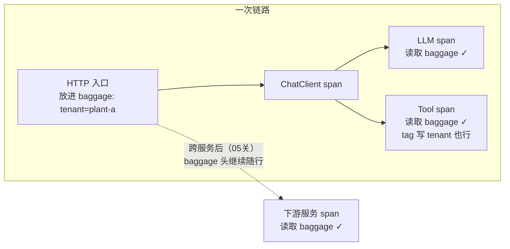

# 03 Baggage：业务属性随链路传播

> **定位**：traceId 把"链路"串起来了，但排查多租户问题时你还会问："这条链路是**哪个租户/哪个工单/哪个用户**的？"——把业务属性挂在链路上随 traceId 一起流动，就是 Baggage。本关讲透：remote/local 两类字段、MDC 关联（属性进日志）、Baggage 与 tag 的本质区别、以及"Baggage 会被带到下游每一个请求"带来的安全与体积代价。
>
> **读者画像**：完成 00-02 关，准备进入多租户/跨服务场景前的最后一块单机地基。
>
> **前置阅读**：[教程 00-基础与核心/02-ChatClient与对话模型]。

---

## 3.1 为什么 tag 不够：tag 与 Baggage 的本质区别

| | tag（02 关） | Baggage |
|--|------------|---------|
| 归属 | **单个 span** 的属性 | **整条 trace** 的属性 |
| 流动 | 不流动，只留在打的那个 span 上 | 随 `traceparent` 之后的专用头**跨 span、跨服务**流动 |
| 落点 | 每个想有的 span 都得自己打 | 下游任何 span 随时读，无需重新传参 |
| 典型用途 | 状态/结果（`tool.result=ok`） | 身份/上下文（`tenant-id`、`order-id`） |

一句话：**tag 是"这个 span 的备忘"，Baggage 是"整条链路的行李"**。你要在工具里知道 tenantId、又不想给每个方法加参数一路透传——Baggage 就是干这个的。



## 3.2 配置：三组字段键（配置元数据实证）

Boot 4.1（`spring-boot-micrometer-tracing` 模块）的 baggage 配置键（含默认值）：

```yaml
# application-observation.yml（本关完整配置；接 01 关的 sampling 段）
management:
  tracing:
    sampling:
      probability: 1.0
    baggage:
      remote-fields:      # ★ 跨服务随 header 流动的行李（W3C 下同名 header）
        - tenant-id
        - work-order-id
      local-fields:       # ★ 只在本服务内流动、不出网关的行李
        - internal-debug-flag
      correlation:
        enabled: true     # 默认即 true：baggage 进 MDC
        fields:           # ★ 哪些字段进 MDC（= 进日志方括号后面）
          - tenant-id
```

三个易错点：

- **`correlation.fields` 不配则日志里看不见**：`correlation.enabled=true` 只是总开关，哪些字段进 MDC 由 `fields` 枚举。想"处处可见"就显式列出。
- **remote-fields 是白名单不是声明**：没列进来的字段不随请求头出门——这是安全边界（3.5）。
- **字段名规范**：W3C 传播要求 header 名合法（小写连字符），`tenant-id` 合规，`tenantId` 不合规。

配好 `tenant-id` 进 MDC 后，日志变成：

```text
INFO [demo01,64f8a1c2...,aa11...] d.d.tools.TimeTool - 开始调用工具  {tenant-id=plant-a}
```

## 3.3 代码：写入、读取、作用域

Baggage API 在 `Tracer`（继承 `BaggageManager`，javap 实证）：`createBaggage(name)`、`createBaggageInScope(name, value)`（default 方法）、`getBaggage(name)`。写入时机 = 链路入口（这里用一个 WebFilter 模拟网关放行李；生产里就是网关/鉴权过滤器干这事）：

```java
// src/main/java/demo/demo01/obs/TenantBaggageFilter.java（本关完整版，新建 obs 包）
package demo.demo01.obs;

import io.micrometer.tracing.Tracer;
import org.springframework.core.annotation.Order;
import org.springframework.stereotype.Component;
import org.springframework.web.server.ServerWebExchange;
import org.springframework.web.server.WebFilter;
import org.springframework.web.server.WebFilterChain;
import reactor.core.publisher.Mono;

@Component
@Order(-200)   // ★ 早于业务过滤器执行：行李要先上车
public class TenantBaggageFilter implements WebFilter {

    private final Tracer tracer;

    public TenantBaggageFilter(Tracer tracer) {
        this.tracer = tracer;
    }

    @Override
    public Mono<Void> filter(ServerWebExchange exchange, WebFilterChain chain) {
        // ★ 模拟鉴权后得到租户；生产从 token/租户解析器获取
        String tenant = exchange.getRequest().getHeaders().getFirst("X-Tenant-Id");
        if (tenant == null) {
            tenant = "plant-a";
        }
        // ★ createBaggageInScope(name, value)：写入并使其在当前作用域可读
        //   WebFlux 下配合 Hooks.enableAutomaticContextPropagation 跨算子保持
        try (var baggage = tracer.createBaggageInScope("tenant-id", tenant)) {
            return chain.filter(exchange);
        }
    }
}
```

下游任意位置读取（TimeTool 里加读法；完整文件 = 02 关 2.2 版本 + 下面这行日志）：

```java
            // ★ 读取 baggage：getBaggage(name).get()；无值时为 null（javap 实证 BaggageView.get()）
            String tenant = tracer.getBaggage("tenant-id") == null
                    ? "(no-baggage)" : tracer.getBaggage("tenant-id").get();
            log.info("本工具执行于租户 {}", tenant);
```

ApplicationDemo01 需要 Reactor 自动传播（18 系列 06 关同款，完整文件）：

```java
// src/main/java/demo/demo01/ApplicationDemo01.java（本关完整版）
package demo.demo01;

import org.springframework.boot.SpringApplication;
import org.springframework.boot.autoconfigure.SpringBootApplication;
import reactor.core.publisher.Hooks;

@SpringBootApplication
public class ApplicationDemo01 {

    public static void main(String[] args) {
        Hooks.enableAutomaticContextPropagation();   // ★ Reactor Context ↔ ThreadLocal 桥，baggage 跨算子不断
        SpringApplication.run(ApplicationDemo01.class, args);
    }
}
```

### 验证（curl）

```bash
curl -X POST "http://localhost:8080/chat" \
  -H "X-Tenant-Id: plant-b" \
  -H "Content-Type: application/x-www-form-urlencoded" \
  -d "message=现在几点了"
```

预期：① 日志尾部 `{tenant-id=plant-b}`；② 工具日志打出"本工具执行于租户 plant-b"；③ 换 `plant-a` 重试，值跟着变——**全链路没给任何业务方法加参数**。

## 3.4 进 span：让下游每个 span 都带 tenant tag

Baggage 默认只进 MDC/日志，不自动变 tag。想让**每个 span** 都带 `tenant-id` tag（导出端能按租户过滤，07 关多租户治理依赖它），用 `tag-fields`：

```yaml
management:
  tracing:
    baggage:
      tag-fields:        # ★ 这些 baggage 字段同时作为 tag 落到 span 上
        - tenant-id
```

（配置元数据实证：`management.tracing.baggage.tag-fields` 真实存在。）`work-order-id` 就**不要**进 tag-fields——工单号近乎无限枚举，进 tag 就是基数爆炸（[教程 00-基础与核心/07-ReAct推理模式] 基数熔断同理）。

## 3.5 代价与安全：Baggage 不是越多越好

- **体积**：每个 remote-field 都会变成随行 header，下游**每一个**出站请求都背着它。字段多了就是给所有流量加税。
- **安全**：remote-fields 是**信任边界**——外部请求伪造 `tenant-id` 头直接进你的 baggage！正确姿势：入口过滤器**覆写**而非透传（3.3 代码从鉴权结果取值、忽略请求头的做法就是覆写；若直接透传头则必须白名单+格式校验）。绝不能把 `internal-debug-flag` 这类放 remote——它会泄漏到第三方 API（包括你的 LLM 供应商）。
- **敏感数据**：Baggage 会出网。用户姓名、token 禁入；只放 id 类。

## 3.6 常见误区

- **在无 span 的线程上 createBaggage**：Brave 的 baggage 依附 TraceContext，无上下文时写入会得到 NOOP——先有 span（自动或 02 关手动）再放行李。
- **以为 correlation.fields 会自动等于 remote-fields**：两组独立，想"日志可见+跨服务"两个都要写。
- **Baggage 当参数传递替代品**：跨层业务参数该走方法签名/Reactor Context；Baggage 只放**伴随观测**的身份属性，塞业务负载会让调用关系隐式化，架构腐化。

适用场景：多租户 id、灰度标（07 关 A/B 流量切分）、工单/会话号（08 关巡检工单关联）——一切"排障时必须知道，但不参与业务计算"的伴随属性。

不适用场景：大 payload（放对象/JSON）、高基数值（时间戳、用户输入原文）、机密（key、PII 明文）。

## 3.7 本关交付与下一关

| 交付 | 验证 |
|------|------|
| baggage 进日志 | `{tenant-id=plant-b}` 出现 |
| 任意层读 baggage | 工具日志打印租户 |
| tenant-id 进每个 span | `tag-fields` 后导出可见（04 关导出后复查） |

下一关 [教程 00-基础与核心/04-记忆与会话管理]：**记录与持久化**——traceId 回写响应头（前端报警有号可查）、结构化日志、以及把"链路档案"落库做审计——展示与记录的存储侧。

---

**实证基线**（javap，micrometer-tracing 1.7.0）：`BaggageManager.createBaggage(String)/getBaggage(String)/createBaggageInScope(String,String)`（default）、`BaggageView.get()`；配置键 `management.tracing.baggage.{remote-fields,local-fields,correlation.enabled,correlation.fields,tag-fields}`（spring-boot-micrometer-tracing 4.1.0 配置元数据）。
