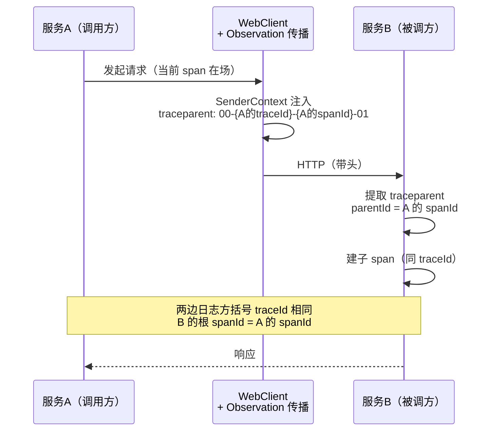
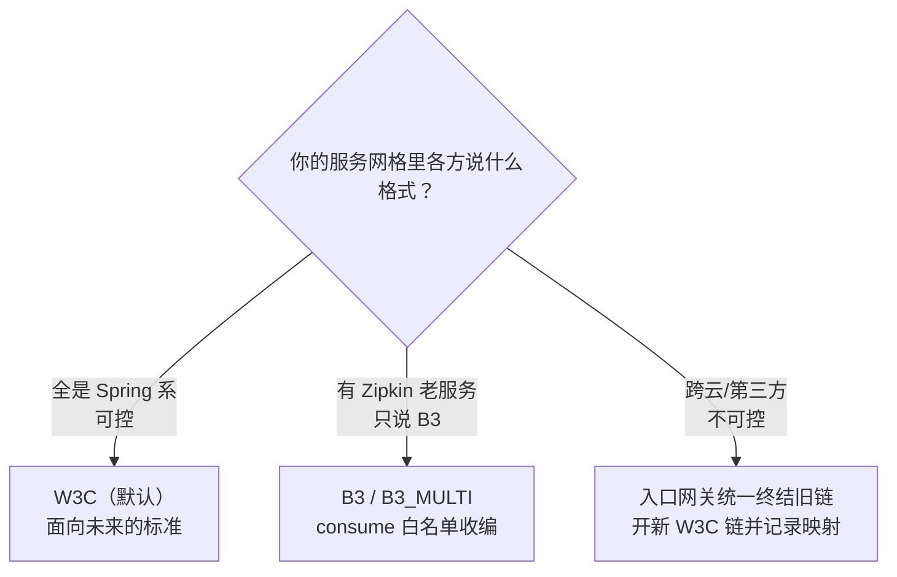

# 05 跨服务传播：traceparent 穿透 WebClient

> **定位**：单机的所有地基（生成/族谱/手动 span/Baggage/记录）已齐，本关第一次**跨进程**：服务 A（demo01 Agent 服务）通过 WebClient 调服务 B（模拟工具后端/LLM 网关），验证 traceId 坐着 `traceparent` 头过河、两边的日志和 span 拼成**同一棵树**。这是 07 关微服务架构的最小实验前置。
>
> **读者画像**：完成 00-04 关，第一次做"两个服务"的链路实验。
>
> **前置阅读**：[教程 06-TraceId全链路追踪/01-读懂族谱：traceId、spanId与span树 §1.3]（traceparent 报文）、[教程 00-基础与核心/03-工具调用]。
>
> **实验环境**：为不动 demo01 主体，服务 B 用**同一个 demo01 工程的第二个 Controller** 模拟（`/backend/time` 端点），"跨服务"先在同一进程内验证 header 行为；07 关再真正拆成两个进程。这样你只需要跑一个应用就能完成本关全部实验。

---

## 5.1 传播原理：谁负责塞 header



两个前提（缺一个链路就断，逐项自查）：

1. **调用方**：WebClient 构建时要接入 Observation/传播设施（Spring Boot 自动装配的 `WebClient.Builder` 已带；**自己 new 的 WebClient 不带**——最高频翻车点）。
2. **被调方**：服务端自动提取 header 建 server span（Boot 自动，前提是 00 关两个依赖都在被调方 classpath 上）。

Baggage 同车随行：`remote-fields` 白名单里的字段（03 关的 `tenant-id`）以同名 header 跟着 `traceparent` 过河。

## 5.2 服务 B 端点：先看得见传播的证据

在 demo01 里加"被调方"端点——它把**收到的关键 header 原样回显**，这是验证传播最硬的证据（完整文件）：

```java
// src/main/java/demo/demo01/controller/BackendController.java（本关完整版）
package demo.demo01.controller;

import io.micrometer.tracing.Tracer;
import lombok.extern.slf4j.Slf4j;
import org.springframework.web.bind.annotation.GetMapping;
import org.springframework.web.bind.annotation.RequestHeader;
import org.springframework.web.bind.annotation.RequestMapping;
import org.springframework.web.bind.annotation.RestController;
import reactor.core.publisher.Mono;

import java.util.Map;

@Slf4j
@RestController
@RequestMapping("/backend")
public class BackendController {

    private final Tracer tracer;

    public BackendController(Tracer tracer) {
        this.tracer = tracer;
    }

    // 模拟下游工具后端：回显关键 header + 自己看到的链路号
    @GetMapping("/time")
    public Mono<Map<String, String>> time(
            @RequestHeader(value = "traceparent", required = false) String traceparent,
            @RequestHeader(value = "baggage-tenant-id", required = false) String baggageTenant) {
        var span = tracer.currentSpan();
        return Mono.fromSupplier(() -> Map.of(
                "收到traceparent", traceparent == null ? "(无)" : traceparent,
                "收到baggage", baggageTenant == null ? "(无)" : baggageTenant,
                "B侧traceId", span == null ? "no-trace" : span.context().traceId(),
                "B侧spanId", span == null ? "no-trace" : span.context().spanId(),
                "serverTime", java.time.LocalTime.now().toString()));
    }
}
```

> Baggage header 名说明：Boot 4.1 的 W3C 传播把 remote-field `tenant-id` 以 `baggage-tenant-id` 头携带（`baggage-` 前缀 + 字段名，[W3C baggage 规范](https://www.w3.org/TR/baggage/) 的单头多字段格式之外，brave 桥的实现按字段名单头拆分）。**以本关实验的实际抓包为准**——把回显结果记下来，就是你的环境里最权威的传播格式证据。

## 5.3 服务 A 侧：TimeTool 经 WebClient 调下游

给 TimeTool 加一个"远程时间"工具，走自动装配的 WebClient.Builder（完整文件）：

```java
// src/main/java/demo/demo01/tools/TimeTool.java（本关完整版）
package demo.demo01.tools;

import io.micrometer.tracing.Tracer;
import lombok.extern.slf4j.Slf4j;
import org.springframework.ai.tool.annotation.Tool;
import org.springframework.web.reactive.function.client.WebClient;

import java.time.LocalDateTime;
import java.time.format.DateTimeFormatter;

@Slf4j
public class TimeTool {

    private final Tracer tracer;
    private final WebClient webClient;   // ★ 必须是自动装配 Builder 建的——传播设施在里面

    public TimeTool(Tracer tracer, WebClient.Builder webClientBuilder) {
        this.tracer = tracer;
        this.webClient = webClientBuilder.build();
    }

    @Tool(description = "获取系统的当前时间（会调用远程时间服务，优先使用这个）")
    public String getCurrentTime() {
        log.info("开始调用工具（将远程调用）");
        // ★ block 仅用于工具同步返回签名 demo；WebFlux 铁律下生产应改异步工具签名或 Mono 适配，
        //   且 block 不允许发生在 EventLoop 线程（本例由工具执行线程承载）
        var resp = webClient.get().uri("http://localhost:8080/backend/time")
                .retrieve()
                .bodyToMono(Map.class)
                .block();
        var span = tracer.currentSpan();
        log.info("A侧 spanId={}（B 应以它为 parentId）",
                span == null ? "no-trace" : span.context().spanId());
        return resp == null ? "(远程服务无响应)" : String.valueOf(resp.get("serverTime"));
    }
}
```

ChatConfig 注入 `WebClient.Builder`（完整文件）：

```java
// src/main/java/demo/demo01/config/ChatConfig.java（本关完整版）
package demo.demo01.config;

import demo.demo01.tools.TimeTool;
import io.micrometer.tracing.Tracer;
import org.springframework.ai.chat.client.ChatClient;
import org.springframework.context.annotation.Bean;
import org.springframework.context.annotation.Configuration;
import org.springframework.web.reactive.function.client.WebClient;

@Configuration
public class ChatConfig {

    @Bean
    public ChatClient chatClient(ChatClient.Builder builder, Tracer tracer,
                                 WebClient.Builder webClientBuilder) {
        return builder
                .defaultSystem(" 你必须严格遵守：在发起任何工具调用之前，先输出一段以【调用说明】开头的话，解释你需要什么信息、为什么调用该工具。输出【调用说明】之后才允许调用工具。")
                .defaultTools(new TimeTool(tracer, webClientBuilder))   // ★ 传入 WebClient.Builder
                .defaultAdvisors(new SimpleLogAdvisor())
                .build();
    }
}
```

## 5.4 实验与判读（本关核心动作）

```bash
curl -si -X POST "http://localhost:8080/chat" -H "X-Tenant-Id: plant-b" \
  -d "message=现在几点了" | grep -i x-trace-id
```

然后按这张判读表逐项核对（任何一项不符 → 5.5 排障表）：

| 证据 | 在哪看 | 预期 |
|------|--------|------|
| ① 传播头 | A/B 两侧日志或 B 回显 `收到traceparent` | `00-{A的traceId}-{A调用span的spanId}-01` |
| ② 同族 | A、B 两侧日志方括号 traceId | **相同** |
| ③ 父子 | B 侧首个 span 的 parentId | = A 侧 WebClient 调用 span 的 spanId |
| ④ baggage | B 回显 `收到baggage` | `plant-b` |
| ⑤ 采样位 | traceparent 末段 | `01`（本系列配置全采样） |

用 01 关的拼树法把 A、B 的日志合并画树：B 的 server span 会**长在 A 的 client span 下面**——这就是"跨服务一棵树"的最小证明。

## 5.5 断链排障表（工业 SOP 缩影）

| 症状 | 根因 | 修法 |
|------|------|------|
| B 收不到 traceparent | 自己 new 的 WebClient（无传播设施） | 用自动装配 `WebClient.Builder`（5.3） |
| B 收到但 B 侧是新 traceId | B 缺 tracing 依赖（00 关两坐标） | 补 `spring-boot-micrometer-tracing-brave` |
| traceId 同但 B 是根 span | B 的传播格式不匹配（如上游 W3C、下游只认 B3） | 核对 `management.tracing.propagation.consume/produce` |
| baggage 丢 | 字段没进 `remote-fields` 白名单 | 03 关 3.2 配置 |
| 异步/线程切换后断 | 未开 Reactor 自动传播 | `Hooks.enableAutomaticContextPropagation()`（03 关） |

## 5.6 传播格式选型（架构师视角）



配置实证（Boot 4.1 默认值）：`consume=['W3C','B3','B3_MULTI']`、`produce=['W3C']`——**默认就是收编策略**：听得懂老家话，出门只说标准话。多团队联调时的对齐动作：把各服务的 consume/produce 打在协作 wiki 首页。

适用场景：任何 ≥2 个服务的系统；SSE 流式链路（06 关在传播之上做展示）；消息中间件传播（Kafka 场景同思路，header 换成 record header，[教程 07-Kafka事件骨干/00-Kafka全景与核心概念] 结合处）。

不适用场景：进程内调用（白白多一层 header 处理）；调用不可信第三方时**不要**透传全部 baggage（03 关安全红线，只带必要字段或干脆终结链路）。

## 5.7 本关交付与下一关

| 交付 | 验证 |
|------|------|
| traceparent 过河 | B 回显非空 |
| 跨"服务"一棵树 | A/B 日志拼树成功 |
| baggage 随行 | B 回显 plant-b |
| 断链排障 SOP | 5.5 表五症状五修法 |

下一关 [教程 06-TraceId全链路追踪/06-展示：SSE推送trace时间线到前端]：**展示**——把 traceId 时间线用 SSE 推到前端页面，用户看得见"Agent 正在干什么 + 这一步的链路号"，报警体验闭环到 UI。

---

**实证基线**（javap / 配置元数据）：`management.tracing.propagation.{type,consume,produce}`（默认 W3C/B3 族）与 `management.tracing.baggage.remote-fields` 键真实；WebClient 传播依赖自动装配 Builder（Spring Boot 4.1 `WebClientAutoConfiguration` 体系）；`traceparent` 报文格式为 W3C 规范内容（链接见正文）。
