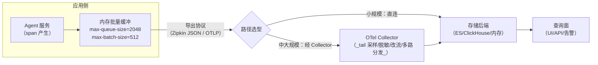
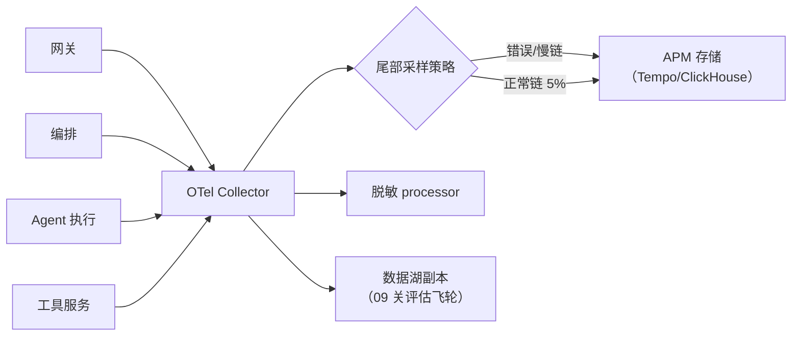

# 08 存储工程：span 数据落到哪、怎么存、怎么查

> **定位**：回答工业级三问的第一个——**怎么落地、怎么存储**。span 从应用吐出来只是开始：走什么管道（直发 vs Collector 汇聚）、落到什么后端（Zipkin 内存/ES/ClickHouse/Tempo）、存储建模为什么决定查询能力（traceId 点查 vs 标签组合查）、TTL 与体积怎么管。本关是选型+建模+容量的架构师课，代码给"应用侧导出配置"（零改码）与"查询路径"两段真实可跑的部分，后端安装遵循零额外安装偏好——只给坐标与配置，装不装由你决定。
>
> **读者画像**：完成 00-07 关，要把 span 从"demo 日志里的号"变成"可运营的存储资产"。
>
> **前置阅读**：[教程 00-基础与核心/07-ReAct推理模式]（分级采样——存储体量的第一道闸）。

---

## 8.1 全景：span 从产生到可查的四级流水线



四级各自回答一个问题：

| 级 | 问题 | 工业答案 |
|----|------|---------|
| 缓冲 | 应用别被慢后端拖死 | Boot 自带批量+超时（8.2 实证键） |
| 传输 | 谁来送 | 小规模直发；规模上来必加 Collector（8.3） |
| 存储 | 存哪、怎么建模 | 8.4 选型矩阵 |
| 查询 | 谁查、查多快 | 8.5 查询路径 |

## 8.2 应用侧导出：全部是配置，零改码（配置元数据实证）

### 路线 A：Zipkin 协议（本系列主线，简单直接）

> **需在 pom.xml 中添加依赖**（00 关两坐标之上追加；`spring-boot-starter-zipkin` 内部已含 bridge-brave 与 zipkin 模块，加了它前两关的 ② 可被覆盖，但显式保留无害）：

```xml
<dependency>
    <groupId>org.springframework.boot</groupId>
    <artifactId>spring-boot-starter-zipkin</artifactId>
</dependency>
```

```yaml
# application-observation.yml（追加段；Boot 4.1 配置元数据实证的键与默认值）
management:
  tracing:
    sampling:
      probability: 1.0          # 学习期全采；生产回到 07 关分级策略
  zipkin:
    tracing:
      endpoint: http://localhost:9411/api/v2/spans   # 默认值即此（实证）
      connect-timeout: 1s       # 默认 1s
      read-timeout: 10s         # 默认 10s
      encoding: json            # 默认 json
```

### 路线 B：OTLP 协议（已定 OTel 栈/要用 Collector 时选）

> **需在 pom.xml 中添加依赖**（OTel 桥；需引入后按 8.2 键核对——以下键已从 `spring-boot-micrometer-tracing-opentelemetry` 4.1.0 配置元数据实证）：

```xml
<dependency>
    <groupId>io.micrometer</groupId>
    <artifactId>micrometer-tracing-bridge-otel</artifactId>
</dependency>
<dependency>
    <groupId>org.springframework.boot</groupId>
    <artifactId>spring-boot-micrometer-tracing-opentelemetry</artifactId>
</dependency>
```

```yaml
management:
  opentelemetry:
    tracing:
      export:
        otlp:
          endpoint: http://localhost:4318/v1/traces    # OTLP HTTP
          compression: gzip                            # 默认 none，跨网段建议 gzip
        max-queue-size: 2048      # 默认（实证）：应用侧缓冲上限
        max-batch-size: 512       # 默认（实证）
        schedule-delay: 5s        # 默认（实证）：批量刷出周期
      limits:
        max-attributes: 128       # 默认（实证）：单 span 属性上限——防脏 span 撑爆存储
      sampler: parent-based-trace-id-ratio   # 默认（实证）：继承上游采样决策
```

> 路线 A/B 二选一：brave 桥与 otel 桥不要同时上（两个 Tracer 实现打架）。

**落地动作**：加依赖+配置后重启，`curl -X POST http://localhost:8080/chat -d "message=现在几点了"`，span 即开始批量外发——应用侧的"落地"就这么多，剩下的都是存储侧的事。

## 8.3 为什么中大规模要加 Collector（管道架构）

直连模式的三个死穴，Collector 一并解决：

1. **尾部采样需要"看到整条链再决策"**——应用侧头采样（07 关 7.3 图上半）在链路开头就决定了，错误链可能恰好没被采样。Collector 把多个服务发来的 span 按 traceId 聚齐后**尾部决策**：错误链/慢链 100% 留、正常链 5% 留。
2. **脱敏/改流**集中一处：PII 属性在进存储前剥掉（不用七个服务各改一遍），03/04 关红线在这里有唯一执行点。
3. **多路分发**：同一份 span 既进 APM 又进数据湖（09 关飞轮用），Collector 的 pipeline 一次配置。



（Collector 配置语法属 OTel 项目而非 Spring SDK，按需查阅 [OTel Collector 文档](https://opentelemetry.io/docs/collector/)；本文不编造其 processor 配置细节。）

## 8.4 存储选型矩阵：建模决定查询能力

先立**存储建模的核心矛盾**：span 查询只有两种形态——

- **点查**：已知 traceId，取整条链（排障 SOP 第 3 步）。
- **组合查**：按标签+时间窗找 trace 列表（"plant-b 租户最近 1 小时的错误链"）。

后端选型本质是选这两种查询的实现方式：

| 后端 | 建模方式 | 点查 | 组合查 | 运维成本 | 适用 |
|------|---------|------|--------|---------|------|
| Zipkin 内存 | `Map<traceId, spans>` | 极快 | 弱 | 零 | 学习/demo |
| Zipkin + ES | traceId 做路由键的文档 | 快 | 强（倒排） | 中（ES 集群） | 中小规模通用 |
| ClickHouse | 大宽表（span 一行） | 中（需 traceId 索引列） | 极强（列存聚合） | 中高 | 重分析/自建平台 |
| Grafana Tempo | 对象存储（S3）+ traceId 哈希分片 | 快 | 弱（靠 exemplar/派生指标） | 低（对象存储便宜） | 海量+低成本，"只点查"哲学 |
| 商用 APM | 厂商托管 | 快 | 强 | 花钱 | 不想自建 |

选型三问（ADR 风格，[附录 07-架构决策方法论]）：

1. **排障入口是"报障号点查"还是"主动巡检组合查"？** 只前者 → Tempo 的"廉价点查"足够；要后者 → ES/ClickHouse。
2. **span 量级？** 粗算：`日请求数 × 平均 span/请求 × 平均 span 字节数 × 采样率`。10 万日请求 × 40 span × 1KB × 5% ≈ 200MB/日——对象存储随便放；100% 采样 × 100 倍流量就要 ClickHouse 分区表+TTL 硬扛。
3. **要不要把 span 当分析资产？**（09 关成本归因/飞轮）要 → 列存（ClickHouse）优势放大。

ClickHouse 建模示例（span 宽表，教学示意 DDL）：

```sql
-- 概念 DDL（教学示意；列名对齐 OTel span 语义约定，非任何 SDK API）
CREATE TABLE spans
(
    trace_id    String,            -- ★ 点查主键第一列
    span_id     String,
    parent_id   String,
    name        LowCardinality(String),   -- ★ 低基数列：span 名（不是用户输入！）
    kind        LowCardinality(String),
    tenant_id   LowCardinality(String),   -- ★ 03/07 关 baggage tag 进列——组合查的钥匙
    is_error    UInt8,
    duration_ms UInt32,
    start_time  DateTime,
    attributes  Map(String, String)       -- 高基数杂项收进 Map，不建索引
)
ENGINE = MergeTree
PARTITION BY toDate(start_time)           -- ★ 按天分区：TTL 删除=整分区落盘即走
ORDER BY (trace_id, start_time)           -- ★ 点查主键
TTL start_time + INTERVAL 14 DAY;         -- ★ 04 关留存红线在存储层的落地
```

三个建模铁律（任何后端通用）：

- **低基数列显式声明、高基数塞非索引区**——`tenant_id`（有限枚举）可索引，`work-order-id`（近似无限）只留 attributes，跟 03 关 tag-fields 一个道理。
- **TTL 与分区对齐**：删除靠整分区过期，不做行级 delete。
- **traceId 永远是第一索引列**：全部分析路径的第一步都是"按号取链"。

## 8.5 查询路径：怎么查（含可直接跑的 API）

### Zipkin 查询 API（工具公开 REST 契约，[Zipkin API 文档](https://zipkin.io/zipkin-api/)）

```bash
# ① 点查：按 traceId 取整条链（排障 SOP 第 3 步的机械化）
curl -s http://localhost:9411/api/v2/trace/64f8a1c2b9d04e7a3b2c1d0e9f8a7b6c | python3 -m json.tool | head -30

# ② 组合查：近 1 小时、服务名 = demo01、有错误的 trace 列表
curl -s "http://localhost:9411/api/v2/traces?serviceName=demo01&lookback=3600000&limit=10"
```

### 自建查询面（与 04 关档案打通）

工业平台通常不让所有人直连 APM——在控制面封一个只读查询端点，校验权限后代理后端。骨架（完整文件，Zipkin 后端版；零新依赖，WebClient 已有）：

```java
// src/main/java/demo/demo01/controller/TraceQueryController.java（本关完整版）
package demo.demo01.controller;

import org.springframework.beans.factory.annotation.Autowired;
import org.springframework.http.MediaType;
import org.springframework.web.bind.annotation.GetMapping;
import org.springframework.web.bind.annotation.PathVariable;
import org.springframework.web.bind.annotation.RequestMapping;
import org.springframework.web.bind.annotation.RestController;
import org.springframework.web.reactive.function.client.WebClient;
import reactor.core.publisher.Mono;

@RestController
@RequestMapping("/trace-api")
public class TraceQueryController {

    private final WebClient zipkin;   // ★ 复用 05 关自动装配 Builder；baseUrl 指向存储后端

    @Autowired
    public TraceQueryController(WebClient.Builder builder) {
        this.zipkin = builder.baseUrl("http://localhost:9411").build();
    }

    // 点查：GET /trace-api/{traceId} —— 排障 SOP 第 3 步的内部封装
    @GetMapping(value = "/{traceId}", produces = MediaType.APPLICATION_JSON_VALUE)
    public Mono<String> byTraceId(@PathVariable String traceId) {
        return zipkin.get().uri("/api/v2/trace/{id}", traceId)
                .retrieve()
                .bodyToMono(String.class);   // ★ 原样转发 JSON；生产在此叠加权限校验与字段脱敏
    }
}
```

验证（先完成 8.2 路线 A 且 Zipkin 已在 9411 端口跑起来，否则此步跳过——零安装偏好下它是可选项）：

```bash
TID=$(curl -si -X POST http://localhost:8080/chat -d "message=现在几点了" | grep -i '^x-trace-id' | tr -d '\r' | awk '{print $2}')
curl -s "http://localhost:8080/trace-api/$TID" | python3 -m json.tool | head -20
```

## 8.6 容量与留存：把 04 关红线落到存储层

| 层 | 动作 | 对应 |
|----|------|------|
| 产生 | 分级采样（错误链必留） | 07 关 7.3 |
| 管道 | Collector 脱敏 + max-attributes=128 限属性 | 8.2/8.3 |
| 存储 | 分区+TTL（span 14 天 / 日志 7~30 天 / 档案 90 天+） | 04 关红线表 |
| 查询 | 控制面代理+鉴权+脱敏 | 8.5 |
| 冷数据 | 超留存期归档对象存储（合规要长留时只归档"档案"不归档 span） | [附录 12-AI治理与合规] |

一条架构师经验：**留存预算谈不下来时，先砍 span 采样率、再砍 span 留存、最后才动档案**——档案是审计底线，span 是排障奢侈品，优先级天然分明。

适用场景：任何 span 要出 demo 的系统；多服务+多团队（Collector 脱敏统一执行点）；有"按租户查链路"运营需求的 SaaS（低基数租户列是钥匙）。

不适用场景：单体+单人（Zipkin 内存都嫌重，日志 grep 足够）；合规禁止 span 含 prompt 内容的行业——先上脱敏管道再谈存储（`spring.ai.chat.observations.log-prompt` 保持关闭，[教程 02-SpringAI核心机制/07-MCP协议]）。

## 8.7 常见误区

- **两个桥同时上**（brave+otel）：Tracer 冲突，随机出现"半条链"。路线 A/B 二选一。
- **拿组合查需求选了 Tempo**：Tempo 哲学是"廉价点查+派生指标"，组合查要靠 TraceQL/生成器补——选型时没问 8.4 三问就会踩。
- **Collector 当万能保险箱**：应用侧不控基数（tag 塞 userId），Collector 脱敏是**字段级**补救，救不了基数爆炸——基数治理必须在源头（03 关 tag-fields 白名单）。
- **TTL 只在存储设、管道无限缓冲**：Collector/队列的磁盘同样会满，缓冲层要有丢弃策略（丢最旧的，保错误链）。

## 8.8 本关交付与下一关

| 交付 | 验证 |
|------|------|
| 导出配置（A/B 路线） | 重启后后端收到 span |
| 选型三问+建模铁律 | 过一次 ADR（[附录 08]） |
| 点查/组合查路径 | /trace-api/{traceId} 返回整链 JSON |

下一关 [教程 00-基础与核心/09-多Agent协作]：**使用运营**——存起来的 traceId 怎么"用出价值"：告警（SLO/错误预算）、容量规划、按租户成本归因、评估飞轮与治理看板。

---

**实证基线**：`management.zipkin.tracing.{endpoint,connect-timeout,read-timeout,encoding}`、`management.opentelemetry.tracing.export.{otlp.endpoint,otlp.compression,max-queue-size,max-batch-size,schedule-delay,timeout}`、`...limits.max-attributes`、`...sampler`（默认 parent-based-trace-id-ratio）均出自 `spring-boot-zipkin` 4.1.0 与 `spring-boot-micrometer-tracing-opentelemetry` 4.1.0 配置元数据；Zipkin REST `/api/v2/trace/{id}`、`/api/v2/traces` 为该工具公开 API 契约；ClickHouse DDL 与 Collector 配置显式标注教学示意/查阅官方文档。
