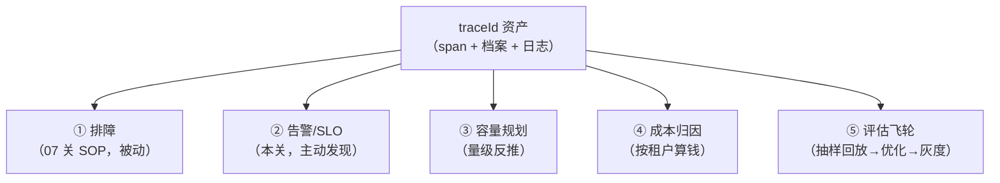
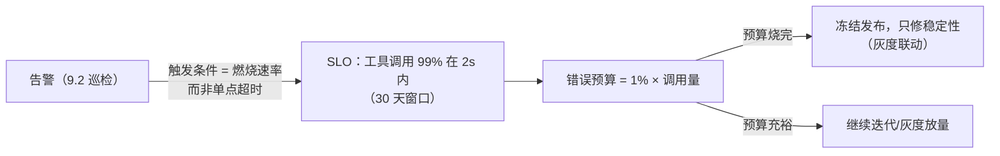
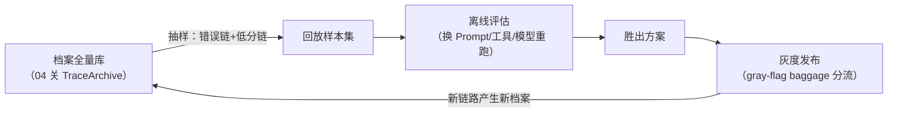

# 09 使用运营：从排障到告警、成本与飞轮

> **定位**：回答工业级三问的最后一个——**怎么使用**。存起来的 traceId 若只用于"出事再查"，只兑现了 10% 的价值。本关讲五个运营场景的工程化：①告警与 SLO 错误预算（从被动排障到主动发现）、②容量规划（span 量反推服务容量）、③按租户成本归因（baggage 列的价值兑现）、④评估飞轮（trace 抽样回放）、⑤治理看板（基数/PII/留存的日常巡检）。代码给可直接跑的"指标侧告警"最小实现（Actuator 自带 /actuator/metrics 直查，遵循零额外安装偏好）。
>
> **读者画像**：完成 00-08 关；要回答老板"这套 trace 系统养着干嘛"的架构师。
>
> **前置阅读**：[教程 06-TraceId全链路追踪/07-管控分离微服务落地：traceId架构 §7.3]（分级采样）、[教程 06-TraceId全链路追踪/08-存储工程：span数据落到哪怎么存怎么查]（存储与查询路径）。

---

## 9.1 价值全景：traceId 的五种用法



五种用法对"数据形态"的要求不同——这解释了为什么 07/08 关坚持三层分级：

| 用法 | 需要的数据 | 分层来源 |
|------|-----------|---------|
| ①排障 | 单条完整链（点查） | span（错误链必留） |
| ②告警 | 聚合指标（错误率/时延分布） | span 聚合成指标，或直接 Meter 指标 |
| ③容量 | 计数（QPS×span 数/日） | 导出侧计数即可，不需 span 本身 |
| ④成本 | token 数 × 租户 | gen_ai tag + baggage 租户列（08 关宽表） |
| ⑤飞轮 | 有代表性的链样本 + 档案上下文 | 档案全量 + 采样 span |

**架构启示**：②③根本不需要"存 span"——聚合发生在导出管道上。只有①④⑤真的消费存储。这就是"指标打天下、trace 做深潜"的分工（[教程 04-企业级架构主干/02-全链路可观测性]）。

## 9.2 场景①→②：从"事后排障"升级为"SLO 告警"

### 最小实现：指标侧直接告警（零额外安装）

Micrometer 已把 span 侧的时延/错误聚合成指标（18 系列已实证的 `spring.ai.chat.client` 等时延指标体系）。用 Actuator 直查：

```bash
# 工具调用时延分布（P95 关注点）
curl -s "http://localhost:8080/actuator/metrics/spring.ai.tool" \
  | python3 -m json.tool | grep -A3 percentile

# 观测 registry 里有哪些可用指标
curl -s "http://localhost:8080/actuator/metrics" | python3 -c "import json,sys; print('\n'.join(json.load(sys.stdin)['names']))" | grep spring.ai
```

把"查指标"变成"自动巡检+告警"的最小组件（完整文件；定时巡检 P95 超阈即打告警日志——生产接钉钉/Slack webhook，这里遵循零安装只落日志）：

```java
// src/main/java/demo/demo01/obs/SloPatrolJob.java（本关完整版）
package demo.demo01.obs;

import io.micrometer.core.instrument.MeterRegistry;
import io.micrometer.core.instrument.Timer;
import org.springframework.beans.factory.annotation.Autowired;
import org.springframework.scheduling.annotation.Scheduled;
import org.springframework.stereotype.Component;

import java.time.Duration;
import java.util.concurrent.TimeUnit;

@Component
public class SloPatrolJob {

    private final MeterRegistry registry;

    @Autowired
    public SloPatrolJob(MeterRegistry registry) {
        this.registry = registry;
    }

    // ★ 每 30s 巡检一次工具 P95：SLO=2s（教学阈值）
    @Scheduled(fixedDelay = 30_000)
    public void patrolToolP95() {
        Iterable<Timer> timers = registry.find("spring.ai.tool").timers();
        for (Timer t : timers) {
            double p95 = t.max(TimeUnit.MILLISECONDS) > 0
                    ? t.percentile(0.95, TimeUnit.MILLISECONDS) : 0;
            if (p95 > 2000) {
                // ★ 告警必须带"下一步"：SOP 入口是按 traceId 深潜（07 关六步）
                System.err.printf("[SLO告警] 工具时延 P95=%.0fms 超过 2000ms；请到 /trace-api 按近期错误链 traceId 深潜%n", p95);
            }
        }
    }
}
```

启动类补 `@EnableScheduling`（完整文件）：

```java
// src/main/java/demo/demo01/ApplicationDemo01.java（本关完整版）
package demo.demo01;

import org.springframework.boot.SpringApplication;
import org.springframework.boot.autoconfigure.SpringBootApplication;
import org.springframework.scheduling.annotation.EnableScheduling;
import reactor.core.publisher.Hooks;

@SpringBootApplication
@EnableScheduling   // ★ 09 关：SLO 巡检定时任务
public class ApplicationDemo01 {

    public static void main(String[] args) {
        Hooks.enableAutomaticContextPropagation();
        SpringApplication.run(ApplicationDemo01.class, args);
    }
}
```

### SLO 与错误预算（架构师层）



要点：告警条件用**燃烧速率**（budget burn rate，如 2 小时烧掉 5% 预算才 page），不是单次超时——单点超时是常态噪音。深挖见 [教程 05-Observation可观测/07-指标治理：Token计量、SLO与基数熔断]（SLO 与基数熔断）与 [教程 04-企业级架构主干/02-全链路可观测性]。

## 9.3 场景③容量规划：用导出计数反推

容量公式（周会就能算，不需要查任何一条 span）：

```text
日 span 量 = 日请求数 × 平均 span/请求（数一两条典型链即得，01 关拼树法）
存储增量   = 日 span 量 × 平均 span 字节 × 采样率
导出带宽   = 存储增量 / 批量周期（对照 8.2 的 max-batch-size/schedule-delay 是否够）
```

决策样例：采样从 5% 提到 20%（新租户重点保障）→ 存储增 4 倍 → ClickHouse 分区 TTL 从 14 天压到 7 天平衡预算——**采样率、留存期、成本三者是一个三角**，traceId 运营就是不断调这个三角。

## 9.4 场景④按租户成本归因：baggage 列的价值兑现

08 关宽表把 `tenant_id` 做成低基数列，就是为了这一步（ClickHouse 概念 SQL，教学示意）：

```sql
-- 概念 SQL（对齐 08 关 spans 宽表 DDL）
SELECT tenant_id,
       count()                                   AS calls,
       sum(duration_ms) / 1000                   AS cpu_seconds,
       sum(length(attributes['gen_ai.usage.tokens'])) AS token_proxy
FROM spans
WHERE start_time > now() - INTERVAL 1 DAY AND name = 'spring.ai.chat'
GROUP BY tenant_id
ORDER BY token_proxy DESC;
```

归因结果的三个去向：①租户账单（SaaS 计量）；②配额联动（Top1 租户超配额触发限流，[教程 多租户] 主题）；③模型路由决策（token 大户路由到便宜模型，成本治理闭环，[附录 17-路由与推理策略]）。**注意**：token 精确值走 `gen_ai.client.token.usage` 指标体系（18 系列实证），span 侧只做链路对账。

## 9.5 场景⑤评估飞轮：trace 样本变成优化素材

traceId 体系跑稳后的高阶玩法（接 [教程 数据飞轮] 主题与 [项目 26-企业级Agent数据飞轮平台]）：



traceId 在飞轮里的角色：**样本的主键**。档案提供"当时问了什么"，span 提供"当时慢在哪、错在哪"，重放时新链路新 traceId 与旧 traceId 在评估报告里成对出现——没有这个稳定主键，"改进了多少"就说不清。gray-flag 用 03 关 baggage 传（低基数枚举：canary/stable），网关注入、各服务 span 落 tag，回滚判定直接查两个 flag 的时延/错误对比。

## 9.6 场景之五补：治理看板（trace 系统自身的体检）

养 trace 系统的人每周必看的四格：

| 看什么 | 怎么看 | 出问题的动作 |
|--------|--------|-------------|
| 基数健康 | 指标 tag 的 distinct 值数（[教程 05-Observation可观测/07-指标治理：Token计量、SLO与基数熔断] 基数熔断） | 找到塞 userId 的 tag，源头改 tag-fields 白名单 |
| PII 泄漏 | 抽样 span 的 attributes 人工巡检 + Collector 脱敏命中数 | 补脱敏规则；评估 8.2 的 limits/max-attributes 是否过宽 |
| 断链率 | 组合查里 parentId 无父的 span 占比 | 05 关断链排障表定位漏配服务 |
| 采样有效性 | 错误链召回率（档案有错链、span 端能查到的比例） | 调尾部采样权重（8.3） |

## 9.7 常见误区

- **告警直接用单次超时**：LLM 调用天然抖动，单点阈值 = 每天误报到麻木；用燃烧速率/窗口聚合。
- **成本归因用 span 全量算**：又贵又慢；指标侧出账（token 指标），span 只做对账抽查。
- **飞轮抽样只抽好样本**：错误链和低分链才是改进素材；档案"全量"的价值就在这里（07 关为什么档案永不采样）。
- **看板只看别人的系统**：trace 系统自身不体检，基数/PII 问题会潜伏到存储账单爆炸那天才暴露。

适用场景：SaaS 多租户（④是刚需）、有 SLO 承诺的平台（②）、迭代频繁的 Agent 产品（⑤灰度决策要数据）。不适用场景：内部低频工具（②⑤过度工程，日志+档案已够）；初创 demo 期全部可缓，但 9.6 的基数健康建议从第一天就盯。

## 9.8 本关交付与下一关

| 交付 | 验证 |
|------|------|
| SLO 巡检任务 | SloPatrolJob 超阈打告警 |
| 容量三角公式 | 算出当前配置的日增量 |
| 五场景价值地图 | 向上汇报一页纸 |

收官关 [教程 06-TraceId全链路追踪/10-综合实战：工业巡检Agent的traceId闭环]：**综合实战**——把 00-09 全部能力串成工业巡检 Agent 的可运行闭环。

---

**实证基线**：`MeterRegistry.find(String).timers()`、`Timer.percentile(double,TimeUnit)/max(TimeUnit)`（micrometer-core 1.17.0 真实 API）；`@Scheduled/@EnableScheduling`（Spring 真实注解）；9.4 SQL 显式标注概念示意（对齐 08 关 DDL）；SLO/燃烧速率/飞轮为方法论内容，出处 [教程 05-Observation可观测/07-指标治理：Token计量、SLO与基数熔断]、[教程 04-企业级架构主干/02-全链路可观测性]。
