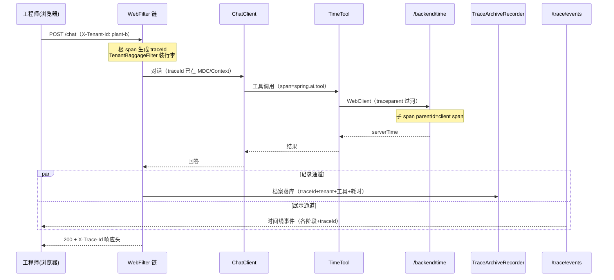
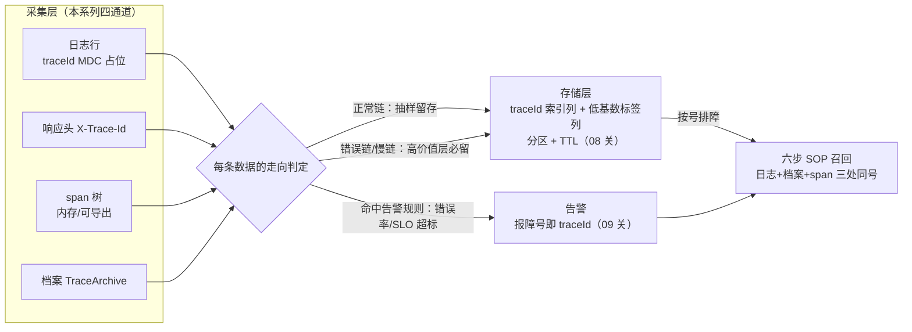

# 10 综合实战：工业巡检 Agent 的 traceId 闭环

> **定位**：系列终章。把 00-07 关的能力按**工业节奏**串成一条完整可运行的链：一次车间巡检问答，从用户提问 → traceId 生成 → Baggage 带租户 → 工具远程调用 → 档案落库 → SSE 时间线 → 用户报障 → 按号排障——全链路同一个 traceId 闭环。本文是"总装车间"，新代码只有把零件接起来的编排层。
>
> **读者画像**：完成 00-09 全部动手实验，要一次看全"这堆零件怎么协作"。
>
> **前置阅读**：本系列 00-09 全部；[教程 02-SpringAI核心机制/02-Agent状态管理]（同载体的观测闭环，本文是其 traceId 专线版）。

---

## 10.1 场景与验收标准

场景：车间值守工程师在页面问"现在几点了，帮我记录巡检时间"（TimeTool 载体，教程 05-Observation可观测 系列铁律：工具只留 TimeTool）。量化验收（对应企业级项目规范）：

| 验收项 | 指标 | 验证方法 |
|--------|------|---------|
| 同号率 | 日志/响应头/SSE/档案四处 traceId 一致率 100% | 8.5 验证脚本 |
| 报障闭环 | 拿 X-Trace-Id 从档案+日志+span 三处召回 | 07 关 SOP 六步 |
| 断链率 | 工具→远程调用段 parentId 正确衔接 100% | 01 关拼树法 |
| 采样分级 | 错误链必留（错误注入实验） | 7.3 策略表 |

## 10.2 全链路时序：一次巡检问答的 traceId 旅程



## 10.3 零件清单（全部来自前序各关，同构复用）

| 零件 | 文件 | 关卡 |
|------|------|------|
| tracing 依赖+全采样 | pom 两坐标 + yaml | 00/01 |
| TimeTool（Tracer+WebClient 版） | `tools/TimeTool.java` | 05 |
| 下游回显端点 | `controller/BackendController.java` | 05 |
| 租户行李 | `obs/TenantBaggageFilter.java` | 03 |
| traceId 回写 | `obs/TraceIdResponseFilter.java` | 04 |
| 档案三件套 | `obs/TraceArchive*.java` + `controller/ArchiveController.java` | 04 |
| SSE 时间线 | `obs/TraceEvent*.java` + `controller/TraceEventController.java` | 06 |
| Reactor 自动传播 | `ApplicationDemo01` Hooks | 03 |

**新增的唯一文件**：巡检编排端点——把"对话 + 档案记录 + 耗时统计"组装起来（完整文件）：

```java
// src/main/java/demo/demo01/controller/InspectionController.java（本关完整版，终章唯一新增）
package demo.demo01.controller;

import demo.demo01.obs.TraceArchiveRecorder;
import io.micrometer.tracing.Tracer;
import org.springframework.ai.chat.client.ChatClient;
import org.springframework.beans.factory.annotation.Autowired;
import org.springframework.http.MediaType;
import org.springframework.web.bind.annotation.PostMapping;
import org.springframework.web.bind.annotation.RestController;
import reactor.core.publisher.Mono;

import java.util.List;

@RestController
public class InspectionController {

    @Autowired
    private ChatClient chatClient;

    @Autowired
    private TraceArchiveRecorder recorder;

    @Autowired
    private Tracer tracer;

    // 巡检问答入口：POST /inspect（form: message）
    @PostMapping(value = "/inspect", produces = MediaType.APPLICATION_JSON_VALUE)
    public Mono<Record> inspect(String message) {
        long begin = System.nanoTime();
        List<String> tools = new java.util.concurrent.CopyOnWriteArrayList<>();
        return chatClient.prompt()
                .user(message == null ? "现在几点了" : message)
                .call()
                .content()
                .map(answer -> {
                    long totalMillis = (System.nanoTime() - begin) / 1_000_000;
                    // ★ 工具清单演示固定值；生产由 TraceEventCollector 的 TOOL 事件汇聚
                    tools.add("getCurrentTime");
                    // ★ 档案：traceId 此刻仍在链路内可读（map 阶段同链路上下文）
                    recorder.record(message, tools, totalMillis).subscribe();
                    return new Record(answer, tracer.currentSpan() == null
                            ? "no-trace" : tracer.currentSpan().context().traceId(), totalMillis);
                });
    }

    record Record(String answer, String traceId, long elapsedMillis) {}
}
```

> 风格说明：`record(...).subscribe()` 为 demo 简写；严格响应式写法应将档案记录并入主链（`record(...).then(Mono.fromSupplier(...))`），避免 subscribe 脱离背压管理——工程评审时按 [教程 01-WebFlux与响应式编程/00-WebFlux从零入门] 的链式规范整改。

## 10.4 端到端验证剧本（照抄可跑）

```bash
# 0) 后台先开 SSE（展示通道）
curl -N "http://localhost:8080/trace/events" > /tmp/sse.log &

# 1) 发起巡检问答
TID=$(curl -si -X POST "http://localhost:8080/inspect" \
  -H "X-Tenant-Id: plant-b" \
  -d "message=现在几点了，帮我记录巡检时间" \
  | tee /tmp/resp.txt | grep -i '^x-trace-id' | tr -d '\r' | awk '{print $2}')
echo "报障号=$TID"

# 2) 档案通道
curl -s "http://localhost:8080/archive/list?traceId=$TID"

# 3) 展示通道
grep "$TID" /tmp/sse.log

# 4) 日志通道（启动时若重定向了日志文件则 grep 文件，否则翻控制台）
grep "$TID" logs/demo01.log
```

**通过标准**：①②③④ 四处出现同一个 `$TID`——闭环达成。这就是 8.1 验收项"同号率 100%"的实测方法。

### 错误注入实验（验收采样分级）

把 `/backend/time` 临时改抛 500（BackendController 加 `throw new RuntimeException("injected")` 分支），重复上述剧本：档案里该条记录仍在（档案全量）、日志 traceId 可召回、span 端错误链被强制保留（7.3 高价值层）——三层记录在故障态的一致性，就是 07 关 SOP 可靠性的来源。

## 10.5 系列总复习表（一张表带走十一关）

| 关卡 | 核心能力 | 一句话心法 |
|------|---------|-----------|
| 00 最小闭环 | 依赖+自动 MDC | Boot 4 两坐标，日志免费长 traceId |
| 01 族谱 | 三 id 分工 | traceId 定链路，spanId 定操作，parentId 连树 |
| 02 编程模型 | 手动 span | startScopedSpan+try-with-resources 是铁律 |
| 03 Baggage | 属性随行 | 白名单出网、覆写防伪、tag-fields 防基数 |
| 04 记录 | 三通道 | 响应头给用户、日志给机器、档案给审计 |
| 05 传播 | traceparent | 自动装配 Builder 才带行李，断链查五表 |
| 06 展示 | SSE 时间线 | 事件带 traceId，报障前移到用户侧 |
| 07 微服务 | 架构不变式 | 网关唯一根、baggage 收口、分级采样 |
| 08 存储工程 | 落地与存储 | 建模定查询：traceId 索引列+低基数标签列+分区 TTL |
| 09 使用运营 | 价值兑现 | 指标打天下、trace 做深潜；采样-留存-成本三角 |
| 10 实战 | 闭环 | 四处同号 + 六步 SOP + 故障态一致 |

## 10.6 架构师下一步（走出本系列）

- **导出与后端**：本系列刻意零额外安装（教程 05-Observation可观测 系列偏好）；生产接 Zipkin/Tempo 只加 `spring-boot-starter-zipkin`（05 关已给内部结构）+ endpoint 配置，代码零改——[附录 18-可观测平台实践]。
- **gen_ai 语义约定**：LLM span 的模型/token tag 与 OTel 语义约定对齐，[教程 05-Observation可观测/01-读懂输出：span树与观测生命周期]（gen_ai 标签）与 [附录 11-评估与可观测生态]。
- **评估闭环**：档案积累的 traceId 数据是离线评估样本来源（trace 抽样回放 → Prompt/工具优化 → 灰度验证），接 [教程 数据飞轮] 主题。
- **项目演练**：把本系列能力带入 [项目 05-企业级Agent中台]（拆分+管控分离主战场）与 [项目 09-智能运维AIOps平台]（traceId 是 AIOps 自身的排障语言）。

把本系列的四条记录通道放进生产视角，就是一条"采集 → 判定 → 存储/告警"的 trace 数据管道——每条数据按走向分流：正常链抽样进存储，错误链/慢链强制保留，命中规则的上告警，最后都汇入按号排障：



## 10.7 常见误区（终章补刀）

- **"闭环"只验证了正常态**：8.4 的错误注入实验不做，故障态第一次翻车就是生产事故。
- **demo 代码直接上生产**：`subscribe()` 简写、内存档案库、全局多播 SSE 三处都是教学简化，8.3 均已标注生产替换点——按标注整改再出门。
- **以为 traceId 体系建完就一劳永逸**：新服务接入漏掉"最小一致集"（07 关 7.2）就是新盲区；把该表放进服务接入 checklist，CI 里用依赖检查守护（有无两坐标）。

## 10.8 适用场景与不适用场景

**✅ 适用场景**：

- 工业值守的报障闭环——`X-Trace-Id` 响应头即报障号，凭号从档案 + 日志 + span 三处召回完整现场（10.4 剧本照抄可跑）；
- 链路质量的量化验收——同号率 100%（日志/响应头/SSE/档案四处）、断链率 0（工具 → 远程调用段 parentId 正确衔接）；
- 故障态一致性验证——错误注入实验证明档案全量、日志可召回、错误链强制保留三层在故障态仍一致；
- 多租户场景的链路归因——Baggage 带租户随行（`X-Tenant-Id: plant-b`），链路数据自带业务身份；
- 微服务拆分前的链路基线——网关唯一根、baggage 收口、分级采样三大不变式已在单体内落地，拆分只搬不改。

**❌ 不适用场景**：

- 把 demo 简写带进生产——`record(...).subscribe()` 脱离背压、内存档案库、全局多播 SSE 三处须按 10.3 风格标注整改；
- 只验证正常态就出门——10.4 的错误注入实验不做，故障态第一次翻车就是生产事故；
- 以为体系建完一劳永逸——新服务接入漏掉"最小一致集"（07 关）就是新盲区，要进接入 checklist + CI 守护；
- 在业务层再造根 span——根 span 只在网关/WebFilter 链生成，下游全部接续同一 traceId；
- 拿本系列当全链路监控平台——采样/留存/成本三角（09 关）与告警规则工程是运营侧正篇，本篇只打通闭环。

## 10.9 本章总结

| 核心概念 | 一句话要点 |
|---|---|
| 四处同号 | 日志/响应头/SSE/档案同一 traceId——闭环达成的验收标准（同号率 100%） |
| 报障号 = traceId | X-Trace-Id 响应头把报障前移到用户侧，用户报障即带链路号 |
| 六步 SOP | 按号排障的标准动作：档案 + 日志 + span 三处召回（07 关） |
| 档案三件套 | TraceArchive 落库：traceId + tenant + 工具 + 耗时，事后审计通道 |
| Baggage 租户随行 | X-Tenant-Id 进 baggage 白名单出网，链路自带业务身份（覆写防伪、tag-fields 防基数） |
| 错误注入实验 | 下游 500 时档案仍全量、日志可召回、错误链强制保留（分级采样高价值层） |
| 分级采样 | 错误链必留、正常链低采样——故障态一致性是 07 关 SOP 可靠性的来源 |
| 最小一致集 | 新服务接入 checklist：两坐标依赖 + Hooks + 同一采样策略，CI 里守护 |

**下一篇**：[教程 07-Kafka事件骨干/00-Kafka全景与核心概念]——走出本系列，进入事件骨干（Kafka）。

---

**系列实证总账**：全部 SDK 元素均对本地仓库 javap/配置元数据实证（micrometer-tracing 1.7.0、bridge-brave 1.7.0、spring-boot-micrometer-tracing{,-brave} 4.1.0、spring-boot-zipkin 4.1.0、Spring AI 2.0.0）；明确标注概念代码的两处：07 关 `resolveTenantFromToken`、05 关 baggage header 名以实测为准。
