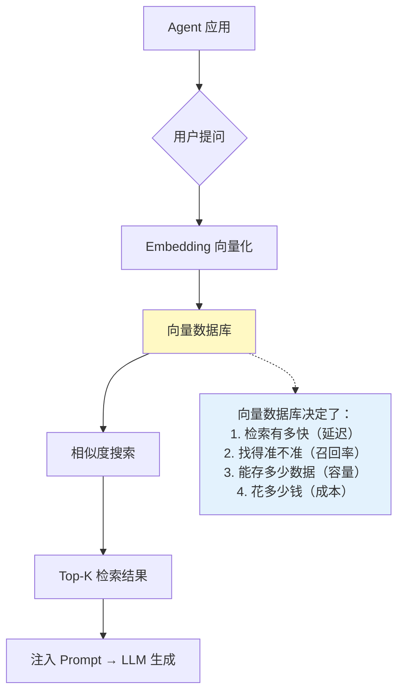
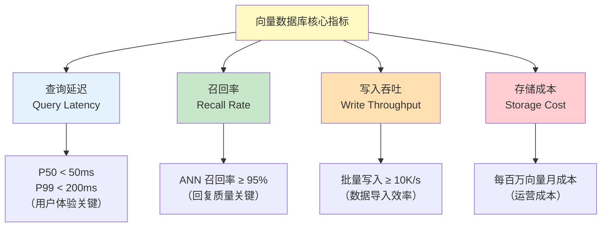
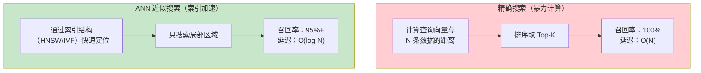
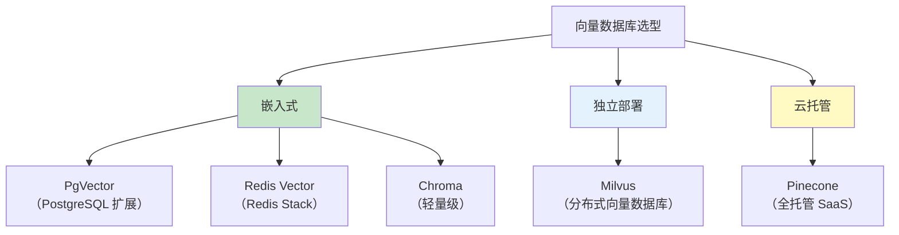
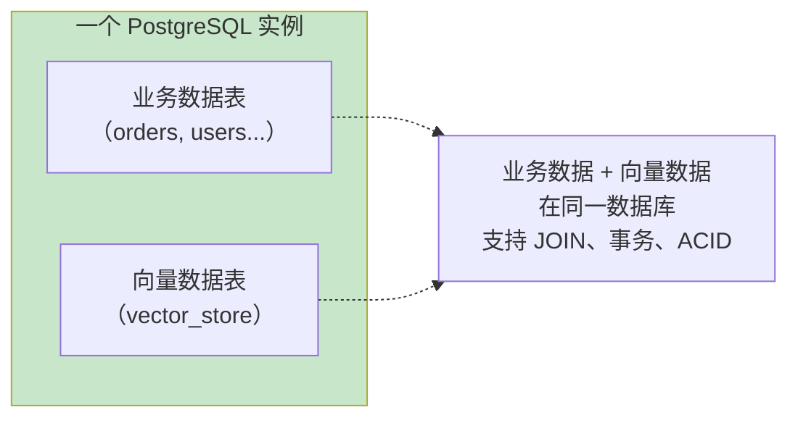
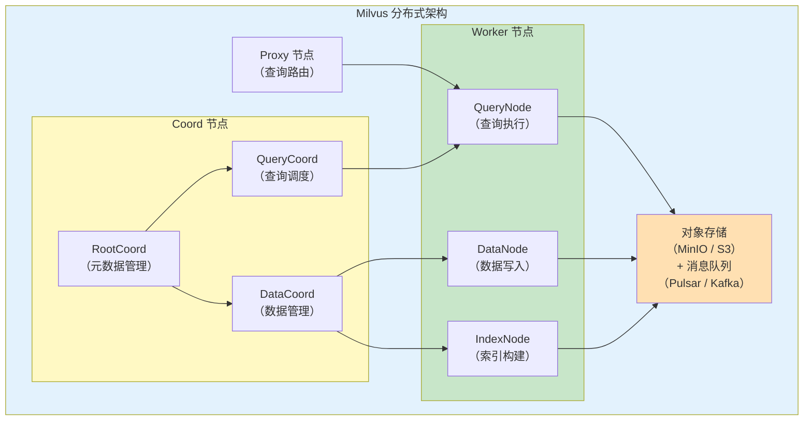
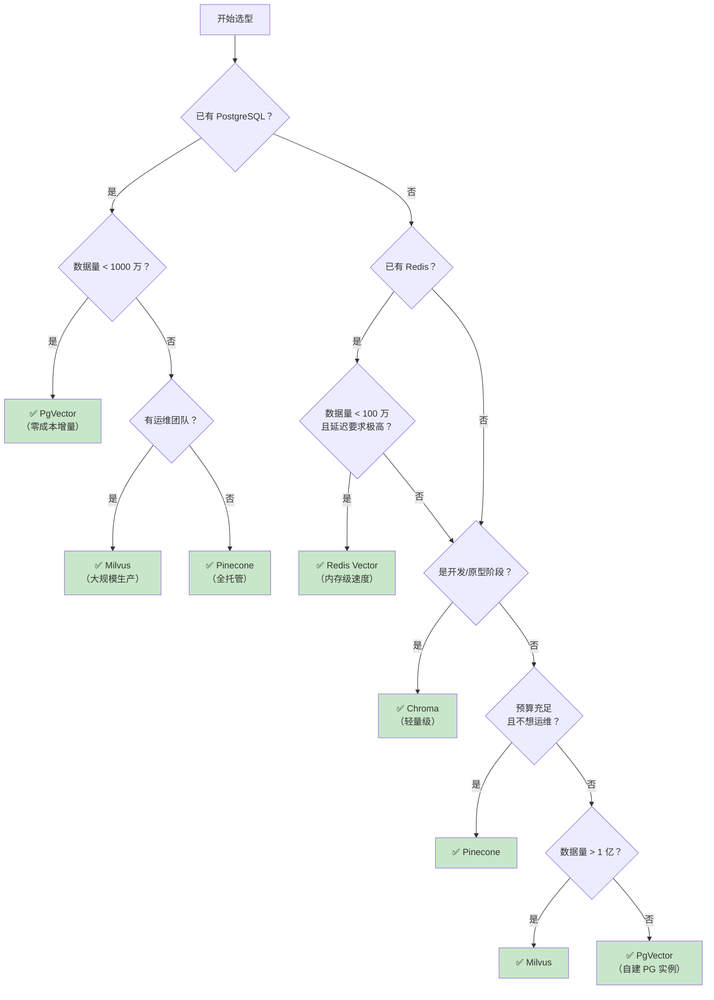
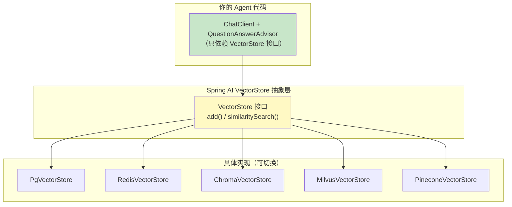
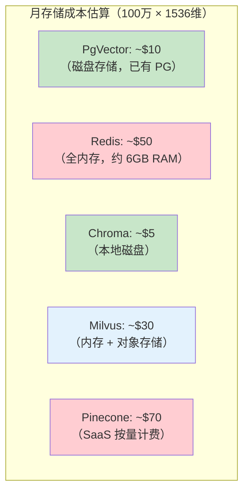

# 06-向量数据库选型

> **定位**：讲透向量数据库的选型决策——核心指标（延迟/召回率/吞吐/成本）、5 种主流向量库的详细对比（PgVector/Redis/Chroma/Milvus/Pinecone）、选型决策框架，以及 Spring AI VectorStore 抽象层如何实现零代码切换。
>
> **读者画像**：已经会用 RAG，需要为自己的 Agent 选一个合适的向量数据库。
>
> **前置阅读**：[05-RAG 检索增强生成](05-RAG检索增强生成.md)。

---

## 1. 为什么向量数据库选型很重要

向量数据库是 RAG 的"记忆中枢"——选错了，轻则查询慢、成本高，重则召回率低导致 Agent 答非所问，或者数据量增长后直接撑爆。



---

## 2. 向量数据库核心指标

### 2.1 四大核心指标



### 2.2 指标详解

| 指标 | 含义 | 为什么重要 | 典型要求 |
|------|------|-----------|---------|
| **查询延迟** | 从发起查询到返回结果的时间 | 直接影响用户体验；RAG 场景每次对话都要查 | P50 < 50ms, P99 < 200ms |
| **召回率** | ANN 近似搜索找到的"真正最相似"结果占比 | 召回率低 = 漏掉关键文档 = Agent 回答质量差 | ≥ 95%（与暴力搜索对比） |
| **写入吞吐** | 每秒能写入多少条向量 | 知识库初始化、增量更新 | 批量 ≥ 10K/s |
| **存储成本** | 存 100 万条 1536 维向量需要多少磁盘/内存 | 向量数据膨胀快，成本可能爆炸 | 1536 维 × 100 万 ≈ 6GB（纯向量） |

### 2.3 ANN 近似最近邻 vs 精确搜索



**关键理解**：生产环境几乎都用 ANN（Approximate Nearest Neighbor），牺牲一点精度换取数量级的速度提升。HNSW 是目前最主流的 ANN 算法。

---

## 3. 主流向量数据库详细对比

### 3.1 五大向量库总览



### 3.2 全面对比表

| 特性 | **PgVector** | **Redis** | **Chroma** | **Milvus** | **Pinecone** |
|------|-------------|-----------|------------|------------|-------------|
| **部署方式** | PostgreSQL 扩展 | Redis Stack 模块 | 嵌入式 / Docker | 分布式集群 | 云托管 SaaS |
| **索引算法** | HNSW / IVFFlat | HNSW | HNSW | HNSW / IVF / DiskANN | 专有（Pinecone 优化） |
| **最大向量数** | ~1000 万（优化后） | ~100 万（内存限制） | ~100 万 | 10 亿+ | 无限（按 pod 扩展） |
| **查询延迟（100 万数据）** | 5-50ms | 1-10ms | 5-20ms | 2-20ms | 10-50ms |
| **召回率** | 高（95%+） | 高（95%+） | 中高（90%+） | 极高（98%+） | 高（95%+） |
| **是否支持元数据过滤** | 是 | 是 | 是 | 是 | 是 |
| **是否支持混合搜索** | 是（SQL + 向量） | 是 | 基础 | 是（标量 + 向量） | 是 |
| **持久化** | 磁盘（ACID 事务） | 内存 + RDB/AOF | 本地文件 | 对象存储 + 内存 | 云端（自动管理） |
| **运维复杂度** | 低（复用 PG 运维） | 中 | 极低 | 高（分布式集群） | 极低（全托管） |
| **成本** | 低（已有 PG 则免费） | 中（内存消耗） | 免费（开源） | 中（需要多节点） | 高（按 pod + 用量计费） |
| **适合团队** | 已有 PostgreSQL | 已有 Redis | 快速原型 | 大规模生产 | 不想运维 |

### 3.3 逐个深入

#### 3.3.1 PgVector：PostgreSQL 的向量扩展

**定位**：如果你已经有 PostgreSQL，不想引入新组件。

```yaml
# application.yml
spring:
  ai:
    vectorstore:
      pgvector:
        index-type: HNSW
        distance-type: COSINE_DISTANCE
        dimensions: 1536
        schema-name: public
        table-name: vector_store
        initialize-schema: true    # 自动建表
```

```java
// Maven 依赖
// spring-ai-starter-vector-store-pgvector

// 使用——与其他向量库完全一致的 API
@Autowired
VectorStore vectorStore;

// 写入
vectorStore.add(List.of(
    Document.builder().text("Java 21 虚拟线程").metadata(Map.of("category", "java", "version", "21")).build(),
    Document.builder().text("Spring AI 框架").metadata(Map.of("category", "spring", "version", "2.0")).build()
));

// 检索
List<Document> results = vectorStore.similaritySearch(
    SearchRequest.builder()
        .query("虚拟线程怎么用")
        .topK(5)
        .filterExpression("category == 'java'")
        .build()
);
```

**PgVector 的核心优势**：



**适用场景**：
- 已有 PostgreSQL，不想引入新中间件
- 数据量在 1000 万以内
- 需要事务一致性（业务数据和向量在同一数据库）
- 团队熟悉 PostgreSQL 运维

**不适用场景**：
- 数据量超过千万级（性能下降明显）
- 需要极致查询延迟（PgVector 的 HNSW 索引在内存中构建，大表会消耗大量内存）

#### 3.3.2 Redis Vector：内存级速度

**定位**：如果你已经有 Redis，需要极低延迟的向量检索。

```yaml
# application.yml
spring:
  ai:
    vectorstore:
      redis:
        index: agent-knowledge-index
        prefix: "doc:"
        vector-fields:
          - name: embedding
            algorithm: HNSW
            type: FLOAT32
            dimensions: 1536
```

```xml
<!-- Maven 依赖 -->
<dependency>
    <groupId>org.springframework.ai</groupId>
    <artifactId>spring-ai-starter-vector-store-redis</artifactId>
</dependency>
```

**适用场景**：
- 已有 Redis 基础设施
- 对延迟极其敏感（< 10ms）
- 数据量较小（100 万以内，受内存限制）
- 可以接受数据丢失风险（或配置 AOF 持久化）

**不适用场景**：
- 数据量超过百万（内存成本爆炸）
- 需要强持久化保证（Redis 的持久化不是 ACID）
- 成本敏感（全内存存储成本高）

#### 3.3.3 Chroma：轻量级开发首选

**定位**：本地开发和原型验证的最佳选择。

```yaml
# application.yml
spring:
  ai:
    vectorstore:
      chroma:
        client:
          key: my-chroma-key
        collection:
          name: knowledge-base
          create-collection: true
```

```xml
<!-- Maven 依赖 -->
<dependency>
    <groupId>org.springframework.ai</groupId>
    <artifactId>spring-ai-starter-vector-store-chroma</artifactId>
</dependency>
```

```bash
# 用 Docker 快速启动 Chroma
docker run -d --name chroma -p 8000:8000 \
    -v $(pwd)/chroma-data:/chroma/chroma \
    chromadb/chroma:latest
```

**适用场景**：
- 开发环境和原型验证
- 数据量小（< 100 万）
- 不想部署复杂基础设施
- 快速实验不同 RAG 策略

**不适用场景**：
- 生产环境（稳定性和性能不够）
- 大规模数据
- 需要高可用

#### 3.3.4 Milvus：大规模生产首选

**定位**：亿级向量的生产级分布式向量数据库。

```yaml
# application.yml
spring:
  ai:
    vectorstore:
      milvus:
        client:
          host: milvus.example.com
          port: 19530
          username: ${MILVUS_USER:root}
          password: ${MILVUS_PASS:milvus}
        database-name: default
        collection-name: agent_knowledge
        embedding-dimension: 1536
        index-type: HNSW
        metric-type: COSINE
```

```xml
<!-- Maven 依赖 -->
<dependency>
    <groupId>org.springframework.ai</groupId>
    <artifactId>spring-ai-starter-vector-store-milvus</artifactId>
</dependency>
```

**Milvus 架构**：



**适用场景**：
- 亿级向量规模
- 对召回率和延迟有严格要求
- 有专门的运维团队
- 需要水平扩展

**不适用场景**：
- 小团队、没有运维资源（Milvus 集群运维复杂）
- 数据量小（< 100 万，杀鸡用牛刀）
- 成本敏感（多节点 + 对象存储）

#### 3.3.5 Pinecone：全托管 SaaS

**定位**：不想运维向量数据库，直接用云服务。

```yaml
# application.yml
spring:
  ai:
    vectorstore:
      pinecone:
        api-key: ${PINECONE_API_KEY}
        environment: gcp-starter
        index-name: agent-knowledge
        namespace: default
```

```xml
<!-- Maven 依赖 -->
<dependency>
    <groupId>org.springframework.ai</groupId>
    <artifactId>spring-ai-starter-vector-store-pinecone</artifactId>
</dependency>
```

**适用场景**：
- 不想运维向量数据库
- 预算充足（按量付费，贵但省心）
- 需要全球低延迟（Pinecone 有多区域部署）
- 快速上线、验证商业模式

**不适用场景**：
- 成本敏感（Pinecone 比自建贵很多）
- 数据合规要求（数据不能出境）
- 需要离线能力（Pinecone 是纯云服务）

---

## 4. 选型决策框架

### 4.1 决策树



### 4.2 场景速查表

| 场景 | 推荐向量库 | 理由 |
|------|-----------|------|
| **初创团队快速验证 MVP** | Chroma → Pinecone | 开发用 Chroma，上线后切 Pinecone |
| **已有 PostgreSQL 的企业** | PgVector | 零成本增量，运维复用 |
| **大规模知识库（亿级文档）** | Milvus | 分布式架构，水平扩展 |
| **实时对话（延迟 < 10ms）** | Redis | 全内存，极低延迟 |
| **不想运维、预算充足** | Pinecone | 全托管，按量付费 |
| **数据合规（私有化部署）** | Milvus / PgVector | 可完全私有化 |
| **多租户 SaaS Agent** | Milvus（分区隔离）或 PgVector（租户字段过滤） | 数据隔离能力强 |

---

## 5. Spring AI VectorStore 抽象层：零代码切换

### 5.1 统一抽象的意义

Spring AI 2.0 的核心设计——所有向量数据库实现同一个 `VectorStore` 接口：



**核心价值**：你的业务代码只依赖 `VectorStore` 接口，切换向量数据库时只需替换 Maven 依赖和 YAML 配置，Java 代码一行不用改。

### 5.2 VectorStore 接口

```java
// Spring AI 2.0.0 — VectorStore 真实接口（org.springframework.ai.vectorstore.VectorStore）
// 注意：2.0.0 里 VectorStore 同时继承 DocumentWriter 与 VectorStoreRetriever；
// similaritySearch(String) 与 getName() 是默认方法（VectorStoreRetriever/接口自带），无需实现
public interface VectorStore extends DocumentWriter, VectorStoreRetriever {

    /** 向向量数据库添加文档（抽象，必须实现） */
    void add(List<Document> documents);

    /** 按 ID 删除文档（抽象，必须实现） */
    void delete(List<String> idList);

    /** 按过滤表达式删除文档（抽象，必须实现） */
    void delete(Filter.Expression filterExpression);

    /** 相似度搜索（抽象，来自 VectorStoreRetriever，必须实现） */
    List<Document> similaritySearch(SearchRequest request);
}
```

### 5.3 切换示例：从 Chroma 到 PgVector

**切换前（Chroma）**：

```xml
<!-- pom.xml -->
<dependency>
    <groupId>org.springframework.ai</groupId>
    <artifactId>spring-ai-starter-vector-store-chroma</artifactId>
</dependency>
```

```yaml
spring:
  ai:
    vectorstore:
      chroma:
        collection:
          name: knowledge-base
```

**切换后（PgVector）**：

```xml
<!-- pom.xml：只需替换依赖 -->
<dependency>
    <groupId>org.springframework.ai</groupId>
    <artifactId>spring-ai-starter-vector-store-pgvector</artifactId>
</dependency>
```

```yaml
spring:
  ai:
    vectorstore:
      pgvector:
        index-type: HNSW
        distance-type: COSINE_DISTANCE
        dimensions: 1536
        initialize-schema: true
```

**Java 代码完全不变**：

```java
// 这段代码在 Chroma 和 PgVector 下都能正常运行
import org.springframework.ai.chat.client.ChatClient;
import org.springframework.ai.chat.client.advisor.vectorstore.QuestionAnswerAdvisor;
import org.springframework.ai.document.Document;
import org.springframework.ai.vectorstore.VectorStore;
import org.springframework.stereotype.Service;
import java.util.List;

@Service
public class KnowledgeService {

    private final VectorStore vectorStore;
    private final ChatClient chatClient;

    public KnowledgeService(VectorStore vectorStore, ChatClient.Builder builder) {
        this.vectorStore = vectorStore;
        this.chatClient = builder
                .defaultAdvisors(QuestionAnswerAdvisor.builder(vectorStore).build())
                .build();
    }

    // 写入和检索的 API 完全一致
    public void ingest(List<Document> docs) {
        vectorStore.add(docs);
    }

    public String ask(String question) {
        return chatClient.prompt()
                .user(question)
                .call()
                .content();
    }
}
```
> **需在 pom.xml 中添加依赖**（`QuestionAnswerAdvisor` 所在模块）：2.0.0 起模块名从 `spring-ai-advisors-vector-store` 改为 `spring-ai-vector-store-advisor`（老坐标已不存在）——版本走 `spring-ai-bom`，不写 `<version>`：
>
> ```xml
> <dependency>
>     <groupId>org.springframework.ai</groupId>
>     <artifactId>spring-ai-vector-store-advisor</artifactId>
> </dependency>
> ```

### 5.4 环境感知配置：开发用 Chroma，生产用 Milvus

利用 Spring Profiles 实现不同环境使用不同向量库：

```yaml
# application-dev.yml（开发环境）
spring:
  config:
    activate:
      on-profile: dev
  ai:
    vectorstore:
      chroma:
        client:
          host: localhost
          port: 8000
        collection:
          name: dev-knowledge
```

```yaml
# application-prod.yml（生产环境）
spring:
  config:
    activate:
      on-profile: prod
  ai:
    vectorstore:
      milvus:
        client:
          host: ${MILVUS_HOST}
          port: 19530
        collection-name: prod-knowledge
        embedding-dimension: 1536
        index-type: HNSW
        metric-type: COSINE
```

```xml
<!-- pom.xml：同时引入两个依赖，Spring Boot Auto-Configuration 根据 Profile 激活 -->
<dependency>
    <groupId>org.springframework.ai</groupId>
    <artifactId>spring-ai-starter-vector-store-chroma</artifactId>
</dependency>
<dependency>
    <groupId>org.springframework.ai</groupId>
    <artifactId>spring-ai-starter-vector-store-milvus</artifactId>
</dependency>
```

> **注意**：同时引入多个 VectorStore Starter 时，需要通过 `@ConditionalOnProperty` 或 Profile 控制只激活一个，避免 Bean 冲突。

---

## 6. 自定义 VectorStore 实现

如果以上向量库都不满足需求（例如自研向量索引），可以实现 `VectorStore` 接口：

```java
import org.springframework.ai.document.Document;
import org.springframework.ai.embedding.EmbeddingModel;
import org.springframework.ai.vectorstore.SearchRequest;
import org.springframework.ai.vectorstore.VectorStore;
import org.springframework.ai.vectorstore.filter.Filter;

import java.util.List;

// Spring AI 2.0.0 — 自定义 VectorStore（实现全部抽象方法，含 delete(Filter.Expression)）
public class CustomVectorStore implements VectorStore {

    private final EmbeddingModel embeddingModel;
    private final CustomVectorEngine engine;

    public CustomVectorStore(EmbeddingModel embeddingModel, CustomVectorEngine engine) {
        this.embeddingModel = embeddingModel;
        this.engine = engine;
    }

    @Override
    public void add(List<Document> documents) {
        // 1. 调用 EmbeddingModel 将文档向量化
        // 2. 存入自定义存储
        for (Document doc : documents) {
            float[] vector = embeddingModel.embed(doc.getText());
            engine.insert(doc.getId(), vector, doc.getText(), doc.getMetadata());
        }
    }

    @Override
    public void delete(List<String> idList) {
        idList.forEach(engine::delete);
    }

    @Override
    public void delete(Filter.Expression filterExpression) {
        // 2.0.0 接口要求实现按过滤表达式删除；引擎不支持时需自行转换或抛 UnsupportedOperationException
        engine.deleteByFilter(filterExpression);
    }

    @Override
    public List<Document> similaritySearch(SearchRequest request) {
        // 1. 查询文本向量化
        float[] queryVector = embeddingModel.embed(request.getQuery());

        // 2. 执行搜索
        List<SearchResult> results = engine.search(
                queryVector,
                request.getTopK(),
                request.getSimilarityThreshold(),
                request.getFilterExpression()
        );

        // 3. 转换为 Document
        return results.stream()
                .map(r -> Document.builder()
                        .id(r.id())
                        .text(r.text())
                        .metadata(r.metadata())
                        .score(r.score())
                        .build())
                .toList();
    }

    @Override
    public String getName() {
        return "CustomVectorStore";
    }
}
```

---

## 7. 性能测试与调优

### 7.1 关键调优参数

| 参数 | 影响 | 调优建议 |
|------|------|---------|
| **HNSW M** | 每层连接数 | M 越大，召回率越高但内存消耗大。推荐 16-48 |
| **HNSW efConstruction** | 构建时搜索宽度 | 越大索引质量越好但构建慢。推荐 200-500 |
| **HNSW efSearch** | 查询时搜索宽度 | 越大召回率越高但查询慢。推荐 50-200 |
| **向量维度** | Embedding 输出维度 | 1536（OpenAI）/ 768（开源模型）。维度越高精度越高但成本越高 |
| **topK** | 返回结果数 | 3-5 为佳，太多浪费 Token |
| **similarityThreshold** | 相似度过滤 | 0.6-0.8，太低引入噪声 |

### 7.2 召回率测试方法

```java
@SpringBootTest
public class VectorStoreRecallTest {

    @Autowired
    VectorStore vectorStore;

    @Autowired
    EmbeddingModel embeddingModel;

    /**
     * 测试 ANN 召回率：
     * 1. 用暴力搜索得到"真正最相似"的 Top-K
     * 2. 用向量数据库的 ANN 搜索得到"近似最相似"的 Top-K
     * 3. 对比两者重合度
     */
    @Test
    void testRecallRate() {
        List<Document> allDocs = loadAllDocuments();  // 加载所有文档
        List<String> testQueries = loadTestQueries(); // 测试查询集

        double totalRecall = 0;
        for (String query : testQueries) {
            // 暴力搜索（基准）
            List<String> bruteForceTopK = bruteForceSearch(allDocs, query, 5);

            // 向量数据库搜索
            List<Document> annTopK = vectorStore.similaritySearch(
                    SearchRequest.builder().query(query).topK(5).build());
            List<String> annIds = annTopK.stream().map(Document::getId).toList();

            // 计算重合率
            long overlap = annIds.stream().filter(bruteForceTopK::contains).count();
            double recall = (double) overlap / bruteForceTopK.size();
            totalRecall += recall;
        }

        double avgRecall = totalRecall / testQueries.size();
        System.out.println("平均召回率：" + (avgRecall * 100) + "%");
        // 期望：≥ 95%
    }
}
```

---

## 8. 成本估算

以 100 万条 1536 维向量为例：



> **注意**：以上为粗略估算，实际成本取决于云厂商定价、实例规格、流量费用等。Pinecone 的实际成本还与查询量有关。

---

## 9. 适用场景与不适用场景

### 适用场景

- 需要存储和检索大规模向量数据的企业 Agent 应用
- RAG 知识库问答系统
- 语义搜索系统
- 推荐系统（基于向量相似度）
- 多模态搜索（图像、音频的向量检索）

### 不适用场景

- 数据量极小（< 100 条文档——直接塞进 Prompt 更简单）
- 需要精确匹配的场景（订单号、用户 ID 查询——用关系型数据库）
- 无语义检索需求（关键词搜索用 Elasticsearch 更合适）
- 数据更新频率极高（每次更新都要重新 Embedding，成本高）

---

## 10. 本章总结

| 概念 | 一句话 |
|------|--------|
| **查询延迟** | 从查询到返回结果的时间，直接影响用户体验 |
| **召回率** | ANN 搜索找到"真正最相似"结果的占比，95%+ 为佳 |
| **ANN 近似搜索** | 用索引加速，牺牲少量精度换取数量级的速度提升 |
| **HNSW** | 最主流的 ANN 算法，在图结构上进行分层导航搜索 |
| **PgVector** | PostgreSQL 向量扩展，已有 PG 时零成本增量 |
| **Redis Vector** | 全内存向量检索，延迟最低但受内存限制 |
| **Chroma** | 轻量级向量库，开发原型首选 |
| **Milvus** | 分布式向量数据库，亿级生产首选 |
| **Pinecone** | 全托管 SaaS，不想运维的首选 |
| **VectorStore 抽象** | Spring AI 的统一接口，切换向量库零代码改动 |
| **环境感知配置** | 开发用 Chroma，生产用 Milvus，通过 Profile 切换 |

**下一篇**：[07-ReAct 推理模式](07-ReAct推理模式.md) — Thought-Action-Observation 循环，Agent 的核心推理引擎。

---

> **想深入？→ [教程 35-高级RAG与AgenticRAG]**：不同向量库在 Agentic RAG 多跳推理场景下的表现差异。
> **遇到阻塞？→ [教程 30-容错与弹性设计](30-容错与弹性设计.md)**：向量数据库不可用时的降级策略。
> **想深入？→ [附录 17-Kafka/07-Connect与数据生态]**：业务库/文档变更 → CDC → 自动重嵌入 → 向量库同步的完整管道（知识库与业务库最终一致）。
