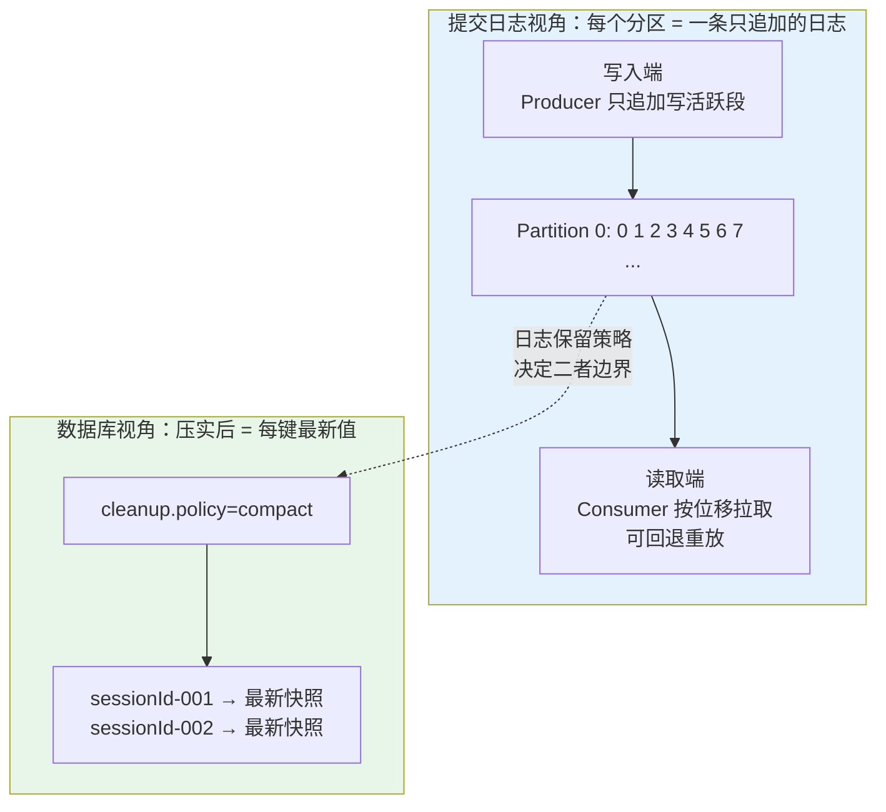
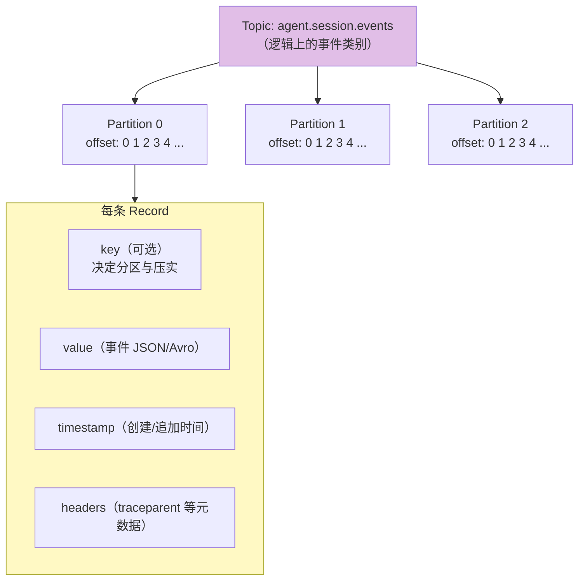
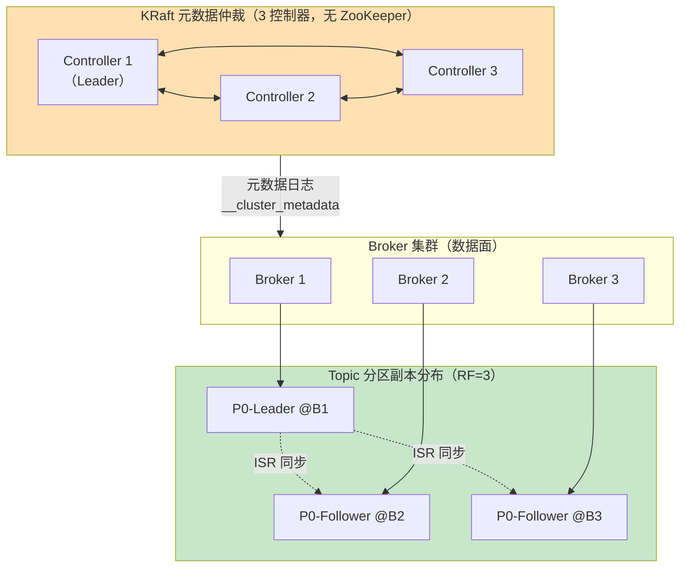
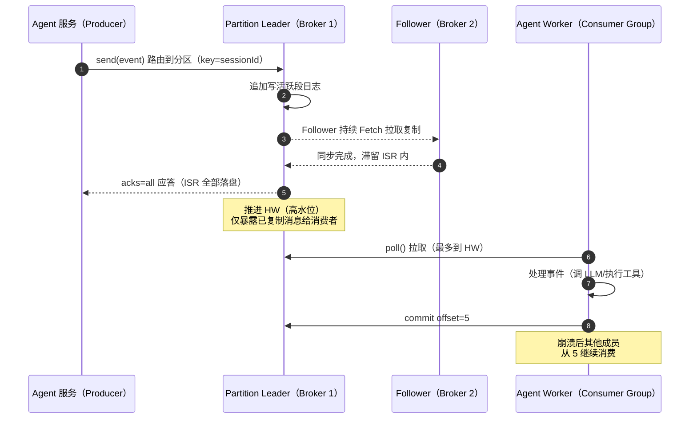
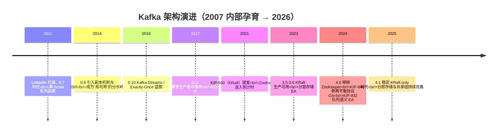
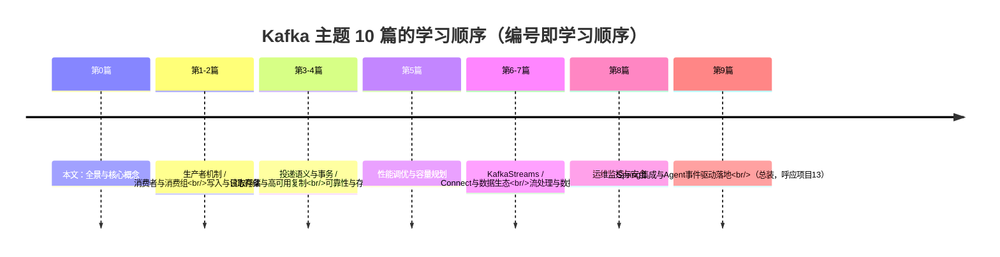

# Kafka 全景与核心概念

> **定位**：本文是 Kafka 主题的第 0 篇——建立 Kafka 的完整心智模型：它为什么存在、核心抽象（Topic/Partition/Offset/Replica）如何协作、与 RabbitMQ/RocketMQ/Pulsar 的选型分界，以及它在 Java Agent 系统中扮演的「事件骨干」角色。后续 9 篇（生产者/消费者/语义/存储/调优/Streams/Connect/运维/Spring 落地）都建立在这些概念之上。
>
> **读者画像**：能熟练使用 Spring Boot 开发 Web 服务、读过 [教程 04-企业级架构主干/01-微服务拆分与Agent部署] 的中高级 Java 开发者；对 Kafka 可能零基础，或用过但说不清分区/位移/ISR 的原理。
>
> **前置阅读**：[教程 02-SpringAI核心机制/02-Agent状态管理]（理解会话状态为什么需要事件化）；[附录 06-企业级架构模式/02-事件驱动Agent架构]（本文在中间件层为其"下钻"）。
>
> **版本基准**：Kafka 4.1（2025-08，KRaft-only 架构的稳定版）；spring-kafka 4.x（随 Spring Boot 4.1 BOM 管理）。涉及历史版本差异处会显式标注。

---

## 1. 为什么 Agent 系统需要 Kafka

### 1.1 同步 Agent 的三个结构性瓶颈

[附录 06-企业级架构模式/02-事件驱动Agent架构 §1] 已经从架构层论证了同步调用的瓶颈。这里从中间件视角补上量化的一面：

| 瓶颈 | 同步架构的表现 | 事件骨干（Kafka）的作用 |
|------|--------------|----------------------|
| **长耗时任务占资源** | 一次 ReAct 循环 = 多轮 LLM 调用 + 工具执行，30s~5min；WebFlux 事件循环虽不被阻塞，但任务状态散落在内存中，重启即丢 | 任务变成事件流，消费进度持久化为**位移（Offset）**，进程崩溃后从上次位移继续（呼应 [教程 08-架构师进阶/06-长任务持久化与中断恢复]） |
| **上下游速率失配** | LLM 网关 200 QPS，工具执行 20 QPS，评估管道每天批量跑——直接调用必然互相拖垮 | Kafka 是**持久化缓冲区**：生产者速率与消费者速率彻底解耦，削峰填谷是结构属性而非附加功能 |
| **审计与回放缺失** | 可观测事件写日志文件，无法回放、无法重算 | 事件按保留策略持久存储，**可以重新消费**——审计、评估数据集回放、投影重建都依赖这一点（呼应 [教程 04-企业级架构主干/05-历史记录持久化与合规]、[教程 08-架构师进阶/07-数据飞轮与持续改进]） |

### 1.2 一句话定位

**Kafka 是一个分布式、分区、多副本的提交日志**——不是"消息队列"。它本质上是把"磁盘上的追加写日志"这个最廉价的写模型，通过网络暴露成流式读写服务。理解了"日志"二字，后面所有设计（顺序写、分区、位移、压实、ISR）都会变得自然。

这个双重身份对 Agent 架构极其重要：**事件溯源需要日志形态（完整事件序列），会话快照需要表形态（每会话最新状态）**——同一个 Kafka 集群用不同的 `cleanup.policy` 就能同时服务两种需求（详见 [教程 07-Kafka事件骨干/04-日志存储与高可用复制 §3]）。

---

## 2. 核心概念全景

### 2.1 逻辑层：Topic / Partition / Offset / Record

- **Topic**：事件的逻辑分类。Agent 系统的典型划分不是按"字段"而是按**保留策略与消费模式**（命令类/事件类/审计类的保留期、密钥、权限都不同，见 §5.2）。
- **Partition**：**并行与顺序的最小单元**。Kafka 只保证分区内有序。用 `sessionId` 做 key，同一会话的事件进同一分区 → 会话内因果序被保留；不同会话并行消费。
- **Offset**：消费者在分区内的游标。**由消费者提交、由消费组管理**（`__consumer_offsets` 内部主题），Broker 不维护"谁读到哪"的应用语义——这是 Kafka 与传统 MQ 最大的心智差异之一。
- **Record**：key + value + timestamp + headers。headers 常用来透传 W3C `traceparent`（全链路追踪穿透 Kafka，见 [教程 07-Kafka事件骨干/09-Spring集成与Agent事件驱动落地 §6]）。

### 2.2 物理层：Broker / Replica / ISR / Controller

- **Broker**：一台 Kafka 服务进程。分区是**分布式的最小单元**：每个分区有 1 个 Leader 副本（承担全部读写）+ N-1 个 Follower 副本（被动拉取同步）。
- **ISR（In-Sync Replicas）**：与 Leader 保持同步的副本集合。`acks=all` 的含义是"消息进入 ISR 中所有副本才算成功"——这是 Kafka 可靠性语义的基石（[教程 07-Kafka事件骨干/03-投递语义与事务 §2]）。
- **Controller**：负责 Leader 选举与元数据管理。Kafka 4.x 只有 **KRaft 模式**（ZooKeeper 已在 4.0 移除）：控制器自己组成 Raft 仲裁，元数据本身就是一条 Raft 日志（`__cluster_metadata`），故障切换从"分钟级"降到"毫秒~秒级"（演进细节见 [教程 07-Kafka事件骨干/04-日志存储与高可用复制 §5]）。
- **Consumer Group / Coordinator**：同组消费者瓜分一个订阅主题的全部分区；Group Coordinator（Broker 侧）管理成员与位移。这是"Agent 工作机群横向扩缩容"的机制来源（[教程 07-Kafka事件骨干/02-消费者与消费组]）。

### 2.3 一条消息的完整旅程

记住三个关键点：① 生产者推、消费者**拉**（pull 模型 = 天然背压，消费不过来就少 poll，见 [教程 01-WebFlux与响应式编程/02-背压与流量控制]）；② 高水位（HW）之前的数据才对消费者可见；③ **位移提交发生在消费之后**，这决定了 at-least-once 语义与重复处理问题（[教程 07-Kafka事件骨干/03-投递语义与事务]）。

---

## 3. Kafka vs 其他消息系统：选型分界

架构师面试与真实选型中最常见的比较。**没有最好的中间件，只有语义匹配**：

| 维度 | Kafka | RabbitMQ | RocketMQ | Pulsar |
|------|-------|----------|----------|--------|
| 模型 | 分区日志（pull） | 队列/交换机（push，消费后删除） | 队列 + 消费日志 | 分区日志（分层，BookKeeper 存储） |
| 吞吐 | 极高（顺序写+零拷贝，百 MB/s/实例） | 中（万~十万 msg/s） | 高 | 高 |
| 消息保留 | 默认 7 天，可无限期/按大小/压实 | 消费即删（可持久化队列但非流） | 可保留、可重置 | 可保留，原生分层 |
| **回放** | 天然支持（按位移/时间戳重置） | 弱 | 支持 | 支持 |
| 顺序 | 分区内有序 | 单队列有序 | 队列有序 | 分区有序 |
| 延迟消息 | 不原生（需时间轮重投，慎用） | 不原生（插件） | **原生支持** | 原生 |
| 事务消息 | 跨分区事务（EOS） | 无 | 半消息事务（最终一致） | 无跨主题事务（2.11+ 部分支持） |
| 生态 | **王者**：Connect/Streams/Debezium/CDC/全部大数据引擎 | AMQP 生态 | 阿里系生态 | Functions/Functions-worker，生态较新 |
| 多租户 | 弱（靠 ACL+配额，见 [教程 07-Kafka事件骨干/08-运维监控与安全]） | 好（vhost） | 一般 | **原生多租户** |
| 运维复杂度 | 中（KRaft 后降低） | 低 | 中 | 高（三层架构） |

**Agent 系统的选型结论**（呼应 [教程 08-架构师进阶/10-多模型协作与供应策略] 的决策框架）：

- 默认选 **Kafka**：当你需要事件溯源、审计回放、流式分析、CDC、与大数据/评估管道衔接——这些是 Agent 平台的刚需，而它们全部依赖"日志可回放"这个语义。
- 选 **RabbitMQ**：内部低延迟任务队列、复杂路由、消息量不大且不需要回放——比如"单个工具执行的临时指令队列"。
- 选 **RocketMQ**：强依赖延迟消息/事务消息语义、团队已有阿里系栈。
- 选 **Pulsar**：多租户 SaaS 且不想自己建配额体系、跨地域复制优先——对应 [项目 07-跨国多租户SaaS-Agent平台] 的场景，但要评估运维成本与生态缺口。

> **想深入？→ [附录 07-架构决策方法论/00-ADR架构决策记录]**：把上述选型写成 ADR（决策上下文/备选方案/取舍理由），而不是口头拍板。

---

## 4. KRaft 与 Kafka 4.x 的架构演进

版本演进路线用 timeline 表达（版本路线不画流程图，这是体系规范）：

对架构师的两点直接影响：

1. **新集群一律 KRaft**（`process.roles=broker,controller`，无 ZK 依赖）。网上大量 2.x/3.x 时代的 ZK 部署教程已经过时——元数据、ACL、SCRAM 凭证全部改由 `__cluster_metadata` 与 Broker 内部主题承载。
2. **KIP-848（4.0 GA）改变了再平衡的心智模型**：Broker 侧 Group Coordinator 直接管理成员心跳与分配，移除了经典协议的"全体停止-重新入组"屏障。对频繁发布的 Agent 服务来说，滚动重启的抖动大幅降低（机制详见 [教程 07-Kafka事件骨干/02-消费者与消费组 §4]）。

---

## 5. Agent 系统的主题设计初探

### 5.1 按域与保留策略划分，而不是按字段

| 主题 | Key | 保留策略 | 消费者 |
|------|-----|---------|--------|
| `agent.session.events` | sessionId | delete, 30d | 状态投影 / 审计 / 评估 |
| `agent.session.snapshots` | sessionId | **compact** | 崩溃恢复（快照即"每键最新值"） |
| `agent.llm.telemetry` | requestId | delete, 7d | 成本计量、延迟监控（→ [教程 03-React前端与AgenticUI/03-Agentic-UI设计]） |
| `agent.tool.audit` | sessionId | delete, 400d + 分层存储 | 合规审计（→ [教程 04-企业级架构主干/03-工具执行可观测与审计]、[教程 04-企业级架构主干/05-历史记录持久化与合规]） |
| `agent.commands` | agentId | delete, 3d | Agent 工作机群（消费组） |
| `kb.change.events`（CDC） | docId | compact | 知识库→向量库同步（→ [教程 07-Kafka事件骨干/07-Connect与数据生态 §5]） |

### 5.2 设计原则

1. **保留策略决定主题边界**：审计 400 天与指令 3 天混在一个主题，只能按最长保留付存储成本。
2. **Key 决定一切**：key = 顺序边界（分区内有序）+ 压实边界（每键最新值）。选 `sessionId` 而不是 `tenantId`（租户热键倾斜，见 [教程 07-Kafka事件骨干/01-生产者机制与调优] §4]）。
3. **事件粒度宁可粗**：一个"工具执行完成"事件携带完整结果，而不是 5 个细碎事件——事件溯源的回放成本随事件数线性增长。
4. **契约显式化**：事件结构带 `version` 字段或走 Schema Registry（[教程 07-Kafka事件骨干/07-Connect与数据生态] §4]）。

---

## 6. 适用场景与不适用场景

### 适用场景

- 事件溯源的会话日志 / 审计流 / 可回放的评估数据集（Agent 平台刚需）
- 异步长任务的命令队列 + 消费组工作机群（天然横向扩缩容）
- 可观测性事件管道（Token/延迟/错误 → Prometheus/Langfuse 汇聚）
- CDC：业务库变更 → 知识库重嵌入 → 向量库同步
- 多 Agent 异步协作的事件总线（呼应 [教程 00-基础与核心/09-多Agent协作] 的松耦合需求）
- 削峰：LLM 网关与上游请求洪峰之间的持久缓冲

### 不适用场景

- **请求-响应（RPC）语义**：Kafka 没有内建 reply 通道，硬做请求响应要自建关联主题，复杂且延迟高——同步调用继续用 WebClient/HTTP
- **单条消息必须精确路由到动态目标**（如按用户分发的复杂路由树）——RabbitMQ 的 exchange 模型更合适
- **消息量极小且不需要回放**（每天几千条的内部指令）：运维 Kafka 集群的成本远大于收益，考虑 Redis Stream 或 RabbitMQ
- **强依赖延迟消息**（下单 30 分钟后取消）：Kafka 无原生延迟语义，需要自建时间轮重投——RocketMQ 原生支持
- **把 Kafka 当数据库用**：按 key 点查/范围查请用真正的存储（压实主题的"表形态"是为流消费服务的，不是为在线查询服务的，见 [教程 07-Kafka事件骨干/04-日志存储与高可用复制] §6]）

---

## 7. 常见误区与最佳实践

### 误区

1. **"Kafka 保证消息不丢"**——错。默认配置下生产者 `acks` 语义、Broker 落盘时机（OS page cache）、消费者先提交后处理，三个环节都能丢。可靠性是**配置出来的**，见 [教程 07-Kafka事件骨干/03-投递语义与事务]。
2. **"分区越多越好"**——错。分区是并行度，也是 Leader 选举、再平衡、打开文件句柄、端到端延迟的成本单元。按目标吞吐规划（[教程 07-Kafka事件骨干/05-性能调优与容量规划] §2]）。
3. **"消费组就是队列，一条消息只被一个消费者处理"**——半个错。这是**组内**语义；不同组各自独立消费全量。多租户场景要防止"新组误订阅全量审计流"（ACL 治理见 [教程 07-Kafka事件骨干/08-运维监控与安全] §4]）。
4. **"顺序我有"**——只在分区内成立。key 缺失时消息均匀散到各分区，"看起来有序"是巧合。

### 最佳实践

1. 生产环境 RF=3 + `min.insync.replicas=2` + 生产者 `acks=all` + `enable.idempotence=true`（4.x 幂等默认开启）。
2. 每个主题显式设置保留策略与 key 语义，写入基础设施代码库而非手工命令行。
3. 事件结构从第一天就带 `eventId`（UUID）与 `version`——幂等消费与演化都靠它。
4. 容量与分区规划在上线前用 `kafka-producer-perf-test.sh` 实测，不要拍脑袋（[教程 07-Kafka事件骨干/05-性能调优与容量规划] §6]）。

---

## 8. 本主题学习地图

**外部来源**：[Apache Kafka 官方文档 – Introduction](https://kafka.apache.org/documentation/#introduction) · [KIP-848: 新消费者再平衡协议](https://cwiki.apache.org/confluence/display/KAFKA/KIP-848%3A+Next-Generation+Consumer+Rebalance+Protocol) · [KIP-500: KRaft](https://cwiki.apache.org/confluence/display/KAFKA/KIP-500%3A+Replace+ZooKeeper+with+a+Self-Managed+Metadata+Quorum) · [Kafka 4.0 发布公告](https://kafka.apache.org/downloads#4.0.0)

## 9. 总结

Kafka 的心智模型是**提交日志**，不是队列：分区是并行与顺序的单元，位移是消费者的游标，ISR 是可靠性的地基，回放是它区别于一切传统 MQ 的灵魂属性。对 Agent 架构师而言，Kafka 是事件驱动架构的物理载体——[附录 06-企业级架构模式/02-事件驱动Agent架构] 讲的 Event Sourcing/Saga/CQRS 落到生产，最终都要回答"事件怎么可靠地流动与留存"，本主题 10 篇就是对这个问题的完整回答。下一篇进入第一条主干：[教程 07-Kafka事件骨干/01-生产者机制与调优]。
