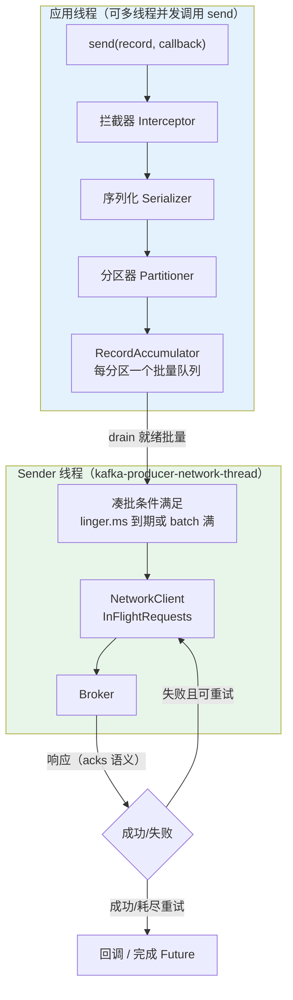
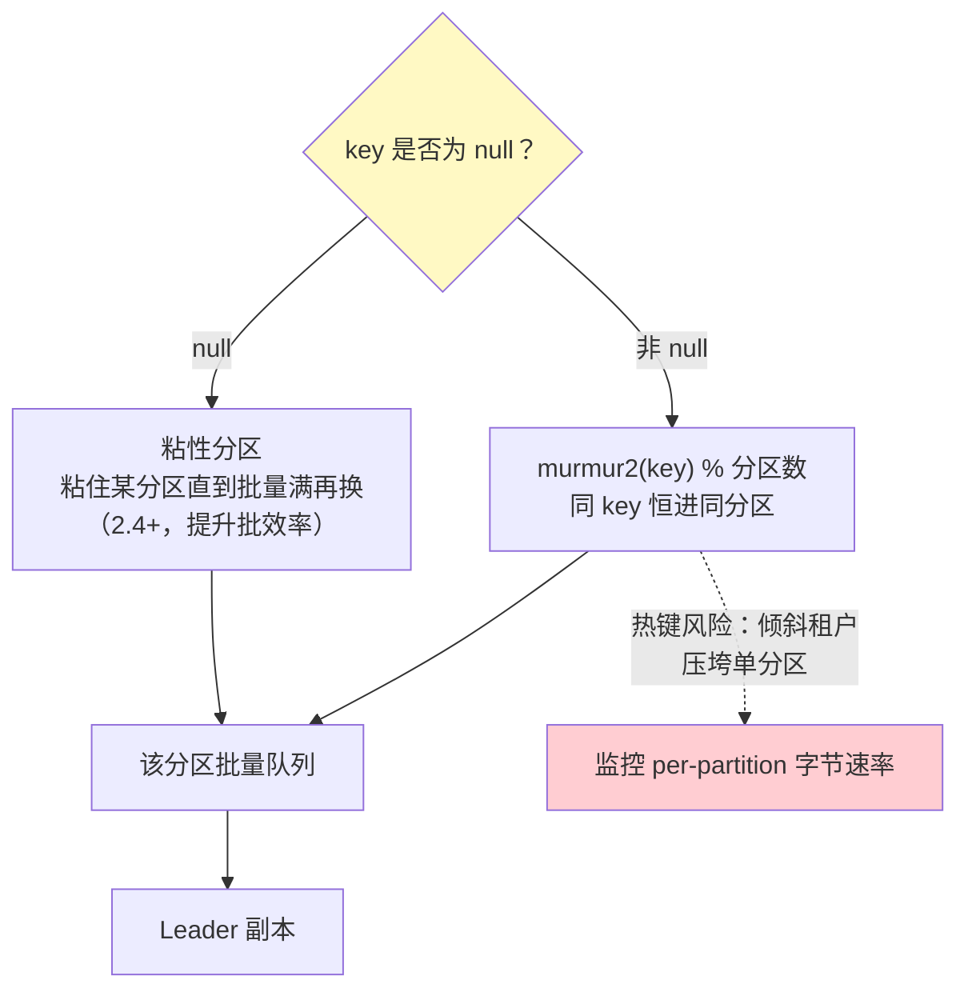

# 生产者机制与调优

> **定位**：本文完整拆解 Kafka 生产者——发送路径的两个线程模型、分区路由策略、acks 可靠性语义、批量与压缩机制、幂等原理，以及 spring-kafka 4.x 的正确用法。读完你应能回答：消息为什么会丢、为什么会乱序、linger.ms 调大牺牲了什么、为什么 WebFlux 应用里不能 `send().get()`。
>
> **读者画像**：读过 [教程 07-Kafka事件骨干/00-Kafka全景与核心概念] 的 Java 开发者；正在为 Agent 服务编写事件发布（会话事件、工具审计、遥测）的工程师。
>
> **前置阅读**：[教程 ]（分区/副本/ISR 概念）；[教程 01-WebFlux与响应式编程/01-Reactor核心]（本文多次涉及"阻塞边界"问题）。
>
> **版本基准**：kafka-clients 4.1.x；spring-kafka 4.x（随 Spring Boot 4.1 BOM）。**需在 pom.xml 中添加依赖**（spring-kafka 由 Boot BOM 管理版本，无需显式指定）：

```xml
<dependency>
    <groupId>org.springframework.kafka</groupId>
    <artifactId>spring-kafka</artifactId>
</dependency>
```

---

## 1. 发送路径：一个 KafkaProducer，两个线程

`KafkaProducer` 是**线程安全**的，其内部是一条流水线。理解这条流水线，是理解一切"消息为什么丢/为什么慢"的前提：



逐段拆解：

1. **应用线程只做"入队"**：拦截器（审计埋点）→ 序列化（value 变字节）→ 分区器（决定去哪个分区，§2）→ 追加进 `RecordAccumulator` 中该分区的批量队列。这一段是纯内存操作，微秒级——**所以 send() 返回成功 ≠ 消息已发出去**。
2. **Sender 线程独占网络 I/O**：当某分区的批量满足 `linger.ms`（默认 0，即立即）或达到 `batch.size`（默认 16KB）就绪条件，Sender 线程把它组成请求发出。**每个 Broker 连接**最多挂 `max.in.flight.requests.per.connection`（默认 5）个未确认请求。
3. **回调在应用线程感知**：成功或耗尽重试后，通过 Future/Callback 通知调用方。**忽略回调 = 静默丢消息**，这是生产环境第一大事故来源。

**对象生命周期**：一个应用一个 Producer 实例（Spring 中即一个 `KafkaTemplate` 底层的 Producer）。Producer 持有 TCP 连接与内存缓冲，**绝不能"每条消息 new 一个"**——连接建立 + 元数据拉取的开销是毫秒到百毫秒级。

## 2. 分区路由：顺序的起点



三个必须吃透的边界：

- **分区内有序是唯一保证**。Agent 事件以 `sessionId` 为 key → 同会话事件有序；一旦 key 为 null（或换 key 策略），"看起来有序"只是巧合。
- **热键倾斜**：以 `tenantId` 为 key，当一个大租户贡献 80% 流量时，单分区成为瓶颈——分区数就是并行上限（呼应 [教程 04-企业级架构主干/06-多租户隔离与资源治理] 的配额话题，配额治理见 [教程 07-Kafka事件骨干/08-运维监控与安全 §5]）。缓解：key 加盐（`tenantId + shardSuffix`，代价是失去租户内全局序）或按 `sessionId` 分区。
- **自定义分区器**：实现 `org.apache.kafka.clients.producer.Partitioner` 接口（`partition()` / `close()` / `configure()`），通过 `partitioner.class` 配置注入。典型用途：把"高优先级 Agent 命令"定向到独立分区，与普通事件隔离优先级。注意 3.3 起旧的 `DefaultPartitioner` 已废弃，null-key 默认行为收敛为内置粘性策略。

## 3. 可靠性语义：acks 的数学

| 配置 | 含义 | 丢失窗口 | 适用 |
|------|------|---------|------|
| `acks=0` | 发出即忘，不等确认 | Producer→网络任何抖动即丢；Leader 落盘前宕机即丢 | 允许丢弃的遥测（点击流类） |
| `acks=1` | Leader 落盘即确认 | **Leader 确认后、Follower 复制前 Leader 宕机** → 新 Leader 无此消息 | 一般不建议在 Agent 审计场景使用 |
| `acks=all` | ISR 内全部副本确认 | 需同时满足：ISR 全体宕机且无 electable 副本 | 生产默认（配合下述两项） |

**`acks=all` 单独用是无效的**，必须组成三件套（这是 [教程 ] §7] 最佳实践 #1 的展开）：

```
acks=all                          # 等 ISR 全体
min.insync.replicas=2             # ISR 少于 2 时 Broker 拒写（抛 NotEnoughReplicasException）
replication.factor=3              # 3 副本容忍 1 台 Broker 宕机
```

**为什么必须配 `min.insync.replicas`**：如果没有它，两台 Follower 宕机后 ISR 收缩为 {Leader}，`acks=all` 退化为 `acks=1`——你的"三副本可靠性"在故障时刻静默降级。配置了它，写请求会被拒绝，**应用收到错误而不是丢数据**——可用性换持久性，这是架构师必须做出的显式决策。

可靠性还不止于 Broker 侧，完整的"不丢链条"在 [教程 07-Kafka事件骨干/03-投递语义与事务 §2] 的故障注入矩阵中展开。

## 4. 批量、压缩与延迟的三角

### 4.1 核心参数

| 参数 | 默认 | 作用 | 调优方向 |
|------|------|------|---------|
| `linger.ms` | 0 | 等待凑批的窗口 | 5~20ms：吞吐 ↑ 数倍，P99 延迟 +linger 上限 |
| `batch.size` | 16KB | 单批量上限 | 大消息流可到 64~128KB |
| `buffer.memory` | 32MB | 累加器总内存 | 满 32MB 时 send() 阻塞 `max.block.ms`（默认 60s）后抛异常 |
| `compression.type` | none | **批量级**压缩：none/gzip/snappy/lz4/zstd | zstd：压缩比最好 CPU 适中；lz4：CPU 最省 |
| `delivery.timeout.ms` | 120s | send 到"成功或放弃"的总时限 | 覆盖所有重试，超时进回调失败 |

### 4.2 关键认知：压缩发生在批量级

压缩的对象是**整个 ProducerBatch**，不是单条消息——这是 Kafka 高吞吐的秘密之一：相似事件（同类 JSON）压在一批，压缩比极高。**在 Producer 端压缩即可，Broker 不会重复压缩**（`compression.type=producer`，Broker 落盘保留原压缩格式），消费端解压。Agent 事件的 JSON 重复字段极多，实测 zstd 压缩比常达 5~10 倍，直接决定网络带宽与磁盘成本。

### 4.3 延迟-吞吐权衡的经验曲线

| 场景 | 推荐配置 | 预期效果 |
|------|---------|---------|
| 交互命令（agent.commands） | linger.ms=0~5, acks=all | 端到端个位数~十位数 ms |
| 事件/审计流 | linger.ms=10~20, zstd, batch 64KB | 吞吐最大化，延迟不重要 |
| 遥测洪峰（LLM telemetry） | linger.ms=20, lz4 | CPU 敏感时用 lz4 |

**不要脱离测量调参**：用 `kafka-producer-perf-test.sh --record-size 2048 --throughput -1 --num-records 1000000` 建立基线（[教程 07-Kafka事件骨干/05-性能调优与容量规划 §6]）。

## 5. 幂等生产者：网络重试不产生重复

`enable.idempotence=true`（3.0 起默认开启）的机制：Producer 启动时获得 **PID（Producer ID）+ epoch**，为每个分区维护**单调递增序列号**。Broker 为每个分区缓存最近 5 个批量序列：

- 重试携带相同序列号 → Broker 判定重复，**丢弃但返回成功**——网络层重试对下游不可见；
- epoch 递增 → 旧 Producer 实例（僵尸）的写入被 `OutOfOrderSequenceException` 拒绝。

**边界必须讲清楚**：幂等只在**单个 Producer 会话**内有效——重启后 PID 变化，序列号从头计数，Broker 无法跨会话去重。所以：

> **Producer 幂等 ≠ 业务幂等**。事件消费侧仍需按 `eventId` 做幂等（见 [教程 07-Kafka事件骨干/03-投递语义与事务 §5]）。同理，`max.in.flight.requests.per.connection > 1` 时，**只有开启幂等才能保证重试后不乱序**（无幂等时批量 1 失败重排到批量 2 之后）。

## 6. spring-kafka 4.x 正确用法

### 6.1 配置与发送

```yaml
spring:
  kafka:
    bootstrap-servers: ${KAFKA_BOOTSTRAP_SERVERS}
    producer:
      key-serializer: org.apache.kafka.common.serialization.StringSerializer
      value-serializer: org.springframework.kafka.support.serializer.JsonSerializer
      acks: all
      properties:
        enable.idempotence: true
        linger.ms: 10
        compression.type: zstd
```

```java
@Service
public class AgentEventPublisher {

    private final KafkaTemplate<String, AgentEvent> kafkaTemplate;

    public AgentEventPublisher(KafkaTemplate<String, AgentEvent> kafkaTemplate) {
        this.kafkaTemplate = kafkaTemplate;
    }

    // WebFlux 服务：把 send 的 CompletableFuture 桥接为 Mono，全程不阻塞
    public Mono<Void> publish(AgentEvent event) {
        return Mono.fromFuture(() ->
                kafkaTemplate.send("agent.session.events", event.sessionId(), event)
                    .completable()          // spring-kafka 3.0+ 返回 CompletableFuture
            )
            .doOnSuccess(r -> log.trace("sent to {}-{}@{}",
                    r.recordMetadata().topic(), r.recordMetadata().partition(),
                    r.recordMetadata().offset()))
            .then();
    }
}
```

### 6.2 三条铁律

1. **绝不 `send().get()` / `.join()` 阻塞等待**——尤其在 WebFlux EventLoop 上（[教程 01-WebFlux与响应式编程/00-WebFlux从零入门] 铁律）。用 `Mono.fromFuture` 组合；必须在阻塞线程用（如虚拟线程 worker），也应显式 `publishOn(Schedulers.boundedElastic())`。
2. **绝不忽略失败**。上面的链路若没有 `onErrorResume`，发送失败会沿 Reactor 链向上传播——发布事件失败时要决定：降级落库重投（本地消息表/Outbox，见 [教程 07-Kafka事件骨干/03-投递语义与事务] §6]）还是让事务整体失败。
3. **一个业务域一个 KafkaTemplate**（不同序列化/事务前缀需要不同配置），但**每个 Template 只有一个底层 Producer 实例**，全局复用。

## 7. 适用场景与不适用场景

### 适用场景

- 高吞吐事件发布（会话事件、工具审计、遥测）——批量+压缩的收益最大区
- 需要分区内顺序的领域事件（key=sessionId）
- 需要与响应式栈无缝组合的异步发布（Future→Mono 桥接）

### 不适用场景

- 发送前必须知道"对方处理成功"（Kafka 只保证写入日志成功；处理确认是消费组的事）——RPC 需求请走 HTTP/gRPC
- 每秒几条、且要求零延迟的内部分发——linger/batch 机制毫无用武之地，且引入集群运维成本
- 巨大消息体（>1MB 默认上限）：审计里携带完整工具输出时用**索据分离**：大 payload 写 S3，事件里只放引用——契合 [项目 01-智能文档助手] 的大文档处理

## 8. 常见误区与反模式

1. **"send() 不抛异常就是发送成功"**——`send()` 只是入队；失败在 Future/回调里。没有回调处理的发布代码等于没有发布代码。
2. **每请求新建 Producer**——连接与元数据开销吞掉全部性能；Spring 单例 `KafkaTemplate` 即正确答案。
3. **`retries` 手动调小 + 幂等关闭**追求"低延迟"——重试交给框架（幂等下重试无重复副作用），`delivery.timeout.ms` 才是总闸。
4. **EventLoop 上 `.get()`**——阻塞 EventLoop 使整个服务失去响应，这是 WebFlux 铁律级错误（[教程 08-架构师进阶/08-响应式错误处理 §2] 的错误传播视角同样适用于此）。
5. **把 `buffer.memory` 当"越大越安全"**——内存满说明下游 Broker 出问题，加大只是延后爆炸；该做的是监控 `buffer-available-bytes` 并告警（[教程 07-Kafka事件骨干/08-运维监控与安全] §6]）。

## 9. 监控要点

生产者侧必看指标（Micrometer 经 `MicrometerProducerListener` 暴露，见 [教程 07-Kafka事件骨干/09-Spring集成与Agent事件驱动落地 §6]）：

| 指标 | 含义 | 告警建议 |
|------|------|---------|
| `record-error-rate` | 每秒发送失败数 | >0 持续 1 分钟 |
| `record-queue-time-avg/max` | 消息在累加器等待时间 | max > linger*10 |
| `buffer-available-bytes` | 剩余缓冲 | < 总量 10% |
| `request-latency-avg` | Broker 往返延迟 | 趋势性抬升（Broker/网络问题信号） |

**外部来源**：[Producer Configs 官方文档](https://kafka.apache.org/documentation/#producerconfigs) · [KIP-360: Improve idempotent producer error handling](https://cwiki.apache.org/confluence/display/KAFKA/KIP-360%3A+Improve+idempotent+producer+error+handling)

## 10. 总结

生产者的一切行为都源于"**应用线程入队 + Sender 线程凑批发送**"这条流水线：分区器决定顺序边界（§2），acks+ISR 三件套决定可靠性（§3），linger/batch/compression 决定吞吐与延迟的平衡（§4），PID+序列号解决网络重试的重复与乱序（§5），而 spring-kafka 的 Future→Mono 桥接让这一切与 WebFlux 和平共处（§6）。下一篇进入读取侧——消费组与再平衡，那里有 Agent 系统最尖锐的一个工程问题：**LLM 调用超过 `max.poll.interval.ms` 怎么办**→ [教程 07-Kafka事件骨干/02-消费者与消费组]。
