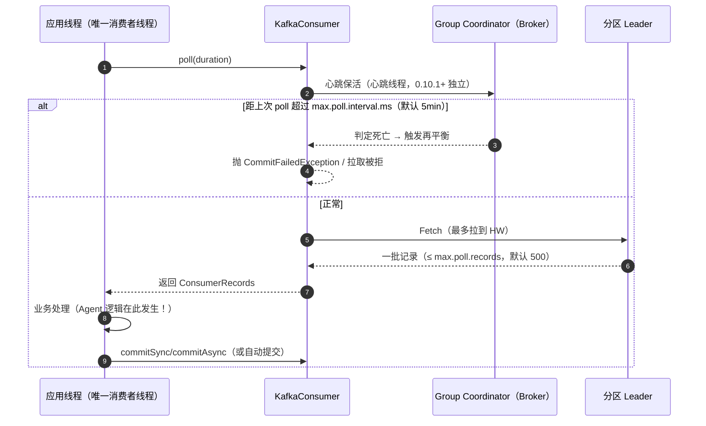
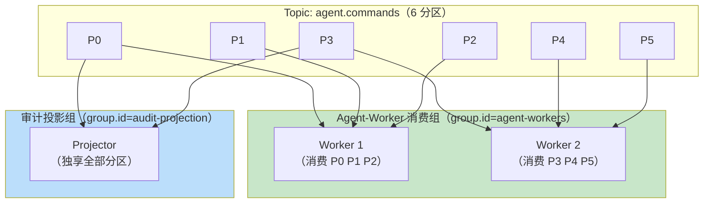
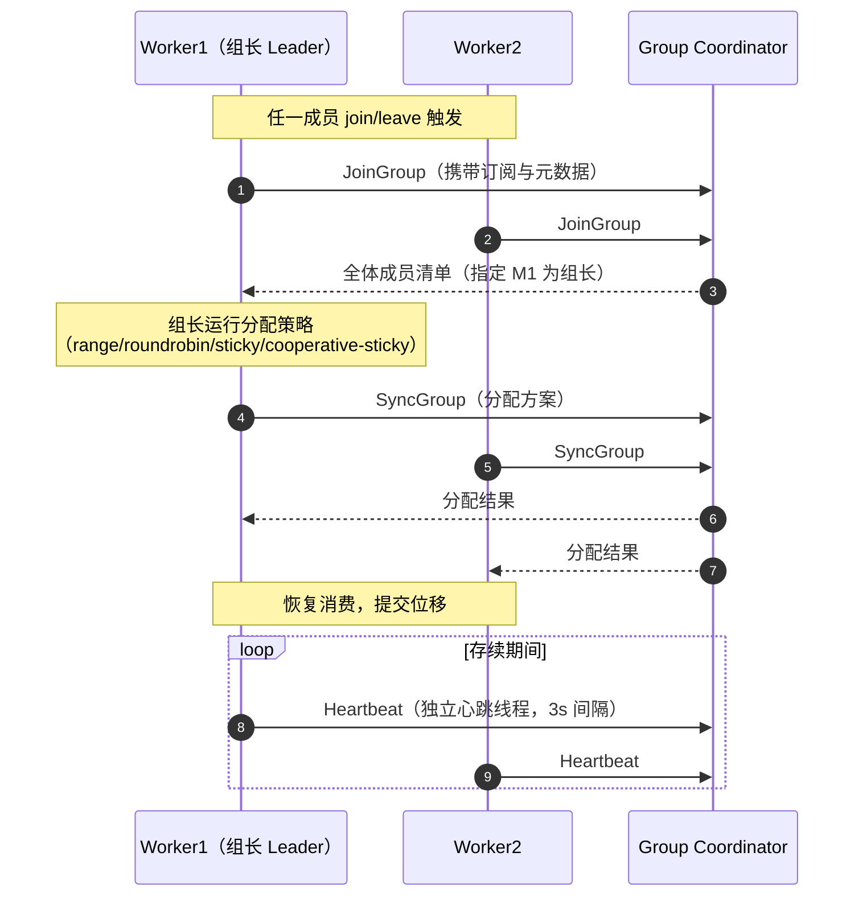
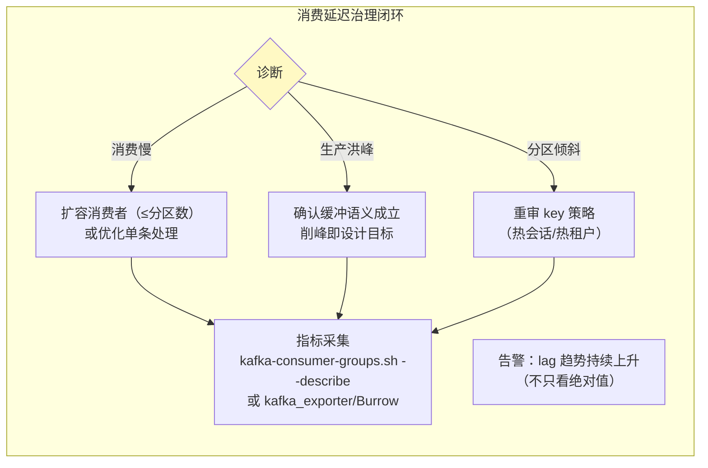

# 消费者与消费组

> **定位**：本文完整拆解消费侧——poll 循环模型、消费组的成员管理与再平衡（经典协议与 KIP-848 新协议）、位移提交策略、静态成员、消费延迟治理，以及 Agent 系统特有的"长 LLM 调用 vs poll 超时"冲突的解法。读完你应能回答：再平衡风暴为什么会发生、at-least-once 的重复从哪来、滚动发布时如何让消费组不抖动。
>
> **读者画像**：读过 [教程 ]、[教程 07-Kafka事件骨干/01-生产者机制与调优] 的 Java 开发者；正在设计 Agent 工作机群（消费组）或事件投影/审计管道的工程师。
>
> **前置阅读**：[教程 07-Kafka事件骨干/00-Kafka全景与核心概念]（消费组/位移概念）；[教程 08-架构师进阶/06-长任务持久化与中断恢复]（消费进度与检查点的关系）。
>
> **版本基准**：kafka-clients 4.1.x；KIP-848 新再平衡协议自 Kafka 4.0 GA。

---

## 1. poll 循环：消费者的一切都在这个循环里

`KafkaConsumer` **不是线程安全的**，且其设计哲学是"单线程事件循环"——所有操作（订阅、拉取、提交、心跳、再平衡回调）都发生在**调用 poll 的那个线程**上：



三个生死攸关的参数：

| 参数 | 默认 | 语义 |
|------|------|------|
| `max.poll.interval.ms` | 5min | **两次 poll 的最大间隔**。超时 = 消费者被踢出组（无论心跳线程是否活着）→ 再平衡 → 处理中的分区被别人接管 |
| `session.timeout.ms` | 45s（3.0+） | 心跳超时判定成员死亡 |
| `max.poll.records` | 500 | 单次 poll 返回的最大记录数。处理这 500 条的总时长必须 < max.poll.interval.ms |

**Agent 系统的天然冲突**：一次 LLM 调用 30s~5min，一次 ReAct 循环更长——如果消费者线程同步等待 LLM 响应，`max.poll.interval.ms` 随时被击穿。解法见 §6。

## 2. 消费组：水平扩缩容的原语



必须内化的三条规则：

1. **组内竞争，组间广播**。`agent-workers` 组 3 个实例分摊 6 个分区；`audit-projection` 组独立消费全量。同一个主题同时服务"工作机群"和"审计投影"两种消费形态，互不干扰。
2. **分区数是组内并行度上限**。Worker 数量超过分区数后，多出的实例空转——扩容前先确认分区数（[教程 07-Kafka事件骨干/05-性能调优与容量规划] §2] 的容量规划）。
3. **位移按组持久化**（`__consumer_offsets`，默认 50 分区、压实主题，按 `group.id` 哈希定位）。每个组有自己的进度，一个组回溯重放不影响其他组——这正是审计回放、评估集重建（[教程 08-架构师进阶/07-数据飞轮与持续改进]）可以随时执行的原因。

## 3. 位移提交：语义的分水岭

| 策略 | 机制 | 语义 | 风险 |
|------|------|------|------|
| 自动提交 | `enable.auto.commit=true`（默认），每 5s 由 poll 触发提交**当前已拉取位置** | 混合：处理完成前提交 → 崩溃后**重复**；拉取后未处理完提交 → 已处理部分若崩溃则……实际是 **at-least-once 倾向的模糊语义** | 重复量不可控，无法精确管理 |
| 处理前手动提交 | `commitSync()` 在业务处理**之前** | **at-most-once**：崩溃即丢 | 只允许在"重复处理比丢失更危险"的场景（如重复扣费） |
| 处理后手动提交 | 处理完一批再 `commitSync()` | **at-least-once**：崩溃后重消费未提交部分 | 必须配合下游幂等（`eventId` 去重） |
| 按分区/按偏移提交 | `commitSync(Map<TopicPartition, OffsetAndMetadata>)` | 精粒度控制，配合异步 worker 池 | 复杂度最高 |

```java
// 处理后提交（at-least-once 标准姿势，spring-kafka AckMode.MANUAL 对应此模型）
@KafkaListener(topics = "agent.session.events", groupId = "audit-projection")
public void onEvent(AgentEvent event, Acknowledgment ack) {
    try {
        project(event);                    // 业务幂等（按 eventId 去重）是前提
        ack.acknowledge();                 // 处理成功才提交
    } catch (NonRetryableException e) {
        deadLetter(event, e);              // 不可重试错误进 DLT，见 [教程 07-Kafka事件骨干/09-Spring集成与Agent事件驱动落地] §3]
        ack.acknowledge();                 // 跳过毒消息，不让它卡死分区
    }
}
```

**关键边界**：`commitAsync` 失败通常可以容忍（下次提交覆盖），但**关闭前应补一次 `commitSync`**；`CommitFailedException` 几乎总是意味着"处理时间超过 max.poll.interval.ms 被踢出组"——它是 §6 问题的第一个症状。

## 4. 再平衡：从"全体罢工"到增量协作

### 4.1 触发条件与经典协议

再平衡（Rebalance）在以下时刻触发：成员加入/退出/崩溃、订阅主题分区数变化、订阅模式变化。经典协议（eager）的流程：



**经典协议的两个致命缺陷**：

1. **Stop-the-world**：eager 协议下每次再平衡，全体成员**撤销全部分区**→ 重新分配 → 恢复。哪怕只是第 3 台实例上线，正在处理的分区也被中断。
2. **再平衡风暴**：Agent 服务发布频繁（[教程 04-企业级架构主干/09-灰度发布与版本管理] 的滚动更新），每次实例退出都引发全组停摆；GC 长调用被误判死亡时雪上加霜。

### 4.2 演进解法：协作式分配与 KIP-848

| 阶段 | 机制 | 效果 |
|------|------|------|
| cooperative-sticky（2.4+，经典协议内的改良） | 增量再平衡：只**真正被迁移的分区**被撤销重分配，其余分区继续消费 | 消除大部分 stop-the-world |
| **KIP-848 新协议（4.0 GA）** | Broker 侧 Group Coordinator 主导：成员心跳携带增量信息、按**成员纪元** fencing、无全局同步屏障 | 再平衡时间从秒级降到亚秒级；重入组不再需要"全体重新握手" |

**架构师视角**：新集群（4.x）应直接享受 KIP-848；但 `cooperative-sticky` 到 KIP-848 都**不能解决**"消费者被踢出组"（那是 `max.poll.interval.ms` 的事），两者是正交问题——别把"再平衡慢"和"处理超时"混为一谈。

### 4.3 静态成员（Static Membership）

`group.instance.id` 赋予成员**稳定身份**：实例重启（滚动发布）在 `session.timeout.ms` 内回归时，Coordinator 直接恢复其原有分区分配，**不触发再平衡**。

```yaml
spring:
  kafka:
    consumer:
      group-id: agent-workers
      properties:
        group.instance.id: ${HOSTNAME}   # K8s Pod 名，天然唯一且重启换新
        session.timeout.ms: 60000        # 给滚动发布留足回归窗口
```

代价：实例崩溃后其分区要等 `session.timeout.ms` 才被接管——**故障恢复延迟**换**发布平稳**，需按 SLO 权衡（[教程 04-企业级架构主干/10-容错与弹性设计] 的可用性视角）。

## 5. 消费延迟：Agent 管道的血压计

**Lag（延迟）= 分区末端位移 − 消费组已提交位移**。它是事件管道最重要的健康指标（审计延迟、任务积压、评估管道落后全部从这里读出）：



实战要点：告警看**趋势与追赶时间**（lag ÷ 消费速率 = 恢复 ETA）而非绝对值；追赶时间是 SLO 的直接输入（"审计投影最多落后 5 分钟"→ 反推所需消费者数与分区数，见 [教程 07-Kafka事件骨干/05-性能调优与容量规划] §7]）。

## 6. Agent 特有难题：长 LLM 调用 vs poll 循环

把一次 3 分钟的 LLM 调用放进 poll 循环 = 被踢出组 = 再平衡 = 分区被接管 = **同一条消息被两个实例处理**。三种解法，按推荐排序：

### 解法 A：poll 线程只分发，worker 池处理，按分区提交（推荐）

```java
@Component
public class AgentCommandListener {

    private final Map<TopicPartition, AtomicInteger> inFlight = new ConcurrentHashMap<>();

    @KafkaListener(topics = "agent.commands", groupId = "agent-workers",
                   concurrency = "#{@topicPartitionCount}")
    public void onCommand(ConsumerRecord<String, AgentCommand> rec,
                          Acknowledgment ack) {
        // 监听容器线程到此即返回（concurrency 个容器线程各自 poll）
        // 重活已由 spring-kafka 容器线程移交 —— 但若仍不够：
        // 关键：max.poll.records 调小（如 50），单批处理预算 < max.poll.interval.ms
        agentCommandHandler.handle(rec.value())   // 返回 Mono，容器线程订阅
            .doFinally(s -> ack.acknowledge())
            .subscribe();
    }
}
```

配套参数：`max.poll.records=50`、`max.poll.interval.ms=600000`（10min）。**前提是容器线程不被业务阻塞**——WebFlux 栈天然契合（订阅即返回）。

### 解法 B：pause/resume 精细背压

poll 返回但暂时不想拿新数据时 `consumer.pause(partitions)`，处理完再 `resume()`——Kafka 原生背压原语，适合手写消费循环时对齐下游（如向量库写入限速）。spring-kafka 场景下 AckMode + 并发度通常已够。

### 解法 C：干脆不用消费者做长任务

命令事件只做**触发**（拿到即提交 + 写任务表），长任务本体交给 [教程 08-架构师进阶/06-长任务持久化与中断恢复] 的检查点机制执行——Kafka 负责"不丢触发"，任务系统负责"可恢复执行"。这是大型平台的常见分层（[项目 13-事件溯源Agent运行时平台] 的组合方式）。

## 7. 适用场景与不适用场景

### 适用场景

- Agent 工作机群：命令/任务事件的消费组化，天然水平扩缩容 + 崩溃接管
- 投影/审计/评估管道：组间广播 + 独立位移，各管道独立回放
- CDC 下游同步（向量库重嵌入）：按 key 分区保证同文档有序（[教程 07-Kafka事件骨干/07-Connect与数据生态] §5]）

### 不适用场景

- 消费速率极低但要求每条**实时**（<10ms）：poll 模型 + 提交开销下不去——考虑直连或轻量队列
- 需要"推"模型（服务器主动推给离线客户端）：Kafka 消费者必须主动 poll，离线推送是另一类系统的事
- 强事务性单条处理（读一条必须与 DB 事务原子）：需要 consume-transform-produce 事务（[教程 07-Kafka事件骨干/03-投递语义与事务] §4]），架构复杂度显著上升，量小时不值

## 8. 常见误区与反模式

1. **在监听线程里同步等 LLM**——被踢出组 + 重复处理，Agent 消费者的头号事故。
2. **用 `enable.auto.commit` 跑审计管道**——重复量不可控；语义要显式（手动提交/幂等）。
3. **"消费者越多越快"**——超过分区数的实例是摆设；先扩分区再扩消费者（扩分区会破坏 key→分区映射，见 [教程 07-Kafka事件骨干/05-性能调优与容量规划] §3] 的警告）。
4. **多线程共享一个 KafkaConsumer**——`KafkaConsumer` 非线程安全（`wakeup()` 是唯一例外）；spring-kafka 的 `concurrency` 本质是**多个 Consumer 实例**各占若干分区。
5. **忽视 `__consumer_offsets` 的健康**——它是压实主题，位于 Broker 磁盘；大量短命消费组（如每次新建 group.id 的定时任务）会推高它的写入与清理压力。

## 9. 监控要点

| 指标 | 来源 | 告警建议 |
|------|------|---------|
| `records-lag-max` | 客户端 JMX | 趋势上升 >10min；或换算追赶时间超 SLO |
| `poll-idle-ratio` | 客户端 | 接近 0 = 消费者饱和；接近 1 = 空转浪费 |
| `commit-latency-avg` | 客户端 | 抬升 → `__consumer_offsets` 分区热点或 Broker 压力 |
| `join-rate` / `sync-rate` | 客户端 | >0 持续 = 再平衡风暴正在发生 |

**外部来源**：[Consumer Configs 官方文档](https://kafka.apache.org/documentation/#consumerconfigs) · [KIP-848: Next-Generation Consumer Rebalance Protocol](https://cwiki.apache.org/confluence/display/KAFKA/KIP-848%3A+Next-Generation+Consumer+Rebalance+Protocol) · [KIP-345: Static Membership](https://cwiki.apache.org/confluence/display/KAFKA/KIP-345%3A+Introduce+static+membership+protocol+to+reduce+consumer+rebalances)

## 10. 总结

消费侧的心脏是 **poll 循环 + 消费组协议**：组内竞争/组间广播给 Agent 机群提供了免协调的水平扩缩容；位移提交策略决定 at-least/at-most 语义；再平衡从 stop-the-world 演进到 KIP-848 增量协作，静态成员让滚动发布不再抖动；而"长 LLM 调用击穿 `max.poll.interval.ms`"是 Agent 架构特有的雷区，分发-处理分离或任务表分层是两条正道。语义的最后一环——重复与丢失的精确治理——在下一篇展开：[教程 07-Kafka事件骨干/03-投递语义与事务]。
