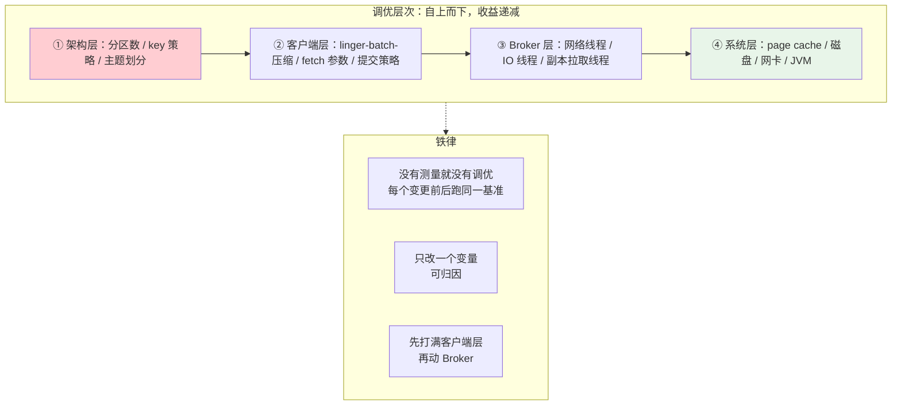

# 性能调优与容量规划

> **定位**：本文把前四篇的机制换算成数字——分区数怎么定、Producer/Consumer/Broker 三层参数怎么调、端到端延迟与吞吐如何权衡、Agent 平台的事件量怎么估算成集群规格。核心方法论：**先测量、后调参、每一步有基线对照**。
>
> **读者画像**：要为 Agent 平台做上线容量评审、或接手一个"消费延迟告警"的工程师；需要回答"3 台 Broker 够不够""分区开多少"的架构师。
>
> **前置阅读**：[教程 07-Kafka事件骨干/01-生产者机制与调优 §4]（批量/压缩）、[教程 07-Kafka事件骨干/02-消费者与消费组 §5]（延迟治理）、[教程 07-Kafka事件骨干/04-日志存储与高可用复制 §1]（为什么快）。
>
> **版本基准**：Kafka 4.1；基准工具 `kafka-producer-perf-test.sh` / `kafka-consumer-perf-test.sh` 为发行版自带。

---

## 1. 调优的层次模型



绝大多数"Kafka 慢"在架构层（分区不足/热键倾斜）和客户端层（linger=0 无压缩），动到 Broker 层之前先把这两层的免费收益拿完。

## 2. 分区数：最重要的架构决策

分区数同时是：**生产并行度、消费并行度上限、顺序边界、Leader 选举与再平衡的成本单元**。

**估算公式**（以上线前 perf-test 实测校准）：

```
分区数 ≥ max(
    目标生产吞吐 / 单分区生产吞吐实测值,
    目标消费吞吐 / 单分区消费吞吐实测值
) × 2 (增长余量)

经验值：单分区生产吞吐（linger=10ms, zstd, 2KB 消息）常见 10~30 MB/s；
        单分区消费吞吐受下游处理耗时支配，必须自测。
```

**太少与太多都是病**：

| 症状 | 根因 | 处置 |
|------|------|------|
| 消费 lag 持续增长，消费者数 = 分区数仍追不上 | 分区不足（并行度天花板） | 扩分区——但注意 key→分区映射重排破坏同 key 顺序（[教程 07-Kafka事件骨干/04-日志存储与高可用复制] §7]） |
| 端到端延迟高、再平衡慢、Broker 打开句柄多、`metadata` 请求变慢 | 分区过多（尤其对小集群） | 合理目标：每 Broker 承载 2000~4000 分区；3 节点集群别开 1000 分区 |
| 单分区流量远超其他分区 | 热键（大租户/大会话） | key 加盐或改 key 粒度（[教程 07-Kafka事件骨干/01-生产者机制与调优] §2]） |

**架构师守则：分区数在主题创建时一次到位**。扩分区不可逆且破坏 key 顺序——宁可规划余量，不要"先开 6 个试试"。

## 3. 客户端参数速查（按目标组织）

### 3.1 生产者

| 目标 | 参数组合 | 说明 |
|------|---------|------|
| 吞吐优先 | linger.ms=10~20、batch.size=64KB、zstd/lz4 | 批量+压缩是数量级的收益 |
| 延迟优先 | linger.ms=0~2、acks=1（可容忍时） | 交互命令通道 |
| 可靠优先 | acks=all、幂等开、delivery.timeout.ms 覆盖重试 | 语义见 [教程 07-Kafka事件骨干/03-投递语义与事务] §2] |
| 大对象洪峰 | buffer.memory=64MB+、监测 buffer-available-bytes | 防 max.block 阻塞 send |

### 3.2 消费者

| 目标 | 参数组合 | 说明 |
|------|---------|------|
| 提高拉取效率 | fetch.min.bytes=1MB、fetch.max.bytes=100MB（默认 50MB） | 大批量场景减少往返 |
| 长处理保护 | max.poll.records=50~100、max.poll.interval.ms=600000 | Agent 长调用防线（[教程 07-Kafka事件骨干/02-消费者与消费组] §6]） |
| 平滑发布 | group.instance.id + session.timeout.ms=60s | 静态成员免再平衡 |
| 追赶滞后 | 临时加实例（≤分区数）、确认处理本身非瓶颈 | 先诊断再动手 |

### 3.3 Broker（server.properties）

| 参数 | 默认 | 方向 |
|------|------|------|
| num.network.threads | 3 | 处理请求线程；CPU 核多时 8+ |
| num.io.threads | 8 | 磁盘/复制操作线程 |
| num.replica.fetchers | 1 | **每分区 1 → 提到核数的一半**，副本追赶速度的常见瓶颈 |
| log.flush.interval.messages | Long.MAX | 保持默认（依赖副本，不靠 fsync） |
| auto.leader.rebalance.enable | true | 保持 true，均衡 Leader 分布 |

## 4. 端到端延迟：每个数字从哪来

| 来源 | 量级 | 可优化手段 |
|------|------|-----------|
| linger.ms 窗口 | 0~20ms | 吞吐敏感时接受；延迟敏感设 0 |
| Broker 追加写 + page cache | <5ms | 基本免调 |
| acks=all 复制往返 | 跨 AZ 加 1~5ms | 副本跨 AZ（可靠性）与同 AZ（延迟）的取舍：**审计类跨 AZ，命令类同 AZ** |
| 消费者 poll 间隔 + fetch 攒批 | 0~50ms | fetch.min.bytes 调小（延迟敏感） |
| 冷读（分层存储回拉） | 秒级 | 保持热层数据量覆盖高频访问 |
| read_committed LSO 等待 | ≤事务提交间隔 | 事务管道的固有代价（[教程 07-Kafka事件骨干/03-投递语义与事务] §3.3]） |

## 5. 系统层：磁盘、内存、JVM、网络

1. **磁盘**：SSD/NVMe 首选；多块盘用 JBOD（每盘独立目录）比 RAID0 更可控（坏一块只丢一个目录的分区——配合 RF=3 修复）。XFS 文件系统。
2. **内存**：**大头给 page cache**。Broker 堆 4~6GB 足矣（G1GC），剩余内存交给 OS 缓存日志段——"热数据集 ≤ page cache"是吞吐平台期的分界线。
3. **JVM**：G1，堆外内存留给网络缓冲；监控 GC 停顿（[教程 07-Kafka事件骨干/08-运维监控与安全] §6]）。
4. **OS**：文件句柄（每分区至少 2 个打开文件 × 副本数，ulimit 10 万起）、`vm.swappiness=1`、关闭 swap。
5. **网络**：估算 = 峰值生产吞吐 × (1 副本接收 + RF-1 复制出 + 消费出) —— **复制流量是隐性大头**：RF=3 时入 1 份出 2 份，加上消费读，NIC 容量按 4× 生产吞吐预留。

## 6. 基准测试：动手模板

```bash
# 生产端基线：1KB 消息，不限吞吐，3 个分区，acks=all，zstd
kafka-producer-perf-test.sh \
  --topic perf.test --num-records 10000000 --record-size 1024 \
  --throughput -1 --producer-props bootstrap.servers=${KAFKA} \
  acks=all compression.type=zstd linger.ms=10

# 关键输出：records/sec、MB/sec、avg latency、max latency、p99
# 消费端基线
kafka-consumer-perf-test.sh --bootstrap-server ${KAFKA} \
  --topic perf.test --messages 10000000
```

方法论三条：用**真实事件 payload**（压缩收益与 JSON 高度相关）；记录环境（盘型/网络/消息大小/参数集）随结果归档；**变更一个参数重跑一轮**，形成对照表——容量评审的依据是这张表，不是直觉。

## 7. Agent 平台容量估算示例

需求：10,000 活跃会话/天，每会话 150 个事件（会话事件+工具审计+遥测），均值 2KB：

```
事件量 = 10,000 × 150 × 2KB ≈ 3 GB/天（原始）
× zstd 压缩 6:1          ≈ 0.5 GB/天（落盘）
× RF=3                   ≈ 1.5 GB/天（含副本）
× 审计保留 400 天        ≈ 600 GB（→ 分层存储：热 7 天本地 ≈ 10.5GB，其余 S3）
峰值吞吐：晚高峰集中 20% 日量于 1 小时 ≈ 160 KB/s 峰值生产（很小！）
分区：消费侧受支配——审计投影单条 10ms，单分区 100 msg/s，
      峰值 250 msg/s → 6 分区 × 2 余量 = 12 分区足够
```

结论：Agent 平台的 Kafka 容量瓶颈几乎永远不在吞吐，而在**消费侧处理时长**（投影写库、下游 LLM 分析）与**留存成本**（审计天数）。这解释了为什么 3 节点小集群对大多数 Agent 平台绰绰有余，而调优重点应放在消费组并行度与分层存储。

## 8. 常见误区与反模式

1. **无基线调参**——"把 num.io.threads 调到 32"没有前后对照，等于迷信。
2. **用调参掩盖架构错**：lag 告警就加 fetch.max.bytes，实际是下游 DB 慢/分区热键倾斜——先诊断（[教程 07-Kafka事件骨干/02-消费者与消费组] §5] 闭环）。
3. **分区数拍脑袋给 100**——对低流量主题，再平衡时间与元数据成本远大于收益。
4. **Broker 堆内存给太大**——挤掉 page cache，吞吐反降（[教程 07-Kafka事件骨干/04-日志存储与高可用复制] §7]）。
5. **只压测生产不压测消费**——端到端容量由短板决定；尤其要模拟**消费者追赶**（重启后 lag 回退场景）。

## 9. 监控基线

调优的验收就是监控曲线：生产 `request-latency-avg`、消费 `records-lag-max`、Broker `RequestHandlerAvgIdlePercent`（>30% 视为健康）、`under-replicated` 必须为 0——完整指标体系见 [教程 07-Kafka事件骨干/08-运维监控与安全 §6]。

## 11. 适用场景与不适用场景

### 适用场景 ✅

- **上线前容量评审**：要回答"分区开多少 / 3 台 Broker 够不够 / 审计留存多久"——§2 估算公式 + §7 的 Agent 平台估算模板
- **消费 lag 持续增长的诊断性调优**：按 §1 层次模型自上而下归因（架构 → 客户端 → Broker → 系统），先拿完免费收益
- **参数变更要有对照依据**：§6 的 perf-test 模板变更前后跑同一基准，一张对照表进容量评审（§9 监控基线验收）
- **端到端延迟不达标**：§4 把延迟拆到 linger / 复制往返 / poll 间隔 / 冷读逐项定位该压哪一层
- **成本规划**：事件量 × 压缩 × RF × 保留天数换算存储与分层存储决策（§7 的 600GB → 热 7 天本地 + 其余 S3）

### 不适用场景 ❌

- **没有监控基线就调参**：§8 反模式 1——先建 §9 基线曲线，变更前后才"可归因"
- **用调参掩盖架构错**：lag 根因是下游 DB 慢 / 热键倾斜时，先修架构与 key 策略（§8 反模式 2）
- **瓶颈尚未定位在 Kafka**：Agent 平台的容量瓶颈几乎永远在消费侧处理时长与留存成本（§7 结论）——投影写库慢不靠调 Kafka 参数
- **故障应急时刻**：本篇是"平时"方法论；URP/控制器异常等 P0 告警处置走 → [教程 07-Kafka事件骨干/08-运维监控与安全] 的 runbook
- **低流量一次性内部主题**：全套基准与分区规划的成本远大于收益，默认值即可（§8 反模式 3 的另一面）

## 10. 总结

容量规划回答三个问题：**吞吐要多大（perf-test 实测 → 分区数）、延迟要多少（层次拆解 → 参数取舍）、留存要多久（保留策略 → 分层存储）**。Agent 平台的特殊性在于：事件量通常不大，但单条处理重（投影/LLM 后处理）且审计留存长——所以分区数由消费并行度决定，集群规格由留存成本决定。下一篇进入流处理：[教程 07-Kafka事件骨干/06-KafkaStreams流处理]。

**外部来源**：[Kafka Performance Testing 官方工具](https://kafka.apache.org/quickstart) · [Confluent: Kafka Tuning](https://docs.confluent.io/platform/current/kafka/deployment.html#tuning)
