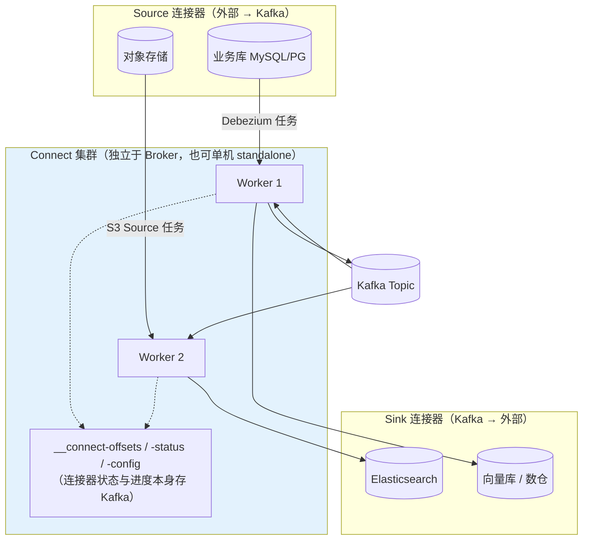
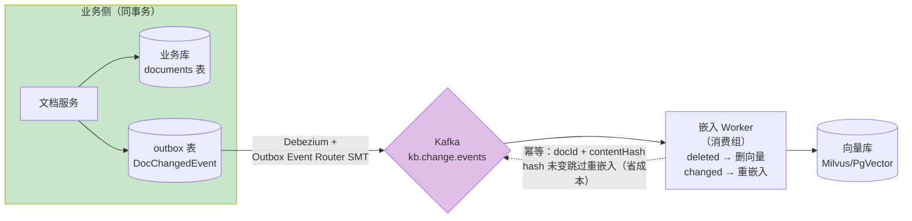

# Connect 与数据生态

> **定位**：本文讲数据如何进出 Kafka 生态——Connect 框架模型、Debezium CDC（含 Agent 平台最重要的落地：业务库变更 → 知识库重嵌入 → 向量库同步）、Schema Registry 与契约演化、MirrorMaker 2 跨集群。读完你能回答"文档知识库怎么自动跟业务库保持一致""事件契约怎么演化而不炸下游"。
>
> **读者画像**：读完 [教程 00-基础与核心/00-Agent核心概念]、正在为 RAG 知识库设计同步链路、或为多区域 Agent 平台设计数据复制的工程师与架构师。
>
> **前置阅读**：[教程 07-Kafka事件骨干/03-投递语义与事务 §6]（Outbox 模式——CDC 是其实现通道）；[教程 00-基础与核心/05-RAG检索增强生成]（知识库 ETL）；[教程 04-企业级架构主干/05-历史记录持久化与合规]（数据复制与合规语境）。
>
> **版本基准**：Kafka Connect 随 Kafka 4.1；Debezium 3.x（独立项目，按版本矩阵与 Kafka 4.x 搭配）。

---

## 1. Connect：把"数据进出 Kafka"标准化

Connect 是 Kafka 自带的**数据搬运框架**——把"连接外部系统"这件事从业务代码里抽走，变成配置驱动的连接器：

核心概念四件：**Connector**（声明"怎么连"，配置 JSON）定义作业；**Task**（作业的并行分片，source 按表/分区切、sink 按 topic 分区切）执行搬运；**Converter**（key/value 的字节格式，JSON/Avro/Protobuf）决定线格式；**SMT**（Single Message Transform，管道上的轻量变换，如重命名/过滤字段）。管理走 REST API（`PUT /connectors`），运行状态与位移持久化在 Kafka 内部主题——**Connect 自己也是事件驱动的**，Worker 挂了任务自动迁移（又是消费组逻辑的复用）。

选型直觉：一次性/简单搬运用 Kafka MirrorMaker 或自写消费者；**持续性、多表、需要断点续传的集成**用 Connect——它替你处理了位移管理、并行、失败恢复这三个最烦的部分。

## 2. Debezium CDC：变更数据的正源

轮询 vs 日志 CDC 的本质差异：

| 方案 | 机制 | 缺陷 |
|------|------|------|
| 轮询查询 | 定时 `SELECT * WHERE updated_at > ?` | 打不出删除；时间戳不可靠；大表扫描压垮业务库；延迟=轮询间隔 |
| 双写 | 业务代码同时写 DB 和 Kafka | 一致性无解（[教程 07-Kafka事件骨干/03-投递语义与事务] §6] 反模式） |
| **日志 CDC** | 读 DB 的 WAL/binlog | 无侵入、捕获删除（tombstone）、顺序保真、毫秒级延迟 |

Debezium 事件结构（PG 例）：`before`（变更前）、`after`（变更后）、`source`（位点：lsn/xid/ts）、`op`（c/u/d/r——r 为初始快照读）。三个工程要点：

1. **快照 + 增量**：首次启动先一致性快照（`snapshot.mode=initial`），再追日志；重启从 `__connect-offsets` 记录的位点续读——**全程 at-least-once，下游必须幂等**。
2. **Schema History**：表结构变更与日志位点绑定存储（DDL 历史主题），避免"用新 schema 解旧数据"的漂移。
3. **每表一主题**（默认 `server.schema.table`）+ 按主键分区 → 同行变更有序，天然契合压实（changelog 语义）。

## 3. Agent 平台杀手级落地：知识库自动同步

**问题**：[教程 00-基础与核心/05-RAG检索增强生成] 的知识库是快照式的——业务库（商品、文档、工单知识）变了，向量库不会自己变；手工重嵌入既滞后又易漏。

**方案**（把 [教程 07-Kafka事件骨干/03-投递语义与事务] §6] Outbox 与 RAG ETL 串成一条流水线）：

设计细节四条：

1. **去重键下推**：事件带 `contentHash`，Worker 比对"当前向量库该 docId 的 hash"——内容没变就不调 embedding（embedding 是真实成本，[教程 03-React前端与AgenticUI/03-Agentic-UI设计] 的口径里要算）。
2. **删除传播**：业务删除 → CDC tombstone → Worker 删向量——**向量库与业务库最终一致的完整生命周期**（含 GDPR 删除权，[教程 03-React前端与AgenticUI/01-React状态管理 §6]）。
3. **顺序按 docId 分区**（key=docId）：同一文档的变更有序，避免旧版覆盖新版。
4. **工具注册表同理**：MCP 工具元数据变更 → CDC → 网关缓存失效事件——同一模式复用于"配置变更的实时分发"（[教程 04-企业级架构主干/00-管控分离架构] 数据面缓存一致性的一条实现路径）。

## 4. Schema Registry：事件契约的治理

事件结构演化是事件驱动平台的长期税。Schema Registry 的解法：**生产端注册 schema → 消费端拉取校验 → 兼容性策略拦截破坏性变更**。

- **线格式**：Avro/Protobuf 消息头 5 字节（magic + 4 字节 schema id），payload 不内嵌结构——加字段不再需要"重新发布所有消费者"。
- **Subject 命名策略**：默认 `TopicNameStrategy`（`topic-value` 一个 subject）；事件种类多时用 `RecordNameStrategy`（每事件类型一个 subject）——Agent 事件体系（TaskCreated/ToolExecuted/...）选后者。
- **兼容级别**：`BACKWARD`（新 schema 能读旧数据：可加带默认值的字段、可删字段）最常用；`FORWARD/FULL` 更严格；**TRANSITIVE** 校验对全部历史版本。平台立场：**BACKWARD_TRANSITIVE** 起步。
- **字段演化纪律**（不依赖注册中心的版本号兜底）：只加不删、新字段带默认、不改字段语义——与 [附录 06-企业级架构模式/02-事件驱动Agent架构 §2.2] 事件结构的 `version` 字段配合使用。

实现选型：Confluent Schema Registry（事实标准）或 Apicurio（开源、无 Confluent 依赖）。**JSON 事件也应注册**（JSON Schema 同样可校验），注册中心的价值是流程治理而不只是二进制编码。

## 5. MirrorMaker 2：跨集群复制

MM2 是 Connect 框架上的内置应用，做**集群间主题复制**：

| 拓扑 | 用途 | Agent 场景 |
|------|------|-----------|
| active → passive | 灾备（DR） | 主区域 Agent 平台 → 备区域热备，故障时 RPO≈0、RTO=切换时间 |
| active ↔ active | 双活 | 跨区域事件的就近读写（注意：**双向复制必须配防环**——MM2 用 replication flag 标记已复制记录） |

三条机制级认知：复制也是普通生产消费（MM2 = source connector + 内部消费组），复制延迟就看那个消费组的 lag；**位移翻译**（checkpoint 连接器）把源集群消费位移映射到目标集群——DR 切换后消费组能从"等价位置"继续；topic/config/ACL 同步策略按前缀白名单控制，**不要无脑 `.*`**（内部主题与心跳主题要排除）。

**与"多区域数据驻留"的关系**（[项目 07-跨国多租户SaaS-Agent平台]）：驻留要求事件**不出域**时，MM2 反而是禁用项——按租户分区数据面、每区域独立集群 + 显式跨境同步策略，才是合规正解。

## 6. 适用场景与不适用场景

### 适用场景

- 知识库/工具注册表与业务库的最终一致同步（CDC + 幂等 Worker）
- 审计/遥测事件入数仓或 ES（Sink 连接器，省自写消费者）
- 事件契约治理（Schema Registry 强制兼容）
- DR/多区域（MM2 或分区域自治）

### 不适用场景

- 单向一次性搬迁（脚本 + `kafka-console-producer` 更直接）
- 强同步语义（CDC 是异步最终一致；要求读写同步走业务库本体）
- 复杂 per-message 业务逻辑（那是普通消费者/Streams 的职责——Connect 的 SMT 只做轻量变换）
- 无治理意愿的 JSON 自由演化（Schema Registry 半途引入的改造税很重，要么早要么明确不启用）

## 7. 常见误区与反模式

1. **用双写代替 CDC**——一致性无解（[教程 07-Kafka事件骨干/03-投递语义与事务] §6]），见 Outbox。
2. **CDC 直接连接业务库主实例**——逻辑解码/位点读取有开销，接**副本实例**并给独立账号最小权限。
3. **SMT 里写业务逻辑**——Connect 集群变成隐形的业务服务，无法测试无法治理；SMT 只做格式变换。
4. **兼容性策略设 NONE 还装作有治理**——注册中心的价值全在策略执行；NONE 等于付费买了序列化器。
5. **MM2 复制一切**——内部主题与跨域敏感审计一起复制，事故+合规双输；按前缀白名单收口。

## 8. 总结

Connect/Debezium/Schema Registry/MM2 四件套把 Kafka 从"消息管道"升级为"数据平台"：CDC 给了事件驱动**可靠的数据正源**（Outbox 的实现通道），Agent 平台用它打通知识库→向量库的自动同步；注册中心把事件契约从口头约定变成 CI 级强制；MM2 承载 DR 与多区域。下一篇转向运维面——部署拓扑、安全（SASL/ACL/配额）、监控与故障处置：[教程 07-Kafka事件骨干/08-运维监控与安全]。

**外部来源**：[Debezium Documentation](https://debezium.io/documentation/) · [Kafka Connect Guide](https://kafka.apache.org/documentation/#connect) · [Confluent Schema Registry 兼容性](https://docs.confluent.io/platform/current/schema-registry/avro.html) · [MirrorMaker 2](https://kafka.apache.org/documentation/#georeplication)
