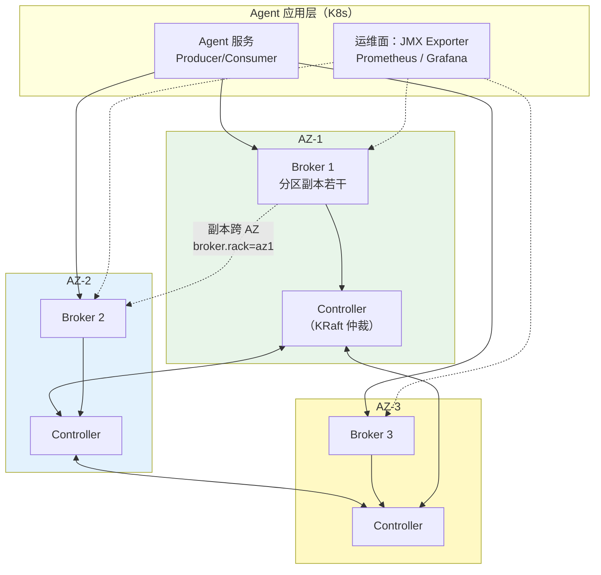
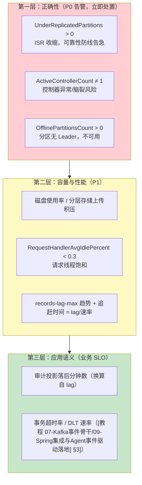

# 运维监控与安全

> **定位**：本文是 Kafka 主题的运维篇——生产拓扑（KRaft/多 AZ/资源规格）、多租户安全（SASL/TLS/ACL/配额）、监控指标体系与告警、扩缩容与再均衡、故障处置 runbook、DR。视角始终是"Agent 平台的 Kafka"：它上面跑的审计流、会话事件对 SLO 的要求是什么。
>
> **读者画像**：读完 [教程 00-基础与核心/00-Agent核心概念]、要把 Kafka 从"能跑"推向"敢上生产"的工程师；需要为多租户 Agent 平台制定事件层隔离与配额策略的架构师。
>
> **前置阅读**：[教程 07-Kafka事件骨干/04-日志存储与高可用复制 §4]（KRaft）；[教程 04-企业级架构主干/06-多租户隔离与资源治理]（配额与隔离的平台语境）；[教程 04-企业级架构主干/13-部署与运维]（K8s 与探针的通用实践）。
>
> **版本基准**：Kafka 4.1（KRaft-only）。

---

## 1. 生产部署拓扑



六条拓扑纪律：

1. **控制器与 Broker 分离部署**（独立 3 台小规格），奇数仲裁；控制器只吃元数据，磁盘小而稳（SSD）。
2. **`broker.rack` 设为 AZ**——副本分配自动跨机架，单 AZ 整体故障不丢已提交消息（RF=3 时）。
3. Broker 数量按**磁盘吞吐/容量**与**分区数上限**（每 Broker 2~4 千分区）规划，Agent 平台常见 3~5 台起步（[教程 07-Kafka事件骨干/05-性能调优与容量规划] §7] 的容量结论）。
4. 环境隔离：生产/预发/测试独立集群——**审计保留期与配额策略不允许共享**。
5. K8s 上的主流路径是 **Strimzi Operator**（Kafka CRD、机架感知映射到 K8s 拓扑标签、 Cruise Control 集成再均衡）——与 [教程 04-企业级架构主干/13-部署与运维] 的声明式运维同构。
6. 有状态部署的铁律：Broker 是**有状态宠物**，用本地盘 + StatefulSet，不做"随意重建"的假设。

## 2. 多租户隔离：Agent 平台的事件层治理

延续 [教程 04-企业级架构主干/06-多租户隔离与资源治理] 的分层隔离思想，Kafka 层的三道闸：

### 2.1 命名空间与 ACL

```
租户事件主题：tenant-{tenantId}.session.events（或统一主题 + 租户头）
ACL 授权模型：
  Resource  = topic / group / cluster / transactional-id
  Principal = User:svc-agent-{tenantId}（每租户独立服务账号）
  规则示例：ALLOW User:svc-acme READ topic tenant-acme.#
           ALLOW User:svc-acme READ group acme-workers
默认无权限（deny-by-default）——与 [教程 04-企业级架构主干/11-安全与权限控制] 的最小权限原则同一逻辑。
```

主题策略两路线：**主题级隔离**（tenant-* 前缀，ACL 用前缀授权、保留策略可按租户差异化、导出/删除整租户简单——多租户 SaaS 推荐）vs **统一主题 + 租户字段**（主题数量少、运维轻，但 ACL 失效、无法按租户保留——只适合内部平台）。[项目 07] 的驻留要求进一步强化主题级路线。

### 2.2 配额：防"吵闹邻居"

| 配额（per client-id / per user） | 语义 | Agent 场景 |
|------|------|-----------|
| `producer_byte_rate` | 生产字节速率 | 遥测洪峰租户限速，保护审计链路 |
| `consumer_byte_rate` | 消费字节速率 | 防评估回放（全量重放）打满网卡 |
| `request_percentage` | Broker 请求处理时间占比 | 兜底 CPU 防护 |

配额超限不拒绝请求而是**延迟响应（throttle）**——即平滑限速。配额是**平台级多租户防线**，应用侧限流（[教程 04-企业级架构主干/06-多租户隔离与资源治理] 的 LLM 令牌桶）管的是模型调用，两者互补而非替代。

### 2.3 认证：SASL/TLS 通道

| 机制 | 适用 | 备注 |
|------|------|------|
| SASL/SCRAM-SHA-512 | 内网平台默认 | 凭证存 Broker 元数据，可轮换 |
| SASL/PLAIN | 仅 TLS 内 | 明文凭经 TLS 保护 |
| mTLS（双向证书） | 高合规 | 证书运维成本最高 |
| SASL/OAUTHBEARER | 平台化 | 与企业 IdP/OIDC 对接，服务身份统一管理 |

多监听器模式（`listeners=INTERNAL,EXTERNAL` + `listener.security.protocol.map`）：内部流量 SASL、跨网段流量 mTLS——一份配置服务两种信任边界。

## 3. 监控指标体系



采集路径：JVM JMX → [jmx_exporter](https://github.com/prometheus/jms_exporter) → Prometheus（spring-kafka 应用侧还有 Micrometer 通道，见 [教程 07-Kafka事件骨干/09-Spring集成与Agent事件驱动落地] §6]）；消费 lag 的独立通道用 kafka_exporter 或 Burrow（SLA 式判定：lag 是否在收敛）。**三层缺一不可**：只有第一层是"集群活没活"，业务真正感受到的是第三层"审计落后了 40 分钟"。

## 4. 扩缩容与再均衡

- **加 Broker 不会自动迁移数据**——新分区会自动分布其上，**存量分区要显式再分配**：`kafka-reassign-partitions.sh`（手工 JSON）或 **Cruise Control**（目标导向：磁盘/负载均衡 + 自动生成迁移计划 + 限速执行）。迁移有限速（`replica.alter.flow`），大集群的再分配是**小时级后台任务**。
- **缩容/换盘**：先再分配走数据，再摘除——直接下线 = 分区副本数临时下降，配合 min.insync.replicas=2 可能触发拒写。
- **滚动重启**（升级/证书）：静态成员（[教程 07-Kafka事件骨干/02-消费者与消费组] §4.3]）让消费侧不风暴；Broker 侧逐台滚动，Controller 仲裁自动接管——KRaft 时代这是分钟级操作。

## 5. 故障处置 runbook（浓缩版）

| 症状 | 第一反应 | 根因方向 |
|------|---------|---------|
| URP 告警 | 看 lag 的副本是否单点（盘/网络/单 Broker 抖动） | 磁盘满/IOPS 打满/页缓存被挤 |
| 消费 lag 尖刺 | 对齐发布时间线（再平衡 or 重启恢复） | 再平衡风暴 / changelog 重放（Streams）/ 下游 DB 慢 |
| `NotEnoughReplicasException` | ISR 跌破 min.insync.replicas——**先恢复副本，慎勿降配** | 副本滞留：`num.replica.fetchers`、跨 AZ 网络 |
| 磁盘 90% | 分层存储上传是否积压；retention 是否被某主题击穿 | 热层保留期设置/审计洪峰 |
| `ProducerFencedException` | transactional.id 冲突（多实例同 id） | [教程 07-Kafka事件骨干/03-投递语义与事务] §8]，查部署副本数与 id 分配 |
| 全量客户端超时 | 控制器选举抖动 / 元数据传播延迟 | 看控制器日志与 `metadata.log` 滞后 |

## 6. DR：灾备与多区域

- **RPO=0 路线**：MM2 异步复制（[教程 07-Kafka事件骨干/07-Connect与数据生态] §5]）+ 复制延迟监控（源端位移差）；切换时消费者用**位移翻译**（checkpoint）续读。
- **RTO 的真实构成**：DNS/入口切换 + 消费者组重加入 + 热身（Streams changelog 重放）——DR 演练必须实测这条链，纸面 RTO 无意义。
- **合规驱动的架构分叉**：数据驻留要求下不做跨域复制，改"每区域独立集群 + 显式跨境白名单事件流"（[项目 07] 迭代八的 DR 多活结论同构）。

## 7. 常见误区与反模式

1. **RF=3 + min.insync.replicas=1**：故障时静默单副本写——三件套缺失（[教程 07-Kafka事件骨干/01-生产者机制与调优] §3]）。
2. **ACL 给了 `User:* ALLOW ALL`**：多租户平台的事故起点；deny-by-default + 前缀最小授权。
3. **只监控 Broker 不监控 lag**：集群全绿、审计落后一小时——第三层指标才是业务 SLO。
4. **加节点解决"磁盘满"却不做再分配**：新老 Broker 冷热不均，旧节点继续满。
5. **Broker 当无状态服务随意重建**：本地数据即资产，重建=丢分区副本（靠其他副本修复，窗口内可靠性降级）。

## 9. 适用场景与不适用场景

### 适用场景 ✅

- **把 Kafka 从"能跑"推向"敢上生产"**：跨 AZ 拓扑 + KRaft 控制器分离部署 + `broker.rack` 副本分布（§1 六条纪律）
- **多租户 SaaS 的事件层治理**：`tenant-*` 主题级隔离 + 前缀 ACL（deny-by-default）+ 生产/消费配额防吵闹邻居（§2）
- **建立告警与值班体系**：三层指标——P0 正确性（URP/控制器/离线分区）→ P1 容量性能 → 业务 SLO（§3）
- **扩缩容 / 滚动升级有纪律**：Cruise Control 再分配限速、静态成员免再平衡风暴（§4）
- **灾备与数据驻留合规**：MM2 RPO=0 + 位移翻译，或驻留要求下的每区域独立集群分叉（§6）

### 不适用场景 ❌

- **开发 / POC 单机环境**：KRaft 单节点 + PLAINTEXT 即可，SASL/TLS/多 AZ 全套是过度工程
- **内部单租户平台**：主题级 ACL 与每租户配额的治理成本没有对应收益——统一主题 + 租户字段路线即可（§2.1 两路线对比）
- **吞吐 / 延迟参数本身的调优**：→ [教程 07-Kafka事件骨干/05-性能调优与容量规划]——本篇管运维与治理面，不管容量数字
- **数据可随时全量重建的纯缓存流**：RPO 目标本身不存在，MM2 复制与 DR 演练的常备运维成本可省（§6 的适用前提）

## 8. 总结

运维篇的骨架是三道防线：**拓扑上**跨 AZ 副本 + KRaft 仲裁保可用；**治理上**ACL 前缀授权 + 配额限速保多租户公平（与 [教程 04-企业级架构主干/06-多租户隔离与资源治理] 的平台隔离体系互为表里）；**观测上**三层指标从"集群活着"讲到"审计落后几分钟"。加上扩缩容的再均衡纪律与 DR 的 RPO/RTO 实测，Kafka 才算真正进入生产态。最后一篇把 Spring 生态与 Agent 事件驱动架构总装：[教程 07-Kafka事件骨干/09-Spring集成与Agent事件驱动落地]。

**外部来源**：[Kafka Security](https://kafka.apache.org/documentation/#security) · [Kafka Operations（多租户/配额）](https://kafka.apache.org/documentation/#multitenancy) · [Strimzi](https://strimzi.io/) · [Cruise Control](https://github.com/linkedin/cruise-control) · [Burrow](https://github.com/linkedin/Burrow)
