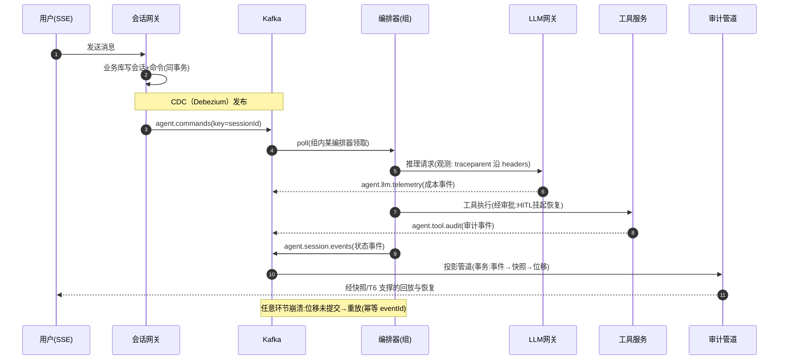

# Spring 集成与 Agent 事件驱动落地

> **定位**：Kafka 主题收官篇——spring-kafka 4.x 的正确姿势（监听容器/错误处理/死信/重试/事务/虚拟线程）、reactor-kafka 与 WebFlux 铁律、Micrometer 可观测打通，最后把 9 篇机制总装成一张「事件驱动 Agent 平台」架构蓝图，锚定 [项目 13-事件溯源Agent运行时平台]。
>
> **读者画像**：读完 [教程 00-基础与核心/00-Agent核心概念]、要在 Spring Boot 4.1 + WebFlux 技术栈里真正落地事件驱动 Agent 服务的工程师。
>
> **前置阅读**：[教程 07-Kafka事件骨干/02-消费者与消费组 §6]（长调用防线）；[教程 07-Kafka事件骨干/03-投递语义与事务 §5-6]（幂等/Outbox）；[附录 06-企业级架构模式/02-事件驱动Agent架构]（架构模式层——本文是其工程实现层）。
>
> **版本基准**：spring-kafka 4.x（随 Spring Boot 4.1 BOM）；reactor-kafka 1.3.x（Spring Boot BOM 已管理版本，若未管理需显式指定）。**需在 pom.xml 中添加依赖**：

```xml
<dependency>
    <groupId>org.springframework.kafka</groupId>
    <artifactId>spring-kafka</artifactId>
</dependency>
<!-- 可选：响应式客户端（WebFlux 深度集成时） -->
<dependency>
    <groupId>io.projectreactor.kafka</groupId>
    <artifactId>reactor-kafka</artifactId>
</dependency>
```

---

## 1. spring-kafka 心智模型：容器是核心

`@KafkaListener` 背后是**监听容器**（`ConcurrentMessageListenerContainer`，每容器一个消费者线程 × `concurrency`）。理解容器，就能预测所有行为：

| AckMode | 提交时机 | 语义对照 |
|---------|---------|---------|
| RECORD | 每条处理完 | 精细 at-least-once，单条代价高 |
| BATCH（默认） | 每批 poll 处理完 | at-least-once，批量提交 |
| TIME/COUNT/COUNT_TIME | 定时/定量 | 低提交延迟 |
| MANUAL / MANUAL_IMMEDIATE | 代码里 `Acknowledgment.acknowledge()` | **Agent 服务推荐**：与业务结果显式对齐（[教程 07-Kafka事件骨干/02-消费者与消费组] §3]） |

`concurrency` ≠ 消费者数上限以外的魔法：容器创建 N 个消费者瓜分分区，**N ≤ 分区数**才有意义。

## 2. 错误处理：可重试/不可重试的分流

Agent 消费者的错误现实：LLM 网关 429（可重试，退避）、事件 schema 破损（不可重试，跳过+死信）、下游 DB 闪断（可重试）。`DefaultErrorHandler` 的正确姿势：

```java
@Bean
ConcurrentKafkaListenerContainerFactory<String, AgentEvent> kafkaListenerContainerFactory(
        KafkaTemplate<String, Object> template,
        ConsumerFactory<String, AgentEvent> cf) {
    var factory = new ConcurrentKafkaListenerContainerFactory<String, AgentEvent>();
    factory.setConsumerFactory(cf);
    factory.setConcurrency(6);                       // ≤ 分区数
    factory.getContainerProperties().setAckMode(AckMode.MANUAL_IMMEDIATE);

    // 死信发布器：失败记录连同异常头投递到 <topic>.dlt
    var recoverer = new DeadLetterPublishingRecoverer(template);
    // 指数退避：1s 起，最多 3 次；429/超时类可重试
    var errorHandler = new DefaultErrorHandler(
        recoverer, new ExponentialBackOffWithMaxRetries(3));
    // 不可重试清单：直接进 DLT，别占着分区空转
    errorHandler.addNotRetryableExceptions(
        DeserializationException.class, EventSchemaException.class);
    factory.setCommonErrorHandler(errorHandler);
    return factory;
}

@KafkaListener(topics = "agent.commands", groupId = "agent-workers")
public void onCommand(AgentCommand cmd, Acknowledgment ack) {
    commandHandler.handle(cmd)                       // 返回 Mono<Void>
        .doOnSuccess(v -> ack.acknowledge())
        .onErrorResume(e -> Mono.fromRunnable(() ->
            ack.acknowledge()))                      // 错误已由 errorHandler 接管（重试/DLT）
        .subscribe();                                // 容器线程订阅即返回，不阻塞 poll
}
```

两条路线的抉择：**DefaultErrorHandler = 同分区阻塞重试**（重试期间该分区消息堆积，顺序保持）；**@RetryableTopic = 非阻塞重试**（失败记录转投 `topic-retry-1/2/3`，主分区继续流动，@DltHandler 兜底）。Agent 场景判据：**同一会话的命令必须保序 → 阻塞重试**；遥测/投影类乱序无害 → @RetryableTopic 换吞吐。

## 3. 事务：consume-transform-produce 的 Spring 形态

```yaml
spring:
  kafka:
    producer:
      transaction-id-prefix: agent-tx-   # spring-kafka 自动加实例后缀，杜绝 fencing 冲突
```

```java
@Transactional("kafkaTransactionManager")   // KafkaTransactionManager 由 Boot 自动装配
@KafkaListener(topics = "agent.session.events", groupId = "session-projection")
public void project(AgentEvent event, ConsumerRecord<String, AgentEvent> rec) {
    var state = replayOrLoad(event.sessionId());
    snapshotStore.put(event.sessionId(), apply(state, event));
    kafkaTemplate.send("agent.session.snapshots", event.sessionId(), state);
    // 位移提交由容器在事务内完成——输出与进度原子化（[教程 07-Kafka事件骨干/03-投递语义与事务] §4]）
}
```

注意边界：事务只保证 Kafka 内原子；`snapshotStore` 若是外部 DB，事务包不住它——**DB + Kafka 双写仍走 Outbox**（[教程 07-Kafka事件骨干/03-投递语义与事务] §6]），事务版投影适合"纯 Kafka 输入→纯 Kafka 输出"的管道。

## 4. reactor-kafka：WebFlux 栈的响应式消费

```java
@Bean
KafkaReceiver<String, AgentEvent> agentEventReceiver() {
    var options = ReceiverOptions.<String, AgentEvent>create(Map.of(
            ConsumerConfig.BOOTSTRAP_SERVERS_CONFIG, servers,
            ConsumerConfig.GROUP_ID_CONFIG, "audit-pipeline",
            ConsumerConfig.ENABLE_AUTO_COMMIT_CONFIG, "false"))
        .subscription(List.of("agent.tool.audit"))
        .withKeyDeserializer(new StringDeserializer())
        .withValueDeserializer(jsonDeserializer());
    return KafkaReceiver.create(options);
}

// 消费链：poll 线程发射 → boundedElastic 承接重处理 → 手动确认
Flux<ReceiverRecord<String, AgentEvent>> auditFlux =
    KafkaReceiver.create(options).receive()
        .publishOn(Schedulers.boundedElastic())   // 铁律：重活离开 poll 通道
        .concatMap(rec -> auditPipeline.process(rec.value())
            .thenReturn(rec))
        .onErrorResume(DeserializationException.class,
            e -> Mono.empty());                    // 毒消息跳过，防卡流

auditFlux.subscribe(rec ->
    kafkaTemplate.send("audit.enriched", rec.key(), enrich(rec.value()))
        .whenComplete((r, ex) -> { if (ex == null) rec.receiverOffset().commit(); }));
```

**必须刻进肌肉的三条铁律**（WebFlux 语境，呼应 [教程 01-WebFlux与响应式编程/00-WebFlux从零入门] 与 [教程 08-架构师进阶/08-响应式错误处理]）：

1. **reactor-kafka 的发射线程就是它自己的 poll 线程**——`doOnNext` 里做阻塞工作等于在 poll 线程里做阻塞工作（`max.poll.interval.ms` 危机重演）。重活一律 `publishOn(boundedElastic)` 或虚拟线程池承接。
2. **接收器不是每请求一个**——`KafkaReceiver` 建立在长生命周期订阅上，与 Spring 单例 Bean 同生命周期；流断了用 `Flux.defer(() -> receiver.receive())` 包装重启（重试语义参考 [教程 05-Observation可观测/09-Advisor与RAG观测：检索质量可观测 §3] 的 retryWhen 纪律）。
3. **虚拟线程的定位**：`spring.threads.virtual.enabled=true` 让 `@KafkaListener` 的阻塞式工具执行（JDBC 工具、遗留 SDK）跑在虚拟线程上——百万级廉价阻塞是它和 boundedElastic 的分工：**事件流管线用 reactor-kafka，事件内的阻塞工具用虚拟线程**，两不误。

## 5. 可观测：让 Trace 穿过 Kafka

[教程 04-企业级架构主干/02-全链路可观测性] 的 Trace 要跨服务、跨事件继续有效，靠三件事：

1. **客户端指标**：spring-kafka 的 `MicrometerProducerListener` / `MicrometerConsumerListener` 把 kafka-clients JMX 指标桥进 Micrometer——`records-lag-max` 等指标与应用指标同面板。
2. **Observation API**：`KafkaTemplate` 与监听容器开启 observation 后，send/ consume 产生 Span，**trace 上下文经 `DefaultKafkaHeaderMapper` 写入消息 headers（W3C traceparent）**——消费端取出继续父 Span，LLM 调用 → 事件发布 → 下游投影的链路在一个 Trace 里闭环（这正是 [教程 04-企业级架构主干/02-全链路可观测性] gen_ai 语义约定在事件链上的延伸）。
3. **业务语义指标**：DLT 速率、重试耗尽率、每主题 lag 换算的"审计落后分钟数"——第三层 SLO 指标（[教程 07-Kafka事件骨干/08-运维监控与安全] §3]）。

## 6. 总装：事件驱动 Agent 平台蓝图

```mermaid
graph TB
    subgraph CP["控制面（呼应教程 02-SpringAI核心机制/07-MCP协议]
        POL["策略/配额/租户配置"]
        REG["工具与模型注册表（CDC 分发）"]
    end
    subgraph DP["数据面"]
        GW["SSE 网关<br/>会话接入"]
        ORCH["会话编排器<br/>（消费组 agent-workers）"]
        LLM["LLM 网关"]
        TOOL["工具服务<br/>HITL 审批挂起"]
        PROJ["投影/审计管道"]
        COST["成本计量（Streams 聚合）"]
    end
    subgraph BUS["Kafka 事件骨干"]
        T1["agent.commands"]
        T2["agent.session.events"]
        T3["agent.llm.telemetry"]
        T4["agent.tool.audit"]
        T5["kb.change.events"]
        T6["agent.session.snapshots (compact)"]
    end
    GW -->|"Outbox 同事务落库→CDC"| T1
    ORCH --> T2
    LLM --> T3
    TOOL --> T4
    T1 --> ORCH
    T2 --> PROJ
    T2 -.->|"consume-transform-produce 事务"| T6
    T3 --> COST
    T4 -->|"分层存储 长留存"| AUD[("审计归档 S3")]
    T5 --> VS["向量库同步 Worker"]
    CP -.->|"配置变更事件"| DP

    style BUS fill:#ffe0b2
    style CP fill:#e1bee7
```

一次任务的旅程（对照 [项目 13] 迭代结构）：



这张蓝图把九篇机制各就各位：网关侧 Outbox 保"库与事件一致"（§6 of 03）；编排器是消费组（§2 of 02），长 LLM 靠分发-处理分离（§6 of 02）；投影管道用事务（§4 of 03）；快照主题压实（§2 of 04）；成本计量是 Streams 窗口聚合（§4 of 06）；知识库同步走 CDC（§3 of 07）；配额与 ACL 在骨干层兜底（§2 of 08）；trace 穿 headers 全链贯通（§5）。**它同时是 [附录 06-企业级架构模式/02-事件驱动Agent架构] 各模式（Event Sourcing/Saga/CQRS）的物理实现**。

## 7. 适用场景与不适用场景

### 适用场景

- 多实例 Agent 服务（网关/编排/工具/投影）以事件骨干解耦，水平扩缩容
- 需要审计留存、状态回放、评估数据集复用的事件化会话（与 [项目 13] 直接对位）
- LLM 遥测→成本实时聚合、工具审计→合规归档的观测型管道

### 不适用场景

- 单体/低流量原型：事件骨干的复杂度（幂等/最终一致/排障）要在真的有第二类消费者时才回本——先用 DB + 直接调用，**在架构上留好"事件边界"（Outbox 表）再演进**
- 同步交互链路（SSE 响应本身仍走 WebFlux 直连）：Kafka 管异步与解耦，不管请求-响应
- 团队还没吃透 WebFlux 就叠事件驱动：两条响应式/异步范式叠加的排障难度是乘法关系

## 8. 常见误区与反模式

1. **监听器里同步调 LLM/DB 且无 subscribeOn/虚拟线程**——[教程 07-Kafka事件骨干/02-消费者与消费组] §6] 的踢组事故在 Spring 里的形态。
2. **DefaultErrorHandler 默认配置直接上生产**——反序列化错误无限重试卡死分区；`addNotRetryableExceptions` 是必答题。
3. **DLT 只建不用**——DLT 堆积无告警、无人工处置流程，等于把错误埋进第 11 层地下室；DLT 速率是第一层业务告警。
4. **@Transactional(Kafka) 里混外部 DB 写入**——事务边界骗不了物理世界（§3 边界）。
5. **reactor-kafka 的 Flux 被多次订阅**——receive() 是单订阅资源，多消费者建多个 Receiver；用错表现为重复消费与提交错乱。

## 9. 总结

Spring 集成层的口诀：**容器 AckMode 对齐业务语义、错误分流"可重试退避/不可重试死信"、事务包 Kafka 内原子、Outbox 包跨系统一致、reactor-kafka 记住"发射线程即 poll 线程"、trace 沿 headers 穿针引线**。到此，Kafka 主题 10 篇从全景概念到平台蓝图闭环——它与 [附录 06-企业级架构模式/02-事件驱动Agent架构]（模式层）、[项目 13-事件溯源Agent运行时平台]（项目实战层）构成"机制—模式—实战"三点连线。

**外部来源**：[Spring Kafka Reference](https://docs.spring.io/spring-kafka/reference/) · [reactor-kafka](https://projectreactor.io/docs/kafka/release/reference/) · [Spring Boot Kafka 配置属性](https://docs.spring.io/spring-boot/docs/current/reference/htmlsingle/#application-properties.integration)
