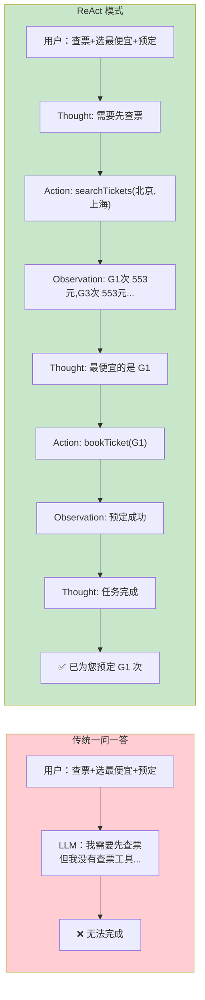
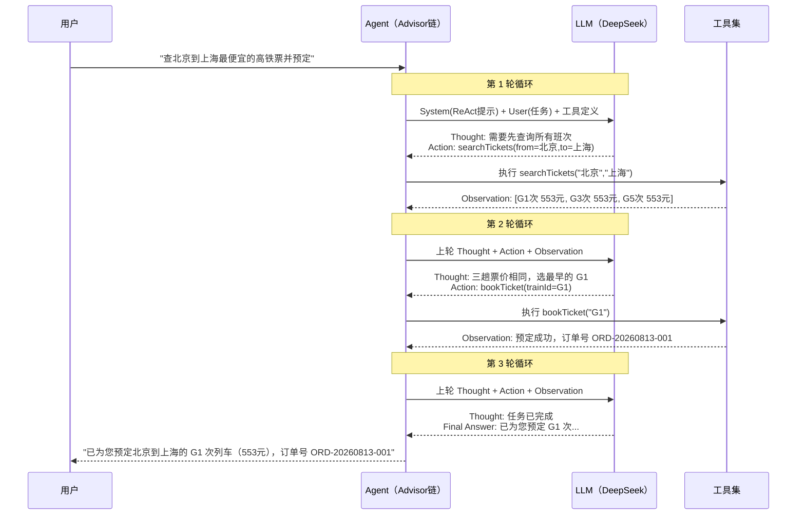
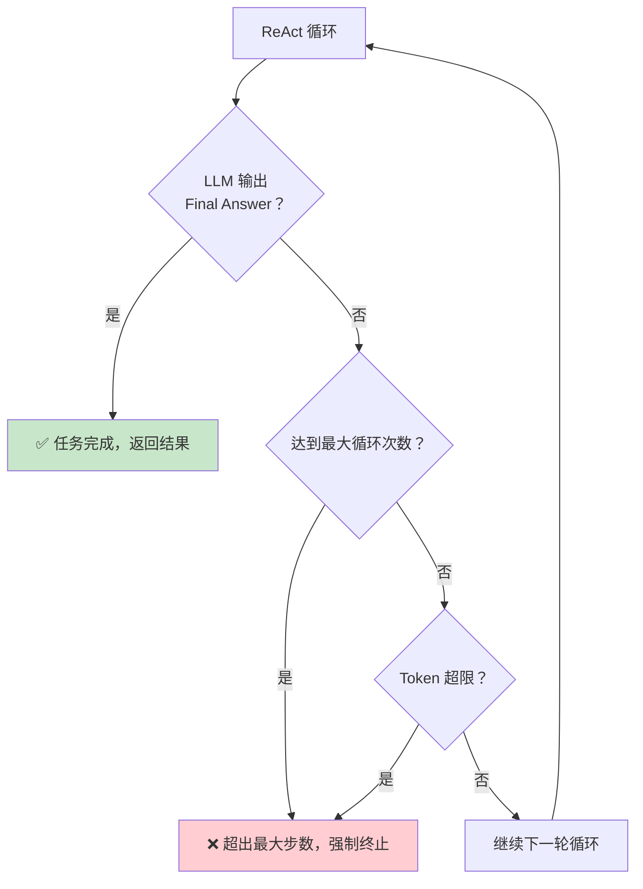
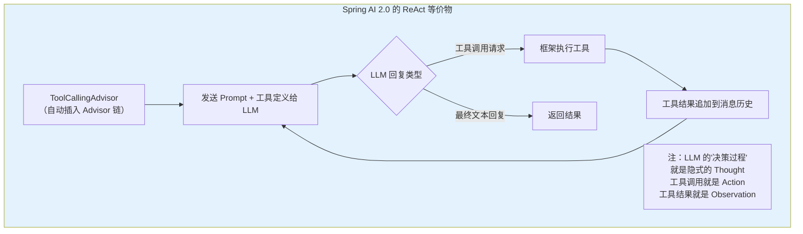
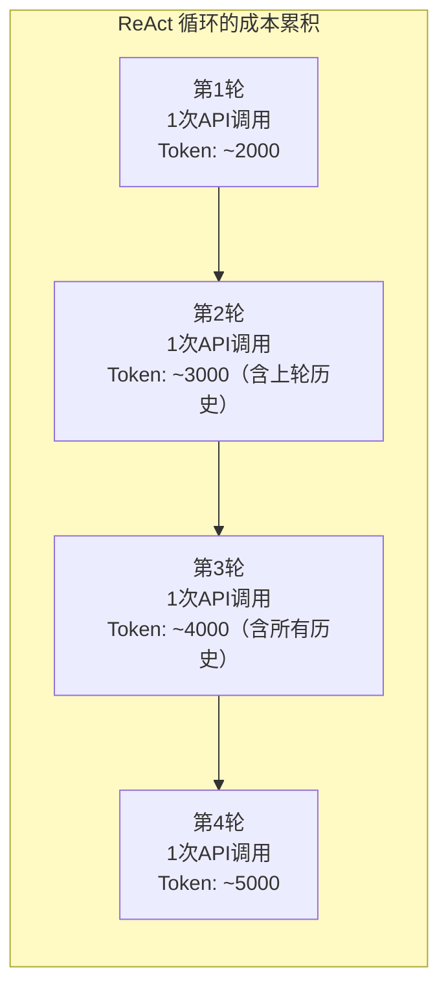
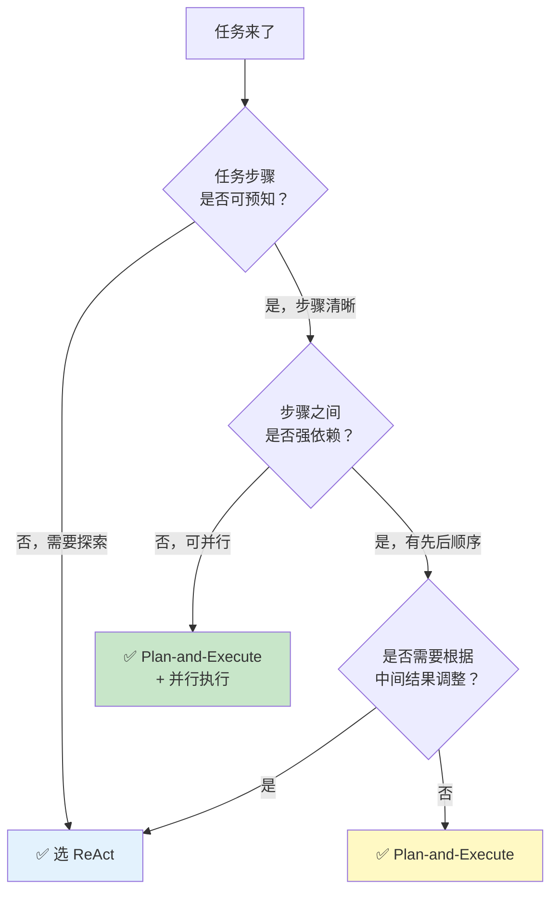

# 06-ReAct 推理模式

> **定位**：讲透 ReAct（Reasoning + Acting）模式——Thought-Action-Observation 循环的完整机制、与传统一问一答的本质区别、在 Spring AI 2.0 中通过 Advisor 链循环实现，以及与 Plan-and-Execute 模式的对比选型。读完这篇，你能让 Agent 在"边想边做"中自主完成复杂任务。
>
> **读者画像**：已经掌握工具调用和 Advisor 链基础，需要让 Agent 具备自主推理-决策-执行循环能力的开发者。
>
> **前置阅读**：[03-工具调用](03-工具调用.md)、[02-ChatClient 与对话模型](02-ChatClient与对话模型.md)。

---

## 1. 从一问一答到 ReAct：Agent 的推理革命

传统 LLM 交互是"一问一答"——用户发一条消息，LLM 回复一条，结束。这种模式面对简单问答没问题，但面对**需要多步骤、需要根据中间结果调整策略**的复杂任务时，立刻暴露短板。

### 1.1 一问一答的局限

假设用户问："帮我查一下北京到上海的高铁票，选最便宜的一趟，然后帮我预定。"



关键区别：ReAct 模式让 LLM **在生成最终答案之前，先进行多轮"推理→行动→观察"**。每一轮的行动结果（Observation）都会喂回给 LLM，影响它下一步的推理和决策。

### 1.2 ReAct 的来源与本质

ReAct 由 Yao et al. 在 2022 年提出（论文："ReAct: Synergizing Reasoning and Acting in Language Models"），核心思想是让 LLM **交替进行推理（Reasoning）和行动（Acting）**：

- **Reasoning（Thought）**：LLM 用自然语言"自言自语"，分析当前状态、规划下一步
- **Acting（Action）**：LLM 选择一个工具并指定参数，由外部执行
- **Observation**：工具执行的结果反馈给 LLM，作为下一轮推理的输入

这三步构成一个**闭环**，不断循环直到任务完成。

> **想深入？→ [附录 01-LLM基础理论（ReAct 原论文: arxiv.org/abs/2210.03629）]**：ReAct 原论文的完整解读和实验数据。

---

## 2. Thought-Action-Observation 循环详解

### 2.1 循环时序图



### 2.2 每一步在做什么

| 步骤 | 参与者 | 做什么 | 为什么需要 |
|------|--------|--------|-----------|
| **Thought** | LLM | 分析当前状态，决定下一步做什么 | 让推理过程显式化，避免"盲目行动" |
| **Action** | LLM 决策 + 框架执行 | 选择工具、指定参数、调用执行 | 将推理转化为实际行动 |
| **Observation** | 工具返回 | 把执行结果喂回 LLM | 提供新信息，影响下一轮推理 |
| **Final Answer** | LLM | 任务完成后输出最终回复 | 终止循环，回应用户 |

### 2.3 循环终止条件

ReAct 循环不能无限跑下去。终止条件包括：



在 Spring AI 2.0 中，这些终止条件通过 Advisor 配置和框架内置的安全机制来保证。

---

## 3. Spring AI 2.0 中的 ReAct 实现

### 3.1 ReAct 的本质就是"工具调用循环"

在 Spring AI 2.0 中，ReAct 模式**不需要从零实现**。第三章讲过的 `ToolCallingAdvisor` 本身就是一个 ReAct 循环的实现——LLM 决定调用工具（Action），框架执行工具并返回结果（Observation），LLM 再决定是否继续调用或给出最终答案。



### 3.2 基础 ReAct 实现

```java
import org.springframework.ai.chat.client.ChatClient;
import org.springframework.ai.tool.annotation.Tool;
import org.springframework.ai.tool.annotation.ToolParam;
import org.springframework.stereotype.Component;

// Spring AI 2.0.0
@Component
public class TravelTools {

    private final TicketService ticketService;
    private final BookingService bookingService;

    public TravelTools(TicketService ticketService, BookingService bookingService) {
        this.ticketService = ticketService;
        this.bookingService = bookingService;
    }

    @Tool(description = "查询两个城市之间所有高铁班次，返回车次号、出发时间、到达时间、票价")
    public List<TicketInfo> searchTickets(
            @ToolParam(description = "出发城市") String from,
            @ToolParam(description = "目的城市") String to
    ) {
        return ticketService.search(from, to);
    }

    @Tool(description = "预定指定车次的票，返回订单号")
    public BookingResult bookTicket(
            @ToolParam(description = "车次号，如 G1、G3") String trainNumber,
            @ToolParam(description = "乘客姓名") String passengerName
    ) {
        return bookingService.book(trainNumber, passengerName);
    }
}
```

```java
// Spring AI 2.0.0 — 注册工具后，ToolCallingAdvisor 自动实现 ReAct 循环
@Bean
ChatClient reactAgent(ChatClient.Builder builder, TravelTools travelTools) {
    return builder
            .defaultSystem("""
                你是一个出行助手。面对用户的需求，你需要：
                1. 先思考需要什么信息
                2. 调用合适的工具获取信息
                3. 根据工具返回的结果，决定下一步
                4. 任务完成后给出最终回复
                """)
            .defaultTools(travelTools)
            .build();
}

// 使用——底层自动运行 ReAct 循环
String result = chatClient.prompt()
        .user("帮我查北京到上海最便宜的高铁，帮我预定一张，乘客张三")
        .call()
        .content();
// result: "已为您预定 G1 次列车（553元），订单号 ORD-20260813-001"
```

这段代码背后发生了什么？`ToolCallingAdvisor` 自动执行了完整的 ReAct 循环：LLM 先决定调用 `searchTickets`（Thought+Action），框架执行后返回班次列表（Observation），LLM 再决定调用 `bookTicket`（Thought+Action），框架执行后返回订单号（Observation），最后 LLM 生成最终回复。

### 3.3 增强 ReAct：显式 Thought 输出

默认模式下，LLM 的 Thought 是"隐式"的——它在内部推理，只输出工具调用和最终答案。如果你需要让推理过程显式化（用于调试和可观测），可以通过 System Prompt 引导：

```java
// Spring AI 2.0.0 — 引导 LLM 显式输出推理过程
@Bean
ChatClient explicitReActAgent(ChatClient.Builder builder, TravelTools travelTools) {
    return builder
            .defaultSystem("""
                你是一个出行助手。请严格按照 ReAct 格式工作：

                每一轮你的回复必须包含：
                Thought: <你的推理过程，分析当前状态和下一步>
                Action: <工具调用，或 "Final Answer">

                示例：
                Thought: 用户要查北京到上海的票，我需要先搜索班次
                Action: searchTickets(from="北京", to="上海")

                收到工具结果后，继续推理：
                Thought: 搜索结果显示 G1 最便宜，553元，现在需要预定
                Action: bookTicket(trainNumber="G1", passengerName="张三")

                任务完成后：
                Thought: 预定成功，可以回复用户了
                Action: Final Answer
                """)
            .defaultTools(travelTools)
            .build();
}
```

### 3.4 控制 ReAct 循环的步数

ReAct 循环如果不限制步数，可能陷入死循环（LLM 反复调用同一工具）。Spring AI 2.0 提供了循环控制机制：

```java
import org.springframework.ai.chat.client.advisor.api.Advisor;

// Spring AI 2.0.0 — 通过 ToolCallingAdvisor 配置控制循环
@Bean
ChatClient boundedReActAgent(ChatClient.Builder builder, TravelTools tools) {
    // 最大工具调用轮次（防止无限循环）
    int maxIterations = 10;

    return builder
            .defaultSystem("你是一个出行助手。")
            .defaultTools(tools)
            // ToolCallingAdvisor 已自动注册，可通过配置参数控制
            .build();
}
```

```yaml
# application.yml — 全局配置工具调用循环限制
spring:
  ai:
    chat:
      client:
        tool-calling:
          enabled: true
          max-iterations: 10    # 最大循环次数
          advisor-order: 0      # Advisor 链中的位置
```

### 3.5 自定义 ReAct Advisor

如果需要更细粒度地控制 ReAct 循环（比如在每一步加入日志、审批、条件终止），可以实现自定义 Advisor：

```java
import org.springframework.ai.chat.client.advisor.api.*;
import org.springframework.ai.chat.model.ChatResponse;
import reactor.core.publisher.Flux;

// Spring AI 2.0.0 — 自定义 ReAct 控制 Advisor
// ⚠ 修正: 步数计数用 Reactor Context 而非 ThreadLocal——
// WebFlux 下同一线程复用多请求、一次请求跨线程切换，ThreadLocal 语义全错（见教程 37 §Context 传递）
public class ReActControlAdvisor implements CallAdvisor {

    private final int maxSteps;

    public ReActControlAdvisor(int maxSteps) {
        this.maxSteps = maxSteps;
    }

    @Override
    public ChatClientResponse adviseCall(ChatClientRequest request, CallAdvisorChain chain) {
        // 从 Reactor Context 读当前步数（请求级，非线程级）
        int current = request.context().getOrDefault("react.step", 0);
        if (current >= maxSteps) {
            // 超过最大步数，在消息中注入"请立即给出最终答案"指令
            request = ChatClientRequest.builder()
                    .from(request)
                    .systemText(request.systemText() +
                            "\n\n【系统警告】已达到最大推理步数(" + maxSteps +
                            ")，请立即基于已有信息给出最终答案。")
                    .build();
        }
        // 步数 +1 写回上下文（随请求链传递，不跨线程污染）
        request = ChatClientRequest.builder()
                .from(request)
                .contextEntry("react.step", current + 1)
                .build();

        // 记录每一步的推理日志
        System.out.println("[ReAct] Step " + (current + 1) +
                " | User: " + request.userText());
        return chain.nextCall(request);
    }

    @Override
    public int getOrder() {
        return 10; // 在 ToolCallingAdvisor 之后执行
    }
}
```

> **遇到阻塞？→ [教程 13-Advisor 链与拦截器]**：Advisor 的完整生命周期、order 机制、自定义 Advisor 的详细写法。

---

## 4. ReAct 的 Prompt 工程

ReAct 模式的效果高度依赖 System Prompt 的设计。以下是不同场景的 Prompt 模板。

### 4.1 通用 ReAct Prompt 模板

```java
// Spring AI 2.0.0 — 通用 ReAct System Prompt
String REACT_SYSTEM_PROMPT = """
    你是一个智能助手，能够通过工具调用来完成用户的任务。

    工作原则：
    1. 面对复杂任务，先思考再行动（Think before you act）
    2. 每次只执行一个工具调用，等结果回来再决定下一步
    3. 如果工具返回错误信息，分析原因并调整策略
    4. 不要重复调用同一个工具的相同参数
    5. 如果信息足够回答用户问题，立即给出最终答案
    6. 如果尝试 3 次仍无法完成任务，告知用户遇到困难

    你可以使用以下工具：
    {tools}

    记住：宁可多调用一次工具确认信息，也不要基于猜测行动。
    """;
```

### 4.2 场景化 Prompt

| 场景 | Prompt 关键指令 | 效果 |
|------|----------------|------|
| **客服** | "先查用户订单，再根据订单状态决定操作" | 避免盲目回答 |
| **数据分析** | "先查表结构，再写 SQL，最后分析结果" | 步骤有序 |
| **代码生成** | "先理解需求，再查相关 API 文档，最后生成代码" | 减少幻觉 |
| **运维** | "先诊断问题，再执行修复，最后验证" | 安全可靠 |

---

## 5. ReAct 的循环深度与成本控制

### 5.1 每一轮循环都是一次 LLM 调用

ReAct 循环的每一步都意味着一次完整的 LLM API 调用（包含完整的上下文历史）。这意味着：



N 轮 ReAct 循环 = N 次 LLM 调用，且 Token 消耗随轮数线性增长（每轮都包含之前所有历史）。

### 5.2 成本优化策略

| 策略 | 做法 | 效果 |
|------|------|------|
| **限制最大步数** | `max-iterations: 5` | 防止无限循环 |
| **上下文压缩** | 每轮只保留 Thought 摘要，不保留完整工具返回 | 减少 Token 消耗 |
| **提前退出** | Prompt 中指示"信息足够时立即回答" | 减少不必要的循环 |
| **批量化工具** | 一个工具返回多个结果，减少调用轮次 | 减少 API 调用 |

> **想深入？→ [教程 34-上下文工程]**：Token 预算管理、上下文窗口压缩技术。

---

## 6. ReAct vs Plan-and-Execute：如何选型

ReAct 不是唯一的 Agent 推理模式。Plan-and-Execute（先规划再执行）是另一个主流模式。这一节对比两者，帮你在实际项目中做出正确选型。

### 6.1 两种模式的核心差异

```mermaid
graph TB
    subgraph ReAct["ReAct 模式——边想边做"]
        RU["用户任务"] --> RT1["Thought: 需要什么信息？"]
        RT1 --> RA1["Action: 调用工具1"]
        RA1 --> RO1["Observation: 结果"]
        RO1 --> RT2["Thought: 下一步做什么？"]
        RT2 --> RA2["Action: 调用工具2"]
        RA2 --> RO2["Observation: 结果"]
        RO2 --> RT3["Thought: 信息够了"]
        RT3 --> RF["Final Answer"]
    end

    subgraph PE["Plan-and-Execute 模式——先规划再执行"]
        PU["用户任务"] --> PLAN["Planner: 生成完整计划<br/>1. 查票<br/>2. 选最便宜<br/>3. 预定"]
        PLAN --> EX1["Executor: 执行步骤1"]
        EX1 --> EX2["Executor: 执行步骤2"]
        EX2 --> EX3["Executor: 执行步骤3"]
        EX3 --> PF["汇总结果"]
    end

    style ReAct fill:#e3f2fd
    style PE fill:#fff9c4
```



### 6.2 详细对比

| 维度 | ReAct | Plan-and-Execute |
|------|-------|------------------|
| **决策时机** | 每一步都决策 | 先全局规划，再逐步执行 |
| **适应性** | 高——每步根据 Observation 调整 | 低——计划一旦确定，中途不轻易改 |
| **LLM 调用次数** | 不确定（3-10+ 次） | 确定（计划1次 + 每步1次） |
| **Token 消耗** | 较高（每轮携带全部历史） | 较低（每步独立执行） |
| **任务可追踪** | 低——无法预知路径 | 高——有完整计划 |
| **适合任务** | 探索性、不确定性高 | 步骤明确、可预知 |
| **失败恢复** | 自然适应——下一步自动调整 | 需要重新规划 |

### 6.3 选型决策树



### 6.4 实际场景对照

| 场景 | 推荐模式 | 理由 |
|------|---------|------|
| 智能客服（用户问题千变万化） | ReAct | 需要根据用户回答动态调整 |
| 数据 ETL 流水线 | Plan-and-Execute | 步骤固定：抽取→转换→加载 |
| 代码 Bug 诊断 | ReAct | 需要探索：看日志→查代码→假设→验证 |
| 报表生成（固定模板） | Plan-and-Execute | 步骤清晰：查数据→填模板→导出 |
| 旅行规划（多约束优化） | ReAct | 航班、酒店、景点互相影响，需要动态调整 |
| CI/CD 部署流水线 | Plan-and-Execute | 步骤确定：构建→测试→部署→验证 |

> → [教程 07-Plan-and-Execute 模式]：Plan-and-Execute 的完整实现和任务分解策略。

---

## 7. 完整示例：ReAct 智能客服 Agent

```java
// Spring AI 2.0.0 — 完整的 ReAct 客服 Agent
@Configuration
public class ReActAgentConfig {

    @Bean
    ChatClient customerServiceAgent(
            ChatClient.Builder builder,
            CustomerServiceTools tools,
            VectorStore vectorStore
    ) {
        return builder
                .defaultSystem("""
                    你是企业级智能客服。面对用户问题，按以下策略工作：

                    1. 判断问题类型：
                       - 订单问题 → 先查订单
                       - 产品咨询 → 先搜产品
                       - 售后投诉 → 先查订单，再搜FAQ，最后创建工单

                    2. 执行策略（每步只做一件事）：
                       - 先获取信息（查订单/搜产品/搜FAQ）
                       - 分析信息，判断需要什么操作
                       - 执行操作（创建工单/推荐产品/回答问题）

                    3. 原则：
                       - 信息不足时主动追问用户
                       - 涉及退款/换货等敏感操作，先确认用户身份
                       - 如果工具返回错误，换一种方式重试
                       - 最多尝试5次，超过则转人工

                    始终用礼貌、专业的语气回复。
                    """)
                .defaultTools(tools)
                .defaultAdvisors(
                        // RAG：自动检索知识库
                        QuestionAnswerAdvisor.builder(vectorStore)
                                .searchRequest(SearchRequest.builder()
                                        .topK(3)
                                        .similarityThreshold(0.7)
                                        .build())
                                .build()
                )
                .build();
    }
}
```

```java
// Spring AI 2.0.0 — 客服工具集
@Component
public class CustomerServiceTools {

    private final OrderService orderService;
    private final TicketService ticketService;
    private final ProductService productService;

    // 构造器注入...

    @Tool(description = "根据订单号查询订单详情，包括商品、金额、物流状态")
    public OrderDetail queryOrder(@ToolParam(description = "订单号") String orderId) {
        return orderService.queryDetail(orderId);
    }

    @Tool(description = "为指定订单创建售后工单（退款/换货/维修/投诉）")
    public Ticket createTicket(
            @ToolParam(description = "订单号") String orderId,
            @ToolParam(description = "工单类型：退款/换货/维修/投诉") String type,
            @ToolParam(description = "问题描述") String description
    ) {
        String idempotentKey = orderId + ":" + type + ":" + description.hashCode();
        return ticketService.create(orderId, type, description, idempotentKey);
    }

    @Tool(description = "根据关键词搜索产品，返回价格、规格、库存")
    public List<ProductInfo> searchProduct(@ToolParam(description = "搜索关键词") String keyword) {
        return productService.search(keyword);
    }
}
```

```java
// Spring AI 2.0.0 — 使用 ReAct 客服 Agent
@RestController
public class CustomerServiceController {

    private final ChatClient agent;

    public CustomerServiceController(ChatClient agent) {
        this.agent = agent;
    }

    @PostMapping("/chat")
    public String chat(@RequestBody ChatRequest request) {
        return agent.prompt()
                .user(request.message())
                .call()
                .content();
    }
}
```

当用户发送 "我的订单 ORD-123456 收到了但商品有破损，我要换货" 时，Agent 会自动执行：

1. **Thought**: 用户要换货，需要先查订单确认 → **Action**: `queryOrder("ORD-123456")`
2. **Observation**: 订单信息返回，确认订单存在且状态为"已签收"
3. **Thought**: 订单有效，创建换货工单 → **Action**: `createTicket("ORD-123456", "换货", "商品破损")`
4. **Observation**: 工单创建成功，返回工单号
5. **Final Answer**: "已为您创建换货工单，工单号 TK-20260813-001..."

整个过程用户只需发送一条消息，Agent 自主完成所有步骤。

---

## 8. ReAct 的常见陷阱与解决方案

### 8.1 循环振荡

**问题**：LLM 在两个工具之间反复跳转，如：查订单 → 搜产品 → 查订单 → 搜产品...

**原因**：Prompt 不够明确，LLM 不知道何时停止。

**解决**：
```java
// 在 System Prompt 中明确禁止重复
.defaultSystem("""
    ...
    禁止行为：
    - 不要用相同参数重复调用同一个工具
    - 如果工具返回的信息已足够回答问题，立即给出最终答案
    - 如果连续两次工具调用都没有获得新信息，直接基于已知信息回答
    """)
```

### 8.2 过度调用

**问题**：LLM 对简单问题也反复调用工具验证，浪费 Token。

**解决**：
```java
// 引导 LLM 在简单问题上直接回答
.defaultSystem("""
    ...
    如果你的知识足以回答用户问题，直接回答，不需要调用工具。
    只在面对以下情况时才调用工具：
    1. 需要实时数据（订单状态、库存、天气）
    2. 需要执行操作（创建工单、发送通知）
    3. 需要访问私有数据（用户信息、公司数据）
    """)
```

### 8.3 工具选择错误

**问题**：LLM 在多个功能相似的工具中选错。

**解决**：优化工具的 `description`，明确区分适用场景。详见 → [教程 03-工具调用]。

---

## 9. 适用场景与不适用场景

### 适用场景

- 智能客服（用户问题多变，需要动态调整策略）
- 代码 Bug 诊断（需要探索性推理：看日志→查代码→验证假设）
- 多源数据查询（先查A系统，根据A的结果决定查B还是C）
- 复杂决策（多约束优化，需要逐步收集信息后综合判断）
- 故障排查（运维场景：诊断→修复→验证的循环）

### 不适用场景

- 步骤完全确定的流水线任务（用 Plan-and-Execute 或普通编排更合适）
- 对延迟敏感的实时响应（每轮循环都是一次 LLM 调用，累积延迟高）
- 简单的一问一答（不需要工具调用，直接对话即可）
- 对 Token 成本极度敏感（ReAct 的多轮调用消耗大）
- 任务逻辑可以用代码硬编码的（不需要 LLM 推理，直接编程实现）

---

## 10. 本章总结

| 概念 | 一句话 |
|------|--------|
| **ReAct** | LLM 交替进行推理和行动，通过 Thought-Action-Observation 循环完成任务 |
| **Thought** | LLM 的显式推理过程——分析当前状态，决定下一步 |
| **Action** | LLM 选择工具并指定参数，框架负责执行 |
| **Observation** | 工具执行结果反馈给 LLM，影响下一轮推理 |
| **ToolCallingAdvisor** | Spring AI 2.0 内置的 ReAct 实现——自动执行工具调用循环 |
| **循环终止** | LLM 输出 Final Answer / 达到最大步数 / Token 超限 |
| **成本控制** | 限制 max-iterations、优化 Prompt 减少不必要循环、批量化工具调用 |
| **vs Plan-and-Execute** | ReAct 适合探索性任务，Plan-and-Execute 适合可预知的线性任务 |

**下一篇**：[07-Plan-and-Execute 模式](08-Plan-and-Execute模式.md) — 先规划再执行，适合步骤明确的复杂任务。

---

> → [教程 03-工具调用]：@Tool 注解、工具注册、ToolCallingAdvisor 的完整机制。
> → [教程 13-Advisor 链与拦截器]：Advisor 链的 order 机制、自定义 Advisor 的详细实现。
> 想深入？→ [附录 01-LLM基础理论（ReAct 原论文: arxiv.org/abs/2210.03629）]：ReAct 原论文的完整解读。
> 遇到阻塞？→ [教程 34-上下文工程]：Token 预算管理，控制 ReAct 循环的上下文增长。
