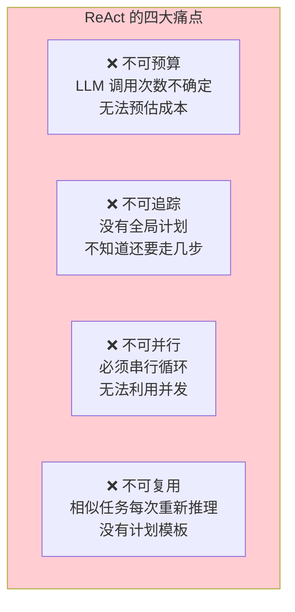
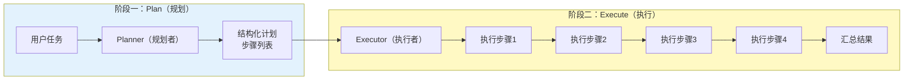
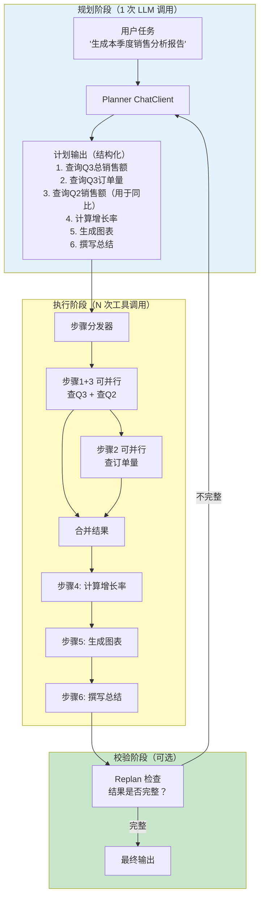
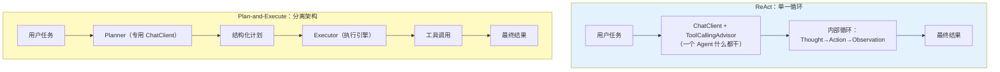
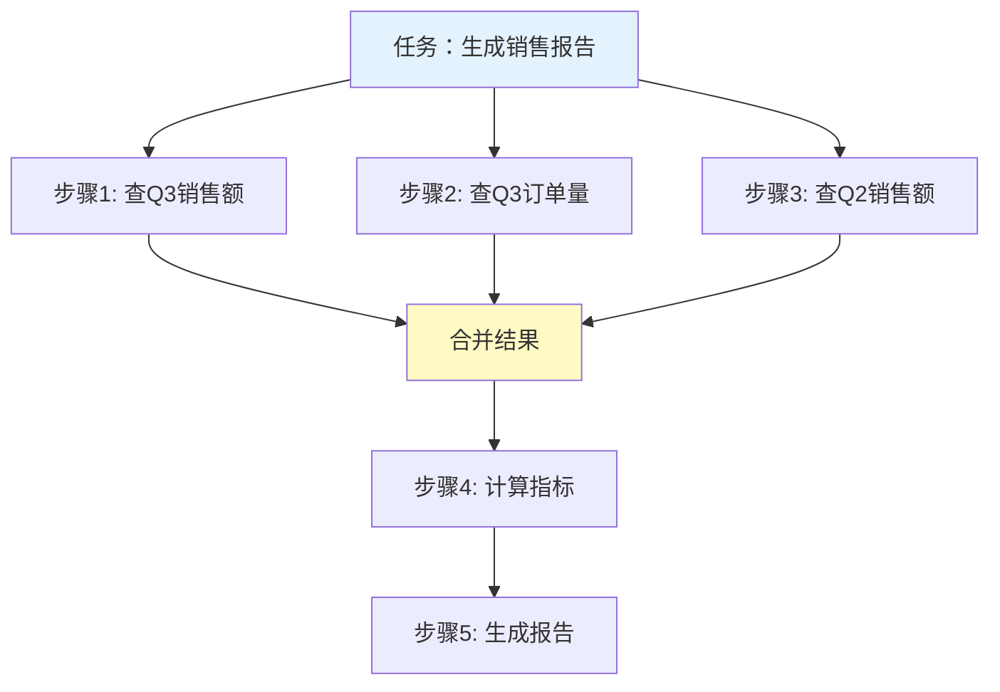
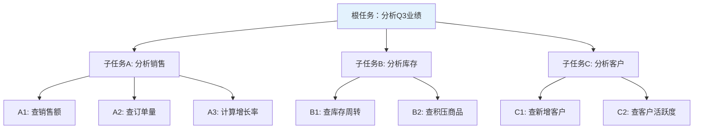
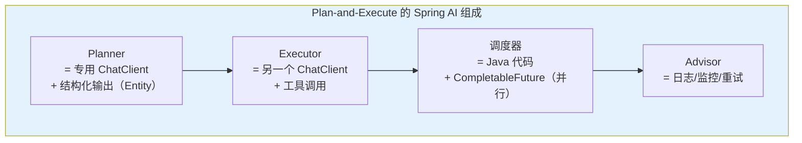
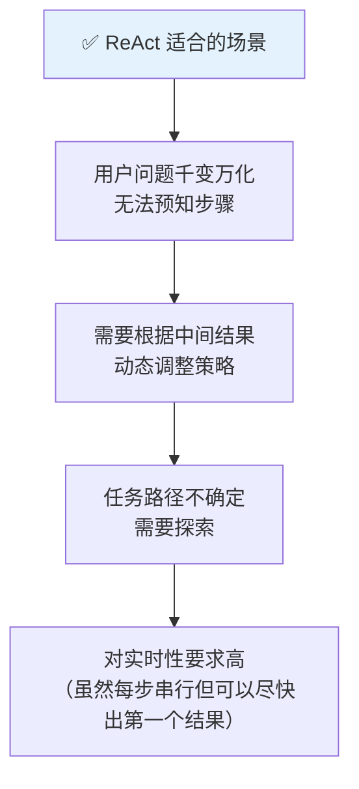
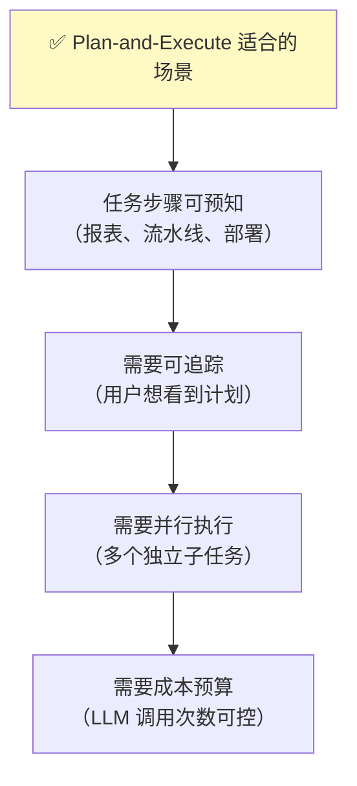
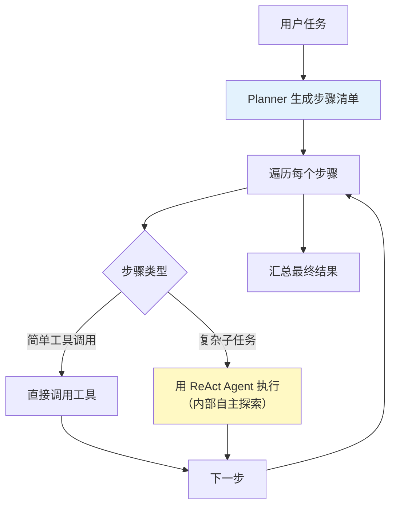

# 08-Plan-and-Execute 模式

> **定位**：讲透 Plan-and-Execute 模式——先全局规划再逐步执行的完整机制、任务分解策略、与 ReAct 的对比选型、Spring AI 2.0 中的实现思路。读完这篇，你能让 Agent 面对复杂任务时"先出计划再干活"，实现可追踪、可预算的 Agent 工作流。
>
> **读者画像**：已经掌握 ReAct 推理模式和工具调用，需要面对步骤明确的多步任务，要求可追踪、可预算的开发者。
>
> **前置阅读**：[07-ReAct 推理模式](07-ReAct推理模式.md)、[03-工具调用](03-工具调用.md)。

---

## 1. 为什么需要 Plan-and-Execute

### 1.1 ReAct 的短板

上一章我们学习了 ReAct——边想边做，逐步探索。但在某些场景下，ReAct 会暴露明显短板：



假设你需要生成一份"季度销售分析报告"，包含：查销售额、查订单量、计算同比、计算环比、画图表、写总结。如果用 ReAct，LLM 会一步步探索，每一步都是一次 API 调用，总共可能调用 10+ 次，且每次都要携带完整上下文——Token 消耗线性增长。

更关键的是：**这类任务的步骤是可预知的**。你根本不需要 LLM "探索"，你只需要它先列一个清单，然后按清单逐个执行。

### 1.2 Plan-and-Execute 的核心思想

Plan-and-Execute 模式将 Agent 的工作分为两个明确的阶段：



- **Plan（规划）**：用一次 LLM 调用，让模型输出一个结构化的步骤清单
- **Execute（执行）**：按照清单逐个（或并行）执行每个步骤

**关键优势**：计划一旦生成，执行阶段是确定性的。你可以精确控制成本、进度和并发度。

> **想深入？→ [附录 01-LLM基础理论（Plan-and-Solve 论文: arxiv.org/abs/2305.04091）]**：Plan-and-Solve 论文的完整解读。

---

## 2. 规划-执行分离架构

### 2.1 完整架构图



### 2.2 核心组件职责

| 组件 | 职责 | 实现方式 |
|------|------|---------|
| **Planner** | 将用户任务分解为结构化步骤清单 | 专用 ChatClient + 结构化输出 |
| **Dispatcher** | 按步骤依赖关系调度执行 | Java 代码 / 工作流引擎 |
| **Executor** | 执行单个步骤（工具调用或子任务） | 工具 / 子 ChatClient |
| **Validator** | 检查执行结果是否满足计划，决定是否重新规划 | 可选的 LLM 校验 |

### 2.3 与 ReAct 的架构对比



核心区别：ReAct 把规划和执行融合在一个循环中；Plan-and-Execute 将它们**物理分离**，用不同的组件负责。

---

## 3. 任务分解策略

Plan-and-Execute 的效果取决于 Planner 的分解质量。以下是三种主要的分解策略。

### 3.1 顺序分解

最简单的策略——将任务分解为有严格先后顺序的步骤链。


适用场景：步骤之间有强依赖（后一步需要前一步的结果）。

### 3.2 并行分解

将无依赖的步骤并行执行，大幅缩短总执行时间。



适用场景：多个步骤互不依赖（如查不同维度的数据）。

### 3.3 树形分解

将大任务分解为子任务，子任务再分解为更小的子任务。



适用场景：任务复杂度高，需要分层分解。常用于多 Agent 协作场景。

> → [教程 09-多 Agent 协作]：树形分解配合多 Agent 的分层委派架构。

### 3.4 分解策略选择

| 策略 | 适用条件 | 优势 | 劣势 |
|------|---------|------|------|
| **顺序分解** | 步骤间强依赖 | 简单可靠 | 无法并行，总时间长 |
| **并行分解** | 步骤间无依赖 | 快，充分利用并发 | 需要处理结果合并 |
| **树形分解** | 任务高度复杂 | 清晰的层级结构 | 实现复杂，需要多 Agent |

---

## 4. Spring AI 2.0 中的实现

### 4.1 整体实现思路

Plan-and-Execute 在 Spring AI 中没有内置的一行开关——它需要你**组合多个 Spring AI 能力**来实现：



### 4.2 步骤一：定义计划结构

```java
import com.fasterxml.jackson.annotation.JsonProperty;

// Spring AI 2.0.0 — 计划的结构化定义
public record ExecutionPlan(
    String taskSummary,
    List<PlanStep> steps
) {
    public record PlanStep(
        int order,                    // 步骤序号
        String description,           // 步骤描述
        String toolName,              // 要调用的工具名
        Map<String, String> params,   // 工具参数
        List<Integer> dependsOn,      // 依赖的前置步骤序号（空列表=无依赖，可并行）
        String expectedOutput         // 预期输出描述
    ) {}
}
```

### 4.3 步骤二：Planner——用结构化输出生成计划

```java
import org.springframework.ai.chat.client.ChatClient;
import org.springframework.stereotype.Component;

// Spring AI 2.0.0 — Planner：将任务分解为结构化计划
@Component
public class PlanGenerator {

    private final ChatClient plannerClient;

    public PlanGenerator(ChatClient.Builder builder) {
        // Planner 用独立的 ChatClient，不绑定工具（它的任务是"规划"，不是"执行"）
        this.plannerClient = builder
                .defaultSystem("""
                    你是一个任务规划专家。你的职责是将用户任务分解为可执行的步骤清单。

                    原则：
                    1. 每个步骤必须明确指定用哪个工具、传什么参数
                    2. 标注步骤之间的依赖关系（dependsOn）
                    3. 没有依赖关系的步骤可以并行
                    4. 步骤数量控制在 3-8 个之间
                    5. 最后一步通常是"综合分析"或"汇总输出"

                    可用工具列表：
                    - queryRevenue(quarter): 查询指定季度总营收
                    - queryOrderCount(quarter): 查询指定季度订单量
                    - queryCustomerCount(quarter): 查询指定季度新增客户数
                    - calculateGrowthRate(current, previous): 计算增长率
                    - generateChart(data, type): 生成图表
                    """)
                .build();
    }

    public ExecutionPlan generatePlan(String userTask) {
        return plannerClient.prompt()
                .user(userTask)
                .call()
                .entity(ExecutionPlan.class);  // 结构化输出：直接映射为 Java 对象
    }
}
```

当用户发送 "帮我生成 Q3 季度销售分析报告，需要和 Q2 对比" 时，Planner 输出：

```json
{
  "taskSummary": "Q3销售分析报告（对比Q2）",
  "steps": [
    {"order": 1, "description": "查询Q3总营收", "toolName": "queryRevenue",
     "params": {"quarter": "Q3"}, "dependsOn": [], "expectedOutput": "Q3营收数字"},
    {"order": 2, "description": "查询Q3订单量", "toolName": "queryOrderCount",
     "params": {"quarter": "Q3"}, "dependsOn": [], "expectedOutput": "Q3订单数"},
    {"order": 3, "description": "查询Q2总营收", "toolName": "queryRevenue",
     "params": {"quarter": "Q2"}, "dependsOn": [], "expectedOutput": "Q2营收数字"},
    {"order": 4, "description": "计算营收增长率", "toolName": "calculateGrowthRate",
     "params": {"current": "${step1.result}", "previous": "${step3.result}"},
     "dependsOn": [1, 3], "expectedOutput": "增长率百分比"},
    {"order": 5, "description": "生成对比图表", "toolName": "generateChart",
     "params": {"data": "${step1.result},${step3.result}", "type": "bar"},
     "dependsOn": [1, 3], "expectedOutput": "图表URL"},
    {"order": 6, "description": "汇总分析报告", "toolName": "none",
     "params": {}, "dependsOn": [1,2,3,4,5],
     "expectedOutput": "最终报告文本"}
  ]
}
```

注意步骤 1、2、3 的 `dependsOn` 为空——它们可以并行执行。

### 4.4 步骤三：Executor——执行计划

```java
import org.springframework.ai.chat.client.ChatClient;
import org.springframework.stereotype.Component;
import java.util.*;
import java.util.concurrent.*;

// Spring AI 2.0.0 — Executor：按计划执行步骤
@Component
public class PlanExecutor {

    private final ChatClient executorClient;
    private final ReportTools tools;
    private final ExecutorService pool = Executors.newFixedThreadPool(4);

    public PlanExecutor(ChatClient.Builder builder, ReportTools tools) {
        // Executor 用另一个 ChatClient，绑定工具
        this.tools = tools;
        this.executorClient = builder
                .defaultSystem("你是执行者。严格按照指令调用工具，返回工具结果。")
                .defaultTools(tools)
                .build();
    }

    public Map<Integer, String> execute(ExecutionPlan plan) throws Exception {
        Map<Integer, String> results = new ConcurrentHashMap<>();
        List<PlanStep> pending = new CopyOnWriteArrayList<>(plan.steps());

        while (!pending.isEmpty()) {
            // 找出所有依赖已满足的步骤
            List<PlanStep> ready = pending.stream()
                    .filter(step -> step.dependsOn().stream()
                            .allMatch(results::containsKey))
                    .toList();

            if (ready.isEmpty()) {
                throw new IllegalStateException("检测到循环依赖！");
            }

            // 并行执行所有就绪步骤
            List<CompletableFuture<Void>> futures = ready.stream()
                    .map(step -> CompletableFuture.runAsync(() -> {
                        String result = executeStep(step, results);
                        results.put(step.order(), result);
                        pending.remove(step);
                    }, pool))
                    .toList();

            // 等待这一批完成
            CompletableFuture.allOf(futures.toArray(new CompletableFuture[0])).join();
        }

        return results;
    }

    private String executeStep(PlanStep step, Map<Integer, String> previousResults) {
        // 替换参数中的 ${stepN.result} 占位符
        Map<String, String> resolvedParams = new HashMap<>();
        for (var entry : step.params().entrySet()) {
            String value = entry.getValue();
            for (var e : previousResults.entrySet()) {
                value = value.replace("${step" + e.getKey() + ".result}", e.getValue());
            }
            resolvedParams.put(entry.getKey(), value);
        }

        // 用 Executor ChatClient 执行这一步
        String stepPrompt = String.format(
                "执行步骤：%s\n使用工具：%s\n参数：%s",
                step.description(), step.toolName(), resolvedParams);

        return executorClient.prompt()
                .user(stepPrompt)
                .call()
                .content();
    }
}
```

### 4.5 步骤四：编排器——串联 Plan 和 Execute

```java
// Spring AI 2.0.0 — 编排器：入口 Controller
import org.springframework.web.bind.annotation.*;
import java.util.Map;

@RestController
public class PlanExecuteController {

    private final PlanGenerator planner;
    private final PlanExecutor executor;

    public PlanExecuteController(PlanGenerator planner, PlanExecutor executor) {
        this.planner = planner;
        this.executor = executor;
    }

    @PostMapping("/report")
    public ReportResponse generateReport(@RequestBody String task) throws Exception {
        // 阶段一：规划
        ExecutionPlan plan = planner.generatePlan(task);
        System.out.println("计划已生成，共 " + plan.steps().size() + " 步");

        // 阶段二：执行
        Map<Integer, String> results = executor.execute(plan);

        // 汇总最终结果
        String finalReport = results.values().stream()
                .reduce("", (a, b) -> a + "\n\n" + b);

        return new ReportResponse(plan, finalReport);
    }

    public record ReportResponse(ExecutionPlan plan, String report) {}
}
```

### 4.6 Replan 机制：执行中修正计划

实际执行中，某些步骤可能失败或返回意外结果。Replan（重新规划）机制让 Agent 在执行后检查是否需要调整计划：

```java
// Spring AI 2.0.0 — Replan 检查器
import org.springframework.ai.chat.client.ChatClient;
import org.springframework.stereotype.Component;
import java.util.List;
import java.util.Map;

@Component
public class ReplanChecker {

    private final ChatClient client;

    public ReplanChecker(ChatClient.Builder builder) {
        this.client = builder
                .defaultSystem("""
                    你是一个计划审查员。根据原始计划和已执行的步骤结果，
                    判断：
                    1. 计划是否需要修改？
                    2. 是否有步骤需要重新执行？
                    3. 是否需要新增步骤？

                    输出 JSON：
                    {"needsReplan": true/false, "reason": "...", "newSteps": [...]}
                    """)
                .build();
    }

    public ReplanResult check(ExecutionPlan plan, Map<Integer, String> results) {
        return client.prompt()
                .user("计划：" + plan + "\n执行结果：" + results)
                .call()
                .entity(ReplanResult.class);
    }

    public record ReplanResult(boolean needsReplan, String reason, List<ExecutionPlan.PlanStep> newSteps) {}
}
```

---

## 5. Plan-and-Execute vs ReAct：深度对比

### 5.1 决策维度对比

| 维度 | ReAct | Plan-and-Execute |
|------|-------|------------------|
| **规划时机** | 每步即时规划 | 开始时全局规划 |
| **LLM 调用模式** | 循环（次数不定） | 规划1次 + 执行N次 |
| **适应性** | 高（每步可调） | 低（计划确定后不轻易改） |
| **并发能力** | 串行 | 可并行 |
| **可追踪性** | 低（路径不可预知） | 高（有完整计划） |
| **成本可预估** | 难 | 可预估（步骤数确定） |
| **上下文消耗** | 高（每轮携带全部历史） | 低（每步可独立执行） |
| **实现复杂度** | 低（框架自动） | 较高（需手动编排） |
| **适合任务** | 探索性、不确定性高 | 步骤明确、可预知 |

### 5.2 何时选 ReAct



### 5.3 何时选 Plan-and-Execute



### 5.4 混合模式：Plan → ReAct Execute

在实际项目中，两种模式可以组合使用——**用 Plan-and-Execute 出全局计划，用 ReAct 执行每个步骤**：



```java
// Spring AI 2.0.0 — 混合模式实现
public String planAndReActExecute(String task) {
    // 1. 规划
    ExecutionPlan plan = planner.generatePlan(task);

    // 2. 执行——简单步骤直接调工具，复杂步骤交给 ReAct Agent
    StringBuilder report = new StringBuilder();
    for (PlanStep step : plan.steps()) {
        if ("none".equals(step.toolName())) {
            // 汇总步骤——交给 ReAct Agent 综合分析
            String analysis = reactAgent.prompt()
                    .user("基于以下数据写总结：" + report)
                    .call()
                    .content();
            report.append(analysis);
        } else {
            // 普通步骤——直接调工具
            String result = executeStepDirect(step);
            report.append(result).append("\n");
        }
    }
    return report.toString();
}
```

---

## 6. Plan-and-Execute 的可观测性

Plan-and-Execute 的一个核心优势是**可观测**——因为计划是结构化的，你可以清楚地追踪进度。

### 6.1 计划追踪

```java
// Spring AI 2.0.0 — 计划执行追踪
public class PlanTracker {

    public void printProgress(ExecutionPlan plan, Map<Integer, String> results) {
        System.out.println("\n===== 计划执行进度 =====");
        System.out.println("任务：" + plan.taskSummary());

        for (PlanStep step : plan.steps()) {
            String status = results.containsKey(step.order()) ? "✅" : "⏳";
            String deps = step.dependsOn().isEmpty()
                    ? "（无依赖）"
                    : "依赖：" + step.dependsOn();
            System.out.printf("%s 步骤%d: %s [%s]%n",
                    status, step.order(), step.description(), deps);
        }

        int total = plan.steps().size();
        int done = results.size();
        System.out.printf("进度：%d/%d (%.0f%%)%n",
                done, total, (double) done / total * 100);
        System.out.println("========================\n");
    }
}
```

### 6.2 前端可视化

将计划结构化为 JSON 后，前端可以渲染成进度条、看板或甘特图：

```json
{
  "task": "Q3销售分析报告",
  "totalSteps": 6,
  "completedSteps": 3,
  "steps": [
    {"order": 1, "status": "done", "description": "查询Q3总营收"},
    {"order": 2, "status": "done", "description": "查询Q3订单量"},
    {"order": 3, "status": "done", "description": "查询Q2总营收"},
    {"order": 4, "status": "pending", "description": "计算增长率"},
    {"order": 5, "status": "pending", "description": "生成图表"},
    {"order": 6, "status": "pending", "description": "汇总报告"}
  ]
}
```

---

## 7. 完整示例：自动化报表生成 Agent

```java
// Spring AI 2.0.0 — 报表生成工具
import org.springframework.ai.tool.annotation.Tool;
import org.springframework.ai.tool.annotation.ToolParam;
import org.springframework.stereotype.Component;

@Component
public class ReportTools {

    private final DataWarehouseService dwService;
    private final ChartService chartService;

    // 构造器注入...

    @Tool(description = "查询指定季度的总营收（元）")
    public double queryRevenue(@ToolParam(description = "季度，如 Q1/Q2/Q3/Q4") String quarter) {
        return dwService.queryRevenue(quarter);
    }

    @Tool(description = "查询指定季度的订单总量")
    public int queryOrderCount(@ToolParam(description = "季度") String quarter) {
        return dwService.queryOrderCount(quarter);
    }

    @Tool(description = "查询指定季度新增客户数")
    public int queryCustomerCount(@ToolParam(description = "季度") String quarter) {
        return dwService.queryNewCustomers(quarter);
    }

    @Tool(description = "计算同比增长率百分比")
    public double calculateGrowthRate(
            @ToolParam(description = "当前值") double current,
            @ToolParam(description = "上期值") double previous
    ) {
        if (previous == 0) return 100.0;
        return (current - previous) / previous * 100;
    }

    @Tool(description = "生成图表，返回图表URL")
    public String generateChart(
            @ToolParam(description = "数据，JSON格式") String data,
            @ToolParam(description = "图表类型：bar/line/pie") String type
    ) {
        return chartService.generate(data, type);
    }
}
```

```java
// Spring AI 2.0.0 — 完整编排
import org.springframework.ai.chat.client.ChatClient;
import org.springframework.context.annotation.Bean;
import org.springframework.context.annotation.Configuration;

@Configuration
public class ReportAgentConfig {

    @Bean
    ChatClient plannerClient(ChatClient.Builder builder) {
        return builder
                .defaultSystem("""
                    你是报表规划专家。将用户的报表需求分解为可执行步骤。
                    每个步骤指定工具名和参数。无依赖的步骤标记 dependsOn 为空数组。
                    """)
                .build();
    }

    @Bean
    ChatClient executorClient(ChatClient.Builder builder, ReportTools tools) {
        return builder
                .defaultSystem("你是执行者，严格按指令调用工具。")
                .defaultTools(tools)
                .build();
    }
}
```

---

## 8. 常见陷阱与解决方案

### 8.1 计划质量差

**问题**：Planner 生成的计划步骤不清晰、参数不完整。

**解决**：
- 优化 Planner 的 System Prompt，给出明确的可用工具列表
- 在 Prompt 中提供输出示例（Few-shot）
- 对计划做校验（步骤的工具名是否在可用列表中）

### 8.2 参数占位符解析失败

**问题**：步骤间的参数传递使用 `${step1.result}` 占位符，但前一步的结果格式不匹配。

**解决**：
- 让 Planner 在 `expectedOutput` 中描述输出格式
- 在执行器中做参数解析容错
- 对关键步骤做结果格式校验

### 8.3 并行执行的结果顺序

**问题**：并行步骤的结果合并时顺序混乱。

**解决**：使用 `ConcurrentHashMap` 按步骤序号存储结果，合并时按序号排序。

---

## 9. 适用场景与不适用场景

### 适用场景

- 报表生成（步骤明确：查数据→算指标→画图→写总结）
- ETL 数据流水线（抽取→转换→加载→校验）
- CI/CD 部署流水线（构建→测试→部署→验证）
- 批量数据处理（多维度查询→聚合→导出）
- 需要向用户展示进度和计划的场景（用户想看到"先做什么再做什么"）
- 需要成本预算的场景（步骤数确定，可以预估总成本）

### 不适用场景

- 探索性任务（步骤不可预知，如 Bug 诊断、问题排查）
- 用户问题千变万化的客服场景（用 ReAct 更灵活）
- 简单的一问一答（不需要规划，直接回答）
- 实时对话（计划阶段增加延迟，不适合需要快速响应的场景）
- 任务只有1-2步（规划的开销大于收益，直接执行即可）

---

## 10. 本章总结

| 概念 | 一句话 |
|------|--------|
| **Plan-and-Execute** | 先用 Planner 生成结构化计划，再用 Executor 按计划执行 |
| **Planner** | 专用 ChatClient，用结构化输出（entity）生成步骤清单 |
| **Executor** | 按计划调用工具执行每个步骤，支持并行 |
| **任务分解** | 顺序（强依赖）、并行（无依赖）、树形（层级分解） |
| **Replan** | 执行后检查结果，必要时修正计划 |
| **混合模式** | Plan-and-Execute 做全局规划 + ReAct 做复杂子步骤 |
| **vs ReAct** | P&E 适合可预知任务（可追踪/可并行/可预算），ReAct 适合探索性任务 |
| **可观测性** | 结构化计划可以直接渲染为进度条、甘特图 |

**下一篇**：[09-多 Agent 协作](09-多Agent协作.md) — 多个 Agent 如何协作完成复杂任务。

---

> → [教程 07-ReAct 推理模式]：Thought-Action-Observation 循环，ReAct 的完整实现。
> → [教程 09-多 Agent 协作]：树形分解配合多 Agent 的分层委派架构。
> 想深入？→ [附录 01-LLM基础理论（Plan-and-Solve 论文: arxiv.org/abs/2305.04091）]：Plan-and-Solve 论文解读。
> 遇到阻塞？→ [教程 13-Advisor 链与拦截器]：Advisor 的完整生命周期和自定义实现。
