# 00 上下文工程
> **定位**：讲透上下文工程（Context Engineering）——Agent 的"短期工作内存"如何编排。涵盖五层拼接策略、Token 预算分配、上下文压缩、KV Cache / Prompt Cache 利用、语义缓存。读完这篇，你能把有限的上下文窗口榨干，让每一颗 Token 都花在刀刃上。
>
> **读者画像**：已经掌握 ChatClient、记忆管理、RAG 基础，需要系统性地管理 Agent 上下文窗口的资深开发者。
>
> **前置阅读**：[04-记忆与会话管理](../00-基础与核心/04-记忆与会话管理.md)、[05-RAG 检索增强生成](../00-基础与核心/05-RAG检索增强生成.md)。

---

## 1. 上下文窗口是 LLM 的 RAM

如果把 LLM 比作 CPU，那么**上下文窗口就是它的 RAM**——模型一次推理能"看到"的全部内容，全部装在这块内存里。

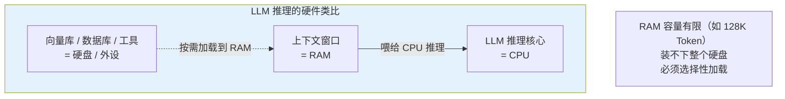

| 类比项 | 硬件世界 | LLM 世界 |
|--------|---------|---------|
| **CPU** | 处理器核心 | LLM 推理引擎 |
| **RAM** | 内存（GB） | 上下文窗口（Token） |
| **硬盘** | SSD / HDD | 向量库、数据库、文件系统 |
| **程序加载** | OS 把代码加载到 RAM | Prompt Engineering 把信息加载到上下文 |
| **内存压力** | OOM、频繁换页 | 超出窗口、KV Cache 失效 |

**核心论点**：上下文工程不是"写好 Prompt"，而是**像操作系统管理内存一样管理上下文**——决定什么进、什么出、按什么优先级、何时压缩、何时缓存。

### 1.1 上下文窗口的物理约束

LLM 的上下文窗口有三个硬约束：

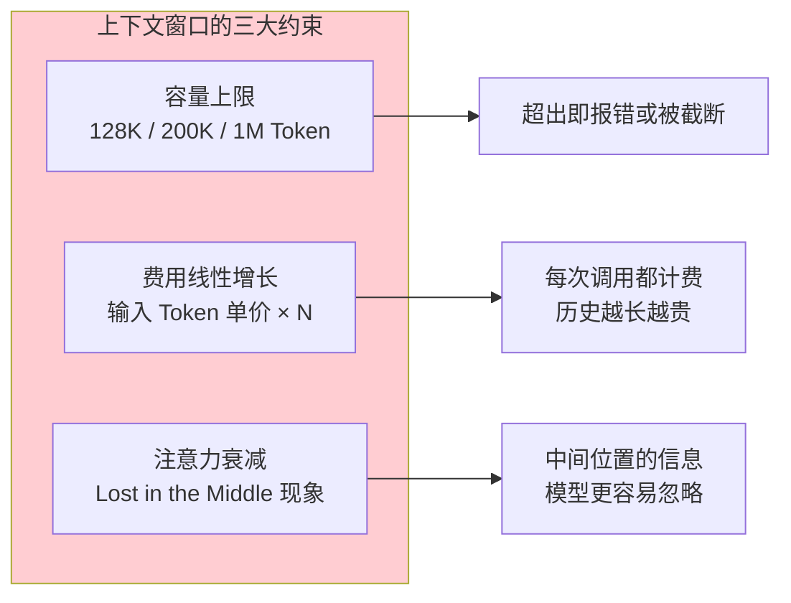

**Lost in the Middle** 是一个被反复验证的现象：LLM 对 Prompt **开头**和**结尾**的信息记得最牢，对**中间**的信息容易遗忘。这意味着：

- System Prompt 放最前面（锚定身份）
- 关键指令放最后（最近效应）
- 参考文档放中间（最容易被忽略，所以更要精简）

> **想深入**：该现象最早在 Liu et al. 2023 的论文中被系统验证。对生产系统的影响是：不要盲目堆 RAG 文档，**Top 3 精准文档 > Top 10 模糊文档**。

---

## 2. 五层拼接策略

一个生产级 Agent 的上下文，由**五层内容**按固定优先级拼接而成：

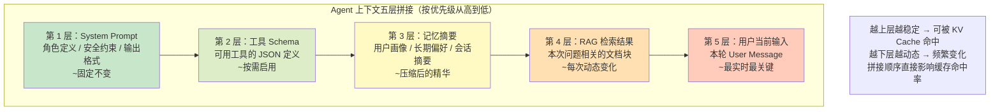

### 2.1 拼接顺序背后的逻辑

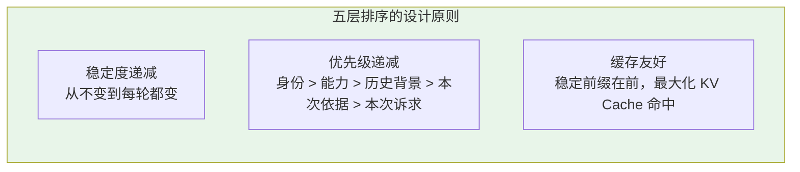

**为什么稳定内容放前面？** 因为现代 LLM 服务商普遍支持 **Prefix Cache**：如果两次请求的前 N 个 Token 完全一致，这部分不需要重新计算注意力。把 System Prompt 这种永远不变的内容放最前面，缓存命中率最高，首字节延迟最低。

### 2.2 Java 代码：分层拼装上下文

```java
import java.util.List;
import java.util.stream.Collectors;

import org.springframework.ai.chat.client.ChatClient;
import org.springframework.ai.chat.messages.SystemMessage;
import org.springframework.ai.chat.messages.UserMessage;
import org.springframework.ai.chat.prompt.Prompt;
import org.springframework.ai.document.Document;
import org.springframework.ai.vectorstore.SearchRequest;
import org.springframework.ai.vectorstore.VectorStore;

public class ContextAssembler {

    private final ChatClient client;
    private final UserProfileService profileService;
    private final VectorStore vectorStore;

    public ContextAssembler(ChatClient client, UserProfileService profileService, VectorStore vectorStore) {
        this.client = client;
        this.profileService = profileService;
        this.vectorStore = vectorStore;
    }

    /**
     * 按五层策略拼装完整 Prompt
     */
    public Prompt assemble(String userId, String userMessage, List<String> enabledTools) {
        // 第 1 层：System Prompt（固定）
        String systemPrompt = """
            你是企业知识助手。规则：
            1. 只基于提供的上下文回答
            2. 不确定时回复"我需要确认"
            3. 输出格式为 JSON
            """;

        // 第 2 层：工具 Schema 由 ChatClient 在底层自动注入
        // 此处只需声明启用哪些工具
        // 第 3 层：记忆摘要（从长期存储读取压缩后的精华）
        String memorySummary = profileService.getCompressedSummary(userId);
        // memorySummary = "用户：张三（VIP）。历史诉求：3 次退款咨询，偏好简洁回复。"

        // 第 4 层：RAG 检索结果（每次动态检索）
        List<Document> docs = vectorStore.similaritySearch(
            SearchRequest.builder()
                .query(userMessage)
                .topK(3)
                .similarityThreshold(0.75)
                .build()
        );
        String ragContext = docs.stream()
            .map(Document::getText)
            .collect(Collectors.joining("\n---\n"));

        // 第 5 层：用户当前输入
        return new Prompt(List.of(
            new SystemMessage(systemPrompt),
            new SystemMessage("用户画像摘要：" + memorySummary),     // 第 3 层
            new SystemMessage("参考资料：\n" + ragContext),           // 第 4 层
            new UserMessage(userMessage)                              // 第 5 层
        ));
    }
}
```

### 2.3 用 Advisor 实现分层注入

生产中推荐用 Advisor 链实现分层，每层一个 Advisor，职责单一：

```java
ChatClient client = ChatClient.builder(chatModel)
    .defaultSystem(systemPrompt)                                    // 第 1 层
    .defaultTools(tools)                                            // 第 2 层
    .defaultAdvisors(
        // 第 3 层记忆: 真实 Advisor 是 MessageChatMemoryAdvisor
        //（"MemoryAdvisor.builder().mode(SUMMARY)" 为虚构 API——摘要记忆由业务层压缩实现）
        MessageChatMemoryAdvisor.builder(memory).build(),
        QuestionAnswerAdvisor.builder(vectorStore).build()          // 第 4 层
    )
    .build();
// 第 5 层由 .user() 提供
```
> **需在 pom.xml 中添加依赖**（`QuestionAnswerAdvisor` 所在模块）：2.0.0 起模块名从 `spring-ai-advisors-vector-store` 改为 `spring-ai-vector-store-advisor`（老坐标已不存在）——版本走 `spring-ai-bom`，不写 `<version>`：
>
> ```xml
> <dependency>
>     <groupId>org.springframework.ai</groupId>
>     <artifactId>spring-ai-vector-store-advisor</artifactId>
> </dependency>
> ```

---

## 3. Token 预算分配

上下文窗口是稀缺资源，必须**像预算管理一样分配 Token**。

### 3.1 典型预算分配

假设使用 128K Token 窗口的模型：

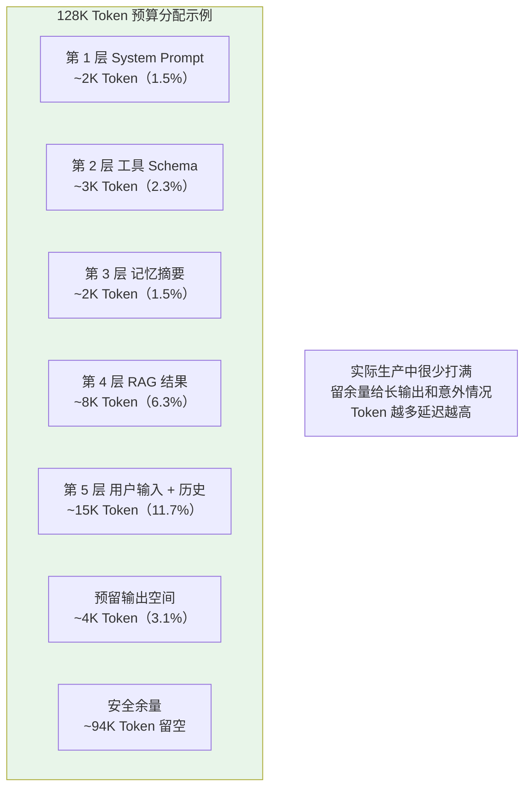

| 层 | 预算占比 | Token 量 | 超预算怎么办 |
|----|---------|---------|-------------|
| System Prompt | 1-2% | 1-3K | 压缩措辞 |
| 工具 Schema | 1-3% | 1-5K | 按场景禁用工具 |
| 记忆摘要 | 1-3% | 1-5K | 更激进地摘要 |
| RAG 结果 | 5-15% | 5-20K | 减少 topK、做二级摘要 |
| 用户输入 + 历史 | 10-30% | 10-40K | 滑动窗口 + 历史压缩 |
| 输出预留 | 2-5% | 2-5K | 设 max_tokens |
| 安全余量 | 余下 | 余下 | 应对边界情况 |

### 3.2 动态预算分配器

```java
public class TokenBudgetAllocator {

    private final TokenCountEstimator estimator;

    /**
     * @param totalBudget 总预算（如 32000 Token）
     * @param layers 各层候选内容
     * @return 裁剪后的各层内容
     */
    public AssembledContext allocate(int totalBudget, List<ContextLayer> layers) {
        int reservedForOutput = 4096;
        int available = totalBudget - reservedForOutput;

        AssembledContext result = new AssembledContext();
        for (ContextLayer layer : layers) {  // 按优先级从高到低
            int layerBudget = (int) (available * layer.getRatio());
            String trimmed = layer.trimToFit(layerBudget, estimator);
            int consumed = estimator.estimate(trimmed);
            available -= consumed;
            result.add(layer.getName(), trimmed);
        }
        return result;
    }
}

public interface ContextLayer {
    String getName();
    double getRatio();           // 占可用预算的比例
    String trimToFit(int tokenBudget, TokenCountEstimator estimator);
}
```

**关键设计**：高优先级层先消耗预算，低优先级层只能用"剩余"。当 RAG 结果爆炸时，**压缩 RAG 而非砍掉 System Prompt**。

---

## 4. 上下文压缩

当对话变长，历史消息会膨胀。直接保留全部历史很快就会撑爆窗口。需要**渐进式压缩**。

### 4.1 三级压缩策略

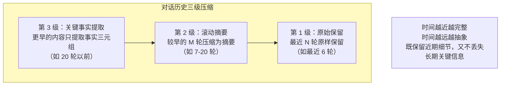

### 4.2 渐进式摘要实现

```java
import java.util.ArrayList;
import java.util.List;
import java.util.stream.Collectors;

import org.springframework.ai.chat.client.ChatClient;
import org.springframework.ai.chat.messages.Message;
import org.springframework.ai.chat.messages.SystemMessage;

public class ProgressiveSummarizer {

    private final ChatClient summarizer;

    public ProgressiveSummarizer(ChatClient summarizer) {
        this.summarizer = summarizer;
    }

    private static final int RAW_WINDOW = 6;        // 最近 6 轮原样保留
    private static final int SUMMARY_WINDOW = 14;   // 7-20 轮滚动摘要

    public List<Message> compress(List<Message> history) {
        if (history.size() <= RAW_WINDOW) {
            return history;  // 还不需要压缩
        }

        // 切分：尾部 RAW_WINDOW 条原样保留
        List<Message> recent = history.subList(history.size() - RAW_WINDOW, history.size());
        List<Message> older = history.subList(0, history.size() - RAW_WINDOW);

        // 将较早的内容摘要
        String summary = summarize(older);

        // 组装：摘要 + 近期原始消息
        List<Message> result = new ArrayList<>();
        result.add(new SystemMessage("历史摘要：" + summary));
        result.addAll(recent);
        return result;
    }

    private String summarize(List<Message> messages) {
        String transcript = messages.stream()
            .map(m -> m.getMessageType() + ": " + m.getText())   // 2.0 Message 接口为 getMessageType()（javap 实证）
            .collect(Collectors.joining("\n"));
        return summarizer.prompt()
            .system("将以下对话压缩为不超过 200 字的关键事实摘要，保留：用户身份、决策结论、未完成事项。丢弃寒暄和重复内容。")
            .user(transcript)
            .call()
            .content();
    }
}
```

### 4.3 何时触发压缩

| 触发条件 | 阈值建议 | 说明 |
|---------|---------|------|
| 消息条数 | > 20 条 | 简单可靠 |
| Token 数 | > 预算的 60% | 更精确，但需估算 |
| 时间间隔 | 每 10 分钟 | 长会话定期压缩 |
| 话题切换 | 检测到话题转折 | 高级策略，需意图识别 |

> **遇到阻塞**：压缩本身要消耗一次 LLM 调用，有成本。对超长会话建议用异步后台压缩，避免阻塞主请求。

---

## 5. KV Cache / Prompt Cache 利用

这是降低**首字节延迟**和**推理成本**的关键技术。

### 5.1 KV Cache 工作原理

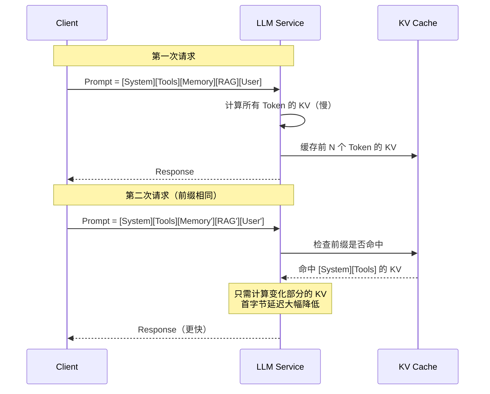

### 5.2 缓存命中条件

KV Cache 命中的**硬性条件**是：**前缀完全一致**，连一个 Token 都不能差。

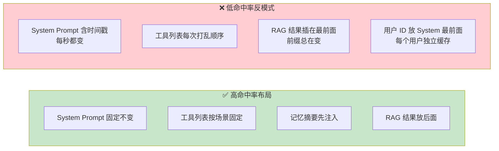

### 5.3 显式 Prompt Cache 标记

部分模型（如 Claude）支持显式缓存断点，让服务商知道哪些段值得缓存：

```java
// 概念代码，真实 API 见 [附录 05-SpringAI2-API基准]：
// 供应商级 Prompt Cache（如 Claude ephemeral cache_control）依赖模型提供商的请求体扩展字段，
// Spring AI 2.0 不提供统一缓存断点 API，需按具体模型适配层透传；此处仅示意设计意图。
ChatClient client = ChatClient.builder(chatModel)
    .defaultSystem(systemPrompt)              // 稳定前缀放最前，最大化前缀缓存命中
    .build();

// 对长文档 RAG，把固定的文档块标记为可缓存（具体透传方式以所用模型适配层为准）
String cachedRagBlock = buildRagContextWithCacheControl(docs);
```

| 实践 | 命中率影响 | 成本影响 |
|------|----------|---------|
| System Prompt 固定不变 | 大幅提升 | 降低 |
| 工具定义按场景分组 | 提升 | 降低 |
| 记忆摘要放在 RAG 之前 | 提升 | 降低 |
| RAG 结果放最后 | 不影响（本来就变） | 不变 |
| 避免在 Prompt 前缀插入时间戳 | 大幅提升 | 降低 |

> **注意**：Prompt Cache 的命中率和节约金额，各服务商统计口径不同。建议在监控面板中单独追踪 `cache_read_input_tokens` 和 `cache_creation_input_tokens`。

---

## 6. 语义缓存

KV Cache 是**字节级**前缀匹配，语义缓存（Semantic Cache）则是**语义级**匹配——相似问题命中相同答案。

### 6.1 语义缓存原理

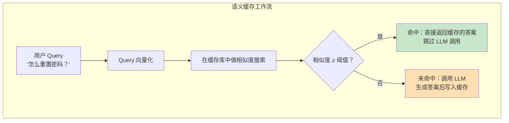

### 6.2 Spring AI 中实现语义缓存

```java
import java.time.Instant;
import java.util.List;
import java.util.Map;
import java.util.Optional;

import org.springframework.ai.chat.client.ChatClientRequest;
import org.springframework.ai.chat.client.ChatClientResponse;
import org.springframework.ai.chat.client.advisor.api.CallAdvisor;
import org.springframework.ai.chat.client.advisor.api.CallAdvisorChain;
import org.springframework.ai.chat.messages.AssistantMessage;
import org.springframework.ai.chat.messages.Message;
import org.springframework.ai.chat.messages.UserMessage;
import org.springframework.ai.chat.model.ChatResponse;
import org.springframework.ai.chat.model.Generation;
import org.springframework.ai.document.Document;
import org.springframework.ai.vectorstore.SearchRequest;
import org.springframework.ai.vectorstore.VectorStore;
import org.springframework.core.Ordered;

// 2.0 Advisor：实现 adviseCall（非 1.x 的 before/after 单参）；
// ChatClientRequest 只有 prompt()/context()，无 userText()；向量化由 VectorStore 内部完成，无需手动 embed。
public class SemanticCacheAdvisor implements CallAdvisor {

    private final VectorStore cacheStore;
    private final double similarityThreshold;

    public SemanticCacheAdvisor(VectorStore cacheStore, double similarityThreshold) {
        this.cacheStore = cacheStore;
        this.similarityThreshold = similarityThreshold;
    }

    @Override
    public ChatClientResponse adviseCall(ChatClientRequest request, CallAdvisorChain chain) {
        String query = extractUserText(request);

        // 命中缓存：构造一个"已缓存"的响应直接返回，跳过 LLM 调用
        List<Document> hits = cacheStore.similaritySearch(
            SearchRequest.builder()
                .query(query)
                .topK(1)
                .similarityThreshold(similarityThreshold)
                .build()
        );
        if (!hits.isEmpty()) {
            String cachedAnswer = hits.get(0).getText();
            return new ChatClientResponse(
                    ChatResponse.builder()
                            .generations(List.of(new Generation(new AssistantMessage(cachedAnswer))))
                            .build(),
                    request.context());
        }

        // 未命中：正常走 LLM，再把 Q&A 写入缓存库
        ChatClientResponse response = chain.nextCall(request);
        String answer = response.chatResponse().getResult().getOutput().getText();
        cacheStore.add(List.of(Document.builder().text(answer)
                .metadata(Map.of("question", query, "timestamp", Instant.now().toString()))
                .build()));
        return response;
    }

    private String extractUserText(ChatClientRequest request) {
        return request.prompt().getInstructions().stream()
                .filter(m -> m instanceof UserMessage)
                .map(Message::getText)
                .reduce((a, b) -> b)          // 取最后一条用户消息
                .orElse("");
    }

    /** 业务层独立查询缓存（供 §7 完整管线直接调用；生产应叠加 userId 过滤防跨用户命中） */
    public Optional<String> lookup(String userInput, String userId) {
        List<Document> hits = cacheStore.similaritySearch(
            SearchRequest.builder()
                .query(userInput)
                .topK(1)
                .similarityThreshold(similarityThreshold)
                .build()
        );
        return hits.isEmpty() ? Optional.empty() : Optional.of(hits.get(0).getText());
    }

    /** 业务层独立写入缓存 */
    public void put(String userInput, String answer, String userId) {
        cacheStore.add(List.of(Document.builder().text(answer)
                .metadata(Map.of("question", userInput, "userId", userId,
                        "timestamp", Instant.now().toString()))
                .build()));
    }

    @Override
    public int getOrder() {
        return Ordered.LOWEST_PRECEDENCE;
    }
}
```

### 6.3 语义缓存的适用边界

语义缓存**不是万金油**，错用会导致严重事故。

| 场景 | 是否适用 | 原因 |
|------|---------|------|
| FAQ 问答 | ✅ 强烈推荐 | 问题高度相似，答案稳定 |
| 知识库静态查询 | ✅ 推荐 | 文档不变，答案一致 |
| 代码生成 | ⚠️ 谨慎 | 微小差异导致结果完全不同 |
| 实时数据查询 | ❌ 禁止 | 答案依赖实时数据，缓存会过期 |
| 涉及用户隐私的查询 | ❌ 禁止 | 会跨用户泄露答案 |

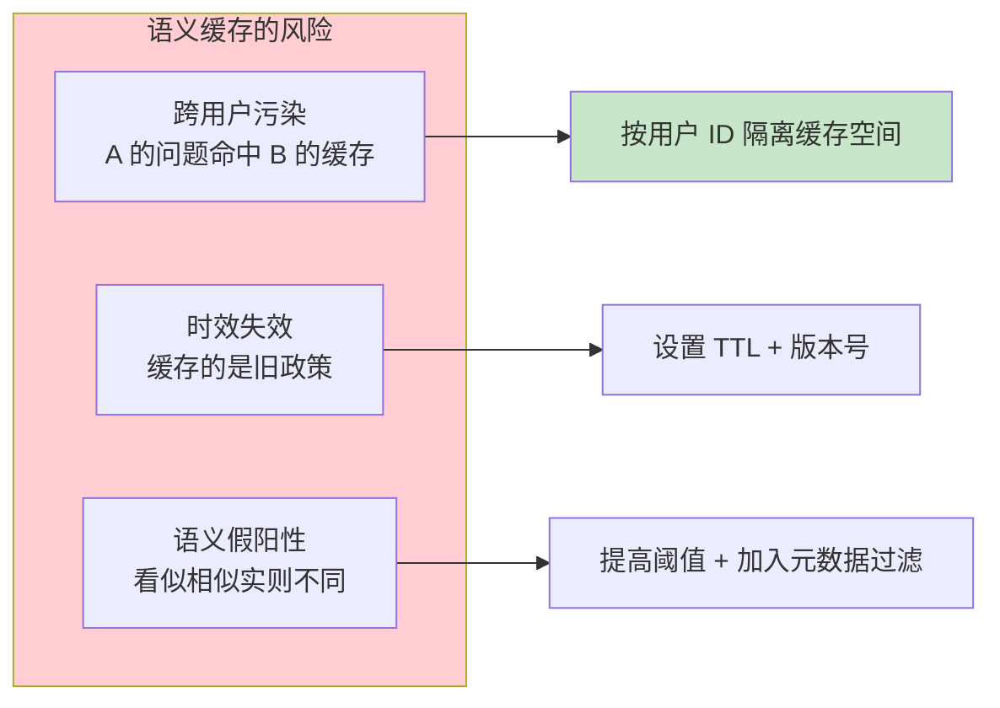

---

## 7. 完整上下文管线：端到端示例

把五层拼接、预算分配、压缩、缓存整合成一个完整的请求管线。

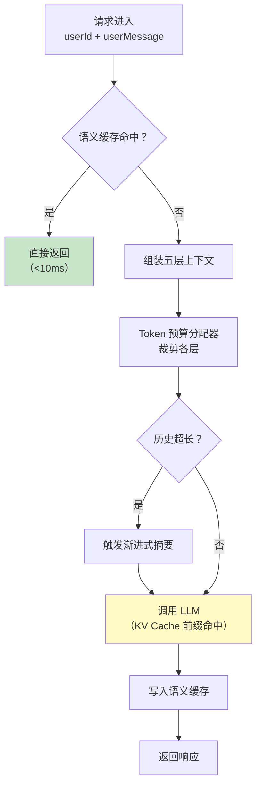

```java
import java.util.List;
import java.util.Optional;

import org.springframework.ai.chat.client.ChatClient;
import org.springframework.ai.chat.memory.ChatMemory;
import org.springframework.ai.chat.messages.AssistantMessage;
import org.springframework.ai.chat.messages.Message;
import org.springframework.ai.chat.prompt.Prompt;
import org.springframework.stereotype.Service;

// 概念代码：estimateTokens / BUDGET_THRESHOLD / MAX_BUDGET / systemLayer()~userLayer()
// 为省略的辅助方法与常量，此处聚焦"管线编排"的 API 正确性。
@Service
public class ContextAwareChatService {

    private final ChatClient client;
    private final SemanticCacheAdvisor cache;
    private final ProgressiveSummarizer summarizer;
    private final TokenBudgetAllocator budgetAllocator;
    private final ChatMemory memory;

    public ContextAwareChatService(ChatClient client, SemanticCacheAdvisor cache,
                                   ProgressiveSummarizer summarizer,
                                   TokenBudgetAllocator budgetAllocator,
                                   ChatMemory memory) {
        this.client = client;
        this.cache = cache;
        this.summarizer = summarizer;
        this.budgetAllocator = budgetAllocator;
        this.memory = memory;
    }

    public String chat(String userId, String userInput) {
        // 1. 语义缓存检查
        Optional<String> cached = cache.lookup(userInput, userId);
        if (cached.isPresent()) {
            return cached.get();
        }

        // 2. 读取会话历史（2.0 ChatMemory.get(String) 单参，javap 实证；窗口裁剪由 MessageWindowChatMemory 内部完成）
        List<Message> history = memory.get(userId);

        // 3. 渐进式压缩
        if (estimateTokens(history) > BUDGET_THRESHOLD) {
            history = summarizer.compress(history);
        }

        // 4. 组装 + 预算分配（五层）
        Prompt prompt = budgetAllocator.allocate(MAX_BUDGET, List.of(
            systemLayer(),
            toolsLayer(),
            memoryLayer(userId),
            ragLayer(userInput),
            userLayer(userInput, history)
        ));

        // 5. 调用 LLM（KV Cache 自动利用前缀）
        String answer = client.prompt(prompt).call().content();

        // 6. 写入语义缓存 + 更新记忆（2.0 ChatMemory.add(String, Message)）
        cache.put(userInput, answer, userId);
        memory.add(userId, new AssistantMessage(answer));

        return answer;
    }
}
```

---

## 8. 上下文工程的反模式

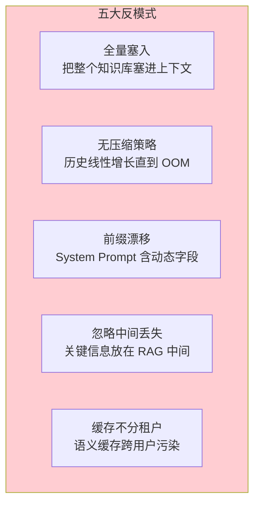

| 反模式 | 后果 | 正确做法 |
|--------|------|---------|
| 全量塞入 | Token 爆炸、延迟飙升 | 用 RAG 动态检索 |
| 无压缩 | OOM 或窗口截断 | 渐进式摘要 |
| 前缀漂移 | KV Cache 永不命中 | 动态字段放后部 |
| 信息放中间 | Lost in the Middle | 关键指令首尾放置 |
| 缓存不分租户 | 数据泄露 | 按 userId 命名空间隔离 |

---

## 9. 适用场景与不适用场景

### ✅ 适用场景

- 长会话产品（咨询、辅导、心理咨询）——需要渐进式压缩
- 高并发问答系统（FAQ、知识库）——语义缓存收益巨大
- 多工具 Agent ——按场景动态启用工具控制 Token
- 企业级生产 Agent ——需要可预测的延迟和成本

### ❌ 不适用场景

- 一次性短问答 ——上下文工程反而增加复杂度
- 创意写作 ——压缩可能丢失关键灵感碎片
- 强实时性场景 ——摘要压缩本身有延迟
- 小团队原型阶段 ——先跑通再优化

---

## 10. 本章总结

| 概念 | 一句话 |
|------|--------|
| **上下文窗口 = RAM** | LLM 一次推理能看到的全部内容，稀缺且昂贵 |
| **五层拼接** | System → Tools → Memory → RAG → User，按稳定度递减排布 |
| **Token 预算分配** | 高优先级层先消耗，低优先级层用剩余 |
| **渐进式压缩** | 近期原始保留、中期摘要、远期关键事实 |
| **KV / Prompt Cache** | 稳定前缀自动复用，首字节延迟和成本双降 |
| **语义缓存** | 相似 Query 命中相同答案，跳过 LLM 调用 |
| **Lost in the Middle** | 中间位置的信息最容易被忽略 |

**下一篇**：[30-高级 RAG 与 Agentic RAG](01-高级RAG与AgenticRAG.md) — GraphRAG 多跳推理、Agentic RAG 自主决策检索、混合检索与重排。

---

> **前置回顾**：[04-记忆与会话管理](../00-基础与核心/04-记忆与会话管理.md)介绍了 MessageWindowChatMemory 的滑动窗口——本章是它的"企业级进化版"。
> **想深入**：[82-高级记忆架构](05-高级记忆架构.md)将讲透三层记忆（短期→长期→外部 RAG）的完整架构，与本章的上下文工程紧密呼应。
> **性能优化**：[33-Agent 性能优化](04-Agent性能优化.md)会继续讨论 KV Cache 和批量推理对延迟的影响。

> **想深入？→ [附录 15/13-codex-harness/02-上下文压缩与持久化恢复]**：版本号化历史、三路径压缩与重注入位置的 harness 级实践。
