# 02 Agent 工作流编排
> **定位**：讲透 Agent 工作流编排——DAG 有向无环图编排执行步骤、条件分支与循环的动态决策、状态机与工作流的选型权衡、Spring AI 生态中的编排框架集成。读完这篇，你能把多个 Agent / 工具编排成一条可控的执行流水线。
>
> **读者画像**：已经能让单个 Agent 调用工具和 RAG，需要把多个步骤编排成复杂工作流的开发者。
>
> **前置阅读**：[03-工具调用](../00-基础与核心/03-工具调用.md)、[35-高级 RAG 与 Agentic RAG](01-高级RAG与AgenticRAG.md)。

---

## 1. 为什么需要工作流编排

单 Agent 做一件小事很容易。但企业级场景往往是一条**多步骤流水线**：

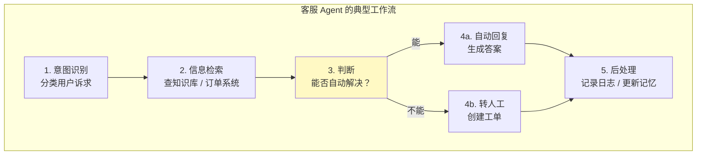

这种流水线有三个核心需求：

1. **步骤间有依赖**：S2 必须等 S1 完成
2. **有条件分支**：S3 的结果决定走 S4A 还是 S4B
3. **有并行可能**：S2 中查知识库和查订单可以同时进行

**工作流编排**就是把这些步骤、依赖、分支、并行关系显式建模出来，让执行可预测、可监控、可调试。

---

## 2. DAG 工作流编排

### 2.1 什么是 DAG

**DAG（Directed Acyclic Graph，有向无环图）** 是最常用的工作流模型：

- **有向**：步骤之间有执行方向（A → B 表示 B 依赖 A）
- **无环**：不能形成循环（A → B → C → A 是非法的）
- **图**：可以并行、可以汇合

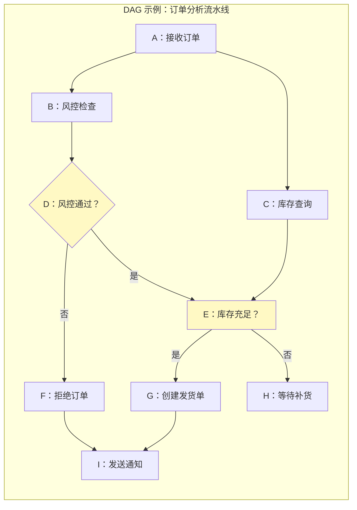

### 2.2 DAG 的三种基本模式

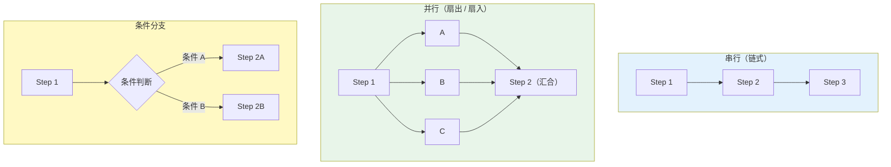

| 模式 | 特点 | 典型场景 |
|------|------|---------|
| 串行 | 一步接一步，无分支 | 固定流水线 |
| 并行 | 多步同时执行，全部完成才汇合 | 多源数据采集 |
| 条件 | 按中间结果选分支 | 审批、风控 |

### 2.3 Java 代码：用 CompletableFuture 实现并行节点

```java
import java.util.concurrent.*;

@Service
public class OrderAnalysisWorkflow {

    private final RiskService riskService;
    private final InventoryService inventoryService;
    private final NotificationService notifyService;

    /**
     * 订单分析工作流（DAG）
     */
    public OrderResult process(Order order) {
        // 节点 A 后，B 和 C 并行执行
        // 风控检查和库存查询同时进行
        CompletableFuture<RiskResult> riskFuture =
            CompletableFuture.supplyAsync(() -> riskService.check(order));

        CompletableFuture<InventoryResult> inventoryFuture =
            CompletableFuture.supplyAsync(() -> inventoryService.query(order));

        // 等两个并行节点都完成后汇合
        CompletableFuture.allOf(riskFuture, inventoryFuture).join();

        RiskResult risk = riskFuture.join();
        InventoryResult inventory = inventoryFuture.join();

        // 条件分支：风控和库存都通过才创建发货单
        if (risk.passed() && inventory.available()) {
            ShippingResult shipping = createShipping(order, inventory);
            notifyService.send(order, shipping);
            return OrderResult.success(shipping);
        } else if (!risk.passed()) {
            notifyService.send(order, "风控拒绝");
            return OrderResult.rejected("风险");
        } else {
            notifyService.send(order, "库存不足");
            return OrderResult.pending("等待补货");
        }
    }
}
```

> **并发提示**：Java 21 的虚拟线程让 `CompletableFuture.supplyAsync` 的线程池开销大幅降低，详见 [38-Agent 性能优化](04-Agent性能优化.md)。

---

## 3. 条件分支与循环

### 3.1 条件分支

DAG 是无环的，但条件分支可以通过**决策节点**实现：

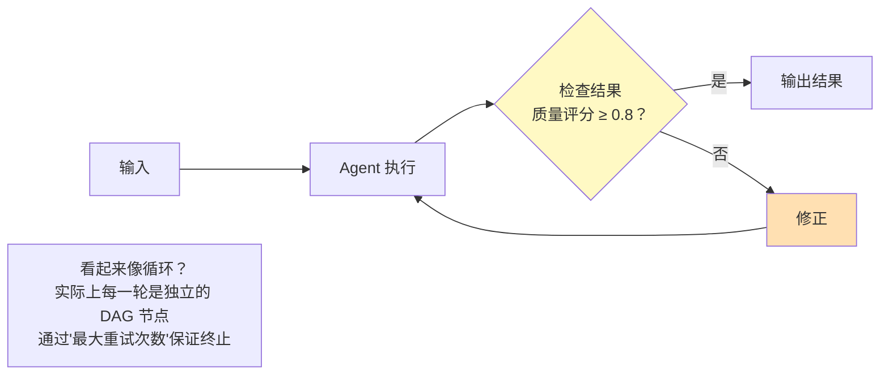

### 3.2 用迭代次数模拟循环

真正的循环（A → B → A）在 DAG 中不合法。工程上的做法是**有限迭代**：

```java
public class IterativeRefinementWorkflow {

    private static final int MAX_ITERATIONS = 3;
    private static final double QUALITY_THRESHOLD = 0.8;

    public String execute(String task) {
        String currentOutput = agent.generate(task);
        int iteration = 0;

        while (iteration < MAX_ITERATIONS) {
            double score = evaluator.score(task, currentOutput);

            if (score >= QUALITY_THRESHOLD) {
                return currentOutput;  // 质量达标，终止
            }

            // 质量不足，带修正建议重新生成
            String feedback = evaluator.feedback(task, currentOutput);
            currentOutput = agent.refine(task, currentOutput, feedback);
            iteration++;
        }

        return currentOutput;  // 达到最大迭代次数，返回最后一次结果
    }
}
```

**关键原则**：
- **必须有终止条件**（最大迭代数 / 质量阈值 / 超时）
- **每一轮迭代是独立的 DAG 执行**，不是真的"回到起点"
- **记录每一轮的中间状态**，便于调试和回溯

### 3.3 条件路由 vs Agent 自主决策

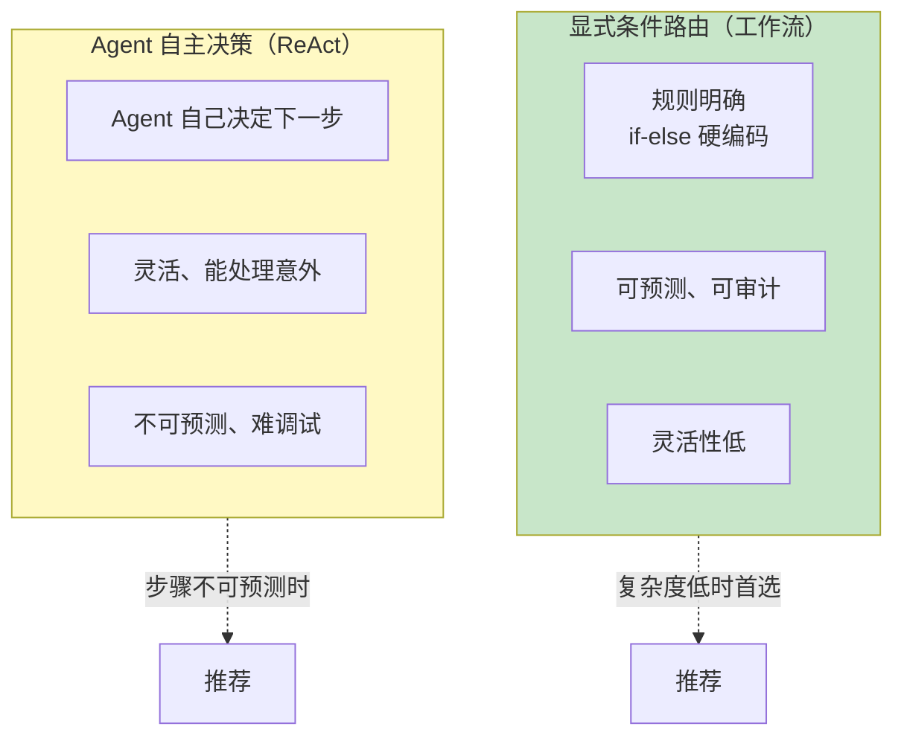

| 特性 | 显式工作流 | Agent 自主决策 |
|------|----------|--------------|
| 可预测性 | 高 | 低 |
| 灵活性 | 低 | 高 |
| 调试难度 | 低 | 高 |
| 适用场景 | 流程固定的业务 | 探索性任务 |

> **经验法则**：**80% 用工作流，20% 用 Agent 自主决策**。能用工作流覆盖的就不要让 Agent 自由发挥。

---

## 4. 状态机 vs 工作流：选型

### 4.1 两者的本质区别

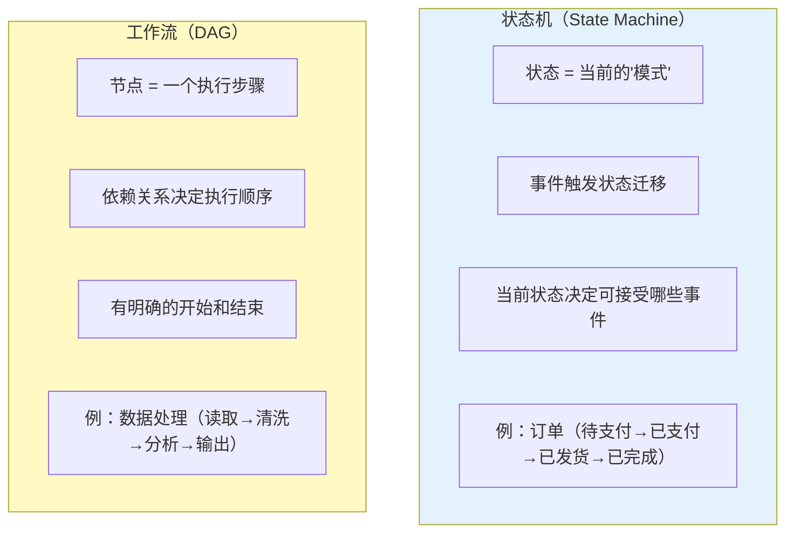

### 4.2 选型决策表

| 维度 | 选状态机 | 选 DAG 工作流 |
|------|---------|-------------|
| **核心抽象** | "当前在哪个状态" | "下一步执行什么" |
| **驱动方式** | 事件驱动 | 数据依赖驱动 |
| **生命周期** | 长期运行（天/周/月） | 短期运行（秒/分钟） |
| **分支逻辑** | 由事件 + 当前状态决定 | 由上游节点结果决定 |
| **典型场景** | 订单状态、审批流 | 数据处理、Agent 编排 |
| **可回滚** | 状态可迁移回去 | 难以回滚 |
| **并行** | 不擅长 | 天然支持 |

### 4.3 决策流程图

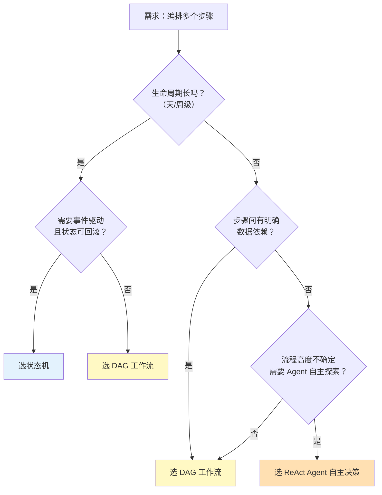

### 4.4 混合模式：状态机 + 工作流

生产系统常常**两者结合**：外层状态机管理宏观生命周期，内层 DAG 处理每个状态内的具体步骤。

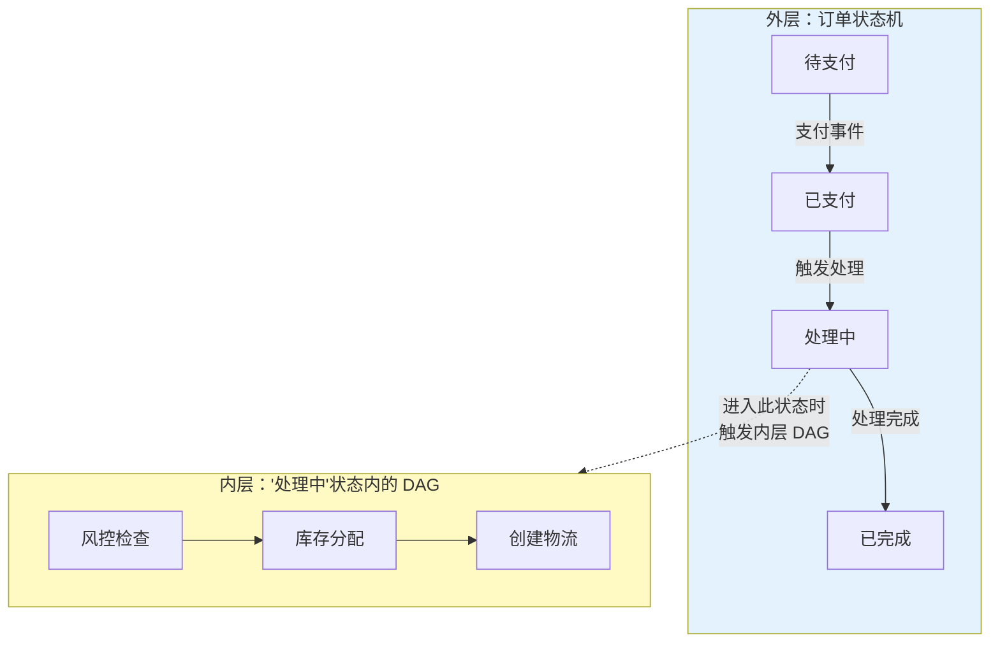

---

## 5. Spring AI 生态的编排框架

### 5.1 Spring AI Alibaba Graph

Spring AI Alibaba Graph 提供了声明式的 Agent 图编排能力：

```java
// 概念代码：Spring AI Alibaba Graph 是阿里云开源生态项目（非 Spring AI 官方 API），
// 坐标如 com.alibaba.cloud.ai:spring-ai-alibaba-graph，需自行在 pom.xml 引入，
// 且 API 随版本演进可能变化。以下仅示意设计思路，具体以官方文档为准。

// 定义节点
Graph agentGraph = Graph.builder()
    .addNode("intent", intentRecognitionNode)
    .addNode("search", knowledgeSearchNode)
    .addNode("generate", answerGenerationNode)
    .addNode("fallback", humanHandoffNode)
    // 定义边（依赖关系）
    .addEdge("intent", "search")
    .addEdge("search", "generate")
    // 条件边
    .addConditionalEdge("generate", result -> {
        if (result.confidence() > 0.8) return "END";
        else return "fallback";
    })
    .start("intent")
    .end("END")
    .build();

GraphResult result = agentGraph.invoke(userInput);
```

### 5.2 Koog 框架集成思路

Koog 是一个 Kotlin-first 的 Agent 编排框架，设计理念类似 LangGraph：

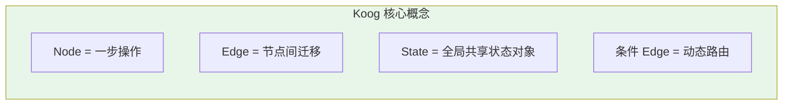

在 Spring Boot 中可通过互操作调用 Koog：

```java
// 概念代码：Koog 是第三方 Kotlin Agent 编排框架（非 Spring AI 官方组件），
// 需自行在 pom.xml 引入对应依赖；具体 API 以官方文档为准，此处仅展示集成思路。
// 在 Java 中调用 Koog 定义的 Agent 图
// 通过 Spring 的 Bean 注入 Kotlin 定义的工作流
@Autowired
AgentWorkflow orderWorkflow;

public Result process(String input) {
    return orderWorkflow.execute(
        AgentWorkflow.input()
            .withTask(input)
            .withMaxSteps(10)
            .build()
    );
}
```

### 5.3 框架选型对比

| 框架 | 语言 | 核心抽象 | 适合场景 |
|------|------|---------|---------|
| **Spring AI Alibaba Graph** | Java | 图 + 节点 | Spring AI 生态内编排 |
| **Koog** | Kotlin | DAG + 状态对象 | Kotlin 项目 / 复杂图编排 |
| **LangGraph (Python)** | Python | 图 + 状态机 | Python 生态 / 快速原型 |
| **手写 CompletableFuture** | Java | Future 链 | 简单并行场景 |

> **建议**：Spring 项目优先选 Alibaba Graph，保持技术栈一致性。跨语言场景可考虑 Koog 或 LangGraph。

---

## 6. 错误处理与补偿

工作流编排必须处理节点失败。

### 6.1 三种容错策略

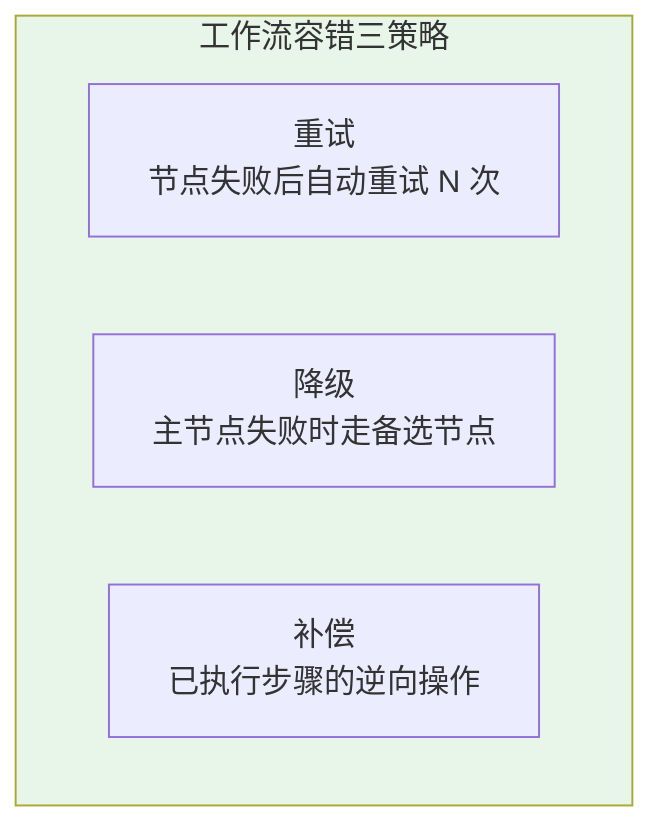

```java
public class ResilientWorkflow {

    /**
     * 带重试 + 降级的节点执行
     */
    public <T> T executeNode(Supplier<T> primary, Supplier<T> fallback, int maxRetries) {
        Exception lastError = null;
        for (int i = 0; i < maxRetries; i++) {
            try {
                return primary.get();
            } catch (Exception e) {
                lastError = e;
                // 指数退避
                Thread.sleep((long) Math.pow(2, i) * 1000);
            }
        }
        // 主节点全部失败，走降级
        try {
            return fallback.get();
        } catch (Exception e) {
            throw new WorkflowException("节点失败且降级也失败", lastError);
        }
    }
}
```

### 6.2 Saga 补偿模式

对于有副作用的步骤（发邮件、扣库存），失败时需要**补偿操作**：

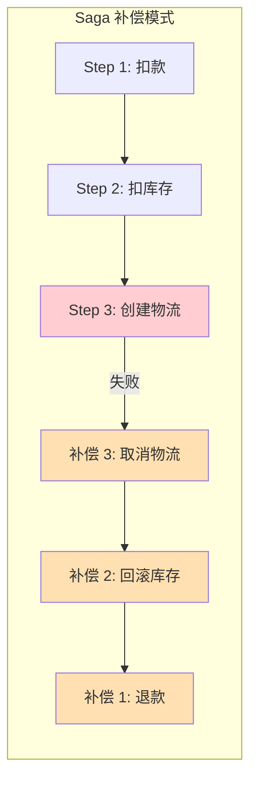

---

## 7. 监控与可观测性

工作流编排最大的价值之一是**可观测**。每个节点的输入、输出、耗时都应该被记录。

```java
@Aspect
@Component
public class WorkflowTracingAspect {

    /**
     * 拦截所有标记了 @WorkflowNode 的方法，自动记录执行指标
     */
    @Around("@annotation(WorkflowNode)")
    public Object trace(ProceedingJoinPoint pjp) throws Throwable {
        String nodeName = ((MethodSignature) pjp.getSignature()).getMethod().getName();
        long start = System.nanoTime();

        try {
            Object result = pjp.proceed();
            long duration = (System.nanoTime() - start) / 1_000_000;
            metrics.record(nodeName, "success", duration);
            return result;
        } catch (Throwable t) {
            metrics.record(nodeName, "failure", 0);
            throw t;
        }
    }
}
```

| 监控指标 | 含义 | 告警阈值 |
|---------|------|---------|
| 节点延迟 P99 | 单步最大耗时 | > 5s |
| 工作流总延迟 | 端到端耗时 | > 30s |
| 节点失败率 | 单步错误占比 | > 5% |
| 重试次数 | 平均重试次数 | > 1.5 |

---

## 8. 适用场景与不适用场景

### ✅ 适用场景

- 多步骤业务流程（客服、审批、订单处理）
- 需要条件分支和并行的数据处理管线
- 需要可审计、可重放的生产级 Agent 系统
- 多 Agent 协作场景（分工 + 汇合）

### ❌ 不适用场景

- 单步交互（直接调一次 LLM 就够了）
- 流程高度不确定需要 Agent 自主探索（用 ReAct 循环更合适）
- 极简原型（先用最简单的方式跑通）
- 纯实时低延迟场景（工作流编排有框架开销）

---

## 9. 本章总结

| 概念 | 一句话 |
|------|--------|
| **DAG 工作流** | 有向无环图编排步骤，支持串行 / 并行 / 条件 |
| **条件分支** | 通过决策节点实现 if-else 逻辑 |
| **循环模拟** | 用有限迭代 + 终止条件模拟循环 |
| **状态机** | 事件驱动的状态迁移，适合长期运行 + 可回滚 |
| **选型原则** | 长生命周期 + 事件驱动 → 状态机；短流程 + 数据依赖 → DAG |
| **混合模式** | 外层状态机 + 内层 DAG 是生产常见架构 |
| **容错** | 重试 + 降级 + 补充（Saga） |

**下一篇**：[37-自我反思与 Agent 评估](03-自我反思与Agent评估.md) — Reflection 模式、评估指标体系、A/B 测试与回归测试。

---

> **前置回顾**：[35-高级 RAG 与 Agentic RAG](01-高级RAG与AgenticRAG.md)讲了 Agentic RAG 的反思机制——本章的 IterativeRefinementWorkflow 是它的通用化抽象。
> **性能**：工作流中并行节点的性能优化，详见 [38-Agent 性能优化](04-Agent性能优化.md)。
> **治理**：多 Agent 工作流的资源治理与配额控制，详见 [教程 04-企业级架构主干/06-多租户隔离与资源治理]。
> **事件驱动**：工作流的异步/事件驱动形态（命令队列 + 消费组工作机群 + Saga 补偿），详见 [教程 07-Kafka事件骨干/09-Spring集成与Agent事件驱动落地] 与 [附录 06-企业级架构模式/02-事件驱动Agent架构]。
