# 38-Agent 性能优化

> **定位**：讲透 Agent 系统的性能优化全景——批量请求合并、并行工具调用、流式 + 缓存组合优化首字节延迟、Token 效率优化、Java 21 虚拟线程在 Agent 并发中的应用。读完这篇，你能把 Agent 的延迟降一半、成本降三成。
>
> **读者画像**：已经有可运行的 Agent，需要在大规模生产场景中优化延迟、吞吐量和成本的工程师。
>
> **前置阅读**：[77-上下文工程](00-上下文工程.md)、[36-Agent 工作流编排](02-Agent工作流编排.md)。

---

## 1. Agent 性能的三大瓶颈

Agent 系统的性能瓶颈和传统 Web 应用完全不同：

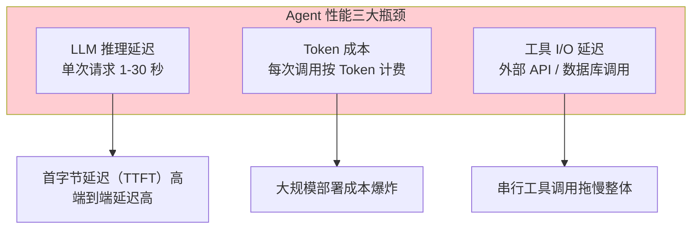

**传统 Web 应用**优化的是 QPS 和数据库查询；**Agent 应用**优化的是 LLM 调用效率和工具并行度。

### 1.1 延迟分解

一次典型的 Agent 请求，延迟构成如下：

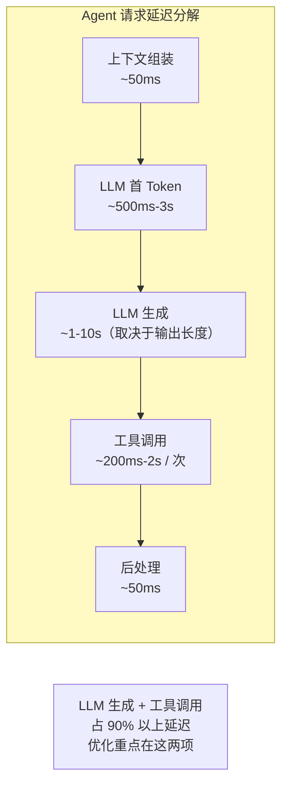

| 阶段 | 占比 | 优化方向 |
|------|------|---------|
| 上下文组装 | 5% | 减少 Token / 缓存 |
| LLM 首 Token | 20-30% | KV Cache / Prompt Cache |
| LLM 生成 | 40-60% | 减少输出长度 / 流式 |
| 工具调用 | 20-40% | 并行 / 缓存 |
| 后处理 | 5% | 异步化 |

---

## 2. 性能优化全景图

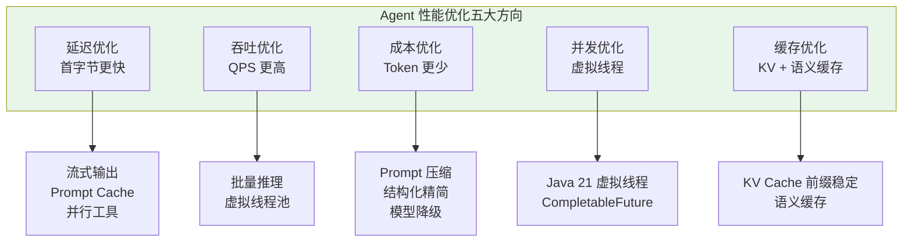

---

## 3. 批量请求合并（Batch Inference）

### 3.1 为什么要批量

LLM 推理有**固定开销**（模型加载、KV 初始化）。把多个独立请求合并为一个批次，可以摊薄固定开销。

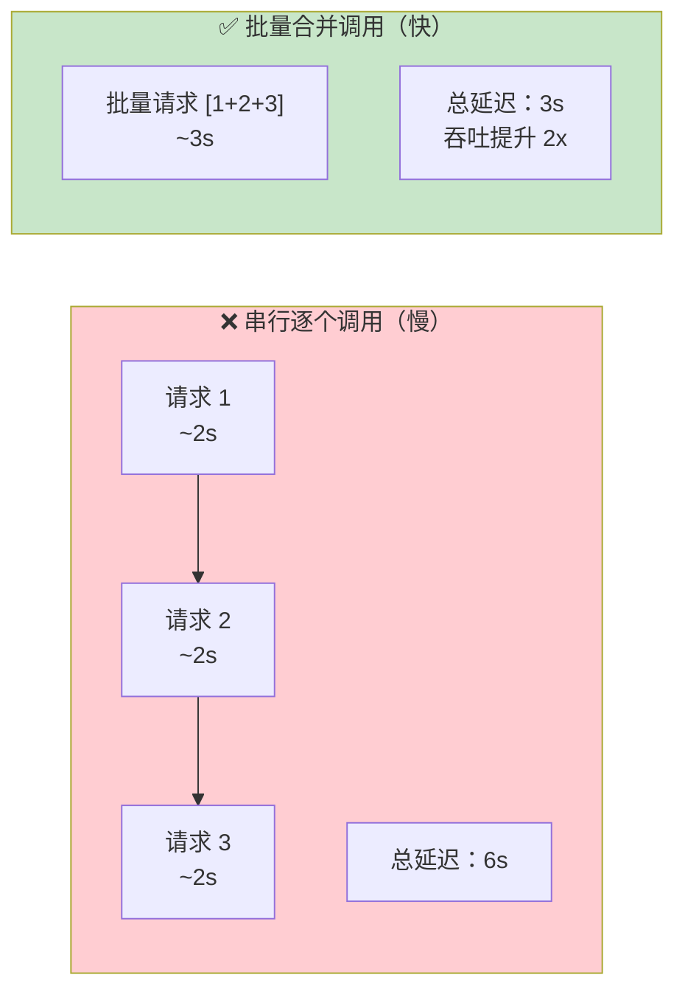

### 3.2 适用场景

| 场景 | 批量可行性 | 示例 |
|------|----------|------|
| Embedding 向量化 | ✅ 原生支持 | 批量文档 Embedding |
| 多文档摘要 | ✅ 推荐 | 一次提交多个摘要请求 |
| 多用户独立问答 | ⚠️ 需谨慎 | 增加单用户延迟 |
| 对话流 | ❌ 不适合 | 上下文依赖，无法批量 |

### 3.3 Java 代码：Embedding 批量化

```java
@Service
public class BatchEmbeddingService {

    private final EmbeddingModel embeddingModel;
    private final VectorStore vectorStore;

    /**
     * 批量向量化——一次 API 调用返回全部向量
     */
    public List<float[]> embedTexts(List<String> texts) {
        // ❌ 慢：逐条 Embedding
        // List<float[]> slow = texts.stream()
        //     .map(embeddingModel::embed)
        //     .toList();

        // ✅ 快：批量 Embedding（一次 API 调用）
        return embeddingModel.embed(texts);
    }

    /**
     * 写入向量库：VectorStore.add 内部调用注入的 EmbeddingModel 批量向量化，
     * 无需手动给 Document 设置向量（Spring AI 2.0 的 Document 不持有 embedding 字段）。
     */
    public void index(List<Document> docs) {
        vectorStore.add(docs);
    }
}
```

### 3.4 批量推理微批次器

对于需要聚合的独立请求，可以用微批次器在短时间窗口内收集请求后统一发送：

```java
import java.time.Duration;
import java.time.Instant;
import java.util.ArrayList;
import java.util.List;
import java.util.Map;
import java.util.concurrent.CompletableFuture;
import java.util.function.Function;

import org.springframework.scheduling.annotation.Scheduled;
import org.springframework.stereotype.Service;

@Service
public class MicroBatcher<T, R> {

    private final int batchSize;
    private final Duration batchWindow;
    private final Function<List<T>, List<R>> batchFunction;
    private final List<Map.Entry<T, CompletableFuture<R>>> pending = new ArrayList<>();
    private Instant lastFlush = Instant.now();

    public MicroBatcher(int batchSize, Duration batchWindow,
                        Function<List<T>, List<R>> batchFunction) {
        this.batchSize = batchSize;
        this.batchWindow = batchWindow;
        this.batchFunction = batchFunction;
    }

    /**
     * @param request 待批处理的请求
     * @return 由 flush 时统一完成的 Future
     */
    public synchronized CompletableFuture<R> submit(T request) {
        CompletableFuture<R> future = new CompletableFuture<>();
        pending.add(Map.entry(request, future));

        if (pending.size() >= batchSize) {
            flush();
        }
        return future;
    }

    @Scheduled(fixedDelay = 100)  // 每 100ms 检查一次
    public synchronized void flushIfTimeout() {
        if (!pending.isEmpty()
                && Duration.between(lastFlush, Instant.now()).compareTo(batchWindow) >= 0) {
            flush();
        }
    }

    private void flush() {
        if (pending.isEmpty()) {
            return;
        }
        List<T> requests = pending.stream().map(Map.Entry::getKey).toList();
        List<R> results = batchFunction.apply(requests);
        for (int i = 0; i < pending.size(); i++) {
            pending.get(i).getValue().complete(results.get(i));
        }
        pending.clear();
        lastFlush = Instant.now();
    }
}
```

> **权衡**：批量越大吞吐越高，但单请求延迟也越高。需要根据 SLA 调整 `batchWindow`（通常 50-200ms）。

---

## 4. 并行工具调用

### 4.1 串行 vs 并行

Agent 经常需要调用多个独立工具（查天气 + 查航班 + 查酒店）。串行调用会让延迟叠加。

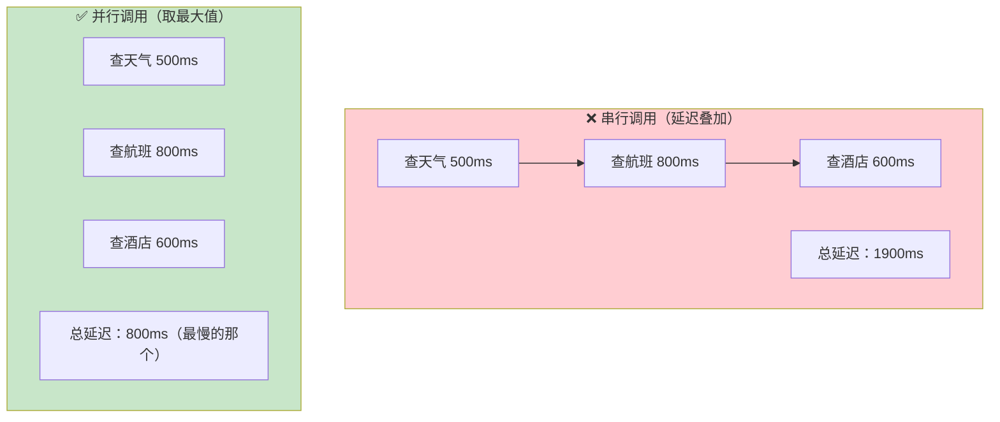

### 4.2 Java 代码：并行工具调用

```java
import java.util.concurrent.*;

@Service
public class ParallelToolExecutor {

    private final WeatherService weather;
    private final FlightService flights;
    private final HotelService hotels;

    public TravelInfo gatherAll(String city, String date) {
        // 三个工具调用完全独立，可以并行
        CompletableFuture<Weather> weatherFuture =
            CompletableFuture.supplyAsync(() -> weather.get(city, date));

        CompletableFuture<List<Flight>> flightFuture =
            CompletableFuture.supplyAsync(() -> flights.search(city, date));

        CompletableFuture<List<Hotel>> hotelFuture =
            CompletableFuture.supplyAsync(() -> hotels.search(city, date));

        // 等待全部完成
        CompletableFuture.allOf(weatherFuture, flightFuture, hotelFuture).join();

        return new TravelInfo(
            weatherFuture.join(),
            flightFuture.join(),
            hotelFuture.join()
        );
    }
}
```

### 4.3 超时保护

并行调用必须设置超时，防止某个慢工具拖垮整个请求：

```java
// 接上例：在 ParallelToolExecutor 类中新增的带超时方法
public TravelInfo gatherAllWithTimeout(String city, String date) throws InterruptedException {
    // 创建三个独立的工具调用任务
    CompletableFuture<Weather> weatherFuture =
        CompletableFuture.supplyAsync(() -> weather.get(city, date));
    CompletableFuture<List<Flight>> flightFuture =
        CompletableFuture.supplyAsync(() -> flights.search(city, date));
    CompletableFuture<List<Hotel>> hotelFuture =
        CompletableFuture.supplyAsync(() -> hotels.search(city, date));

    // 3 秒超时兜底：最多等 3 秒，超时则保留已完成的部分结果
    CompletableFuture<Void> all = CompletableFuture.allOf(
        weatherFuture, flightFuture, hotelFuture);
    try {
        all.get(3, TimeUnit.SECONDS);
    } catch (TimeoutException | ExecutionException e) {
        // 超时或失败：不中断已完成的任务，进入部分结果降级处理
    }

    // 已完成的任务取结果，未完成的用空值兜底
    return new TravelInfo(
        weatherFuture.isDone() ? weatherFuture.join() : null,
        flightFuture.isDone() ? flightFuture.join() : List.of(),
        hotelFuture.isDone() ? hotelFuture.join() : List.of()
    );
}
```

---

## 5. 流式 + 缓存：优化首字节延迟

### 5.1 流式输出

**首字节延迟（TTFT）** 是用户体验的关键指标。流式输出让用户在 LLM 生成第一个 Token 后就看到响应开始。

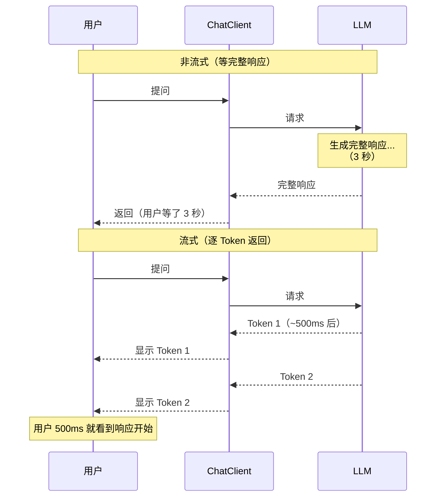

### 5.2 Spring AI 流式 API

```java
import reactor.core.publisher.Flux;

@GetMapping(value = "/chat/stream", produces = MediaType.TEXT_EVENT_STREAM_VALUE)
public Flux<String> chatStream(@RequestParam String question) {
    return chatClient.prompt()
        .user(question)
        .stream()
        .content();  // 返回 Flux<String>，逐 Token 推送
}
```

### 5.3 流式 + Prompt Cache 组合

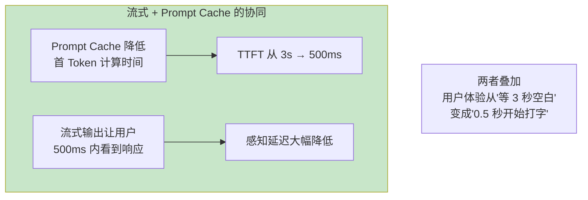

---

## 6. Token 效率优化

Token = 成本 + 延迟。**Token 越少，越快越省。**

### 6.1 Prompt 压缩

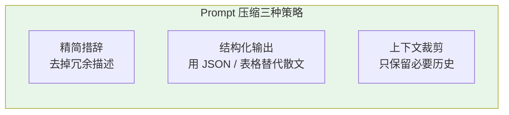

**压缩前（冗长）：**
```
请你作为一个专业的客服代表，根据用户提供的信息，为用户查询其订单状态。
在查询过程中，请确保准确无误地获取订单号，并返回详细的物流信息。
如果订单不存在，请礼貌地告知用户可能的原因。
```
**压缩后（精简）：**
```
查询订单状态。输入：订单号。输出：物流详情或"订单不存在"。
```

Token 减少 70%，效果几乎不变。

### 6.2 结构化输出精简

让 LLM 输出结构化格式（如 JSON），比自然语言更紧凑、解析更快：

```java
// ❌ 自然语言输出（冗长且解析困难）
// "根据查询结果，您的订单 ORD-12345 当前状态为已发货，
//  预计 2026 年 8 月 15 日送达，物流单号 SF1234567890。"

// ✅ 结构化输出（紧凑且解析容易）
record OrderStatus(String orderId, String status, String eta, String trackingNo) {}

OrderStatus result = chatClient.prompt()
    .user("查订单 ORD-12345 的状态")
    .call()
    .entity(OrderStatus.class);  // 直接反序列化为对象
```

### 6.3 模型降级

不是所有任务都需要最强模型。简单任务用小模型可以降低成本和延迟 5-10 倍。

```java
@Service
public class ModelTierRouter {

    private final ChatModel strongModel;  // 如 deepseek-reasoner（R1）
    private final ChatModel fastModel;    // 如 deepseek-chat（V3）

    public String answer(String question) {
        if (isSimpleQuestion(question)) {
            return fastModel.call(question);   // 快且便宜
        } else {
            return strongModel.call(question); // 强但慢贵
        }
    }

    private boolean isSimpleQuestion(String q) {
        return q.length() < 50 && !q.contains("对比") && !q.contains("分析");
    }
}
```

| 任务类型 | 推荐模型档位 | 成本 | 延迟 |
|---------|------------|------|------|
| 意图分类 / 路由 | 小模型 | $ | 极低 |
| 简单 FAQ | 小模型 | $ | 低 |
| 多跳推理 / 分析 | 大模型 | $$$ | 高 |
| 复杂代码生成 | 大模型 | $$$$ | 高 |
| 输出摘要 / 格式化 | 小模型 | $ | 低 |

> **经验**：80% 的请求可以用小模型处理，只有 20% 需要大模型。综合成本可降低 60%+。

---

## 7. Java 21 虚拟线程

### 7.1 为什么虚拟线程适合 Agent

Agent 应用是典型的 **I/O 密集型**场景——大量时间花在等 LLM 响应、等工具 API 返回。传统平台线程（OS 线程）在 I/O 等待时会阻塞，浪费资源。

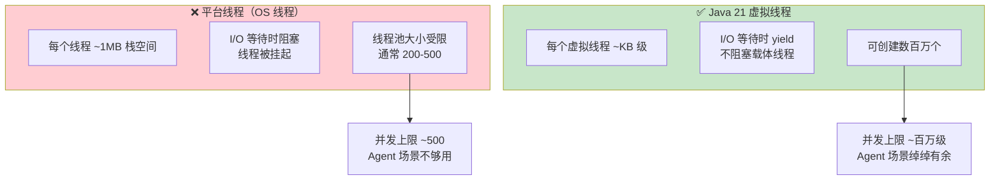

### 7.2 启用虚拟线程

Spring Boot 4.1 + Java 21 只需一行配置即可启用虚拟线程：

```yaml
# application.yml
spring:
  threads:
    virtual:
      enabled: true   # 一行开启虚拟线程
```

开启后，Spring MVC（Servlet 容器如 Tomcat）的请求处理会自动使用虚拟线程。**本项目是 WebFlux（响应式事件循环），请求处理本身不走虚拟线程**——虚拟线程的价值在于承载 Agent 流程中的阻塞式调用（JDBC 查询、同步工具 SDK、LLM 同步客户端），让它们运行在独立执行器上而不阻塞事件循环。Agent 场景大量"等 LLM / 等工具 API 返回"的 I/O 等待正是虚拟线程的理想场景。

### 7.3 在 Agent 并发中的应用

```java
@Service
public class VirtualThreadAgentService {

    // Java 21 中直接用 Thread.startVirtualThread 创建虚拟线程
    public List<ToolResult> callToolsParallel(List<ToolCall> calls) throws InterruptedException {
        List<ToolResult> results = new CopyOnWriteArrayList<>();
        List<Thread> threads = new ArrayList<>();

        for (ToolCall call : calls) {
            Thread vt = Thread.startVirtualThread(() -> {
                ToolResult result = executeTool(call);
                results.add(result);
            });
            threads.add(vt);
        }

        // 等待所有虚拟线程完成
        for (Thread t : threads) {
            t.join();
        }
        return results;
    }

    // 或者用新式的 StructuredTaskScope（Java 21 预览特性）
    public List<ToolResult> callToolsWithStructured(List<ToolCall> calls)
            throws InterruptedException {
        try (var scope = new StructuredTaskScope.ShutdownOnFailure()) {
            List<StructuredTaskScope.Subtask<ToolResult>> subtasks = calls.stream()
                .map(call -> scope.fork(() -> executeTool(call)))
                .toList();

            scope.join();           // 等待全部完成
            scope.throwIfFailed();  // 任一失败则抛出

            return subtasks.stream()
                .map(StructuredTaskScope.Subtask::get)
                .toList();
        }
    }
}
```

### 7.4 虚拟线程的注意事项

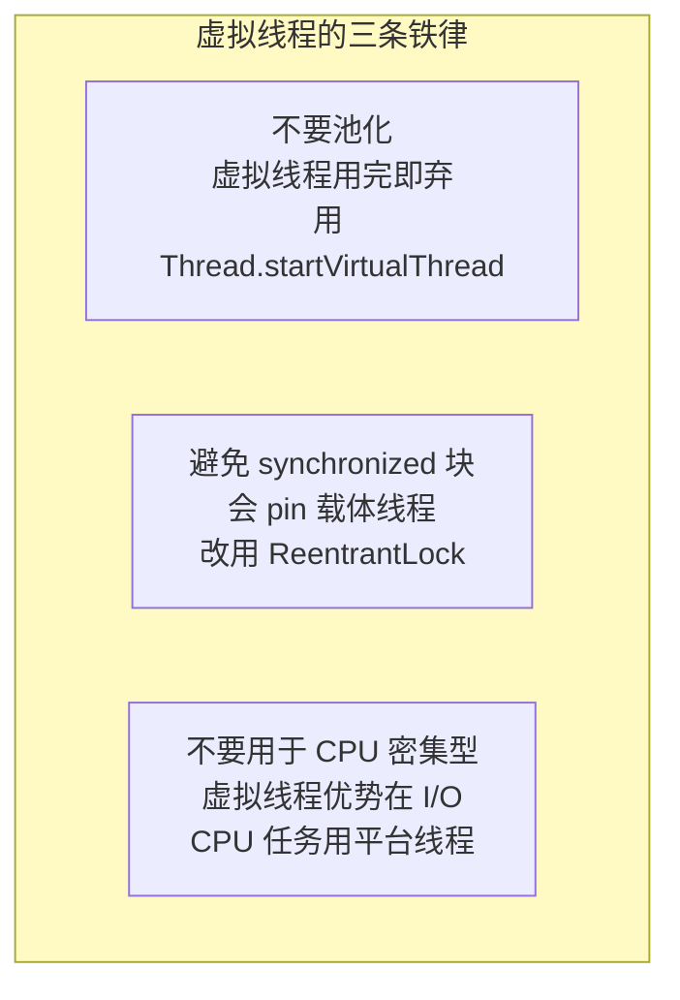

| 坑 | 原因 | 解决方案 |
|----|------|---------|
| `synchronized` 导致 pin | synchronized 持有载体线程 | 改用 `ReentrantLock` |
| `ThreadLocal` 滥用 | 每个虚拟线程独立 ThreadLocal | 用 Scoped Values |
| CPU 密集任务 | 虚拟线程无优势 | 用平台线程池 |

---

## 8. 完整优化案例

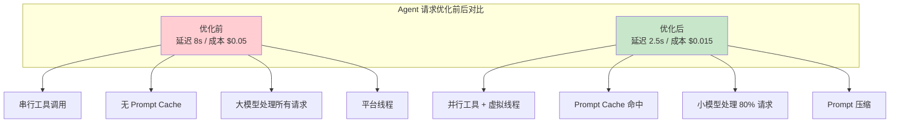

| 优化项 | 延迟降幅 | 成本降幅 |
|--------|---------|---------|
| 并行工具调用 | -40% | 0% |
| Prompt Cache | -30%（TTFT） | -25% |
| 模型降级 | -20% | -60% |
| Prompt 压缩 | -10% | -15% |
| 流式输出 | -80%（感知 TTFT） | 0% |
| 虚拟线程 | +300%（QPS） | 0% |

---

## 9. 适用场景与不适用场景

### ✅ 适用场景

- 大规模生产 Agent（高 QPS）
- 实时对话产品（低延迟要求）
- 多用户并发场景
- 成本敏感的 SaaS 产品

### ❌ 不适用场景

- 原型阶段（先功能正确再优化）
- 单用户低频使用（优化收益不大）
- CPU 密集型 AI 任务（如本地模型推理）
- 严格顺序依赖的流程（无法并行）

---

## 10. 本章总结

| 概念 | 一句话 |
|------|--------|
| **三大瓶颈** | LLM 推理延迟、Token 成本、工具 I/O |
| **批量推理** | 多请求合并，摊薄固定开销 |
| **并行工具** | 独立工具同时调用，取最大延迟 |
| **流式 + 缓存** | Prompt Cache 降 TTFT + 流式输出降感知延迟 |
| **Token 优化** | Prompt 压缩 + 结构化输出 + 模型降级 |
| **虚拟线程** | Java 21 轻量级并发，Agent I/O 密集场景的理想选择 |
| **模型降级** | 80% 请求用小模型，成本降 60%+ |

**下一篇**：[82-高级记忆架构](05-高级记忆架构.md) — 三层记忆、语义 vs 情景记忆、记忆演化与衰减。

---

> **前置回顾**：[77-上下文工程](00-上下文工程.md)讲了 Token 预算分配——本章的 Token 效率优化是其延伸实践。
> **工作流**：并行工具调用在工作流编排中的应用，详见 [36-Agent 工作流编排](02-Agent工作流编排.md)。
> **评估**：优化效果需要量化评估，详见 [37-自我反思与 Agent 评估](03-自我反思与Agent评估.md)。
