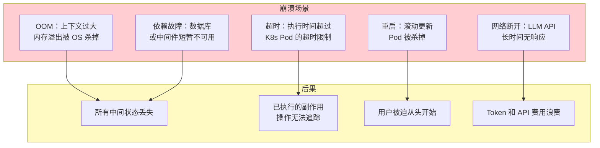
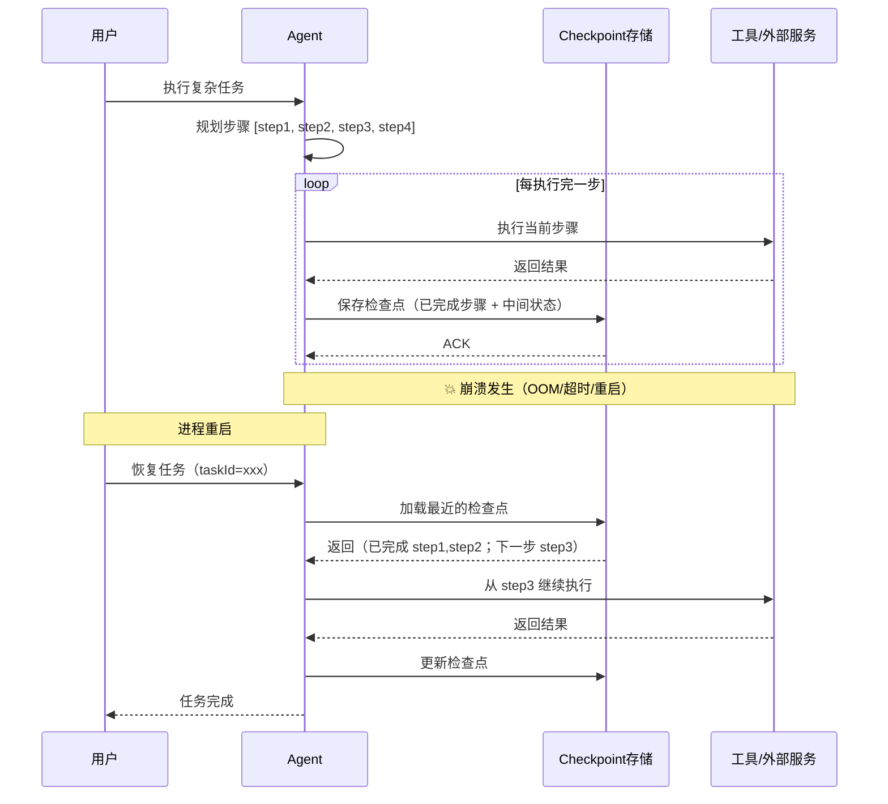
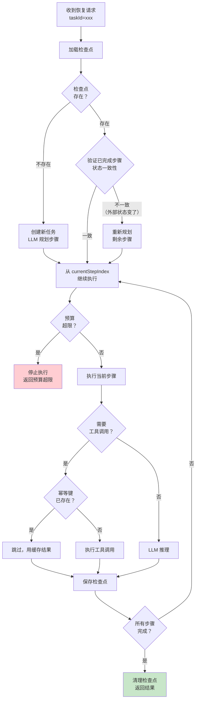
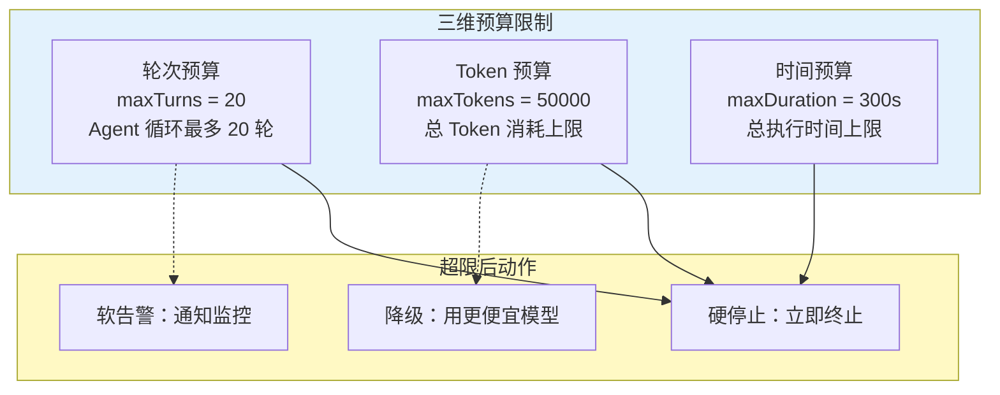
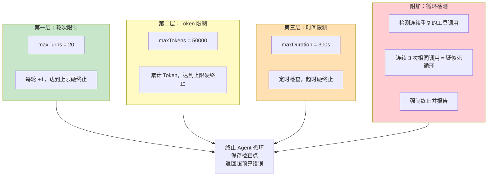
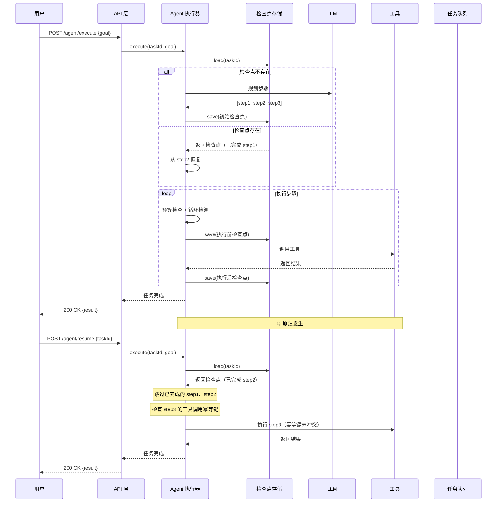

# 06 长任务持久化与中断恢复
> **定位**：讲透 Agent 执行复杂长任务时的可靠性问题——进程重启 / OOM / 超时杀掉后如何从断点恢复，检查点（Checkpoint）机制如何持久化中间状态，工具调用的幂等重试，以及预算控制与死循环三层防护。读完这篇，你的 Agent 能在崩溃后自动恢复，且永远不会"烧钱跑飞"。
>
> **读者画像**：已经掌握 Agent 基本循环（工具调用、记忆管理），需要让 Agent 在生产环境中具备高可靠性。
>
> **前置阅读**：[04-记忆与会话管理](../00-基础与核心/04-记忆与会话管理.md)、[03-工具调用](../00-基础与核心/03-工具调用.md)。

---

## 1. 长任务的脆弱性

Agent 执行一个复杂任务时，通常需要**多轮对话 + 多次工具调用**。一轮典型流程：

1. 用户："帮我分析这 100 个 CSV 文件，找出异常数据，生成报告。"
2. Agent 读取文件 → 分析 → 调用统计工具 → 生成图表 → 撰写报告

这个过程可能持续**几分钟甚至几十分钟**。期间任何一步都可能崩溃：



**核心问题**：Agent 执行到一半崩溃了，怎么办？

| 策略 | 做法 | 问题 |
|------|------|------|
| **从头重来** | 重启后重新执行整个任务 | 浪费时间和费用，副作用操作可能重复执行 |
| **无状态恢复** | 保存最终结果，中间状态丢失 | 无法恢复进行中的任务 |
| **检查点恢复** | 定期保存中间状态，崩溃后从最近的检查点恢复 | 正确方案 |

---

## 2. 检查点（Checkpoint）机制

### 2.1 什么是检查点

检查点的核心思想：**在 Agent 执行过程中，定期将"当前状态"持久化到存储中**。崩溃后，从最近的检查点恢复，跳过已完成的步骤。



### 2.2 什么需要被持久化

检查点不是把内存全量 dump，而是保存**恢复所需的最小状态**：

| 状态 | 说明 | 示例 |
|------|------|------|
| **任务元信息** | 任务 ID、目标、创建时间 | `taskId`, `goal`, `createdAt` |
| **执行计划** | LLM 生成的步骤列表 | `["step1: 读文件", "step2: 分析", ...]` |
| **已完成步骤** | 每步的输入、输出、状态 | `[{step: 1, status: "done", result: ...}]` |
| **当前步骤** | 正在执行的步骤（含中间进度） | `{step: 3, status: "running", progress: ...}` |
| **对话上下文** | 到目前为止的消息历史 | `[{role: "user", ...}, {role: "assistant", ...}]` |
| **工具调用记录** | 每次工具调用的参数和返回值 | `[{tool: "searchDB", args: {...}, result: ...}]` |
| **预算消耗** | 已使用的轮次 / Token / 时间 | `{turns: 5, tokens: 12000, elapsed: 120s}` |
| **幂等键集合** | 已执行工具调用的幂等键 | `["req_001", "req_002", ...]` |

### 2.3 检查点存储实现

```java
import org.springframework.data.redis.core.RedisTemplate;
import com.fasterxml.jackson.databind.ObjectMapper;
import java.time.Duration;
import java.util.*;

/**
 * Agent 执行检查点
 */
public record AgentCheckpoint(
    String taskId,
    String goal,
    List<String> plan,
    List<StepResult> completedSteps,
    int currentStepIndex,
    List<Map<String, Object>> messages,
    List<ToolCallRecord> toolCallHistory,
    BudgetUsage budgetUsage,
    Set<String> idempotencyKeys,
    long timestamp
) {
    public record StepResult(
        int stepIndex,
        String description,
        String status,   // "done" | "failed" | "skipped"
        Map<String, Object> output,
        String errorMessage
    ) {}

    public record ToolCallRecord(
        String toolName,
        Map<String, Object> arguments,
        Object result,
        String idempotencyKey
    ) {}

    public record BudgetUsage(
        int turnsUsed,
        int tokensUsed,
        long elapsedMillis
    ) {}
}
```

```java
import org.springframework.data.redis.core.RedisTemplate;
import com.fasterxml.jackson.databind.ObjectMapper;
import org.springframework.stereotype.Component;
import java.time.Duration;
import java.util.*;

@Component
public class CheckpointStore {

    private final RedisTemplate<String, String> redisTemplate;
    private final ObjectMapper objectMapper;

    // 检查点保留 7 天
    private static final Duration TTL = Duration.ofDays(7);

    public CheckpointStore(RedisTemplate<String, String> redisTemplate,
                           ObjectMapper objectMapper) {
        this.redisTemplate = redisTemplate;
        this.objectMapper = objectMapper;
    }

    private String key(String taskId) {
        return "agent:checkpoint:" + taskId;
    }

    /** 保存检查点（覆盖写） */
    public void save(AgentCheckpoint checkpoint) {
        try {
            String json = objectMapper.writeValueAsString(checkpoint);
            redisTemplate.opsForValue().set(key(checkpoint.taskId()), json, TTL);
        } catch (Exception e) {
            throw new RuntimeException("Failed to save checkpoint", e);
        }
    }

    /** 加载检查点 */
    public Optional<AgentCheckpoint> load(String taskId) {
        String json = redisTemplate.opsForValue().get(key(taskId));
        if (json == null) {
            return Optional.empty();
        }
        try {
            return Optional.of(objectMapper.readValue(json, AgentCheckpoint.class));
        } catch (Exception e) {
            throw new RuntimeException("Failed to load checkpoint", e);
        }
    }

    /** 删除检查点（任务完成后清理） */
    public void delete(String taskId) {
        redisTemplate.delete(key(taskId));
    }

    /** 检查检查点是否存在 */
    public boolean exists(String taskId) {
        return Boolean.TRUE.equals(redisTemplate.hasKey(key(taskId)));
    }

    /** 扫描全部检查点——健康检查 / 停滞任务检测用 */
    public List<AgentCheckpoint> findAll() {
        Set<String> keys = redisTemplate.keys("agent:checkpoint:*");
        if (keys == null) return List.of();
        return keys.stream()
            .map(this::load)
            .filter(Optional::isPresent)
            .map(Optional::get)
            .toList();
    }
}
```

> **为什么用 Redis？** 检查点需要低延迟读写（每步都存），Redis 的亚毫秒延迟不影响 Agent 执行节奏。对于需要长期归档的检查点，可以异步同步到 PostgreSQL。
>
> **对话上下文持久化**：检查点里的 `messages` 字段（对话消息历史）也可以用 Spring AI 自带的记忆 API 持久化——`ChatMemory` / `ChatMemoryRepository`（`org.springframework.ai.chat.memory`，真实 API，`MessageWindowChatMemory.builder()` + `InMemoryChatMemoryRepository`，JDBC/内存持久化由 starter `spring-ai-starter-model-chat-memory` 提供），配合 `MessageChatMemoryAdvisor` 在请求链上读写；完整讲解见 [教程 00-基础与核心/04-记忆与会话管理]。检查点聚焦"任务执行状态"，记忆 API 聚焦"对话上下文"，两者可配合使用。

### 2.4 检查点时机

不是每一步都存检查点——需要在**可靠性和性能**之间取平衡：

| 时机 | 说明 | 理由 |
|------|------|------|
| **每个工具调用前** | 调用工具前先存检查点 | 工具调用可能有副作用，崩溃后要知道是否已执行 |
| **每个工具调用后** | 拿到结果后立即存 | 保存工具返回值，崩溃后不需重新调用 |
| **每轮 LLM 响应后** | LLM 返回后存 | 保存对话上下文，崩溃后不需重新请求 |
| **每步计划完成后** | 一个步骤完整结束后存 | 步骤是逻辑单元，恢复粒度合适 |

---

## 3. 检查点恢复的执行引擎

### 3.1 可恢复的 Agent 执行循环

```java
import org.springframework.ai.chat.client.ChatClient;
import org.springframework.stereotype.Service;
import reactor.core.publisher.Flux;
import reactor.core.publisher.Mono;
import reactor.core.scheduler.Schedulers;
import java.util.*;

@Service
public class ResilientAgentExecutor {

    private final CheckpointStore checkpointStore;
    private final ChatClient chatClient;
    private final ToolExecutor toolExecutor;
    private final BudgetGuard budgetGuard;

    public ResilientAgentExecutor(CheckpointStore checkpointStore,
                                   ChatClient chatClient,
                                   ToolExecutor toolExecutor,
                                   BudgetGuard budgetGuard) {
        this.checkpointStore = checkpointStore;
        this.chatClient = chatClient;
        this.toolExecutor = toolExecutor;
        this.budgetGuard = budgetGuard;
    }

    /**
     * 执行任务——支持从检查点恢复
     * @param taskId 任务 ID（用于恢复）
     * @param goal 任务目标
     */
    public Mono<String> execute(String taskId, String goal) {
        // 1. 尝试加载已有检查点（Redis 阻塞读必须包进 boundedElastic——WebFlux 铁律）
        return Mono.fromCallable(() -> checkpointStore.load(taskId))
            .subscribeOn(Schedulers.boundedElastic())
            .flatMap(opt -> {
                // 2a. 检查点存在——从断点恢复
                if (opt.isPresent()) {
                    return resumeFromCheckpoint(opt.get());
                }
                // 2b. 没有检查点——从头开始
                return startNewTask(taskId, goal);
            });
    }

    private Mono<String> startNewTask(String taskId, String goal) {
        // 让 LLM 规划步骤
        // ⚠ 修正: chatClient.call().content() 是同步返回 String（无 flatMap）
        // 阻塞调用用 Mono.fromCallable + boundedElastic 桥接（教程 05-Observation可观测/04-自定义Convention与Filter：工业标签与脱敏 §阻塞桥接）
        return Mono.fromCallable(() -> {
                String planJson = chatClient.prompt()
                    .user("请为以下任务制定执行计划，输出 JSON 数组：" + goal)
                    .call()
                    .content();
                return parsePlan(planJson);
            })
            .subscribeOn(Schedulers.boundedElastic())
            .flatMap(plan -> {
                AgentCheckpoint checkpoint = new AgentCheckpoint(
                    taskId, goal, plan,
                    new ArrayList<>(),   // completedSteps
                    0,                   // currentStepIndex
                    new ArrayList<>(),   // messages
                    new ArrayList<>(),   // toolCallHistory
                    new AgentCheckpoint.BudgetUsage(0, 0, 0),
                    new HashSet<>(),     // idempotencyKeys
                    System.currentTimeMillis()
                );
                checkpointStore.save(checkpoint);
                return executeLoop(checkpoint);
            });
    }

    private Mono<String> resumeFromCheckpoint(AgentCheckpoint checkpoint) {
        System.out.printf("从检查点恢复，已完成 %d/%d 步%n",
            checkpoint.completedSteps().size(), checkpoint.plan().size());
        return executeLoop(checkpoint);
    }

    private Mono<String> executeLoop(AgentCheckpoint checkpoint) {
        return Mono.fromCallable(() -> {
            // 预算检查
            budgetGuard.checkBudget(checkpoint.budgetUsage());

            int stepIndex = checkpoint.currentStepIndex();
            while (stepIndex < checkpoint.plan().size()) {
                String step = checkpoint.plan().get(stepIndex);

                // 执行步骤
                Map<String, Object> output = executeStep(checkpoint, step).block();

                // 记录完成
                AgentCheckpoint.StepResult result = new AgentCheckpoint.StepResult(
                    stepIndex, step, "done", output, null
                );
                checkpoint.completedSteps().add(result);
                checkpoint = new AgentCheckpoint(
                    checkpoint.taskId(), checkpoint.goal(), checkpoint.plan(),
                    new ArrayList<>(checkpoint.completedSteps()),
                    stepIndex + 1,
                    checkpoint.messages(),
                    checkpoint.toolCallHistory(),
                    checkpoint.budgetUsage(),
                    checkpoint.idempotencyKeys(),
                    System.currentTimeMillis()
                );

                // 保存检查点
                checkpointStore.save(checkpoint);
                stepIndex = checkpoint.currentStepIndex();
            }

            // 任务完成，清理检查点
            checkpointStore.delete(checkpoint.taskId());
            return "任务完成";
        })
        // 循环体内部有阻塞操作（.block()、Redis 读写），必须放到 boundedElastic 线程
        .subscribeOn(Schedulers.boundedElastic());
    }

    private Mono<Map<String, Object>> executeStep(
            AgentCheckpoint checkpoint, String stepDescription) {
        // 调用 LLM 决定要调用什么工具
        // 注意：call().entity(Class) 是同步阻塞返回 T（不是 Mono），
        // 必须包进 Mono.fromCallable + subscribeOn(boundedElastic) 桥接（WebFlux 铁律）
        return Mono.fromCallable(() ->
                chatClient.prompt()
                    .user("执行步骤：" + stepDescription + "\n选择工具并给出参数。")
                    .call()
                    .entity(ToolCallRequest.class))
            .subscribeOn(Schedulers.boundedElastic())
            .flatMap(request -> {
                // 幂等检查 + 执行工具
                return executeToolWithIdempotency(checkpoint, request);
            });
    }

    private Mono<Map<String, Object>> executeToolWithIdempotency(
            AgentCheckpoint checkpoint, ToolCallRequest request) {
        String idempotencyKey = request.idempotencyKey();

        // 如果这个幂等键已经执行过，直接返回缓存结果
        if (checkpoint.idempotencyKeys().contains(idempotencyKey)) {
            return Mono.just(findCachedResult(checkpoint, idempotencyKey));
        }

        // 调用前先保存检查点（标记"即将执行"）
        checkpointStore.save(checkpoint);

        return toolExecutor.execute(request.toolName(), request.arguments())
            .doOnSuccess(result -> {
                // 记录工具调用 + 幂等键
                checkpoint.toolCallHistory().add(new AgentCheckpoint.ToolCallRecord(
                    request.toolName(), request.arguments(), result, idempotencyKey
                ));
                checkpoint.idempotencyKeys().add(idempotencyKey);
                checkpointStore.save(checkpoint);
            });
    }

    // 解析 LLM 输出的 JSON 计划数组（示意）——生产用 BeanOutputConverter 或 Jackson
    private List<String> parsePlan(String planJson) {
        if (planJson == null || planJson.isBlank()) return List.of();
        return List.of(planJson.replaceAll("[\\[\\]\"]", "").split(","));
    }

    // 从工具调用历史里找幂等键对应的缓存结果
    private Map<String, Object> findCachedResult(AgentCheckpoint checkpoint, String idempotencyKey) {
        return checkpoint.toolCallHistory().stream()
            .filter(t -> idempotencyKey.equals(t.idempotencyKey()))
            .findFirst()
            .map(t -> Map.<String, Object>of("cached", true, "result", t.result()))
            .orElse(Map.of("cached", false));
    }
}

// —— 辅助类型（示意）——
/** 工具执行器（示意）——真实实现由业务方提供 */
interface ToolExecutor {
    Mono<Object> execute(String toolName, Map<String, Object> args);
}

/** LLM 决策的结构化输出——与 .entity(ToolCallRequest.class) 配合 */
record ToolCallRequest(String toolName, Map<String, Object> arguments, String idempotencyKey) {}
```

### 3.2 恢复流程详解



---

## 4. 幂等重试

### 4.1 为什么工具调用需要幂等

崩溃恢复时，最大的风险是**工具调用重复执行**：

| 场景 | 非幂等的后果 | 幂等的保障 |
|------|------------|-----------|
| 发送邮件 | 用户收到两封相同邮件 | 检查幂等键，已发过就跳过 |
| 创建订单 | 创建了两个重复订单 | 幂等键已存在则返回原订单 |
| 扣减余额 | 余额被扣了两次 | 幂等键保证只扣一次 |
| 写入数据库 | 数据被写了两遍 | 唯一约束 + 幂等键防重 |

### 4.2 幂等键设计

```java
import java.util.UUID;

public class IdempotencyKeyGenerator {

    /**
     * 为工具调用生成幂等键
     * 组成：taskId + stepIndex + toolName + argsHash
     */
    public static String generate(String taskId, int stepIndex,
                                   String toolName, Map<String, Object> args) {
        String argsHash = Integer.toHexString(args.hashCode());
        return String.format("%s:%d:%s:%s", taskId, stepIndex, toolName, argsHash);
    }

    /**
     * 外部可传入显式幂等键（推荐——更可控）
     */
    public static String explicit(String taskId, String requestId) {
        return taskId + ":" + requestId;
    }
}
```

### 4.3 幂等工具包装

```java
import org.springframework.stereotype.Component;
import java.util.Map;
import java.util.concurrent.ConcurrentHashMap;

@Component
public class IdempotentToolExecutor {

    private final CheckpointStore checkpointStore;
    // 本地缓存（防止崩溃恢复后重复查 Redis）
    private final Map<String, Object> localCache = new ConcurrentHashMap<>();

    public IdempotentToolExecutor(CheckpointStore checkpointStore) {
        this.checkpointStore = checkpointStore;
    }

    /**
     * 幂等执行工具
     */
    public Mono<Object> executeIdempotent(
            String taskId,
            String idempotencyKey,
            String toolName,
            Map<String, Object> args,
            java.util.function.Function<Map<String, Object>, Mono<Object>> toolFn) {

        // 1. 检查本地缓存
        if (localCache.containsKey(idempotencyKey)) {
            return Mono.just(localCache.get(idempotencyKey));
        }

        // 2. 检查检查点中的幂等记录
        return checkpointStore.load(taskId)
            .flatMap(checkpoint -> {
                if (checkpoint.idempotencyKeys().contains(idempotencyKey)) {
                    // 幂等键已存在——返回已缓存的结果
                    return findCachedToolResult(checkpoint, idempotencyKey);
                }
                // 3. 执行工具
                return toolFn.apply(args)
                    .doOnSuccess(result -> {
                        localCache.put(idempotencyKey, result);
                    });
            });
    }

    private Mono<Object> findCachedToolResult(
            AgentCheckpoint checkpoint, String idempotencyKey) {
        return Mono.just(
            checkpoint.toolCallHistory().stream()
                .filter(t -> idempotencyKey.equals(t.idempotencyKey()))
                .map(AgentCheckpoint.ToolCallRecord::result)
                .findFirst()
                .orElseThrow(() -> new IllegalStateException(
                    "幂等键标记已执行但找不到结果: " + idempotencyKey))
        );
    }
}
```

### 4.4 不同工具类型的幂等策略

| 工具类型 | 幂等难度 | 策略 |
|----------|---------|------|
| **只读查询**（searchDB, getWeather） | 天然幂等 | 直接重试即可 |
| **写入操作**（createOrder, sendEmail） | 需设计幂等 | 服务端唯一键 + 幂等检查 |
| **状态变更**（updateStatus, transferMoney） | 需设计幂等 | 版本号 / 乐观锁 / 幂等键 |
| **外部 API**（第三方支付、短信） | 取决于对方 | 调用对方的幂等接口 |
| **文件操作**（writeFile, uploadFile） | 需设计幂等 | 覆盖写或文件名包含幂等键 |

```java
import org.springframework.ai.tool.annotation.Tool;
import org.springframework.ai.tool.annotation.ToolParam;
import org.springframework.stereotype.Component;

// 示例：幂等的邮件发送工具
// 注意：@Tool 是方法级注解——POJO 类直接写 @Tool 方法，无需 implements Tool
// （Tool 接口是运行时工具抽象，用户代码不实现它）
@Component
public class SendEmailTool {

    private final EmailService emailService;
    private final IdempotencyRecordRepository idempotencyRepo;

    public SendEmailTool(EmailService emailService,
                         IdempotencyRecordRepository idempotencyRepo) {
        this.emailService = emailService;
        this.idempotencyRepo = idempotencyRepo;
    }

    @Tool(description = "发送邮件（幂等）")
    public String sendEmail(
            @ToolParam(description = "收件人") String to,
            @ToolParam(description = "邮件主题") String subject,
            @ToolParam(description = "邮件正文") String body,
            @ToolParam(description = "幂等键，相同键不重复发送") String idempotencyKey) {

        // 服务端幂等检查——防止重复发送
        if (idempotencyRepo.existsByKey(idempotencyKey)) {
            return "邮件已发送（幂等跳过）， messageId=" +
                idempotencyRepo.findByKey(idempotencyKey).getResult();
        }

        String messageId = emailService.send(to, subject, body);

        // 记录幂等键
        idempotencyRepo.save(new IdempotencyRecord(idempotencyKey, messageId));

        return "邮件已发送，messageId=" + messageId;
    }
}

// 业务辅助类型（示意）——按实际邮件服务/数据库实现
class EmailService {
    String send(String to, String subject, String body) { return "msg_001"; }
}

record IdempotencyRecord(String key, String result) {}

interface IdempotencyRecordRepository {
    boolean existsByKey(String key);
    IdempotencyRecord findByKey(String key);
    void save(IdempotencyRecord record);
}
```

---

## 5. 预算控制

### 5.1 为什么需要预算控制

Agent 是自主系统——LLM 自己决定下一步做什么。如果 LLM 判断失误陷入循环，后果是：

- **Token 爆炸**：每轮对话消耗 Token，循环 100 轮就是 100 倍费用
- **时间爆炸**：工具调用 + LLM 响应，每轮可能 10 秒，循环几十轮就是几分钟
- **API 配额耗尽**：无限循环耗尽 LLM API 速率配额

### 5.2 三维预算



### 5.3 预算守卫实现

```java
import org.springframework.stereotype.Component;

@Component
public class BudgetGuard {

    // 默认预算
    private static final int DEFAULT_MAX_TURNS = 20;
    private static final int DEFAULT_MAX_TOKENS = 50_000;
    private static final long DEFAULT_MAX_DURATION_MS = 300_000; // 5 分钟

    /**
     * 检查预算是否超限
     * @throws BudgetExceededException 如果任何维度超限
     */
    public void checkBudget(AgentCheckpoint.BudgetUsage usage) {
        checkBudget(usage, DEFAULT_MAX_TURNS, DEFAULT_MAX_TOKENS, DEFAULT_MAX_DURATION_MS);
    }

    public void checkBudget(AgentCheckpoint.BudgetUsage usage,
                            int maxTurns, int maxTokens, long maxDurationMs) {
        // 1. 轮次检查
        if (usage.turnsUsed() >= maxTurns) {
            throw new BudgetExceededException(
                BudgetType.TURNS, usage.turnsUsed(), maxTurns,
                String.format("轮次超限：%d/%d", usage.turnsUsed(), maxTurns)
            );
        }

        // 2. Token 检查
        if (usage.tokensUsed() >= maxTokens) {
            throw new BudgetExceededException(
                BudgetType.TOKENS, usage.tokensUsed(), maxTokens,
                String.format("Token 超限：%d/%d", usage.tokensUsed(), maxTokens)
            );
        }

        // 3. 时间检查
        if (usage.elapsedMillis() >= maxDurationMs) {
            throw new BudgetExceededException(
                BudgetType.TIME, usage.elapsedMillis(), maxDurationMs,
                String.format("时间超限：%dms/%dms", usage.elapsedMillis(), maxDurationMs)
            );
        }
    }

    /**
     * 软告警——接近预算 80% 时告警
     */
    public BudgetWarning checkWarning(AgentCheckpoint.BudgetUsage usage) {
        double turnRatio = (double) usage.turnsUsed() / DEFAULT_MAX_TURNS;
        double tokenRatio = (double) usage.tokensUsed() / DEFAULT_MAX_TOKENS;
        double timeRatio = (double) usage.elapsedMillis() / DEFAULT_MAX_DURATION_MS;

        double maxRatio = Math.max(turnRatio, Math.max(tokenRatio, timeRatio));
        if (maxRatio > 0.8) {
            return new BudgetWarning(maxRatio, "预算使用超过 80%");
        }
        return BudgetWarning.ok();
    }

    public enum BudgetType { TURNS, TOKENS, TIME }

    public static class BudgetExceededException extends RuntimeException {
        public final BudgetType type;
        public final long used;
        public final long limit;

        public BudgetExceededException(BudgetType type, long used, long limit, String msg) {
            super(msg);
            this.type = type;
            this.used = used;
            this.limit = limit;
        }
    }

    public record BudgetWarning(double ratio, String message) {
        public static BudgetWarning ok() { return new BudgetWarning(0, "OK"); }
        public boolean isWarning() { return ratio > 0; }
    }
}
```

### 5.4 预算与 Spring AI 集成

Spring AI 2.0 的响应元数据 `ChatResponseMetadata.getUsage()` 提供**真实**的 Token 消耗（`Usage.getTotalTokens()`），配合 `CallAdvisor` 可以在每次调用后透明地累加预算；`TokenCountEstimator`（`org.springframework.ai.tokenizer`，发送前估算用）适合做预算预检：

```java
import org.springframework.ai.chat.client.ChatClientRequest;
import org.springframework.ai.chat.client.ChatClientResponse;
import org.springframework.ai.chat.client.advisor.api.CallAdvisor;
import org.springframework.ai.chat.client.advisor.api.CallAdvisorChain;
import org.springframework.ai.chat.metadata.Usage;
import org.springframework.stereotype.Component;

@Component
public class BudgetTrackingAdvisor implements CallAdvisor {

    private final CheckpointStore checkpointStore;

    public BudgetTrackingAdvisor(CheckpointStore checkpointStore) {
        this.checkpointStore = checkpointStore;
    }

    @Override
    public ChatClientResponse adviseCall(ChatClientRequest request,
                                          CallAdvisorChain chain) {
        // Spring AI 2.0：CallAdvisor.adviseCall 是同步方法，返回 ChatClientResponse（record）
        ChatClientResponse response = chain.nextCall(request);

        // 从响应中获取 Token 用量（ChatClientResponse.chatResponse() → ChatResponse → getMetadata() → getUsage()）
        Usage usage = response.chatResponse().getMetadata().getUsage();
        int totalTokens = usage.getTotalTokens();

        // 更新检查点中的预算（任务 ID 经 request.context() 传入）
        String taskId = (String) request.context().get("taskId");
        if (taskId != null) {
            checkpointStore.load(taskId).ifPresent(checkpoint -> {
                AgentCheckpoint.BudgetUsage newUsage = new AgentCheckpoint.BudgetUsage(
                    checkpoint.budgetUsage().turnsUsed() + 1,
                    checkpoint.budgetUsage().tokensUsed() + totalTokens,
                    System.currentTimeMillis() - checkpoint.timestamp()
                );
                updateBudget(checkpoint, newUsage);
            });
        }
        return response;
    }

    private void updateBudget(AgentCheckpoint checkpoint, AgentCheckpoint.BudgetUsage newUsage) {
        // AgentCheckpoint 是不可变 record——构造新实例后覆盖保存
        checkpointStore.save(new AgentCheckpoint(
            checkpoint.taskId(), checkpoint.goal(), checkpoint.plan(),
            checkpoint.completedSteps(), checkpoint.currentStepIndex(),
            checkpoint.messages(), checkpoint.toolCallHistory(),
            newUsage, checkpoint.idempotencyKeys(), System.currentTimeMillis()
        ));
    }
}
```

### 5.5 动态预算——不同任务不同预算

不是所有任务都应该有同样的预算：

| 任务类型 | 最大轮次 | 最大 Token | 最大时间 |
|----------|---------|-----------|---------|
| 简单问答 | 3 | 2,000 | 30s |
| 工具调用 | 10 | 10,000 | 120s |
| 复杂分析 | 20 | 50,000 | 300s |
| 批量处理 | 50 | 200,000 | 1800s |

```java
public class BudgetPolicy {

    public static BudgetConfig forTask(String taskType) {
        return switch (taskType) {
            case "simple_qa" -> new BudgetConfig(3, 2_000, 30_000);
            case "tool_use" -> new BudgetConfig(10, 10_000, 120_000);
            case "complex_analysis" -> new BudgetConfig(20, 50_000, 300_000);
            case "batch_processing" -> new BudgetConfig(50, 200_000, 1_800_000);
            default -> new BudgetConfig(15, 30_000, 180_000);
        };
    }

    public record BudgetConfig(int maxTurns, int maxTokens, long maxDurationMs) {}
}
```

---

## 6. 死循环三层防护

### 6.1 Agent 为什么会死循环

Agent 死循环是最危险的反模式——LLM 可能反复调用同一个工具、反复"思考"同样的问题、在两个步骤之间来回跳跃。原因包括：

1. **LLM 判断失误**：LLM 认为还需要继续，实际上任务已完成
2. **工具返回错误**：工具反复返回相同错误，LLM 反复重试
3. **上下文混乱**：历史消息过长，LLM 丢失了"任务已完成"的信号
4. **规划不合理**：LLM 生成的计划自相矛盾

### 6.2 三层防护体系



### 6.3 循环检测器

除了三层硬限制，还需要**智能循环检测**——在达到预算前就发现死循环：

```java
import org.springframework.stereotype.Component;
import java.util.*;

@Component
public class LoopDetector {

    // 连续重复调用的阈值
    private static final int REPEAT_THRESHOLD = 3;

    /**
     * 检测工具调用历史中是否有死循环
     */
    public Optional<LoopWarning> detect(List<AgentCheckpoint.ToolCallRecord> history) {
        if (history.size() < REPEAT_THRESHOLD) {
            return Optional.empty();
        }

        // 检测连续重复调用同一个工具 + 相同参数
        int recentStart = history.size() - REPEAT_THRESHOLD;
        List<AgentCheckpoint.ToolCallRecord> recent =
            history.subList(recentStart, history.size());

        String firstTool = recent.get(0).toolName();
        Map<String, Object> firstArgs = recent.get(0).arguments();

        boolean allSame = recent.stream()
            .allMatch(t -> t.toolName().equals(firstTool)
                        && t.arguments().equals(firstArgs));

        if (allSame) {
            return Optional.of(new LoopWarning(
                "DEAD_LOOP",
                String.format("连续 %d 次调用相同工具 %s 且参数相同，疑似死循环",
                    REPEAT_THRESHOLD, firstTool)
            ));
        }

        // 检测 A-B-A-B 交替模式
        Optional<LoopWarning> alternatingPattern = detectAlternatingPattern(history);
        if (alternatingPattern.isPresent()) {
            return alternatingPattern;
        }

        return Optional.empty();
    }

    private Optional<LoopWarning> detectAlternatingPattern(
            List<AgentCheckpoint.ToolCallRecord> history) {
        if (history.size() < 6) return Optional.empty();

        int n = history.size();
        // 检查最后 6 条是否是 A-B-A-B-A-B 模式
        String a = history.get(n - 6).toolName();
        String b = history.get(n - 5).toolName();

        boolean isAlternating =
            history.get(n - 4).toolName().equals(a) &&
            history.get(n - 3).toolName().equals(b) &&
            history.get(n - 2).toolName().equals(a) &&
            history.get(n - 1).toolName().equals(b);

        if (isAlternating) {
            return Optional.of(new LoopWarning(
                "OSCILLATION",
                String.format("检测到工具交替调用模式 %s <-> %s，疑似死循环", a, b)
            ));
        }
        return Optional.empty();
    }

    public record LoopWarning(String type, String message) {}
}
```

### 6.4 集成到执行循环

下面的 `executeStep` 是对 §3.1 中同名方法的增强版片段——合并回 `ResilientAgentExecutor` 时，需要给执行器补上 `loopDetector` 字段、`log` 日志器，并定义 `DeadLoopException`（继承 `RuntimeException`）与 `doExecuteStep` 方法（原 `executeStep` 的执行体）：

```java
private Mono<Map<String, Object>> executeStep(
        AgentCheckpoint checkpoint, String stepDescription) {

    // 三层防护：预算检查
    budgetGuard.checkBudget(checkpoint.budgetUsage());

    // 循环检测
    Optional<LoopDetector.LoopWarning> loopWarning =
        loopDetector.detect(checkpoint.toolCallHistory());
    if (loopWarning.isPresent()) {
        // 检测到死循环——保存检查点并终止
        checkpointStore.save(checkpoint);
        return Mono.error(new DeadLoopException(loopWarning.get().message()));
    }

    // 软告警
    BudgetGuard.BudgetWarning warning = budgetGuard.checkWarning(checkpoint.budgetUsage());
    if (warning.isWarning()) {
        log.warn("预算告警：{}", warning.message());
    }

    // 正常执行
    return doExecuteStep(checkpoint, stepDescription);
}
```

---

## 7. 崩溃恢复的端到端流程

### 7.1 完整流程



### 7.2 超时处理——异步任务模式

对于极长任务（可能执行几小时），不应使用同步 HTTP，而应采用**异步任务模式**：

```java
import org.slf4j.Logger;
import org.slf4j.LoggerFactory;
import org.springframework.web.bind.annotation.*;
import reactor.core.publisher.Mono;
import reactor.core.scheduler.Schedulers;
import java.util.Map;
import java.util.UUID;

@RestController
@RequestMapping("/agent")
public class AgentTaskController {

    private static final Logger log = LoggerFactory.getLogger(AgentTaskController.class);

    private final ResilientAgentExecutor executor;
    private final CheckpointStore checkpointStore;

    public AgentTaskController(ResilientAgentExecutor executor,
                               CheckpointStore checkpointStore) {
        this.executor = executor;
        this.checkpointStore = checkpointStore;
    }

    @PostMapping("/tasks")
    public Mono<Map<String, String>> createTask(@RequestBody TaskRequest request) {
        String taskId = UUID.randomUUID().toString();

        // 异步执行
        executor.execute(taskId, request.goal())
            .subscribe(
                result -> log.info("Task {} completed", taskId),
                error -> log.error("Task {} failed", taskId, error)
            );

        // 立即返回 taskId
        return Mono.just(Map.of(
            "taskId", taskId,
            "status", "running",
            "resumeUrl", "/agent/tasks/" + taskId + "/resume"
        ));
    }

    @GetMapping("/tasks/{taskId}/status")
    public Mono<Map<String, Object>> getStatus(@PathVariable String taskId) {
        // checkpointStore.load 是阻塞 Redis 读，包进 boundedElastic（WebFlux 铁律）
        return Mono.fromCallable(() ->
                checkpointStore.load(taskId)
                    .map(cp -> Map.of(
                        "status", "running",
                        "completedSteps", cp.completedSteps().size(),
                        "totalSteps", cp.plan().size(),
                        "budget", Map.of(
                            "turnsUsed", cp.budgetUsage().turnsUsed(),
                            "tokensUsed", cp.budgetUsage().tokensUsed()
                        )
                    ))
                    .orElse(Map.of("status", "not_found"))
            )
            .subscribeOn(Schedulers.boundedElastic());
    }

    @PostMapping("/tasks/{taskId}/resume")
    public Mono<Map<String, String>> resumeTask(@PathVariable String taskId) {
        // 恢复走 executor.execute（内部从检查点加载，checkpoint 不存在时重建任务）
        return executor.execute(taskId, null)
            .map(result -> Map.of("taskId", taskId, "status", "completed"))
            .onErrorResume(e -> Mono.just(Map.of(
                "taskId", taskId,
                "status", "failed",
                "error", e.getMessage()
            )));
    }

    /** 创建任务请求体 */
    public record TaskRequest(String goal) {}
}
```

### 7.3 定时健康检查

```java
import org.slf4j.Logger;
import org.slf4j.LoggerFactory;
import org.springframework.context.ApplicationEventPublisher;
import org.springframework.scheduling.annotation.Scheduled;
import org.springframework.stereotype.Component;

@Component
public class AgentHealthChecker {

    private static final Logger log = LoggerFactory.getLogger(AgentHealthChecker.class);

    private final CheckpointStore checkpointStore;
    private final ApplicationEventPublisher eventPublisher;

    public AgentHealthChecker(CheckpointStore checkpointStore,
                              ApplicationEventPublisher eventPublisher) {
        this.checkpointStore = checkpointStore;
        this.eventPublisher = eventPublisher;
    }

    /**
     * 每分钟检查一次——找出"卡住"的任务
     * 如果检查点超过 10 分钟没更新，说明任务可能崩溃了
     */
    @Scheduled(fixedRate = 60_000)
    public void detectStaleTasks() {
        // 扫描所有检查点，找出超时的
        long staleThreshold = System.currentTimeMillis() - 600_000; // 10 分钟

        checkpointStore.findAll().stream()
            .filter(cp -> cp.timestamp() < staleThreshold)
            .forEach(staleCheckpoint -> {
                log.warn("检测到停滞任务: taskId={}, lastUpdate={}, completedSteps={}",
                    staleCheckpoint.taskId(),
                    staleCheckpoint.timestamp(),
                    staleCheckpoint.completedSteps().size());

                // 触发恢复
                eventPublisher.publishEvent(new StaleTaskEvent(staleCheckpoint.taskId()));
            });
    }

    /** 停滞任务事件——由监听器决定如何恢复（重新入队 / 告警） */
    public record StaleTaskEvent(String taskId) {}
}
```

---

## 8. 生产环境的检查点策略

### 8.1 存储选择

| 存储 | 优势 | 劣势 | 适用场景 |
|------|------|------|---------|
| **Redis** | 低延迟，亚毫秒 | 内存成本高，TTL 过期丢数据 | 短任务（分钟级） |
| **PostgreSQL** | 持久，可查询 | 读写较慢 | 长任务（小时/天级） |
| **MongoDB** | 文档模型天然适配 JSON | 需要索引优化 | 中长任务 |
| **S3 / 对象存储** | 极低存储成本 | 延迟高 | 归档已完成任务的检查点 |

**推荐架构**：Redis 做热缓存（活跃任务的检查点），PostgreSQL 做冷存储（归档 + 恢复）。

### 8.2 检查点压缩

Agent 的对话上下文可能很大（几万 Token 的消息历史），每次全量保存成本高：

```java
@Component
public class CheckpointCompressor {

    /**
     * 压缩检查点——只保留恢复必需的信息
     */
    public AgentCheckpoint compress(AgentCheckpoint checkpoint) {
        // 1. 对话历史只保留最近 5 轮 + 系统消息
        List<Map<String, Object>> compressedMessages = compressMessages(
            checkpoint.messages(), 5
        );

        // 2. 已完成步骤只保留摘要
        List<AgentCheckpoint.StepResult> compressedSteps = checkpoint.completedSteps().stream()
            .map(step -> new AgentCheckpoint.StepResult(
                step.stepIndex(),
                step.description(),
                step.status(),
                Map.of("summary", summarizeOutput(step.output())), // 只保留摘要
                step.errorMessage()
            ))
            .toList();

        return new AgentCheckpoint(
            checkpoint.taskId(), checkpoint.goal(), checkpoint.plan(),
            compressedSteps, checkpoint.currentStepIndex(),
            compressedMessages, checkpoint.toolCallHistory(),
            checkpoint.budgetUsage(), checkpoint.idempotencyKeys(),
            checkpoint.timestamp()
        );
    }

    private List<Map<String, Object>> compressMessages(
            List<Map<String, Object>> messages, int keepRecent) {
        if (messages.size() <= keepRecent + 1) return messages;

        // 保留系统消息 + 最近 N 轮
        List<Map<String, Object>> systemMessages = messages.stream()
            .filter(m -> "system".equals(m.get("role")))
            .toList();

        List<Map<String, Object>> recentMessages = messages.stream()
            .skip(Math.max(0, messages.size() - keepRecent * 2))
            .toList();

        List<Map<String, Object>> result = new ArrayList<>(systemMessages);
        result.add(Map.of("role", "system",
            "content", "[之前 " + (messages.size() - keepRecent * 2) + " 条消息已省略]"));
        result.addAll(recentMessages);
        return result;
    }
}
```

### 8.3 检查点的版本兼容

代码升级后，检查点结构可能变化。需要版本管理。下面代码是**概念示意**——为了讲清迁移逻辑，把 §2.3 的 `AgentCheckpoint` 演进成了带 `version` 字段的形态；实际项目里请直接在 §2.3 的 record 上扩展字段并维护 `version`，迁移逻辑与本例一致：

```java
// 概念代码：仅示意版本迁移思路，需与 §2.3 的完整字段保持一致
public record AgentCheckpoint(
    int version,          // 检查点版本号
    String taskId,
    // ... 其他字段
) {
    public static final int CURRENT_VERSION = 2;

    /**
     * 迁移旧版本检查点到当前版本
     */
    public static AgentCheckpoint migrate(AgentCheckpoint old) {
        if (old.version() >= CURRENT_VERSION) return old;

        AgentCheckpoint migrated = old;
        // v1 -> v2：添加 budgetUsage 字段
        if (migrated.version() < 2) {
            migrated = new AgentCheckpoint(
                2, migrated.taskId(), migrated.goal(), migrated.plan(),
                migrated.completedSteps(), migrated.currentStepIndex(),
                migrated.messages(), migrated.toolCallHistory(),
                new BudgetUsage(0, 0, 0),  // 默认值
                migrated.idempotencyKeys(), migrated.timestamp()
            );
        }
        return migrated;
    }
}
```

---

## 9. 监控与可观测性

### 9.1 关键指标

| 指标 | 说明 | 告警阈值 |
|------|------|---------|
| **任务恢复率** | 恢复成功 / 恢复尝试 | < 95% 告警 |
| **平均恢复时间** | 从崩溃到恢复完成 | > 30s 告警 |
| **预算超限率** | 预算超限 / 总任务 | > 5% 告警 |
| **死循环检出率** | 检出死循环 / 总任务 | > 1% 告警 |
| **检查点保存失败率** | 保存失败 / 保存尝试 | > 0.1% 告警 |
| **幂等命中率** | 幂等跳过 / 工具调用 | 过高说明崩溃频繁 |

### 9.2 Micrometer 集成

```java
import io.micrometer.core.instrument.MeterRegistry;
import org.springframework.stereotype.Component;

@Component
public class AgentMetrics {

    private final MeterRegistry registry;

    public AgentMetrics(MeterRegistry registry) {
        this.registry = registry;
    }

    public void recordCheckpointSave(String taskId, long durationMs, boolean success) {
        registry.counter("agent.checkpoint.save",
            "status", success ? "success" : "failure").increment();
        registry.timer("agent.checkpoint.save.duration")
            .record(durationMs, java.util.concurrent.TimeUnit.MILLISECONDS);
    }

    public void recordTaskResume(String taskId, boolean success, long durationMs) {
        registry.counter("agent.task.resume",
            "status", success ? "success" : "failure").increment();
        if (success) {
            registry.timer("agent.task.resume.duration")
                .record(durationMs, java.util.concurrent.TimeUnit.MILLISECONDS);
        }
    }

    public void recordBudgetExceeded(BudgetGuard.BudgetType type) {
        registry.counter("agent.budget.exceeded",
            "type", type.name()).increment();
    }

    public void recordDeadLoop(String pattern) {
        registry.counter("agent.deadloop", "pattern", pattern).increment();
    }
}
```

---

## 10. 实战案例——RAG 报告生成 Agent

综合运用检查点 + 幂等 + 预算控制：

```java
import org.springframework.stereotype.Service;
import reactor.core.publisher.Mono;

@Service
public class ReportGenerationAgent {

    private final ResilientAgentExecutor executor;

    public ReportGenerationAgent(ResilientAgentExecutor executor) {
        this.executor = executor;
    }

    /**
     * 生成分析报告——5 步流程，每步都持久化
     */
    public Mono<String> generateReport(String taskId, String topic) {
        // 检查点/断点恢复是业务自实现（ResilientAgentExecutor + CheckpointStore），
        // 不存在"checkpointConfig()"这样的官方 API——预算、检查点间隔、幂等开关
        // 都是执行器内部的自定义策略字段，由任务启动前初始化并随检查点持久化
        // （预算档位可参考 §5.5 BudgetPolicy.forTask("complex_analysis") 按任务类型取配置）
        return executor.execute(taskId,
            "分析主题「" + topic + "」并生成完整报告");
    }
}
```

---

## 11. 适用场景与不适用场景

### 适用场景

- 批量数据处理（100 个文件分析、ETL 任务）
- 多步骤工作流（审批流程、数据处理管线）
- 需要 API 调用的复杂任务（第三方服务编排）
- 长时间运行的 Agent 任务（报告生成、数据分析）
- 对可靠性要求高的生产环境（不能丢失进度）

### 不适用场景

- 单轮简单问答（无需持久化）
- 纯幂等任务（可以安全从头重试）
- 低延迟实时对话（检查点保存开销不可接受）
- 无副作用的计算密集型任务

---

## 12. 本章总结

| 概念 | 一句话 |
|------|--------|
| **检查点（Checkpoint）** | 定期持久化中间状态，崩溃后从断点恢复 |
| **检查点内容** | 任务元信息 + 计划 + 已完成步骤 + 对话上下文 + 工具调用记录 + 预算消耗 + 幂等键 |
| **幂等重试** | 工具调用用幂等键去重，崩溃恢复时不重复执行 |
| **预算控制** | 三维限制：轮次 / Token / 时间，超限硬终止 |
| **死循环三层防护** | 轮次限制 + Token 限制 + 时间限制 + 循环检测 |
| **循环检测** | 检测连续重复调用和交替模式，提前发现死循环 |
| **异步任务模式** | 长任务用异步执行 + 状态查询 + 主动恢复 API |
| **版本兼容** | 检查点带版本号，升级后自动迁移旧格式 |

**下一篇**：[84-数据飞轮与持续改进](07-数据飞轮与持续改进.md) — 数据采集、评估闭环、灰度发布的数据飞轮。

---

> **想深入？→ [教程 08-架构师进阶/00-上下文工程]**：上下文窗口管理与压缩，直接影响检查点大小。
> **想深入？→ [教程 08-架构师进阶/09-Agent治理与合规框架]**：检查点中的用户数据隐私合规。
> **想深入？→ [教程 08-架构师进阶/11-Agent架构反模式与避坑指南]**：「无持久化」「无超时无预算」「工具无幂等」三大反模式的完整分析。

> **想深入？→ [附录 15/13-codex-harness/02-上下文压缩与持久化恢复]**：append-only JSONL 与恢复入口枚举的崩溃恢复方案。
