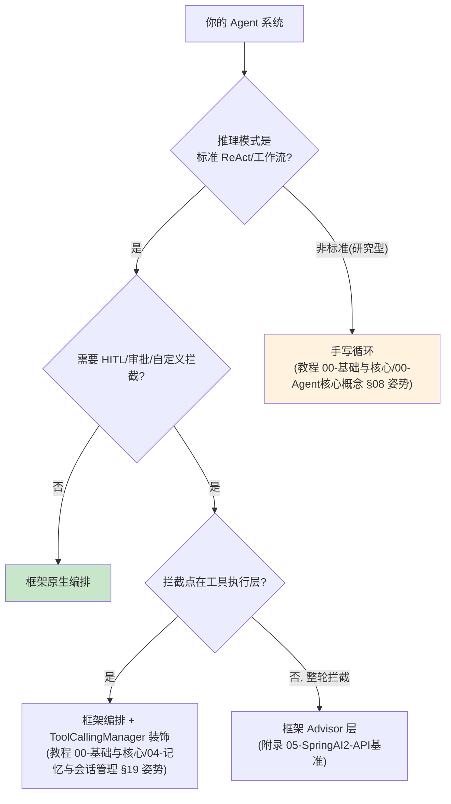
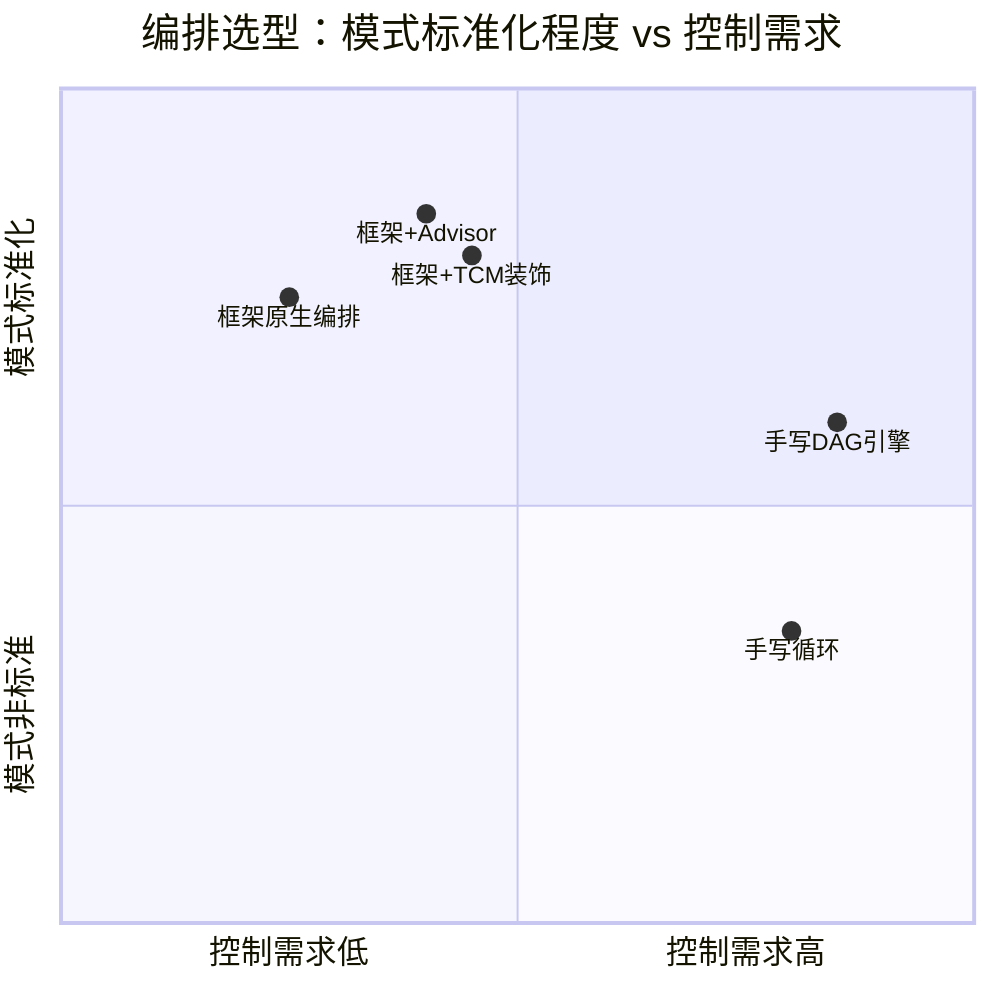
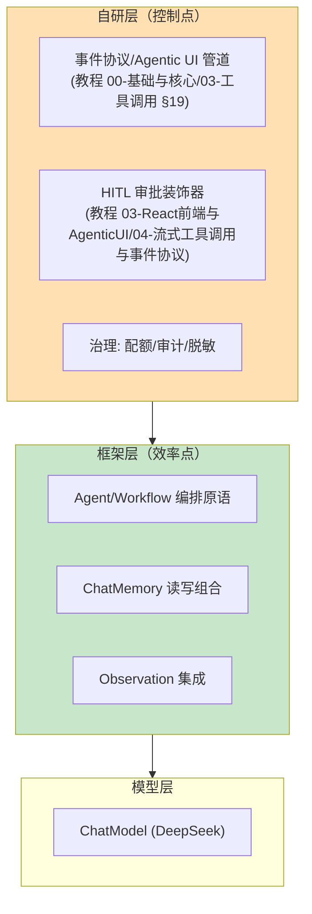

# 00 Spring AI 2.0 Agentic 架构：框架原生 Agent 编排
> **定位**：本文回答一个全体系悬而未决的问题——**什么时候该用 Spring AI 2.0 原生的 agentic/编排能力，什么时候手写**。对照手写编排（教程 00-基础与核心/00-Agent核心概念 §08/36）与框架原生抽象，给出选型决策框架。读者画像：读完编排相关章节、准备动手做架构选型的开发者。前置阅读：[教程 08-架构师进阶/02-Agent工作流编排]、[教程 03-React前端与AgenticUI/04-流式工具调用与事件协议]。
>
> **为什么现在讲**：本体系教程 00-基础与核心/00-Agent核心概念 的编排、Agent 循环、记忆、评估全部手写实现——这是学习路径的正确选择（理解原理），但生产选型时必须知道框架提供了什么、边界在哪，避免"手写一切"的惯性。

---

## 1. 问题：手写与框架的边界

本体系已手写过：ReAct 循环（教程 00-基础与核心/07-ReAct推理模式）、Plan-and-Execute（教程 00-基础与核心/08-Plan-and-Execute模式）、多 Agent 协作（教程 00-基础与核心/09-多Agent协作）、DAG 编排（教程 05-Observation可观测/03-自定义Handler：收集Agent阶段事件流）、Checkpoint 长任务（教程 05-Observation可观测/07-指标治理：Token计量、SLO与基数熔断）。手写的价值是**完全控制**；代价是**重复造轮子 + 自担边界情况**（死循环防护、预算控制、恢复语义都要自己写对）。

Spring AI 2.0 的 agentic 方向（agentic-core 等）提供的是**框架级的 Agent/Workflow 抽象**——生命周期管理、编排原语、记忆读写分离、评估钩子。选型问题不是"谁更好"，是**控制点在哪**：



## 2. 框架原生能力盘点（2.0 方向）

> 以下为 Spring AI 2.x agentic 方向的能力地图。**注意**：该方向 API 仍在演进，具体签名以引入版本文档为准——本文讲选型框架，不提供可能过时的 API 细节（这是本体系 API 真实性纪律的延续，见附录 05-SpringAI2-API基准）。

| 能力域 | 框架提供 | 本体系对应手写篇 |
|--------|---------|-----------------|
| Agent 生命周期 | Agent 抽象（创建/运行/终止/状态） | 教程 02-SpringAI核心机制/02-Agent状态管理 |
| 工作流编排 | Workflow/DAG 原语（步骤/分支/并行） | 教程 08-架构师进阶/02-Agent工作流编排 |
| 记忆读写分离 | ChatMemory reader/writer 组合形态 | 教程 00-基础与核心/00-Agent核心概念 §34 |
| 模型路由 | ChatModel 多实例 + 路由 | 教程 04-企业级架构主干/12-模型路由与降级 |
| 评估钩子 | 评估集成点 | 教程 08-架构师进阶/03-自我反思与Agent评估 |
| 可观测 | 原生 Observation（gen_ai semconv） | 教程 00-基础与核心/04-记忆与会话管理 §23 |

### 2.1 实证选型清单（引入任何编排依赖前先跑一遍）

「遇到阻塞？→ [附录 05-SpringAI2-API基准 §实证流程]」。框架选型最大的坑不是能力缺口，是**你以为它有的能力在当前版本不存在**。任何 agentic 编排依赖（含 Spring AI 各模块）引入前，逐项过这张清单：

| # | 检查项 | 方法 | 不过怎么办 |
|---|--------|------|-----------|
| 1 | 依赖坐标真实存在 | 查 BOM 与本地仓库 `jar tf` | 不存在→概念验证降级为手写 |
| 2 | 核心抽象签名与文档一致 | `javap -classpath <jar>` 反编译核对 | 签名不符→按实测签名改设计，不改代码迁就记忆 |
| 3 | 与本项目栈兼容（WebFlux/Boot 4.1） | 引入后编译+启动冒烟 | 阻塞式 API 出现在响应式链路→弃用或隔离到 boundedElastic |
| 4 | 生命周期边界可控（可终止/可恢复） | 写一个 kill -9 恢复用例 | 框架不管恢复→恢复语义必须自研（对照教程 05-Observation可观测/07-指标治理：Token计量、SLO与基数熔断） |
| 5 | Observation 埋点齐全 | 启动后查 Span 是否覆盖编排层 | 盲区→在自研装饰层补观测而非等框架 |

这张清单的产出物是**选型决策记录**（半页 ADR：上下文/备选/实测结论/取舍），归档方式见「想深入？→ [附录 07-架构决策与取舍]」。

## 3. 选型决策框架（四象限）



| 象限 | 选型 | 典型场景 |
|------|------|---------|
| 标准+低控制 | 框架原生 | 客服 Agent、标准 ReAct 问答 |
| 标准+中控制 | 框架 + TCM 装饰/Advisor | 企业级（审计/HITL/脱敏拦截） |
| 非标准+高控制 | 手写循环/引擎 | 研究型模式、特殊领域协议（项目 06 风控的分级决策） |
| 非标准+低控制 | ⚠️ 警惕——先质疑"真的非标准吗" | 多数自认为特殊的场景其实是标准 ReAct + 好的提示词 |

**第四象限的警告**是本篇最重要的实践建议：手写的冲动往往来自"我的场景特殊"，但拆解后多数是标准模式+特制 Prompt。判断方法：先写一页"模式说明书"（状态机图+每步输入输出），80% 的情况会发现它就是 ReAct 或简单 DAG。

## 3.5 最小对照骨架（手写 vs 框架，同构验证）

选型别靠争论，靠**两天内可跑完的同构对照**：同一个任务（天气问答+一次工具调用）分别用手写循环（教程 00-基础与核心/07-ReAct推理模式 姿势）与 ChatClient 声明式骨架实现，对照三件事——代码量、拦截点位置、可测试性。以下是框架侧骨架（API 均为已实证基准）：

```java
// 概念代码骨架（ChatClient/Advisor/ChatMemory 签名见附录 05 基准，Spring AI 2.0.0）
var agent = ChatClient.builder(chatModel)                    // 已实证
    .defaultSystem("你是天气助手，先查工具再回答")
    .defaultTools(new WeatherTools())                        // @Tool 方法集（教程 00-基础与核心/03-工具调用）
    .defaultAdvisors(
        MessageChatMemoryAdvisor.builder(chatMemory).build(), // 已实证 builder 形态
        auditAdvisor)                                        // 自研 CallAdvisor：治理审计
    .build();

// 手写循环里你要自己写的"轮次预算/死循环防护"，ChatClient 声明式循环
// 内部已含工具调用往返；超额防护仍需自研（框架不管预算——第 4 项清单）
```

对照结论通常落在三行表里：

| 维度 | 手写循环 | ChatClient 骨架 |
|------|---------|----------------|
| 代码量 | ~200 行（循环/解析/重试自管） | ~30 行 |
| HITL 拦截点 | 循环内任意处（最灵活） | ToolCallingManager 装饰层（教程 03-React前端与AgenticUI/04-流式工具调用与事件协议 落点） |
| 行为可预测性 | 完全自控 | 框架版本升级可能变（锁版本+对照评估） |

> 这张表本身就是选型答案：要拦截灵活性→手写；要维护成本→框架；两者兼得→框架骨架+装饰层（§4）。

## 4. 混合策略（企业级的主流形态）

真实系统很少纯手写或纯框架，主流是**分层混合**：



**原则：治理与契约自研，编排与集成用框架**——治理（审计/审批/脱敏）是企业的差异化控制点，必须握在手里；编排原语（步骤/分支）是无差异的基础设施，框架维护比你维护可靠。这与 [教程 02-SpringAI核心机制/01-MCP协议 §管控分离] 的分层思想一脉相承：控制面自建、通用执行能力采用标准化组件。

## 5. 迁移路径（从手写到框架）

已有手写系统的迁移不是重写，是**逐层替换**：

1. **先包一层**：手写编排外露的接口先稳定下来（[教程 03-React前端与AgenticUI/04-流式工具调用与事件协议] 的事件协议就是这样的稳定契约）
2. **替换内部实现**：手写 DAG 执行器 → 框架 Workflow 原语（接口不变，行为可对照测试）
3. **对照验证**：同一评估集（[教程 08-架构师进阶/03-自我反思与Agent评估]）跑迁移前后，行为等价才切流
4. **保留退出能力**：接口稳定意味着随时可退回手写——框架不是终点是选择

## 5.5 迁移决策记录模板（可复制）

迁移最大的风险不是技术，是**半年后没人记得为什么迁/为什么不迁**。每次选型与迁移用这个模板留档（放入项目 ADR，见「想深入？→ [附录 07-架构决策与取舍]」）：

```markdown
### ADR: 编排选型 <日期>
- 上下文：<业务场景+团队栈+现有实现>
- 实测结论：<§2.1 清单五项逐条结果，附 javap 输出摘要>
- 对照数据：<§3.5 骨架对照表三行>
- 决策：<手写/框架/混合>；控制点：<哪些必须自研>
- 退出条件：<什么信号出现时重评（如框架版本 X 或负载 Y）>
```

**退出条件是必填项**：没有退出条件的选型决策在 18 个月后都会变成"历史包袱"——技术栈会漂移（框架演进、业务规模变化），决策必须有重评触发器。

## 6. 适用与不适用

### 适用框架原生
- 标准 ReAct/工作流模式的业务 Agent
- 团队 Spring 技术栈成熟、追求维护成本最小化
- 编排需求随业务快速变化（框架原语跟得上）

### 不适用（手写更优）
- 模式本身是产品差异化的研究型 Agent（迁移成本 > 收益）
- 极致性能控制（每 token 的调度都要定制）
- 框架抽象与领域协议冲突（如金融风控的法定状态机，[项目 06]）
- 框架能力与需求 gap 过大且版本演进方向不确定时

## 7. 反模式

| 反模式 | 纠正 |
|--------|------|
| "框架崇拜"：能塞进框架的全塞 | 治理与契约自研（§4 原则） |
| "手写崇拜"：一切为了控制 | 80% 的"特殊"是标准模式（§3 警告） |
| 迁移=重写 | 逐层替换+对照评估（§5） |
| 按框架版本 API 写死在文档/代码 | 编排选型看能力地图，API 细节以版本为准（本文纪律） |
| 混合无边界（框架回调里塞治理） | 分层清晰：治理在自研装饰层，不进框架回调 |

## 8. 总结

| 概念 | 一句话 |
|------|--------|
| 选型四象限 | 模式标准化程度 × 控制需求 |
| 混合原则 | 治理与契约自研，编排与集成用框架 |
| 第四象限警告 | 自认为特殊的场景 80% 是标准模式 |
| 迁移路径 | 稳定接口 → 逐层替换 → 评估对照 → 保留退出 |
| 实证选型清单 | 坐标/签名/兼容/生命周期/观测五项过闸再引入 |
| 同构对照骨架 | 两天跑完手写 vs 框架，代码量/拦截点/可预测性三行定案 |
| 迁移决策记录 | 含退出条件的 ADR 模板，防 18 个月后变历史包袱 |
| 本教程体系定位 | 手写篇教你原理，本篇教你回到生产时的选型判断 |
