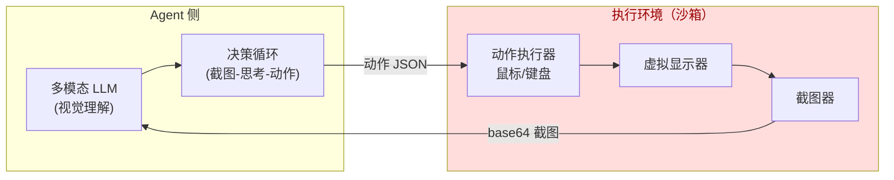
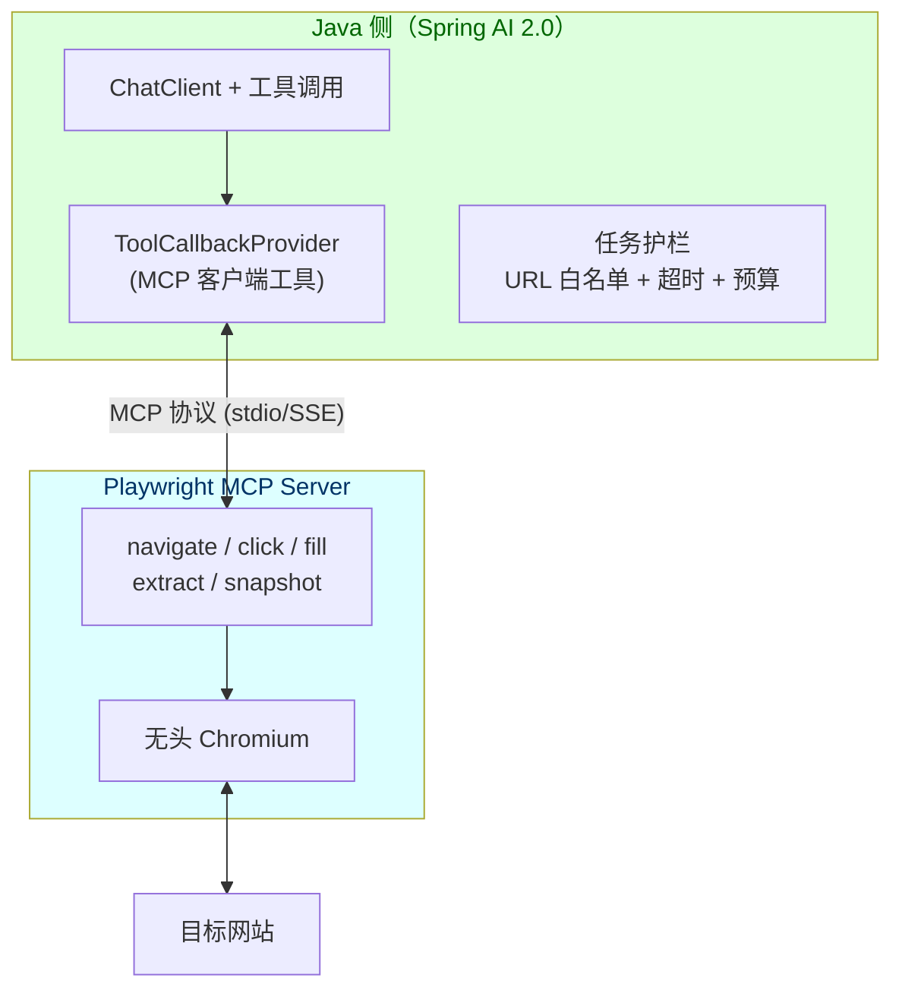

# 47-Computer Use 与浏览器 Agent

> **定位**：本文讲 Computer Use（让模型操作真实计算机：屏幕截图→视觉理解→鼠标键盘动作）与浏览器 Agent（Browser Use：操作真实浏览器完成导航、表单、抓取）两类"具身化"Agent 的工程实现。读者画像：已完成阶段 5~7 学习、掌握工具调用与 MCP 协议的进阶开发者。前置阅读：[教程 00-基础与核心/03-工具调用]、[教程 02-SpringAI核心机制/01-MCP协议]、[教程 04-企业级架构主干/11-安全与权限控制]。想深入前沿视角，看 [前沿 07-ComputerUse与AgenticBrowser]、[前沿 08-Agent技能包Skills]。

---

## 1. 为什么 2026 年这是必修课

Computer Use 不是新概念——2024 年 10 月 Anthropic 发布 Claude Computer Use 能力后，OpenAI 的 Operator、Google 的 Project Mariner 相继跟进。到 2026 年，它从"技术演示"进化为"生产系统"：

- **RPA 的替代者**：传统 RPA（UiPath/影刀）靠选择器与坐标脚本，页面一改就崩；Computer Use 靠视觉理解，天然抗 UI 变更。企业里大量"最后一公里"的流程自动化（老系统无 API、内部审批页、跨系统搬运数据）只能靠它
- **Agentic Browser 的标准化**：Playwright MCP、Browser Use 等开源方案把浏览器操作封装为标准工具，Agent 通过 MCP 调用——这正是你在 [教程 02-SpringAI核心机制/01-MCP协议] 学过的协议在"操作浏览器"场景的落地
- **架构师视角**：Computer Use 把 Agent 的攻击面从"API 调用"扩展到"整个桌面/浏览器"，安全、沙箱、审计的设计复杂度上一个数量级（呼应 [教程 04-企业级架构主干/11-安全与权限控制]）

**一句话**：工具调用让 Agent 能"说话"，Computer Use 让 Agent 能"动手"。动手能力是 2026 年 Agent 商业化的最大增量。

## 2. 两类范式：截图循环 vs 结构化浏览器操作

### 2.1 Computer Use（通用但昂贵）

模型收到屏幕截图 → 输出结构化动作（点击坐标、输入文本、按键、滚动）→ 执行环境执行动作 → 再截图 → 循环。这是**视觉-动作闭环**：



红色区是**必须隔离的沙箱**——模型输出直接驱动鼠标键盘，等于把"手"交给了概率模型。

### 2.2 浏览器 Agent（结构化、可审计、首选）

不截图，而是把浏览器能力封装为**语义化工具**：`navigate(url)`、`click(selector)`、`fill(selector, text)`、`extract(structure)`、`screenshot()`（可选）。底层是 Playwright/Puppeteer 的 CDP 协议。对比：

| 维度 | Computer Use（截图循环） | 浏览器 Agent（结构化工具） |
|------|--------------------------|---------------------------|
| 输入成本 | 每步一张截图，多模态 Token 消耗大 | DOM/文本摘要，成本低 5~20 倍 |
| 可靠性 | 坐标点击，视觉歧义 | 选择器/语义定位，确定性高 |
| 可审计性 | 只有截图录像 | 完整动作日志（谁在何时点了什么） |
| 适用场景 | 桌面原生应用、无 API 老系统 | Web 流程：表单、抓取、测试、审批 |
| 安全边界 | 极难（全桌面权限） | 可控（可拦截 URL/下载/弹窗） |

**选型结论**：能用浏览器 Agent 就不用 Computer Use；只有目标系统不是 Web 时才上截图循环。这也是本教程代码主线选浏览器 Agent 的原因。

## 3. 工程实现：Spring AI 2.0 + Playwright MCP

### 3.1 架构总览

生产级浏览器 Agent 的标准架构是「Java 编排层 + Playwright MCP Server（无头浏览器）」：



「遇到阻塞？→ [教程 02-SpringAI核心机制/01-MCP协议 §客户端集成]」

### 3.2 接入 Playwright MCP（真实坐标）

MCP 客户端依赖（需在 pom.xml 中添加依赖）：

```xml
<!-- 需在 pom.xml 中添加依赖 -->
<dependency>
    <groupId>org.springframework.ai</groupId>
    <artifactId>spring-ai-starter-mcp-client</artifactId>
    <version>2.0.0</version><!-- Spring AI 2.0.0 -->
</dependency>
```

> 注：MCP 客户端 starter 为 `spring-ai-starter-mcp-client`（无 `-webflux` 变体）；stdio 传输内置在 starter 中。若走 WebFlux HTTP 传输（streamable-http），另加 `org.springframework.ai:mcp-spring-webflux`。坐标见 [附录 05-SpringAI2-API基准/01-MCP真实API与坐标]。

配置（`application.yml`）：

```yaml
spring:
  ai:
    mcp:
      client:
        enabled: true
        stdio:
          connections:
            playwright:
              command: npx
              args: ["@playwright/mcp@latest", "--headless"]
```

`@Tool` 包一层业务语义与护栏（MCP 工具本身由 `ToolCallbackProvider` 自动从 MCP Server 同步）：

```java
// Spring AI 2.0.0
import org.springframework.ai.tool.annotation.Tool;
import org.springframework.ai.tool.annotation.ToolParam;
import org.springframework.stereotype.Service;

@Service
public class BrowserTaskService {

    private final BrowserGuard guard; // 自研护栏：URL 白名单/预算/超时

    public BrowserTaskService(BrowserGuard guard) { this.guard = guard; }

    @Tool(description = "打开指定网页，仅允许访问白名单域名，超预算即拒绝")
    public String openPage(
            @ToolParam(description = "完整 URL") String url) {
        guard.assertUrlAllowed(url);        // 白名单校验，拒绝即抛异常给模型
        guard.chargeNavigationBudget(url);  // 导航预算（防无限浏览）
        // 实际导航由 MCP 客户端同步的 playwright_navigate 工具完成
        // 此处为编排层示意：真实实现经 ToolCallingManager 链式调用
        return "navigated: " + url;
    }
}
```

> ⚠️ 概念代码：`BrowserGuard` 为自研组件（见 §4），MCP 工具的真实暴露方式见 [附录 05-SpringAI2-API基准/01-MCP真实API与坐标]。

### 3.3 流式反馈循环

长任务（如"在 10 个页面提取数据"）必须流式推送每步动作，让用户看到 Agent 在干什么（呼应 [教程 02-SpringAI核心机制/00-SSE流式通信]、[教程 03-React前端与AgenticUI/04-流式工具调用与事件协议]）：

```java
// Spring AI 2.0.0
import org.springframework.ai.chat.client.ChatClient;
import org.springframework.http.MediaType;
import org.springframework.web.bind.annotation.*;
import reactor.core.publisher.Flux;

@RestController
@RequestMapping("/api/browser-agent")
public class BrowserAgentController {

    private final ChatClient chatClient;

    public BrowserAgentController(ChatClient.Builder builder) {
        this.chatClient = builder
                .defaultSystem("""
                    你是浏览器操作 Agent。每次只执行一个动作，
                    动作后观察结果再决定下一步。
                    遇到验证码/登录/支付页面必须停止并请求人工介入。
                    """)
                .build();
    }

    @PostMapping(value = "/run", produces = MediaType.TEXT_EVENT_STREAM_VALUE)
    public Flux<String> run(@RequestBody TaskRequest req) {
        return chatClient.prompt()
                .user(req.task())
                .stream()                    // 流式：每个工具调用事件都推给前端
                .content();
    }

    public record TaskRequest(String task) {}
}
```

「遇到阻塞？→ [教程 03-React前端与AgenticUI/02-React与SSE流式UI §事件流渲染]」

## 4. 生产级四道闸门

Demo 与生产的差距全在治理。浏览器 Agent 上生产必须过四道闸门（每道都对应你学过的企业级能力）：

| 闸门 | 内容 | 对应教程 |
|------|------|----------|
| **护栏** | URL 白名单/黑名单、下载拦截、表单提交确认（写操作需 HITL） | [教程 04-企业级架构主干/08-Human-in-the-Loop与审批流] |
| **沙箱** | 无头浏览器跑在独立容器，禁止访问内网元数据地址（169.254.169.254） | [教程 04-企业级架构主干/11-安全与权限控制]、[附录 06-企业级架构模式/01-Agent沙箱与隔离机制] |
| **审计** | 每个动作记录：时间戳、URL、选择器、截图哈希、触发的 Prompt | [教程 04-企业级架构主干/03-工具执行可观测与审计] |
| **预算** | 最大步数、最长时长、Token 上限、单任务导航次数 | [教程 04-企业级架构主干/07-成本治理与Token计量] |

间接 Prompt 注入是浏览器 Agent 的头号威胁：恶意网页内容（隐藏文字、假按钮）会诱导 Agent 执行危险动作——这属于间接注入攻击，防御纵深见 [附录 08-Agent安全深度/00-Prompt注入分类与案例]。核心原则：**网页内容永远是不可信输入，写操作必须经过独立校验层，不能只信模型的判断**。

## 5. 适用场景与不适用场景

### 适用场景

- 无 API 的存量系统流程自动化（老 ERP、内部审批页、政务网站申报）
- 跨系统数据搬运（A 系统导出→清洗→B 系统录入）
- 竞品价格监控、舆情巡检等**读多写少**的采集任务
- Web UI 自动化测试（用自然语言写 E2E 用例）
- 表单批量填报（结合 HITL 确认每次提交）

### 不适用场景

- 有官方 API 的系统（API 永远优先：更快、更稳、更便宜、更可审计）
- 高频定时任务（截图循环成本高，选结构化抓取或 RSS/API）
- 强合规交易场景（支付、转账不应交给视觉模型操作）
- 实时性要求高的场景（视觉循环延迟以秒计）
- 目标站点明确禁止自动化的场景（法律与 ToS 风险，需法务评估）

## 6. 小结

Computer Use 与浏览器 Agent 是 Agent 从"能说"到"能做"的关键一跃。工程主线：**优先结构化浏览器工具（Playwright MCP + Spring AI 工具调用），仅在非 Web 场景用截图循环**；生产四闸门（护栏/沙箱/审计/预算）缺一不可，其中间接注入防御是安全设计的重心。下一步可深入 [前沿 07-ComputerUse与AgenticBrowser]（协议与生态全景）与 [前沿 08-Agent技能包Skills]（把浏览器技能打包成可复用资产），再用 [附录 14-开源代码深度分析/12-Java工程师借鉴手册] 的视角审视开源实现。
