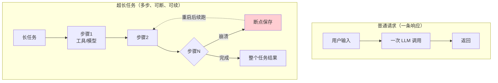
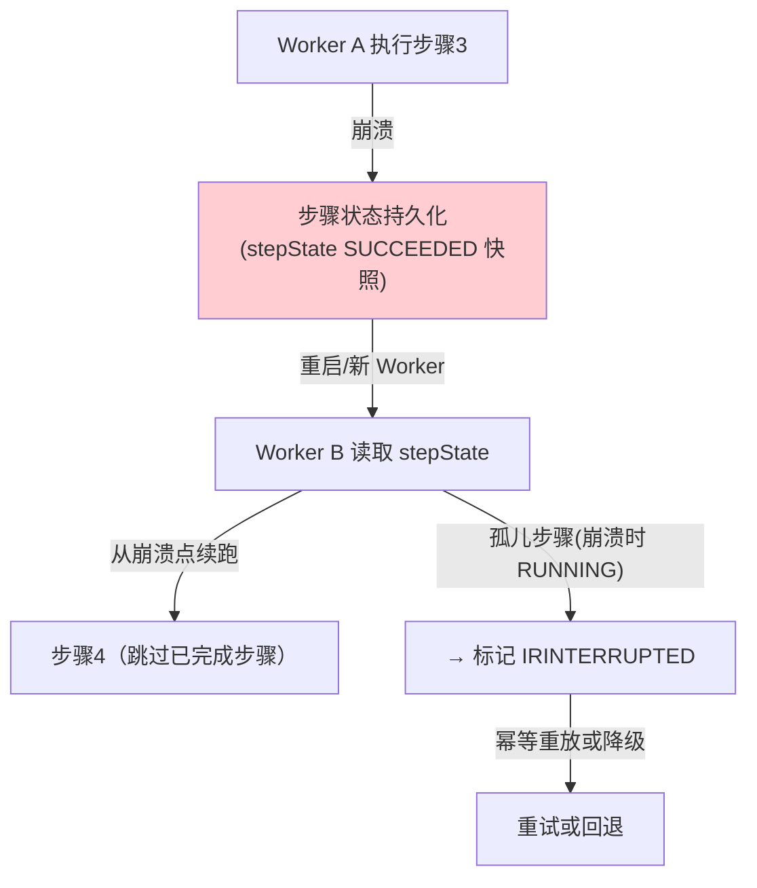

# 94-超长任务与分布式工作流引擎

> **定位**：讲透 Agent 执行**超长任务**（小时级、跨进程、可中断）时的可靠性银弹——**分布式工作流引擎（Durable Workflow）**。在 [83-长任务持久化与中断恢复](../08-架构师进阶/06-长任务持久化与中断恢复.md) 讲的是"单机 Checkpoint 断点续跑"，本文升级为**多 Worker / 可重启 / 幂等 / 预算控制 / 死循环防护的企业级工作流引擎**。读完这篇，你能把"订单级 / 数据作业级"的长任务做成**崩溃可恢复、永不烧钱跑飞、可审计回放**。读者画像：管理者问题"怎么让一个跑几小时的 Agent 任务不怕崩溃、不怕重试爆炸"的架构师。
>
> **前置阅读**：[83-长任务持久化与中断恢复](../08-架构师进阶/06-长任务持久化与中断恢复.md)、[79-Agent工作流编排](../08-架构师进阶/02-Agent工作流编排.md)、[08-Plan-and-Execute](../00-基础与核心/08-Plan-and-Execute模式.md)、[63-容错与弹性设计](../04-企业级架构主干/10-容错与弹性设计.md)。想深入重构原理 → [附录 03-Spring-AI源码解析](../../附录/03-Spring-AI源码解析/00-ChatClient源码.md)。

---

## 1. 超长任务为什么难

普通请求是**毫秒到秒级**、一次调用一个响应；超长任务是**小时级**、可能跨多次模型调用、多次工具执行、多个子任务。它的难点集中在一张表里：

| 难点 | 普通请求 | 超长任务 |
|------|---------|---------|
| **时长** | 毫秒~秒 | 分钟~小时 |
| **进程生命周期** | 单次请求进程内 | 跨进程重启 / 扩容 / OOM |
| **失败代价** | 重试一次即可 | 重试可能放大副作用（如重复扣款/重复发消息） |
| **可观测** | 一条 trace | 需**全生命周期回放** |
| **预算** | 单次固定 | 需**全程 Token/时长/轮次**上限 |



**核心结论**：超长任务的本质不是"把单步调用写成循环"，而是**把整个任务的中间状态变成了可持久化、可重放、可恢复的"执行轨迹"**——这就是工作流引擎要做的事（呼应 [22-企业级Agent会话引擎](../../项目/22-企业级Agent会话引擎/00-需求分析与架构设计.md) 的 JSONL 恢复思想）。

## 2. 从 Checkpoint 到工作流引擎

### 2.1 教程40 已给的单机范式

教程40 的 `CheckpointStore.save/load`（`AgentCheckpoint` 持久化中间状态）是 **单 Worker** 的断点续跑——同一个 JVM 重启后可恢复。

```java
// 复习教程40的范式（概念代码）：单机断点续跑
public class CheckpointStore {
    public void save(AgentCheckpoint cp) { /* Redis/DB 持久化 */ }
    public Optional<AgentCheckpoint> load(String taskId) { /* 读取 */ }
}
```

### 2.2 升级到分布式工作流引擎缺什么

单机范式到企业级多 Worker，缺四个能力：

| 能力 | 单机 Checkpoint | 分布式工作流引擎 |
|------|----------------|------------------|
| **DAG 化** | 单步续跑 | 步骤依赖图（哪个步骤完成后才跑下一步） |
| **多 Worker** | 单 JVM | 多个 Worker 抢任务，任务可迁移 |
| **幂等** | 不保证 | 工具副作用可重放（同 input 只执行一次副作用） |
| **预算/死循环** | 单步 | 全程轮次/Token/时长上限 + 死循环检测 |

## 3. 自研工作流引擎的核心设计

> **铁律 0 说明**：Spring AI 生态**无官方分布式工作流 API**；Temporal 等是知名方案但**需引入依赖后实证**（本机未下载，故不写成已实证 API，仅作业界对照）。本文给出**自研 '概念代码' 引擎**——它的核心是"持久化执行 + 幂等重试 + 预算控制"，这是任何 Durable Workflow 的共核。

### 3.1 任务模型：DAG + 步骤状态

```java
// 概念代码：工作流任务 = 有向无环图 + 每步持久化状态
public record WorkflowRun(
        String runId,                // 幂等键：全局唯一
        DAG<StepSpec> steps,         // 步骤依赖图
        Map<String, StepState> stepState,  // 每步当前状态（持久化）
        AtomicInteger budgetTokens,  // 全程 Token 预算（1）
        AtomicInteger maxRounds,     // 最大轮次（防死循环，2）
        RunStatus status) {}         // RUNNING/COMPLETED/DEGRADED

public enum StepState { PENDING, RUNNING, SUCCEEDED, FAILED, DEGRADED }
```

关键：**每步状态持久化**（存 Redis/JSONB，对应教程40 CheckpointStore），这样任何一步崩溃后，重启的 Worker 能根据已持久化的 stepState 决定从哪继续——**而不是重头再跑**。

### 3.2 幂等重试：副作用只执行一次（最难也最关键）

长任务里"重复扣款 / 重复发消息 / 重复写库"是灾难。解法是**命令幂等**：每个工具执行带**全局唯一 idempotency key**，副作用先登记"已执行"再执行，重试时查登记跳过副作用。

```java
// 概念代码：工具调用幂等（副作用只一次）
public <T> Mono<T> idempotentCall(String opKey, Supplier<Mono<T>> sideEffectOp) {
    return effectLedger.hasIdempotency(opKey)      // 1) 查"是否已执行过副作用"
        .flatMap(done -> done
            ? ledger.readResult(opKey).map(res -> res.<T>cast())  // 已执行→直接回放结果
            : ledger.markStarted(opKey)                          // 2) 先登记，防并发重放
                .then(Mono.defer(sideEffectOp))
                .flatMap(res -> ledger.markDone(opKey, res)));   // 3) 完成后记结果
}
```

**要点**：登记"已开始"→执行→登记"完成"的三段式，配合唯一键，保证**重试时不会重复触发副作用**。副作用登记本身也要幂等（applied 是原子 upsert）。

### 3.3 预算控制与死循环防护

长任务的"烧钱跑飞"是最大经济风险（呼应 [60-成本治理与Token计量](../04-企业级架构主干/07-成本治理与Token计量.md)、[81-Agent性能优化](../08-架构师进阶/04-Agent性能优化.md)）。

```java
// 概念代码：三层预算闸门（轮次/Token/时长）
public boolean consumeBudget(RunContext ctx) {
    boolean roundOk  = ctx.rounds.incrementAndGet() <= ctx.maxRounds;     // ①最大轮次
    boolean tokenOk  = ctx.usedTokens.get() <= ctx.budgetTokens;          // ②全程 Token
    boolean timeOk   = ctx.startTs.plus(ctx.maxDuration).isAfter(now());  // ③最大时长
    return roundOk && tokenOk && timeOk;
}
// 死循环检测补充：同状态重复次数超过阈值 → 判定退化（DEGRADED），转而人工/HITL
```

死循环防护不只是"最大轮次"——还要检测**循环不进展**（每轮产出与上轮相同，如 ReAct 反复调用同一工具拿同一结果），超阈值判定 DEGRADED 转人（呼应 [28-Human-in-the-Loop](../04-企业级架构主干/08-Human-in-the-Loop与审批流.md)）。

### 3.4 断点续跑 / 重放 / 崩溃闭合



**崩溃闭合**：进程崩溃瞬间总有一个"孤儿步骤"停在 RUNNING。恢复时必须**先闭合**它：要么用幂等键重放（如果已登记则拿结果），要么标记 interrupted 降级——**绝不允许直接重跑且重新触发副作用**（呼应 [22-会话引擎收尾](../../项目/22-企业级Agent会话引擎/00-需求分析与架构设计.md) 的孤儿 turn 合成）。

## 4. 业界对照（校准定位）

| 方案 | 性质 | 与本方向关系 |
|------|------|------------|
| **Temporal** | 分布式工作流引擎（基础设施） | 业界成熟方案；需引入依赖后 javap 实证（本文不写成已实证 |
| **Spring Statemachine** | 状态机编排 | 偏单机状态迁移，非长任务 Durable |
| **自研引擎（本文）** | CheckpointStore + 幂等 + 预算 + DAG | 少依赖、可控、可观测；适合企业内部长任务平台 |

**选型判断**：若已上 K8s 且有现成 Temporal 运维能力，用 Temporal；否则自研 Checkpoint + 幂等引擎更轻。本方向按"自研"展开（呼应教程40范式）。

## 5. 适用场景与不适用场景

### 适用场景 ✅
- 小时级、跨多次模型/工具的**数据作业/订单流程**（批量清洗、长链审批、多源数据拉取）。
- 崩溃必须可恢复、重试不得放大副作用（支付/发消息/写库）。
- 需要全程 Token/轮次/时长预算控制 + 死循环防护的"烧钱任务"。

### 不适用场景 ❌
- 秒级、一次性、无副作用担忧的简单问答（引擎是过度设计，用普通 ChatClient 即可）。
- 纯无状态、可整体重试的处理（不需要 Checkpoint，重跑即可）。
- 需要与外部现有工作流系统（如竞品引擎）深度对接的——先评估是否直接复用而非自研。

---

## 总结

超长任务的可靠性银弹，是把"任务的中间状态"变成**可持久化、可重放、可恢复的执行轨迹**。本章建立四根支柱：

1. **从 Checkpoint（教程40）到工作流引擎**：补上 DAG 化、多 Worker、幂等、预算控制四个企业级能力。
2. **幂等是命门**：副作用"登记→执行→记结果"用唯一键，重试绝不重复触发副作用。
3. **三层预算 + 死循环检测**：轮次/Token/时长上限 + "循环不进展"检测，防烧钱跑飞。
4. **断点续跑 + 崩溃闭合**：孤儿步骤要么幂等重放、要么降级人工，绝不裸重跑。

> **实操建议**：先用单个长任务 + Redis CheckpointStore 跑通（教程40续），再逐步加幂等登记、预算闸门、DAG——别一上来就上完整引擎。落地完整企业平台 → [项目24-企业级长任务工作流引擎](../../项目/24-企业级长任务工作流引擎/00-需求分析与架构设计.md)。
