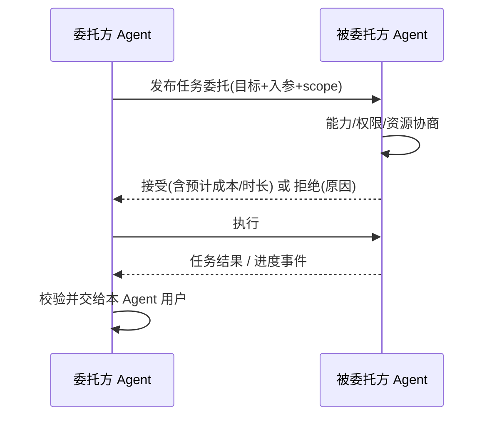
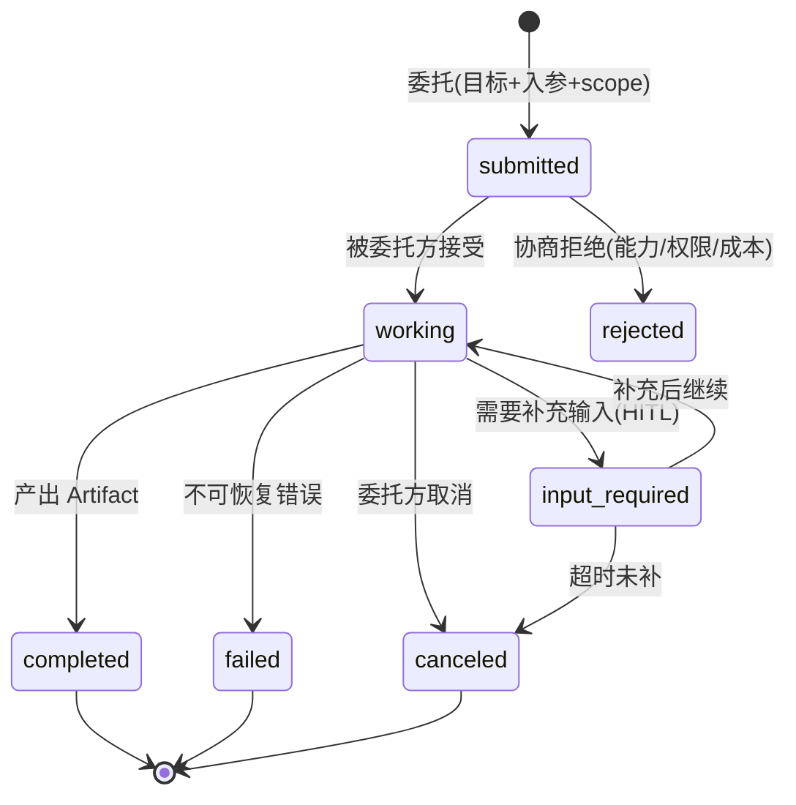

# 08 Agent 间协作协议工程化
> **定位**：讲透 Agent 与 Agent 之间**协作的工程化**——把 [00-基础与核心/09-多Agent协作](../00-基础与核心/09-多Agent协作.md)（编排）升级为**跨团队/跨组织异构 Agent 的互操作协议**（A2A 思路）。涵盖：**AgentCard 注册与能力发现、任务委托与协商、协作安全（身份/授权/注入边界）、失败与补偿**。读完这篇，你能把"Agent 之间怎么可信、可控地协作"做成系统。读者画像：要回答"不同团队/厂商的 Agent 怎么安全协作、不失控"的架构师。
>
> **前置阅读**：[09-多Agent协作](../00-基础与核心/09-多Agent协作.md)、[04-企业级架构主干/11-安全与权限控制](../04-企业级架构主干/11-安全与权限控制.md)、[02-SpringAI核心机制/07-MCP协议](../02-SpringAI核心机制/07-MCP协议.md)、[前沿 00-A2A协议](../../前沿/00-A2A协议.md)。

---

## 1. 为什么需要 Agent 间协作协议

### 1.1 从"编排"到"互操作"

单 Agent 内部的 Agent 编排（[00-基础与核心/09-多Agent协作](../00-基础与核心/09-多Agent协作.md)）是"主人调度仆从"；**Agent 间协作协议**解决的是**对等/跨信任域**的互操作——不同团队、不同厂商构建的 Agent 要"能对话、能安全地把活委托出去"。

| 维度 | 多 Agent 编排（09） | Agent 间协作协议（本文） |
|------|--------------------|--------------------------|
| 信任域 | 同应用内 | 跨团队/跨组织 |
| 能力发现 | 内部注册表 | AgentCard 协商 |
| 委托 | 内部调用 | 任务委托 + 凭证 |
| 安全 | RBAC | 身份互信 + 最小授权 |
| 失败 | 同进程编排 | 协商失败/超时/补偿 |

**核心**：A2A 这类协议（Google 2025，Apache 2.0）解决"纵向 MCP（Agent↔工具）之外的横向 Agent↔Agent"（呼应 [前沿 00-A2A协议](../../前沿/00-A2A协议.md)）。

> **与 [前沿 14-Chain-of-Agents与协作协议实证](../../前沿/14-Chain-of-Agents与协作协议实证.md) 的分工**：本篇讲**互操作协议工程**（Agent 之间怎么可信地发现、委托、安全协作）；前沿 14 讲**协作模式的实证增益**（串行摘要链/树状聚合在什么任务上值得多 Agent 化）。先读前沿 14 判断"要不要协作"，再用本篇解决"怎么协作"。

## 2. 能力发现：AgentCard

每个 Agent 发布一张**机器可读的 AgentCard**（能力、输入输出 schema、身份、认证要求、约束），客户端据此协商能否协作——**不是硬编码对方长什么样**。

```json
{
  "name": "finance-report-agent",
  "description": "生成财务经营报表",
  "capabilities": ["report.generate", "data.read"],
  "inputSchemas": [{ "name": "period", "type": "string", "required": true }],
  "auth": { "type": "bearer", "audience": "finance.biz" },
  "constraints": { "maxTokensPerRun": 20000, "requiresApproval": true }
}
```

**要点**：AgentCard 是协作的**契约**——发现（registry）、协商（能力匹配）、鉴权（auth）、约束（限流/审批）都基于它。（自研适配层/概念代码：AgentCard 结构为开放协议，标注"无官方 SDK 的自研适配"。）

## 3. 任务委托与协商

能力匹配后，委托方把一个"任务"（含目标、入参、期望、回传方式）委托给被委托方：



**协商**：接受前双方对齐"能做什么、花多少成本、何时交"——这是协作协议的"合同"环节，避免委托后才知道做不了/太贵（呼应 [04-企业级架构主干/07-成本治理与Token计量](../04-企业级架构主干/07-成本治理与Token计量.md)）。

### 3.1 任务生命周期状态机

A2A 的"任务"不是一次 RPC，而是一个**有生命周期的实体**——委托方凭 task id 轮询/订阅状态，这是"异步长任务"协议化的核心（前沿篇 [00-A2A协议](../../前沿/00-A2A协议.md) 给了概念；本节给工程视角的状态机与 Java 侧落点）：



工程要点：① `input_required` 状态是 A2A 区别于普通 RPC 的关键——跨组织委托里被委托方也能发起 HITL（呼应 [04-企业级架构主干/08-Human-in-the-Loop与审批流](../04-企业级架构主干/08-Human-in-the-Loop与审批流.md)）② 状态迁移必须幂等可重放（重复收到同一事件的 completed 不产生副作用）③ canceled 要保证**被委托方安全收尾**后才算终态（见 §5 失败与补偿）。

### 3.2 传输与消息结构（协议栈技术层）

A2A 的协议栈：**JSON-RPC 2.0 over HTTP(S)**（请求/响应）+ **SSE**（流式更新与任务事件推送）——与本项目 WebFlux SSE 技术栈天然对齐（呼应 [教程 02-SpringAI核心机制/06-SSE流式通信](../02-SpringAI核心机制/06-SSE流式通信.md)）。消息侧三类实体：

| 实体 | 角色 | Java 侧对应 |
|------|------|------------|
| Message | 一次交互的输入/输出（role + parts） | 自研 DTO（record）|
| Part | 消息载荷：TextPart / FilePart / DataPart（结构化 JSON） | sealed interface + record |
| Artifact | 任务产出物（任务完成后可回查，独立于消息流） | 持久化对象 + URI |

```java
// 概念代码：A2A 消息三实体的 Java 建模（协议无官方 Java SDK，自研适配层）
public sealed interface Part permits TextPart, FilePart, DataPart {}
public record TextPart(String text) implements Part {}
public record FilePart(String mimeType, URI uri) implements Part {}
public record DataPart(Map<String, Object> data) implements Part {}   // 结构化载荷
public record AgentMessage(String role, List<Part> parts) {}
public record Artifact(String artifactId, String name, List<Part> parts) {}
```

**要点**：① Artifact 与 Message 分离——产物要可回查可审计，不混在一次性消息里（呼应 [04-企业级架构主干/05-历史记录持久化与合规](../04-企业级架构主干/05-历史记录持久化与合规.md)）② SSE 事件即状态机的迁移事件（state + timestamp + taskId），客户端断线重连按 taskId 补拉（呼应 [04-企业级架构主干/04-多页面流式响应与会话管理](../04-企业级架构主干/04-多页面流式响应与会话管理.md)）。

## 4. 协作安全（最关键的工程化）

普通 MCP 是"工具调用"，A2A 是"把一整件事委托出去"——**风险面更大**，必须三层安全：

### 4.1 身份互信（谁在请求）

跨组织协作不能用内部 Session，要用**可验证的身份**（如 SPIFFE/SVID 或 OIDC/JWT）——被委托方能验证"来者是谁、属于哪"（呼应 [11-安全与权限控制](../04-企业级架构主干/11-安全与权限控制.md)、[08-供应链安全网关](../../项目/08-Agent供应链安全网关/00-需求分析与架构设计.md)）。

### 4.2 最小授权（能给多少）

**委托不放大**：跨组织请求的权限 ⊆ 原始授权 + 显式 scope。即使用户授权给委托方，委托方也不能把它未获授权的能力转委托出去（呼应 [项目16网格的"委托不放大"](../../项目/16-企业级Agent服务网格/10-A2A互操作与策略市场.md)）。

```java
// 概念代码：委托权限校验（不放大）
Set<String> effPerms(PermissionToken userToken, AgentCard target) {
    Set<String> granted = userToken.permissions();                   // 原始授权
    Set<String> allowed = target.capabilities().stream()
        .filter(granted::contains)                                    // 只能委托"你有且对方提供的"
        .collect(Collectors.toSet());
    return allowed;   // 缺省：不放大
}
```

### 4.3 注入边界（协作不等于无边界）

对方返回的内容**不自动当指令**——把"跨信任域返回"当**数据**而非**代码/系统提示**（防对方 Prompt 注入反向攻击，呼应 [11-安全与权限控制](../04-企业级架构主干/11-安全与权限控制.md)、[附录08-Agent安全深度](../../附录/08-Agent安全深度/00-Prompt注入分类与案例.md)）。

## 5. 失败与补偿

协作必然跨网络/跨系统，失败要可补偿：

| 失败 | 处理 |
|------|------|
| 协商拒绝 | 委托方降级（换 Agent / 换模式 / 人工） |
| 执行超时 | 超时后查询任务状态（协议应支持"异步长任务"） |
| 结果校验失败 | 拒绝结果 + 审计，不静默采用 |
| 委托方取消 | 被委托方安全收尾（呼应 [24-长任务工作流引擎](../../项目/24-企业级长任务工作流引擎/10-预算可视化与HITL暂停恢复.md)） |

**要点**：协作协议要支持**异步、可查询、可取消**的任务语义（长任务委托），而非同步 RPC（呼应 [08-架构师进阶/06-长任务持久化与中断恢复](../08-架构师进阶/06-长任务持久化与中断恢复.md)）。

## 6. 适用场景与不适用场景

### 适用场景 ✅
- 跨团队/跨组织异构 Agent 协作，需**能力协商 + 身份互信 + 最小授权**。
- 需要 Agent 可发现（注册表 + AgentCard）、可委托长任务、可审计协作的生态。

### 不适用场景 ❌
- 同一应用内多 Agent 编排（[00-基础与核心/09-多Agent协作](../00-基础与核心/09-多Agent协作.md) 即可，无需协议开销）。
- 固定、可信、同信任域的协作——用内部 RPC 更简单安全。
- 协作方完全不可信/无身份体系——先建身份基座，再谈互操作。

---

## 总结

Agent 间协作协议工程化，是把"Agent 能对话"从**概念**变成**可信可控的互操作**。本章建立五根支柱：

1. **能力发现**：AgentCard 协商（能力/身份/约束的机器契约），不硬编码对方。
2. **任务委托**：委托-协商-执行-结果，支持异步长任务与取消。
3. **协作安全三层**：身份互信 + 最小授权（委托不放大）+ 注入边界（跨域返回当数据不当指令）。
4. **失败补偿**：协商拒绝/超时/结果校验失败/取消，可降级可审计。
5. **铁律**：A2A 为开放协议（无官方 Java SDK），适配层标概念代码；基座用已验证的 MCP 2.0 SDK + WebFlux + 自研协议层。

> **实操建议**：先做"AgentCard 注册 + 能力发现 + 最小授权委托"，跑通同组织两 Agent 协作；再扩身份互信与跨组织。落地完整企业平台 → [项目27-企业级Agent协作平台](../../项目/27-企业级Agent协作平台/00-需求分析与架构设计.md)。
