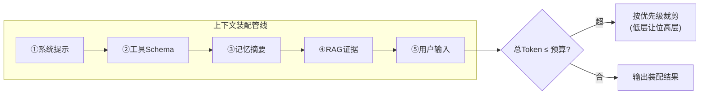

# 11 上下文工程生产化
> **定位**：把 [77-上下文工程](../08-架构师进阶/00-上下文工程.md) 的原理做成**生产化系统**——统一上下文管理服务。涵盖：**五层拼接管线（系统提示→工具Schema→记忆摘要→RAG→用户输入）、压缩策略、Token 预算分配与优先级、缓存利用（KV/Prompt/语义）、动态裁剪**。读完这篇，你能把"每处自己拼上下文"的散乱，收敛为**预算受控、层可编排、缓存利用**的上下文服务。读者画像：要回答"上下文怎么统一管理、怎么省钱提速"的架构师。
>
> **前置阅读**：[77-上下文工程](../08-架构师进阶/00-上下文工程.md)、[60-成本治理与Token计量](../04-企业级架构主干/07-成本治理与Token计量.md)、[81-Agent性能优化](../08-架构师进阶/04-Agent性能优化.md)。想深入缓存 → [附录 09-语义缓存与性能](../../附录/09-语义缓存与性能/00-语义缓存实现.md)；记忆层 → [教程 09-前沿专题/06-工业级记忆架构](06-工业级记忆架构.md)。

---

## 1. 从"到处拼 Prompt"到"上下文服务"

散乱拼接的问题：每处各自截断（关键信息被截没）、预算无人管（超窗报错）、缓存无法利用（前缀一变 KV Cache 全失效）。生产化 = **一个管线、一份预算、一套优先级**。

## 2. 五层拼接管线



```java
// 概念代码：五层管线 + 优先级裁剪
public record ContextLayer(int priority, int tokenEstimate, Supplier<String> content) {}

public AssembledContext assemble(List<ContextLayer> layers, int budget) {
    int total = layers.stream().mapToInt(ContextLayer::tokenEstimate).sum();
    if (total > budget) {                       // 超预算：按优先级从低到高裁
        layers = trimByPriority(layers, total - budget);   // ④RAG可减topK/③记忆可压缩/②工具可瘦身
    }   // ①系统提示与⑤用户输入永不裁(底线)
    return AssembledContext.of(render(layers));
}
```

**优先级铁律**：**系统提示与用户输入永不裁**——宁可少检索（RAG 减 topK），不可丢指令（呼应 [34](../08-架构师进阶/00-上下文工程.md) 的注意力衰减）。

## 3. 压缩策略（分层压缩）

| 层 | 压缩手段 | 成本 |
|----|---------|------|
| 记忆 | 摘要化（旧对话滚动摘要，[25-压缩](../../项目/25-企业级Agent记忆中枢/02-工作记忆与会话窗口管理.md)） | 低（本地） |
| 工具 Schema | 描述瘦身/按需注入（只挂本次相关工具，[23-路由](../../项目/23-企业级Agent意图路由网关/03-路由表与执行链注册.md) 联动） | 低 |
| RAG | topK 缩减/片段再截断 | 低 |
| 对话历史 | 三路径：滑动窗口/摘要/混合（旧摘要+新原文） | 中（LLM 摘要） |

**纪律**：**压缩可逆信息优先丢弃**（可重检索），**不可逆信息保底**（用户明确指令）。

## 4. Token 预算分配

预算不是"总包干"而是**分层配额**（呼应 [52-§7](06-工业级记忆架构.md)）：系统提示固定 → 工具 Schema 按需 → 记忆+RAG 竞争剩余 → 用户输入保底。配额可按场景调（客服重记忆、分析重 RAG）。

## 5. 缓存利用（省钱的另一半）

| 缓存 | 原理 | 工程要点 |
|------|------|---------|
| **KV/Prompt Cache** | 前缀不变可复用计算 | **稳定内容放前缀**（系统提示/工具Schema 在最前，用户输入最后）——管线层序即缓存友好序 |
| **语义缓存** | 相似问题直接复用答案 | 命中判定阈值 + 高风险场景禁用（[附录 10](../../附录/09-语义缓存与性能/00-语义缓存实现.md)） |
| **检索缓存** | 相同 query 检索结果复用 | 知识更新时失效（[25-缓存](../../项目/25-企业级Agent记忆中枢/10-记忆审计与缓存提速.md)） |

**关键洞察**：**层序设计 = 缓存设计**——五层管线把稳定层放前、易变层放后，天然最大化 KV Cache 命中（呼应 [34](../08-架构师进阶/00-上下文工程.md)）。

## 6. 动态裁剪（Length-Aware）

长输入（超预算的文档/历史）的渐进处理：先窗口 → 再摘要 → 必要时分段处理（map-reduce 式）。裁剪决策要**可观测**（本次裁了什么、剩多少——供 [30-解释](10-Agent可解释与透明工程.md) 与成本审计）。

## 7. 适用场景与不适用场景

### 适用场景 ✅
- 多业务线共享上下文装配逻辑（管线统一、配额场景化）。
- Token 成本敏感 + 延迟敏感（缓存利用是直接收益）。

### 不适用场景 ❌
- 单一简单场景（一条系统提示+用户输入，管线是过度设计）。
- 需要完整上下文不能裁的合规场景（如全量证据呈堂——裁剪破坏完整性）。

---

## 总结

上下文生产化 = **五层管线（优先级裁剪、系统提示/用户输入永不裁）+ 分层压缩（可逆优先丢）+ 分层配额 + 缓存友好层序（稳定前置）+ 可观测裁剪**。落地完整服务 → [项目31-企业级Agent上下文管理平台](../../项目/31-企业级Agent上下文管理平台/00-需求分析与架构设计.md)。
