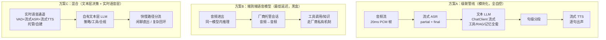
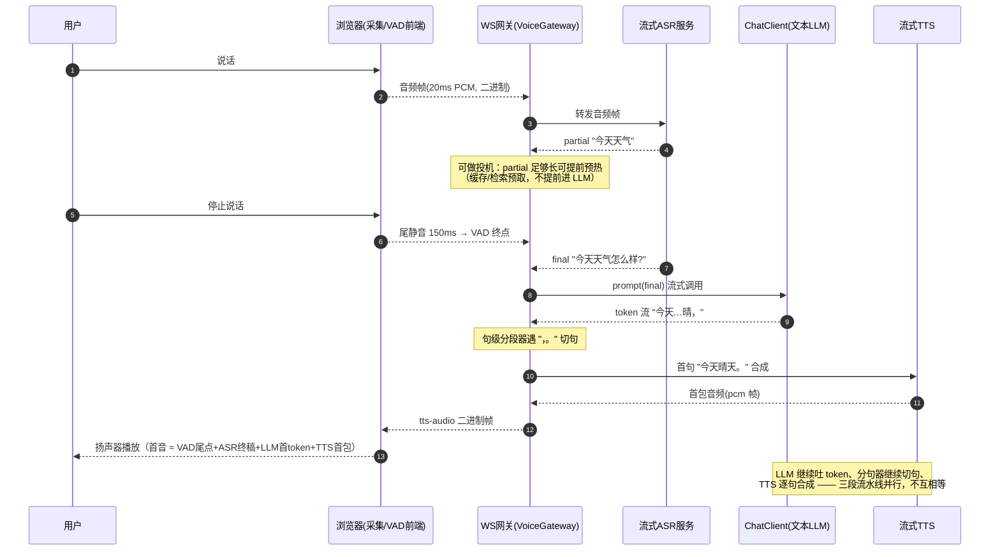
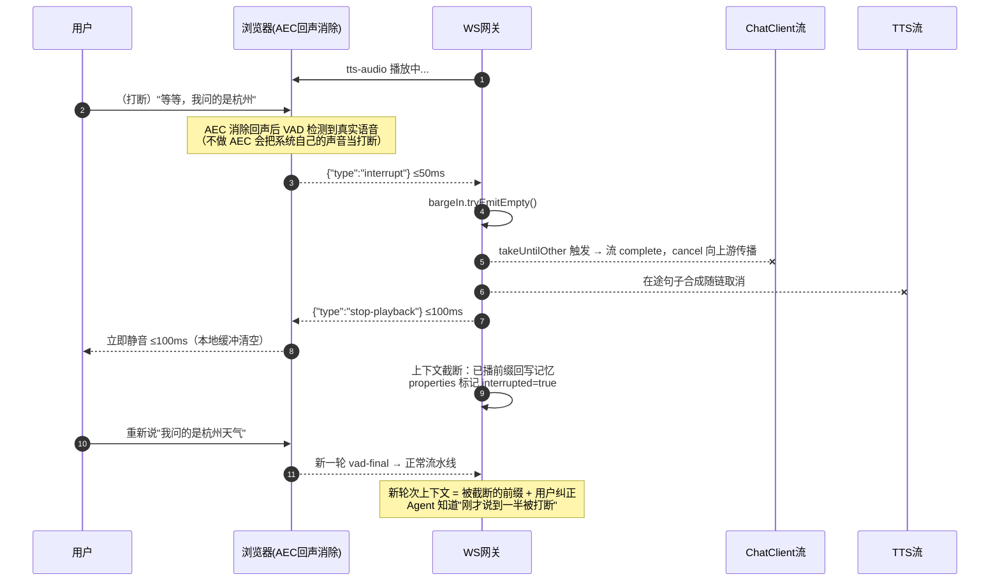

# 12 语音与实时多模态工程——ASR/TTS 与实时语音 Agent 的 Java 落地

> **定位**：本文讲"Agent 开口说话"这条工程线——ASR（语音识别）→ LLM → TTS（语音合成）的级联管线、端到端实时语音模型与混合架构的选型对比、WebFlux 全链路响应式实现、延迟预算分解、打断（barge-in）的取消传播、语音对话的上下文与记忆。本文与 [教程 09-前沿专题/02-多模态Agent开发]（视觉/文档输入线）互补：那篇讲"Agent 怎么看"，本篇讲"Agent 怎么听、怎么说、怎么被随时打断"。全链路落地载体为 [项目 17-企业级实时多模态交互Agent平台/00-需求分析与架构设计.md]（该项目的 02-全双工语音流水线 与 03-实时编排与抢占生成 是本文两个核心机制的迭代级展开）。
>
> **读者画像**：要给 Agent 加语音出入口的 Java 工程师；要做智能语音客服、语音坐席、数字人交互平台的架构师。假设你已熟悉 WebFlux 的 Flux/Mono 与调度器模型。
>
> **前置阅读**：[教程 01-WebFlux与响应式编程/00-WebFlux从零入门]、[教程 01-WebFlux与响应式编程/06-线程模型与调度器]（boundedElastic 纪律）、[教程 01-WebFlux与响应式编程/03-Sinks详解]（打断信号的 emit/取消语义）、[教程 00-基础与核心/02-ChatClient与对话模型]（流式调用）。
>
> **版本基准**：Spring Boot 4.1.0 + Spring AI 2.0.0 + WebFlux + Java 21。文中所有 Spring AI 语音 API（`OpenAiAudioSpeechModel`/`OpenAiAudioTranscriptionModel`/`OpenAiChatOptions.outputAudio`）均经本地 jar `javap` 实证（详见 §7 基准表）；外部流式 ASR 服务的 WebSocket 契约为**概念代码**。

---

## 1. 语音不是"换个输入法"：实时性把问题变了一个量级

把"用户说一句话"接到现有文本 Agent 上，直觉做法是：录完整段音频 → 调一次 ASR 得到文本 → 走现有 ChatClient → 拿到完整回答 → 调一次 TTS → 播放。这条链每一步都对，但串起来是灾难：用户说完后等 ASR（约 0.5s）、等 LLM 全量生成（3~10s）、等 TTS 全量合成（1~2s），**从用户闭嘴到听到回答超过 5 秒**。真人对话中，超过 1 秒的沉默就会让对方觉得"他没听懂"，超过 3 秒就会重新开口——而这时你的 Agent 才刚开始播放一段过时的长回答。

| 维度 | 文本 Agent | 语音 Agent |
|------|-----------|-----------|
| 延迟单位 | 首 token 1~2s 可接受 | **首音（用户说完→系统出声）≤ 800ms 才"像真人"** |
| 数据形态 | 离散消息（发→收） | **连续流**（20ms 音频帧，双向同时流动） |
| 轮次边界 | 用户点发送才算说完 | 需 VAD 自行判断"说完了"，且说完之后随时可能**改口** |
| 错误代价 | 生成完了顶多重来 | 播出去的声音收不回，**打断响应慢 = 两个声音打架** |
| 状态管理 | 一个请求一个状态 | 一个 WebSocket 连接一条长生命周期的状态机 |

所以语音 Agent 的核心工程问题只有三个：**① 架构选型**（级联/端到端/混合）、**② 延迟预算**（每一毫秒花在哪、能砍多少）、**③ 打断**（全双工下的取消传播）。本文 2~6 节逐一展开。

## 2. 三种架构：级联、端到端、混合

### 2.1 三种形态

**方案 A——级联管线（Cascaded Pipeline）**：ASR → LLM → TTS 三个独立模型串联，每段可独立替换、独立观测。文本层是标准 ChatClient（工具调用、RAG、记忆全套照用），语音只是出入口的"编解码器"。

**方案 B——端到端语音模型（Speech-to-Speech）**：以 OpenAI Realtime API、Gemini Live 类产品为代表，音频进、音频出，模型内部直接在语音表示上推理，**不经文本中转**。延迟最低（省掉两段转写/合成的往返），且能保留语气、停顿等副语言信息；代价是黑盒——工具调用/知识接入/合规审核都依赖厂商的私有机制，且文本 transcript 由厂商回吐，可观测面窄。

**方案 C——混合架构（文本层 LLM + 实时语音层）**：语音进出仍走低延迟实时通道，但把"理解与决策"留在自有文本层 LLM；语音模型降级为"实时 ASR + 实时 TTS + VAD"的托管组件。这是当前企业落地的主流折中：可控性接近方案 A，首音延迟接近方案 B。



### 2.2 选型对比表

| 维度 | A 级联管线 | B 端到端 | C 混合 |
|------|-----------|---------|--------|
| 首音延迟量级 | 800ms~2s（可优化到 ~800ms） | **300~800ms** | 500ms~1.2s |
| 每分钟成本 | 三段模型分别计费，总量最低（文本 LLM 便宜） | 语音 token 计费，**最贵**（实时会话按音频时长计） | 介于两者之间 |
| 可控性/可替换性 | **最高**：三段各自可换供应商、可降级 | 最低：单供应商锁定，厂商故障即全故障 | 高：语音层与认知层解耦 |
| 工具调用/RAG/记忆 | **原生**（就是文本 Agent） | 依赖厂商函数调用支持，能力面窄 | 原生（决策在文本层） |
| 可观测 | **每段独立 Span**（ASR/LLM/TTS 各自计时） | 只能看厂商回吐的事件流 | LLM 段全可观测，语音段托管 |
| 副语言（语气/情绪） | 丢失（经文本中转） | **保留** | 部分保留（语音层可回传能量/语速元数据） |
| 合规与审核 | 文本全量留痕，**审核点清晰** | 需审核厂商 transcript 回吐 | 文本层留痕 |
| 适合场景 | 客服/工单等强业务流程，企业主流首选 | 陪聊、口语陪练等"体验优先"场景 | 高并发平台：闲聊走快路径、复杂查询走慢路径 |

**选型建议**：Java 架构师的默认答案是 **A 起步、按需演进到 C**。理由：方案 A 的每一段都有清晰的替换与观测边界，Spring AI 的抽象恰好覆盖 LLM 段与（非流式）TTS/ASR 段；方案 B 适合做"体验补丁"（特定话术场景独立接入），不适合做系统主干——你无法在厂商黑盒里落地 [教程 04-企业级架构主干/00-管控分离架构] 的管控分离要求。本项目（[项目 17-企业级实时多模态交互Agent平台/00-需求分析与架构设计.md]）就是按 A→C 演进的。

## 3. 级联管线的 WebFlux 全链路实现

### 3.1 全链路时序

先看目标形态：用户说话期间 ASR 不停吐部分结果，VAD 判定说完后 LLM 立刻流式，**第一句还没生成完就开始合成第二句**——各段流水线化，不互相等待。



### 3.2 接入层：WebSocket 音频分帧与出站事件流

音频走 WebSocket 二进制帧（20ms/帧，16kHz 16bit PCM 约 640 字节），控制事件（VAD 终点、打断信号）走同一连接的 JSON 文本帧。出站方向，网关把四类事件推回前端：`asr-partial`、`llm-delta`（字幕）、`tts-audio`（二进制）、`stop-playback`（打断指令）。

```java
// build.gradle/pom 已有：spring-boot-starter-webflux + spring-ai-starter-model-openai (Spring AI 2.0.0)
package com.example.voice;

import org.springframework.context.annotation.Bean;
import org.springframework.context.annotation.Configuration;
import org.springframework.web.reactive.HandlerMapping;
import org.springframework.web.reactive.handler.SimpleUrlHandlerMapping;
import org.springframework.web.reactive.socket.WebSocketHandler;
import org.springframework.web.reactive.socket.server.support.WebSocketHandlerAdapter;

import java.util.Map;

@Configuration
public class VoiceWebSocketConfig {

    @Bean
    public WebSocketHandlerAdapter webSocketHandlerAdapter() {
        return new WebSocketHandlerAdapter();
    }

    @Bean
    public HandlerMapping voiceHandlerMapping(VoiceGatewayHandler gateway) {
        return new SimpleUrlHandlerMapping(Map.of("/ws/voice/{sessionId}", gateway), 10);
    }
}
```

```java
package com.example.voice;

import com.fasterxml.jackson.databind.JsonNode;
import com.fasterxml.jackson.databind.ObjectMapper;
import org.springframework.stereotype.Component;
import org.springframework.web.reactive.socket.WebSocketHandler;
import org.springframework.web.reactive.socket.WebSocketMessage;
import org.springframework.web.reactive.socket.WebSocketSession;
import reactor.core.publisher.Mono;
import reactor.core.publisher.Sinks;

/**
 * 语音网关：每条 WebSocket 连接一个 VoiceTurnOrchestrator。
 * 入站：二进制=音频帧；文本=JSON 控制事件（vad-final / interrupt / session-close）。
 * 出站：Sinks.Many 汇聚 asr-partial / llm-delta / tts-audio / stop-playback 四类事件。
 */
@Component
public class VoiceGatewayHandler implements WebSocketHandler {

    private final ObjectMapper mapper = new ObjectMapper();
    private final VoiceTurnOrchestrator orchestrator;

    public VoiceGatewayHandler(VoiceTurnOrchestrator orchestrator) {
        this.orchestrator = orchestrator;
    }

    @Override
    public Mono<Void> handle(WebSocketSession session) {
        String sessionId = session.getHandshakeInfo().getUri().getPath(); // 实际从路径/查询参数解析

        // 出站：单向 sink，序列化为 WS 消息（音频二进制/事件文本）
        Sinks.Many<VoiceEvent> outbound = Sinks.many().unicast().onBackpressureBuffer();
        Sinks.Many<Void> bargeIn = Sinks.many().unicast().onBackpressureBuffer(); // 打断信号源

        VoiceTurnOrchestrator.Turn turn = orchestrator.open(sessionId, outbound, bargeIn);

        Mono<Void> send = session.send(outbound.asFlux()
                .map(event -> event.isAudio()                       // tts-audio → 二进制帧
                        ? session.binaryMessage(buf -> buf.wrap(event.pcm()))
                        : session.textMessage(event.toJson(mapper)) // 其余 → JSON 文本帧
                ));

        Mono<Void> receive = session.receive()
                .doOnNext(msg -> {
                    if (msg.getType() == WebSocketMessage.Type.BINARY) {
                        turn.onAudio(msg.getPayload().array());        // 音频帧 → ASR 通道
                    } else {
                        dispatchControl(turn, msg.getPayloadAsText()); // 控制帧
                    }
                })
                .then();

        // 任意一侧结束（连接关闭/发送完成）即终止会话并取消在途生成
        return receive.thenEmpty(send)
                .doFinally(sig -> turn.close());
    }

    private void dispatchControl(VoiceTurnOrchestrator.Turn turn, String json) {
        try {
            JsonNode node = mapper.readTree(json);
            switch (node.get("type").asText()) {
                case "vad-final"  -> turn.onUtteranceEnd();   // 前端 VAD 尾点（或服务端 VAD）
                case "interrupt"  -> turn.onBargeIn();        // 用户在播放中开口 → 打断
                case "session-close" -> turn.close();
                default -> { /* 未知事件忽略 */ }
            }
        } catch (Exception ignored) {
            // 控制帧解析失败不致断链，记日志
        }
    }
}
```

出站事件的统一模型（音频帧与控制事件同队列保序，是"停播指令晚于音频到达"这类乱序事故的防线）：

```java
package com.example.voice;

import com.fasterxml.jackson.databind.ObjectMapper;

/** 出站事件：音频走二进制，事件走 JSON；同一 Sinks 队列保证顺序。 */
public record VoiceEvent(Type type, String text, byte[] pcm) {

    public enum Type { ASR_PARTIAL, ASR_FINAL, LLM_DELTA, TTS_AUDIO, STOP_PLAYBACK, ERROR }

    public static VoiceEvent asrPartial(String t)  { return new VoiceEvent(Type.ASR_PARTIAL, t, null); }
    public static VoiceEvent asrFinal(String t)    { return new VoiceEvent(Type.ASR_FINAL, t, null); }
    public static VoiceEvent llmDelta(String t)    { return new VoiceEvent(Type.LLM_DELTA, t, null); }
    public static VoiceEvent ttsAudio(byte[] pcm)  { return new VoiceEvent(Type.TTS_AUDIO, null, pcm); }
    public static VoiceEvent stopPlayback()        { return new VoiceEvent(Type.STOP_PLAYBACK, null, null); }
    public static VoiceEvent error(String msg)     { return new VoiceEvent(Type.ERROR, msg, null); }

    public boolean isAudio() { return type == Type.TTS_AUDIO; }

    public String toJson(ObjectMapper mapper) {
        try {
            return mapper.writeValueAsString(
                    java.util.Map.of("type", type.name().toLowerCase().replace('_', '-'),
                            "text", text == null ? "" : text));
        } catch (Exception e) {
            return "{\"type\":\"error\"}";
        }
    }
}
```

`★ Insight ─────────────────────────────────────`
- `session.receive()` 与 `session.send()` 是两条独立管道——语音 Agent 必须**全双工**：正在播放 TTS 音频的同时，入站音频帧仍在流入（用于打断检测）。这也是为什么不能退化成"一个 HTTP 请求一轮对话"。
- 出站用 `unicast` Sinks 而不是直接把 Flux 接到 `session.send()`：网关需要**随时从外部注入**事件（ASR 线程的 partial、LLM 线程的 delta、TTS 线程的音频），Sinks 是"多个生产者、一个消费者"的汇流点（[教程 01-WebFlux与响应式编程/03-Sinks详解]）。
`─────────────────────────────────────────────────`

### 3.3 编排核心：ASR → LLM → 分句 → TTS 的流水线

这是全篇最关键的一段代码。注意三件事：**每会话独立一个 Turn 状态对象**；**LLM 流上挂 `takeUntilOther(bargeIn)` 实现打断**（§5 详述）；**所有模型调用段都 `publishOn(boundedElastic)`**——Spring AI 的 OpenAI 模块底层是 OkHttp 同步客户端（`org.springframework.ai.openai.http.okhttp` 包，javap 实证），其响应式封装的执行线程不可假设为非阻塞线程，绝不能让它落在 Reactor Netty 的 EventLoop 上（[教程 01-WebFlux与响应式编程/06-线程模型与调度器]）。

```java
package com.example.voice;

import org.springframework.ai.chat.client.ChatClient;
import org.springframework.ai.chat.memory.ChatMemory;
import org.springframework.ai.openai.OpenAiAudioSpeechOptions;
import org.springframework.ai.audio.tts.TextToSpeechPrompt;
import org.springframework.ai.audio.tts.TextToSpeechResponse;
import org.springframework.core.io.ByteArrayResource;
import org.springframework.core.io.Resource;
import reactor.core.Disposable;
import reactor.core.publisher.Flux;
import reactor.core.publisher.Mono;
import reactor.core.publisher.Sinks;
import reactor.core.scheduler.Schedulers;

import java.util.concurrent.atomic.AtomicReference;

/** 每会话一个：承载"一轮语音对话"的完整流水线。 */
@Component
public class VoiceTurnOrchestrator {

    private static final String SYSTEM_PROMPT = """
            你是语音客服坐席。回答口语化、短句优先：单句不超过 25 字，
            先给结论再给细节——你的每一句话都会被实时朗读给用户听。
            """;

    private final ChatClient chatClient;
    private final VoiceTtsService ttsService;      // §3.5，Spring AI 流式 TTS 封装
    private final VoiceAsrService asrService;      // §3.6，整段转写 + 外部流式 ASR 桥接
    private final AudioFrameEncoder encoder = new AudioFrameEncoder(); // pcm 字节→WS 二进制帧

    public VoiceTurnOrchestrator(ChatClient.Builder chatClientBuilder,
                                 VoiceTtsService ttsService,
                                 VoiceAsrService asrService) {
        this.chatClient = chatClientBuilder
                .defaultSystem(SYSTEM_PROMPT)
                .build();
        this.ttsService = ttsService;
        this.asrService = asrService;
    }

    public Turn open(String sessionId, Sinks.Many<VoiceEvent> outbound, Sinks.Many<Void> bargeIn) {
        return new Turn(sessionId, outbound, bargeIn);
    }

    public class Turn {
        private final String sessionId;
        private final Sinks.Many<VoiceEvent> outbound;
        private final Sinks.Many<Void> bargeIn;
        private final AtomicReference<Disposable> inFlight = new AtomicReference<>();
        private volatile boolean interrupted = false;

        Turn(String sessionId, Sinks.Many<VoiceEvent> outbound, Sinks.Many<Void> bargeIn) {
            this.sessionId = sessionId;
            this.outbound = outbound;
            this.bargeIn = bargeIn;
        }

        /** 入站音频帧：转发给流式 ASR 通道（外部服务，桥接见 §3.6）。 */
        public void onAudio(byte[] pcmFrame) {
            asrService.forward(sessionId, pcmFrame);
        }

        /** VAD 终点：以 ASR 终稿为输入，启动 LLM→分句→TTS 流水线。 */
        public void onUtteranceEnd() {
            String finalText = asrService.drainFinal(sessionId); // 阻塞队列取终稿，非 EventLoop
            if (finalText == null || finalText.isBlank()) {
                return;
            }
            emitVoiceEvent(VoiceEvent.asrFinal(finalText));

            // ① 文本 LLM 流式；打断信号可随时终结该流（取消向上游传播）
            Flux<String> tokens = chatClient.prompt()
                    .user(finalText)
                    .advisors(a -> a.param(ChatMemory.CONVERSATION_ID, sessionId)) // 会话记忆
                    .stream()
                    .content()                      // Flux<String>，Spring AI 2.0.0
                    .takeUntilOther(bargeIn.asFlux()) // ★ 打断 = 该流立即 complete + 上游 cancel
                    .publishOn(Schedulers.boundedElastic()) // OkHttp 同步底层，禁止占用 EventLoop
                    .doOnNext(t -> emitVoiceEvent(VoiceEvent.llmDelta(t))); // 同步字幕（可展示"正在说"）

            // ② 句级分段：token 流 → 完整句流（降低 TTS 首音延迟，见 §4）
            Flux<String> sentences = tokens.transform(SentenceSplitter::split)
                    .takeUntilOther(bargeIn.asFlux());

            // ③ 逐句流式 TTS：concatMap 保序；已生成句子少时无并行收益，
            //    高负载可换 flatMapSequential(1..2) 有界预取——仍保序，多一句合成延迟换吞吐
            Flux<byte[]> audio = sentences
                    .concatMap(sentence -> ttsService.streamPcm(sentence)
                            .takeUntilOther(bargeIn.asFlux()))
                    .publishOn(Schedulers.boundedElastic());

            Disposable d = audio.subscribe(
                    pcm -> emitVoiceEvent(VoiceEvent.ttsAudio(encoder.frame(pcm))),
                    err  -> emitVoiceEvent(VoiceEvent.error(err.getMessage())),
                    ()  -> completeTurn(finalText));   // 正常完成 → 回写 transcript（§6）

            inFlight.set(d); // 供打断/关连时手动 dispose（链外兜底）
        }

        /** 打断：见 §5。 */
        public void onBargeIn() {
            interrupted = true;
            bargeIn.tryEmitEmpty();          // 触发所有 takeUntilOther → 在途流链式取消
            inFlight.getAndUpdate(d -> { if (d != null) d.dispose(); return null; }); // 链外兜底
            emitVoiceEvent(VoiceEvent.stopPlayback()); // 命令前端立即静音
        }

        public void close() {
            onBargeIn();
            asrService.close(sessionId);
        }

        private void completeTurn(String userText) {
            // 正常收尾时由 Advisor 已写入记忆；被打断的残句在 §6 特殊回写
        }

        private void emitVoiceEvent(VoiceEvent event) {
            Sinks.EmitResult r = outbound.tryEmitNext(event);
            if (r.isFailure()) {
                // 接收端已取消/缓冲满 → 会话实质死亡，停止一切生产（呼应 Sinks 篇 EmitResult 语义）
            }
        }
    }
}
```

`★ Insight ─────────────────────────────────────`
- **打断信号挂三道**：LLM 流、分句流、每句 TTS 流都接了同一个 `bargeIn`。Reactor 的取消是**链式传播**的——任一段被终结，`cancel()` 沿订阅链上溯，LLM 的 HTTP 流与 TTS 的合成请求全部中断，不需要逐个手动 dispose。`inFlight.dispose()` 只是链外兜底（比如流水线还没启动时）。
- **为什么用 `concatMap` 不用 `flatMap`**：音频块必须按句序播放，`flatMap` 会乱序。要吞吐用 `flatMapSequential(n)`——有界并发预取 + 按源顺序重排，是"保序流式管线"的标准武器（[教程 01-WebFlux与响应式编程/01-Reactor核心]）。
`─────────────────────────────────────────────────`

### 3.4 句级分段器

TTS 首音延迟的大头在"等 LLM 把整段说完"。分段器把 token 流切成完整句（标点为界），每凑齐一句立刻送去合成——首音时间从"全文生成完"变成"第一句生成完"。

```java
package com.example.voice;

import reactor.core.publisher.Flux;

import java.util.ArrayList;
import java.util.List;

/** token 流 → 完整句流。遇终止标点且长度达标即切句；流结束冲刷余量。 */
public final class SentenceSplitter {

    private static final String TERMINATORS = "。！？；!?;\n";
    private static final String SOFT_BREAKS  = "，,、：:";
    private static final int MIN_SENTENCE = 4;   // 短于 4 字不切，避免"嗯。"独占一次合成
    private static final int MAX_SENTENCE = 60;  // 超长强制在软标点切，防止 TTS 单请求过大

    public static Flux<String> split(Flux<String> tokens) {
        StringBuilder buf = new StringBuilder();
        return tokens
                .concatMapIterable(token -> {
                    List<String> out = new ArrayList<>();
                    buf.append(token);
                    while (true) {
                        int hard = indexOfAny(buf, TERMINATORS);
                        if (hard >= 0 && buf.length() >= MIN_SENTENCE) {
                            out.add(buf.substring(0, hard + 1));
                            buf.delete(0, hard + 1);
                            continue;
                        }
                        if (buf.length() >= MAX_SENTENCE) {
                            int soft = lastIndexOfAny(buf, SOFT_BREAKS);
                            if (soft > 0) {
                                out.add(buf.substring(0, soft + 1));
                                buf.delete(0, soft + 1);
                            }
                        }
                        break;
                    }
                    return out;
                })
                .concatWith(Flux.defer(() -> buf.length() > 0
                        ? Flux.just(buf.toString())   // 冲刷：流结束时剩余不足一句也送出
                        : Flux.empty()));
    }

    private static int indexOfAny(StringBuilder s, String chars) {
        for (int i = 0; i < s.length(); i++) {
            if (chars.indexOf(s.charAt(i)) >= 0) return i;
        }
        return -1;
    }

    private static int lastIndexOfAny(StringBuilder s, String chars) {
        for (int i = s.length() - 1; i >= 0; i--) {
            if (chars.indexOf(s.charAt(i)) >= 0) return i;
        }
        return -1;
    }
}
```

切句粒度是延迟与自然度的权衡：句切得太碎（逗号就切）TTS 的句间韵律会断；切得太整（只认句号）首音变慢。生产上常用"标点 + 最小长度"动态阈值，并按 TTS 服务支持的 `input` 长度上限设 `MAX_SENTENCE`。

### 3.5 流式 TTS 封装（Spring AI 2.0.0 真实 API）

`OpenAiAudioSpeechModel` 经 javap 实证**支持流式**：`Flux<TextToSpeechResponse> stream(TextToSpeechPrompt)`（继承自 `StreamingTextToSpeechModel`，另有 default `Flux<byte[]> stream(String)`）。工程要点是 `responseFormat` 选 **pcm**（裸采样流，无容器帧头，天然可分帧拼接播放；mp3/wav 有文件头与帧对齐问题，不适合逐包播放）：

```java
package com.example.voice;

import org.springframework.ai.audio.tts.TextToSpeechPrompt;
import org.springframework.ai.audio.tts.TextToSpeechResponse;
import org.springframework.ai.openai.OpenAiAudioSpeechOptions;
import org.springframework.stereotype.Service;
import reactor.core.publisher.Flux;
import reactor.core.scheduler.Schedulers;

/** Spring AI 2.0.0 流式 TTS 封装（OpenAiAudioSpeechModel.stream 实证存在）。 */
@Service
public class VoiceTtsService {

    public static final String PCM_SAMPLE_RATE = "24000"; // pcm 格式采样率由前端按约定解码

    private final org.springframework.ai.audio.tts.TextToSpeechModel speechModel;

    public VoiceTtsService(org.springframework.ai.audio.tts.TextToSpeechModel speechModel) {
        // 自动装配注入 OpenAiAudioSpeechModel（spring.ai.model.audio.speech=openai，见 §7）
        this.speechModel = speechModel;
    }

    /** 单句 → pcm 音频帧流。 */
    public Flux<byte[]> streamPcm(String sentence) {
        return speechModel.stream(new TextToSpeechPrompt(
                        sentence,
                        OpenAiAudioSpeechOptions.builder()
                                .voice("alloy")            // Builder.voice(String)，javap 实证
                                .responseFormat("pcm")     // 裸采样流，适合分帧播放
                                .speed(1.1)                // 语速微调：感知延迟的免费红利
                                .build()))
                .map(TextToSpeechResponse::getResult)
                .map(speech -> speech.getOutput())         // byte[]
                .subscribeOn(Schedulers.boundedElastic()); // OkHttp 同步底层离场 EventLoop
    }
}
```

### 3.6 ASR：Spring AI 只有整段转写，流式走外部服务

这是本篇最重要的**实证结论**：`OpenAiAudioTranscriptionModel` 经 javap 实证**只有同步整段 `call(AudioTranscriptionPrompt)`，没有任何 `stream` 方法**——Spring AI 2.0.0 不提供流式 ASR。因此级联管线里 ASR 段有两条路：

**路线一（VAD 分段 + 整段转写，Spring AI 原生）**：前端/服务端 VAD 判定说完后，把该段音频整段送 `call()`。实现最简单，但 `call()` 本身耗时（几百毫秒起），适合对首音不敏感的场景（语音留言、工单口述）：

```java
package com.example.voice;

import org.springframework.ai.audio.transcription.AudioTranscriptionPrompt;
import org.springframework.ai.audio.transcription.AudioTranscriptionResponse;
import org.springframework.ai.openai.OpenAiAudioTranscriptionOptions;
import org.springframework.core.io.ByteArrayResource;
import org.springframework.stereotype.Service;
import reactor.core.publisher.Mono;
import reactor.core.scheduler.Schedulers;

import org.springframework.core.io.Resource;

/** 整段转写：Spring AI 2.0.0 OpenAiAudioTranscriptionModel（仅 call，无 stream，实证）。 */
@Service
public class VoiceAsrBatchService {

    private final org.springframework.ai.audio.transcription.TranscriptionModel transcriptionModel;

    public VoiceAsrBatchService(
            org.springframework.ai.audio.transcription.TranscriptionModel transcriptionModel) {
        this.transcriptionModel = transcriptionModel;
    }

    /** 整段 wav → 文本。阻塞调用，必须 subscribeOn 离开 EventLoop。 */
    public Mono<String> transcribe(byte[] wavBytes) {
        Resource audio = new ByteArrayResource(wavBytes) {
            @Override public String getFilename() { return "utterance.wav"; } // 供扩展名推断格式
        };
        return Mono.fromCallable(() -> {
                    AudioTranscriptionResponse resp = transcriptionModel.call(
                            new AudioTranscriptionPrompt(audio,
                                    OpenAiAudioTranscriptionOptions.builder()
                                            .language("zh")
                                            .build()));
                    return resp.getResult().getOutput(); // String
                })
                .subscribeOn(Schedulers.boundedElastic());
    }
}
```

**路线二（外部流式 ASR 服务，WebSocket 桥接）**：生产级实时管线必须边说边出文本（partial 事件驱动 §4 的投机优化）。此类服务（自建 Whisper/FunASR 流式服务、或商用实时转写）的 WebSocket 契约不在 Spring AI 抽象内，以下为**概念代码**（需引入实际服务 SDK 后实证其客户端 API）：

```java
// ── 概念代码：外部流式 ASR 的桥接骨架，真实 API 需按所选服务 SDK 实证 ──
// 契约：上行 = 二进制 pcm 帧 + {"type":"eof"} 文本帧；下行 = {"type":"partial","text":...}
//                                                            {"type":"final","text":...}
package com.example.voice;

import reactor.core.publisher.Flux;
import reactor.core.publisher.Mono;
import reactor.core.publisher.Sinks;

import java.util.concurrent.ConcurrentHashMap;

@Service
public class VoiceAsrService {

    private final AsrClientFactory factory;             // 概念代码：按配置创建到 ASR 服务的 WS 连接
    private final ConcurrentHashMap<String, AsrChannel> channels = new ConcurrentHashMap<>();

    public VoiceAsrService(AsrClientFactory factory) {
        this.factory = factory;
    }

    public void forward(String sessionId, byte[] pcmFrame) {
        channels.computeIfAbsent(sessionId, id -> open(id)).sendAudio(pcmFrame);
    }

    /** VAD 终点后取终稿：发送 eof，等待 final（或用最新 partial 兜底，见 §4 投机）。 */
    public String drainFinal(String sessionId) {
        AsrChannel ch = channels.get(sessionId);
        return ch == null ? null : ch.awaitFinal();     // 内部为有界等待 + partial 兜底
    }

    public Flux<String> partials(String sessionId) {    // partial 事件流向网关推送字幕
        AsrChannel ch = channels.get(sessionId);
        return ch == null ? Flux.empty() : ch.partialStream();
    }

    public void close(String sessionId) {
        AsrChannel ch = channels.remove(sessionId);
        if (ch != null) ch.close();
    }

    private AsrChannel open(String sessionId) {
        return factory.create(sessionId, this::onServerEvent); // 概念代码
    }

    private void onServerEvent(String sessionId, AsrEvent event) { /* partial/final 分发 */ }

    interface AsrChannel {
        void sendAudio(byte[] frame);
        String awaitFinal();
        Flux<String> partialStream();
        void close();
    }
    record AsrEvent(String type, String text) {}
    interface AsrClientFactory {
        AsrChannel create(String sessionId, java.util.function.BiConsumer<String, AsrEvent> listener);
    }
}
```

`★ Insight ─────────────────────────────────────`
- **为什么 Spring AI 不做流式 ASR 不是缺陷**：流式 ASR 的传输形态（WS 帧协议、断句事件）各供应商差异极大，抽象不出稳定接口；而 TTS 的流式形态（文本进、音频块出）天然同构，所以 2.0.0 里 `StreamingTextToSpeechModel` 存在而对应的流式转写接口不存在。选型时把"流式 ASR"当作独立的**基础设施选型**（自建/商用、协议、断句策略），别指望框架替你决定。
- ASR 段（外部服务）与 LLM 段（Spring AI）之间的**文本契约**就是 `asr-partial`/`asr-final` 两个事件——这条缝让两段可以独立替换、独立压测、独立打 Span（[教程 06-TraceId全链路追踪/01-读懂族谱：traceId、spanId与span树]）。
`─────────────────────────────────────────────────`

## 4. 延迟预算工程：把"用户说完"到"系统出声"拆到毫秒

延迟优化不是"全局快一点"，而是**先分解、再对每一段定预算、超预算的段单独治**。定义端到端首音延迟 = 用户说完（VAD 尾点）到第一包音频进入扬声器：

| # | 段 | 典型量级 | 构成 | 优化手段 |
|---|----|---------|------|---------|
| 1 | VAD 尾点检测 | 100~300ms | 尾静音窗口（判断"说完了"必须等一小段静音） | 自适应静音窗（闲聊 150ms / 业务指令 250ms）；语义 VAD（小模型预测"话说完了没"）压到 ~100ms |
| 2 | ASR 终稿 | 50~400ms | 尾点后服务端回吐 final 的耗时 | **部分结果投机**：不等 final，用高置信 partial 提前触发 LLM（final 到达后仅校验差异）；partial 流式化让该段趋近 0 |
| 3 | LLM 首 token | 200~800ms | 网络往返 + 预填充（prefill） | System Prompt 稳定部分命中 **Prompt Cache**；短 System + 口语化指令减少预填充；简单意图路由到小模型；流式输出（必然） |
| 4 | 首句生成到句尾标点 | 100~400ms | 第一句 token 逐个吐出的时间 | **指令侧**：要求"先说一句短结论"（System Prompt 里写死）；分段器阈值 `MIN_SENTENCE` 调低 |
| 5 | TTS 首包 | 100~300ms | 合成服务首包延迟 | 句级流水线（§3.4，第一句不等全文）；`speed=1.1` 微加速；选低首包 voice/模型；TTS 结果对高频固定话术做**语义缓存**（[教程 09-前沿专题/11-上下文工程生产化] §缓存分层） |
| 6 | 网络 + 播放缓冲 | 50~150ms | WS 传输 + 前端 jitter buffer | 出站帧不过楔（`onBackpressureBuffer` 有界）；前端首包低缓冲启动、播放中自适应加深 |

各段相加，级联管线的现实目标：**首音 800ms~1.2s，可感知打断 ≤200ms**（[项目 17-企业级实时多模态交互Agent平台/00-需求分析与架构设计.md] 的预算基线即由此定）。

**三个收益最大的专项手段**：

1. **部分结果投机（speculative execution）**：ASR partial 达到"看起来像完整问句"（长度 + 标点/疑问词启发式）时，先做**无副作用预热**——检索预取、缓存查询、甚至把 partial 作为 user 消息发起 LLM 流但**不推 TTS**；final 到达后若与 partial 编辑距离小于阈值，直接续用已生成的 token（省掉整整段 2+3），否则丢弃重来。投机的本质是把"串行等待"换成"乐观并发+校验回滚"，必须保证回滚路径的幂等（不产生副作用的部分才可投机）。
2. **填充语先开口（filler first）**：延迟预算超限时，让 TTS 先合成一句极短的承接语（"嗯——我看一下""好的"），把主观等待切成"对方在回应"。填充语在 partial 阶段即可触发（连 LLM 都不用等），代价是对话略显机械，客服场景收益远大于损失。注意填充语必须与最终回答语义相容，且同一会话轮内不重复。
3. **句级流水线**：§3.4 已述——LLM、分句、TTS 三段重叠执行。设 LLM 全文 2s、单句合成 300ms：串行总延迟 ≈ 2s + 0.3s；句级流水线后首音 ≈ 首句生成（~0.4s）+ 单句合成 0.3s ≈ **0.7s**，后文合成被语音播放时间（每句朗读 ≥2s）完全吸收。

一条工程纪律：**每一段都要打 Span 记时长**（VAD、ASR final、LLM 首 token、TTS 首包），否则延迟预算只是 PPT 数字。观测落点见 [教程 05-Observation可观测/00-最小闭环：Agent各阶段输出打印到控制台] 与 [教程 06-TraceId全链路追踪/00-最小闭环：日志里长出traceId]。

## 5. 打断（Barge-in）：全双工下的取消传播

用户在 TTS 播放中再次开口，是语音 Agent 与文本 Agent 最本质的差异。处理目标：**用户开口 ≤200ms 内系统闭嘴**，且**被截断的回答不污染后续上下文**。



三个关键机制，一一对应 §3.3 的代码：

**① 停止播放（前端，≤100ms）**：网关发 `stop-playback` 事件，前端清空 jitter buffer 并静音。声音停不下来的常见原因是前端播放缓冲太深——首音延迟优化（小缓冲）与打断灵敏度（小缓冲）在这里是**同一个优化**。

**② 取消上游 Flux（服务端，链式传播）**：`takeUntilOther(bargeIn.asFlux())` 在信号源发出第一个信号时终结主流并向订阅链上游发 `cancel()`——LLM 的 HTTP 流、TTS 的合成请求全部随之中断。这正是 [教程 01-WebFlux与响应式编程/03-Sinks详解] 讲的取消语义在语音场景的核心应用：Sinks 不只是"外部推数据"，更是**外部推终止信号**的通道；`tryEmitEmpty()` 的 `EmitResult` 必须检查（会话已终结时 emit 失败是常态而非异常）。打断检测本身依赖前端 AEC（回声消除）：否则扬声器播出的 Agent 声音会被麦克风采集回来，把自己当成用户在打断——这是语音工程最经典的坑。

**③ 上下文截断（认知层）**：被打断时 LLM 可能已生成半段。直接丢弃会让下一轮"失忆"（用户："我问的是杭州！" Agent："请问您要查什么？"——灾难）；全量写入则把没播出去的内容当"说过了"。正确做法是**回写已播放的前缀 + 打断标记**：

```java
package com.example.voice;

import org.springframework.ai.chat.messages.AssistantMessage;
import org.springframework.ai.chat.memory.ChatMemory;
import org.springframework.ai.chat.memory.MessageWindowChatMemory;
import org.springframework.stereotype.Service;

import java.util.List;
import java.util.Map;

/** 语音轮次的 transcript 回写：正常轮由 Advisor 完成，被打断轮在此手工截断回写。 */
@Service
public class VoiceTranscriptService {

    private final ChatMemory chatMemory; // MessageWindowChatMemory（自动装配）

    public VoiceTranscriptService(ChatMemory chatMemory) {
        this.chatMemory = chatMemory;
    }

    /**
     * 打断回写：只把"用户真正听到的那部分"写进记忆。
     * playedPrefix = 前端回报的已播放文本（tts-audio 帧随带句文本，前端累计）。
     */
    public void writeInterruptedTurn(String sessionId, String playedPrefix) {
        AssistantMessage truncated = AssistantMessage.builder()
                .content(playedPrefix + "……（该回答被用户打断）")
                .properties(Map.of("interrupted", true, "channel", "voice")) // 元数据不进模型 prompt
                .build();
        chatMemory.add(sessionId, List.of(truncated));
    }
}
```

下一轮 LLM 看到的上下文是"我刚才说到一半被打断"，自然接住用户的纠正。`properties()` 写入的元数据属 `AssistantMessage` 的 properties 字段（javap 实证存在），用于业务侧审计与记忆清洗，不影响发给模型的 content。

`★ Insight ─────────────────────────────────────`
- 打断处理的深度排序：**停播（必有）→ 取消在途生成（必有）→ 上下文截断（生产必做）→ 打断后重生成策略（进阶）**。停播不做是事故，上下文截断不做是体验劣化；而"被打断后 Agent 应该等用户说完重答，而不是接着播剩下的"属于对话策略，建议 A/B 后再上。
- `takeUntilOther` 完成的是"优雅停机"（complete + 上游 cancel），与 `dispose()` 的"立即断开"不同：链内取消交给响应式语义（能走到哪取消到哪），链外状态（inFlight、会话注册表）才用 dispose/清理钩子兜底。两者都要有，职责不同。
`─────────────────────────────────────────────────`

## 6. 上下文与记忆：语音轮次怎么进 ChatMemory

语音对话的记忆原则一句话：**模型只看文本，语音通道的物理信息全部变成元数据**。

- **用户轮**：ASR 终稿以 `UserMessage` 入记忆——正常轮由 `MessageChatMemoryAdvisor` 在 `before/after` 中自动完成（挂载方式见 §3.3 的 `advisors(a -> a.param(ChatMemory.CONVERSATION_ID, sessionId))`，原理见 [教程 00-基础与核心/04-记忆与会话管理] 与 [附录 05-SpringAI2-API基准/00-Advisor与ChatMemory]）。**低置信终稿必须在消息文本上标注**（如 `[转写可能不准: "杭州_trip"]`），否则模型会把识别噪声当用户本意。
- **助手轮**：完整回答文本（不是逐 token）由 Advisor 在 `after` 写入；被打断轮按 §5 的截断回写。
- **语音元数据**：置信度、音频时长、VAD 类型、打断位置、填充语命中——进 `metadata/properties`（业务侧可查），不进 prompt。要参与推理的元数据（比如"用户语速很快，回答请更简短"）才显式拼进 System Prompt（[教程 08-架构师进阶/05-高级记忆架构] 的分层记忆中，这类属于"会话风格层"）。
- **多模态上下文扩展**：同一会话若混有图像轮（用户拍张照再问），图像以 `Media` 挂在当轮 `UserMessage` 上（构造方式见 [教程 09-前沿专题/02-多模态Agent开发] §2），记忆里的文本摘要保留轮次描述——模型跨轮仍能引用"刚才那张图"。

会话 ID 的选择也有讲究：语音场景一个 WebSocket 连接 ≈ 一个通话，`sessionId` 用通话 ID；跨通话的长期记忆（用户偏好）走向量库侧（`VectorStoreChatMemoryAdvisor` 或独立检索），不要塞进窗口记忆——通话文本冗长（口语重复多），窗口 20 条很快就满，**先做口语清洗（去语气词/重复）再入窗**，同样的窗口能装下多一倍的有效轮次。

## 7. Spring AI 2.0.0 语音 API 基准（javap 实证结论）

以下结论全部来自本地仓库 jar 的 `javap` 实证（铁律 0），可作为该领域文档的 ground truth：

| 能力 | 类/方法 | 实证结论 |
|------|---------|---------|
| 流式 TTS | `org.springframework.ai.openai.OpenAiAudioSpeechModel` | **存在**，`final class implements TextToSpeechModel`；`Flux<TextToSpeechResponse> stream(TextToSpeechPrompt)` + `byte[] call(String)`；Builder：`openAiClient(OpenAIClient)`/`options(...)` |
| TTS 选项 | `OpenAiAudioSpeechOptions.Builder` | `model(String)`（继承自 `AbstractOpenAiOptions$AbstractBuilder`）、`voice(String)`、`responseFormat(String)`、`speed(Double)`、`input(String)`；默认模型 `gpt-4o-mini-tts`、voice `alloy`、format `mp3` |
| 通用 TTS 抽象 | `org.springframework.ai.audio.tts`（spring-ai-model） | `TextToSpeechPrompt(String \| TextToSpeechMessage[, TextToSpeechOptions])`、`TextToSpeechMessage(String)`、`Speech(byte[]) implements ModelResult<byte[]>`、`TextToSpeechResponse(List<Speech>)`、**`StreamingTextToSpeechModel`**（default `Flux<byte[]> stream(String)`） |
| ASR | `org.springframework.ai.openai.OpenAiAudioTranscriptionModel` | **存在，但只有同步 `AudioTranscriptionResponse call(AudioTranscriptionPrompt)`，无任何 stream 方法**；入参 `AudioTranscriptionPrompt(Resource[, AudioTranscriptionOptions])`；默认模型 `whisper-1` |
| Chat 层音频输出 | `OpenAiChatOptions.Builder` | **存在**：`outputAudio(AudioParameters)` + `outputModalities(List)`；`AudioParameters` 为 record `(Voice, AudioResponseFormat)`——配合 `gpt-4o-audio-preview` 类模型可"对话直接回音频"，但工具调用与成本模型与文本链差异大，生产级联管线中仅作实验通道 |
| 自动装配 | `OpenAiAudioSpeechAutoConfiguration` / `OpenAiAudioTranscriptionAutoConfiguration` | Bean 方法 `openAiSdkAudioSpeechModel(...)` / `openAiSdkAudioTranscriptionModel(...)`；开关 `spring.ai.model.audio.speech=openai` / `spring.ai.model.audio.transcription=openai`（均 `matchIfMissing=true`）；依赖已含于 `spring-ai-starter-model-openai` |
| 配置键 | `OpenAiAudioSpeechProperties` / `OpenAiAudioTranscriptionProperties` | 前缀 `spring.ai.openai.audio.speech.*`（`model`/`voice`/`response-format`/`speed`/`input`）与 `spring.ai.openai.audio.transcription.*`（`model`/`language`/`prompt`/`temperature`/`response-format`） |
| 底层传输 | `org.springframework.ai.openai.http.okhttp.OpenAiHttpClientBuilderCustomizer` | OpenAI 模块底层为 **OkHttp 同步客户端**（`com.openai.client.OpenAIClient`）——模型调用段必须 `publishOn/subscribeOn(boundedElastic)`，禁止占用 EventLoop |

配置示例（api-key 一律环境变量，禁止硬编码）：

```yaml
spring:
  ai:
    model:
      audio:
        speech: openai        # 开关 TTS 自动装配（缺省即 openai）
        transcription: openai # 开关 ASR 自动装配
    openai:
      api-key: ${OPENAI_API_KEY}
      audio:
        speech:
          model: gpt-4o-mini-tts
          voice: alloy
          response-format: pcm   # 流式播放选裸 pcm
          speed: 1.1
        transcription:
          model: whisper-1
          language: zh
```

想深入？→ [附录 05-SpringAI2-API基准/00-Advisor与ChatMemory]（记忆与 Advisor 实证）、[附录 03-Spring-AI源码解析/02-流式执行链源码解析]（流式调用链源码）、[附录 15-AIInfra与推理部署/02-vLLM调优与GPU容量规划]（自建 ASR/TTS 的推理侧成本）。

## 8. 适用场景与不适用场景

**适用场景**：

- 智能语音客服/坐席辅助、语音工单录入——级联管线 + 延迟预算治理的标准主场；
- 数字人、智能硬件、车载语音助手——全双工 + 打断是硬需求（[项目 17-企业级实时多模态交互Agent平台/10-电话通道与端侧实时.md] 延伸到电话与端侧）；
- 需要全链路审计的合规语音业务——级联管线的文本留痕是合规审核的前提；
- 已有成熟文本 Agent，要低成本加语音出入口——本文架构不改认知层，只加通道层。

**不适用场景**：

- 对延迟要求 <300ms 且预算充足、场景以闲聊/陪练为主——直接评估端到端实时语音模型（方案 B），级联管线的工程投入可能不划算；
- 高噪声工业现场、多人重叠对话——ASR 段的准确率先决，先解决拾音与声学前端（波束成形、AEC/NS），再谈 Agent 架构；
- 离线/内网强隔离环境——若不能自建 ASR/TTS 推理（成本见 [附录 15-AIInfra与推理部署/02-vLLM调优与GPU容量规划]），级联管线的三个外部依赖会变成三个断网风险点；
- 纯文本交互已满足的流程（后台任务型对话）——语音只增加成本与不确定性，不要为了"多模态"而语音。

## 9. 总结

语音 Agent 的工程主线可以压缩成四句话：

1. **架构上，级联管线是默认答案**：ASR → 文本 LLM → TTS 三段解耦，可控性、可观测、成本全面占优；端到端语音模型是体验特化选项，混合架构（快慢路径）是规模化演进方向。Spring AI 2.0.0 的实证边界要记牢——**流式 TTS 有（`OpenAiAudioSpeechModel.stream`）、流式 ASR 无（只有整段 `call`），流式 ASR 是独立的基础设施选型**。
2. **延迟上，先分解后治理**：首音 = VAD 尾点 + ASR 终稿 + LLM 首 token + TTS 首包 + 传输缓冲，每段定预算、打 Span；部分结果投机、填充语先开口、句级流水线是收益最大的三件事。
3. **打断上，取消是链式的**：`takeUntilOther` + Sinks 信号源让"用户开口"沿订阅链取消 LLM/TTS 在途生成，前端停播 ≤100ms，上下文截断保证"被打断的半句话"不污染也不丢失。
4. **全链路 Reactive 纪律**：音频是流、事件是流、模型输出也是流；OkHttp 底层的模型调用全部压到 boundedElastic，EventLoop 上只有编解码与事件分发。

这些机制在 [项目 17-企业级实时多模态交互Agent平台/02-全双工语音流水线.md]（VAD/流式 ASR/TTS/打断四件套的迭代落地）与 [项目 17-企业级实时多模态交互Agent平台/03-实时编排与抢占生成.md]（投机生成与抢占）中有完整的迭代级实现与验收标准——本文给你"为什么"，项目给你"怎么验"。视觉侧的多模态输入（图像/文档进 Agent）见 [教程 09-前沿专题/02-多模态Agent开发]，两篇合起来才是多模态 Agent 的完整闭环。
