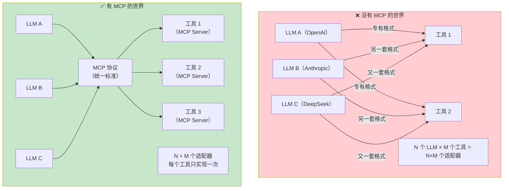
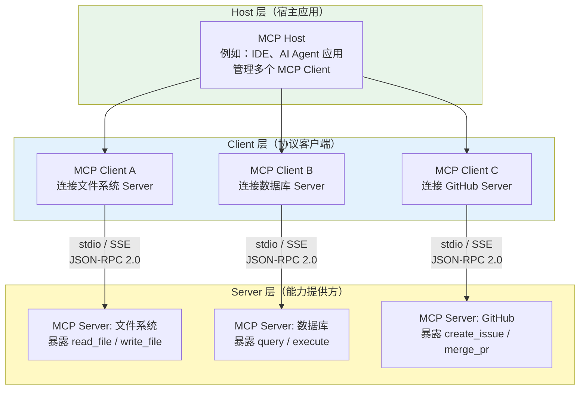
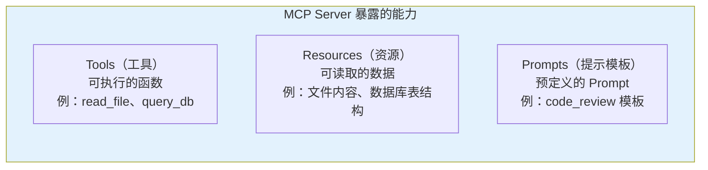
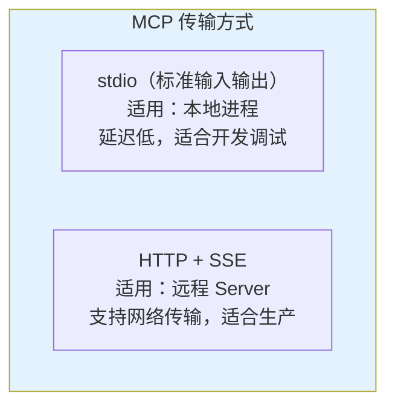
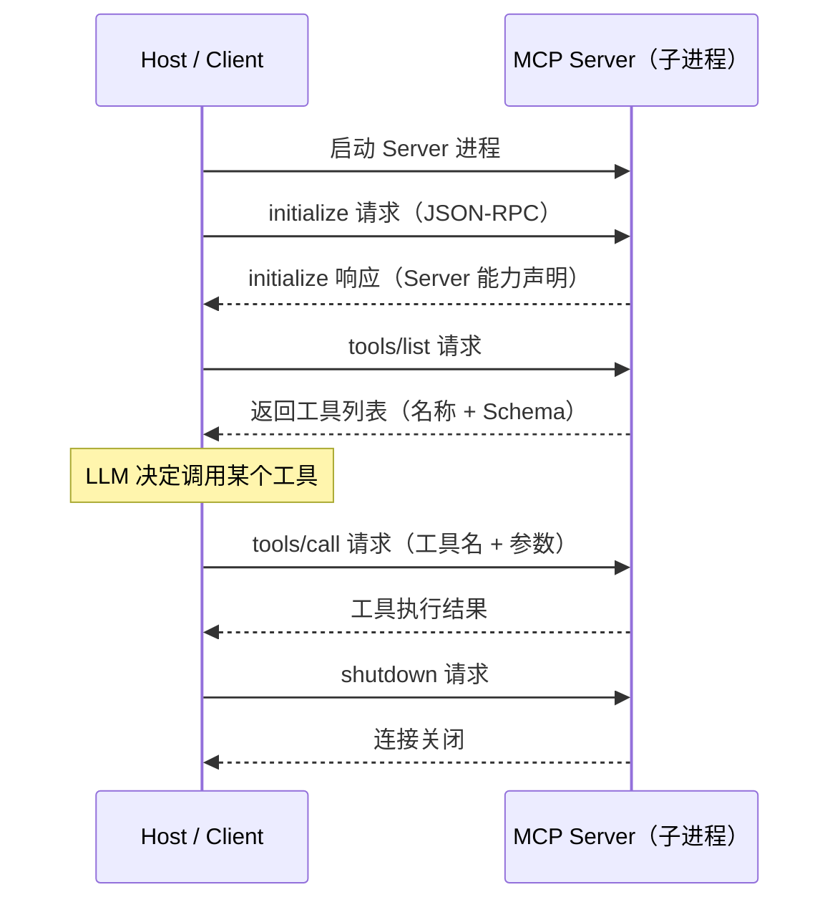
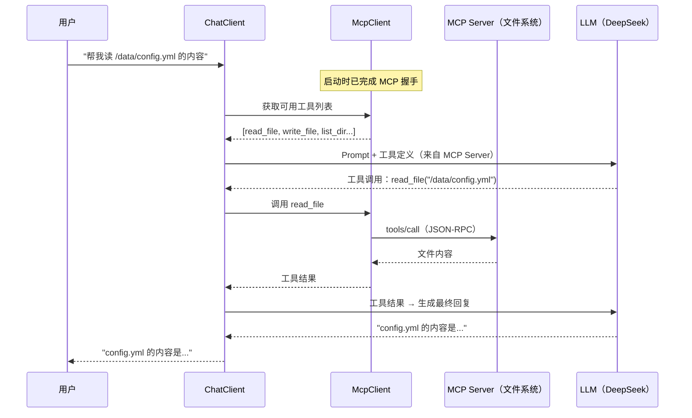
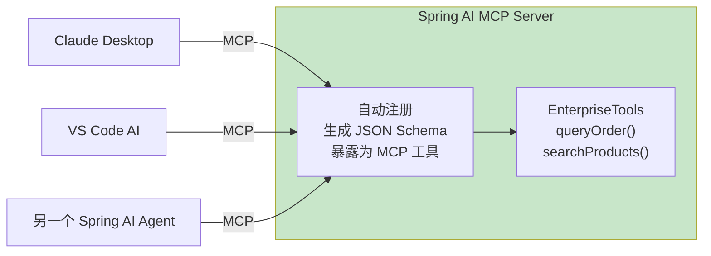
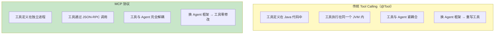
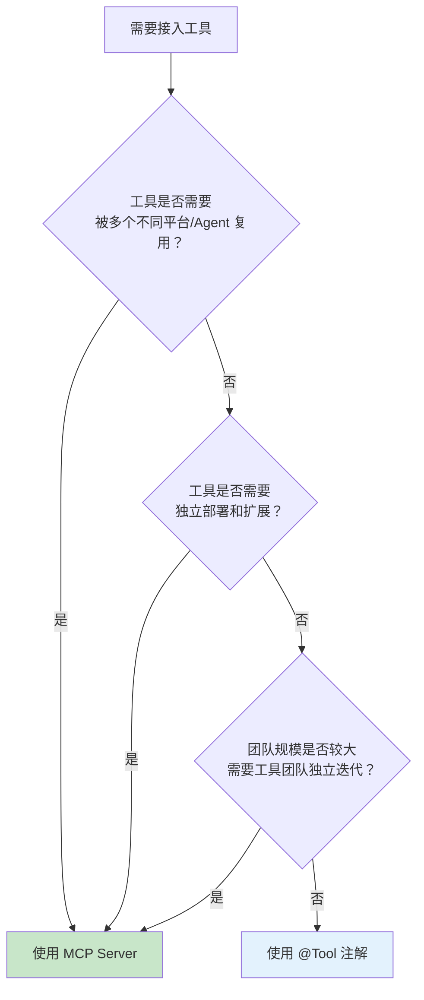
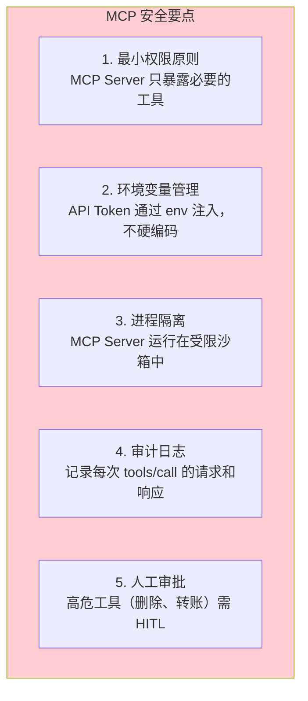

# 10-MCP 协议

> **定位**：讲透 Model Context Protocol（MCP）——它是什么、为什么出现、架构如何设计、Spring AI 2.0 如何支持 MCP 客户端和服务端、MCP 与传统 Tool Calling 的本质区别。读完这篇，你能用 MCP 协议构建标准化的工具生态。
>
> **读者画像**：已经掌握 Tool Calling，需要理解或构建跨平台工具协议的开发者。
>
> **前置阅读**：[03-工具调用](03-工具调用.md)。

---

## 1. MCP 是什么

Model Context Protocol（MCP）是 Anthropic 于 2024 年 11 月开源的一项**标准化协议**，核心目标是解决一个日益严重的问题：每个 LLM 平台都有自己的工具接入方式，每个工具有自己的 API 格式，开发者被迫为不同平台写不同的适配代码。

一句话概括 MCP 的价值：**像 USB-C 统一了接口一样，MCP 统一了 LLM 与外部工具/数据源的连接方式**。



### 1.1 MCP 解决的核心痛点

| 痛点 | 没有 MCP | 有 MCP |
|------|---------|--------|
| **工具复用** | 为 GPT 写的 Function Calling 代码，换到 Claude 要重写 | 写一个 MCP Server，所有支持 MCP 的 LLM 都能用 |
| **工具发现** | 每次都要手动注册工具定义 | MCP Server 自描述能力，客户端自动发现可用工具 |
| **生态隔离** | OpenAI Plugins、Anthropic Tools、Gemini Functions 各搞各的 | 统一协议，工具生态跨平台共享 |
| **安全边界** | 工具直接嵌入 LLM 进程，安全边界模糊 | MCP Server 是独立进程，天然进程级隔离 |

### 1.2 MCP 不是什么

MCP **不是**一个 LLM 调用框架——它不关心你用哪个模型、怎么管理 Prompt、怎么处理流式输出。MCP 只关心一件事：**LLM 客户端如何以标准化的方式发现和调用外部能力**。

MCP 也不替代 Spring AI 的 `@Tool` 注解——`@Tool` 是进程内的工具调用，MCP 是跨进程的工具协议。两者是互补关系，不是替代关系。

---

## 2. MCP 架构：Host / Client / Server

MCP 协议定义了三个核心角色，构成一个清晰的分层架构。



### 2.1 三个角色的职责

| 角色 | 职责 | 类比 |
|------|------|------|
| **Host** | 宿主应用，持有 LLM，管理 Client 生命周期，决定何时调用工具 | 操作系统 |
| **Client** | 协议客户端，与单个 Server 保持 1:1 连接，负责请求/响应的序列化 | 设备驱动 |
| **Server** | 能力提供方，独立进程，暴露 Tools / Resources / Prompts | USB 设备 |

**关键设计原则**：每个 Client 只连接一个 Server（1:1 关系）。Host 可以管理多个 Client，从而同时连接多个 Server。

### 2.2 MCP Server 暴露的三种能力



- **Tools**：有副作用的操作（写入文件、发送请求、修改数据库）。LLM 决定何时调用。
- **Resources**：只读数据源（文件内容、API 文档、数据库 Schema）。Host 决定何时提供给 LLM。
- **Prompts**：预定义的 Prompt 模板，用户可以通过 `/` 命令触发。

### 2.3 通信协议

MCP 使用 **JSON-RPC 2.0** 作为消息格式，支持两种传输方式：



**stdio 模式**的交互流程：



---

## 3. Spring AI 2.0 的 MCP 客户端支持

Spring AI 2.0 提供了完整的 MCP 客户端实现，可以将外部 MCP Server 暴露的工具无缝接入 ChatClient 的工具调用链。

### 3.1 添加 MCP 客户端依赖

```xml
<!-- pom.xml -->
<!-- Spring AI 2.0.0 MCP 客户端 -->
<dependency>
    <groupId>org.springframework.ai</groupId>
    <artifactId>spring-ai-mcp-client-spring-boot-starter</artifactId>
</dependency>
```

### 3.2 配置 MCP Server 连接

```yaml
# application.yml
spring:
  ai:
    mcp:
      client:
        stdio:
          servers-configuration: classpath:mcp-servers.json
```

`src/main/resources/mcp-servers.json`（MCP Server 配置文件）：

```json
{
  "mcpServers": {
    "filesystem": {
      "command": "npx",
      "args": ["-y", "@modelcontextprotocol/server-filesystem", "/data"]
    },
    "github": {
      "command": "npx",
      "args": ["-y", "@modelcontextprotocol/server-github"],
      "env": {
        "GITHUB_TOKEN": "${GITHUB_TOKEN}"
      }
    }
  }
}
```

### 3.3 将 MCP 工具接入 ChatClient

```java
import org.springframework.ai.mcp.McpClient;
import org.springframework.ai.mcp.SyncMcpToolCallbackProvider;

@RestController
public class McpAgentController {

    private final ChatClient chatClient;

    // Spring AI 2.0.0 — 自动注入 McpClient，连接配置的 MCP Server
    public McpAgentController(
            ChatClient.Builder builder,
            McpClient mcpClient) {
        this.chatClient = builder
                // 将 MCP Server 暴露的所有工具注册为 ToolCallback
                .defaultTools(new SyncMcpToolCallbackProvider(mcpClient).getToolCallbacks())
                .build();
    }

    @GetMapping("/agent")
    public String agent(@RequestParam String question) {
        return chatClient.prompt()
                .user(question)
                .call()
                .content();
    }
}
```

这段代码背后的工作流程：



### 3.4 流式 SSE 模式的 MCP 客户端

当 MCP Server 是远程服务时，使用 HTTP + SSE 传输：

```java
import org.springframework.ai.mcp.McpClient;
import org.springframework.ai.mcp.transport.HttpSseClientTransport;

// Spring AI 2.0.0 — 连接远程 MCP Server
@Bean
McpClient remoteMcpClient() {
    return McpClient.create(
            HttpSseClientTransport.builder("https://mcp.example.com")
                    .build()
    );
}
```

---

## 4. Spring AI 2.0 的 MCP 服务端支持

Spring AI 2.0 不仅支持 MCP 客户端（消费工具），还支持 MCP 服务端（提供工具）。这意味着你可以把自己的业务能力暴露为 MCP Server，供任何支持 MCP 的 LLM 客户端使用。

### 4.1 添加 MCP 服务端依赖

```xml
<!-- pom.xml -->
<!-- Spring AI 2.0.0 MCP 服务端 -->
<dependency>
    <groupId>org.springframework.ai</groupId>
    <artifactId>spring-ai-mcp-server-spring-boot-starter</artifactId>
</dependency>
```

### 4.2 配置 MCP Server

```yaml
# application.yml
spring:
  ai:
    mcp:
      server:
        name: "my-enterprise-tools"
        version: "1.0.0"
        type: SYNC
        sse-message-endpoint: /mcp/message
```

### 4.3 定义 MCP 工具

```java
import org.springframework.ai.tool.annotation.Tool;
import org.springframework.ai.tool.annotation.ToolParam;
import org.springframework.ai.mcp.server.autoconfigure.McpServerFeature;
import org.springframework.stereotype.Component;

@Component
public class EnterpriseTools {

    private final OrderService orderService;
    private final ProductService productService;

    public EnterpriseTools(OrderService orderService, ProductService productService) {
        this.orderService = orderService;
        this.productService = productService;
    }

    // Spring AI 2.0.0 — @Tool 自动暴露为 MCP 工具
    @Tool(description = "根据订单号查询订单详情，包括金额、状态和物流")
    public OrderDetail queryOrder(
            @ToolParam(description = "订单号，格式 ORD-XXXXXX") String orderId
    ) {
        return orderService.queryDetail(orderId);
    }

    @Tool(description = "根据关键词搜索产品，返回价格、库存和规格信息")
    public List<Product> searchProducts(
            @ToolParam(description = "搜索关键词") String keyword
    ) {
        return productService.search(keyword);
    }
}
```

Spring AI 自动将这些 `@Tool` 方法注册到 MCP Server，外部 MCP 客户端连接后可以自动发现和调用这些工具。



---

## 5. 自定义 MCP Server：完整示例

假设我们要构建一个企业内部的工单系统 MCP Server，让所有 AI Agent 都能通过 MCP 协议创建和查询工单。

### 5.1 项目结构

```
mcp-ticket-server/
├── pom.xml
├── src/main/java/com/example/mcp/
│   ├── McpServerApplication.java
│   ├── config/
│   │   └── McpServerConfig.java
│   └── tools/
│       └── TicketTools.java
└── src/main/resources/
    └── application.yml
```

### 5.2 核心实现

```java
// McpServerApplication.java
@SpringBootApplication
public class McpServerApplication {
    public static void main(String[] args) {
        SpringApplication.run(McpServerApplication.class, args);
    }
}
```

```java
// TicketTools.java
package com.example.mcp.tools;

import org.springframework.ai.tool.annotation.Tool;
import org.springframework.ai.tool.annotation.ToolParam;
import org.springframework.stereotype.Component;

@Component
public class TicketTools {

    private final TicketService ticketService;

    public TicketTools(TicketService ticketService) {
        this.ticketService = ticketService;
    }

    // Spring AI 2.0.0 — MCP Server 自动暴露此方法
    @Tool(description = "创建售后工单，需要客户ID、问题描述和工单类型")
    public Ticket createTicket(
            @ToolParam(description = "客户 ID") String customerId,
            @ToolParam(description = "问题描述") String description,
            @ToolParam(description = "工单类型：退款、换货、维修、投诉") String type
    ) {
        return ticketService.create(customerId, description, type);
    }

    // Spring AI 2.0.0 — 查询工单状态
    @Tool(description = "根据工单号查询工单当前状态和处理进度")
    public TicketStatus queryTicket(
            @ToolParam(description = "工单号") String ticketId
    ) {
        return ticketService.queryStatus(ticketId);
    }

    // Spring AI 2.0.0 — 列出客户所有工单
    @Tool(description = "列出指定客户的所有工单")
    public List<Ticket> listTickets(
            @ToolParam(description = "客户 ID") String customerId
    ) {
        return ticketService.listByCustomer(customerId);
    }
}
```

```yaml
# application.yml
spring:
  ai:
    mcp:
      server:
        name: "enterprise-ticket-server"
        version: "1.0.0"
        type: SYNC
        sse-message-endpoint: /mcp/message
```

启动后，这个 Spring Boot 应用就是一个完整的 MCP Server，任何 MCP 客户端都能连接它，自动发现 `createTicket`、`queryTicket`、`listTickets` 三个工具。

---

## 6. MCP 与传统 Tool Calling 的关系和区别

这是开发者最常困惑的问题。MCP 和 `@Tool` 不是二选一，而是解决不同层面的问题。

### 6.1 本质区别



### 6.2 详细对比

| 维度 | @Tool（进程内） | MCP（跨进程） |
|------|----------------|--------------|
| **部署方式** | 工具与 Agent 在同一 JVM | 工具在独立进程/远程服务器 |
| **调用方式** | Java 方法直接调用 | JSON-RPC 2.0 协议调用 |
| **性能** | 微秒级（进程内方法调用） | 毫秒级（IPC 或网络开销） |
| **复用性** | 只能被当前 Spring AI 应用使用 | 可被任何 MCP 兼容客户端使用 |
| **安全隔离** | 无进程隔离 | 进程级隔离，权限可控 |
| **开发成本** | 低（注解即可） | 中高（需独立项目 + 协议处理） |
| **适用规模** | 小型项目，工具数量少 | 大型生态，工具跨团队/跨平台共享 |

### 6.3 何时用 @Tool，何时用 MCP



### 6.4 混合使用：最佳实践

实际企业项目中，通常是**混合使用**：核心业务工具用 `@Tool`（性能敏感），通用能力用 MCP Server（生态共享）。

```java
@RestController
public class HybridAgentController {

    private final ChatClient chatClient;

    // Spring AI 2.0.0 — 混合使用 @Tool 和 MCP 工具
    public HybridAgentController(
            ChatClient.Builder builder,
            McpClient mcpClient,
            OrderTools orderTools     // 进程内 @Tool
    ) {
        this.chatClient = builder
                // 进程内工具：订单查询（低延迟，核心业务）
                .defaultTools(orderTools)
                // MCP 工具：文件系统、GitHub 等（生态共享，通用能力）
                .defaultToolCallbacks(
                        new SyncMcpToolCallbackProvider(mcpClient).getToolCallbacks()
                )
                .build();
    }
}
```

从 LLM 的角度看，两种工具没有区别——都是工具列表中的一项。Spring AI 在底层透明地处理：进程内工具走 Java 方法调用，MCP 工具走 JSON-RPC。

---

## 7. MCP 生态现状与安全考量

### 7.1 MCP 生态

截至 2025 年，MCP 生态已有大量社区维护的 Server：

| MCP Server | 能力 | 来源 |
|-----------|------|------|
| filesystem | 文件读写、目录遍历 | 官方 |
| github | 创建 Issue、Merge PR、搜索代码 | 官方 |
| postgres | SQL 查询、Schema 探索 | 官方 |
| google-drive | 搜索和读取 Google Drive 文件 | 社区 |
| slack | 发送消息、搜索频道 | 社区 |
| puppeteer | 浏览器自动化 | 官方 |

### 7.2 安全风险

MCP Server 是独立进程，可以访问文件系统、网络、数据库。安全考量：



> **想深入？→ [附录 08-Agent安全深度/01-ToolPoisoning攻击.md]**：MCP Server 被篡改后的工具投毒攻击与防御方案。

---

## 8. 适用场景与不适用场景

### 适用场景

- 企业内部构建统一工具平台，多个 AI Agent 共享同一套工具
- 需要将工具暴露给第三方 LLM 客户端（如 Claude Desktop、VS Code AI）
- 工具团队与 Agent 团队分离，需要独立部署和迭代
- 开源工具生态贡献——构建 MCP Server 供社区使用
- 需要强安全隔离的场景——工具运行在独立沙箱进程中

### 不适用场景

- 小型项目，工具数量少，没有跨平台复用需求
- 对延迟极度敏感的场景（MCP 的 IPC/网络开销不可忽略）
- 工具逻辑简单，用 `@Tool` 一行注解就能解决
- 单体应用内部，所有工具都在同一个代码仓库

---

## 9. 本章总结

| 概念 | 一句话 |
|------|--------|
| **MCP 协议** | LLM 与外部工具/数据源的标准化连接协议，类比 USB-C |
| **Host** | 宿主应用，持有 LLM，管理多个 MCP Client |
| **Client** | MCP 协议客户端，与单个 Server 保持 1:1 连接 |
| **Server** | 能力提供方，独立进程，暴露 Tools / Resources / Prompts |
| **传输方式** | stdio（本地进程）或 HTTP + SSE（远程服务） |
| **消息格式** | JSON-RPC 2.0 |
| **Spring AI MCP Client** | `McpClient` + `SyncMcpToolCallbackProvider`，将 MCP 工具接入 ChatClient |
| **Spring AI MCP Server** | `@Tool` 自动暴露为 MCP 工具，独立部署后供外部客户端调用 |
| **MCP vs @Tool** | @Tool 是进程内调用（高性能），MCP 是跨进程协议（高复用性）——混合使用是最佳实践 |

---

> **想深入？→ [教程 14-管控分离架构]**：MCP Server 如何实现 Agent 内核与外部能力的完全解耦。
> **想深入？→ [教程 03-工具调用]**：回顾 Tool Calling 机制，理解 MCP 在底层复用了同一套调用循环。
> **想深入？→ [附录 08-Agent安全深度/01-ToolPoisoning攻击.md]**：MCP 安全风险与防御。
