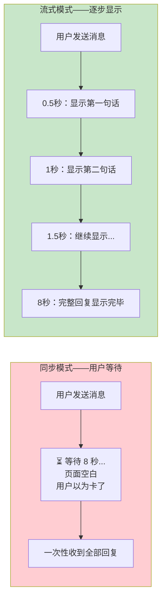
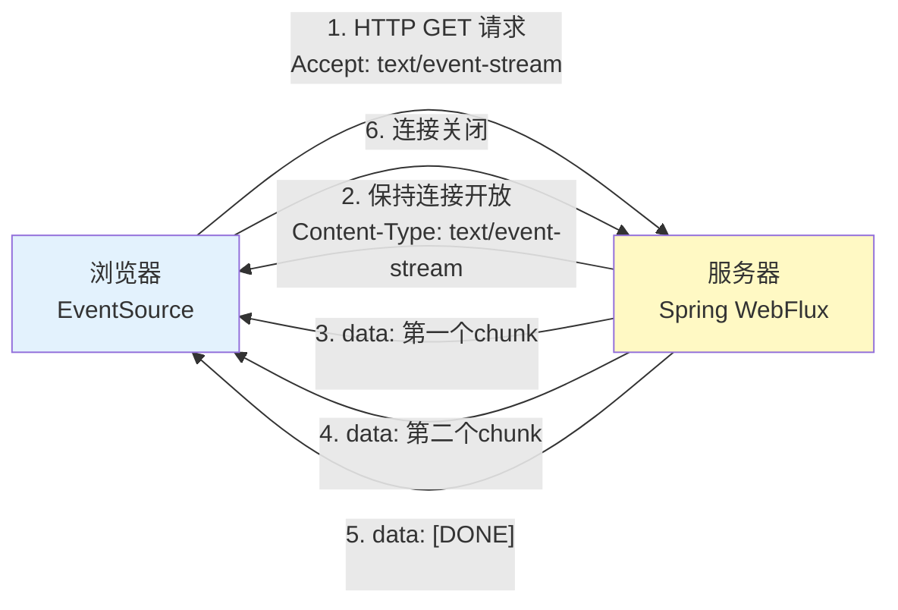
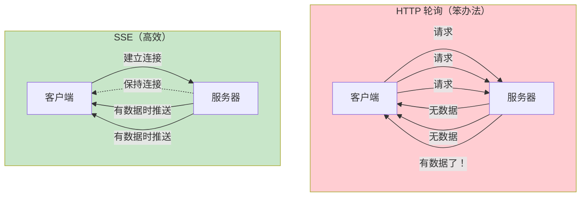
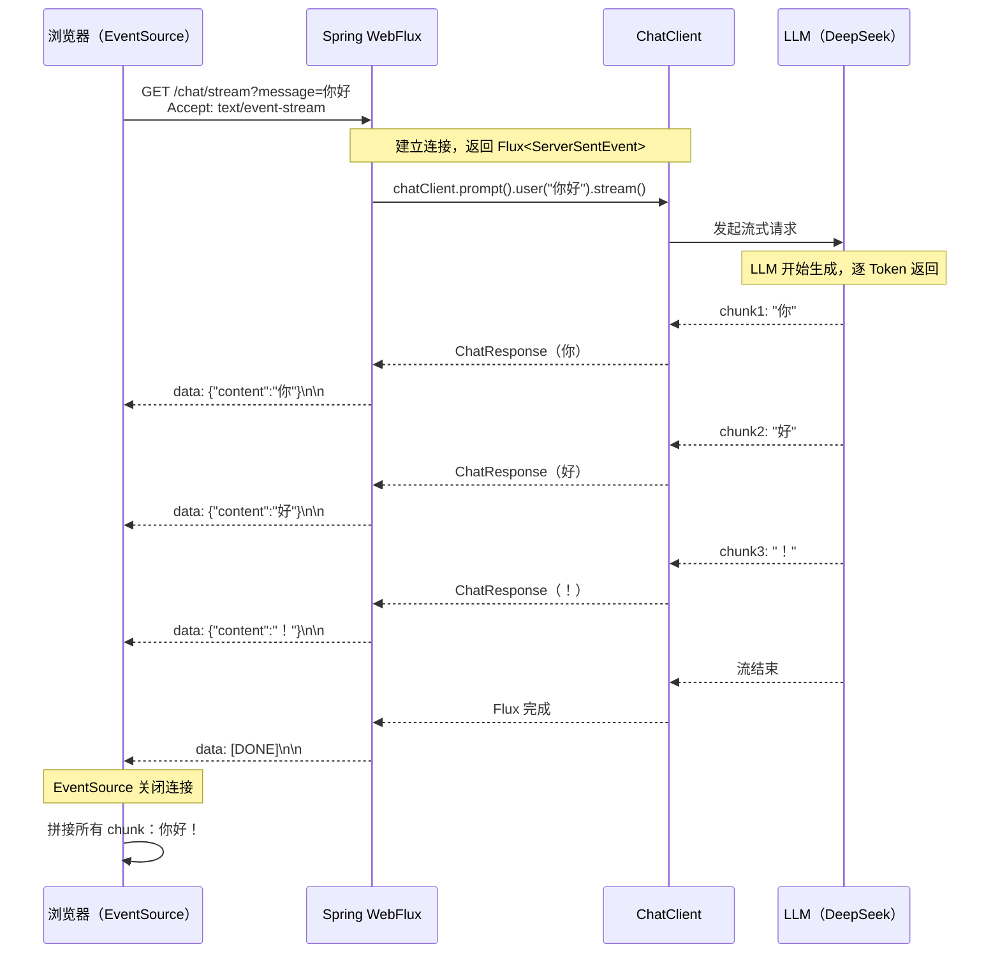
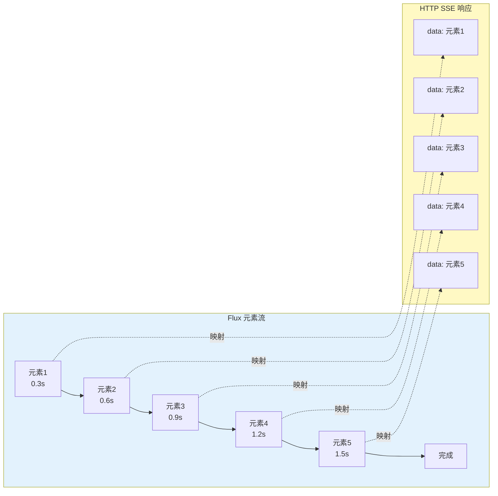
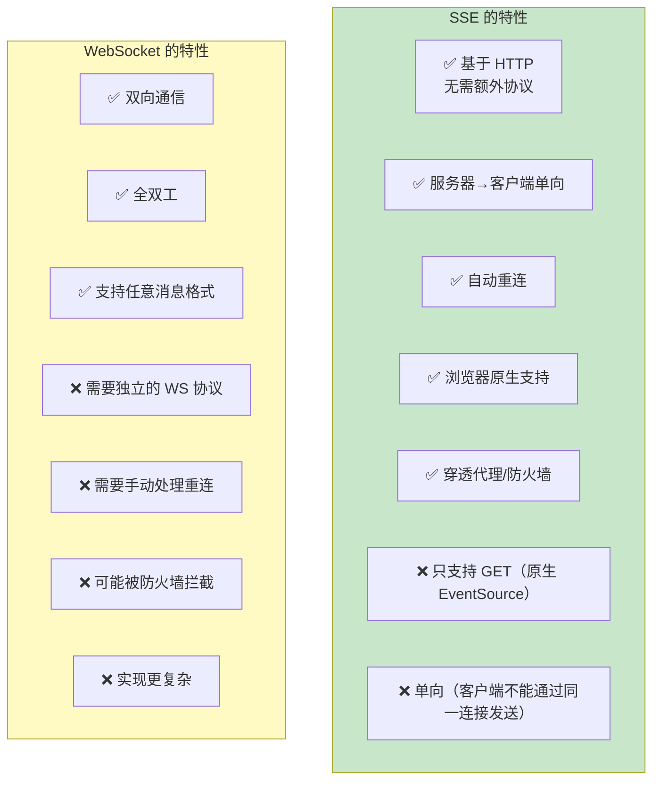
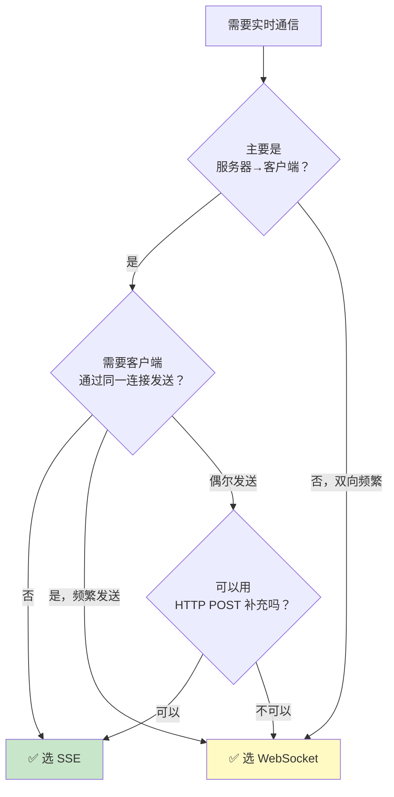

# 09-SSE 流式通信

> **定位**：讲透 SSE（Server-Sent Events）在 Agent 应用中的完整实践——SSE 原理、WebFlux Flux 流式响应、Spring AI 2.0 ChatClient.stream() 的使用、前端 EventSource 对接、与 WebSocket 的对比选型。读完这篇，你能实现"打字机效果"的流式 Agent 回复，让用户不再盯着空白页面等待。
>
> **读者画像**：已经会用 ChatClient 完成同步对话，需要实现流式响应提升用户体验的开发者。
>
> **前置阅读**：[02-ChatClient 与对话模型](02-ChatClient与对话模型.md)。

---

## 1. 为什么需要流式响应

### 1.1 同步响应的痛点

LLM 生成回复需要时间——短则 2-3 秒，长则 30 秒以上。如果用传统的同步 HTTP 请求-响应模式，用户体验是这样的：



**核心区别**：流式响应让用户在 LLM 生成的**同时**就能看到部分结果，而不是等全部生成完才收到。这种"打字机效果"将感知等待时间从"总时长"降低到"首 Token 延迟"（通常 < 1 秒）。

### 1.2 流式响应的技术选项

| 技术 | 方向 | 协议 | 适用场景 |
|------|------|------|---------|
| **SSE** | 服务器→客户端（单向） | HTTP | LLM 流式输出（推荐） |
| **WebSocket** | 双向 | WS | 实时聊天、游戏 |
| **HTTP Chunked** | 服务器→客户端（单向） | HTTP | 文件下载 |
| **gRPC Stream** | 双向 | HTTP/2 | 微服务间通信 |

对于 Agent 应用，**SSE 是最佳选择**——因为 LLM 流式输出是典型的"服务器→客户端单向流"，SSE 就是为这个场景设计的。

---

## 2. SSE 原理

### 2.1 什么是 SSE

SSE（Server-Sent Events）是 HTML5 标准的一部分，允许服务器通过 HTTP 连接**持续推送数据**到客户端。



### 2.2 SSE 的数据格式

SSE 使用极简的文本格式，每个事件由 `data:` 前缀加内容组成，以空行分隔：

```
data: {"content": "你好"}

data: {"content": "，"}

data: {"content": "我是"}

data: {"content": "AI助手"}

data: [DONE]

```

每个 `data:` 行是一个独立的事件。客户端通过 EventSource API 逐个接收这些事件。

### 2.3 SSE vs HTTP 轮询



SSE 只需建立一次连接，服务器有数据时主动推送，避免了轮询的无效请求。

---

## 3. SSE 时序图



---

## 4. Spring AI ChatClient.stream() 的使用

### 4.1 从 .call() 到 .stream()

Spring AI 2.0 的 ChatClient 提供两种调用模式：

```java
import org.springframework.ai.chat.client.ChatClient;
import reactor.core.publisher.Flux;

// Spring AI 2.0.0

// 同步调用——等待完整回复
String result = chatClient.prompt()
        .user("什么是虚拟线程？")
        .call()
        .content();

// 流式调用——逐 chunk 返回
Flux<ChatResponse> stream = chatClient.prompt()
        .user("什么是虚拟线程？")
        .stream()
        .chatResponse();
```

| 方法 | 返回类型 | 行为 |
|------|---------|------|
| `.call()` | 同步结果 | 阻塞直到 LLM 生成完毕 |
| `.stream()` | `Flux<ChatResponse>` | 每个 chunk 是一个 ChatResponse |

### 4.2 基本流式 Controller

```java
import org.springframework.http.MediaType;
import org.springframework.web.bind.annotation.*;
import reactor.core.publisher.Flux;
import org.springframework.ai.chat.client.ChatClient;

// Spring AI 2.0.0 — 基本流式 Controller
@RestController
public class StreamChatController {

    private final ChatClient chatClient;

    public StreamChatController(ChatClient chatClient) {
        this.chatClient = chatClient;
    }

    @GetMapping(value = "/chat/stream", produces = MediaType.TEXT_EVENT_STREAM_VALUE)
    public Flux<String> stream(@RequestParam String message) {
        return chatClient.prompt()
                .user(message)
                .stream()
                .content();  // 返回 Flux<String>，每个元素是一个文本 chunk
    }
}
```

关键点：`produces = MediaType.TEXT_EVENT_STREAM_VALUE` 告诉 Spring WebFlux 这是一个 SSE 端点。Spring Boot 会自动设置正确的 HTTP Headers（`Content-Type: text/event-stream`）并将 `Flux<String>` 格式化为 SSE 事件。

### 4.3 结构化 SSE 事件

直接返回 `Flux<String>` 虽然简单，但前端拿到的只有纯文本。如果需要携带更多元数据（如 chunk 序号、是否结束），用 `ServerSentEvent` 包装：

```java
import org.springframework.http.codec.ServerSentEvent;

// Spring AI 2.0.0 — 结构化 SSE 事件
@GetMapping(value = "/chat/stream", produces = MediaType.TEXT_EVENT_STREAM_VALUE)
public Flux<ServerSentEvent<String>> stream(@RequestParam String message) {
    return chatClient.prompt()
            .user(message)
            .stream()
            .content()
            .map(chunk -> ServerSentEvent.<String>builder()
                    .event("message")              // 事件类型
                    .id(String.valueOf(System.currentTimeMillis()))  // 事件 ID
                    .data(chunk)                    // 事件数据
                    .build())
            .concatWith(Flux.just(
                    ServerSentEvent.<String>builder()
                            .event("done")          // 结束事件
                            .data("[DONE]")
                            .build()
            ));
}
```

前端可以根据 `event` 字段区分不同事件类型：

```javascript
const eventSource = new EventSource("/chat/stream?message=你好");

eventSource.addEventListener("message", (event) => {
    // 收到一个文本 chunk
    appendToUI(event.data);
});

eventSource.addEventListener("done", (event) => {
    // 流结束
    eventSource.close();
    hideLoadingIndicator();
});
```

### 4.4 带错误处理的流式响应

```java
// Spring AI 2.0.0 — 完整的错误处理
@GetMapping(value = "/chat/stream", produces = MediaType.TEXT_EVENT_STREAM_VALUE)
public Flux<ServerSentEvent<String>> stream(@RequestParam String message) {
    return chatClient.prompt()
            .user(message)
            .stream()
            .content()
            .map(chunk -> ServerSentEvent.<String>builder()
                    .event("message")
                    .data(chunk)
                    .build())
            .onErrorResume(error -> {
                // 发生错误时发送错误事件，而不是直接断开连接
                return Flux.just(
                        ServerSentEvent.<String>builder()
                                .event("error")
                                .data("生成失败：" + error.getMessage())
                                .build()
                );
            })
            .concatWith(Flux.just(
                    ServerSentEvent.<String>builder()
                            .event("done")
                            .data("[DONE]")
                            .build()
            ));
}
```

```javascript
eventSource.addEventListener("error", (event) => {
    showErrorToUI(event.data);     // 显示错误信息
    eventSource.close();
});
```

---

## 5. WebFlux Flux 流式响应深入

### 5.1 Flux 的流式语义

`Flux<T>` 是 Reactor 中的异步序列，代表 0 到 N 个元素的流。在 WebFlux 中，`Flux` 被直接映射为 SSE 流：



每个 Flux 元素在发出的瞬间，就被写入 HTTP 响应体——不需要等所有元素都就绪。

### 5.2 链式操作

Flux 支持丰富的链式操作，可以在流式传输过程中做处理：

```java
// Spring AI 2.0.0 — Flux 链式处理
@GetMapping(value = "/chat/stream", produces = MediaType.TEXT_EVENT_STREAM_VALUE)
public Flux<String> stream(@RequestParam String message) {
    return chatClient.prompt()
            .user(message)
            .stream()
            .content()
            // 过滤空 chunk
            .filter(chunk -> chunk != null && !chunk.isBlank())
            // 缓冲：每 3 个 chunk 合并一次（减少前端渲染次数）
            .buffer(3)
            .map(chunks -> String.join("", chunks))
            // 背压：每 50ms 最多发一个事件（控制流速）
            .delayElements(Duration.ofMillis(50));
}
```

### 5.3 合并多个流

在多 Agent 场景中，你可能需要将多个 Agent 的流式输出合并：

```java
// Spring AI 2.0.0 — 合并多个 Agent 的流
@GetMapping(value = "/chat/stream", produces = MediaType.TEXT_EVENT_STREAM_VALUE)
public Flux<String> multiAgentStream(@RequestParam String message) {
    Flux<String> researchStream = researchAgent.prompt()
            .user("研究：" + message)
            .stream()
            .content()
            .map(chunk -> "[研究] " + chunk);

    Flux<String> analysisStream = analysisAgent.prompt()
            .user("分析：" + message)
            .stream()
            .content()
            .map(chunk -> "[分析] " + chunk);

    // 交替合并两个流
    return researchStream.mergeWith(analysisStream);
}
```

### 5.4 会话记忆 + 流式

在流式模式下，记忆管理需要特别注意——因为流式调用不会自动写入记忆（同步调用会通过 ChatMemory Advisor 自动存储）：

```java
// Spring AI 2.0.0 — 流式 + 会话记忆
@GetMapping(value = "/chat/stream", produces = MediaType.TEXT_EVENT_STREAM_VALUE)
public Flux<String> streamWithMemory(
        @RequestParam String message,
        @RequestParam String sessionId
) {
    return chatClient.prompt()
            .user(message)
            .advisors(spec -> spec.param(ChatMemory.CONVERSATION_ID, sessionId))
            .stream()
            .content()
            // 流式模式下，记忆 Advisor 会在流完成后自动存储完整回复
            // 前端会在流结束时收到所有 chunk
            .doOnComplete(() -> {
                log.info("Session {} stream completed", sessionId);
            })
            .doOnError(error -> {
                log.error("Session {} stream error", sessionId, error);
            });
}
```

> → [教程 04-记忆与会话管理]：ChatMemory 的完整机制。

---

## 6. 前端 EventSource 对接

### 6.1 基本用法

```javascript
// 前端 JavaScript — EventSource 对接 SSE

function streamChat(message) {
    // 显示加载状态
    showLoadingIndicator();

    // 创建 EventSource 连接
    const eventSource = new EventSource(
        `/chat/stream?message=${encodeURIComponent(message)}`
    );

    let fullResponse = "";

    // 接收消息事件
    eventSource.onmessage = function(event) {
        if (event.data === "[DONE]") {
            // 流结束
            eventSource.close();
            hideLoadingIndicator();
            console.log("完整回复：", fullResponse);
            return;
        }
        // 追加内容到 UI
        fullResponse += event.data;
        appendToUI(event.data);
    };

    // 错误处理
    eventSource.onerror = function(event) {
        console.error("SSE 连接错误");
        eventSource.close();
        hideLoadingIndicator();
        showError("连接中断，请重试");
    };
}

// 使用
streamChat("什么是虚拟线程？");
```

### 6.2 使用 POST 请求的 SSE

EventSource 原生只支持 GET 请求。如果需要发送 POST 请求（如携带复杂 JSON Body），使用 `fetch` + ReadableStream：

```javascript
// 前端 JavaScript — 用 fetch 实现 SSE（支持 POST）

async function streamChatPost(message, sessionId) {
    const response = await fetch("/chat/stream", {
        method: "POST",
        headers: { "Content-Type": "application/json" },
        body: JSON.stringify({ message, sessionId })
    });

    const reader = response.body.getReader();
    const decoder = new TextDecoder();

    let fullResponse = "";
    let buffer = "";

    while (true) {
        const { done, value } = await reader.read();
        if (done) break;

        buffer += decoder.decode(value, { stream: true });

        // 按 SSE 格式分割（双换行分隔事件）
        const events = buffer.split("\n\n");
        buffer = events.pop(); // 最后一个可能不完整，留在 buffer

        for (const event of events) {
            const lines = event.split("\n");
            for (const line of lines) {
                if (line.startsWith("data: ")) {
                    const data = line.slice(6);
                    if (data === "[DONE]") {
                        return fullResponse;
                    }
                    fullResponse += data;
                    appendToUI(data);
                }
            }
        }
    }
    return fullResponse;
}
```

Spring 端对应 POST 端点：

```java
// Spring AI 2.0.0 — POST 流式端点
@PostMapping(value = "/chat/stream", produces = MediaType.TEXT_EVENT_STREAM_VALUE)
public Flux<String> streamPost(@RequestBody ChatRequest request) {
    return chatClient.prompt()
            .user(request.message())
            .advisors(spec -> spec.param(ChatMemory.CONVERSATION_ID, request.sessionId()))
            .stream()
            .content();
}

public record ChatRequest(String message, String sessionId) {}
```

### 6.3 自动重连

SSE 的 EventSource 原生支持自动重连。服务器断连后，浏览器会在几秒后自动重新连接：

```javascript
const eventSource = new EventSource("/chat/stream?message=你好");

eventSource.onopen = function() {
    console.log("SSE 连接已建立");
};

eventSource.onerror = function(event) {
    // EventSource 会自动尝试重连
    // readyState: 0=连接中, 1=已连接, 2=已关闭
    if (eventSource.readyState === EventSource.CLOSED) {
        console.log("连接已关闭，不再重连");
    } else {
        console.log("连接断开，将自动重连...");
    }
};
```

你可以在服务端通过 `retry:` 字段控制重连间隔：

```java
// 在 Flux 的开头发送 retry 指令
Flux<ServerSentEvent<String>> stream = chatClient.prompt()
        .user(message)
        .stream()
        .content()
        .map(chunk -> ServerSentEvent.<String>builder().data(chunk).build())
        .startWith(
                ServerSentEvent.<String>builder()
                        .retry(Duration.ofSeconds(3))  // 重连间隔 3 秒
                        .comment("retry-config")
                        .build()
        );
```

### 6.4 React 中的使用

```jsx
// React 组件 — SSE 流式聊天
import { useState, useRef } from 'react';

function ChatComponent() {
    const [messages, setMessages] = useState([]);
    const [streamingText, setStreamingText] = useState("");
    const eventSourceRef = useRef(null);

    const sendMessage = (text) => {
        // 添加用户消息
        setMessages(prev => [...prev, { role: 'user', content: text }]);
        setStreamingText("");

        // 建立 SSE 连接
        const eventSource = new EventSource(
            `/chat/stream?message=${encodeURIComponent(text)}`
        );
        eventSourceRef.current = eventSource;

        let buffer = "";

        eventSource.onmessage = (event) => {
            if (event.data === "[DONE]") {
                eventSource.close();
                setMessages(prev => [...prev, { role: 'assistant', content: buffer }]);
                setStreamingText("");
                return;
            }
            buffer += event.data;
            setStreamingText(buffer);  // 实时更新打字机效果
        };

        eventSource.onerror = () => {
            eventSource.close();
            setStreamingText("");
        };
    };

    const stopStream = () => {
        eventSourceRef.current?.close();
    };

    return (
        <div>
            {messages.map((msg, i) => (
                <div key={i} className={msg.role}>{msg.content}</div>
            ))}
            {streamingText && <div className="assistant streaming">{streamingText}</div>}
            <button onClick={() => sendMessage("你好")}>发送</button>
            <button onClick={stopStream}>停止</button>
        </div>
    );
}
```

---

## 7. SSE vs WebSocket：如何选型

### 7.1 技术对比



### 7.2 详细对比表

| 维度 | SSE | WebSocket |
|------|-----|-----------|
| **通信方向** | 单向（服务器→客户端） | 双向 |
| **底层协议** | HTTP | 独立的 WS 协议 |
| **浏览器支持** | EventSource（原生） | WebSocket（原生） |
| **自动重连** | 内置 | 需手动实现 |
| **代理/防火墙** | 友好（走 HTTP） | 可能被拦截 |
| **连接数限制** | 浏览器对同源有 6 连接限制 | 无特殊限制 |
| **消息格式** | 文本（text/event-stream） | 文本和二进制 |
| **实现复杂度** | 低 | 中 |
| **适合场景** | LLM 流式输出、通知推送 | 实时聊天、游戏、协同编辑 |

### 7.3 决策树



### 7.4 Agent 场景下的选择

对于 Agent 应用，绝大多数场景**SSE 是正确的选择**：

- **Agent 回复** → SSE（LLM 输出是服务器→客户端的单向流）
- **用户输入** → 普通 HTTP POST（一次性发送，不需要保持连接）
- **会话管理** → REST API（创建/查询/删除会话）

只有以下场景才需要 WebSocket：
- 多人实时协作（需要双向频繁通信）
- Agent 需要主动推送通知（如异步任务完成通知）
- 游戏或实时交互场景

---

## 8. 完整示例：流式聊天 Controller

```java
import org.springframework.ai.chat.client.ChatClient;
import org.springframework.ai.chat.client.advisor.MessageChatMemoryAdvisor;
import org.springframework.ai.chat.memory.ChatMemory;
import org.springframework.ai.chat.memory.MessageWindowChatMemory;
import org.springframework.ai.chat.memory.repository.InMemoryChatMemoryRepository;
import org.springframework.http.MediaType;
import org.springframework.http.codec.ServerSentEvent;
import org.springframework.web.bind.annotation.*;
import reactor.core.publisher.Flux;
import java.time.Duration;

// Spring AI 2.0.0 — 完整的流式聊天 Controller
@RestController
@RequestMapping("/api/chat")
public class StreamChatController {

    private final ChatClient chatClient;

    public StreamChatController(ChatClient.Builder builder) {
        this.chatClient = builder
                .defaultSystem("你是一个智能助手，用中文回答用户问题。")
                .defaultAdvisors(
                        // 真实组合: MessageWindowChatMemory(窗口策略) + InMemoryChatMemoryRepository(存储)
                        // 参考 [附录 05-SpringAI2-API基准/00-Advisor与ChatMemory]
                        MessageChatMemoryAdvisor.builder(
                                MessageWindowChatMemory.builder()
                                        .chatMemoryRepository(new InMemoryChatMemoryRepository())
                                        .maxMessages(20)
                                        .build())
                                .build()
                )
                .build();
    }

    // GET 方式（简单场景）
    @GetMapping(value = "/stream", produces = MediaType.TEXT_EVENT_STREAM_VALUE)
    public Flux<ServerSentEvent<String>> streamGet(
            @RequestParam String message,
            @RequestParam(required = false, defaultValue = "default") String sessionId
    ) {
        return buildStream(message, sessionId);
    }

    // POST 方式（推荐——支持复杂请求体）
    @PostMapping(value = "/stream", produces = MediaType.TEXT_EVENT_STREAM_VALUE)
    public Flux<ServerSentEvent<String>> streamPost(
            @RequestBody ChatRequest request
    ) {
        return buildStream(request.message(), request.sessionId());
    }

    private Flux<ServerSentEvent<String>> buildStream(String message, String sessionId) {
        return chatClient.prompt()
                .user(message)
                .advisors(spec -> spec.param(ChatMemory.CONVERSATION_ID, sessionId))
                .stream()
                .content()
                .filter(chunk -> chunk != null && !chunk.isEmpty())
                .map(chunk -> ServerSentEvent.<String>builder()
                        .event("message")
                        .data(chunk)
                        .build())
                .onErrorResume(error -> Flux.just(
                        ServerSentEvent.<String>builder()
                                .event("error")
                                .data("服务暂时不可用：" + error.getMessage())
                                .build()
                ))
                .concatWith(Flux.just(
                        ServerSentEvent.<String>builder()
                                .event("done")
                                .data("[DONE]")
                                .build()
                ));
    }

    public record ChatRequest(String message, String sessionId) {}
}
```

---

## 9. 流式响应的注意事项

### 9.1 代理和超时

很多反向代理（Nginx、API Gateway）有默认的响应超时和缓冲设置。流式响应需要特殊配置：

```nginx
# Nginx 配置——禁用缓冲，延长超时
location /chat/stream {
    proxy_pass http://backend;
    proxy_set_header Connection '';
    proxy_http_version 1.1;
    proxy_buffering off;        # 关闭缓冲——关键！
    proxy_cache off;            # 关闭缓存
    chunked_transfer_encoding on;
    proxy_read_timeout 300s;    # 延长读超时到 5 分钟
}
```

如果 `proxy_buffering` 没有关闭，Nginx 会缓存整个响应，等 LLM 生成完才一次性发给客户端——完全失去流式效果。

### 9.2 浏览器连接数限制

HTTP/1.1 下，浏览器对同一域名的并发连接数有限制（通常 6 个）。如果多个标签页同时建立 SSE 连接，可能耗尽连接池。解决方案：

- 使用 HTTP/2（多路复用，无连接数限制）
- 用单个 SSE 连接 + 消息复用（一个连接服务多个会话）

### 9.3 心跳保活

长时间没有数据的 SSE 连接可能被中间代理断开。定期发送心跳保持连接：

```java
// Spring AI 2.0.0 — SSE 心跳保活
private Flux<ServerSentEvent<String>> buildStream(String message, String sessionId) {
    // 心跳流：每 15 秒发一个注释事件（不影响前端）
    Flux<ServerSentEvent<String>> heartbeat = Flux.interval(Duration.ofSeconds(15))
            .map(i -> ServerSentEvent.<String>builder()
                    .comment("heartbeat")  // 注释事件，前端不处理
                    .build());

    // 数据流
    Flux<ServerSentEvent<String>> data = chatClient.prompt()
            .user(message)
            .stream()
            .content()
            .map(chunk -> ServerSentEvent.<String>builder().data(chunk).build())
            .concatWith(Flux.just(
                    ServerSentEvent.<String>builder().event("done").data("[DONE]").build()
            ));

    // 合并：心跳和数据流交替
    return heartbeat.mergeWith(data)
            .takeUntil(event -> "done".equals(event.event()));
}
```

### 9.4 客户端取消请求

用户点击"停止"按钮时，前端应主动关闭 SSE 连接：

```javascript
let currentEventSource = null;

function startStream(message) {
    currentEventSource = new EventSource(`/chat/stream?message=${message}`);
    // ...
}

function stopStream() {
    if (currentEventSource) {
        currentEventSource.close();  // 主动关闭连接
        currentEventSource = null;
    }
}
```

服务端可以通过 `Flux.doOnCancel()` 感知到客户端断开：

```java
return chatClient.prompt()
        .user(message)
        .stream()
        .content()
        .doOnCancel(() -> {
            log.info("客户端取消了流式请求，session={}", sessionId);
            // 可以在这里保存已生成的部分内容到记忆中
        });
```

---

## 10. 适用场景与不适用场景

### 适用场景

- LLM 对话流式输出（打字机效果，减少感知等待时间）
- RAG 检索增强生成（检索完成后流式输出分析结果）
- 长文本生成（报告、邮件、文章——边生成边显示）
- 实时通知推送（任务完成、状态变更通知）
- 多 Agent 协作过程的实时展示（显示每个 Agent 的输出进度）

### 不适用场景

- 需要客户端频繁向服务器发送数据（用 WebSocket 或 HTTP POST）
- 需要二进制数据传输（用 WebSocket）
- 需要精确的事务保证（SSE 是单向流，不适合两阶段提交等场景）
- 极低延迟的实时交互（如游戏——用 WebSocket 或 WebRTC）
- 单次响应非常短（如只需 0.5 秒——同步调用更简单）

---

## 11. 本章总结

| 概念 | 一句话 |
|------|--------|
| **SSE** | 基于 HTTP 的服务器→客户端单向流式推送，是 LLM 流式输出的最佳选择 |
| **ChatClient.stream()** | Spring AI 2.0 的流式调用，返回 `Flux<ChatResponse>` |
| **TEXT_EVENT_STREAM_VALUE** | SSE 的 Content-Type，Spring Boot 自动将 Flux 格式化为 SSE |
| **ServerSentEvent** | SSE 事件的包装类，支持 event/id/data/retry 字段 |
| **EventSource** | 浏览器原生 SSE 客户端 API（只支持 GET） |
| **fetch + ReadableStream** | 支持 POST 的 SSE 客户端方案 |
| **Flux 链式操作** | filter/buffer/delayElements/onErrorResume 等流处理 |
| **心跳保活** | 定期发送注释事件，防止代理断开空闲连接 |
| **proxy_buffering off** | Nginx 必须关闭缓冲才能正常流式传输 |
| **vs WebSocket** | SSE 适合单向推送（LLM 输出），WebSocket 适合双向频繁通信 |

**下一篇**：[13-结构化输出](13-结构化输出.md) — 让 Agent 输出可靠的 JSON、Entity 映射、输出校验。

---

> → [教程 02-ChatClient 与对话模型]：ChatClient 的完整 API、同步/流式调用的基础。
> → [教程 24-多页面流式响应与会话管理]：多标签页 SSE 连接管理、会话隔离。
> 想深入？→ [教程 10-SSE流式通信（协议细节）与 [附录 14-Agent交互设计/00-Agent用户体验设计]（交互层）]：SSE 协议的完整规范和浏览器兼容性。
> 遇到阻塞？→ [教程 42-响应式错误处理]（背压与流中断）与 [教程 38-Agent性能优化]（连接池与超时）。
