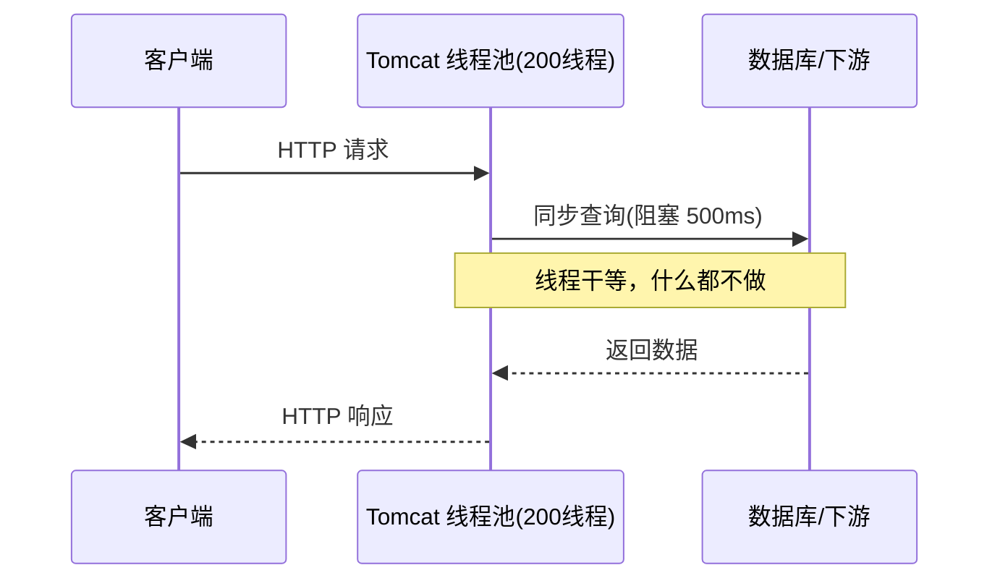
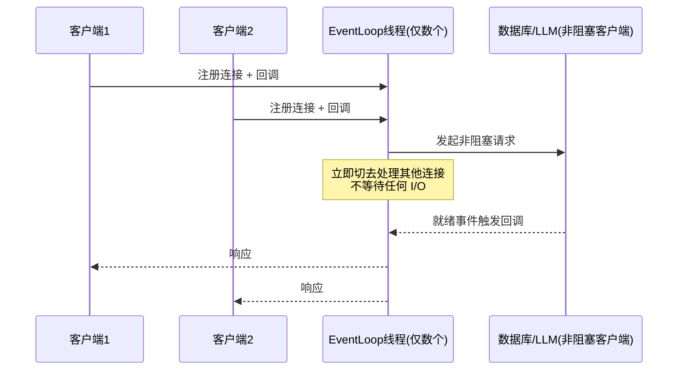
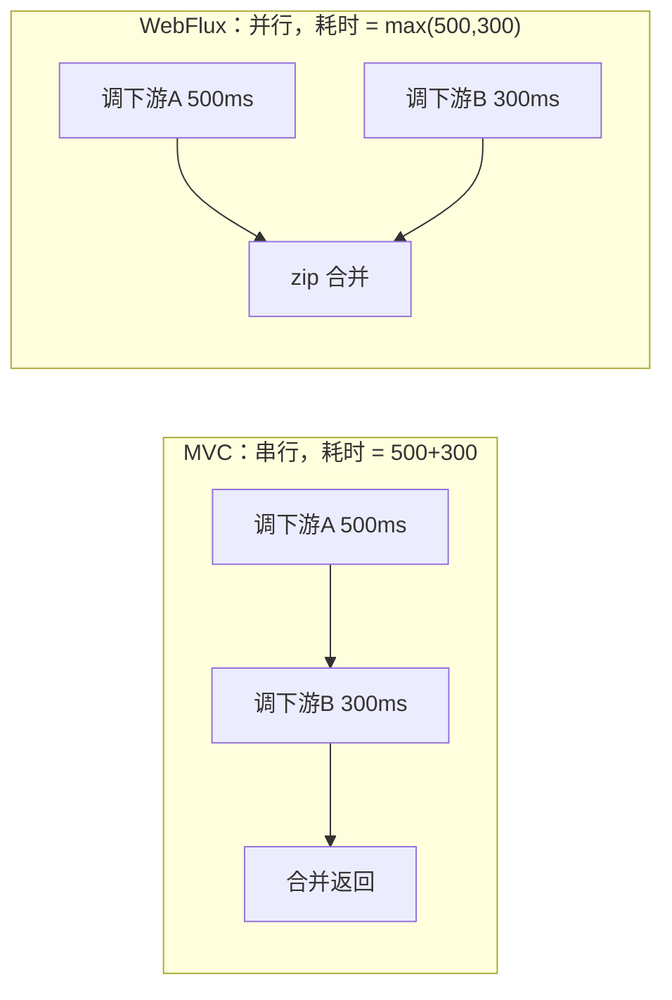
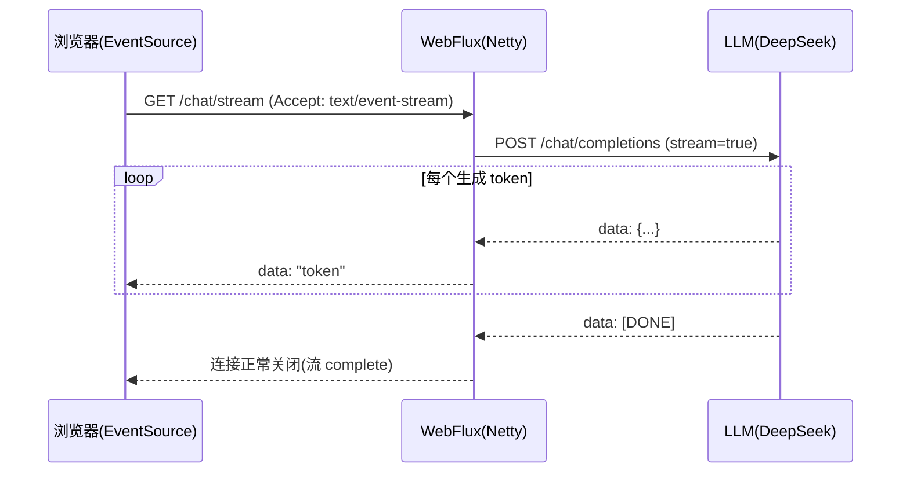
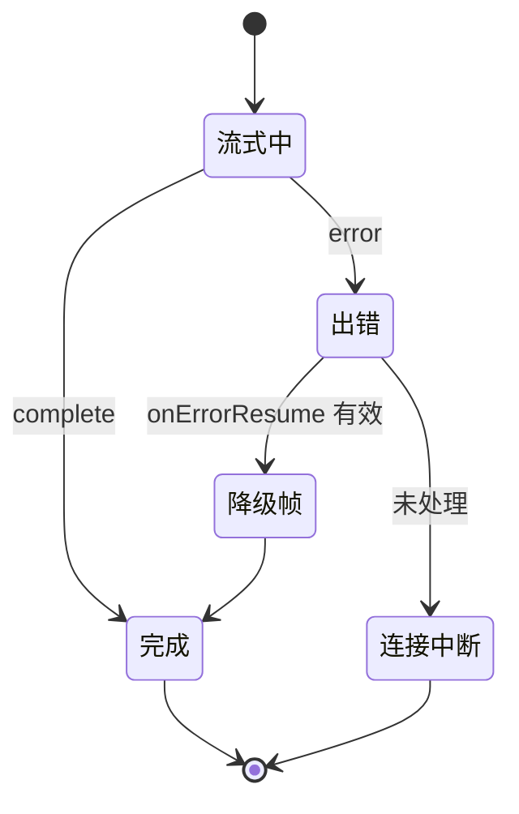

# WebFlux 从零入门：响应式 Web 框架的第一课

> **定位**：本系列**第一篇**，面向**从未接触过响应式编程的 Java 开发者**，从"为什么需要 WebFlux"讲到"能独立写出一个流式 SSE 接口"。无需任何前置——本文自带 Mono/Flux 最小铺垫；读完若需操作符全集，继续 `[教程 11-Reactor核心]`。技术栈锁定：Spring Boot 4.1.0（Spring Framework 7.0.8）+ reactor-core 3.8.6（Boot 4.1.0 管理 `reactor-bom 2025.0.6`）。

---

## 1. 为什么会有 WebFlux：从线程模型说起

### 1.1 传统 Servlet 模型（Spring MVC）的困境

你写了多年的 Spring MVC，本质是这个模型：



关键矛盾：**一个请求占用一个线程，线程在等 I/O 时完全闲置**。Tomcat 默认 200 线程，意味着最多 200 个并发请求。如果每个请求要等 LLM 返回 30 秒，第 201 个用户直接被拒绝。

线程是昂贵资源：每个线程约 1MB 栈内存，线程间上下文切换有内核开销。**用 200 个昂贵的线程去"排队等 I/O"，是资源的巨大浪费。**

### 1.2 WebFlux 的答案：少量线程 + 事件循环

WebFlux 基于 Reactor Netty，用 **EventLoop（事件循环）** 模型：极少量线程（默认 = CPU 核数）通过非阻塞 I/O 同时服务成千上万个连接。



**一句话总结**：MVC 用"人多（线程多）"换吞吐，WebFlux 用"人不等（非阻塞）"换吞吐。这就是 Agent 场景选 WebFlux 的根本原因——LLM 调用是典型的长 I/O 等待，WebFlux 让服务器在等 LLM 的同时能继续服务其他用户。

### 1.3 适用场景与不适用场景

**适用场景**：
- LLM Agent 服务：大量长连接、SSE 流式输出、单次推理动辄数秒到数十秒
- 高并发 I/O 密集型 API 网关：聚合多个下游服务
- 实时推送：聊天、通知、协作编辑

**不适用场景**：
- CPU 密集型计算（少数 EventLoop 线程会被算力占满，反而更糟）
- 团队代码强依赖阻塞库（JDBC、老旧 SDK）且无法替换——半阻塞的 WebFlux 比纯 MVC 更危险
- 简单 CRUD 内部管理系统：MVC 更直观，团队维护成本低

---

## 2. 最小可运行工程：5 分钟跑起来

### 2.1 pom.xml（与本项目 pom 一致）

```xml
<parent>
    <groupId>org.springframework.boot</groupId>
    <artifactId>spring-boot-starter-parent</artifactId>
    <version>4.1.0</version>
</parent>

<dependencies>
    <dependency>
        <groupId>org.springframework.boot</groupId>
        <artifactId>spring-boot-starter-webflux</artifactId>
    </dependency>
</dependencies>
```

注意：**不需要 web-starter（MVC）**，两者互斥；同时引入时 Boot 4 默认以 MVC 生效（可通过 `spring.main.web-application-type=reactive` 强制 WebFlux）。

### 2.2 启动类与第一个响应式接口

```java
// Spring Boot 4.1.0 / Spring Framework 7.0.8
package demo.demo01;

import org.springframework.boot.SpringApplication;
import org.springframework.boot.autoconfigure.SpringBootApplication;
import org.springframework.web.bind.annotation.GetMapping;
import org.springframework.web.bind.annotation.RestController;
import reactor.core.publisher.Mono;

@SpringBootApplication
public class Demo01Application {
    public static void main(String[] args) {
        SpringApplication.run(Demo01Application.class, args);
    }
}

@RestController
class HelloController {

    @GetMapping("/hello")
    Mono<String> hello() {
        // 返回 Mono<String>：声明"未来会有一个 String"
        // 返回时连接不占线程，subscribe 发生在框架内部
        return Mono.just("Hello, WebFlux!");
    }
}
```

启动日志会看到 `Netty started on port 8080`（而非 Tomcat）——这就是 Reactor Netty 在工作。

`curl http://localhost:8080/hello` 返回 `Hello, WebFlux!`。

### 2.3 关键心智模型：Mono/Flux 是"待办清单"，不是"结果"

刚从 MVC 转过来的最大思维陷阱：

| MVC 思维 | WebFlux 思维 |
|---|---|
| 方法返回值 = 数据本身 | 方法返回值 = **数据的"配方"**（异步管道） |
| 方法执行完，数据已就绪 | 方法返回时**什么都没发生**，订阅（subscribe）时才执行 |
| 调下游 = 阻塞等结果 | 调下游 = 把"等结果后做什么"编入管道 |

```java
// MVC：立即执行，线程阻塞 500ms
String data = restTemplate.getForObject(url, String.class);

// WebFlux：立即返回（微秒级），数据到达后回调处理
Mono<String> dataMono = webClient.get().uri(url)
        .retrieve()
        .bodyToMono(String.class);   // 此时还没发请求！
```

「想深入 Mono/Flux 全部操作符？→ [教程 11-Reactor核心 §2]」

---

## 3. 两种路由写法：注解式与函数式

WebFlux 提供两套完全等价的暴露端点方式。

### 3.1 注解式（推荐入门）

和 MVC 几乎一样的注解（`@RestController/@GetMapping/@PostMapping/@PathVariable/@RequestBody`），只是方法返回 `Mono<T>` / `Flux<T>`：

```java
// Spring Boot 4.1.0
package demo.demo01.controller;

import org.springframework.http.MediaType;
import org.springframework.web.bind.annotation.*;
import reactor.core.publisher.Flux;
import reactor.core.publisher.Mono;
import java.time.Duration;
import java.util.List;

@RestController
@RequestMapping("/api/agents")
class AgentController {

    // 1. 单值：Mono
    @GetMapping("/{id}")
    Mono<Agent> getAgent(@PathVariable String id) {
        return Mono.just(new Agent(id, "default-agent"));
    }

    // 2. 集合：Flux，序列化为 JSON 数组
    @GetMapping
    Flux<Agent> listAgents() {
        return Flux.fromIterable(List.of(
                new Agent("a1", "time-agent"),
                new Agent("a2", "chat-agent")));
    }

    // 3. 流式 JSON 数组：每个元素到达即推送，不等全部就绪
    @GetMapping(value = "/stream", produces = MediaType.APPLICATION_NDJSON_VALUE)
    Flux<Agent> streamAgents() {
        return Flux.interval(Duration.ofSeconds(1))     // 每 1 秒发一个数字
                .take(5)
                .map(i -> new Agent("a" + i, "agent-" + i));
    }

    record Agent(String id, String name) {}
}
```

三种返回方式的区别用一张表说清：

| 端点 | produces | 客户端体验 |
|---|---|---|
| `Mono<T>` | `application/json` | 等数据就绪后一次性收到 JSON |
| `Flux<T>` | `application/json` | 收到一个 JSON **数组**（默认聚合） |
| `Flux<T>` | `application/x-ndjson` 或 `text/event-stream` | **逐条流式**收到，先到先显示 |

### 3.2 函数式（RouterFunction）

不写注解，用 Lambda 组合"路由 + 处理器"：

```java
// Spring Framework 7.0.8：RouterFunction/ServerResponse 在
// org.springframework.web.reactive.function.server（已 jar tf 实证）
package demo.demo01.config;

import org.springframework.context.annotation.Bean;
import org.springframework.context.annotation.Configuration;
import org.springframework.http.MediaType;
import org.springframework.web.reactive.function.server.RouterFunction;
import org.springframework.web.reactive.function.server.ServerResponse;
import static org.springframework.web.reactive.function.server.RequestPredicates.*;
import static org.springframework.web.reactive.function.server.RouterFunctions.route;

@Configuration
class AgentRouter {

    @Bean
    RouterFunction<ServerResponse> agentRoutes() {
        return route()
                .GET("/fn/agents/{id}", accept(MediaType.APPLICATION_JSON),
                     req -> ServerResponse.ok()
                             .bodyValue("agent-" + req.pathVariable("id")))
                .POST("/fn/agents", req -> req.bodyToMono(String.class)
                     .flatMap(body -> ServerResponse.ok().bodyValue("created: " + body)))
                .build();
    }
}
```

**选型建议**：

| 维度 | 注解式 | 函数式 |
|---|---|---|
| 上手成本 | 低（MVC 迁移零成本） | 中 |
| 动态路由（运行时增删路由） | 不支持 | 天然支持 |
| 与 Spring AI 集成 | Controller 返回 `Flux<String>` 即 SSE | 需手写 |
| 小型网关/工具类端点 | 啰嗦 | 简洁 |

**本系列 Agent 项目主线用注解式**，函数式了解即可。

---

## 4. WebClient：响应式的 HTTP 客户端

MVC 时代的 `RestTemplate`/`RestClient` 是阻塞的，在 WebFlux 里必须换 `WebClient`（已实证位于 `org.springframework.web.reactive.function.client.WebClient`）。

```java
// Spring Boot 4.1.0：webflux starter 已自带 WebClient，无需额外依赖
package demo.demo01.config;

import org.springframework.context.annotation.Bean;
import org.springframework.context.annotation.Configuration;
import org.springframework.web.reactive.function.client.WebClient;

@Configuration
class WebClientConfig {

    @Bean
    WebClient llmWebClient() {
        return WebClient.builder()
                .baseUrl("https://api.deepseek.com")
                .defaultHeader("Authorization", "Bearer ${DEEPSEEK_API_KEY}") // 禁止硬编码密钥
                .build();
    }
}
```

典型调用：

```java
// GET：单个对象
Mono<String> resp = llmWebClient.get()
        .uri("/v1/models")
        .retrieve()                 // 拿到响应声明
        .bodyToMono(String.class);

// POST：发送 JSON，流式读回（SSE 逐块）
Flux<String> tokens = llmWebClient.post()
        .uri("/v1/chat/completions")
        .contentType(MediaType.APPLICATION_JSON)
        .bodyValue(Map.of(
                "model", "deepseek-chat",
                "messages", List.of(Map.of("role", "user", "content", "你好")),
                "stream", true))
        .retrieve()
        .bodyToFlux(String.class);   // SSE 每条 data 到达即触发一次
```

**聚合多个下游**（WebFlux 的拿手好戏）：

```java
// 两个下游并行调用，总耗时 = max(而非 sum)
Mono<String> summary = llmWebClient.get().uri("/a").retrieve().bodyToMono(String.class);
Mono<String> profile = llmWebClient.get().uri("/b").retrieve().bodyToMono(String.class);

Mono<String> merged = Mono.zip(summary, profile)
        .map(t -> t.getT1() + " | " + t.getT2());
```



---

## 5. SSE 流式输出：Agent 的生命线

Spring AI 2.0 的 `stream()` 返回 `Flux<ChatResponse>`，WebFlux 让它天然变成 SSE。最小实现：

```java
// Spring Boot 4.1.0 + Spring AI 2.0.0
package demo.demo01.controller;

import org.springframework.http.MediaType;
import org.springframework.web.bind.annotation.*;
import reactor.core.publisher.Flux;

@RestController
class ChatSseController {

    private final org.springframework.ai.chat.client.ChatClient chatClient;

    ChatSseController(org.springframework.ai.chat.client.ChatClient.Builder builder) {
        this.chatClient = builder.build();
    }

    @GetMapping(value = "/chat/stream", produces = MediaType.TEXT_EVENT_STREAM_VALUE)
    Flux<String> chat(@RequestParam String q) {
        return chatClient.prompt().user(q)
                .stream()                       // Flux<ChatResponse>
                .chatResponse()                 // 2.0 真实 API：取 ChatResponse 流
                .map(r -> r.getResult().getOutput().getText());
    }
}
```

测试：`curl -N "http://localhost:8080/chat/stream?q=讲个笑话"`，`-N` 禁用 curl 缓冲，能看到 token 逐个吐出。

**SSE 连接的生命周期**（一张时序图胜千言）：



**异常时的行为**：若 LLM 中途报错，`Flux` 进入 error 状态，WebFlux 会关闭 SSE 连接（客户端 `EventSource.onerror` 触发）。要做优雅降级（例如把已生成的部分内容包成错误帧发给前端），需在管道上接 `onErrorResume`：

```java
.onErrorResume(e -> Flux.just("[中断] 已生成内容结束：" + e.getMessage()));
```

「多页面/跨会话的 SSE 连接管理、断线重连？→ [教程 SSE 相关章节] 与本文姊妹篇 [教程 13-Sinks详解 §7]」

---

## 6. 错误处理：三种层次

### 6.1 管道内 onErrorXxx（首选，精确）

```java
chatClient.prompt().user(q).stream()
    .chatResponse()
    .map(...)
    .onErrorMap(e -> new AgentException("LLM 上游失败", e))  // 转换异常类型
    .retryWhen(reactor.util.retry.Retry.backoff(2,      // 指数退避重试
            java.time.Duration.ofMillis(500)));
```

### 6.2 @ExceptionHandler（全局兜底，MVC 同款）

```java
@RestControllerAdvice
class GlobalExceptionHandler {

    @ExceptionHandler(AgentException.class)
    Mono<org.springframework.http.ResponseEntity<String>> handle(AgentException e) {
        return Mono.just(ResponseEntity
                .status(HttpStatus.SERVICE_UNAVAILABLE)
                .body(e.getMessage()));
    }
}
```

### 6.3 onErrorResume 降级（给流式接口用）

注意流式接口已经发出部分数据，`@ExceptionHandler` 无法"收回"已推送的内容，所以降级必须发生在管道内部（见上文第 5 节）。



---

## 7. 线程与调度器：三条新手铁律

WebFlux 默认在 **少量 EventLoop 线程（reactor-http-nio-1..N）** 上执行你的管道代码。由此推出三条铁律：

**铁律 1：禁止在管道中直接调用阻塞代码。** 任何 `block()/Thread.sleep()/JDBC 调用` 都会卡死宝贵的 EventLoop，一个慢调用拖垮全服务。

```java
// 错误：占死 EventLoop
@GetMapping("/bad")
Mono<String> bad() {
    String r = blockingJdbcQuery();          // 阻塞 500ms，全服务受损
    return Mono.just(r);
}

// 正确：切换到弹性线程池执行阻塞段
@GetMapping("/good")
Mono<String> good() {
    return Mono.fromCallable(this::blockingJdbcQuery)
            .subscribeOn(reactor.core.scheduler.Schedulers.boundedElastic()); // 阻塞隔离
}
```

**铁律 2：`subscribeOn` 管"从哪开始"，`publishOn` 管"在哪继续"。** 想深入了解调度器与背压？→ [教程 12-背压与流量控制 §2]。

**铁律 3：不要自己 subscribe 业务流。** WebFlux 框架是唯一订阅者；你在 Controller 里手动 subscribe 等于绕过响应链，日志/错误处理全部失控。

---

## 8. 常见新手陷阱

| 陷阱 | 现象 | 修复 |
|---|---|---|
| 方法返回 Mono 却忘了 return 管道，中间手动 subscribe | "数据没到接口就先打了日志" | 全链路只用 return，删除 subscribe |
| `Flux` 返回但 produces 还是 `application/json` | 前端等全部 token 才一次性收到 | 改 `text/event-stream` 或 `application/x-ndjson` |
| 在 `map` 里调 `block()` | 启动直接抛 `blockHound`/IllegalStateException 或死锁 | 改用 `flatMap` + 非阻塞调用 |
| 阻塞库直接用（JDBC/RestTemplate） | 压测 QPS 极低 | `boundedElastic` 隔离或换响应式客户端 |
| 以为 WebFlux = 更快 | CPU 密集场景反而更慢 | WebFlux 优化的是 I/O 等待，不是计算 |

---

## 9. 总结

- WebFlux 的本质是**线程模型革命**：少量 EventLoop 线程 + 非阻塞 I/O，专治"大量连接等慢 I/O"——这正是 LLM Agent 服务的画像
- `Mono/Flux` 是**数据配方**而非数据；返回即声明，订阅才执行
- 注解式 Controller 与 MVC 几乎同构，迁移成本主要在"思维"而非"语法"
- `WebClient` 取代 RestTemplate；`zip` 让并行聚合的总耗时从"求和"变"取最大"
- SSE 是 Agent 流式输出的标准形态：`produces = TEXT_EVENT_STREAM_VALUE` + `Flux<String>`
- 三条线程铁律：不阻塞 EventLoop、阻塞段进 `boundedElastic`、不手动 subscribe

下一步：本文只用到 Mono/Flux 的皮毛（just/map/flatMap/interval）。操作符全解（组合、过滤、时间、调度器）见下一篇 [教程 11-Reactor核心]；而"如何**主动向流里塞数据**"（进度推送、多页面共享 LLM 输出）则要等 [教程 13-Sinks详解]。
