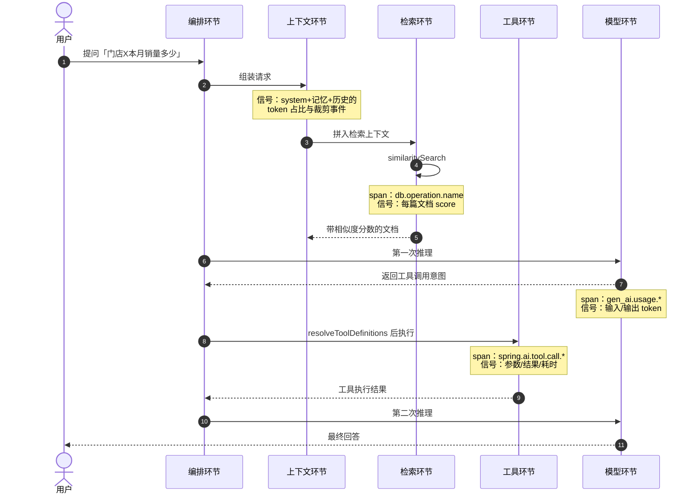
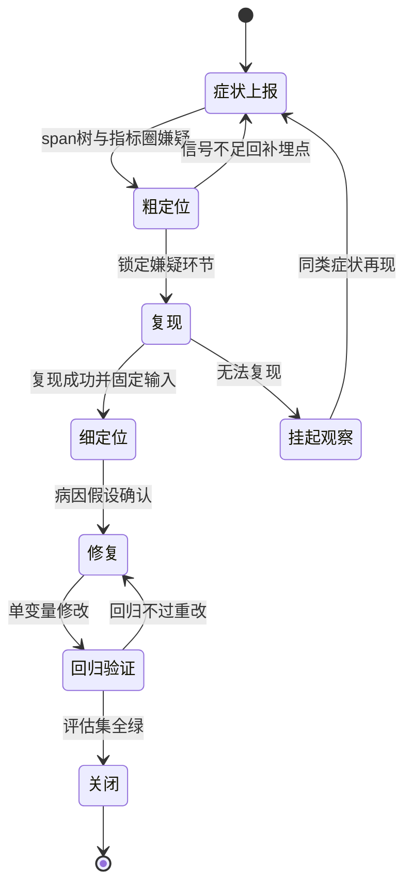
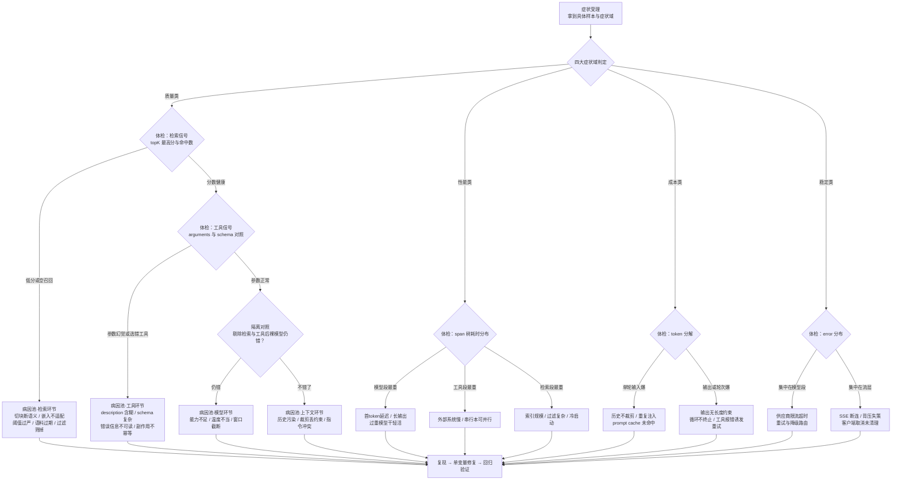

# 00 Agent 病理总论：症状、环节与病因的归因方法论

> **定位**：本文是「调优实战与方法论」系列（00-06 共 7 篇）的开篇总纲，讲一套 Agent 系统的归因方法论——当线上 Agent 出现"回答不准、响应变慢、成本超支、间歇报错"时，如何从**症状**出发，沿**五环节模型**粗定位到嫌疑环节，再细定位到**具体病因**，最后走通"复现 → 修复 → 回归验证"的完整推理链。读者画像：已经搭好（或正在搭）可观测体系、但面对一片 span 树和 token 曲线仍不知道"病根在哪"的中高级 Java 开发者与架构师。前置阅读：[教程 05-Observation可观测/01-读懂输出：span树与观测生命周期]（本文大量消费它产出的 span 信号）、[教程 00-基础与核心/03-工具调用] 与 [教程 00-基础与核心/05-RAG检索增强生成]（五环节中工具与检索两环节的机制基础）、[教程 04-企业级架构主干/07-成本治理与Token计量]（成本类症状的计量口径）。

---

## 一、为什么调优需要病理学：症状相同，病因不同

### 1.1 一个真实的排障早晨

设想一个典型的周一早晨。用户反馈："客服 Agent 昨天开始回答不准了。"开发者打开 Grafana，看到 token 用量正常、错误率正常、平均耗时正常——所有监控都是绿的，但用户就是不满意。于是开始"盲改"：换了个模型、调了温度、把 system prompt 加长了两倍、topK 从 4 改到 8……三天后，症状时好时坏，没人说得清到底哪次改动起了作用，也没人敢把这些改动回滚。

这个场景的根源只有一个：**把"回答不准"当成了一个病，而它其实只是一个症状**。同一种症状背后，可能是完全不同的病因：

- **检索环节**：向量库没有召回正确文档（用户问"退货政策"，召回的全是"发货政策"，相似度分数看似都挺高但语义错了）；
- **工具环节**：模型调用查询工具时把 `storeCode` 参数传成了 `storeName` 的值，工具返回空结果，模型基于空结果编造答案；
- **上下文环节**：多轮对话后，历史记忆里一条过期的旧约束（"我们只支持线下退款"）持续污染后续回答；
- **模型环节**：任务本身（跨表数字推理）超出了当前模型的能力边界；
- **编排环节**：ReAct 循环的最大轮次设得太小，推理还没收敛就被强制截断。

五种病因，一种症状。如果不对着观测信号做归因，就只能靠"调参玄学"。这正是本文要解决的问题：**给 LLM 系统建立一套类似临床医学"症状 → 病灶 → 病因"的诊断学**。

### 1.2 传统排障与 LLM 系统排障的本质差异

| 维度 | 传统分布式系统 | LLM Agent 系统 |
|------|--------------|----------------|
| 故障形态 | 确定性 bug：同一输入必现同一错误 | 概率性故障：同一输入可能时对时错（温度采样、供应商路由） |
| 错误证据 | 异常堆栈、错误码、日志行，直接指向代码位置 | 经常**没有错误**——回答"流畅但错误"，HTTP 200，span 全部正常闭合 |
| 归因单位 | 单点（某个服务的某行代码） | 链路（检索质量 → prompt 组装 → 模型推理 → 工具执行 → 输出解析，环环相扣） |
| 验证手段 | 单元测试重跑即验证 | 需要**评估集**与 LLM-as-Judge，"修好了"本身需要一个判定标准 |
| 基线含义 | 性能基线（QPS、P99） | 性能基线之外还要**质量基线**（准确率、召回命中率）与**成本基线**（每请求 token） |

传统排障的核心动作是"读堆栈"；Agent 排障的核心动作是**对比**——把故障请求的环节信号与健康基线对比，找出"哪一环偏离了正常值"。没有对比对象，再全的观测数据也只是噪音。

### 1.3 观测体系是"看得见"，归因方法论才是"看得懂"

前面 [教程 05-Observation可观测] 系列与 [教程 06-TraceId全链路追踪] 系列解决的是"看得见"：把 ChatClient、ChatModel、工具、向量库的每一次活动变成 span、指标、traceId。但观测数据本身不会说话——span 树上每一段都可能是绿的，病却真实存在（比如检索 span 返回了 4 篇文档、耗时 80ms，一切正常，但 4 篇文档全是无关内容）。

本篇的方法论就是架在"看得见"与"看得懂"之间的桥梁：**定义症状的分类学（什么算病）、定义环节的解剖位（病可能在哪里）、定义推理链（怎么从症状走到病因）**。后续 01-06 各篇则是在这套框架下对单个环节的"专科门诊"。

先看一次典型请求如何流经五个环节、每个环节留下什么观测信号——这是后续所有归因动作的信号底座。



这张时序图里有一个关键事实：**同一个用户问题，答案的正确性由五个环节共同决定，而每个环节的"正常"与"异常"都留下了可观测信号**。归因方法论的全部内容，就是学会按顺序读这些信号。

---

## 二、四大症状域：Agent 故障的分类学

分类学的意义在于：不同症状域的排查入口完全不同。把症状先归入正确的症状域，归因就完成了一半。Agent 系统的故障可划分为四大症状域：

| 症状域 | 用户感知 | 典型症状 | 首查环节 | 关键信号 |
|--------|---------|---------|---------|---------|
| **质量类** | "它答得不对" | 幻觉编造、答非所问、数据过时、格式解析失败 | 检索 → 工具 → 上下文 → 模型 | 检索分数（`Document.getScore()`）、工具参数（`spring.ai.tool.call.arguments`）、prompt 全文 |
| **性能类** | "它太慢了" | 首 token 延迟高、总耗时超预算、工具执行拖沓 | 编排（串并行结构）→ 模型 → 工具 | span 树各段耗时、流式首包时间、工具循环轮次 |
| **成本类** | "账单失控了" | 单请求 token 超预算、调用量暴增、缓存命中率低 | 上下文 → 编排 | `gen_ai.usage.input_tokens` / `output_tokens`、请求轮次、缓存命中指标 |
| **稳定类** | "它时好时坏" | 超时、限流 429、SSE 流中断、进程崩溃 | 编排 → 模型（供应商侧） | 错误率、重试计数、span error 状态、断连事件 |

四个域并不互斥——一次故障可能同时呈现多个症状域（例如循环不终止既是成本类"token 暴增"也是稳定类"超时"）。归因时按**用户感知最强烈的那个域**进入诊断路径，诊断过程中如果发现跨域证据，再切换路径。

### 2.1 质量类：最常见也最难归因

质量类症状的特征是"系统认为自己成功了"：HTTP 200、span 全部闭合、模型流利地输出了一个错误答案。这是 Agent 系统区别于传统系统最典型的病理形态——**静默失败**。它细分为四种亚型：

1. **幻觉编造**：模型输出了不存在的细节（编造 API 参数、编造数据）。首要嫌疑是检索没给足证据，其次才是模型本身不可靠。
2. **答非所问**：回答与问题错位。首要嫌疑是查询改写环节把用户意图带偏，或历史对话污染了当前意图。
3. **数据过时**：答案基于旧信息。首要嫌疑是语料同步管道（知识库更新延迟），其次是缓存层（语义缓存返回了过期条目，见 [教程 04-企业级架构主干/09-灰度发布与版本管理] 中版本一致性视角）。
4. **格式坏损**：结构化输出解析失败或字段缺失。首要嫌疑是上下文（指令被长上下文稀释、system prompt 中格式要求被截断），其次是模型能力（小模型对复杂 JSON schema 的服从性）。

### 2.2 性能类：先看 span 树的"体重分布"

性能类症状的归因入口非常明确：**把一次请求的总耗时按环节分解**。span 树就是天然的分解工具——模型段、工具段、检索段、编排段各占多少毫秒，一目了然。经验上，性能问题的高频病因排序是：串行本可并行的工具调用 > 每轮都全量重灌的长上下文（未命中 prompt cache）> 检索索引规模失控 > 模型选型不当（小任务用了过重的模型）。注意流式场景下"总耗时"与"首 token 时间"是两个独立指标，用户感知的是后者。

### 2.3 成本类：token 花在哪，病就在哪

成本类症状的归因入口是 **token 分解**：单请求总 token 拆成"输入 / 输出 / 每轮增量"，再乘以轮次。输入 token 爆炸，病因通常在上下文环节（历史不裁剪、重复注入同样的文档）；输出 token 爆炸，病因通常在模型环节（缺少输出长度约束）或编排环节（循环不终止导致反复生成）；轮次爆炸，病因在编排环节（工具返回格式诱导模型反复重试）或工具环节（工具报错信息写得让模型看不懂，反复换姿势重试）。

### 2.4 稳定类：异常集中在哪个环节

稳定类症状的归因入口是**错误的空间分布**：错误集中在模型调用（供应商限流、超时）、工具执行（外部系统不稳定）、还是 WebFlux 流层（背压、断连、取消）？不同的集中位置通向完全不同的病因池。模型供应商侧的间歇性 429/超时属于弹性设计问题（重试、降级、多供应商冗余，见 [教程 04-企业级架构主干/10-容错与弹性设计] 与 [教程 04-企业级架构主干/12-模型路由与降级]）；而流中断类问题多与 Reactor 层的错误传播和取消语义有关（见 [教程 08-架构师进阶/08-响应式错误处理]）。

---

## 三、五环节模型：病因的解剖位

分类学回答"是什么病（症状域）"，解剖学回答"病灶可能在哪（环节）"。把一个 Agent 系统在概念上切成五个环节，每个环节维护一份**典型病因清单**，归因就从"无边界的猜测"收敛为"有限清单的排查"。

### 3.1 检索环节（RAG）

职责：把用户意图变成相关知识。典型病因清单：

| 病因 | 机理 | 判别信号 |
|------|------|---------|
| 召回失败 | 相关文档不在库里，或嵌入后距离过远 | topK 内最高分数低于阈值，或返回空列表 |
| 召回错位 | 分数最高的文档语义错位（如问了退货召回发货） | 分数健康但内容主题不符，需人工看内容 |
| 切块破坏语义 | chunk 边界切断关键句，证据残缺 | 分数中等、内容有头无尾 |
| 查询改写带偏 | QueryTransformer 改写后丢失原意图 | 检索用 query 与用户原话差异过大 |
| 语料过期 | 库内版本落后于业务事实 | 内容正确但数据过时 |
| 过滤条件过严 | `filterExpression` 把正确文档筛掉 | 开关过滤对比分数变化 |

想深入检索质量的可观测埋法与分数解读，见 [教程 05-Observation可观测/09-Advisor与RAG观测：检索质量可观测]；向量库索引与相似度度量层面的下钻见 [附录 19-向量数据库与检索工程/00-索引与检索工程深度]。

### 3.2 工具环节

职责：让模型的手伸进外部世界。典型病因清单：

| 病因 | 机理 | 判别信号 |
|------|------|---------|
| 参数幻觉 | 模型生成的参数与 schema 不符（错位、编造枚举值） | `spring.ai.tool.call.arguments` 内容与 `@ToolParam` 定义对比 |
| 选错工具 | 工具 `description` 含糊或多个工具职责重叠 | 工具名与用户意图不匹配 |
| 工具自身 bug | 工具实现逻辑错误或依赖的外部系统故障 | 固定参数直接调用工具仍失败 |
| 错误信息不可读 | 工具异常返回的文本让模型无法自我纠正，反复重试 | 多轮调用同一工具且参数小幅变化 |
| 副作用不幂等 | 重试导致重复下单/重复发送 | 同一 `tool.call.id` 关联的多次执行记录 |

工具环节的机制基础见 [教程 00-基础与核心/03-工具调用]，观测标签全集见 [附录 05-SpringAI2-API基准/02-Tool与Observation真实API]。

### 3.3 模型环节

职责：推理与生成。典型病因清单：

- **能力不足**：任务复杂度超出所选模型（多跳推理、长表格计算）。判别：隔离对照——剔除检索与工具后，裸问模型仍错。
- **采样参数不当**：温度过高导致创造性跑飞（应确定性输出却发散），过低导致重复循环。
- **上下文超限截断**：请求超模型窗口被供应商截断，指令丢失。判别：输入 token 接近窗口上限。
- **指令服从性弱**：小模型对复杂 system prompt（多约束、多格式要求）服从性差。判别：同 prompt 换强模型后质量跳变。
- **幻觉底噪**：模型固有的不可靠性。判别：检索证据充分、指令清晰仍编造细节。

模型选型与多供应商策略见 [教程 08-架构师进阶/10-多模型协作与供应策略]。

### 3.4 上下文环节

职责：决定模型"看见什么"。这是最容易被忽视的环节——因为它的故障表现为其他环节的症状。典型病因清单：

| 病因 | 机理 | 判别信号 |
|------|------|---------|
| 历史污染 | 旧对话中的过期约束持续影响本轮回答 | log-prompt 输出中能看到冲突的历史消息 |
| 裁剪丢失关键约束 | 记忆窗口裁剪把 system 级约束或关键事实裁掉 | 被裁内容恰是回答所需 |
| 检索注入错位 | 文档注入模板时位置/格式错误，模型读不到 | prompt 中文档段落排版异常 |
| 指令冲突 | system prompt 与用户新指令矛盾，模型随机站队 | 同输入多次重试答案在两派间摆动 |
| 缓存未命中 | 上下文顺序不稳定导致 prompt cache 失效，既慢又贵 | 输入 token 高但缓存命中指标为 0 |

上下文工程的系统性方法见 [教程 08-架构师进阶/00-上下文工程]；Prompt 层面的设计模式与模板管理见 [附录 02-Prompt工程/00-Prompt设计模式]。

### 3.5 编排环节

职责：控制流程——Advisor 链顺序、ReAct 循环边界、多 Agent 消息路由、并行结构。典型病因清单：

- **循环不终止 / 最大轮次失当**：ReAct 循环过早截断（答一半）或过晚终止（烧 token）。
- **Advisor 顺序错误**：如记忆 Advisor 在检索 Advisor 之后执行，导致检索结果被记忆覆盖（Advisor 链机制见 [教程 02-SpringAI核心机制/01-Advisor链与拦截器]）。
- **多 Agent 消息丢失**：Agent 间传递的消息未序列化完整或超时未达。
- **并行写入竞争**：多工具并行写同一会话记忆，互踩覆盖。
- **分支条件写错**：路由条件与业务语义不符，请求进了错误的子流程。

### 3.6 病因复合与近因谬误

真实故障常是**跨环节复合病因**："检索召回了过期文档（检索环节）→ 模型基于过期文档一本正经地生成（表现为模型环节的幻觉）"。如果只盯着模型环节加约束、换强模型，症状只会缓解不会根除。归因方法论因此要求：**找到"第一个出错的环节"，而不是"最显眼的症状环节"**——这是区分"近因"与"根因"的关键。诊断路径的设计（第四章的决策树）正是按"证据最前置的环节先查"原则排列：先查检索（证据源），再查工具（数据源），最后才轮到模型本身。

---

## 四、归因推理链：从症状到根因的六步法

五环节模型给出了病因的候选集合，归因推理链给出排查的**执行顺序**。完整链条六步：**症状受理 → 粗定位 → 细定位 → 复现 → 修复 → 回归验证**。

### 4.1 症状受理：把模糊抱怨转成可诊断的症状

"AI 不太行"不是症状，"用户问退货政策时 Agent 答成了发货政策，最近三天发生 17 次"才是。受理阶段做三件事：**限定症状域**（四大分类学之一）、**量化频次**（必现/偶现/比例）、**圈定样本**（拿到至少一个出问题的 conversationId 或 traceId）。没有具体样本，后续全是空谈。

### 4.2 粗定位：用 span 树和聚合指标圈出嫌疑环节

拿着样本的 traceId 打开 span 树，按症状域看不同切面：质量类看"喂给模型的证据是否齐全"（检索 span 返回的文档与分数）、性能类看"耗时体重分布"（哪段 span 最重）、成本类看"token 分解"（`gen_ai.usage.*` 按环节归因）、稳定类看"error span 的空间分布"。粗定位的产出是**一个嫌疑环节**（或复合嫌疑对），而不是结论。

### 4.3 细定位：进入环节看高基数细节

嫌疑环节锁定后，下钻到环节内部细节：检索环节看每篇文档的分数与内容；工具环节看 `spring.ai.tool.call.arguments`（真实入参）与 `spring.ai.tool.call.result`（真实出参）；上下文环节看 log-prompt 记录的完整 prompt；模型环节做隔离对照实验。细定位的产出是**一个可陈述的病因假设**，形如"当用户同时提到两个门店时，检索用的改写 query 丢掉了第二个门店的限定词，导致召回偏斜"。

### 4.4 复现：把概率性故障变成确定性实验

LLM 系统的复现有其特殊性：同一输入可能时对时错。复现策略按顺序尝试：**固定采样**（温度设 0 或固定 seed）→ **固定输入**（用故障样本的原始问题与历史消息精确重放）→ **放大扰动**（无法稳定复现时，批量重放同类样本提高命中率）→ **最小化**（逐步削减 prompt 中的段落，找到触发故障的最小上下文）。复现成功的标志是：**一个可重复执行的输入，以可接受的频率触发症状**。这个输入同时成为回归验证的用例。

### 4.5 修复：一次只动一个变量

在复现用例上做修复实验，铁律是单变量（第五章详述）。修复动作按环节对照病因清单选择：检索环节的修复是切块参数/嵌入模型/查询改写；工具环节是 description 与 schema 的改写、参数校验前置；上下文环节是裁剪策略与注入顺序；模型环节是选型与采样参数；编排环节是循环边界与链序。每次修复后先在复现用例上验证症状消失，再进入回归。

### 4.6 回归验证：证明"修好了"且"没修出新病"

Agent 修复的特殊难点在于：症状消失不等于修复成功——可能只是这一次采样运气好。回归验证需要两个证据：**复现用例通过**（多次重放不再触发）+ **评估集全绿**（修复没有破坏其他场景）。评估集是一组带预期答案的黄金样本，用官方 Evaluator 体系（`Evaluator.evaluate(EvaluationRequest)`）或自研 Judge 打分。整个六步链条在工程上应落成一张"缺陷归因单"，其生命周期如下：



注意两条回退边：**粗定位发现信号不足，要回退去补观测埋点**（可观测体系与归因方法论是迭代互相成就的）；**无法复现不等于关闭**，挂起观察、等同类症状再现时合并样本。把每张归因单的"症状域 / 嫌疑环节 / 根因 / 修复"沉淀下来，就形成了组织级的**病理档案**——这是 [教程 06-TraceId全链路追踪/09-使用运营：从排障到告警成本与飞轮] 中"排障飞轮"的原料。

### 4.7 归因决策树

把六步法折叠成一张可执行的决策树——从症状入口开始，每个分叉点都是一个信号体检动作，每条出路都是一个环节的病因池：



这张树的读法强调一点：**质量类的体检顺序是固定的**——先检索、再工具、再做隔离对照——因为它按"证据链上游优先"排列，能最大限度避免把下游症状误判为下游病因（近因谬误）。性能类、成本类、稳定类则以分解信号（耗时分布、token 分解、error 分布）作为分叉依据，每条出路都是可以直接执行的排查动作。

---

## 五、三条铁律

方法论要落地，需要不可妥协的底线。以下三条铁律适用于所有环节、所有症状域，违反任何一条的代价都是"看似修好、实则未定"。

### 5.1 铁律一：先复现，再归因

**没有稳定复现的故障，不允许宣布定位。**理由：LLM 系统的故障是概率性的，"我改了 prompt 之后它回答对了"与"改动修好了故障"是两个命题——前者可能只是采样运气。可复现性把归因从"故事会"变成"实验科学"。复现的操作要点见 4.4；对确实无法稳定复现的偶现故障，唯一诚实的动作是挂起观察并在复现时补充埋点，而不是凭一次成功就关闭归因单。这也与本项目运行时排错方法论的守则一致：**"第一次成功"不等于"修好"，持久化类与概率类故障都要看到第二次、第 N 次的行为才算数**。

### 5.2 铁律二：单变量对照

**一次实验只改一个变量。**LLM 系统的变量空间巨大：模型、温度、prompt 措辞、topK、阈值、切块大小、记忆窗口……多变量同时改，即使结果变好也无法归因，且无法在下次退化时回滚到正确版本。单变量对照的标准做法：固定复现用例与采样参数，改动一个候选变量，跑评估集对比；多轮实验只保留有统计意义的胜出变量。这与灰度发布的 A/B 思想同源（见 [教程 04-企业级架构主干/09-灰度发布与版本管理] 与 [附录 11-评估与可观测生态/03-在线实验与AB统计]），只是粒度从"版本级"细化到"变量级"。

### 5.3 铁律三：没有基线，就没有诊断

**诊断是"现状 vs 基线"的偏差分析，没有基线就没有偏差可言。**Agent 系统需要三类基线：

1. **性能基线**：健康时段各环节 span 耗时的 P50/P95（模型段、工具段、检索段、端到端）；
2. **成本基线**：健康时段单请求输入/输出 token 分布与轮次分布；
3. **质量基线**：黄金评估集上的通过率（检索命中率、回答相关性得分）。

任何一次"变慢了/变贵了/变笨了"的诊断，本质都是与基线的对比。上线新版本前先跑基线、变更后复跑对比，应成为发布流程的固定动作。基线的建设与 SLO 治理见 [教程 05-Observation可观测/07-指标治理：Token计量、SLO与基数熔断]。

---

## 六、消费观测信号：从 span 到病因的证据链

### 6.1 信号到环节的映射

归因方法论落地的前提，是五环节的信号都"已经在那里"。下表是本系列消费的信号全景——每一行都是 05/06 两个系列已经教过如何产出的东西，本文定义它们在诊断中的用途：

| 信号 | 来源 | 诊断用途 |
|------|------|---------|
| span 树形状与各段耗时 | [教程 05-Observation可观测/01] | 粗定位：性能类的瓶颈段、稳定类的 error 分布 |
| `Document.getScore()` 检索分数 | 检索 span / Advisor 观测 | 细定位：检索环节召回质量 |
| `spring.ai.tool.call.arguments` / `result` | 工具观测 span | 细定位：工具环节参数幻觉、结果异常 |
| `gen_ai.usage.input_tokens` / `output_tokens` | 模型观测 span | 成本类分解、上下文环节的体积判断 |
| log-prompt 的完整 prompt | `spring.ai.chat.observations.log-prompt` | 细定位：上下文环节的组装与污染 |
| traceId 串联的跨服务档案 | [教程 06-TraceId全链路追踪/01] | 受理阶段圈定样本、跨服务归因 |
| 评估集通过率 | Evaluator 体系 | 回归验证的质量基线 |

其中工具入参/出参的记录需要显式打开内容开关（生产上注意脱敏与存储成本，见 [教程 05-Observation可观测/04-自定义Convention与Filter：工业标签与脱敏]）：

```yaml
spring:
  ai:
    chat:
      observations:
        log-prompt: true              # Spring AI 2.0.0 实证配置键：记录完整 prompt
        log-completion: true          # 记录完整补全
        include-error-logging: true   # 错误内容进日志
    tools:
      observations:
        include-content: true         # Spring AI 2.0.0 实证配置键：工具入参/出参进观测
```

### 6.2 环节体检单：把五个环节的信号聚合成一张诊断视图

下面的示例把"消费信号"变成代码：注册三个 `ObservationHandler`，分别拦截模型、工具、检索三个环节的观测上下文，把环节信号写入一张按 traceId 聚合的**归因信号板**；诊断时按 conversationId 打印"环节体检单"，直接对照第四章的病因池。所有 SDK 元素均经过本地 2.0.0 jar 实证（见 [附录 05-SpringAI2-API基准/02-Tool与Observation真实API]）。

```java
// 环节枚举与信号记录（概念代码之外的骨架，均为真实可编译 API）
package com.example.diagnosis;

import java.util.List;
import java.util.Map;
import java.util.concurrent.ConcurrentHashMap;
import java.util.concurrent.CopyOnWriteArrayList;
import java.util.function.Supplier;

import io.micrometer.observation.Observation;
import io.micrometer.observation.ObservationHandler;
import org.springframework.ai.chat.client.ChatClient;                 // Spring AI 2.0.0
import org.springframework.ai.chat.metadata.Usage;                    // Spring AI 2.0.0
import org.springframework.ai.chat.observation.ChatModelObservationContext;      // Spring AI 2.0.0
import org.springframework.ai.tool.observation.ToolCallingObservationContext;    // Spring AI 2.0.0
import org.springframework.ai.vectorstore.observation.VectorStoreObservationContext; // Spring AI 2.0.0
import org.springframework.context.annotation.Bean;
import org.springframework.context.annotation.Configuration;

/** 五环节归因信号板：按 traceKey 聚合各环节信号（简化演示：内存版） */
public class AttributionBoard {

    public enum Stage { MODEL, TOOL, RETRIEVAL }

    public record StageSignal(Stage stage, long costMs,
                              Map<String, Object> detail, String error) {}

    private final Supplier<String> traceKeySupplier;
    private final Map<String, List<StageSignal>> board = new ConcurrentHashMap<>();

    public AttributionBoard(Supplier<String> traceKeySupplier) {
        // 生产环境应注入 Tracer.currentSpan() 读取真实 traceId
        // （依赖 micrometer-tracing，见教程 06-TraceId 全链路追踪系列）；
        // 本示例为可独立编译，用注入函数解耦。
        this.traceKeySupplier = traceKeySupplier;
    }

    public void record(Stage stage, long costMs, Map<String, Object> detail, String error) {
        board.computeIfAbsent(traceKeySupplier.get(), k -> new CopyOnWriteArrayList<>())
             .add(new StageSignal(stage, costMs, detail, error));
    }

    /** 打印"环节体检单"：诊断时对照第 3 章各环节病因池逐项核对 */
    public void printChecklist(String traceKey) {
        board.getOrDefault(traceKey, List.of()).forEach(s ->
                System.out.printf("[%s] %dms %s error=%s%n",
                        s.stage(), s.costMs(), s.detail(), s.error()));
    }
}

@Configuration
class DiagnosisObservationConfig {

    private static final Object START_MS = new Object();

    @Bean
    AttributionBoard attributionBoard() {
        return new AttributionBoard(() -> "trace-" + System.nanoTime()); // 演示用键
    }

    /** 模型环节：耗时 + token 分解（成本类/性能类信号） */
    @Bean
    ObservationHandler<Observation.Context> modelStageHandler(AttributionBoard board) {
        return new ObservationHandler<>() {
            @Override
            public boolean supportsContext(Observation.Context ctx) {
                return ctx instanceof ChatModelObservationContext;
            }
            @Override
            public void onStart(Observation.Context ctx) {
                ctx.put(START_MS, System.currentTimeMillis());
            }
            @Override
            public void onStop(Observation.Context ctx) {
                long start = ctx.get(START_MS);
                long cost = System.currentTimeMillis() - start;
                Usage usage = null;
                // ChatModelObservationContext.getResponse()：Spring AI 2.0.0 实证
                if (ctx.getResponse() != null && ctx.getResponse().getMetadata() != null) {
                    usage = ctx.getResponse().getMetadata().getUsage(); // 实证：ChatResponseMetadata.getUsage()
                }
                board.record(AttributionBoard.Stage.MODEL, cost,
                        Map.of("inputTokens", usage != null ? usage.getPromptTokens() : -1,      // 实证
                               "outputTokens", usage != null ? usage.getCompletionTokens() : -1), // 实证
                        ctx.getError() == null ? "-" : ctx.getError().toString());
            }
        };
    }

    /** 工具环节：耗时 + 真实入参/出参（质量类"参数幻觉"的关键证据） */
    @Bean
    ObservationHandler<Observation.Context> toolStageHandler(AttributionBoard board) {
        return new ObservationHandler<>() {
            @Override
            public boolean supportsContext(Observation.Context ctx) {
                return ctx instanceof ToolCallingObservationContext;
            }
            @Override
            public void onStart(Observation.Context ctx) {
                ctx.put(START_MS, System.currentTimeMillis());
            }
            @Override
            public void onStop(Observation.Context ctx) {
                ToolCallingObservationContext tool = (ToolCallingObservationContext) ctx;
                long start = ctx.get(START_MS);
                // 以下 getter 均为本地 2.0.0 jar javap 实证
                board.record(AttributionBoard.Stage.TOOL,
                        System.currentTimeMillis() - start,
                        Map.of("toolCallId", tool.getToolCallId(),
                               "arguments", String.valueOf(tool.getToolCallArguments()),
                               "result", String.valueOf(tool.getToolCallResult())),
                        ctx.getError() == null ? "-" : ctx.getError().toString());
            }
        };
    }

    /** 检索环节：耗时 + 每篇文档相似度分数（质量类"召回质量"的关键证据） */
    @Bean
    ObservationHandler<Observation.Context> retrievalStageHandler(AttributionBoard board) {
        return new ObservationHandler<>() {
            @Override
            public boolean supportsContext(Observation.Context ctx) {
                return ctx instanceof VectorStoreObservationContext;
            }
            @Override
            public void onStart(Observation.Context ctx) {
                ctx.put(START_MS, System.currentTimeMillis());
            }
            @Override
            public void onStop(Observation.Context ctx) {
                VectorStoreObservationContext vs = (VectorStoreObservationContext) ctx;
                long start = ctx.get(START_MS);
                // getQueryRequest()/getQueryResponse()：Spring AI 2.0.0 实证
                var request = vs.getQueryRequest();
                var docs = vs.getQueryResponse();
                var scores = docs == null ? List.of()
                        : docs.stream().map(d -> d.getScore()).toList(); // Document.getScore() 实证
                board.record(AttributionBoard.Stage.RETRIEVAL,
                        System.currentTimeMillis() - start,
                        Map.of("query", request == null ? "-" : request.getQuery(),
                               "topK", request == null ? -1 : request.getTopK(),
                               "scores", scores.toString()),
                        ctx.getError() == null ? "-" : ctx.getError().toString());
            }
        };
    }
}
```

> 说明：`ObservationHandler` 是 Micrometer Observation（`io.micrometer.observation`，本地 1.17.0 jar 实证：抽象方法仅 `supportsContext`，`onStart/onStop/onError` 均为 default）；注册为 Bean 后由 Boot 装配进 `ObservationRegistry` 的机制详见 [教程 05-Observation可观测/02-组件交互：Registry、Handler、Convention、Filter协作]。`Observation.Context.put/get` 计时而非"取 duration"是因为观测上下文上没有时长 getter（实证结论，见 [附录 05-SpringAI2-API基准/02-Tool与Observation真实API]）。上下文与编排两个环节的信号（prompt 组装、Advisor 链事件）不在此展开——分别为 [教程 05-Observation可观测/03-自定义Handler：收集Agent阶段事件流] 与 [教程 08-架构师进阶/00-上下文工程] 的主题。

有了体检单，4.2 的粗定位动作就从"人工读 span 树"变成"跑一个打印命令"：质量类症状先看 `RETRIEVAL` 行的 scores——全是低分即进检索病因池；分数健康再看 `TOOL` 行的 arguments——参数与预期不符即进工具病因池；两环皆健康才做裸模型隔离对照。**方法论先行，代码只是把方法论固化。**

### 6.3 回归验证的落地：用官方 Evaluator 跑评估集

4.6 的回归验证可以直接用 Spring AI 2.0.0 官方 Evaluator 体系实现（`org.springframework.ai.evaluation.Evaluator`，本地 jar 实证存在）：

```java
package com.example.diagnosis;

import java.util.List;

import org.springframework.ai.chat.client.ChatClient;          // Spring AI 2.0.0
import org.springframework.ai.chat.evaluation.RelevancyEvaluator; // Spring AI 2.0.0，包坐标实证
import org.springframework.ai.document.Document;               // Spring AI 2.0.0
import org.springframework.ai.evaluation.EvaluationRequest;    // Spring AI 2.0.0
import org.springframework.ai.evaluation.EvaluationResponse;   // Spring AI 2.0.0
import org.springframework.ai.evaluation.Evaluator;

/** 回归验证：修复后用评估集批量重放，任何一条不过即回到修复步骤 */
public class RegressionGate {

    private final Evaluator evaluator;

    public RegressionGate(ChatClient.Builder chatClientBuilder) {
        // RelevancyEvaluator.builder().chatClientBuilder(...).build()：2.0.0 实证
        this.evaluator = RelevancyEvaluator.builder()
                .chatClientBuilder(chatClientBuilder)
                .build();
    }

    public boolean pass(String userText, List<Document> retrieved, String answer) {
        // EvaluationRequest(String userText, List<Document> dataList, String responseContent)：实证
        EvaluationResponse response = evaluator.evaluate(
                new EvaluationRequest(userText, retrieved, answer));
        System.out.printf("pass=%s score=%.2f feedback=%s%n",
                response.isPass(), response.getScore(), response.getFeedback()); // 均为实证方法
        return response.isPass();
    }
}
```

单条样本的相关性通过只是回归验证的**下界**；完整的回归门禁还需覆盖事实性（`FactCheckingEvaluator`，同包实证）与业务自定义 Judge（LLM-as-Judge 工程化见 [附录 11-评估与可观测生态/01-LLM-as-Judge工程化]，评估集的版本管理见 [附录 11-评估与可观测生态/02-评估数据集管理与版本化]，测试分层见 [附录 04-测试策略/02-Eval评估]）。

---

## 七、本系列分工：总论与六篇专科

本篇是方法论的"总论"，后续六篇是方法论的"落地专科"，分工如下：

| 篇目 | 职责 | 对应本篇的章节 |
|------|------|--------------|
| 00 本文 | 症状分类学、五环节解剖、六步归因链、三条铁律 | 全局框架 |
| 01 五环节体检手册 | 每个环节的具体体检项、信号读取方式、健康阈值 | 第 4.2/4.3 步的逐环节展开 |
| 02 Prompt与上下文调优 | 上下文环节病因的修复手法：裁剪、注入顺序、指令冲突消解 | 第 3.4 节病因池的修复篇 |
| 03 工具与MCP调优 | 工具 description/schema 设计、参数校验、幂等与重试 | 第 3.2 节病因池的修复篇 |
| 04 检索与RAG调优 | 切块、嵌入、查询改写、混合检索与重排 | 第 3.1 节病因池的修复篇 |
| 05 架构级调优 | 编排环节的链序、循环边界、缓存与并行结构、模型路由 | 第 3.3/3.5 节病因池的修复篇 |
| 06 综合实战 | 一个完整故障案例走通六步归因链 | 第 4 章的端到端演练 |

阅读方式建议：先掌握本篇的分类学与推理链，之后**按当前故障所在环节跳读对应专科篇**；06 综合实战适合在读完 01-05 后作为验收。本文与 [教程 08-架构师进阶/11-Agent架构反模式与避坑指南] 互为补充——该篇讲"设计时如何不埋病"，本篇讲"运行后如何找出病"。

---

## 适用场景

- 已有 Spring AI 2.0 + Micrometer Observation 基础观测体系，需要把它从"监控大屏"升级为"诊断武器"的团队；
- Agent 系统进入试运行/生产阶段，出现"时好时坏、说不清为什么"的质量类投诉；
- 需要建立团队级排障规范（归因单模板、修复流程、回归门禁）的架构师；
- 故障复盘时需要区分"近因"与"根因"、避免盲改的技术负责人。

## 不适用场景

- 尚未建立任何观测信号（无 span、无 token 计量）的系统——本方法论消费信号，不生产信号，请先读 [教程 05-Observation可观测/00-最小闭环：Agent各阶段输出打印到控制台]；
- 需要模型侧内部机制解释（注意力分布、神经元激活）的可解释性研究——那是 [教程 09-前沿专题/10-Agent可解释与透明工程] 的领域，本篇只到"环节边界"为止；
- 纯离线的模型能力评测（benchmark 横评）——见 [教程 08-架构师进阶/03-自我反思与Agent评估]，本篇聚焦线上故障的个案归因；
- 数据侧的知识库建设规范（语料治理、ETL 流水线设计）——本篇只把"语料过期"当作检索环节病因之一，不展开治理体系。

## 总结

本文建立了 Agent 系统的病理学框架，核心结论有五条：

1. **症状相同、病因不同**：LLM 系统最危险的不是报错，而是"静默失败"——一切指标正常但答案错误。归因方法论是把观测信号变成诊断结论的唯一桥梁。
2. **四大症状域**：质量类、性能类、成本类、稳定类。先归域，再入径——不同症状域的排查入口完全不同。
3. **五环节模型**：检索、工具、模型、上下文、编排。每个环节维护典型病因清单，归因从无边界猜测收敛为有限清单排查；复合病因要求追溯"第一个出错的环节"，避免近因谬误。
4. **六步推理链 + 三条铁律**：症状受理 → 粗定位 → 细定位 → 复现 → 修复 → 回归验证；先复现再归因、单变量对照、没有基线就没有诊断。三条铁律是把"修好了"从主观感受变成可证明命题的底线。
5. **观测是燃料，方法论是引擎**：本篇消费 05/06 系列产出的 span、分数、token、traceId 信号；环节体检单与回归门禁的代码展示了"信号 → 病因证据链"的固化方式。

下一篇 [教程 10-调优实战与方法论/01-五环节体检手册] 将把 4.2/4.3 两步逐环节展开：每个环节查什么项、读什么信号、健康阈值定多少。
