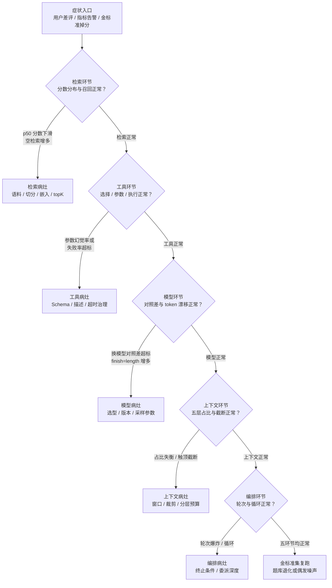
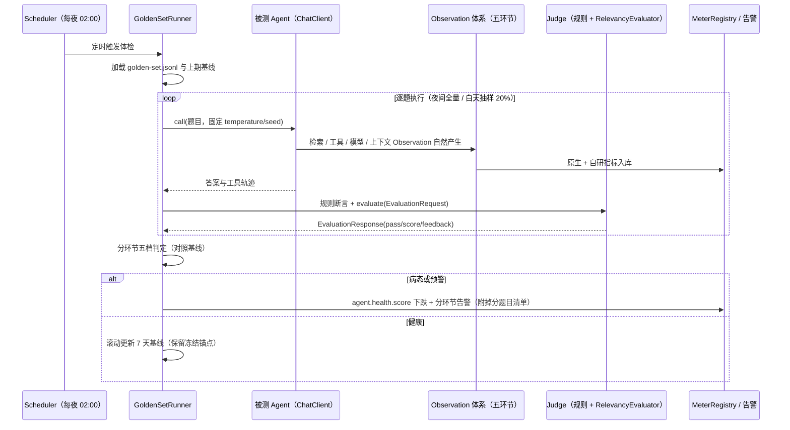

# 01 环节体检：五环节指标与判病阈值

> **定位**：上一篇 [教程 10-调优实战与方法论/00-Agent病理总论] 给出了归因方法论——"症状在输出，病灶在环节，先定位环节再动手改"。本篇是方法论落地用的**体检手册**：把 Agent 拆成**检索、工具、模型、上下文、编排**五个环节，逐一给出核心指标定义、用 Spring AI 2.0 原生 Observation + Micrometer 的采集方式、健康基线的建立方法，以及"健康 / 预警 / 病态"的判病阈值参考表。读完全篇你应能搭起一套"Agent 体检中心"：日常自动跑分、异常自动分环节归因。
>
> **读者画像**：已跑通 RAG / 工具调用 / 多轮 Agent 应用，遭遇过"效果变差但不知道坏在哪"的中高级 Java 开发者与架构师。
>
> **前置阅读**：[教程 10-调优实战与方法论/00-Agent病理总论]（归因方法论）、[教程 05-Observation可观测/01-读懂输出：span树与观测生命周期]（Observation 体系）、[教程 05-Observation可观测/07-指标治理：Token计量、SLO与基数熔断]（MeterRegistry 与指标基础）。

---

## 1.1 体检三要素：指标、基线、阈值

传统微服务排错只看"延迟 / 错误 / 流量"三件套；Agent 系统多了一层**质量病**——服务本身 200 OK，答案却是错的。质量病无法靠单一指标判断，必须按环节拆解：**每个环节回答一个独立问题**。

| 环节 | 体检回答的问题 | 病了时的典型症状 |
|------|--------------|----------------|
| 检索 | "喂给模型的资料对吗、够好吗？" | 答非所问、编造依据、引用过时内容 |
| 工具 | "模型会用工具吗、工具执行可靠吗？" | 选错工具、参数瞎编、工具报错、响应慢 |
| 模型 | "模型本身的状态和选型对吗？" | 换模型后质量突变、输出长度漂移、莫名截断 |
| 上下文 | "拼给模型的上下文结构健康吗？" | 长对话后遗忘、指令被淹没、prompt 触顶截断 |
| 编排 | "循环与委派收敛吗？" | 轮次爆炸、原地打转、多 Agent 层级失控 |

体检由三要素构成，三者缺一不可：

1. **指标（测什么）**：每环节 2–4 个核心指标，尽量直接复用 Spring AI 2.0 原生 Observation 产生的数据，不自造轮子。
2. **基线（跟谁比）**：绝对阈值只能兜底，**日常主判靠与自家基线的漂移**——基线来自"系统正常期的滚动分布"（下文 §1.2）。
3. **阈值（多坏算病）**：健康 → 预警 → 病态三级判病；本篇给出的数值全部是**出发参考值**，必须用你自己的金标准集校准（§1.7）。

### 分环节判病流程



这张图是 §1.2–§1.6 的**总索引**：每个判断节点依赖的指标，正是后面各环节体检表里的"预警/病态"阈值。注意判病顺序**从便宜到昂贵**——检索与工具指标从 Observation 直接可得，模型对照需要跑金标准集，编排复跑最贵，所以放最后。

## 1.2 健康基线怎么建立：滚动分布 + 冻结锚点

所有"漂移类"判病都依赖基线。基线不是拍脑袋常数，而是两份记录：

- **滚动基线（日常主判）**：每个指标按天聚合 p50 / p95，保留最近 7 天窗口。今天的 p95 与过去 7 天 p95 中位数比，偏移超过带宽即预警。滚动基线天然吸收业务量、语料增长等慢变量。
- **冻结锚点（重大变更对照）**：每次发版 / 换模型 / 换 Prompt 前，在金标准集上跑一轮全量指标存档。变更后复跑，与锚点做**同题对照**——这是 §1.7 前后对照法的基准盘。

基线记录本身不需要复杂设施：Micrometer 指标经 `Timer.publishPercentiles(0.5, 0.95)` 导出（javap 实证 `Timer$Builder` 有 `publishPercentiles(double...)`），再由你的指标后端做 7 天聚合即可；冻结锚点存 JSON 快照文件入库。

**一个重要的诚实声明**：下文各阈值表中的数值是工业实践里常见的**出发参考值**，不是标准。嵌入模型的相似度分布因模型而异（有的模型正常分布就在 0.3–0.5），先跑一周拿到自家分布，再校准每一格。

## 1.3 检索环节体检

### 核心指标

| 指标 | 定义 | 数据来源 |
|------|------|---------|
| R1 相关分数分布 | 本次检索 topK 文档相似度分数的 p25/p50/p95 | `VectorStoreObservationContext.getQueryResponse()` → `Document.getScore()`（均 javap 实证） |
| R2 空检索率 | `getQueryResponse()` 为空 / 全部低于 `similarityThreshold` 的请求占比 | 同上 + `getQueryRequest().getTopK()` |
| R3 金标准召回率 | 金标准集题目中，预期文档出现在 topK 的比例 | 金标准集跑分（§1.7） |
| R4 重排前后增益 | 重排器处理前后 nDCG@k 或命中率的变化 | 金标准集跑分，重排前后各记一次 |

R1、R2 在**生产流量上持续采集**（零成本），R3、R4 只在金标准集上算（有成本，靠定时任务控制频率）。四者分工明确：生产指标负责"发现病了"，金标准指标负责"病得多重、是不是真病"。

### 采集实现：分数分布 Handler

Spring AI 的向量库检索 Observation 名为 `db.vector.client.operation`（javap 实证 `DefaultVectorStoreObservationConvention` 字节码常量）。写一个 `ObservationHandler<VectorStoreObservationContext>` 即可拦截每次检索结果：

```java
// 采集检索环节 R1/R2 指标（Spring AI 2.0.0 / Micrometer 1.17，API 均经 javap 实证）
package demo.demo01.checkup;

import io.micrometer.core.instrument.Counter;
import io.micrometer.core.instrument.DistributionSummary;
import io.micrometer.core.instrument.MeterRegistry;
import io.micrometer.observation.ObservationHandler;
import org.springframework.ai.document.Document;
import org.springframework.ai.vectorstore.observation.VectorStoreObservationContext;
import org.springframework.boot.micrometer.observation.autoconfigure.ObservationRegistryCustomizer;
import org.springframework.context.annotation.Bean;
import org.springframework.context.annotation.Configuration;

import java.util.List;

@Configuration
public class RetrievalScoreCheckup {

    @Bean
    ObservationRegistryCustomizer<io.micrometer.observation.ObservationRegistry> retrievalCustomizer(
            MeterRegistry registry) {
        DistributionSummary scoreTop1 = DistributionSummary
                .builder("agent.retrieval.score.top1")          // 自研指标：top1 相关分数
                .description("top-1 相似度分数分布")
                .publishPercentiles(0.25, 0.5, 0.95)
                .register(registry);
        DistributionSummary scoreMean = DistributionSummary
                .builder("agent.retrieval.score.mean")          // 自研指标：topK 均分
                .publishPercentiles(0.5, 0.95)
                .register(registry);
        Counter emptyRetrieval = Counter
                .builder("agent.retrieval.empty")               // 自研指标：空检索次数
                .description("检索结果为空或全被阈值滤掉的次数")
                .register(registry);

        return obsRegistry -> obsRegistry.observationConfig().observationHandler(
                new ObservationHandler<VectorStoreObservationContext>() {
                    @Override
                    public boolean supportsContext(Observation.Context context) {
                        return context instanceof VectorStoreObservationContext;
                    }

                    @Override
                    public void onStop(VectorStoreObservationContext ctx) {
                        List<Document> docs = ctx.getQueryResponse();
                        if (docs == null || docs.isEmpty()) {
                            emptyRetrieval.increment();
                            return;
                        }
                        Double top1 = docs.get(0).getScore();
                        if (top1 != null) {
                            scoreTop1.record(top1);
                        }
                        double sum = 0;
                        int scored = 0;
                        for (Document d : docs) {
                            Double s = d.getScore();
                            if (s != null) {
                                sum += s;
                                scored++;
                            }
                        }
                        if (scored > 0) {
                            scoreMean.record(sum / scored);
                        }
                    }
                });
    }
}
```

`ObservationRegistryCustomizer` 在 Boot 4.1 的坐标是 `org.springframework.boot.micrometer.observation.autoconfigure`（javap 实证，Boot 4 已从 3.x 的 `actuate.autoconfigure.observation` 包重构迁移，jar：`spring-boot-micrometer-observation-4.1.0`）。`Document.getScore()` 返回 `Double`（可能为 null，必须判空）。

### 健康基线与判病阈值（检索环节）

| 指标 | 健康 | 预警 | 病态 | 判病提示 |
|------|------|------|------|---------|
| R1 top1 分数 p50 | ≥ 基线 p50 − 0.05 | 基线 −0.05 ~ −0.12 | < 基线 −0.12 | 先查语料更新与切分参数，再查嵌入模型版本 |
| R2 空检索率 | < 2% | 2% ~ 5% | > 5% | 高空检率常因 `similarityThreshold` 过高或查询改写漂移 |
| R3 金标准召回率 | ≥ 90% | 75% ~ 90% | < 75% | 掉分题目按类别聚类，定位是哪类语料失效 |
| R4 重排增益（命中率） | ≥ +5pp | 0 ~ +5pp | < 0（负增益） | 负增益 = 重排器病，回退重排版本而不是调检索 |

> pp = 百分点（percentage points）。表内数值为出发参考值，用 §1.7 金标准集校准后替换。

检索环节的观测原理、`RETRIEVED_DOCUMENTS` 高基数标签与 RAG Advisor 观测的更细展开见 [教程 05-Observation可观测/09-Advisor与RAG观测：检索质量可观测]；检索器与切分策略本身见 [教程 00-基础与核心/05-RAG检索增强生成]。

## 1.4 工具环节体检

### 核心指标

| 指标 | 定义 | 数据来源 |
|------|------|---------|
| T1 选择错误率 | 金标准判定"模型调了错误工具"的比例 | 金标准集跑分（生产流无免费标签，靠抽样审计） |
| T2 参数幻觉率 | 工具入参 JSON 解析失败 / 必填缺失 / 枚举越界的比例 | `ToolCallingObservationContext.getToolCallArguments()` 自检 |
| T3 执行失败率 | 工具抛异常的比例 | `ObservationHandler.onError` + Span error 状态 |
| T4 工具耗时 p95 | 按工具名分维度的执行耗时 | `Timer`（注意：Spring AI 2.0 工具观测**没有**原生的 `call.duration` 指标——基线已实证只有标签无耗时指标，耗时必须自记） |

工具观测的标签体系（低基数 `spring.ai.tool.definition.name` / `spring.ai.tool.type`，高基数 `spring.ai.tool.call.arguments` / `spring.ai.tool.call.result`）已在 [教程 05-Observation可观测/03-自定义Handler：收集Agent阶段事件流] 展开；打开内容标签需配置 `spring.ai.tools.observations.include-content: true`（javap 实证 `ToolCallingProperties.Observations`，前缀 `spring.ai.tools`）。工具 Observation 名为 `spring.ai.tool`（javap 实证 `DefaultToolCallingObservationConvention`）。

### 采集实现：参数幻觉自检 + 耗时自记

参数幻觉率的判定逻辑是业务自研（SDK 不会替你判断"参数合不合理"），但**采集钩子全部用实证 API**：`onStart` 拿到 arguments 起码做一次 JSON 语法与必填字段校验，`onStop` 记耗时，`onError` 记失败：

```java
// 工具环节 T2/T3/T4 采集（Spring AI 2.0.0 / Micrometer 1.17，API 均经 javap 实证）
package demo.demo01.checkup;

import com.fasterxml.jackson.databind.JsonNode;
import com.fasterxml.jackson.databind.ObjectMapper;
import io.micrometer.core.instrument.Counter;
import io.micrometer.core.instrument.MeterRegistry;
import io.micrometer.core.instrument.Timer;
import io.micrometer.core.instrument.Timer.Sample;
import org.springframework.ai.tool.definition.ToolDefinition;
import org.springframework.ai.tool.observation.ToolCallingObservationContext;
import org.springframework.boot.micrometer.observation.autoconfigure.ObservationRegistryCustomizer;
import org.springframework.context.annotation.Bean;
import org.springframework.context.annotation.Configuration;

@Configuration
public class ToolHealthCheckup {

    private static final ObjectMapper MAPPER = new ObjectMapper();

    @Bean
    ObservationRegistryCustomizer<io.micrometer.observation.ObservationRegistry> toolCustomizer(
            MeterRegistry registry) {
        return obsRegistry -> {

            Timer.Builder latency = Timer
                    .builder("agent.tool.execute.duration")      // 自研指标：工具执行耗时（含分位数）
                    .description("工具执行耗时，按工具名分维度")
                    .publishPercentiles(0.5, 0.95);

            obsRegistry.observationConfig().observationHandler(
                    new io.micrometer.observation.ObservationHandler<ToolCallingObservationContext>() {

                        @Override
                        public boolean supportsContext(io.micrometer.observation.Observation.Context ctx) {
                            return ctx instanceof ToolCallingObservationContext;
                        }

                        @Override
                        public void onStart(ToolCallingObservationContext ctx) {
                            ctx.put(Timer.Sample.class, Timer.start(registry));   // put/get 为 Observation.Context 实证方法
                            validateArguments(ctx, registry);                     // T2：参数幻觉自检
                        }

                        @Override
                        public void onError(ToolCallingObservationContext ctx) {  // T3：执行失败
                            Counter.builder("agent.tool.execute.error")
                                    .tag("tool", safeToolName(ctx))
                                    .register(registry)
                                    .increment();
                        }

                        @Override
                        public void onStop(ToolCallingObservationContext ctx) {   // T4：耗时
                            Sample sample = ctx.get(Timer.Sample.class);
                            if (sample != null) {
                                sample.stop(latency.tag("tool", safeToolName(ctx)).register(registry));
                            }
                        }
                    });
        };
    }

    /** T2 参数幻觉自检：JSON 可解析 + 至少非空。完整 schema 校验可接入工具定义的 inputSchema。 */
    private void validateArguments(ToolCallingObservationContext ctx, MeterRegistry registry) {
        String args = ctx.getToolCallArguments();   // javap 实证：原始入参 JSON 字符串
        boolean invalid = false;
        if (args == null || args.isBlank()) {
            invalid = true;
        } else {
            try {
                JsonNode node = MAPPER.readTree(args);
                invalid = node.isNull() || node.isMissingNode();
            } catch (Exception parseFailure) {
                invalid = true;
            }
        }
        if (invalid) {
            Counter.builder("agent.tool.param.invalid")
                    .tag("tool", safeToolName(ctx))
                    .register(registry)
                    .increment();
        }
    }

    private String safeToolName(ToolCallingObservationContext ctx) {
        ToolDefinition def = ctx.getToolDefinition();   // javap 实证
        return (def != null && def.name() != null) ? def.name() : "unknown";
    }
}
```

### 健康基线与判病阈值（工具环节）

| 指标 | 健康 | 预警 | 病态 | 判病提示 |
|------|------|------|------|---------|
| T1 选择错误率（金标准） | < 2% | 2% ~ 5% | > 5% | 常因工具 description 含糊或工具职责重叠；先改描述再改代码 |
| T2 参数幻觉率 | < 1% | 1% ~ 3% | > 3% | 集中在个别工具=该工具 schema 有歧义；全面升高=换了更弱的模型 |
| T3 执行失败率 | < 1% | 1% ~ 5% | > 5% | 区分"参数错导致失败"（上游 T2 病）与"依赖挂了"（运维病） |
| T4 p95 耗时 | < 3 s | 3 ~ 10 s | > 10 s | 结合 trace 定位是工具自身慢还是下游依赖慢 |

工具体系（`@Tool` / `ToolCallback` / `ToolCallingManager`）的设计细节见 [教程 00-基础与核心/03-工具调用]；工具执行的可审计（参数/结果留痕、HITL 审批挂点）见 [教程 04-企业级架构主干/03-工具执行可观测与审计]。

## 1.5 模型环节体检

### 核心指标

| 指标 | 定义 | 数据来源 |
|------|------|---------|
| M1 调用耗时 / 错误率 | LLM 调用 Timer 与错误计数 | 原生指标 `gen_ai.client.operation.duration`（javap 实证 `AiObservationMetricNames.OPERATION_DURATION` 字节码常量） |
| M2 Token 用量及分解 | 输入/输出/缓存读 token | 原生指标 `gen_ai.client.token.usage`（javap 实证 `AiObservationMetricNames.TOKEN_USAGE`）+ `Usage` 接口各 getter |
| M3 输出 token 分布漂移 | 输出 token p50 相对基线的偏移 | `ChatModelObservationContext.getResponse()` → `ChatResponseMetadata.getUsage().getCompletionTokens()` |
| M4 同输入换模型对照差 | 同一金标准题在 A/B 模型上的通过率差 | 金标准集跑分，`OpenAiChatOptions.builder().model(...)` 切换 |
| M5 finish_reason 分布 | `length`（触顶截断）等异常结束原因的占比 | `ChatGenerationMetadata.getFinishReason()`（javap 实证） |

两个指标名是全体系成本与性能体检的地基：`gen_ai.client.token.usage` 与 `gen_ai.client.operation.duration`。它们不是文档约定，而是 `org.springframework.ai.observation.conventions.AiObservationMetricNames` 枚举的字符串常量（本篇写作时对 spring-ai-commons 2.0.0 jar 做字节码 `putstatic` 实证）。自动装配链由 `ChatModelMeterObservationHandler(MeterRegistry)` 完成（javap 实证），原理见 [教程 05-Observation可观测/07-指标治理：Token计量、SLO与基数熔断]。

### 采集实现：finish_reason 分布与输出漂移

```java
// 模型环节 M3/M5 采集（Spring AI 2.0.0，API 均经 javap 实证）
package demo.demo01.checkup;

import io.micrometer.core.instrument.Counter;
import io.micrometer.core.instrument.DistributionSummary;
import io.micrometer.core.instrument.MeterRegistry;
import org.springframework.ai.chat.metadata.ChatGenerationMetadata;
import org.springframework.ai.chat.metadata.ChatResponseMetadata;
import org.springframework.ai.chat.model.ChatResponse;
import org.springframework.ai.chat.observation.ChatModelObservationContext;
import org.springframework.boot.micrometer.observation.autoconfigure.ObservationRegistryCustomizer;
import org.springframework.context.annotation.Bean;
import org.springframework.context.annotation.Configuration;

@Configuration
public class ModelHealthCheckup {

    @Bean
    ObservationRegistryCustomizer<io.micrometer.observation.ObservationRegistry> modelCustomizer(
            MeterRegistry registry) {
        return obsRegistry -> obsRegistry.observationConfig().observationHandler(
                new io.micrometer.observation.ObservationHandler<ChatModelObservationContext>() {

                    private final DistributionSummary outputTokens = DistributionSummary
                            .builder("agent.model.output.tokens")     // 自研指标：输出 token 分布
                            .publishPercentiles(0.5, 0.95)
                            .register(registry);

                    @Override
                    public boolean supportsContext(io.micrometer.observation.Observation.Context ctx) {
                        return ctx instanceof ChatModelObservationContext;
                    }

                    @Override
                    public void onStop(ChatModelObservationContext ctx) {
                        ChatResponse response = ctx.getResponse();    // ModelObservationContext.getResponse() 实证
                        if (response == null || response.getResults() == null) {
                            return;
                        }
                        for (var generation : response.getResults()) {
                            ChatGenerationMetadata meta = generation.getMetadata();
                            String finish = (meta != null && meta.getFinishReason() != null)
                                    ? meta.getFinishReason() : "unknown";
                            Counter.builder("agent.model.finish.reason")   // M5：finish_reason 分布
                                    .tag("reason", finish)
                                    .register(registry)
                                    .increment();
                        }
                        ChatResponseMetadata metadata = response.getMetadata();
                        if (metadata != null && metadata.getUsage() != null
                                && metadata.getUsage().getCompletionTokens() != null) {
                            outputTokens.record(metadata.getUsage().getCompletionTokens());  // M3
                        }
                    }
                });
    }
}
```

### 健康基线与判病阈值（模型环节）

| 指标 | 健康 | 预警 | 病态 | 判病提示 |
|------|------|------|------|---------|
| M1 错误率（429/5xx/超时） | < 0.5% | 0.5% ~ 2% | > 2% | 429 集中=限流配额病；5xx=供应商病，触发降级路由 |
| M2 输出 token p50 vs 基线 | ±15% 内 | ±15% ~ ±40% | > ±40% | 输出暴涨常见于 Prompt 污染（把示例当模板复读）；暴跌常伴随答非所问 |
| M3 同输入换模型对照差 | < 2pp | 2 ~ 5pp | > 5pp | 金标准同题对照；差值大时先查采样参数（temperature/seed）是否一致 |
| M4 finish_reason=length 占比 | < 1% | 1% ~ 3% | > 3% | 升高=maxTokens 不足或输出失控，先查 `getMaxTokens()` 与漂移指标 |

模型环节的"对照"思想与模型路由/降级联动，见 [教程 04-企业级架构主干/12-模型路由与降级] 与 [教程 08-架构师进阶/10-多模型协作与供应策略]；成本侧的 token 计量与预算归因见 [教程 04-企业级架构主干/07-成本治理与Token计量]。

## 1.6 上下文环节体检

上下文环节检查的是**拼给模型的最终 Prompt 的结构健康**——五层（System 指令 / 工具 Schema / 记忆摘要 / RAG 内容 / 用户输入）的 token 占比与截断。五层拼接策略本身见 [教程 08-架构师进阶/00-上下文工程]。

### 核心指标

| 指标 | 定义 | 数据来源 |
|------|------|---------|
| C1 五层 token 占比 | 每层 token 数 / prompt 总 token | `ChatClientObservationContext.getRequest()` 或 `AdvisorObservationContext.getChatClientRequest()` → `prompt()` 内 messages，估算 + `Usage.getPromptTokens()` 回填实际值 |
| C2 截断发生数 | 记忆窗口裁剪 / maxTokens 触顶的次数 | 窗口裁剪在记忆 Advisor 层计数；触顶截断由 M4 的 finish=length 间接反映 |
| C3 上下文利用率 | `Usage.getPromptTokens()` / 模型窗口大小 | `Usage` 接口（javap 实证 `getPromptTokens()`） |

窗口裁剪本身不报错：`MessageWindowChatMemory.builder().maxMessages(n)`（javap 实证 `Builder.maxMessages(int)`）悄悄丢掉最旧消息，**唯一能发现它的地方就是自己埋的计数器**——这正是体检的价值。

### 采集实现：五层占比 Filter

```java
// 上下文环节 C1 采集：以 Advisor 边界观测估算各层占比（Spring AI 2.0.0，API 均经 javap 实证）
package demo.demo01.checkup;

import io.micrometer.core.instrument.DistributionSummary;
import io.micrometer.core.instrument.MeterRegistry;
import io.micrometer.observation.Observation;
import io.micrometer.observation.ObservationFilter;
import org.springframework.ai.chat.client.ChatClientRequest;
import org.springframework.ai.chat.client.advisor.observation.AdvisorObservationContext;
import org.springframework.ai.chat.messages.AssistantMessage;
import org.springframework.ai.chat.messages.Message;
import org.springframework.ai.chat.messages.MessageType;
import org.springframework.ai.chat.messages.SystemMessage;
import org.springframework.ai.chat.messages.UserMessage;
import org.springframework.ai.chat.prompt.Prompt;
import org.springframework.context.annotation.Bean;
import org.springframework.context.annotation.Configuration;

@Configuration
public class ContextCompositionCheckup {

    @Bean
    ObservationFilter contextCompositionFilter(MeterRegistry registry) {
        return (Observation.Context ctx) -> {
            if (ctx instanceof AdvisorObservationContext advisorCtx) {
                ChatClientRequest request = advisorCtx.getChatClientRequest();   // javap 实证
                if (request != null) {
                    recordComposition(request, registry);
                }
            }
            return ctx;   // ObservationFilter.map(Context) 实证：原样返回即不过滤
        };
    }

    private void recordComposition(ChatClientRequest request, MeterRegistry registry) {
        Prompt prompt = request.prompt();
        if (prompt == null || prompt.getInstructions() == null) {
            return;
        }
        int system = 0, user = 0, assistant = 0, tool = 0;
        for (Message msg : prompt.getInstructions()) {
            int tokens = estimateTokens(msg.getText());
            if (msg instanceof SystemMessage) {
                system += tokens;
            } else if (msg instanceof UserMessage) {
                user += tokens;
            } else if (msg instanceof AssistantMessage) {
                assistant += tokens;
            } else if (msg.getMessageType() == MessageType.TOOL) {
                tool += tokens;
            }
        }
        recordLayer(registry, "system", system);
        recordLayer(registry, "user", user);
        recordLayer(registry, "assistant-memory", assistant);
        recordLayer(registry, "tool", tool);
    }

    private void recordLayer(MeterRegistry registry, String layer, int tokens) {
        DistributionSummary.builder("agent.context.layer.tokens")    // 自研指标：分层 token
                .tag("layer", layer)
                .publishPercentiles(0.5, 0.95)
                .register(registry)
                .record(tokens);
    }

    /** 粗估：中文约 1.6 token/字、英文约 0.25 token/字符；精确值由 Usage.getPromptTokens() 在聚合层校准。 */
    private int estimateTokens(String text) {
        if (text == null || text.isEmpty()) {
            return 0;
        }
        return text.codePointCount(0, text.length()) / 2;
    }
}
```

### 健康基线与判病阈值（上下文环节）

| 指标 | 健康 | 预警 | 病态 | 判病提示 |
|------|------|------|------|---------|
| C1 System 层占比 | 10% ~ 40% | 40% ~ 60% | > 60% | 指令淹没：规则越堆越多时答案遵循度反而下降 |
| C1 记忆层占比（长会话） | < 30% | 30% ~ 50% | > 50% | 应切换为摘要记忆，见 [教程 08-架构师进阶/05-高级记忆架构] |
| C2 窗口裁剪次数 / 千请求 | 0（预期内） | 超预期 1~5 倍 | > 5 倍 | 裁剪骤增=会话变长或单消息膨胀，检查注入内容 |
| C3 上下文利用率 | 40% ~ 75% | 75% ~ 90% 或 15% ~ 40% | > 90%（截断风险）或 < 15%（检索空转） | 结合 C1 定位是哪层膨胀/缺失 |

## 1.7 编排环节体检

编排环节检查 Agent 的**收敛性**：一轮请求内工具循环跑了几轮、有没有原地打转、多 Agent 委派深度是否失控。Spring AI 2.0 对编排层**没有原生 Observation**（原生观测到 ChatClient / Advisor / ChatModel / Tool / VectorStore 为止），因此编排指标是全篇唯一需要**自建观测点**的环节——用 `Observation.start(String, ObservationRegistry)`（javap 实证）自开 span。

### 核心指标

| 指标 | 定义 | 数据来源 |
|------|------|---------|
| O1 轮次分布 | 一次请求内"模型→工具"循环轮数的 p50/p95 | 自研：在 Advisor 中计数（下方 LoopGuardAdvisor） |
| O2 循环检出率 | 同一工具以完全相同参数被重复调用的会话占比 | 自研：对 `AssistantMessage.ToolCall` 的 name+arguments 做哈希去重（`ToolCall` record：`id()/type()/name()/arguments()`，javap 实证） |
| O3 委派深度 p95 | 多 Agent 场景中委派链的最大层级 | 自研：委派时在请求 context 传深度计数 |
| O4 端到端通过率 | 金标准集全链路题目一次执行即通过的比例 | §1.8 定时跑分 |

### 采集实现：轮次计数 + 循环检测 Advisor

关键工程约束是 WebFlux 铁律——**禁止 ThreadLocal 传递请求上下文**，轮次计数必须走 `ChatClientRequest.context`（不可变 Map，随请求传播）：

```java
// 编排环节 O1/O2 采集（Spring AI 2.0.0，API 均经 javap 实证；轮次/循环判定逻辑为业务自研）
package demo.demo01.checkup;

import io.micrometer.core.instrument.Counter;
import io.micrometer.core.instrument.DistributionSummary;
import io.micrometer.core.instrument.MeterRegistry;
import org.springframework.ai.chat.client.ChatClientRequest;
import org.springframework.ai.chat.client.ChatClientResponse;
import org.springframework.ai.chat.client.advisor.api.CallAdvisor;
import org.springframework.ai.chat.client.advisor.api.CallAdvisorChain;
import org.springframework.ai.chat.messages.AssistantMessage;
import org.springframework.stereotype.Component;

import java.nio.charset.StandardCharsets;
import java.security.MessageDigest;
import java.util.HashSet;
import java.util.HexFormat;
import java.util.Set;

@Component
public class LoopGuardAdvisor implements CallAdvisor {

    public static final String CTX_ROUNDS = "checkup.rounds";
    private static final int MAX_ROUNDS = 10;

    private final MeterRegistry registry;

    public LoopGuardAdvisor(MeterRegistry registry) {
        this.registry = registry;
    }

    @Override
    public String getName() {
        return "LoopGuardAdvisor";
    }

    @Override
    public int getOrder() {
        return 50;   // 靠近模型侧执行，能数到完整循环
    }

    @Override
    public ChatClientResponse adviseCall(ChatClientRequest request, CallAdvisorChain chain) {
        int rounds = roundsOf(request) + 1;
        if (rounds > MAX_ROUNDS) {
            Counter.builder("agent.orchestration.rounds.overflow")   // O1 病态信号
                    .register(registry)
                    .increment();
            throw new IllegalStateException("工具循环超过 " + MAX_ROUNDS + " 轮，疑似死循环");
        }
        Set<String> seen = new HashSet<>(fingerprintsOf(request));
        ChatClientResponse response = chain.nextCall(bump(request, rounds));

        // 从最终响应收集本轮工具调用指纹，检测同参重复
        if (response.chatResponse() != null && response.chatResponse().hasToolCalls()) {
            for (AssistantMessage.ToolCall call : response.chatResponse().getResult().getOutput().getToolCalls()) {
                if (!seen.add(fingerprint(call))) {
                    Counter.builder("agent.orchestration.loop.detected")   // O2 循环检出
                            .register(registry)
                            .increment();
                }
            }
        }
        DistributionSummary.builder("agent.orchestration.rounds")        // O1 轮次分布
                .publishPercentiles(0.5, 0.95)
                .register(registry)
                .record(rounds);
        return response;
    }

    private int roundsOf(ChatClientRequest request) {
        Integer rounds = request.context().get(CTX_ROUNDS) instanceof Integer i ? i : 0;
        return rounds;
    }

    private ChatClientRequest bump(ChatClientRequest request, int rounds) {
        // ChatClientRequest 为 record：mutate() 返回 Builder，context(String,Object) 写入（均 javap 实证）
        return request.mutate().context(CTX_ROUNDS, rounds).build();
    }

    private Set<String> fingerprintsOf(ChatClientRequest request) {
        Set<String> result = new HashSet<>();
        request.prompt().getInstructions().stream()
                .filter(m -> m instanceof AssistantMessage a && a.hasToolCalls())
                .map(m -> (AssistantMessage) m)
                .flatMap(a -> a.getToolCalls().stream())
                .map(this::fingerprint)
                .forEach(result::add);
        return result;
    }

    private String fingerprint(AssistantMessage.ToolCall call) {
        return call.name() + ":" + sha256(call.arguments());
    }

    private String sha256(String s) {
        try {
            MessageDigest digest = MessageDigest.getInstance("SHA-256");
            return HexFormat.of().formatHex(digest.digest(s.getBytes(StandardCharsets.UTF_8)));
        } catch (Exception e) {
            return String.valueOf(s.hashCode());
        }
    }
}
```

### 健康基线与判病阈值（编排环节）

| 指标 | 健康 | 预警 | 病态 | 判病提示 |
|------|------|------|------|---------|
| O1 轮次 p95 | ≤ 4 轮 | 5 ~ 7 轮 | > 7 轮 | 结合 trace 看是哪类任务在拖轮次 |
| O2 循环检出率 | 0 | < 1% | ≥ 1% | 同参重复=模型未从上轮结果获得终止信号，查工具返回的描述性 |
| O3 委派深度 p95 | ≤ 3 | 4 ~ 5 | > 5 | 多 Agent 递归委派失控，见 [教程 00-基础与核心/09-多Agent协作] |
| O4 端到端通过率 | ≥ 90% | 75% ~ 90% | < 75% | 金标准集全链路题，是五环节的总闸门 |

多 Agent 协作与委派深度上限的设计见 [教程 00-基础与核心/09-多Agent协作]；Advisor 链与执行顺序（`getOrder()` 的作用域）见 [教程 02-SpringAI核心机制/04-Advisor链与拦截器]。

## 1.8 金标准问题集（Golden Set）与前后对照法

体检表里的"对照差 / 召回率 / 通过率"都依赖一把**共同的尺子**——金标准问题集。它是从真实流量中筛选、人工标注预期答案的小题库（每环节 20–50 题 + 全链路 50–100 题），是整个体检体系的计量基准。

### 题目构成与标注格式

```json
{"id": "ret-001", "env": "retrieval", "question": "会员积分什么时候过期？",
 "expect_doc_ids": ["faq-loyalty-07"], "expect_must_contain": ["次年年底"], "model_a": null, "model_b": null}
{"id": "tool-004", "env": "tool", "question": "帮我把 3 月 5 日的会议改到下午三点",
 "expect_tool": "updateCalendarEvent", "expect_args_must": {"eventId": "string", "startTime": "string"}}
{"id": "e2e-010", "env": "e2e", "question": "我上个月退的款怎么还没到账？",
 "expect_route_tools": ["queryRefundStatus"], "expect_judge_pass": true}
```

三类判定器按题启用：

1. **规则判定**（检索命中 / 工具名与参数断言 / 关键词包含）：零成本、可重复，优先用。
2. **LLM-as-Judge**：主观质量题用官方 `Evaluator` 体系。`RelevancyEvaluator.builder().chatClientBuilder(...).build()`（javap 实证，坐标 `org.springframework.ai.chat.evaluation`）构造评审器，`evaluate(new EvaluationRequest(userText, dataList, responseContent))` 返回 `EvaluationResponse`（`isPass()` / `getScore()` / `getFeedback()`）。全部通过同一个 Judge 模型与固定 Prompt 完成，保证跨期可比。
3. **A/B 模型对照**：`model_a` / `model_b` 字段指定两个模型各跑一遍，用 `OpenAiChatOptions.builder().model("...").temperature(0.0).seed(42)` 固定采样（builder 方法经继承链 `ToolCallingChatOptions$Builder.model/temperature` 与 `AbstractBuilder.seed` javap 实证），通过率差即为 M3 对照差。

### 前后对照法（改动验收的唯一标准）

任何一次"调优"（换模型、改 Prompt、调检索参数）都必须走同一套动作：

1. **改前基线跑**：金标准集全量跑一遍，存档得分快照（锚点）。
2. **改动后复跑**：同题库、同判定器、同采样参数再跑一遍。
3. **差值判读**：总通过率提升 ≥ 3pp 且无单题类别下跌 > 10pp 才算真改善；分环节指标（召回率、工具选择率、对照差）逐项核对，防止"总分涨了、检索暗坑了"。

这套"跑分→对照→判读"正是 [教程 08-架构师进阶/07-数据飞轮与持续改进] 飞轮的度量引擎；评估器体系的更多展开见 [教程 08-架构师进阶/03-自我反思与Agent评估]。

## 1.9 五环节体检总表

下表是全篇的速查总闸：每环节的核心指标、采集来源、"健康 / 预警 / 病态"三档参考值。标 **原生** 的直接来自 Spring AI 2.0 原生 Observation 指标，标 **自研** 的为本篇自定义采集。

| 环节 | 指标 | 采集 | 健康 | 预警 | 病态 |
|------|------|------|------|------|------|
| 检索 | top1 分数 p50 | 自研（`VectorStoreObservationContext` Handler） | ≥ 基线 −0.05 | −0.05 ~ −0.12 | < −0.12 |
| 检索 | 空检索率 | 自研（同上） | < 2% | 2% ~ 5% | > 5% |
| 检索 | 金标准召回率 | 金标准跑分 | ≥ 90% | 75% ~ 90% | < 75% |
| 检索 | 重排增益 | 金标准跑分 | ≥ +5pp | 0 ~ +5pp | < 0 |
| 工具 | 选择错误率 | 金标准跑分 | < 2% | 2% ~ 5% | > 5% |
| 工具 | 参数幻觉率 | 自研（arguments 校验 Counter） | < 1% | 1% ~ 3% | > 3% |
| 工具 | 执行失败率 | 自研（`onError`） | < 1% | 1% ~ 5% | > 5% |
| 工具 | p95 耗时 | 自研（`Timer.Sample`） | < 3 s | 3 ~ 10 s | > 10 s |
| 模型 | 调用错误率 | 原生（`gen_ai.client.operation.duration` + error） | < 0.5% | 0.5% ~ 2% | > 2% |
| 模型 | Token 用量 | 原生（`gen_ai.client.token.usage`） | 随基线 | 漂移 ±15~40% | > ±40% |
| 模型 | 同输入对照差 | 金标准 A/B 跑分 | < 2pp | 2 ~ 5pp | > 5pp |
| 模型 | finish=length 占比 | 自研（`getFinishReason()`） | < 1% | 1% ~ 3% | > 3% |
| 上下文 | System 层占比 | 自研（五层 Filter） | 10% ~ 40% | 40% ~ 60% | > 60% |
| 上下文 | 窗口裁剪次数 | 自研（记忆层计数） | 预期内 | 1~5 倍 | > 5 倍 |
| 上下文 | 上下文利用率 | 自研 + 原生 `Usage` | 40% ~ 75% | 75% ~ 90% | > 90% / < 15% |
| 编排 | 轮次 p95 | 自研（LoopGuardAdvisor） | ≤ 4 | 5 ~ 7 | > 7 |
| 编排 | 循环检出率 | 自研（指纹去重） | 0 | < 1% | ≥ 1% |
| 编排 | 委派深度 p95 | 自研（深度计数） | ≤ 3 | 4 ~ 5 | > 5 |
| 编排 | 端到端通过率 | 金标准跑分 | ≥ 90% | 75% ~ 90% | < 75% |

## 1.10 体检自动化：定时跑分任务设计

体检要成为**日常机制**而不是事故后的手工动作。设计要点：夜间全量、白天抽样、结果写回指标与告警、基线自动滚动。



```java
// 定时体检任务骨架（Spring Boot 4.1 / Spring AI 2.0.0，API 均经 javap 实证；题库加载与报告持久化为业务自研）
package demo.demo01.checkup;

import org.springframework.ai.chat.client.ChatClient;
import org.springframework.ai.chat.evaluation.RelevancyEvaluator;
import org.springframework.ai.chat.prompt.ChatOptions;
import org.springframework.ai.evaluation.EvaluationRequest;
import org.springframework.ai.evaluation.EvaluationResponse;
import org.springframework.ai.openai.OpenAiChatOptions;
import org.springframework.scheduling.annotation.Scheduled;
import org.springframework.stereotype.Component;

import java.util.List;

@Component
public class GoldenSetRunner {

    private final ChatClient.Builder chatClientBuilder;
    private final GoldenSetStore goldenSetStore;       // 业务自研：题库读写
    private final CheckupReportStore reportStore;      // 业务自研：体检报告存档

    public GoldenSetRunner(ChatClient.Builder chatClientBuilder,
                           GoldenSetStore goldenSetStore,
                           CheckupReportStore reportStore) {
        this.chatClientBuilder = chatClientBuilder;
        this.goldenSetStore = goldenSetStore;
        this.reportStore = reportStore;
    }

    /** 夜间全量体检。@Scheduled 跑在调度线程池，不在 Reactor EventLoop 上，阻塞调用安全。 */
    @Scheduled(cron = "0 17 2 * * *")
    public void nightlyCheckup() {
        runGoldenSet(goldenSetStore.loadAll());
    }

    /** 白天抽样：只跑 e2e 题的 20%，控制成本同时保持告警灵敏度。 */
    @Scheduled(cron = "0 43 */4 * * *")
    public void daytimeSampling() {
        runGoldenSet(goldenSetStore.sample("e2e", 0.2));
    }

    private void runGoldenSet(List<GoldenCase> cases) {
        // Judge 与被测对象解耦：评审用固定低温采样，保证跨期可比
        RelevancyEvaluator judge = RelevancyEvaluator.builder()          // javap 实证 Builder
                .chatClientBuilder(chatClientBuilder.clone())
                .build();

        for (GoldenCase gc : cases) {
            ChatClient client = chatClientBuilder.clone().build();
            String answer = client.prompt()
                    .user(gc.question())
                    .options(OpenAiChatOptions.builder()                  // 继承链实证 model/temperature/seed
                            .model(gc.modelA())
                            .temperature(0.0)
                            .seed(42)
                            .build())
                    .call()
                    .content();

            EvaluationResponse verdict = judge.evaluate(                  // javap 实证 evaluate
                    new EvaluationRequest(gc.question(), List.of(), answer));
            reportStore.record(gc.id(), gc.env(), verdict.isPass(), verdict.getScore(), verdict.getFeedback());
        }
        reportStore.judgeAndAlert();   // 分环节五档判定 + 告警 + 基线滚动（业务自研）
    }
}
```

启动类加 `@EnableScheduling`（`org.springframework.scheduling.annotation.EnableScheduling`，Spring Context 标准注解）。三个工程细节值得强调：

1. **体检顺带验证体检系统自身**：跑分请求走的就是生产 ChatClient 管线，五环节 Observation 全部自然产生——如果 `gen_ai.client.token.usage` 没有增量，说明指标管线本身病了（观测的观测）。
2. **成本上界**：金标准全量 = 题数 × (1 + Judge 开销)，按 `gen_ai.client.token.usage` 计价后写进体检报告，让体检本身也成为成本治理的对象。
3. **告警带证据**：预警/病态告警必须附掉分题目 id 与 Judge feedback 文本，收件人可直接进 [教程 10-调优实战与方法论/00-Agent病理总论] 的归因流程，而不是从"最近是不是变慢了"重新猜起。

体检结果对外只暴露一个数：`agent.health.score`（每环节 0–100 加权）用 `Gauge.builder(String, Supplier)`（javap 实证 `builder(String, Supplier<T>)`，`T extends Number`）挂在 MeterRegistry 上，运维大盘只盯这一个指针，下钻才进分环节明细。

## 适用场景

- **生产 Agent 的常态化质量运营**：有持续流量、效果会随语料/Prompt/模型漂移的系统，体检自动化能在用户投诉前发现病灶。
- **调优改动的验收门禁**：换模型、改 Prompt、调检索参数前后，用金标准对照差决定"上不上线"，与 [教程 04-企业级架构主干/09-灰度发布与版本管理] 的灰度决策衔接。
- **多团队共用的 Agent 平台**：各业务方接入同一套体检指标，平台方用统一的五档阈值做治理与容量规划。

## 不适用场景

- **一次性 demo 或原型**：题库标注与基线建立的成本远超收益，先用控制台日志与简单断言即可。
- **没有稳定评测模型的小团队**：LLM-as-Judge 本身引入不确定性，Judge 模型频繁更换会让跨期对照失效——此时先用纯规则判定器。
- **强实时对话路径**：体检跑分是批量离线任务，不能嵌在用户请求的关键路径上；在线侧只消费体检产出的阈值与基线。

## 总结

本篇把 [教程 10-调优实战与方法论/00-Agent病理总论] 的归因方法论落成了可执行的体检手册，核心结论有四条：

1. **按环节体检，不按症状猜**：检索 / 工具 / 模型 / 上下文 / 编排五环节各有独立指标体系，判病顺序从便宜（生产 Observation）到昂贵（金标准对照）。
2. **能原生就原生**：模型环节的 `gen_ai.client.operation.duration` / `gen_ai.client.token.usage`、检索环节的 `VectorStoreObservationContext`、工具环节的 `ToolCallingObservationContext` 都是 Spring AI 2.0 原生观测面（本篇全部 javap 实证）；真正必须自研的只有编排环节与业务语义类指标（参数幻觉、循环检出、五层占比）。
3. **阈值是出发值，基线才是主判**：三级判病（健康/预警/病态）以自家 7 天滚动基线的漂移为主、表内绝对阈值为兜底，金标准集负责校准。
4. **体检必须自动化**：夜间全量 + 白天抽样的定时跑分、单指针 `agent.health.score`、告警带题目与 feedback 证据——体检不自动，三个月后必然荒废。

体检发现病灶之后的"动手改"——检索优化、工具重构、Prompt 手术、上下文重排——属于调优实战的后续篇目；改动如何安全上线，见 [教程 04-企业级架构主干/09-灰度发布与版本管理]。
