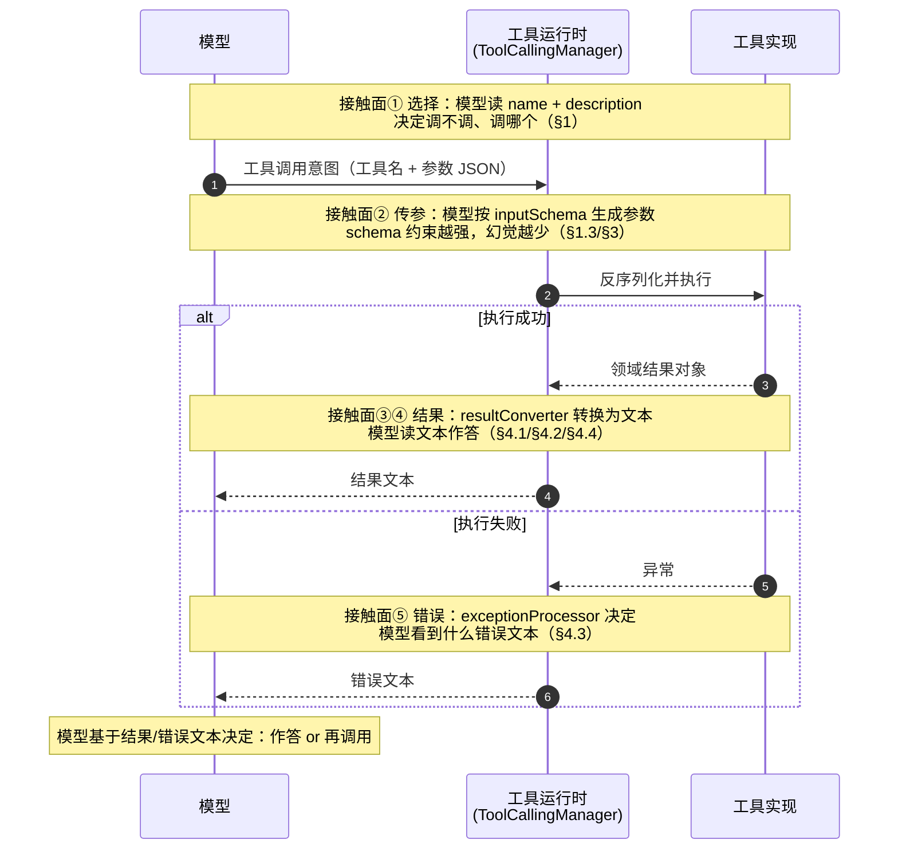
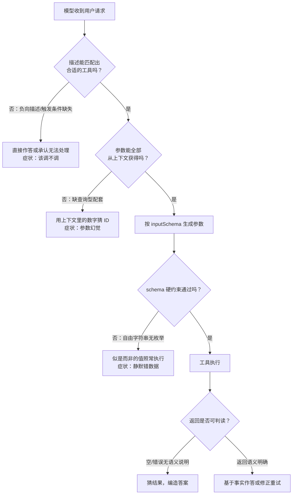
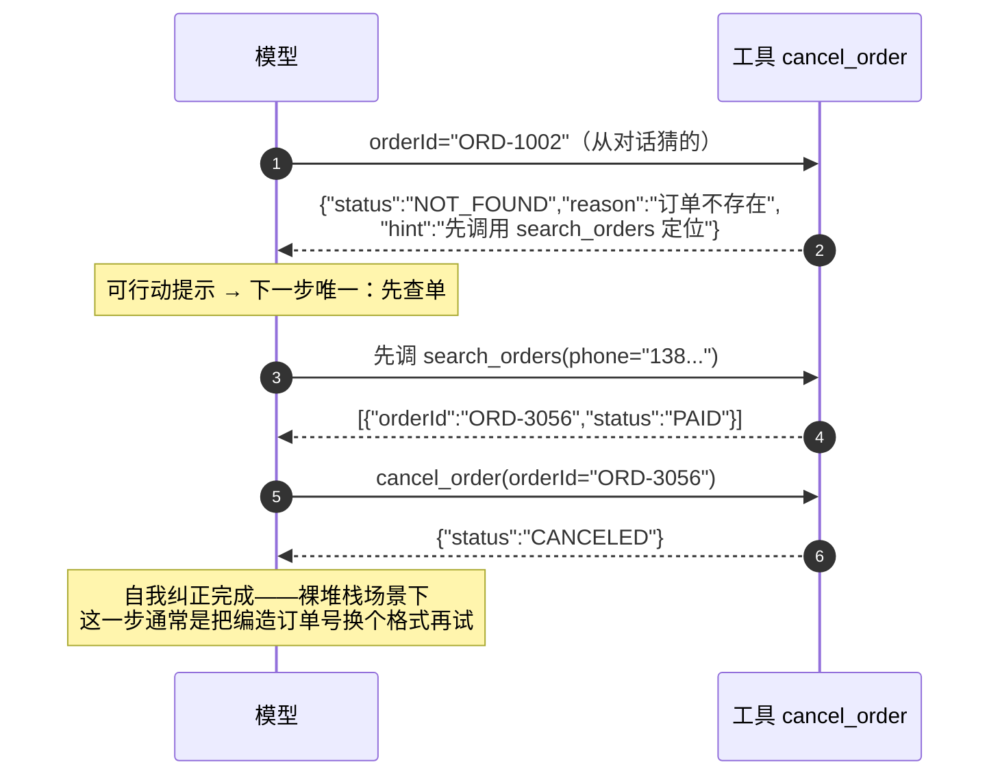

# 03 工具调优（上）· 接口设计学：把工具设计成模型能读对的契约

> **定位**：本文是「工具调优」上下两篇的上篇，讲**工具接口的设计质量**——怎么设计一个"LLM 友好"的工具，让模型选得对、传得准、读得懂、错得明白。覆盖五块内容：工具 schema 设计学（命名、description 三要素、`@ToolParam` 的正确使用）、工具粒度拆分（粗细两难、数量上限、按场景裁剪注册）、参数设计（扁平化、枚举约束、幂等键、查询型工具配套）、返回值工程（模型视角与用户视角的分离、截断策略、可行动的错误提示、resultFormatter 模式）。读者画像：已经会用 `@Tool` 定义并注册工具、正在维护一个真实上线 Agent 的中高级 Java 开发者与架构师——你面对的不是"工具怎么调用"的问题，而是"为什么模型总是调不对我的工具"的问题。前置阅读：[教程 10-调优实战与方法论/00-Agent病理总论]（本文是五环节模型中"工具环节"的专科门诊）、[教程 00-基础与核心/03-工具调用]（`@Tool` 注解、注册方式与工具调用循环的机制基础——本文不重复机制，只讲质量）。

---

## 0. 为什么工具层是效果差异的主战场

一个反复被验证的工程现象：两个团队用同一个基座模型、同一套框架、Prompt 质量也不相上下，产出的 Agent 效果却差距悬殊。把两边的系统拆开对比，差异往往不在模型、不在编排，而在**工具层**——工具怎么命名、描述怎么写、参数怎么约束、结果怎么返回。原因很直接：**模型对工具的全部理解，只来自你能让它看到的那几段文本**。它看不到你的 Java 实现、看不到你的 Javadoc、看不到你的领域知识，它能看到的是：

| 工程师看到的 | 模型看到的 |
|------|------|
| 一个带实现的 Java 方法 | 一个工具名（name） |
| 方法签名与类型系统 | 一段 JSON Schema（inputSchema） |
| `@Tool`/`@ToolParam` 注解 | 两段 description 文本 |
| 返回的领域对象（record/DTO） | 一段转换后的字符串 |
| 抛出的异常堆栈 | 一段错误文本（或空） |

工具调用的完整链路上，模型与工具之间有五个接触面，每一个接触面的设计质量都直接决定模型行为的正确性：



这五个接触面对应本文的五节。调优工具层的本质，就是**逐个接触面地问：模型在这一步看到的信息，够不够它做出正确决策？** 信息不够，模型只能猜——猜工具（选错工具）、猜参数（参数幻觉）、猜结果（把空结果当失败、把错误当真相）。

反过来说，这也是工具层调优的杠杆所在：Prompt 改一句话只影响一条指令，而工具 description 与 schema 是**每一次工具决策都要消费的契约**——把契约改对，收益是全局的。

> 遇到阻塞？→ 本文假定你已掌握 `@Tool` 定义、`MethodToolCallbackProvider` 注册与工具调用循环的机制；机制层面不清楚先回 [教程 00-基础与核心/03-工具调用 §2-§5]。想深入？→ 本文所有 API 签名均经本地 2.0.0 jar javap 实证，完整基准见 [附录 05-SpringAI2-API基准/02-Tool与Observation真实API]。

---

## 1. 工具 schema 设计学：命名、描述与参数契约

### 1.1 命名：让工具名可以被"朗读"

工具名是模型接触到的第一个信号。在选择工具时（接触面①），模型做的是一道阅读理解题：把用户意图与若干工具名+描述做匹配。名字写得好，匹配是直觉；写得差，匹配是猜谜。

工程实践收敛出的命名规范有四条：

1. **`动词_宾语`，全库统一一种风格**。动作在前，符合"意图→工具"的匹配方向（用户意图几乎总是"做某事"，先读动词就能初筛）。推荐 `snake_case`：`search_orders`、`create_refund_ticket`。`camelCase`（`searchOrders`）也可以工作，但**必须全库只选一种**——风格混杂时，模型会同时学到两套构词法，遇到新工具时猜测成本变高。
2. **禁缩写**。`usr`/`ord`/`amt`/`chk` 这类缩写省了几个字符，换来的却是模型的持续歧义：`usr` 是 user 还是 u.s.r.？`chk` 是 check 还是 chunk？Token 对模型不稀缺，歧义才致命。
3. **禁无信息动词与版本后缀**。`do_something`、`handle_order`、`process_data`、`manage_customer` 这类名字把决策负担全部转嫁给了 description；`refund_v2`、`get_user_new` 的 `v2/new` 对模型毫无语义，还会让它怀疑是否存在一个自己看不到的 v1。
4. **领域前缀做命名空间**。工具一多，跨领域同名冲突是必然的：客服域和物流域都有 `search_orders` 怎么办？加领域前缀：`crm_search_contacts`、`oms_search_orders`、`fin_create_invoice`。前缀同时是给模型的分类信号——它不需要读描述就知道这两个工具属于不同子系统。

对照改造：

| 病灶命名 | 问题 | 调优后 |
|------|------|------|
| `doSearch` | 动词无信息；camel 与库内 snake 混用 | `search_orders` |
| `procRefund` | 双重缩写 | `create_refund_ticket` |
| `handleOrder` | handle 无语义；读不出是查是改 | `get_order_status` / `cancel_order` |
| `getUserInfo2` | 版本后缀污染 | `get_user_profile` |
| 两个 `search_orders` | 跨域同名冲突 | `crm_search_contacts` / `oms_search_orders` |

### 1.2 description 三要素：何时用 / 参数约束 / 返回语义

`@Tool.description()` 是模型决定"调不调、什么时候调"的主要依据。病灶与正则的差异，在于是否写全三要素：

- **何时用**：触发条件与适用边界。不写，模型要么从不调用（不知道工具与自己的任务相关），要么过度调用（把所有问题都往这个工具上套）；
- **参数约束**：值域、格式、单位、前置依赖。主要写在 `@ToolParam` 上（下一小节），但工具级描述要交代跨参数的约束与参数之间的依赖关系；
- **返回语义**：返回什么结构、**"查不到"时长什么样**。最容易被忽略也最致命的一条——模型必须能区分"查了但为空"（正常，如实回答没有）与"调用失败"（异常路径）。返回语义不写，模型常把空结果当异常，进而编造一个"合理"的答案补位。

病灶与调优对照（同样的功能，两种契约质量）：

```java
// ===== 病灶：description 只有一个词，三要素全缺 =====
// Spring AI 2.0.0
public class OrderTools {

    @Tool(name = "orderTool", description = "订单")
    public OrderDetail query(
            @ToolParam(description = "id") String id) {
        return orderService.findDetail(id);
    }
}
```

模型读到的是：一个叫 `orderTool` 的工具，描述"订单"，参数"id"。用户问"我的包裹到哪了"——这个工具该不该调？`id` 从哪来？查不到返回什么？全靠猜。于是出现两类经典事故：**该调不调**（用户问物流，模型直接编一句"您的包裹正在派送中"）与**不该调乱调**（用户随便聊到"订单"两个字，模型就把对话上文里的数字拼成 id 发过去）。

```java
// ===== 调优后：三要素齐全的契约 =====
// Spring AI 2.0.0
public class OrderTools {

    @Tool(
        name = "get_order_status",
        description = """
                查询订单的当前状态与物流轨迹。
                何时用：用户询问某个订单"到哪了/发货没有/什么状态"，或要求查询订单进度时。
                何时不用：用户想修改或取消订单（用 cancel_order），想按条件找订单（用 search_orders）。
                参数：orderId 必须来自 search_orders 返回的 orderId 字段，禁止猜测。
                返回：订单状态、支付状态、物流轨迹列表（时间升序）；orderId 不存在时返回
                {"status":"NOT_FOUND"}，这不是错误，应如实告知用户。""",
        returnDirect = false
    )
    public OrderDetail getOrderStatus(
            @ToolParam(description = "订单号，格式 ORD-XXXXXX，必须来自 search_orders 的返回", required = true)
            String orderId) {
        return orderService.findDetail(orderId);
    }
}
```

三个要素分别压住了三类病灶。调优后还有一个容易被忽视的细节：**把"何时不用"也写出来**。工具越多，相邻工具的边界越模糊，负向描述（"何时不用"）是模型区分近义工具最有效的信号。

三要素缺失与对应症状的映射，整理成表：

| 缺失要素 | 模型侧症状 | 归因时看到的假象 |
|------|------|------|
| 缺"何时用" | 该调不调 / 不该调乱调 | 像模型能力问题，实为契约缺失 |
| 缺"参数约束" | 格式幻觉（日期、单号、枚举值乱造） | 像随机故障，复现全靠运气 |
| 缺"返回语义" | 空结果被当失败，进而编造答案 | "流畅但错误"的高危形态 |

### 1.3 `@ToolParam`：description 与 required 的正确使用

`@ToolParam` 只有 `required()` 与 `description()` 两个属性（javap 实证，无 `value()`）：`required=true` 的参数会进入 JSON Schema 的 required 数组，模型被强制为它生成值；`required=false` 的参数模型可以不传。

由此推出两条使用铁则：

- **真必填才 `required=true`**。把事实上可空的参数标成必填，等于**逼迫模型编造值**——它没有"不传"这个选项，只能硬造 `"0"`、`"N/A"`、`"未知"`。这类编造值一路穿透到业务层，是最难排查的参数幻觉来源（看起来请求成功了，值是假的）。
- **假必填别漏标**。把真必填的参数标成 `required=false`，模型会"聪明地"省略它，工具端校验报错，模型拿到一个看不懂的报错再重试——白烧两轮推理。

description 的写法，从「参数叫什么」升级为「这个参数长什么样、从哪来、有哪些合法值」。候选值有限的参数，**首选 Java enum 类型**——`JsonSchemaGenerator` 会把 enum 类型生成为带 `enum` 数组的 JSON Schema 硬约束（可用 `toolDefinition.inputSchema()` 打印验证），模型只能从中选择；保底做法是把候选值逐个写进 description。

```java
// ===== 病灶：自由字符串 + 模糊描述 =====
// Spring AI 2.0.0
@Tool(name = "create_ticket", description = "创建工单")
public String createTicket(
        @ToolParam(description = "客户", required = true) String customerId,
        @ToolParam(description = "类型", required = true) String type) {
    return ticketService.create(customerId, type);
}
// 症状①：customerId 是数据库主键，模型从上下文拿不到就编 "CUST-001"；
// 症状②：type 传 "refund"、"退款"、"REFUND" 随机出现，业务层 if equals 反复失配。
```

```java
// ===== 调优后：enum 硬约束 + 数据血缘声明 =====
// Spring AI 2.0.0
public enum TicketType {
    REFUND, EXCHANGE, REPAIR, COMPLAINT
}

@Tool(name = "create_ticket",
      description = "为客户创建售后工单。仅在用户明确表达售后诉求后调用。")
public String createTicket(
        @ToolParam(description = "客户 ID（格式 CUST-XXXXX），必须来自 get_customer 返回的 customerId，禁止猜测",
                   required = true)
        String customerId,
        @ToolParam(description = "工单类型", required = true)
        TicketType type) {
    return ticketService.create(customerId, type);
}
```

`type` 从自由字符串变成 enum 后，JSON Schema 里多出一个 `enum: [REFUND, EXCHANGE, REPAIR, COMPLAINT]` 约束——**把"格式校验"从运行时提前到了解码时**：模型要么选合法值，要么调用直接被 schema 拒绝，不存在第三种"传了个似是而非的字符串还执行成功"的状态。

把"模型如何消费这套契约"画出来，能更清楚地看到每一条设计规则卡在哪个岔路口：



这张图里每个"症状分支"都对应一条前文的设计规则——工具层调优不是改模型，而是**逐个岔路口补上缺失的路标**。

---

## 2. 工具粒度拆分：轮次爆炸与参数幻觉的两难

### 2.1 粗与细的两难

粒度是工具设计中最典型的架构取舍，两端各有一种病：

- **拆太细 → 轮次爆炸**。把一个业务动作拆成多个微工具，模型每完成一个动作要消耗多轮"推理→调用→看结果"循环，每轮都是一次完整的模型推理（延迟与 token 成本线性叠加），且中途任何一轮选错工具，整个业务动作就偏航。
- **拆太粗 → 参数幻觉**。把一大坨能力塞进一个工具，参数列表膨胀、参数间依赖隐藏在描述之外，模型要在一次生成里同时猜对所有参数——维度越多，联合正确率越低。

病灶与调优对照（同一个"更新客户联系方式"需求）：

```java
// ===== 病灶 A：拆太细（轮次爆炸）=====
// Spring AI 2.0.0
public class CustomerTools {
    @Tool(name = "set_customer_name", description = "设置客户姓名")
    public void setCustomerName(@ToolParam(description = "客户 ID", required = true) String id,
                                @ToolParam(description = "姓名", required = true) String name) { }

    @Tool(name = "set_customer_phone", description = "设置客户电话")
    public void setCustomerPhone(@ToolParam(description = "客户 ID", required = true) String id,
                                 @ToolParam(description = "电话", required = true) String phone) { }

    @Tool(name = "set_customer_email", description = "设置客户邮箱")
    public void setCustomerEmail(@ToolParam(description = "客户 ID", required = true) String id,
                                 @ToolParam(description = "邮箱", required = true) String email) { }
}
// 用户："帮我把收货人改成张三，电话 138xxxx"——模型需要 2 轮调用 + 2 轮推理；
// 改 4 个字段 = 4 轮。每轮都可能选错工具或漏传 id。
```

```java
// ===== 病灶 B：拆太粗（参数幻觉）=====
// Spring AI 2.0.0
@Tool(name = "manage_customer", description = "客户管理，支持查询/修改/删除")
public String manageCustomer(
        @ToolParam(description = "操作：update 或 delete 或 query", required = true) String action,
        @ToolParam(description = "客户 JSON", required = true) String payloadJson) {
    // action 的合法值只有模型猜；payloadJson 完全脱离 schema 约束
}
// 症状：action 传 "modify"/"change"；payloadJson 手拼 JSON 转义出错、字段名漂移，
// 且整个工具的 schema 对模型几乎零约束。
```

```java
// ===== 调优后：以"一个模型可表达的完整意图"为粒度单位 =====
// Spring AI 2.0.0
public class CustomerTools {

    @Tool(name = "update_customer_contact",
          description = """
                  更新客户的联系方式（姓名/电话/邮箱任意子集）。
                  何时用：用户要求修改收货人信息、联系方式时。
                  只传需要修改的字段，未提供的字段不会被改动。""")
    public String updateCustomerContact(
            @ToolParam(description = "客户 ID，必须来自 get_customer 或 search_customers 的返回", required = true)
            String customerId,
            @ToolParam(description = "新姓名，不改则不传", required = false)
            String newName,
            @ToolParam(description = "新手机号，11 位数字，不改则不传", required = false)
            String newPhone,
            @ToolParam(description = "新邮箱，不改则不传", required = false)
            String newEmail) {
        return customerService.updateContact(customerId, newName, newPhone, newEmail);
    }
}
```

调优后的设计同时避开了两种病：一个工具对应一个完整业务意图（"改联系方式"），部分更新语义由 `required=false` 的可选参数表达（想改哪个传哪个），一次调用完成。经验判据可以收拢为三条：

1. **一个工具 = 一个模型能一句话表达的完整意图**，而不是一个 REST 端点或一个 service 方法——技术边界和语义边界经常不一致，以语义为准；
2. **一次常见业务动作 ≤ 2 次工具调用**（含配套的查询调用），超过就要考虑合并；
3. **单工具参数建议控制在 8 个以内**，且互相依赖的参数要么合并、要么拆成两个意图。

### 2.2 工具数量上限与选择准确率衰减

工具数量对效果的影响是**双向挤压**的：

- **选择难度**：选工具对模型是一道多类分类题，候选从 10 个涨到 50 个，相近工具之间的区分难度非线性上升——描述写得再有差异，也架不住候选基数大。工程经验上，**单场景注册工具控制在 20 个以内**效果最佳，超过 30 个后选错率明显抬头，必须做分组或裁剪。
- **常驻成本**：所有工具的 schema 与描述作为请求的一部分**每一轮都随 prompt 发送**。40 个工具可能平白占掉数千 token，且每轮重复计费。这与 Prompt Cache 的前缀稳定性直接相关：工具列表频繁增删会打散缓存前缀（深入见 [附录 09-语义缓存与性能/01-Prompt缓存与KVCache]）。

数量问题的正解不是"少做功能"，而是**按场景裁剪注册**——这也是下一小节的主题。

### 2.3 按场景裁剪注册：不是所有对话都该看到所有工具

一个完整的客服 Agent 可能有 40 个工具：售前咨询 12 个、订单售后 10 个、退款操作 6 个、内部运营 12 个。让闲聊售前的用户会话背动全部 40 个 schema，既贵又乱。正解是**按场景注册子集**：不同场景的 `ChatClient` 挂不同的工具集。

```java
// ===== 按场景裁剪注册（Spring AI 2.0.0，全部 API 经 javap 实证）=====
package com.demo.agent.tool;

import org.springframework.ai.chat.client.ChatClient;
import org.springframework.ai.tool.ToolCallbackProvider;
import org.springframework.ai.tool.method.MethodToolCallbackProvider;
import org.springframework.context.annotation.Bean;
import org.springframework.context.annotation.Configuration;

@Configuration
public class ScenarioChatClientConfig {

    // 领域工具类各自内聚 @Tool 方法（见 [教程 00-基础与核心/03-工具调用 §3]）
    // MethodToolCallbackProvider.builder().toolObjects(Object...) 实证方法
    @Bean
    public ToolCallbackProvider presaleTools(PresaleToolBox presaleToolBox) {
        return MethodToolCallbackProvider.builder().toolObjects(presaleToolBox).build();
    }

    @Bean
    public ToolCallbackProvider aftersaleTools(OrderToolBox orderToolBox,
                                               RefundToolBox refundToolBox) {
        return MethodToolCallbackProvider.builder()
                .toolObjects(orderToolBox, refundToolBox)
                .build();
    }

    // 场景一：售前咨询——只见 12 个查询类工具，退款工具完全不可见
    @Bean
    public ChatClient presaleChatClient(ChatClient.Builder builder,
                                        ToolCallbackProvider presaleTools) {
        return builder
                .defaultSystem("你是售前顾问，只回答商品与活动问题。")
                .defaultToolCallbacks(presaleTools)   // ChatClient.Builder 实证方法
                .build();
    }

    // 场景二：售后处理——订单 + 退款工具，但内部运营工具不可见
    @Bean
    public ChatClient aftersaleChatClient(ChatClient.Builder builder,
                                          ToolCallbackProvider aftersaleTools) {
        return builder
                .defaultSystem("你是售后专员，处理订单查询与退款申请。")
                .defaultToolCallbacks(aftersaleTools)
                .build();
    }
}
```

裁剪后每个场景的候选集回到 10-20 个，选择准确率回到高位，schema 常驻成本降为三分之一。**工具权限分级与数据隔离**的架构级展开（哪些租户、哪些角色能看见哪些工具）属于多租户与安全范畴，见 [教程 04-企业级架构主干] 系列多租户篇；本文关注的是它对**工具选择准确率**的直接收益。

---

## 3. 参数设计：让模型不需要"猜"

schema 设计学决定了模型"选对工具"，参数设计决定它"传对值"。参数层的总原则一句话：**凡是能让模型不猜的，就不要让它猜**。

### 3.1 扁平优于深嵌套

参数结构越深，模型生成 JSON 的出错面越大：嵌套对象的字段名漂移、引号括号配对失败、数组与对象嵌套混淆。病灶与正例：

```java
// ===== 病灶：深层嵌套 + JSON 字符串参数 =====
// Spring AI 2.0.0
@Tool(name = "search_hotels", description = "搜索酒店")
public String searchHotels(
        @ToolParam(description = "查询条件 JSON，格式：{\"location\":{\"city\":\"...\"},\"stay\":{\"checkIn\":\"yyyy-MM-dd\",\"guests\":2}}",
                   required = true)
        String conditionJson) {
    // 模型手拼带转义的嵌套 JSON——转义错误率与嵌套深度成正比
}
```

```java
// ===== 调优后：扁平参数 + 类型各归其位 =====
// Spring AI 2.0.0
import java.time.LocalDate;

@Tool(name = "search_hotels",
      description = "按城市与入住条件搜索酒店。city 必填，其余可选，可选条件不传即不过滤。")
public String searchHotels(
        @ToolParam(description = "城市，如：上海、杭州", required = true) String city,
        @ToolParam(description = "入住日期，ISO 格式 yyyy-MM-dd", required = false)
        LocalDate checkIn,
        @ToolParam(description = "入住晚数，默认 1", required = false) Integer nights,
        @ToolParam(description = "入住人数，默认 2", required = false) Integer guests) {
    return hotelService.search(city, checkIn, nights, guests);
}
```

扁平化之后，每个参数独立获得自己的类型与描述，schema 从"一段要抄写的模板"变成"一组彼此独立的填空题"——填空题的出错率远低于抄写题。

### 3.2 枚举约束优于自由字符串

§1.3 已给出完整对照，这里补一条工程视角的判断：**所有"候选值有限且稳定"的参数都应该 enum 化**——订单类型、工单类型、排序方向、时间粒度、货币币种。判据很简单：如果你在业务代码里为某个参数写了 `if ("refund".equals(type))`，它就该是 enum。把"合法值域"从 javadoc 和 code review 里搬进 JSON Schema，让约束在解码层生效。候选值会随业务膨胀的参数（如商品类目）用"查询型配套工具"兜底：提供 `list_product_categories` 让模型先查合法值再传参，而不是把 200 个类目硬编码进 description。

### 3.3 幂等键：不要让模型生成幂等键

写操作工具（下单、退款、发工单）需要幂等键防重复执行。一个看似自然、实则错误的设计是让模型生成幂等键：模型这轮生成 `idem-7f3a`，**下一轮重试时它没有义务生成同一个值**——重试恰恰是最需要幂等保护的时刻，于是幂等键形同虚设。

正确的两个落点：

1. **确定性派生**：幂等键由业务上本就确定的字段派生（如 `orderId + 操作类型 + 业务日期` 的哈希），模型传业务字段，幂等键在工具内部合成——同一笔业务无论重试多少轮，派生出的键恒定；
2. **应用层注入**：幂等键由前端/网关在请求进入时生成，经 `ToolContext` 传入工具执行现场，模型全程不接触。

```java
// ===== 幂等键的正确落点（Spring AI 2.0.0）=====
package com.demo.agent.tool;

import org.springframework.ai.chat.model.ToolContext;
import org.springframework.ai.tool.annotation.Tool;
import org.springframework.ai.tool.annotation.ToolParam;
import java.nio.charset.StandardCharsets;
import java.security.MessageDigest;
import java.time.LocalDate;

public class RefundToolBox {

    // 方案一：确定性派生——模型只传业务字段，幂等键内部合成
    @Tool(name = "create_refund",
          description = "为订单发起退款。同一订单同一自然日重复调用不会重复退款。")
    public String createRefund(
            @ToolParam(description = "订单号，必须来自 search_orders 的返回", required = true)
            String orderId,
            @ToolParam(description = "退款原因", required = true) String reason,
            ToolContext context) {          // 实证：ToolCallback.call(String, ToolContext)
        // 确定性幂等键：同一订单同一天的退款请求，键恒定
        String idempotentKey = sha256(orderId + "|" + "REFUND" + "|" + LocalDate.now());
        return refundService.create(orderId, reason, idempotentKey);
    }

    // 方案二：应用层注入——网关/前端生成，经 ToolContext 透传
    @Tool(name = "submit_repair_order", description = "提交维修工单")
    public String submitRepairOrder(
            @ToolParam(description = "设备编号", required = true) String deviceId,
            @ToolParam(description = "故障描述", required = true) String faultDesc,
            ToolContext context) {
        String idempotentKey = (String) context.getContext().get("X-Idempotent-Key");
        return repairService.submit(deviceId, faultDesc, idempotentKey);
    }

    private static String sha256(String raw) {
        try {
            byte[] digest = MessageDigest.getInstance("SHA-256")
                    .digest(raw.getBytes(StandardCharsets.UTF_8));
            return java.util.HexFormat.of().formatHex(digest);
        } catch (Exception e) {
            throw new IllegalStateException("幂等键生成失败", e);
        }
    }
}
```

幂等键设计在 [教程 00-基础与核心/03-工具调用 §8] 出现过（`@ToolParam` 显式暴露幂等键参数）；本节的深化结论是：**显式暴露给模型是下策**，确定性派生与 `ToolContext` 注入才是生产形态。

### 3.4 避免让模型猜 ID：查询型工具配套

最危险的参数幻觉是**猜主键**。用户说"帮我取消刚才那单"，上下文里根本没有订单号，模型却会"配合地"编一个格式正确的 `ORD-1002` 传过去——格式对了，校验过了，**取消的可能是别人的订单**。防线有两道：

1. **描述里写明数据血缘**：ID 类参数的 description 必须声明"值必须来自哪个工具的返回、哪个字段"，并加一句"禁止猜测"；
2. **配套查询型工具**：凡是消费 ID 的写操作工具，必须有一个能按人话条件（姓名、手机号、时间范围）定位到 ID 的查询工具作为前置，并在描述中互相引用。

```java
// ===== 查询型工具配套 + 数据血缘声明（Spring AI 2.0.0）=====
@Tool(name = "search_orders",
      description = """
              按条件搜索订单列表。何时用：用户想取消/退款但会话中没有明确订单号时，必须先调用本工具定位订单。
              返回：前 10 条匹配订单（含 orderId、商品摘要、状态、金额）；无匹配时返回空列表，不是错误。""")
public String searchOrders(
        @ToolParam(description = "下单人手机号，11 位数字", required = false) String phone,
        @ToolParam(description = "商品关键词", required = false) String keyword) {
    return orderQueryService.searchBrief(phone, keyword);
}

@Tool(name = "cancel_order",
      description = """
              取消一个未发货订单。
              前置：orderId 必须来自 search_orders 的返回结果，禁止根据对话猜测或编造订单号。
              会话中查不到订单时，先调用 search_orders，仍找不到则向用户确认，不要调用本工具。""")
public String cancelOrder(
        @ToolParam(description = "订单号（ORD-XXXXXX），必须来自 search_orders 返回的 orderId 字段，禁止猜测",
                   required = true)
        String orderId) {
    return orderService.cancel(orderId);
}
```

两个工具的描述互相引用，构成一条完整的"定位→操作"链路：模型先拿手机号查订单，从返回结果中取 `orderId`，再传给 `cancel_order`。参数从"从对话里猜"变成"从上一个工具的返回里抄"，**幻觉源头被结构性消除**。

---

## 4. 返回值工程：模型消费的是文本，不是对象

工具返回的领域对象会经过 `ToolCallResultConverter` 转成字符串再进入模型的上下文（接触面③④）。默认实现 `DefaultToolCallResultConverter` 的行为（字节码实证）：返回类型为 `void` 时给模型 `"Done"`；返回 `RenderedImage` 时转 PNG base64；**其余一律 JSON 序列化**。也就是说，你的 record 长什么样、字段叫什么、带了多少垃圾字段，模型就原样看到什么。返回值工程就是接管这条转换链，主动决定"模型看到什么"。

### 4.1 返回给模型 vs 返回给用户：`returnDirect` 的取舍

`@Tool` 有一个 `returnDirect()` 属性（默认 `false`，实证）。设为 `true` 时，工具结果**直接作为最终回复返回给用户，不再回模型加工**。这是一个"结果是否需要模型润色"的决策：

| 判据 | `returnDirect = false`（默认） | `returnDirect = true` |
|------|------|------|
| 结果即答案（查价、查库存） | 多烧一轮推理，还可能被模型改写数字 | 合适：原文直达，零失真 |
| 需要汇总/合并多工具结果 | 合适 | 不行：结果不回模型，无法参与推理 |
| 需要按用户语气组织 | 合适 | 不行：返回的是工具的原始文本 |
| 结果含敏感字段需脱敏 | 合适（在转换层处理） | 危险：原文直达用户 |

多数业务工具应保持默认 `false`；只有"结果本身就是最终答案、且逐字保真很重要"的查询类工具（价格、库存、配置项）才开 `true`。

### 4.2 结果截断策略：摘要 + 引用 + 翻页游标

大结果无截断地进上下文，是"垃圾进垃圾出"的典型：10 万字文档塞给模型，关键信息被稀释，还烧掉巨额 token。正确姿势是**返回页 + 摘要 + 引用**：给模型前 N 条 + 总量 + 是否还有 + 翻页游标，让它按需续读。

```java
// ===== 截断：分页返回（Spring AI 2.0.0）=====
package com.demo.agent.tool;

import java.util.List;
import org.springframework.ai.tool.annotation.Tool;
import org.springframework.ai.tool.annotation.ToolParam;

public record LogPage(
        int total,            // 命中总数：让模型知道全集多大
        List<String> items,   // 本页内容（截断后）
        boolean hasMore,      // 是否还有更多
        String nextCursor) {  // 翻页游标，传回本工具即可取下一页
}

public class LogToolBox {

    private static final int PAGE_SIZE = 20;

    @Tool(name = "search_logs",
          description = """
                  按关键词检索服务日志。返回前 20 条（时间倒序）与分页信息；
                  total 是命中总数，需要更多时携带 nextCursor 再次调用本工具翻页。
                  无匹配时返回 total=0 的空页，不是错误。""")
    public LogPage searchLogs(
            @ToolParam(description = "日志关键词", required = true) String keyword,
            @ToolParam(description = "翻页游标，首次调用不传", required = false) String cursor) {
        List<String> all = logService.search(keyword);
        int from = resolveOffset(cursor);
        List<String> page = all.subList(from, Math.min(from + PAGE_SIZE, all.size()));
        boolean more = from + PAGE_SIZE < all.size();
        return new LogPage(all.size(), page, more, more ? "offset=" + (from + PAGE_SIZE) : null);
    }

    private int resolveOffset(String cursor) {
        if (cursor == null || cursor.isBlank()) {
            return 0;
        }
        return Integer.parseInt(cursor.replace("offset=", ""));
    }
}
```

配套的 description 写明了每页多少、如何翻页、空结果长什么样——**返回结构与描述是同一个契约的两半，必须同步改**。经验阈值：单次返回给模型的内容控制在 KB 量级（几十条以内）；大文档检索类工具优先返回"摘要 + 定位引用（文档 ID/段落号）"，让模型按引用点二次取全文。

### 4.3 错误信息设计：可行动的错误提示

工具执行异常时，默认异常处理器会把异常消息文本回给模型（接触面⑤）。模型看到 `"java.lang.NullPointerException"` 能做什么？**什么都做不了，只能瞎猜**：换着花样重试同一个错误调用、或编一个"已处理完成"安抚用户。这就是错误路径上的参数幻觉放大器。

可行动的错误提示遵循一个模板：**发生了什么（fact） + 为什么（cause） + 现在该做什么（action）**。让模型的下一步是确定的。

```java
// ===== 病灶：裸异常上抛，模型读到堆栈 =====
// Spring AI 2.0.0
@Tool(name = "get_order_status", description = "查询订单状态")
public OrderDetail getOrderStatus(@ToolParam(description = "订单号", required = true) String orderId) {
    return orderService.findDetail(orderId);   // 查不到直接抛 IllegalArgumentException
}
// 模型读到："IllegalArgumentException: 订单不存在"——它不知道该换参数、先查单还是放弃，
// 典型行为：换个编造的订单号重试两轮，然后放弃或编造答案。
```

```java
// ===== 调优后一：业务错误作为受控返回值（结构化 + 可行动）=====
// Spring AI 2.0.0
@Tool(name = "get_order_status", description = "查询订单状态，orderId 必须来自 search_orders")
public String getOrderStatus(@ToolParam(description = "订单号，格式 ORD-XXXXXX", required = true) String orderId) {
    OrderDetail detail = orderService.findOrNull(orderId);
    if (detail == null) {
        // 可行动模板：发生了什么 + 为什么 + 下一步做什么
        return """
                {"status":"NOT_FOUND",
                 "reason":"订单 %s 不存在于当前系统",
                 "hint":"订单号可能拼写有误，或应先调用 search_orders 用手机号定位订单"}"""
                .formatted(orderId);
    }
    return toCompactJson(detail);
}
```

```java
// ===== 调优后二：自定义异常处理器，拦截漏网的异常（Spring AI 2.0.0，API 均经 javap 实证）=====
package com.demo.agent.tool;

import org.springframework.ai.tool.execution.ToolExecutionException;
import org.springframework.ai.tool.execution.ToolExecutionExceptionProcessor;

public class ActionableErrorProcessor implements ToolExecutionExceptionProcessor {

    @Override
    public String process(ToolExecutionException exception) {
        // 接口实证：String process(ToolExecutionException)
        // getToolDefinition() 实证：可拿到出错的工具名，用于定位
        String toolName = exception.getToolDefinition().name();
        return ("工具 %s 执行失败：系统内部错误。该错误与参数取值无关，"
                + "不要修改参数重试；请向用户如实说明工具暂不可用。")
                .formatted(toolName);
    }
}
```

```java
// ===== 注册自定义异常处理器（Spring AI 2.0.0）=====
import org.springframework.ai.model.tool.DefaultToolCallingManager;
import org.springframework.ai.model.tool.ToolCallingManager;
import org.springframework.context.annotation.Bean;
import org.springframework.context.annotation.Configuration;

@Configuration
public class ToolCallingConfig {

    // ToolCallingManager 真实包为 org.springframework.ai.model.tool（javap 实证）
    @Bean
    public ToolCallingManager toolCallingManager(ActionableErrorProcessor processor) {
        return ToolCallingManager.builder()
                .toolExecutionExceptionProcessor(processor)
                .build();
    }
}
```

错误路径的设计目标可以用一句话检验：**模型读完错误文本后，下一步动作是唯一的、正确的**——要么修正参数重试，要么换前置工具，要么如实告知用户；不存在"猜"。把这条闭环画出来：



对比病灶行为：同样的 NOT_FOUND，裸异常文本下模型倾向于"换个编造值再试"；可行动提示下模型走"先查单再取消"的正确链路。**错误文本是给模型读的 API 文档的错误页**，值得像正常返回一样认真设计。

### 4.4 resultFormatter 模式：`ToolCallResultConverter`

把 4.1-4.3 的经验收拢成一个可复用的模式：**resultFormatter 模式——在领域结果与模型上下文之间设立一层显式的文本转换，由它统一执行三条纪律**：

1. **关键信息前置**：模型对长文本的注意力随距离衰减，把状态、结论、错误码放在文本最前面；
2. **去噪**：内部主键、审计字段、嵌套的空对象不出现在模型视野里——少一个字段就少一分被误抄的概率；
3. **结构稳定**：同族工具的返回 JSON 结构保持一致（同样的状态字段名、同样的空值表达），模型学一次就能读所有工具。

Spring AI 2.0 为这个模式提供的真实挂点就是 `ToolCallResultConverter`（接口 `String convert(Object result, Type returnType)`，javap 实证），两个接入位：`@Tool(resultConverter = X.class)` 或 `FunctionToolCallback.Builder.toolCallResultConverter(X)`。

```java
// ===== resultFormatter：自定义结果转换器（Spring AI 2.0.0）=====
package com.demo.agent.tool;

import java.lang.reflect.Type;
import org.springframework.ai.tool.annotation.Tool;
import org.springframework.ai.tool.execution.ToolCallResultConverter;

public class OrderResultConverter implements ToolCallResultConverter {

    @Override
    public String convert(Object result, Type returnType) {
        if (!(result instanceof OrderDetail d)) {
            return "{\"status\":\"EMPTY\"}";     // 统一空值表达
        }
        // 关键信息前置 + 去噪：只留模型作答需要的字段，状态置顶
        return """
                {"status":"%s","payStatus":"%s","orderId":"%s",
                 "itemSummary":"%s","amount":%s,
                 "lastTrace":"%s"}"""
                .formatted(d.status(), d.payStatus(), d.orderId(),
                        d.itemSummary(), d.amount(),
                        d.traces().isEmpty() ? "暂无物流" : d.traces().get(d.traces().size() - 1));
    }
}

public class OrderToolBox {

    @Tool(name = "get_order_status",
          description = "查询订单状态与最新物流",
          resultConverter = OrderResultConverter.class)   // 实证：@Tool 有 resultConverter 属性
    public OrderDetail getOrderStatus(
            @ToolParam(description = "订单号，必须来自 search_orders", required = true) String orderId) {
        return orderService.findDetail(orderId);
    }
}
```

转换器写一次，同族所有工具复用；返回结构的演进（加字段、改状态枚举）收敛在转换器一处，模型侧契约保持稳定。这与 §1.2 的"返回语义"、§4.3 的错误模板共同构成完整闭环：**模型在整个工具生命周期里读到的每一行文本，都是设计出来的，不是对象序列化的副产品**。

---

## 5. 上线前工具接口调优清单

全文规则收拢为一张可执行的 checklist，上线前逐项过一遍：

| # | 检查项 | 合格标准 |
|------|------|------|
| 1 | 命名 | `动词_宾语`、无缩写、无 v2/new 后缀、全库风格统一、跨域有前缀 |
| 2 | description | 三要素齐全（何时用/参数约束/返回语义），近义工具写了"何时不用" |
| 3 | required | 真必填才 true；可空参数 false，且描述里写默认行为 |
| 4 | 枚举参数 | 候选值有限的参数一律 enum 类型，不用自由字符串 |
| 5 | 参数结构 | 扁平；单工具参数 ≤ 8 个；无 JSON 字符串参数 |
| 6 | ID 参数 | 描述声明数据血缘（来自哪个工具），有配套查询型工具 |
| 7 | 幂等键 | 写操作有幂等保护，键由派生或 ToolContext 注入，模型不接触 |
| 8 | 粒度 | 一个工具一个完整意图；常见动作 ≤ 2 次调用 |
| 9 | 数量 | 单场景 ≤ 20 个工具，超出按场景裁剪注册 |
| 10 | 返回结构 | 分页 + total + hasMore + nextCursor；单次返回 KB 量级 |
| 11 | 错误路径 | 业务错误返回"事实+原因+行动"；无裸堆栈进上下文 |
| 12 | returnDirect | 仅"结果即答案"的查询工具为 true，其余默认 false |
| 13 | 结果转换 | 同族工具共用 resultConverter，结构稳定、关键信息前置 |

这张清单也可以反过来自我诊断：线上出现了"模型选错工具/传错参数/编造答案"的症状时（见 [教程 10-调优实战与方法论/00-Agent病理总论] 的归因流程），先对照检查对应接触面的契约，再考虑动 Prompt 或换模型——**工具层的修复是确定性修复，而 Prompt 层的补偿是概率性补偿**。

## 适用场景

- 自研 Agent 的工具集已经能跑通，但存在选错工具、参数幻觉、空结果编造、错误重试死循环等症状，需要系统性治理；
- 工具数量增长中（接近或超过 20 个），需要确立粒度标准与场景裁剪机制；
- 工具集将作为企业资产长期演进（多人维护、多场景复用），需要统一的接口设计规范与 review checklist；
- 接入外部系统的工具封装（ERP/CRM/工单系统），返回结构无法控制，需要 resultFormatter 层做模型侧适配。

## 不适用场景

- 工具机制本身不熟（`@Tool`、注册、工具调用循环尚不清楚）——先读 [教程 00-基础与核心/03-工具调用]；
- 需要防御恶意工具或工具描述注入的场景——那属于供应链安全，见 [附录 08-Agent安全深度/01-ToolPoisoning攻击]（本文假定工具是自研可信的）;
- 工具执行的性能与吞吐瓶颈（线程池、超时、并发限流）——那是执行层问题，见 [教程 08-架构师进阶/04-Agent性能优化]；
- Prompt 本身的质量调优（本文聚焦工具契约；System Prompt 分层与回归治理见 [教程 10-调优实战与方法论/02-Prompt调优工程]）。

## 总结

工具调优的对象不是模型，而是**模型与工具之间的契约**。本文沿五个接触面展开：

1. **schema 设计学**：命名可朗读（动词_宾语、禁缩写、领域前缀），description 三要素（何时用/参数约束/返回语义），`required` 只标真必填——三条规则分别封住"选错工具、不敢调工具、被逼编造参数"；
2. **粒度拆分**：拆太细轮次爆炸、拆太粗参数幻觉；以"一个完整意图"为粒度单位，单场景工具数控制在 20 以内，超出按场景裁剪注册；
3. **参数设计**：扁平优于嵌套、枚举优于自由字符串、幂等键不交给模型、ID 参数必配查询型工具并声明数据血缘——总原则是**不让模型猜任何它猜不准的东西**；
4. **返回值工程**：`returnDirect` 是"结果是否需要模型加工"的决策；大结果分页返回；错误文本按"事实+原因+行动"设计，让模型的下一步唯一且正确；
5. **resultFormatter 模式**：用 `ToolCallResultConverter` 在领域对象与模型上下文之间设立显式转换层，执行关键信息前置、去噪、结构稳定三条纪律。

下一篇（工具调优·下）将进入工具层的运行时侧：工具执行的并发与超时治理、观测埋点与调用质量评估。上下两篇合起来构成完整的工具层调优方法论：上篇定契约，下篇治运行。

---

**本文 API 实证说明**：文中 `@Tool`/`@ToolParam`/`ToolCallback`/`ToolDefinition`/`ToolCallResultConverter`/`ToolExecutionExceptionProcessor`/`MethodToolCallbackProvider`/`FunctionToolCallback`/`ToolCallingManager`/`ToolExecutionResult` 均经本地 Maven 仓库 2.0.0 jar `javap` 实证（含 `DefaultToolCallResultConverter` 字节码行为），完整基准见 [附录 05-SpringAI2-API基准/02-Tool与Observation真实API]。
