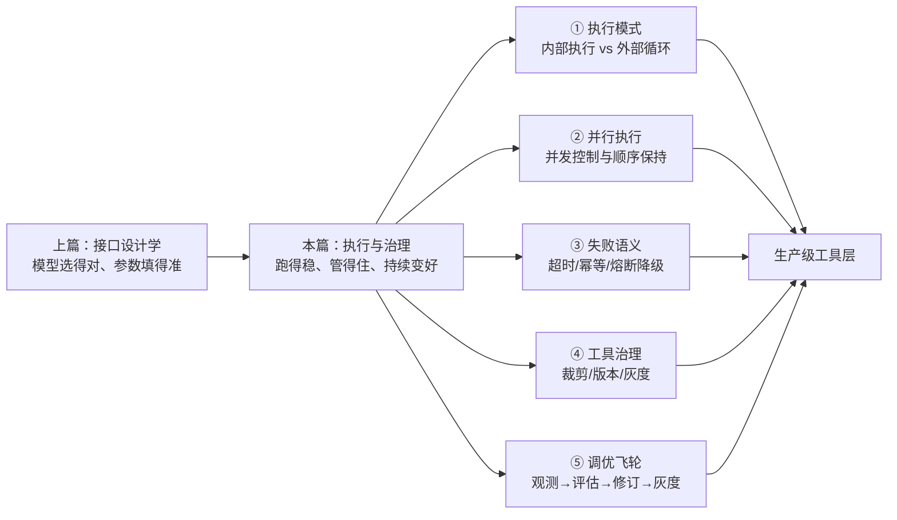
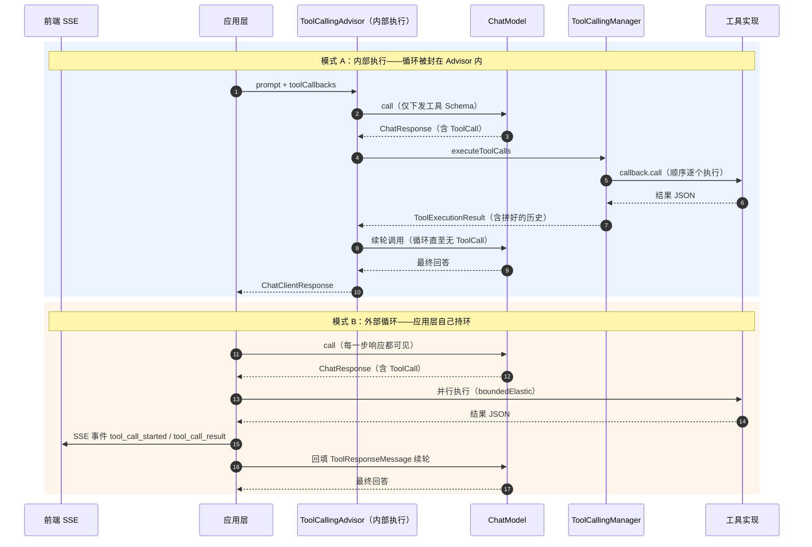
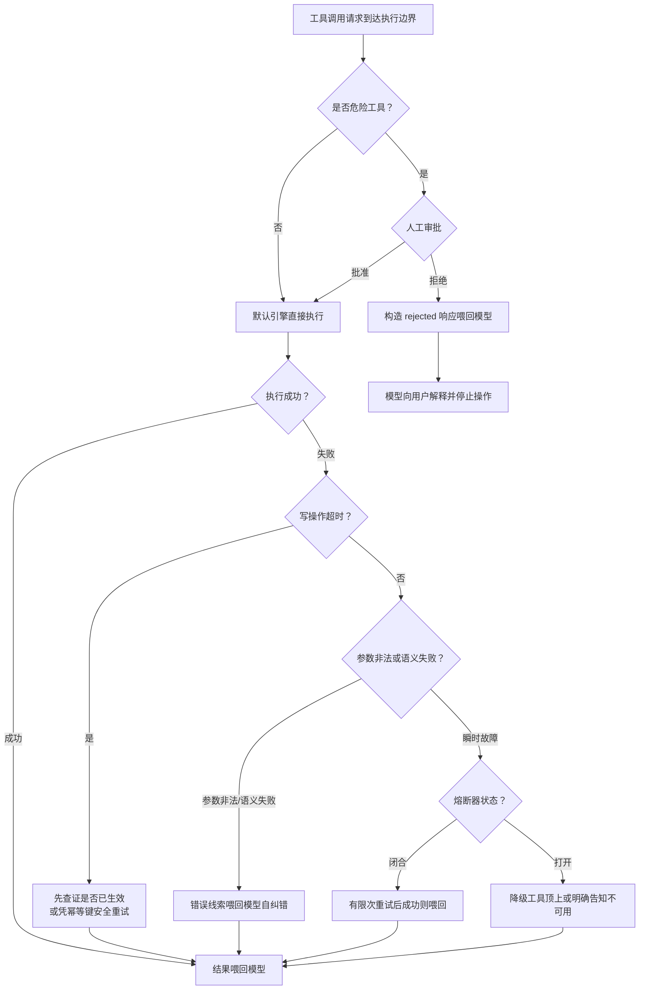
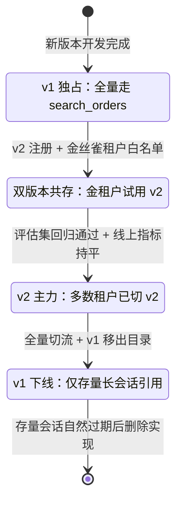
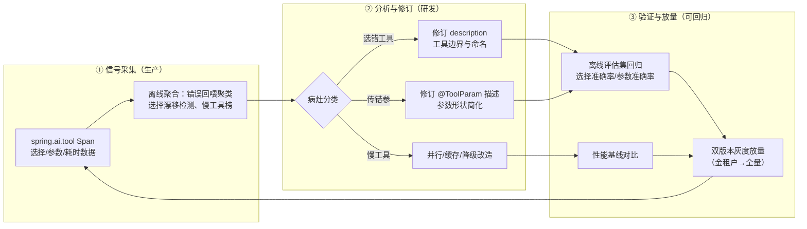

# 04-工具调优（下）：执行与治理

> **定位**：本文讲工具层的**运行时工程**——工具怎么"跑得稳、管得住、持续变好"。上篇 [教程 10-调优实战与方法论/03-工具调优上：接口设计学] 解决"模型能不能选对工具"（设计质量），本篇解决"工具执行与治理"（运行质量）：执行模式选型（内部执行 vs 外部循环）、并行工具调用、失败语义与弹性（超时/幂等/熔断降级）、工具治理（动态注册/租户裁剪/版本灰度）、测试与调优飞轮。读者画像：正在把 Agent 从 demo 推向生产的中高级 Java 工程师与架构师。前置阅读：[教程 10-调优实战与方法论/03-工具调优上：接口设计学]、[教程 02-SpringAI核心机制/01-Advisor链与拦截器]、[教程 01-WebFlux与响应式编程/06-线程模型与调度器]。
>
> **API 实证声明**：本文所有 Spring AI API 均对本地 2.0.0 jar 做 `javap`/字节码实证（基准见 [附录 05-SpringAI2-API基准/02-Tool与Observation真实API]），并首次澄清一个流传极广的 1.x API 谣言（见 §1.1）。

---

## 引言：设计得再好，跑不稳也是零

上篇我们把工具的 `@Tool` description、参数 Schema、命名打磨到了"模型一眼就能选对"的程度。但把它放进生产流量，你会发现新的问题分层出现：

- **执行模式错了**：前端要逐 token 流式渲染工具卡片，而工具循环被框架封装在内部，中间过程拿不出来；
- **一轮五个工具调用被串行执行**，响应时间五倍于必要值；
- **一个下游服务抖动，整个 Agent 会话雪崩**——写操作超时后被盲目重试，订单创建了两次；
- **三个租户共用一套工具集**，A 租户的财务工具出现在了 B 租户模型的工具列表里；
- **工具改了一个参数名，线上三周后才发现模型大量传错参**——因为没有人系统性地看工具执行数据。

这五类问题分别对应本篇五条主线：**执行模式选型、并行执行、失败语义与弹性、工具治理、测试与调优飞轮**。它们共同的性质是：都不是"写好一个 `@Tool` 方法"能解决的，而是工具层作为**一个子系统**的运行时架构问题。



---

## 一、执行模式选型：内部执行 vs 外部循环

### 1.1 先纠偏：`internalToolExecutionEnabled` 在 2.0.0 中不存在

网上大量资料（包括一些仍被引用的官方旧文档）会教你这样关闭内部工具执行：

```java
// ❌ 错误示例——1.x 的 API，Spring AI 2.0.0 中不存在
ToolCallingChatOptions.builder()
    .internalToolExecutionEnabled(false)   // 2.0.0 无此方法
    .build();
```

**这是 1.x 的 API，2.0.0 已删除。**我们对本地仓库三个核心 jar 做了穷尽验证（`/Volumes/data/software/maven/repository/org/springframework/ai/` 下 `spring-ai-model`、`spring-ai-client-chat`、`spring-ai-openai` 的 2.0.0 jar）：

- `javap org.springframework.ai.chat.prompt.ChatOptions`：只有 `model/frequencyPenalty/maxTokens/presencePenalty/stopSequences/temperature/topK/topP` 八个属性；
- `javap org.springframework.ai.model.tool.ToolCallingChatOptions`：只有 `getToolCallbacks()/getToolContext()/mutate()/builder()` 与三个静态合并方法，**无任何执行开关**；
- 对三个 jar 解包后做 class 文件字符串全文搜索 `internalToolExecutionEnabled`：**零匹配**；
- `javap` `DefaultChatClient$DefaultChatClientRequestSpec`（请求级 spec）的全部方法：**同样没有**该开关。

那么 2.0.0 里"谁来执行工具"这个控制点去哪了？答案是：**上移到了 Advisor 层，且成了显式的架构组件**。字节码实证两条关键事实：

1. `OpenAiChatModel` 的字节码中只引用了 `ToolCallingManager.resolveToolDefinitions(ToolCallingChatOptions)`——**模型层的职责仅仅是把工具 Schema 发给 LLM**，从不执行工具；
2. `DefaultChatClientBuilder` 的构造器字节码中固定执行 `ToolCallingAdvisor.builder().toolCallingManager(...)`——**ChatClient 默认组装 `ToolCallingAdvisor`，由它驱动工具循环**。

这个架构变化是理解本篇一切内容的地基：**2.0 中"内部执行 vs 外部执行"不是 boolean 开关，而是"用不用 `ToolCallingAdvisor`（或替换它的 `ToolCallingManager`）"的组件级选择。**

> 想深入？→ [附录 05-SpringAI2-API基准/02-Tool与Observation真实API] 收录了工具体系的完整真实签名；本文实测结论与其一致。

### 1.2 内部执行：ChatClient 的默认路径

只要你在用 `ChatClient`（Boot 自动装配的 `ChatClient.Builder` 构建出的实例），工具循环就默认在 `ToolCallingAdvisor` 内闭环：模型返回带 `ToolCall` 的响应 → Advisor 调用 `ToolCallingManager.executeToolCalls(...)` → 拿到结果拼回对话历史 → 再次调模型 → 循环往复，直到模型不再请求工具。`ToolCallingAdvisor`（`org.springframework.ai.chat.client.advisor` 包，实现 `CallAdvisor` + `StreamAdvisor` + `ToolAdvisor`）的 Builder 提供了这几个可调点（`javap` 实证）：

| Builder 方法 | 作用 | 典型用途 |
|---|---|---|
| `toolCallingManager(ToolCallingManager)` | 换掉执行引擎（默认 `DefaultToolCallingManager`） | 挂装饰器做审批/审计/降级（见 §3、§4） |
| `toolExecutionEligibilityChecker(...)` | 自定义"这个响应要不要执行工具"的判定 | 只对特定 finishReason 执行；跳过部分场景 |
| `advisorOrder(int)` | 该 Advisor 在链上的顺序 | 保证在记忆 Advisor 之后执行 |
| `conversationHistoryEnabled(boolean)` / `disableInternalConversationHistory()` | 是否由它内部维护对话历史 | 与 ChatMemory 方案协作时避免历史重复 |

`DefaultToolCallingManager` 本身也通过 Builder 注入三个组件（`javap` 实证）：`observationRegistry`（工具 Span 观测）、`toolCallbackResolver`（按名字解析 `ToolCallback`，接口只有一个方法 `ToolCallback resolve(String)`）、`toolExecutionExceptionProcessor`（工具异常如何回喂模型，见 §3.4）。**这两个 Builder 就是内部执行模式的全部治理面。**

### 1.3 外部循环：自己拿 ToolCall、自己执行、自己回填

当你绕过 `ChatClient`，直接用 `ChatModel.call(Prompt)`，由于模型层不执行工具（§1.1 实证），返回的 `ChatResponse` 里就带着"裸"的工具调用意图——执行权 100% 在你手里。这条路径的全部类型都是 2.0.0 真实 API（`javap` 逐一实证）：

```java
// 读取工具调用意图
ChatResponse resp = chatModel.call(prompt);
boolean hasCalls = resp.hasToolCalls();                       // Spring AI 2.0.0
List<AssistantMessage.ToolCall> calls =
    resp.getResult().getOutput().getToolCalls();              // record: id()/type()/name()/arguments()
// 回填执行结果
ToolResponseMessage msg = ToolResponseMessage.builder()       // Builder: responses(List)/metadata(Map)/build()
    .responses(List.of(new ToolResponseMessage.ToolResponse(  // record: (id, name, responseData)
        call.id(), call.name(), resultJson)))
    .build();
// 续轮调用
Prompt next = new Prompt(history, toolCallingChatOptions);    // Prompt(List<Message>, ChatOptions)
```

一个生产可用的最小外部循环（完整可编译，WebFlux 环境下全程无阻塞——模型调用与工具执行都被压到 `boundedElastic`，呼应 [教程 01-WebFlux与响应式编程/06-线程模型与调度器]）：

```java
package com.example.agent.tool.runtime;

import java.time.Duration;
import java.util.ArrayList;
import java.util.List;
import java.util.Map;

import org.springframework.ai.chat.messages.AssistantMessage;
import org.springframework.ai.chat.messages.Message;
import org.springframework.ai.chat.messages.ToolResponseMessage;
import org.springframework.ai.chat.model.ChatModel;
import org.springframework.ai.chat.model.ToolContext;
import org.springframework.ai.chat.prompt.Prompt;
import org.springframework.ai.model.tool.ToolCallingChatOptions;
import org.springframework.ai.tool.ToolCallback;
import org.springframework.stereotype.Component;
import reactor.core.publisher.Flux;
import reactor.core.publisher.Mono;
import reactor.core.scheduler.Schedulers;

/**
 * 外部工具循环执行器：自己驱动"调模型 → 执行工具 → 回填 → 再调模型"。
 * Spring AI 2.0.0：ChatModel 层不执行工具，循环完全由本类控制。
 */
@Component
public class AgentToolLoopExecutor {

    private static final int MAX_PARALLEL = 4;      // 并发上限
    private static final int MAX_ROUNDS = 8;        // 死循环防护（见 [教程 08-架构师进阶/06-长任务持久化与中断恢复]）
    private static final Duration TOOL_TIMEOUT = Duration.ofSeconds(15);

    private final ChatModel chatModel;              // OpenAiChatModel（spring-ai-starter-model-openai）
    private final ToolCatalog catalog;              // 自研工具目录（见 §4.1，含租户裁剪）

    public AgentToolLoopExecutor(ChatModel chatModel, ToolCatalog catalog) {
        this.chatModel = chatModel;
        this.catalog = catalog;
    }

    /** 单条入口：userText 进，最终回答出。全程响应式，不阻塞 EventLoop。 */
    public Mono<String> run(String conversationId, String tenantId, String userText) {
        List<Message> history = new ArrayList<>();
        history.add(new AssistantMessage("由 System/User 消息按会话历史组装，此处从略"));
        ToolCallingChatOptions options = ToolCallingChatOptions.builder()
                .toolCallbacks(catalog.callbacksFor(tenantId))    // Spring AI 2.0.0：租户裁剪后的工具集
                .build();
        return loop(history, options, conversationId, 1)
                .map(this::finalAnswerOf);
    }

    private Mono<List<Message>> loop(List<Message> history, ToolCallingChatOptions options,
                                     String conversationId, int round) {
        if (round > MAX_ROUNDS) {
            return Mono.just(history);   // 达到轮次上限，交给上层做"部分结果"处理
        }
        // 模型调用是阻塞 API：fromCallable + boundedElastic，禁止在 EventLoop 上直接 call
        return Mono.fromCallable(() -> chatModel.call(new Prompt(history, options)))   // Spring AI 2.0.0
                .subscribeOn(Schedulers.boundedElastic())
                .timeout(Duration.ofSeconds(60))
                .flatMap(resp -> {
                    AssistantMessage assistant = resp.getResult().getOutput();
                    if (!resp.hasToolCalls()) {
                        List<Message> done = new ArrayList<>(history);
                        done.add(assistant);
                        return Mono.just(done);
                    }
                    // 并行执行本轮全部工具调用（顺序保持，见 §2.3）
                    return executeInParallel(assistant.getToolCalls(), conversationId)
                            .flatMap(toolMsg -> {
                                List<Message> next = new ArrayList<>(history);
                                next.add(assistant);      // 带工具意图的 AssistantMessage 原样入历史
                                next.add(toolMsg);        // ToolResponseMessage 回填
                                return loop(next, options, conversationId, round + 1);
                            });
                });
    }

    private Mono<ToolResponseMessage> executeInParallel(List<AssistantMessage.ToolCall> toolCalls,
                                                        String conversationId) {
        ToolContext ctx = new ToolContext(Map.of("conversationId", conversationId));   // Spring AI 2.0.0
        return Flux.fromIterable(toolCalls)
                .flatMapSequential(tc -> invokeOne(tc, ctx), MAX_PARALLEL)   // 并行但按源顺序发射（§2.3 详述）
                .collectList()
                .map(results -> ToolResponseMessage.builder().responses(results).build());
    }

    private Mono<ToolResponseMessage.ToolResponse> invokeOne(AssistantMessage.ToolCall tc, ToolContext ctx) {
        ToolCallback callback = catalog.resolve(tc.name());   // Spring AI 2.0.0：ToolCallbackResolver 同款语义
        if (callback == null) {
            return Mono.just(new ToolResponseMessage.ToolResponse(
                    tc.id(), tc.name(), "错误：工具不存在或对该租户不可见"));
        }
        return Mono.fromCallable(() -> callback.call(tc.arguments(), ctx))   // Spring AI 2.0.0
                .subscribeOn(Schedulers.boundedElastic())
                .timeout(TOOL_TIMEOUT)
                .map(json -> new ToolResponseMessage.ToolResponse(tc.id(), tc.name(), json))
                .onErrorResume(ex -> Mono.just(new ToolResponseMessage.ToolResponse(
                        tc.id(), tc.name(), failureFeedBack(ex))));
    }

    private String failureFeedBack(Throwable ex) {
        return "{\"error\":\"" + ex.getClass().getSimpleName()
                + "\",\"hint\":\"工具执行失败，可修正参数后重试或改用其他工具\"}";
    }

    private String finalAnswerOf(List<Message> history) {
        return history.get(history.size() - 1).getText();
    }
}
```

> 注：`history` 的组装（System/User 消息与记忆读取）在真实工程中接 [教程 04-企业级架构主干/05-历史记录持久化与合规] 的会话存储；示例聚焦工具循环本身。

### 1.4 两种模式怎么选

| 维度 | 内部执行（ChatClient + ToolCallingAdvisor） | 外部循环（ChatModel + 自研循环） |
|---|---|---|
| 上手成本 | 低：`tools()`/`toolCallbacks()` 挂上即用 | 高：循环、历史拼接、超时全要自己写 |
| 流式 + 工具事件透出 | 循环封装在 Advisor 内，工具中间过程不逐事件暴露（Span 观测仍全量在，见 [教程 05-Observation可观测/08-流式响应的观测：stream模式下的span闭合]） | **每一步 `ChatResponse` 都在你手里**，可自由向 SSE 推 `tool_call_started`/`tool_call_result` 事件 |
| 并行工具调用 | 默认**顺序**执行（字节码实证，见 §2.1），改并行需替换 `ToolCallingManager` | **天然可并行**（自己写 `flatMapSequential`） |
| HITL 审批 | 挂 `ToolCallingManager` 装饰器（§3.5 前置）或包装 `ToolCallback` | 循环中任意位置可插审批点 |
| 复用 Advisor 生态（记忆/审计） | 完整复用 | 需要自己把记忆读写接进循环 |
| 适用迭代阶段 | 起步期、内部系统、工具少且快 | 流式前端、长任务、需要精细治理的生产系统 |



一句话选型：**从内部执行起步；一旦出现"前端要看工具过程 / 工具要并行 / 循环里要插治理逻辑"三个信号中的任意一个，切外部循环**。两者共享同一套工具实现（`@Tool` 方法与 `ToolCallback` 完全通用），切换成本在执行层而非工具层——这正是 2.0 把执行从模型层剥离的价值。

---

## 二、并行工具调用：默认是顺序的，并行要自己挣

### 2.1 字节码实证：默认执行是串行的

对 `DefaultToolCallingManager.executeToolCalls(Prompt, ChatResponse)` 做 `javap -c` 得到两个决定性事实：

1. 它对响应中的 Generation 做 `filter(有工具调用).findFirst()`——**只处理第一个含工具调用的响应**；
2. 私有方法 `executeToolCall` 内部用 `List.iterator()` **顺序遍历**该消息的全部 `ToolCall` 逐个执行。

也就是说：模型一轮请求 5 个工具，内部执行模式下就是 5 次串行调用。每个工具 800ms，一轮就是 4 秒——这在 Agent 端到端延迟里通常是最肥的一块（呼应 [教程 10-调优实战与方法论/01-环节体检：五环节指标与判病阈值] 对工具环节的耗时判读）。LLM 的一轮多工具请求（parallel tool calling）在语义上默认是**相互独立**的——这是所有主流模型厂商的约定——所以并行化是安全的默认假设，例外情况靠 §2.4 的分类兜住。

### 2.2 并行的正确姿势：flatMapSequential，不是 flatMap

Reactor 里"并发执行"有三个候选算子，行为差异恰好落在"顺序"上（详见 [教程 01-WebFlux与响应式编程/01-Reactor核心]）：

| 算子 | 订阅方式 | 发射顺序 | 是否适合工具并行 |
|---|---|---|---|
| `concatMap` | 串行订阅（上一个完成才订阅下一个） | 源顺序 | 否——毫无并行，等于默认行为 |
| `flatMap(fn, n)` | 并发订阅，上限 n | **完成顺序**（谁快谁先出） | 半适用——快慢不同会打乱 ToolResponse 顺序 |
| `flatMapSequential(fn, n)` | 并发订阅，上限 n | **源顺序**（结果按原始请求顺序重排） | **是——并行与保序兼得** |

为什么顺序是硬要求？`ToolResponseMessage.ToolResponse(id, name, responseData)` 里的 `id` 必须与 `ToolCall.id()` 对应，多数模型服务端会校验"工具响应序列与请求序列的一致性"；即便服务端宽容，打乱顺序也会让会话历史难以审计回放（[教程 04-企业级架构主干/03-工具执行可观测与审计] 的审计要求）。`flatMapSequential` 让你两样全拿：`MAX_PARALLEL` 路并发 + 严格按源顺序产出，§1.3 代码中的 `executeInParallel` 就是最终形态。

### 2.3 线程模型：boundedElastic 是唯一正确的落点

WebFlux 铁律（[教程 01-WebFlux与响应式编程/06-线程模型与调度器]）：**EventLoop 上禁止任何阻塞**。而工具实现的现实是：多数企业工具（JDBC 查询、HTTP 客户端、遗留 SDK）是阻塞 API。所以 §1.3 代码里每个工具调用都走 `Mono.fromCallable(...).subscribeOn(Schedulers.boundedElastic())`——把阻塞压到弹性线程池，EventLoop 只做编排。两个工程细节：

- **并发上限要全局一致**：`flatMapSequential` 的 `MAX_PARALLEL` 应与 `boundedElastic` 池容量、下游服务的并发配额一起规划（10 路 flatMap × 每路占一个 elastic 线程 × 下游 5 并发上限 = 排队与超时放大）；
- **流式链路里的工具执行**：`ChatClient.stream()` 内部（`ToolCallingAdvisor.adviseStream`）工具执行同样发生在 Reactor 管道中，2.0 用内部类 `ToolCallReactiveContextHolder`（`org.springframework.ai.model.tool.internal`，`setContext(ContextView)/getContext()/clearContext()`）把 Reactor Context 传给工具侧——这佐证了框架自身也不依赖 ThreadLocal。**你自研的工具上下文传递也必须走 Reactor Context 或 `ToolContext`，禁止 ThreadLocal**（WebFlux 铁律）。

### 2.4 并行的边界：不是所有工具都该一起跑

并行化的判据不是"能不能并发调用"，而是**并发执行是否改变业务结果**：

| 工具组合 | 是否并行 | 原因 |
|---|---|---|
| 多个只读查询（查订单 + 查库存 + 查物流） | ✅ 并行 | 互不依赖、无副作用 |
| 读 + 无关的写（查订单 + 给另一租户发通知） | ✅ 可并行 | 副作用域不相交 |
| 同一资源的读后写（查余额 → 扣款） | ❌ 串行 | 存在因果依赖，模型本应分两轮请求 |
| 两个写同一聚合（两次转账） | ❌ 串行 + 幂等键 | 并发写引发竞态，且超时重试叠加风险 |

模型并不总是遵守"有依赖就分轮请求"的预期，所以外部循环里可以加一道廉价的防线：按工具声明的**副作用标记**（上篇 [教程 10-调优实战与方法论/03-工具调优上：接口设计学] 中工具元数据的设计）把本轮 `ToolCall` 分成"读桶"与"写桶"——读桶并行、写桶串行。

> **适用/不适用速判**：并行化的收益 = Σ(单工具耗时) − max(并行分支耗时)。工具普遍 50ms 以内时并行化收益趋近于零，别为并行而并行；工具秒级起步（数据平台、外部 API）时并行化是必选项。

---

## 三、失败语义与弹性：工具一定会挂，挂了怎么办才是架构

工具层的失败面比任何其他组件都宽：下游超时、参数非法、权限不足、限流、数据不存在、语义性失败（"查无此单"）。弹性设计的全部问题可以压缩成三问：**哪些失败可以重试？重试会不会造成重复伤害？不能重试的失败怎么让模型接得住？**

### 3.1 超时分类：可重试性由"写与不写"决定，不是由"超没超时"决定

| 失败类型 | 典型报错 | 可否重试 | 理由 |
|---|---|---|---|
| 连接失败（TCP 建不上） | `ConnectException` | ✅ 立即重试 | 请求根本没到对端，无副作用 |
| 读超时（只读工具） | `TimeoutException` | ✅ 指数退避重试 | 读操作重放无伤害 |
| 读超时（**写工具**） | `TimeoutException` | ⚠️ **不可盲重试** | 请求可能已达对端且已生效，重试 = 二次扣款/二次建单 |
| 参数非法（模型填错参） | 校验异常 / 4xx | ❌ 原样重试必再败 | 应把错误**喂回模型**自纠错（§3.4） |
| 限流 / 配额（429） | 429 + Retry-After | ✅ 按 Retry-After 退避 | 属于瞬时过载 |
| 语义失败（查无此单） | 业务码 | ❌ 不算失败 | 正常结果，如实喂回即可 |

最危险的是第三行：**写操作的超时是"未知状态"，不是"失败"**。正确处理只有两条路：先查证（用配套的只读查询确认是否已生效）再决定重试或放弃；或者靠幂等键让对端去重（§3.2）。

### 3.2 幂等键：把"重试安全"从运气变成机制

幂等键的设计要点：**同一次业务意图，无论重试多少次，键保持不变；不同意图，键必不相同**。Spring AI 的执行链恰好免费送了一个高质量键源——`ToolCall.id()`：它是**模型生成**的唯一标识，同一意图（同一次工具请求）在重试过程中不变，不同请求必不同。把 `ToolCall.id()` 经 `ToolContext` 传给工具实现，工具实现转交下游做去重：

```java
// 外部循环侧：把幂等键放进 ToolContext（Spring AI 2.0.0）
ToolContext ctx = new ToolContext(Map.of(
        "conversationId", conversationId,
        "idempotencyKey", tc.id()          // 模型生成的 ToolCall id，天然幂等键
));

// 工具实现侧：透传给下游 HTTP 头（伪代码，下游协议各异）
// headers.set("Idempotency-Key", ctx.getContext().get("idempotencyKey").toString());
```

如果一次 `ToolCall` 内部还要循环重试多次，键再加序号后缀（`{toolCallId}-1`）；跨会话重放（断线恢复场景，[教程 08-架构师进阶/06-长任务持久化与中断恢复]）时从持久化的检查点里恢复同一个键，而不是重新生成——否则幂等机制在崩溃恢复面前失效。

### 3.3 熔断与降级：装饰 `ToolCallback`，而不是改工具实现

工具的重试/熔断/降级不应该写进每个工具方法体——那是把横切能力复制 N 份。正确位置是**装饰器**：包一层实现了 `ToolCallback` 接口的 `ResilientToolCallback`（接口四方法全部 `javap` 实证：`getToolDefinition()/getToolMetadata()/call(String)/call(String, ToolContext)`）。降级的关键动作是**"可执行工具 → 降级工具"的切换**：主工具（实时调下游）熔断后，换成预置的降级工具（查缓存快照/返回最近有效数据），而且**两者对模型呈现为同一个工具名**——模型无感知，Schema 不变，对话不中断。

```java
package com.example.agent.tool.resilience;

import java.time.Duration;
import java.util.concurrent.atomic.AtomicInteger;
import java.util.concurrent.atomic.AtomicLong;

import org.springframework.ai.chat.model.ToolContext;          // Spring AI 2.0.0
import org.springframework.ai.tool.ToolCallback;               // Spring AI 2.0.0
import org.springframework.ai.tool.definition.ToolDefinition;  // Spring AI 2.0.0
import org.springframework.ai.tool.metadata.ToolMetadata;

/**
 * 工具弹性装饰器：超时重试（仅幂等工具）+ 熔断 + 降级切换。
 * 生产中可换 resilience4j（需在 pom.xml 添加 spring-cloud-starter-circuitbreaker-reactor-resilience4j 依赖），
 * 此处为零依赖最小实现。
 */
public class ResilientToolCallback implements ToolCallback {   // Spring AI 2.0.0

    private final ToolCallback delegate;          // 主工具（实时调下游）
    private final ToolCallback fallback;          // 降级工具（缓存快照等），可为 null
    private final boolean retryable;              // 只读工具 = true；写工具 = false
    private final int maxRetries;
    private final Duration timeout;
    private final int failureThreshold;           // 熔断阈值：连续失败 N 次打开

    private final AtomicInteger consecutiveFailures = new AtomicInteger();
    private final AtomicLong openedUntil = new AtomicLong();   // 熔断打开截止时间戳（毫秒）

    public ResilientToolCallback(ToolCallback delegate, ToolCallback fallback,
                                 boolean retryable, int maxRetries, Duration timeout,
                                 int failureThreshold) {
        this.delegate = delegate;
        this.fallback = fallback;
        this.retryable = retryable;
        this.maxRetries = maxRetries;
        this.timeout = timeout;
        this.failureThreshold = failureThreshold;
    }

    @Override
    public ToolDefinition getToolDefinition() {
        return delegate.getToolDefinition();      // 对模型呈现不变：名字与 Schema 全程一致
    }

    @Override
    public ToolMetadata getToolMetadata() {
        return delegate.getToolMetadata();
    }

    @Override
    public String call(String toolInput) {
        return call(toolInput, new ToolContext(java.util.Map.of()));
    }

    @Override
    public String call(String toolInput, ToolContext toolContext) {
        long now = System.currentTimeMillis();
        if (now < openedUntil.get()) {
            return degrade(toolInput, toolContext, "熔断中（连续失败 " + failureThreshold + " 次）");
        }
        RuntimeException last = null;
        for (int attempt = 0; attempt <= (retryable ? maxRetries : 0); attempt++) {
            try {
                if (attempt > 0) {
                    sleepBackoff(attempt);        // 指数退避：200ms * 2^n（真实实现勿用忙等阻塞 EventLoop，
                }                                 // 本装饰器整体运行在 boundedElastic 上）
                String result = delegate.call(toolInput, toolContext);   // Spring AI 2.0.0
                consecutiveFailures.set(0);       // 成功即复位熔断计数（半开→闭合）
                return result;
            } catch (RuntimeException ex) {
                last = ex;
            }
        }
        if (consecutiveFailures.incrementAndGet() >= failureThreshold) {
            openedUntil.set(System.currentTimeMillis() + 30_000);   // 打开 30s
        }
        return degrade(toolInput, toolContext,
                last == null ? "未知错误" : last.getClass().getSimpleName());
    }

    private String degrade(String toolInput, ToolContext toolContext, String reason) {
        if (fallback != null) {
            return fallback.call(toolInput, toolContext);   // 降级工具顶上，模型无感知
        }
        return "{\"status\":\"degraded\",\"reason\":\"" + reason
                + "\",\"hint\":\"该工具暂不可用，请告知用户改用其他方式\"}";
    }

    private void sleepBackoff(int attempt) {
        try {
            Thread.sleep(200L * (1L << attempt));
        } catch (InterruptedException ie) {
            Thread.currentThread().interrupt();
        }
    }
}
```

装配时在工具目录（§4.1）统一包一层即可，工具实现保持纯粹。熔断判据除了连续失败次数，生产上更推荐**滑动窗口失败率**（resilience4j 的默认模型），并对 429 类错误走独立的限流退避通道。

### 3.4 失败喂回模型：让模型自纠错，还是让流程终止

工具异常的最终去向是一个**语义决策**，2.0 给了专门的扩展点 `ToolExecutionExceptionProcessor`（`javap` 实证：`String process(ToolExecutionException)`）：

- **转文本回喂**（默认行为）：把异常转成一段文字塞进 `ToolResponseMessage`，模型看到后可以修参数重试、换工具、或向用户致歉——适用于可自愈的失败（参数错、查无此单）；
- **直接抛出**：中断整个调用，让上层（HTTP 500 / 熔断页面）兜底——适用于不可自愈的失败（权限不足、配额耗尽、审批拒绝）。

Boot 配置键（`javap` 常量池实证前缀）：`spring.ai.tools.throw-exception-on-error`（默认 false，即默认转文本回喂）。错误回喂的文本质量直接影响自纠错成功率——回喂里要包含**可行动的线索**（哪个参数错、期望什么格式），这段文本本质上是给模型看的错误消息，值得按上篇的 description 标准去打磨：

```java
// 回喂文本对比
// ✅ 好的回喂：模型下一轮就能自纠
{"error":"invalid_argument","param":"order_id","reason":"必须是 19 位数字","received":"ORD-123"}

// ❌ 差的回喂：模型只能反复撞墙
{"error":"调用失败"}
```

### 3.5 HITL 审批的落点：装饰 `ToolCallingManager`，不是 Advisor

危险工具（转账、删除、批量操作）需要人工审批后才执行。架构上这个拦截点有且只有两个正确位置（铁律，呼应 [教程 04-企业级架构主干/08-Human-in-the-Loop与审批流]）：

1. **`ToolCallingManager` 装饰器**：实现 `ToolCallingManager` 接口包装默认实现，在 `executeToolCalls` 里对危险工具发起审批，拒绝时直接构造"审批被拒"的 `ToolExecutionResult` 返回，模型下一轮自然会向用户解释；
2. **`ToolCallback` 包装层**：在 `call(...)` 前置审批检查（§3.3 装饰器同款手法，粒度更细到单个工具）。

**为什么不是 Advisor？**审批需要发生在"模型请求了工具 X"与"工具 X 真正执行"之间，而这个缝隙只存在于 `ToolCallingManager`/`ToolCallback` 的调用边界上。Advisor 链工作在请求/响应级别，既拿不到单个工具的执行决策点，硬塞进去也要重写整个循环——2.0 把 `ToolCallingManager` 做成独立组件就是为了让审批/审计/降级在这条缝上做装饰。最小骨架：

```java
package com.example.agent.tool.approval;

import java.util.ArrayList;
import java.util.List;

import org.springframework.ai.chat.messages.AssistantMessage;              // Spring AI 2.0.0
import org.springframework.ai.chat.messages.Message;
import org.springframework.ai.chat.messages.ToolResponseMessage;
import org.springframework.ai.chat.model.ChatResponse;
import org.springframework.ai.chat.prompt.Prompt;
import org.springframework.ai.model.tool.ToolCallingChatOptions;
import org.springframework.ai.model.tool.ToolCallingManager;
import org.springframework.ai.model.tool.ToolExecutionResult;
import org.springframework.ai.tool.definition.ToolDefinition;

/**
 * HITL 装饰器：危险工具执行前强制人工审批。
 * Spring AI 2.0.0：ToolCallingManager 接口两方法均为 javap 实证签名。
 */
public class ApprovalToolCallingManager implements ToolCallingManager {    // Spring AI 2.0.0

    private final ToolCallingManager delegate;        // DefaultToolCallingManager
    private final ApprovalService approvals;          // 审批单创建/等待/决议（对接 [教程 04-企业级架构主干/08-Human-in-the-Loop与审批流]）
    private final java.util.Set<String> dangerousTools;

    public ApprovalToolCallingManager(ToolCallingManager delegate, ApprovalService approvals,
                                      java.util.Set<String> dangerousTools) {
        this.delegate = delegate;
        this.approvals = approvals;
        this.dangerousTools = dangerousTools;
    }

    @Override
    public List<ToolDefinition> resolveToolDefinitions(ToolCallingChatOptions options) {
        return delegate.resolveToolDefinitions(options);
    }

    @Override
    public ToolExecutionResult executeToolCalls(Prompt prompt, ChatResponse response) {
        AssistantMessage assistant = response.getResult().getOutput();
        boolean needsApproval = assistant.getToolCalls().stream()
                .anyMatch(tc -> dangerousTools.contains(tc.name()));
        if (!needsApproval) {
            return delegate.executeToolCalls(prompt, response);   // 放行：默认引擎执行
        }
        String decision = approvals.requestApprovalBlocking(assistant);   // 挂起等人工决议（工单/IM 卡片）
        if (!"APPROVED".equals(decision)) {
            // 拒绝：不执行任何工具，构造"审批被拒"响应喂回模型
            List<ToolResponseMessage.ToolResponse> rejected = assistant.getToolCalls().stream()
                    .map(tc -> new ToolResponseMessage.ToolResponse(
                            tc.id(), tc.name(),
                            "{\"status\":\"rejected\",\"reason\":\"人工审批未通过，请向用户说明并停止该操作\"}"))
                    .toList();
            List<Message> history = new ArrayList<>(prompt.getInstructions());
            history.add(assistant);
            history.add(ToolResponseMessage.builder().responses(rejected).build());
            return ToolExecutionResult.builder()                  // Spring AI 2.0.0：builder() + conversationHistory + returnDirect
                    .conversationHistory(history)
                    .returnDirect(false)
                    .build();
        }
        return delegate.executeToolCalls(prompt, response);       // 批准：交默认引擎
    }
}
```

> 审批等待是长操作（分钟级），`requestApprovalBlocking` 的真实实现应基于持久化审批单 + 挂起/恢复（而非占线程死等），机制详见 [教程 08-架构师进阶/06-长任务持久化与中断恢复] 与 [教程 04-企业级架构主干/08-Human-in-the-Loop与审批流]。本文聚焦它在工具执行缝上的正确挂载位置。



---

## 四、工具治理：让工具集可裁剪、可演进、可灰度

### 4.1 动态注册与按租户/角色裁剪可见工具集

工具集不是常量，是**随租户、角色、订阅档位变化的数据**。SaaS 场景下财务工具只对开通财务模块的租户可见；企业内部场景下敏感工具只对特定角色开放。多租户工具隔离的架构要点（呼应 [教程 04-企业级架构主干/06-多租户隔离与资源治理]）：

- **可见性裁剪发生在"组装工具列表"时，而不是"执行"时**——把租户不可见的工具一起发给模型，等于把菜单泄露给不该看的人（提示注入可诱导模型调用，见 [附录 08-Agent安全深度/00-Prompt注入分类与案例]），执行期拦截只是最后防线；
- 裁剪后的工具集经 `ToolCallingChatOptions.builder().toolCallbacks(...)` 请求级注入（`javap` 实证该方法存在），不污染全局配置；
- 热注册（不重启上新工具）走 `ToolCallbackResolver`（单方法接口 `ToolCallback resolve(String)`，`javap` 实证）的自定义实现，注入 `DefaultToolCallingManager.builder().toolCallbackResolver(...)`。

一个支持租户裁剪 + 动态注册的最小工具目录：

```java
package com.example.agent.tool.runtime;

import java.util.List;
import java.util.Map;
import java.util.Set;
import java.util.concurrent.ConcurrentHashMap;

import org.springframework.ai.tool.ToolCallback;               // Spring AI 2.0.0
import org.springframework.ai.tool.resolution.ToolCallbackResolver;
import org.springframework.stereotype.Component;

/**
 * 租户工具目录：动态注册 + 按租户/角色裁剪。
 * 同时实现 ToolCallbackResolver（Spring AI 2.0.0，javap 实证单方法 resolve(String)），
 * 可直接注入 DefaultToolCallingManager.builder().toolCallbackResolver(...)。
 */
@Component
public class ToolCatalog implements ToolCallbackResolver {

    /** 全量工具注册表：工具名 → 工具实例（运行时可增删，支持热注册） */
    private final Map<String, ToolCallback> registry = new ConcurrentHashMap<>();

    /** 租户可见性策略：租户 → 允许的工具名集合（生产中从配置中心/策略服务拉取） */
    private final Map<String, Set<String>> tenantAllowList = new ConcurrentHashMap<>();

    /** 注册新工具（热注册：调用后即刻对新请求生效，无需重启） */
    public void register(ToolCallback callback) {
        registry.put(callback.getToolDefinition().name(), callback);   // ToolDefinition: name()/description()/inputSchema()
    }

    @Override
    public ToolCallback resolve(String toolName) {          // Spring AI 2.0.0
        return registry.get(toolName);
    }

    /** 该租户这一轮请求实际可用的工具集——发给模型前就完成裁剪 */
    public List<ToolCallback> callbacksFor(String tenantId) {
        Set<String> allowed = tenantAllowList.getOrDefault(tenantId, Set.of());
        return registry.entrySet().stream()
                .filter(e -> allowed.contains(e.getKey()))
                .map(Map.Entry::getValue)
                .toList();
    }
}
```

三道防线各司其职：**目录裁剪**（模型根本看不到不该看的工具）→ **执行校验**（`resolve` 后仍校验租户白名单，防绕过）→ **审计**（[教程 04-企业级架构主干/03-工具执行可观测与审计] 记录每次调用的租户/用户/工具/参数）。只有第一道防线的系统，防线厚度等于提示注入防御的运气。

### 4.2 工具版本管理：Schema 兼容规则与双版本灰度

工具的 Schema 就是模型的"API 合同"，变更管理遵循 API 演进的全部纪律（呼应 [教程 04-企业级架构主干/09-灰度发布与版本管理]）：

**向后兼容的变更（直接发）**：`description` 文案优化（描述越准模型选得越准，改它收益最高、风险最低——上篇的核心论点在版本维度的延续）；`inputSchema` **新增可选参数**；返回体**新增字段**。

**破坏性变更（必须灰度）**：参数改名/删除、参数类型变更、语义变更（同名工具但业务含义变了）。灰度的标准姿势是**双版本共存**——旧版 `search_orders` 不动，新版以 `search_orders_v2` 注册，然后按租户/流量比例把模型可见的工具集从 v1 切到 v2：



双版本期的评估锚点是上篇的评估方法论 + 本篇 §5 的离线评估集：**v2 必须在"工具选择准确率 / 参数填充准确率"两个指标上不劣于 v1 才允许放量**。注意 v2 的 `description` 里写清与 v1 的差异点（"支持按状态过滤"），帮模型在共存期正确二选一；共存期结束后回收 v1 的名字，可把 v2 改名回 `search_orders`——这是一次破坏性改名，仍要走一轮金丝雀。

> **成本提示**：每个可见工具的 Schema 都占用 Prompt 预算（上篇 [教程 10-调优实战与方法论/02-Prompt调优工程] 的上下文预算表）。双版本共存期工具数翻倍，租户级裁剪在此刻额外重要——灰度面越小，预算膨胀面越小。

---

## 五、工具测试与调优飞轮：从"能跑"到"持续变好"

### 5.1 ToolCallback 契约测试：Schema 与执行一致性

工具最常见的静默 bug：**Schema 承诺的参数与实现真正消费的参数不一致**——`@ToolParam` 写了 `order_id` 但方法参数叫 `orderId` 后忘了同步 Schema、Schema 说返回列表实现却返回对象。这类 bug 单测测不出来（单测只测实现）、生产必炸（模型按 Schema 填参）。契约测试把"Schema"与"执行"钉在一起：

```java
package com.example.agent.tool.contract;

import java.util.Map;

import org.junit.jupiter.api.Test;                                    // 需在 pom.xml 添加 spring-boot-starter-test 依赖
import org.springframework.ai.chat.model.ToolContext;                  // Spring AI 2.0.0
import org.springframework.ai.tool.ToolCallback;
import org.springframework.ai.tool.method.MethodToolCallbackProvider;  // Spring AI 2.0.0

import static org.assertj.core.api.Assertions.assertThat;

class SearchOrdersToolContractTest {

    private final ToolCallback callback = MethodToolCallbackProvider   // Spring AI 2.0.0：从 @Tool 方法生成回调
            .builder()
            .toolObjects(new SearchOrdersTool())
            .getToolCallbacks()
            .get(0);

    @Test
    void schemaPromisesMatchExecution() {
        var def = callback.getToolDefinition();       // Spring AI 2.0.0: name()/description()/inputSchema()
        // 契约一：名字稳定（模型记忆与灰度路由都依赖它）
        assertThat(def.name()).isEqualTo("search_orders");
        // 契约二：Schema 声明的每个参数，执行路径都真实消费
        assertThat(def.inputSchema()).contains("\"order_id\"").contains("\"status\"");
        // 契约三：按 Schema 形状填参能真实执行（内存桩实现）
        String result = callback.call(
                "{\"order_id\":\"2026082912345678901\",\"status\":\"PAID\"}",
                new ToolContext(Map.of("tenantId", "t-001")));
        assertThat(result).isNotBlank();
    }
}
```

这类测试进 CI 后，"改了参数名忘了改描述"的 bug 在合并前就会被拦住（测试策略全景见 [附录 04-测试策略/00-单元测试] 与 [附录 04-测试策略/01-集成测试]）。

### 5.2 离线评估集：工具选择准确率与参数填充准确率

上篇定义了工具接口的设计质量，本篇把它变成**可回归的数字**。评估集是一组标注用例：`query → 期望选中的工具 + 期望的参数`。跑法：把候选工具集挂到一个低温 `ChatClient` 上，让模型发起工具调用，比对选择与参数：

```java
package com.example.agent.tool.eval;

import java.util.List;
import java.util.Map;

import org.springframework.ai.chat.messages.AssistantMessage;   // Spring AI 2.0.0
import org.springframework.ai.chat.client.ChatClient;           // Spring AI 2.0.0
import org.springframework.ai.chat.model.ChatResponse;
import org.springframework.ai.chat.prompt.ChatOptions;

/** 工具层离线评估：工具选择准确率 + 参数填充准确率（评估方法论见 [附录 04-测试策略/02-Eval评估]） */
public record ToolEvalCase(String query, String expectedTool, Map<String, Object> expectedArgs) {}

class ToolSelectionEvaluator {

    double toolChoiceAccuracy(ChatClient client, List<ToolCallbackHolder> tools, List<ToolEvalCase> cases) {
        long hits = cases.stream().filter(c -> runOnce(client, tools, c).toolCorrect()).count();
        return (double) hits / cases.size();
    }

    private EvalOutcome runOnce(ChatClient client, List<ToolCallbackHolder> tools, ToolEvalCase c) {
        ChatResponse resp = client.prompt()
                .user(c.query())
                .toolCallbacks(toSpringCallbacks(tools))
                .options(customOptions())          // 低 temperature + 禁止自动执行意图（评估只取"选择"，不真执行）
                .call()
                .chatResponse();                   // Spring AI 2.0.0：CallResponseSpec.chatResponse()
        boolean toolCorrect = resp.hasToolCalls()
                && c.expectedTool().equals(resp.getResult().getOutput().getToolCalls().get(0).name());
        boolean argsCorrect = toolCorrect && argsMatch(
                resp.getResult().getOutput().getToolCalls().get(0).arguments(), c.expectedArgs());
        return new EvalOutcome(toolCorrect, argsCorrect);
    }

    private boolean argsMatch(String actualJson, Map<String, Object> expected) {
        // 实际工程：JSON 解析后逐键比对（严格模式）/ 关键键比对（宽松模式）
        return true;   // 伪代码：比对策略依业务而定
    }

    private record EvalOutcome(boolean toolCorrect, boolean argsCorrect) {}
    private interface ToolCallbackHolder {}
    private List<org.springframework.ai.tool.ToolCallback> toSpringCallbacks(List<ToolCallbackHolder> h) { return List.of(); }
    private ChatOptions.Builder<?> customOptions() { return null; }   // 伪代码：接 OpenAiChatOptions.builder().temperature(0.0)
}
```

> 上例中 `toSpringCallbacks`/`customOptions`/`argsMatch` 为占位伪代码（真实 API 见注释与 [附录 05-SpringAI2-API基准/02-Tool与Observation真实API]）；`ToolEvalCase`、`ChatClient.prompt().user().toolCallbacks().call().chatResponse()`、`resp.getResult().getOutput().getToolCalls()` 均为 2.0.0 实证 API。评估只取模型的"选择意图"（第一轮 `ToolCall`），不真正执行工具，因此跑得快、可全量回归。

两个指标的分工：**工具选择准确率**低 → 修 description / 工具拆分合并（上篇范畴）；**参数填充准确率**低 → 修 `@ToolParam` 描述、简化参数形状、或把复杂参数降级为多个简单参数。改完跑回归，指标说话。

### 5.3 调优飞轮：让 Observation 数据反哺 Schema 修订

前四节让工具层"跑得稳、管得住"，飞轮让它"持续变好"。数据源是 §1.2 里 `ToolCallingManager` 挂着的 ObservationRegistry——每次工具执行产生一个 `spring.ai.tool` Span（[教程 04-企业级架构主干/03-工具执行可观测与审计] 负责把信号收上来，这里消费它）：

- 高基数标签（`javap` 字节码实证）：`spring.ai.tool.call.id`、`spring.ai.tool.call.arguments`、`spring.ai.tool.call.result`、`spring.ai.tool.definition.description`、`spring.ai.tool.definition.schema`；
- 低基数标签：`spring.ai.tool.definition.name`、`spring.ai.tool.type`、`gen_ai.operation.type` 等；
- 内容标签的采集由配置 `spring.ai.tools.observations.include-content=true` 控制（`javap` 实证 `ToolCallingProperties` 前缀 `spring.ai.tools`）——注意这是高基数+隐私敏感配置，只建议在采样或灰度面打开（基数治理见 [教程 05-Observation可观测/07-指标治理：Token计量、SLO与基数熔断]）。

从 Span 数据里挖三类高频病灶，各自对应一个修订动作：

| Span 数据里的病灶 | 判读 | 修订动作 |
|---|---|---|
| 调了工具 A，下一轮立刻调工具 B 兜底（A 返回空/错误） | **选错工具**：A 的 description 误导 | 修 A/B 的 description 边界描述；必要时合并或重命名 |
| 同一工具大量"参数非法"错误回喂（§3.4 的失败文本） | **传错参**：Schema 或参数描述与模型预期错位 | 修 `@ToolParam` 描述、补枚举说明、拆复杂参数 |
| 工具 Span 耗时 P99 秒级且集在少数几个工具 | **慢工具**拖累端到端延迟 | 并行化（§2）、缓存（[附录 09-语义缓存与性能]）、降级预案 |

修订不能直接上生产——走 §5.2 的评估集回归 + §4.2 的双版本灰度，形成闭环：



闭环的运营节奏建议按 [教程 08-架构师进阶/07-数据飞轮与持续改进] 的框架排：每周一次工具 Span 聚合评审，双周一个修订批次进灰度。飞轮的价值在于把"工具调优"从一次性的设计活动（上篇）变成一个**由线上数据驱动、有回归护栏的持续过程**——这也是上篇与本文合起来完整的闭环。

---

## 适用场景

- **流式 Agent 前端**需要逐事件展示工具调用过程（工具卡片、执行状态），或需要自控工具并行度——走 §1.3 外部循环；
- **多租户 SaaS**：不同租户/角色必须看到不同的工具菜单，且工具集随订阅动态变化——§4.1 目录裁剪；
- **含写操作的生产工具**（支付、建单、删数据）：超时不可盲重试，幂等键 + 审批 + 熔断降级是必配——§3 全节；
- **工具数量超过 30 个**或模型选错率高于 5%：需要离线评估集 + Span 驱动的飞轮持续治理——§5；
- **工具实现需要独立演进**（参数变更、上游 API 升级）：双版本灰度兜住破坏性变更——§4.2。

## 不适用场景

- **原型与内部 demo**：工具少、只读、无多租户——内部执行（`ChatClient` 默认路径）完全够用，外部循环与治理层是纯粹的过度设计；
- **工具天然亚 50ms 且单工具调用**：并行化收益趋近于零，复杂度不值得；
- **无观测基建的团队**：飞轮的消费端（Span 聚合、评估集）不存在时，先补 [教程 05-Observation可观测] 的最小闭环，再谈反哺；
- **强实时写工具且下游无幂等能力**：这类工具的问题在下游 API 设计（必须先补幂等能力），不在 Agent 工具层能解决的范围内；
- **审批要求全流程人工**：如果业务要求每个动作都人审，Agent 自主循环本身不成立，应该改用工作流引擎（[教程 08-架构师进阶/02-Agent工作流编排]）而非在工具层硬塞审批。

## 总结

上篇解决"模型选得对"，本篇解决"跑得稳、管得住、持续变好"，两条主线合起来才是完整的工具调优：

1. **执行模式**：2.0.0 中不存在 `internalToolExecutionEnabled` 开关——执行控制点上移为组件选择：`ChatClient` 默认经 `ToolCallingAdvisor` 内部闭环，`ChatModel` 直调则执行权全在你手里。流式事件透出、并行、循环内治理是切换外部循环的三个信号。
2. **并行执行**：默认执行是顺序的（字节码实证）；并行用 `flatMapSequential`（并发订阅 + 源顺序发射），阻塞工具压到 `boundedElastic`；只读桶并行、写桶串行。
3. **失败语义**：可重试性由读写性质决定，不由超时决定；`ToolCall.id()` 是天然幂等键；熔断降级以装饰器挂在 `ToolCallback` 上；异常喂回是让模型自纠错的通道，文本质量决定纠错率。
4. **工具治理**：可见性裁剪发生在发给模型之前；`ToolCallbackResolver` 支撑热注册；Schema 遵循 API 演进纪律，破坏性变更走双版本灰度并以评估集为放量闸门。
5. **调优飞轮**：`spring.ai.tool` Span 的高基数标签暴露"选错工具/传错参/慢工具"三类病灶 → 修订 description 与 Schema → 评估集回归 → 灰度放量——让工具层由数据驱动持续进化。

至此，"选得对"（上篇）与"跑得稳"（本篇）合流为完整的工具调优方法论；端到端的优化收口（Prompt、检索、模型三线合流）见 [教程 10-调优实战与方法论/00-Agent病理总论] 与 [教程 10-调优实战与方法论/01-环节体检：五环节指标与判病阈值] 的诊断框架回看全链路。
