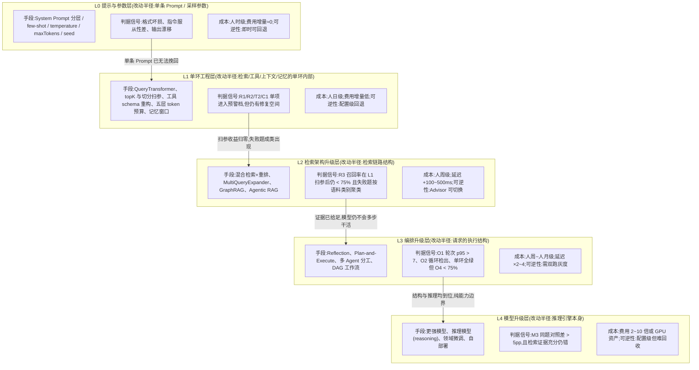
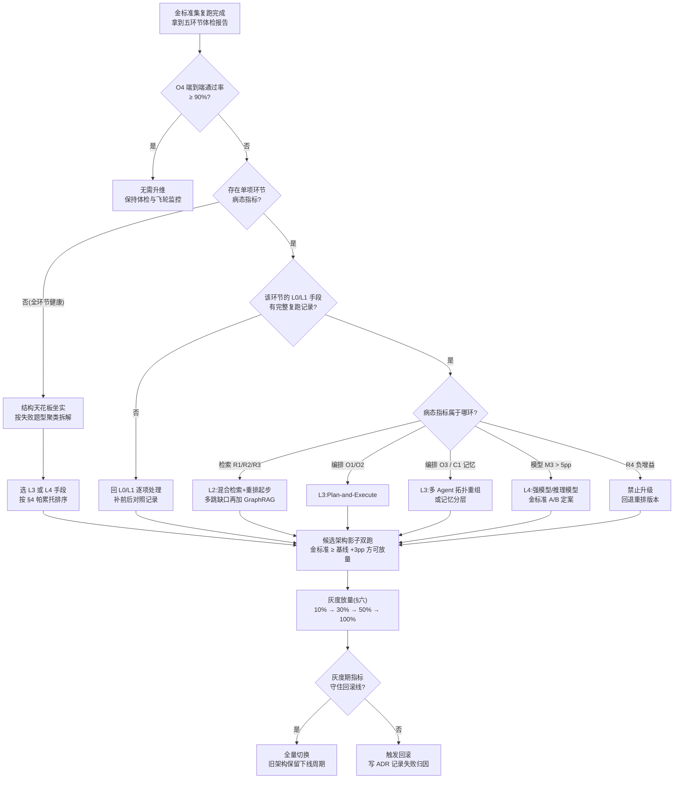
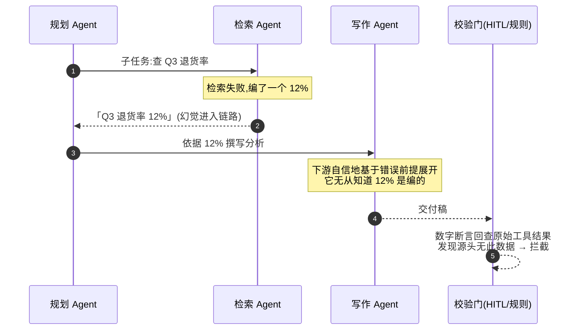
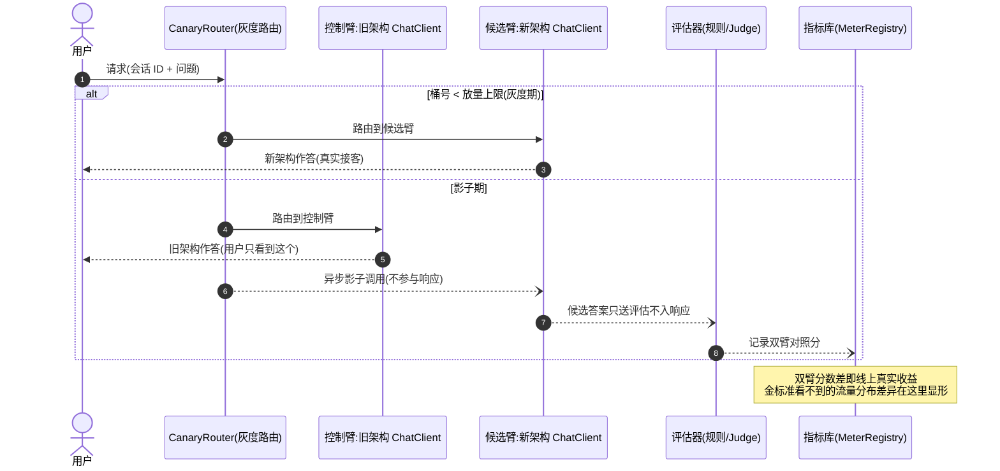
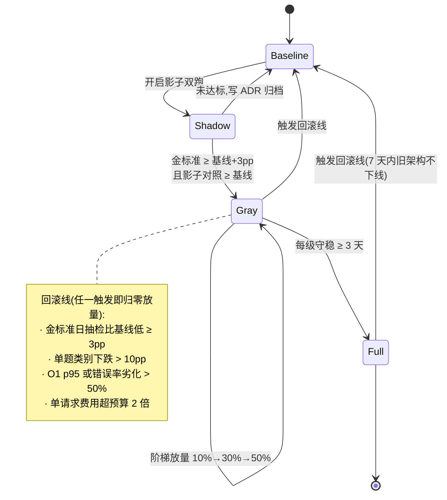

# 05 架构调优:单环到顶之后的"升维"决策

> **定位**:本篇是「调优实战与方法论」系列的收束篇,回答一个前面所有单环手段都回答不了的问题——**当 L0 提示参数与 L1 单环工程都已尽力、指标仍不达标时,什么时候值得改架构、改哪个架构、怎么把"改架构"做成一次可逆的低风险决策**。核心内容:五级调优阶梯模型(L0→L4)与每级的判据/成本/收益、"五环节体检指标劣化 → 升维手段"的决策映射、升级手段的成本-效果帕累托排序与实例演算、升维之后新出现的四类**架构劣化病**(多 Agent 互相污染/记忆膨胀/上下文腐化/编排过度设计)的早期信号与回退策略、以及升级本身的**可逆性设计**(影子双跑、灰度放量、回滚预案)。读者画像:已按 [教程 10-调优实战与方法论/01-环节体检：五环节指标与判病阈值] 建立体检体系、单环调优撞墙的中高级 Java 开发者与架构师。前置阅读:[教程 10-调优实战与方法论/00-Agent病理总论](症状-环节-病因框架)、[教程 10-调优实战与方法论/01-环节体检：五环节指标与判病阈值](R/T/M/C/O 指标代号来源)、[教程 10-调优实战与方法论/02-Prompt调优工程] 与 [教程 10-调优实战与方法论/03-工具调优上：接口设计学](L0/L1 手段是什么、做到什么程度算"尽力")。

---

## 一、单环调优的天花板:为什么"再改改"不再有效

### 1.1 一段典型的触顶史

设想一个客服 Agent 的五周调优史:

- **第 1 周**:System Prompt 重写三版、few-shot 示例从 0 加到 6 条——金标准集(100 题)从 71% 升到 76%;
- **第 2 周**:按 [教程 10-调优实战与方法论/02-Prompt调优工程] 的回归门禁又迭代 11 版 Prompt——76% 升到 78%,继续加题开始互有涨跌;
- **第 3 周**:按 [教程 10-调优实战与方法论/03-工具调优上：接口设计学] 重构了两个高频工具的 schema 与错误文案——78% 升到 80%,多轮题收益明显、单轮题纹丝不动;
- **第 4 周**:topK 扫参(2→12)、`similarityThreshold` 扫参、三种 chunk 大小重灌库——80% 升到 81%,然后**连续五次复跑全部在 80.5%~81.5% 之间抖动**;
- **第 5 周**:再改 Prompt,金标准分数不再上涨,甚至出现"修好 A 类题、B 类题跌 2 分"的跷跷板。

这就是**单环天花板**的典型形态:投入仍在增加,收益已经归零,且开始出现负收益。这时候团队最常见的反应是"再压一压 Prompt"或"干脆换个更大的模型"——前者是继续在已到顶的层级里打转,后者是**跳级升维**,没有判据、没有对照、没有回滚,成功率全凭运气。

本篇要建立的,就是替"感觉差不多了"和"换个大的试试"这两个冲动给出**证据化、阶梯化、可逆化**的决策框架。

### 1.2 误差结构视角:单环 90% 撑不起全链路 90%

单环调优的隐性假设是"把每一环修好,全局就好了"。这个假设在串联链路里不成立。一个 Agent 的端到端正确率近似于**各环节正确率的连乘**:

$$P_{e2e} \approx P_{检索} \times P_{工具} \times P_{模型} \times P_{上下文} \times P_{编排}$$

| 各环节正确率 | 端到端正确率(五环连乘) |
|---|---|
| 99% × 5 | ≈ 95.1% |
| 95% × 5 | ≈ 77.4% |
| 90% × 5 | ≈ 59.0% |
| 99% / 95% / 90% / 95% / 90%(不均匀) | ≈ 72.8% |

这张表解释了两类完全不同的天花板:

- **单环天花板**:某一环节指标落在 [教程 10-调优实战与方法论/01-环节体检：五环节指标与判病阈值] 的"病态"档(如检索金标准召回率 R3 < 75%),此时端到端分数被这一环**单点拖住**——继续修其他环节收益趋零,修这一环收益立竿见影。这是 00-04 各篇的主战场。
- **结构天花板**:五个环节的体检指标**全部进入"健康"档,但编排环节的端到端通过率 O4 仍 < 75%**。每一环单独看都对,连起来就是不对。这说明误差不是出在某一环的"精度",而是出在**环节之间的组织方式**:任务对模型来说需要多步推理,而当前"一把梭"的单趟编排结构把所有推理压力都压进了一次前向计算。

结构天花板无法靠继续打磨单环突破——就像再怎么保养每个齿轮,传动比设计错了整车也跑不快。**升维改的不是某一环的精度,而是误差的结构**。

### 1.3 升维的三条前置证据

"该不该升维"不是感觉问题,以下三条证据**全部满足**才允许启动升维决策,缺一条就回单环继续挖:

1. **低级手段已证伪**:目标环节的 L0/L1 手段清单已逐项做过并有复跑数据(不是"感觉改过了",是金标准集上有每次改动的前后对照记录)。证据形态:一张"手段 × 收益"流水账,末尾连续 2~3 次迭代收益 < 1pp。
2. **误差已定位到结构**:体检表显示单环指标健康而 O4 端到端通过率仍病态;或金标准失败题的归因聚类显示失败原因跨环节耦合(如"检索给对了文档,模型仍不会用"——单环修任何一环都解不开)。
3. **收益预估值得投入**:按 §四的帕累托演算,预期收益(pp)× 覆盖题量占比 明显高于投入(人日),且失败时可按 §六的预案回退。

三条证据对应三个常见的错误升维:证据 1 缺失 →"Prompt 还没调好就去搞多 Agent";证据 2 缺失 →"单环明明病着却在换编排框架";证据 3 缺失 →"为了 +1pp 重写整个检索层"。

---

## 二、调优阶梯模型:L0 → L4

### 2.1 阶梯总览

把所有调优手段按**改动半径**与**成本量级**排成五级阶梯。阶梯的核心纪律是:**每级的"判据触发"是唯一合法的上升通道**——只有当前级别的典型信号出现,才允许升到下一级;任何时候都允许(且鼓励)下降回退。



阅读这张图的方式:**纵向是成本与改动半径的递增,横向箭头是唯一的升级通道**——箭头上没有"想要更强效果",只有"判据信号触发"。

### 2.2 L0 提示与参数层

**手段全集**:System Prompt 架构化分层(角色/约束/格式/示例四段)、few-shot 示例库、`temperature`/`topP`/`seed` 采样控制、`maxTokens` 输出预算、Prompt Cache 前缀稳定性改造(见 [附录 09-语义缓存与性能/01-Prompt缓存与KVCache])。

**典型判据(该在这一层的信号)**:M4 `finish_reason=length` 升高(输出预算不足)、格式坏损率上升(格式指令被稀释)、同题输出漂移(温度过高)、指令服从性差但换强模型即恢复(L0 的 Prompt 结构问题 vs L4 的能力问题,用 M3 对照区分)。

**成本与收益**:人时到 1~2 人日;费用增量几乎为零;收益区间**经验值 0~7pp**,新系统首月收益最高(从 0 到 1 的规范化收益),成熟系统边际收益快速衰减。**可逆性最好**:Prompt 有版本管理([教程 10-调优实战与方法论/02-Prompt调优工程]),一行配置回滚。

**到顶信号**:金标准复跑连续 3 次收益 < 1pp,或出现题间跷跷板(修 A 跌 B)——后者说明 Prompt 已处于"多约束互相挤压"的饱和态,继续堆指令只会更糟。

### 2.3 L1 单环工程层

**手段全集**:检索环(`SearchRequest` 的 topK/`similarityThreshold` 扫参、切块参数重灌、`RewriteQueryTransformer`/`CompressionQueryTransformer` 查询改写)、工具环(schema 重构、错误文案可行动化、幂等键,见 [教程 10-调优实战与方法论/03-工具调优上：接口设计学])、上下文环(五层 token 预算分配、`MessageWindowChatMemory.maxMessages` 窗口调参、摘要记忆切换)、编排环(并行工具调用、轮次上限治理)。

**典型判据**:R1/R2/T2/C1/C2 中任一单项从健康滑入预警档——这是 L1 的主场;注意与 L2 的分界:**L1 处理"参数与接口错了",L2 处理"检索架构本身的表达力不够"**。

**成本与收益**:单项 1~5 人日;费用增量低(改写类 QueryTransformer 会增加 LLM 调用次数,需计入成本);收益区间**经验值 2~10pp**,是全阶梯性价比最高的一层。可逆性:全部是配置与代码级改动,随版本回滚。

**到顶信号**:扫参曲线出现平台期(参数从最优点向两侧移动分数都下降);失败题开始**按语料类别聚类**(同类问题全错)——这不再是参数问题,是知识在库里的组织形态问题,该升 L2。

### 2.4 L2 检索架构升级层

**手段阶梯**(内部还有小阶梯,按此顺序推进):

1. **混合检索 + 重排**:向量检索叠加 BM25 关键词通道,再过一遍交叉编码重排器。解决向量检索对型号、编号、专有名词的系统性盲区。重排增益用 R4 指标监控,**负增益立即回退重排版本**(见 01 篇判病表)。
2. **查询扩展**:`MultiQueryExpander` 一题多变体重检索 + 文档合并,解决"用户问法与语料写法措辞距离过远"。
3. **GraphRAG**:实体-关系图谱支撑多跳问题("A 公司的母公司的合规负责人是谁"),落地方程见 [附录 10-知识图谱工程/01-GraphRAG工程化落地] 与 [附录 10-知识图谱工程/00-Neo4j落地GraphRAG]。
4. **Agentic RAG**:让 Agent 自主决定"要不要检索、检索几轮、用什么过滤器",见 [教程 08-架构师进阶/01-高级RAG与AgenticRAG]。

**典型判据**:R3 召回率在 L1 全套扫参后仍 < 75%,且失败题聚类显示语义错位(召回发货答退货)或多跳缺口(需要两份文档拼答案);R4 显示重排仍有正增益空间。

**成本与收益**:混合检索+重排约 1~2 人周;GraphRAG 3~6 人周(图谱构建是持续成本)。延迟代价 +100~500ms(重排与多路检索)。收益区间**经验值 5~15pp**(检索瓶颈型系统),是 L2~L4 里对"答非所问"类症状**杠杆最大**的一层。可逆性:`QuestionAnswerAdvisor` / `RetrievalAugmentationAdvisor` 是 Advisor,新旧检索链可并存切换(Spring AI 2.0 中 `QuestionAnswerAdvisor` 位于 `org.springframework.ai.chat.client.advisor.vectorstore` 包,基线实证)。

**到顶信号**:R3 已 ≥ 90% 但 O4 仍不达标——证据给足了模型还错,问题不在检索在推理,升 L3。

### 2.5 L3 编排升级层

**手段全集与适用分界**:

| 手段 | 解决什么 | 不解决什么 | 教程锚点 |
|------|---------|-----------|---------|
| Reflection 自我反思 | 单趟输出质量不稳定、可自检的错误 | 模型根本不知道自己错了的任务(自检通过率虚高) | [教程 08-架构师进阶/03-自我反思与Agent评估] |
| Plan-and-Execute | 多步任务轮次爆炸、ReAct 原地打转(O1/O2 病态) | 单步检索/知识缺失(先修 L2) | [教程 00-基础与核心/08-Plan-and-Execute模式] |
| 多 Agent 分工 | 单 System Prompt 指令挤压(工具/领域过多)、职责串扰 | 简单任务的延迟敏感场景(多 Agent 必然更慢) | [教程 00-基础与核心/09-多Agent协作] |
| DAG 工作流编排 | 流程确定、步骤可枚举的业务过程 | 高度开放、步骤不可预知的探索任务 | [教程 08-架构师进阶/02-Agent工作流编排] |

**典型判据**:O1 轮次 p95 > 7 且 O2 循环检出率 ≥ 1%(ReAct 收敛失败 → Plan-Execute);C1 System 层占比 > 60% 指令淹没且压缩后任务受损(职责过载 → 多 Agent 拆分);**单环全绿但 O4 < 75%(结构天花板的正面判据)**;失败题归因显示"步骤遗漏"而非"单步出错"(规划缺失)。

**成本与收益**:Reflection 3~5 人日;Plan-Execute 1~2 人周;多 Agent 3~8 人周。延迟代价显著:Reflection 至少 ×2,Plan-Execute 计划+执行两阶段 ×2~4。收益区间**经验值 5~20pp**,但**高度集中于复杂题子集**——演算时必须乘以"受益题型占比"(§4.3 有实例)。可逆性差于 L0~L2:编排结构改变意味着会话行为变化,**必须走双跑灰度(§六)**。

**到顶信号**:编排升级后失败题归因显示"每一步都做对了,但合并结果仍错"或"强模型同题对照差 > 5pp"——结构已理顺,剩下的是纯能力边界,升 L4。

### 2.6 L4 模型升级层

**手段阶梯**:更强模型(同家族大杯)→ 推理模型(reasoning 类,换取多步推理正确率)→ 领域微调(固定格式/垂直话术)→ 自部署推理(成本优化,见 [附录 15-AIInfra与推理部署/00-vLLM推理服务与SpringAI集成])。选型框架见 [教程 08-架构师进阶/10-多模型协作与供应策略] 与 [附录 17-路由与推理策略/00-路由表与语义路由]。

**典型判据(唯一硬判据)**:**M3 同输入换模型对照差 > 5pp**——金标准同题、同 Prompt、同检索证据,只换模型,通过率差值大。这条判据便宜(1 人日跑分)且无可辩驳:它直接度量了"能力边界"本身。反面判据同样重要:对照差 < 2pp 说明瓶颈不在模型,**此时升 L4 是纯烧钱**。

**成本与收益**:换更强模型 0.5~1 人日(配置级),但费用 2~10 倍、延迟 +30%~200%;微调 2~6 人周 + 持续的数据与训练资产。收益区间**经验值 3~15pp**,微调在格式服从类任务上可到 10~20pp 但对知识类问题无效(知识该靠检索,不是靠参数)。可逆性两面性:切换是配置级的,但**费用增量不可逆**(回滚容易,持续账单回不来),且模型供应商切换会带来输出分布漂移,需要重新校准体检基线。

### 2.7 阶梯四纪律

1. **先证伪低级再谈升级**:任何升级决策书里必须附 L0/L1 已做手段的复跑记录,没有流水账就没有升级资格。
2. **逐级推进、一次一级**:禁止 L1 直跳 L4(最常见的烧钱事故),禁止同时上 L2+L3(效果归因失效,违反 01 篇前后对照法)。
3. **每级设成本封顶**:启动前写死人日与费用上限,触顶未达预期收益即停,记录到 ADR([附录 07-架构决策方法论/00-ADR架构决策记录])。
4. **升级是双向门**:每一级都要预先回答"怎么退回去"(§六),回答不了的升级不许上线。

---

## 三、"判病到升级"映射:体检指标劣化的升维决策表

### 3.1 五环节指标 → 升维手段决策总表

下表把 [教程 10-调优实战与方法论/01-环节体检：五环节指标与判病阈值] 的指标代号与升级阶梯接起来。**使用前提:先跑完一轮完整体检**,拿到各指标在健康/预警/病态三档中的位置。

| 体检指标(代号) | 病态信号 | 先做的 L0/L1 手段(升级前置) | 判据触发后的升维动作 | 升到 |
|---|---|---|---|---|
| R1 top1 分数 p50 | < 基线 −0.12 | 语料更新排查、切分参数重灌、嵌入模型版本核对 | 失败题按语料聚类且换检索通道有效 → 混合检索 | L2 |
| R2 空检索率 | > 5% | `similarityThreshold` 回调、改写漂移修复 | 改写已修复仍空检 → 多查询扩展覆盖措辞差 | L2 |
| R3 金标准召回率 | < 75% 且扫参后停 | topK/切块/过滤全面扫参(留复跑记录) | 停在 75% 下 → 混合检索+重排;多跳题缺口 → GraphRAG | L2 |
| R4 重排增益 | < 0(负增益) | 无——这不是升级信号,是重排器自身的病 | **禁止升级**;回退重排版本 | 回退 |
| T1 选择错误率 | > 5% | 工具改名/描述三要素重构、职责重叠合并 | schema 重构后仍错且工具 > 15 个 → 按 Agent 分域拆分工具挂载 | L3(局部) |
| T2 参数幻觉率 | > 3% | `@ToolParam` 扁平化、枚举约束、幂等键([教程 10-调优实战与方法论/03-工具调优上：接口设计学]) | 复杂参数构造仍幻觉 → Plan-Execute 先规划参数再调用 | L3 |
| T3/T4 | 失败率/耗时病态 | 错误文案可行动化、超时与重试治理([教程 04-企业级架构主干/10-容错与弹性设计]) | 外部系统固有不稳 → 弹性层治理(非升维问题) | 不升维 |
| M3 同输入对照差 | > 5pp | 确认采样参数一致、检索证据充分 | 坐实能力边界 → 强模型/推理模型 A/B;格式类 → 微调 | L4 |
| M4 finish=length | > 3% | `maxTokens` 预算重估、输出结构精简 | 预算已够仍触顶(输出失控)→ 检查 Prompt 污染,分步输出 | L0/L3 |
| C1 记忆层占比 | 长会话 > 50% | 摘要记忆切换([教程 08-架构师进阶/05-高级记忆架构]) | 摘要后长会话质量仍衰减 → 记忆分层架构 | L3(局部) |
| C3 上下文利用率 | < 15%(检索空转) | 检索接入核查 | 关联 R3 走 L2 路径 | L2 |
| O1 轮次 p95 | > 7 轮 | 工具错误文案治理、并行调用合并轮次 | 文案已改仍打转 → Plan-and-Execute | L3 |
| O2 循环检出率 | ≥ 1% | 终止信号写入工具返回、LoopGuard 拦截 | 结构性循环(任务本身多步)→ Plan-Execute | L3 |
| O3 委派深度 p95 | > 5 | 委派规则收敛、平铺化 | 拆分方式本身错了 → 重组多 Agent 拓扑 | L3(重构) |
| **O4 端到端通过率** | **< 75% 且全环节健康** | —(没有单环可修) | **结构天花板正面判据** → 按题型拆解进 L3;若 M3 同时大 → L4 | L3/L4 |

表的两条读法:**单环病态读横排**(先左后右,不许跳过 L0/L1 列);**O4 病态读最后一行**(它是唯一指向"结构"的总闸门)。

### 3.2 升级决策流程



注意流程图里的两个"回头箭头":`回 L0/L1` 与 `回退重排`——**决策流程不是单向门**,体检数据随时可以把决策打回低级。

### 3.3 三个病例走读

**病例一:检索召回率天花板**。体检:R3 = 68%(病态),失败题 40 题中 26 题是"按型号/编号找资料"类,向量检索对这类 token 化查询系统性弱。L1 复盘:topK/切块/阈值已扫参三轮,收益归零;`filterExpression` 正常。判据触发 → L2。动作:混合检索(BM25 + 向量)召回合并后过重排器,金标准复跑 R3 = 89%,R4 重排增益 +11pp,O4 全局 +7pp。投入 8 人日。**没走 GraphRAG**——失败题里没有多跳缺口,不必为不存在的病付图谱构建的持续成本。

**病例二:轮次爆炸**。体检:O1 轮次 p95 = 9、O2 循环检出率 2.3%,M2 输入 token p50 为基线 2.4 倍(每轮全量重灌)。L1 复盘:工具错误文案已按三要素重构、同轮工具已并行化,轮次仍高。失败归因:任务天然需要 5+ 步(查订单→查物流→算时效→比对承诺→写话术),ReAct 每步都要模型重新"想起"全局计划。判据触发 → L3 Plan-Execute。动作:计划阶段一次性产出步骤序列,执行阶段逐步调用。复跑:O1 p95 降到 4,O4 +5pp(集中在复杂题,+15pp),但简单题延迟 +600ms(计划阶段固定开销)。**后续动作**:按题型路由——简单题走旧单趟结构,复杂题走 Plan-Execute(路由判据见 [教程 09-前沿专题/04-意图路由与路由编排]),避免为 20% 的复杂题给 80% 的简单题加延迟。

**病例三:单模型能力边界**。体检:R3 = 93%,T2 < 1%,O1 p95 = 3——检索工具全绿;O4 = 82% 卡线,M3 同题对照差 = 11pp(强模型跑同套金标准)。判据触发 → L4。但按纪律**先修一个隐藏项**:复核发现强模型对照组当时用了不同检索证据(对照实验污染),重跑严格同证据后对照差收窄到 6pp——仍触发,但预期收益从 +11pp 下修到 +6pp,费用预算相应重谈。这个病例的教训:**M3 对照实验必须做到"只变模型"这一个变量**,否则对照差会被归因污染放大。

---

## 四、成本-效果帕累托:升级手段的投入产出排序

### 4.1 排序三原则

1. **先便宜后昂贵**:单位人日的预期收益(pp/人日)从高到低排。这不是保守,是**信息价值**——便宜的手段先做,能把"瓶颈到底在哪"的判断越做越准, expensive 手段放在信息最充分的时候。
2. **先可逆后难撤**:Prompt 配置、Advisor 替换这类一键回退的先做;多 Agent 拓扑、微调这类回退伤筋动骨的后做,且必须先过影子双跑。
3. **先单点后结构**:同一级内部,先修"一个 Advisor/一个工具"级别的单点,再动"链路结构"级别的改动。结构改动的问题不在成功率而在**归因难度**——一次改三个结构,涨了不知道谢谁,跌了不知道怪谁。

### 4.2 常见手段投入产出总表

费用倍数以当前请求单价为 1× 基准;收益区间为**经验先验**,上线前一律以自家金标准集实测校准。

| 手段 | 级 | 人日 | 费用倍数 | 延迟代价 | 经验收益 | 可逆性 |
|---|---|---|---|---|---|---|
| Prompt 分层重写 + few-shot | L0 | 1~2 | 1.0× | ≈0 | 0~7pp | 即时 |
| 采样参数与 maxTokens 治理 | L0 | 0.5 | 1.0× | ≈0 | 0~3pp | 即时 |
| 检索扫参(topK/切块/阈值) | L1 | 2~3 | 1.0× | ± | 2~6pp | 即时 |
| 工具 schema 重构 | L1 | 2~4 | 1.0× | ≈0 | 1~5pp | 版本级 |
| 查询改写 QueryTransformer | L1 | 1~2 | 1.2~1.5× | +100~300ms | 1~4pp | 配置级 |
| 摘要记忆切换 | L1 | 2~3 | 1.1× | +200ms | 1~4pp(限长会话) | 配置级 |
| 混合检索 + 重排 | L2 | 5~8 | 1.1~1.3× | +100~500ms | 5~15pp | Advisor 级 |
| 多查询扩展 | L2 | 2~3 | 1.5~3× | +300~800ms | 2~6pp | 配置级 |
| GraphRAG | L2 | 15~30 | 1.2~2× | +200ms~1s | 3~10pp(限多跳题型) | 难(图谱资产) |
| Reflection | L3 | 3~5 | 2~3× | ×2 | 3~8pp | Advisor 级 |
| Plan-and-Execute | L3 | 5~10 | 1.5~2.5× | ×2~4 | 3~8pp 全局 / 10~20pp 限复杂题 | 需双跑 |
| 多 Agent 分工 | L3 | 15~40 | 1.5~3× | ×2~3 | 5~15pp(限职责过载型) | 需双跑,难撤 |
| DAG 工作流引擎 | L3 | 20~50 | 1.2~2× | 视流程 | 流程确定性场景 10~30pp | 难(平台资产) |
| 更强模型切换 | L4 | 0.5~1 | 2~10× | +30%~200% | 3~15pp | 配置级,费用不可逆 |
| 推理模型 | L4 | 1~2 | 3~15× | ×3~10 | 5~15pp(限推理题型) | 配置级 |
| 领域微调 | L4 | 10~30 + 数据 | 自部署后 0.3~1× | ≈0 | 10~20pp(限格式/话术类) | 难(训练资产) |

### 4.3 决策实例演算:从 78% 到 90% 的三条路

回到 §1.1 的客服 Agent:金标准 100 题 81 分(单环调优五周后),目标 ≥ 90,失败题归因:检索型 38 题、多步推理型 22 题、格式服从型 12 题、其他 28 题。

**路径 A(L2 混合检索+重排)**:检索型失败 38 题假设修复率 70% → 期望收益 +27 题 = **+27pp 上限;按 60% 保守折算 +16pp**。等等——这个数字对吗?不对,检索型失败题未必全是检索环的错,按体检口径复核后其中 24 题坐实 R3 未召回、14 题是召回了但模型没用好(属推理型误分类)。修正:24 × 70% ≈ 17 题 ≈ **+17pp 保守 +10pp**。投入 8 人日,费用 1.2×,延迟 +300ms。

**路径 B(L3 Plan-Execute,仅复杂题)**:多步推理型 22 题 × 修复率 60% ≈ 13 题,但 Plan-Execute 只对其中走了新编排的题型生效,再按题型路由覆盖率 80% 折算 ≈ 10 题 ≈ **+10pp 上限 / +6pp 保守**。投入 10 人日(含路由),费用 1.8×,复杂题延迟 ×2.5。

**路径 C(L4 强模型)**:先花 1 人日跑 M3 严格对照 → 对照差 +6pp → **+6pp,几乎无不确定性**。投入 1 人日,**费用 4×(全量请求)**。

**帕累托排序结论**:C 先做对照实验(1 人日买确定性,但**放量看费用**:4× 费用若占毛利过高,只对失败题路由到强模型——局部 L4);A 主投(收益/成本比最优);B 在 A 完成后重新体检再决策——A 修完 17 题,失败题池变为 64 题,多步推理型占比从 22% 升到 34%,B 的边际收益上修,此时投入 B 的信息最充分。**总预期:A + B + C(局部)= 81 + 10 + 6 + 6 ≈ 103 → 修正重叠后 ≈ 92~93,达标**。全程没有一个"大爆炸重写",每步都有金标准背书。

这个演算里最重要的机制是:**收益预估必须跟随体检复核动态修正**——路径 A 的第一次演算(+27pp)被体检复核砍掉近一半,不修正就会做出过度乐观的排期承诺。

### 4.4 边际递减与止损线

- **同级二次投入收益减半原则**:同一层级的第二次大投入(如 L2 里先做混合检索再做 GraphRAG),预期收益按首次的 40%~60% 起算;算出来不足 3pp 的,直接放弃。
- **止损线**:任一升级手段在成本封顶 80% 时金标准增益 < 1pp,立即止损并写 ADR。沉没成本不参与继续投入的决策。
- **警惕"为边角题升维"**:若候选手段只对金标准中 < 10% 的题有效,优先考虑**路由方案**(该类题单独走新链路)而不是全局升级——局部化的升级天然可逆。

---

## 五、架构劣化识别:升维之后的新病

升维不是终点。每一层新架构自带新的失效模式,而且比单环病更隐蔽——**它们往往在上线数周后才显形,且体检单环指标全绿**。本节四类病共用一个识别框架:机理 → 早期信号(指标化)→ 回退策略。

### 5.1 多 Agent 互相污染:错误传播与上下文串味

**机理**:上游 Agent 的错误输出进入下游 context 后,下游会**基于错误前提继续推理**且表现出"自信的正确"(它没有理由怀疑上游)。另一形态是**上下文串味**:委派时把上游的完整对话历史一并传给下游,下游被无关上下文带偏口吻/目标。



**早期信号**:

| 信号 | 度量 | 预警线(经验值) |
|---|---|---|
| 跨 Agent 断言失锚率 | 下游输出中的数字/事实断言在原始工具结果中找不到出处 | > 5% |
| 委派上下文膨胀 | 委派请求携带的 token 中非本任务必要占比 | > 40% |
| 下游纠错率 | 下游 Agent 修正上游结论的比例(修正多=上游病) | 骤升 |
| O3 委派深度 | p95 委派链层级 | > 5 |

**回退策略**:① 委派只传**任务简报**(目标+约束+已确认事实),不传完整历史——串味即刻消失;② 上游输出加**断言锚定**:要求数字类结论必须附工具结果引用,下游只信任带锚断言;③ 关键链路加校验门(规则回查或 [附录 11-评估与可观测生态/01-LLM-as-Judge工程化] 的 Judge),拦截无锚断言;④ 最重手段:拓扑回退为单 Agent + 工具化(把"检索 Agent"降级为"检索工具"),消灭委派即消灭传播。

### 5.2 记忆膨胀:记忆越多,Agent 越笨

**机理**:长期记忆/向量记忆只进不出,陈旧约束、已撤销的偏好、一次性上下文全部留存。检索记忆时,旧条目与新事实**竞争 topK 名额**,旧而错的记忆挤掉新而对的事实——用户三周前说过"预算不限",今天问成本控制,旧记忆抢先注入。这与 [教程 08-架构师进阶/05-高级记忆架构] 的记忆演化/衰减设计直接相关。

**早期信号**:C1 记忆层占比长期 > 50%(预警档);**记忆注入与新事实冲突率**——抽样审计发现注入记忆与当前事实矛盾的会话占比上升;记忆检索命中率上升但**采纳率**下降(检索到了、模型却不用的比例升高,说明注入的是噪音)。**量化经验线**:记忆条目月净增速 > 20% 且无淘汰机制 = 必病。

**回退策略**:① 立即止血:记忆条目加 TTL 与"最后命中时间"淘汰(90 天未命中即出库);② 结构止血:记忆分层(工作记忆/情景记忆/语义记忆),一次性上下文永不入长期库;③ 写入门禁:写入前与既有记忆做冲突检测,新事实覆盖旧事实而非并存;④ 终极回退:清空重建记忆库并回到窗口记忆——**记忆架构的回退必须考虑数据兼容**(§6.4)。

### 5.3 上下文腐化:长会话的质量衰减

**机理**:多轮会话中,早期轮次的错误、过时假设、被推翻的结论持续占据 context 中段,而模型对中段内容利用率最低("lost in the middle"效应,见 [附录 01-LLM基础理论/02-上下文窗口与Token])。会话越长,当前问题被陈文包围得越厉害,质量单调衰减。用户感受:"这个会话聊久了它就开始胡说,开新会话就好了。"

**早期信号**:**会话长度 × 通过率的负相关曲线**——把金标准按"会话内第 N 轮"分桶跑分,若通过率随 N 单调下降且第 10 轮比第 1 轮低 > 8pp,坐实腐化;C2 窗口裁剪次数异常升高(裁剪掉的恰恰可能是关键约束);同会话内用户纠正性追问("我刚才不是说了吗……")频次上升。

**回退策略**:① 软重启:每 N 轮做一次**会话摘要折叠**——把前 N 轮压缩成一段"已确认事实清单"替换原始历史,腐化源(原始错误轮次)随之消失;② 关键约束钉扎:用户明确约束(预算、日期、偏好)提取后**每轮重新注入** System 层,不依赖历史轮次存续;③ 硬回退:检测到腐化信号(纠错追问 + 分桶分数跌)时主动建议/自动开启新会话,并携带摘要——这是产品层的"回滚到上一个健康状态"。

### 5.4 编排过度设计:为了架构而架构

**机理**:L3 升维的惯性产物——三个 Agent 能干的活用了七个 Agent,DAG 里出现了没有业务含义的"协调节点",每次请求固定付 6 次 LLM 调用的"架构税"。判别特征:**编排本身成为错误来源**(委派错 Agent、计划阶段规划出错误步骤)的比例,超过了它修复的错误比例。

**早期信号**:委派错误率(T1 的多 Agent 版:金标准显示任务被派给了错误 Agent)> 3%;计划错误率(Plan-Execute 的计划被人工审计判定有误)> 5%;固定编排开销占比(空任务也产生的最小延迟 / 总延迟)> 30%;Agent 数量随时间单调增长而无下线记录("只生不灭"是过度设计的人口学特征)。

**回退策略**:① 定期"拓扑审计":每季度用金标准归因统计每个 Agent/节点的**独立贡献**(把该节点短路掉跑分,分数不降即冗余),冗余节点下线;② 合并回单 Agent:职责重叠的 Agent 合并回一个(指令挤压用工具域拆分解决,不用 Agent 拆分解决);③ 防再犯:新编排节点上线的验收标准里加入"短路对照测试"——**任何编排结构都必须证明自己比短路它的朴素结构更好**,见 [教程 08-架构师进阶/11-Agent架构反模式与避坑指南]。

---

## 六、升级的可逆性设计:影子双跑、灰度与回滚

前面所有决策都建立在"金标准分数"上,而金标准是离线集——**离线达标不等于线上达标**(流量分布漂移、真实会话长度、并发压力都是金标准覆盖不到的变量)。可逆性设计解决的就是最后这段不确定性:让新架构**先陪跑、再带一小段客、最后全量**,且任何一步都能在分钟级退回。

### 6.1 两种可逆形态:影子双跑与灰度分流



两种形态的分工:**影子期回答"新架构在真实流量上表现如何"**(用户零风险,代价是双倍推理费用);**灰度期回答"新旧架构的会话级体验差异"**(让 10% 的用户先承担风险,换取统计功效,方法论见 [附录 11-评估与可观测生态/03-在线实验与AB统计])。灰度发布的版本管理面(配置中心、Prompt 版本联动)见 [教程 04-企业级架构主干/09-灰度发布与版本管理]。

### 6.2 灰度路由器的 Spring AI 实现

核心组件只有一个 `CanaryRouter`:持有**两个预构建好的 `ChatClient`**(旧架构、新架构),按会话 ID 的 sticky 哈希决定路由,影子期异步双跑。以下为骨架实现(API 均对 Spring AI 2.0.0 本地 jar javap 实证):

```java
// Spring AI 2.0.0 / Spring Boot 4.1 / WebFlux / Java 21
package com.example.agent.tuning;

import io.micrometer.observation.Observation;
import io.micrometer.observation.ObservationRegistry;
import org.springframework.ai.chat.client.ChatClient;
import org.springframework.ai.chat.client.advisor.MessageChatMemoryAdvisor;
import org.springframework.ai.chat.memory.ChatMemory;
import org.springframework.ai.chat.memory.ChatMemoryRepository;
import org.springframework.ai.chat.memory.MessageWindowChatMemory;
import org.springframework.ai.openai.OpenAiChatOptions;
import org.springframework.stereotype.Service;
import reactor.core.publisher.Mono;
import reactor.core.scheduler.Schedulers;

/**
 * 架构升级灰度路由器:同一会话永远落在同一臂(sticky),
 * 影子期双跑对照,灰度期按桶放量,任何时刻可一键回 0。
 * ChatClient.Builder / MessageChatMemoryAdvisor / OpenAiChatOptions
 * / MessageWindowChatMemory.Builder 均经本地 2.0.0 jar javap 实证。
 */
@Service
public class CanaryRouter {

    private static final int BUCKETS = 100;          // 会话哈希分 100 桶
    private final ChatClient controlClient;          // 控制臂:旧架构(单趟 + 基础检索)
    private final ChatClient candidateClient;        // 候选臂:新架构(如 Plan-Execute + 混合检索)
    private final ObservationRegistry registry;

    /** 放量上限(桶号小于它的会话走候选臂)。配置中心可改,0 = 全量回滚。 */
    private volatile int canaryBucketLimit = 0;
    /** 影子开关:开 = 候选臂只跑分不接客。 */
    private volatile boolean shadowEnabled = false;

    public CanaryRouter(ChatClient.Builder builder,
                        ChatMemoryRepository memoryRepository,
                        ObservationRegistry registry) {
        this.registry = registry;
        // 两臂共用同一记忆仓库,保证同一会话上下文一致,双跑才有可比性
        ChatMemory memory = MessageWindowChatMemory.builder()
                .chatMemoryRepository(memoryRepository)
                .maxMessages(20)
                .build();
        this.controlClient = builder
                .defaultSystem("你是客服助手。(旧架构 System Prompt,版本 v42)")
                .defaultAdvisors(MessageChatMemoryAdvisor.builder(memory).build())
                .build();
        this.candidateClient = builder
                .clone()   // Builder.clone() 实证存在:复制基础配置再改,互不影响
                .defaultSystem("你是客服助手。(新架构 System Prompt,版本 v43)")
                .defaultAdvisors(MessageChatMemoryAdvisor.builder(memory).build())
                .build();
    }

    /** 主入口:WebFlux 下不在 EventLoop 上阻塞,统一抛到 boundedElastic。 */
    public Mono<String> answer(String conversationId, String userText) {
        return Mono.fromCallable(() -> routeAndCall(conversationId, userText))
                .subscribeOn(Schedulers.boundedElastic());
    }

    private String routeAndCall(String conversationId, String userText) {
        int bucket = stickyBucket(conversationId);
        boolean toCandidate = !shadowEnabled && bucket < canaryBucketLimit;

        Observation obs = Observation.start("agent.canary.route", registry)
                .lowCardinalityKeyValue("arm", toCandidate ? "candidate" : "control")
                .lowCardinalityKeyValue("mode", shadowEnabled ? "shadow" : "gray");
        try {
            String answer = call(toCandidate ? candidateClient : controlClient,
                    conversationId, userText);
            if (shadowEnabled && !toCandidate) {
                shadowCall(conversationId, userText);   // 影子:异步,不参与响应
            }
            return answer;
        } finally {
            obs.stop();
        }
    }

    private String call(ChatClient client, String conversationId, String userText) {
        OpenAiChatOptions.Builder opts = OpenAiChatOptions.builder()
                .temperature(0.2);
        return client.prompt()
                .user(userText)
                .options(opts)   // 2.0 的 spec.options 接收 ChatOptions.Builder(javap 实证)
                .advisors(a -> a.param(
                        org.springframework.ai.chat.memory.ChatMemory.CONVERSATION_ID,
                        conversationId))
                .call()
                .content();
    }

    /** 影子调用:结果只进评估管道,绝不返回给用户。失败静默,不影响主链路。 */
    private void shadowCall(String conversationId, String userText) {
        Mono.fromCallable(() -> call(candidateClient, conversationId, userText))
                .subscribeOn(Schedulers.boundedElastic())
                .doOnNext(candidate -> recordComparison(conversationId, userText, candidate))
                .onErrorComplete()
                .subscribe();
    }

    private void recordComparison(String conversationId, String userText, String candidate) {
        // 落库后由离线 Judge 比对双臂答案;线上只计数,不做重判定(省一倍 Judge 费用)
        Observation.start("agent.canary.shadow.record", registry).stop();
    }

    private int stickyBucket(String conversationId) {
        return Math.floorMod(conversationId.hashCode(), BUCKETS);
    }

    /** 配置中心回调:分钟级回滚的唯一开关。 */
    public void setCanaryBucketLimit(int limit) { this.canaryBucketLimit = limit; }
    public void setShadowEnabled(boolean enabled) { this.shadowEnabled = enabled; }
}
```

实现里四个工程要点:

1. **sticky 哈希**:`floorMod(conversationId.hashCode(), 100)` 保证同一会话永远同一臂——一个会话中途换架构,等于把两套行为混进同一段对话,对照数据全部作废。
2. **记忆仓库共用**:双臂共用同一 `ChatMemoryRepository`,影子对照比的才是"架构差异"而不是"上下文差异"。
3. **影子不挡响应**:影子调用独立 `subscribe()`,候选臂故障/超时都不影响主响应;`onErrorComplete()` 把影子错误静默化(影子链路的问题记指标,不报警到用户链路)。
4. **回滚是改一个数字**:`canaryBucketLimit` 归零即全量回控制臂,候选架构的任何问题都在一分钟内与你无关。

若灰度对象是 **L4 换模型**这类不改编排结构的升级,可以更轻:不起双 `ChatClient`,直接实现 `BaseAdvisor`(`org.springframework.ai.chat.client.advisor.api`,基线实证),在 `before(ChatClientRequest, AdvisorChain)` 里按桶替换 `Prompt` 携带的 `ChatOptions`(`new Prompt(messages, options)` 构造器实证存在),`after` 里打对照标签——切换成本从"部署两套编排"降到"一个 Advisor"。

### 6.3 升级生命周期与回滚线



### 6.4 回滚预案三要素

1. **触发线要预先写死**:§6.3 note 里的四条线在**放量之前**写进值班手册,灰度期间只执行判断、不临场辩论。所有线都用 01 篇体检口径的指标,保证测量一致。
2. **时长预算**:回滚动作本身(改配置 + 验证流量切换)必须 < 10 分钟,做不到就说明开关设计不合格。演练:每次灰度启动前,在预发环境**真的回滚一次**。
3. **数据兼容**:最容易被遗忘的一项。新架构若写了新格式的记忆/会话数据(如摘要记忆改变了 `ChatMemoryRepository` 里的消息形态),**回滚后旧架构必须还能读**。铁则:灰度期数据双写(旧格式必写)或新格式向后兼容;这正是附录 00 篇 "多态 SDK 对象不可直接 JSON 序列化"教训的工程化延伸——凡涉及持久化格式的升级,读写两端都要在回滚态验证过 round-trip。编排类升级则要回答"灰度期产生的进行中会话怎么办":要么排空(等待会话结束再切),要么按会话粒度 sticky(会话开始时定臂,会话内永不切换)。

---

## 适用场景

- 单环调优(L0/L1)复跑收益归零、金标准分数停滞,需要判断"还该不该继续投入"的团队;
- 体检表出现"单环全绿但 O4 病态"的结构天花板,需要选择 L2/L3/L4 哪个方向的架构组;
- 计划引入混合检索、Plan-Execute、多 Agent、换模型等任一升维手段,需要灰度与回滚方案的架构评审;
- 已升维的系统出现"越改越乱",怀疑多 Agent 污染/记忆膨胀/上下文腐化/过度设计,需要早期信号清单与回退路径。

## 不适用场景

- **体检体系尚未建立**:没有 R/T/M/C/O 指标与金标准集,本篇所有判据都无从测量——先回到 [教程 10-调优实战与方法论/01-环节体检：五环节指标与判病阈值] 把尺子造出来,再谈升维。
- **从零起步的新系统**:没有基线的系统谈不上"到顶",L0/L1 的收益区间还远远没吃完,直接上多 Agent 只会失去归因能力。
- **失败原因明确且单环的故障**:工具外部系统 5xx、语料同步延迟这类确定性故障走 [教程 04-企业级架构主干/10-容错与弹性设计] 与数据管道治理,升维是南辕北辙。
- **探索性 PoC**:活不过两个迭代的原型不值得为可逆性投资,快糙猛地试错反而正确。

## 总结

本篇把"单环调优到头之后怎么办"从直觉问题变成了流程问题:

1. **天花板有两种**——单环天花板(某环节指标病态,回单环修)与结构天花板(全环健康但 O4 病态,才是升维的正面判据);五环连乘的误差结构解释了为什么"每环 90%"撑不起"全局 90%"。
2. **升级走 L0→L4 五级阶梯**,唯一合法的上升通道是"判据信号触发":R3 卡死升 L2、O1/O2 爆炸升 L3、M3 对照差 > 5pp 升 L4;四条纪律(先证伪低级、逐级推进、成本封顶、双向门)防住绝大多数烧钱事故。
3. **投入产出按帕累托排序**:先便宜后昂贵、先可逆后难撤、先单点后结构;收益预估必须跟随体检复核动态修正(病例演算里 +27pp 被砍到 +10pp 就是修正的价值)。
4. **升维自带四类新病**——多 Agent 污染看断言失锚率、记忆膨胀看冲突率与净增速、上下文腐化看会话长度×通过率负相关、过度设计看短路对照——每个都有指标化早期信号与分档回退策略。
5. **可逆性是设计出来的**:影子双跑买真实流量证据,sticky 灰度买统计功效,回滚线预先写死、回滚动作 10 分钟内完成、数据格式对回滚态保持兼容。架构升级的成熟标志不是"升上去了",而是**随时可以体面地退回来**。

至此,「调优实战与方法论」系列完成闭环:00 篇给症状归因框架,01 篇给体检尺子,02~04 篇给单环手术刀,本篇给"手术刀失效之后"的升维决策与护栏。所有升维决策沉淀为 ADR([附录 07-架构决策方法论/00-ADR架构决策记录]),所有灰度对照数据回流金标准集([教程 08-架构师进阶/07-数据飞轮与持续改进])——调优从此是一个有记忆、可复利的飞轮,而不是每次从零开始的手艺。
