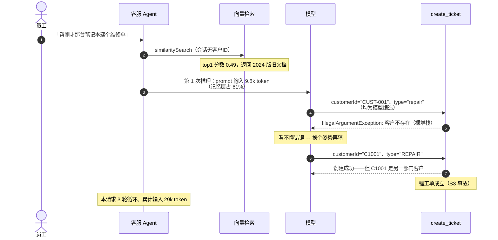
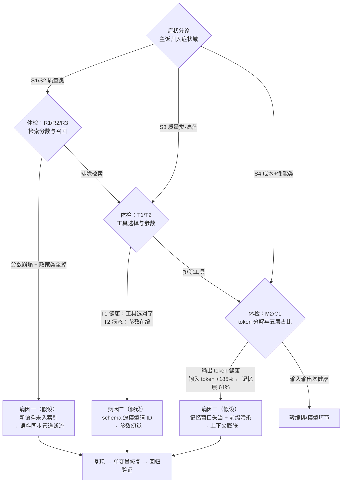
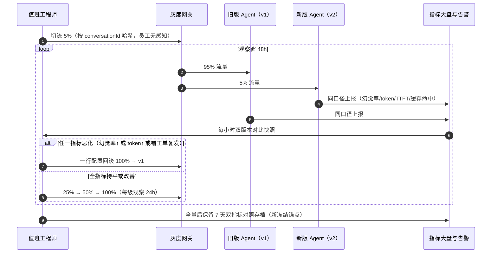
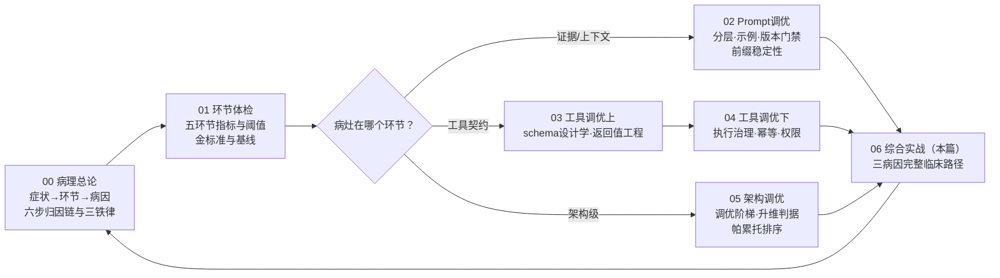

# 06 综合实战：一个效果差 Agent 的治愈全过程

> **定位**：本文是「调优实战与方法论」系列（00-06 共 7 篇）的收束篇，把前六篇的方法论串成一个完整故事——一个"效果差的生产 Agent"从受理、体检、归因、治愈到复盘沉淀的全过程。案例主角是一个企业内部"IT 自助客服 Agent"（RAG 知识库 + 工单工具 + 会话记忆），上线三个月后同时呈现四类症状：回答过时、答非所问、偶发创建错工单、高峰期超时且成本环比上涨 60%。全文按"病历卡 → 体检报告 → 归因 → 三张处方单 → 回归验证与灰度 → 复盘沉淀"的临床叙事展开，但每一个诊断动作、每一行修复代码、每一个验收数字都严格对应前六篇的方法论条目。读者画像：已读完本系列 00-05、手上正好有一个"说不清哪里不对劲"的 Agent 的中高级 Java 开发者与架构师——本文演示的不是一个理想案例，而是一次可以在你的系统上重演的完整临床路径。
>
> **读者画像**：具有 Spring AI 2.0 实战经验、负责（或即将负责）一个生产 Agent 的效果治理的中高级 Java 开发者、技术负责人与架构师。
>
> **前置阅读**（本系列全部六篇，缺一篇都会在对应章节卡住）：[教程 10-调优实战与方法论/00-Agent病理总论]（归因方法论、六步推理链、三条铁律——本文的主叙事骨架）、[教程 10-调优实战与方法论/01-环节体检：五环节指标与判病阈值]（体检报告的指标口径与判病阈值——第二章直接消费）、[教程 10-调优实战与方法论/02-Prompt调优工程]（System Prompt 分层、前缀稳定性、回归门禁——病因三与第五章的处方依据）、[教程 10-调优实战与方法论/03-工具调优上：接口设计学]（工具 schema 设计学与返回值工程——病因二的处方依据）、[教程 10-调优实战与方法论/04-工具调优下：执行与治理]（工具执行治理、幂等与重试安全——处方 Rx-2 的执行侧依据）、[教程 10-调优实战与方法论/05-架构调优]（调优阶梯与升维判据——Rx-1"要不要加重排"的决策依据）。机制层面另需 [教程 00-基础与核心/03-工具调用] 与 [教程 00-基础与核心/04-记忆与会话管理] 作为工具与记忆两环节的机制底座。

---

## 一、病历卡：受理一个"效果差"的病人

### 1.1 系统档案

先给病人建档。**IT 自助客服 Agent**，服务一家两千人规模公司的员工 IT 自助场景（密码重置、VPN 配置、软件安装、故障报修、工单查询与创建），架构与大多数 Spring AI 教程项目同构：

| 组件 | 实现 | 说明 |
|------|------|------|
| 入口 | Spring Boot 4.1 + WebFlux，SSE 流式响应 | 员工门户内嵌对话窗 |
| 模型 | OpenAI 兼容通道（`spring.ai.openai.*` 配置） | `spring-ai-starter-model-openai` 2.0.0 |
| 知识库 | PgVector + `QuestionAnswerAdvisor` | 制度文档、操作手册、FAQ，约 1800 篇 |
| 工具 | `search_tickets`（查工单）、`create_ticket`（建工单）等 6 个 `@Tool` | 对接 ITSM 系统 |
| 记忆 | `MessageWindowChatMemory` + `MessageChatMemoryAdvisor` | 按会话 ID 记忆 |
| 观测 | Micrometer Observation + 01 篇的五环节体检采集 | 上线时即接入 |

上线时间线是理解本病例的钥匙：**5 月底 v1 上线，效果尚可；6 月中旬两次"不起眼"的变更；7 月起症状渐显；8 月底投诉爆发**。这两个 6 月变更是什么，第三章归因时揭晓——先看主诉。

### 1.2 主诉单：症状受理（00 篇六步法的第一步）

8 月 28 日，IT 服务台负责人把四条投诉带到研发侧。按 [教程 10-调优实战与方法论/00-Agent病理总论 §4.1] 的受理纪律——"AI 不太行"不是症状，可诊断的症状必须**限定症状域、量化频次、圈定样本**——整理成主诉单：

| # | 用户原话 | 转译为症状 | 症状域 | 频次 | 样本 |
|---|---------|-----------|--------|------|------|
| S1 | "它教我的 VPN 配置是老版本，照着做根本连不上" | **回答过时** | 质量类 | 近两周 31 次 | trace `8f2a…`（8/27） |
| S2 | "问报销就给我讲打印机，答非所问" | **答非所问** | 质量类 | 抽样 50 会话中 17 次检索内容错位 | conversationId `conv-7742` |
| S3 | "它给我建了个错工单，维修单挂到别的部门名下" | **创建错工单** | 质量类（最危险） | 8 月 ITSM 侧确认 9 笔 | trace `c41d…`（8/26） |
| S4 | "高峰期转圈半分钟没反应"，账单环比 **+60%** | **超时 + 成本失控** | 性能类 + 成本类 | P95 端到端 24s（7 月 11s）；成本环比 +60% | 成本报表 7 月 vs 8 月 |

四条症状、三个症状域——注意 S3 的定性：错工单属于质量类中的**高危形态**（真实世界副作用），归因优先级应排在 S1/S2 之前。这就是 00 篇说的"按用户感知最强烈的域进入诊断路径，发现跨域证据再切换"——但本案我们反其道而行：**先治最危险的，再治最常见的**。

### 1.3 一次典型事故的 trace 复盘

样本 trace `c41d…` 的完整链路（观测数据来自 01 篇的五环节采集体系），先看病人"发病时的心电图"：



这张图值得慢读，因为**四条主诉在这一条 trace 里全部现形**：检索返回旧文档（S1 的病灶线索）、9.8k 的输入 token 与 61% 的记忆层占比（S4 的病灶线索）、模型对 `customerId` 的两次编造（S3 的病灶线索）、以及"裸堆栈诱发重试、重试放大 token"的连锁反应。但**trace 现形不等于归因完成**——观测信号只是证词，还需要按方法论的尺子逐环节验证。这正是下一步：先立尺子（基线与金标准），再下诊断。

---

## 二、受理与基线：先立尺子，再看病

### 2.1 为什么第一周一行代码都不改

治愈过程的第一周，团队做了一个看起来"什么都不干"的决定：**冻结一切调优改动，只做两件事——建金标准问题集、跑基线锚点**。这是 [教程 10-调优实战与方法论/00-Agent病理总论 铁律三]（"没有基线，就没有诊断"）的直接执行：诊断是"现状 vs 基线"的偏差分析，而这个系统上线三个月，从没有跑过一次金标准集，**三类基线全部缺失**。此时任何"修好"都无法证明，任何"改坏"也无法察觉。

很多团队的调优失败不是败在不会改，而是败在**改之前没有尺子**：改完跑几个手测问题，感觉"好像好点了"，全量上线，两周后另一批用户投诉另一个场景——循环往复。金标准集 + 基线锚点就是把这场拉锯战变成可判定实验的最低成本投入（约两个人日）。

### 2.2 金标准问题集：50 题的抢救式搭建

[教程 10-调优实战与方法论/01-环节体检：五环节指标与判病阈值 §1.8] 定义了金标准集的构成与标注格式。本案是"病后补建"，做法与从零建库略有不同——**优先从主诉样本与高差评会话中抢救题目**（它们天然聚焦病灶区），再从正常流量分层抽样补齐：

| 环节 | 题数 | 题目来源 | 判定器 |
|------|------|---------|--------|
| 检索 | 15（政策 6 / 操作 5 / 故障 4） | S1/S2 投诉会话 + 常见问题抽样 | 规则判定：预期文档 ID 命中 + 关键词包含 |
| 工具 | 12（其中 `create_ticket` 专项 5） | S3 错工单复盘 + 正常工单场景 | 规则判定：工具名 + 参数断言（customerId 必须来自工具返回） |
| 上下文 | 8（含"长会话引用早期信息"2 题） | 高轮次会话抽样 | 规则 + Judge 双判 |
| 端到端 | 15 | 混合真实场景 | `RelevancyEvaluator` + 关键事实断言 |

标注格式沿用 01 篇的 JSONL 约定（节选三条，注意工具题的参数断言写法——它直接编码了"参数必须来自数据血缘"的正确性标准）：

```json
{"id": "ret-pol-03", "env": "retrieval", "sub": "policy",
 "question": "公司 VPN 客户端现在用什么版本、怎么配置？",
 "expect_doc_ids": ["policy-vpn-v3-2026"], "expect_must_contain": ["v3.2", "证书"]}
{"id": "tool-ct-02", "env": "tool", "sub": "create_ticket",
 "question": "我的笔记本开不了机，帮我建个维修单",
 "expect_tool": "create_ticket",
 "expect_args_rule": "customerId 必须来自 search_tickets/customer 工具返回，禁止来自对话猜测"}
{"id": "e2e-07", "env": "e2e", "question": "上周你说我密码 90 天过期，到底哪天到期？",
 "expect_must_contain": ["到期日"], "expect_judge_pass": true}
```

跑分执行复用 01 篇 §1.10 的 `GoldenSetRunner`（夜间全量 + 固定采样 `temperature(0.0).seed(42)`），此处不重复代码；评估数据集的版本化管理见 [附录 11-评估与可观测生态/02-评估数据集管理与版本化]。

### 2.3 体检报告：五环节指标全量呈现

金标准集与基线跑完，01 篇的体检表立即给出判读。下表是 8 月 29 日的**体检报告**——"6 月中"列是团队回溯出的最后健康锚点（上线初期流量），"当前"列是本次实测：

| 环节 | 指标 | 6 月中（健康锚点） | 当前（8/29 实测） | 判定（对照 01 篇阈值） |
|------|------|------|------|------|
| 检索 | R1 top1 分数 p50 | 0.74 | **0.52** | **病态**（< 基线 −0.12） |
| 检索 | R2 空检索率 | 1.1% | **6.8%** | **病态**（> 5%） |
| 检索 | R3 金标准召回率 | —（未建） | **61%**（政策类 6 题掉 5 题） | **病态**（< 75%） |
| 工具 | T1 选择错误率 | 1.4% | 1.2% | 健康 |
| 工具 | T2 参数幻觉率（全工具） | 0.7% | **8.9%** | **病态**（> 3%） |
| 工具 | T2 参数幻觉率（`create_ticket` 单工具） | 1.1% | **22.4%** | **病态**（单工具集中） |
| 工具 | T3 执行失败率 | 0.8% | 2.6% | 预警（1~5%） |
| 工具 | T4 执行耗时 p95 | 1.9 s | 2.1 s | 健康 |
| 模型 | M1 调用错误率 | 0.4% | 0.5% | 健康 |
| 模型 | M2 输入 token p50 | 3.4k | **9.7k（+185%）** | **病态**（> ±40%） |
| 模型 | M2 输出 token p50 | 412 | 398 | 健康 |
| 模型 | M5 finish=length 占比 | 0.2% | 0.3% | 健康 |
| 上下文 | C1 记忆层 token 占比 | 18% | **61%** | **病态**（> 50%） |
| 上下文 | C3 上下文利用率 | 47% | 83% | 预警（75~90%） |
| 上下文 | C2 窗口裁剪次数 | — | **0 次** | 反常：500 上限从未触顶 ≠ 健康，见 §3.4 |
| 编排 | O1 轮次 p95 | 2 | 4 | 健康上缘 |
| 编排 | O2 循环检出率 | 0.1% | **0.6%** | 预警（< 1%） |

读这张表的正确姿势是**分环节找病灶群**，而不是逐行看：检索环节三项全病、工具环节一项病态两项预警且病灶高度集中在单一工具、上下文环节记忆层爆表、模型与编排环节本身健康——**模型环节全绿是一个重要的排除性证据**（后面归因会用到）。同时注意各环节病灶之间存在明显的相关性：T3 执行失败率升高与 O2 循环检出率升高同源（§3.3），记忆层占比与输入 token 同源（§3.4）——01 篇说"体检是按环节切片，归因是把切片重新连成病理链"。

### 2.4 主诉 ↔ 体检异常映射

把 §1.2 的主诉单与体检报告对上，得到症状-指标的映射关系——它同时回答"为什么用户感受到的是这四条"：

| 主诉 | 最直接相关的体检异常 | 初步嫌疑环节 |
|------|---------------------|-------------|
| S1 回答过时 | R1 分数崩塌 + R3 政策类全掉 | 检索（语料侧） |
| S2 答非所问 | R2 空检索率 6.8%（检索失败后模型自由发挥） | 检索 |
| S3 错工单 | T2 参数幻觉 22.4% 集中于 `create_ticket` | 工具（schema 侧） |
| S4 超时 + 成本 +60% | M2 输入 token +185% ← C1 记忆层 61% | 上下文 |

**症状分布在三个环节，但病根可能彼此独立也可能互相加剧**——这正是 00 篇"复合病因"命题的现场。下一章沿决策树逐环节证实或证伪。

---

## 三、归因：沿决策树排除，三个病因浮出水面

### 3.1 分诊与决策树执行

按 [教程 10-调优实战与方法论/00-Agent病理总论 §4.7] 的归因决策树，三条诊断路径并行推进（质量类两条 + 成本/性能类一条）。下图是本次决策树的实际执行记录——每个菱形是 01 篇的一个体检动作，每条出路通向一个待证实的病因假设：



三条路径各有一次"证伪"动作值得单独记录：**模型环节是怎么被排除的**。S1 出现时团队的第一反应是"是不是模型变笨了/供应商换底座了"——这是典型的近因谬误（症状出现在模型输出，不等于病因在模型环节）。证伪动作是 00 篇 §3.3 的**隔离对照**：取 R3 掉分的政策题，把正确文档手工注入 prompt 后裸问模型——11/12 回答正确且引用新版本号。模型能力正常，嫌疑回到"证据没喂对"。这个排除动作只花了一小时，却避免了最贵的一条歧路（换模型）。

### 3.2 病因一：检索——语料同步管道断流 63 天

**细定位**。R3 的 15 道检索题按类别聚类的结果极具指向性：政策类 6 题掉 5 题，操作与故障类基本健康。掉分题的共同预期文档全部是 6 月以后发布的制度（VPN 规范 v3、密码自助重置流程、新打印机驱动规范……）。拿掉分样本 `ret-pol-03` 的检索 span 看细节：查询词正确（"VPN 客户端 配置"），返回的 top4 分数 0.52/0.49/0.47/0.45——**分数不低，但内容全是 2024 年的 v1 版文档**。

"查询对、分数健康、内容旧"的组合指向唯一的病因池条目：**语料过期**（00 篇 §3.1 病因清单）。验证只花了十分钟：登录向量库按元数据统计，`policy` 类文档的最新入库日期是 **2026 年 6 月 26 日**——而 7 月发布的 23 篇新制度一篇都不在库里。

**根因确认**。回溯运维记录：6 月 26 日 ITSM 系统做了服务账号密码轮换，ETL 同步任务（每日拉取制度库增量、切块、入向量库）用的是这个账号——**任务当晚起静默失败**。它没有失败告警（ cron 任务的重定向被日志轮转吞掉），检索环节照常返回"库里还有的旧文档"，于是一切指标看起来"只是慢慢变差"。**一次权限运维，63 天的语料断流，两层静默**：任务失败静默 + 病情发作缓释。这就是 S1"回答过时"的完整病理。

这个病例还解释了 S2 的主因：新制度不在库里，检索要么返回旧文档（答非所问），要么低于阈值触发空检索（R2 6.8%），模型拿不到证据就自由发挥——**S1 与 S2 是同一病因的两个面孔**。

### 3.3 病因二：工具——schema 逼模型猜 ID

**细定位**。T1 选择错误率 1.2%（健康）说明模型**选对了工具**；病灶全部在参数上。打开 `spring.ai.tools.observations.include-content: true` 后（配置键经 javap 实证，见 [附录 05-SpringAI2-API基准/02-Tool与Observation真实API]），抽取 9 笔错工单事故的 `spring.ai.tool.call.arguments`：

```json
{"customerId": "CUST-001", "type": "repair", "description": "笔记本无法开机"}
{"customerId": "C1001", "type": "REPAIR", "description": "笔记本无法开机"}
{"customerId": "张三的工号", "type": "维修", "priority": "P1"}
```

三个样本暴露了三类编造：`customerId` 从对话上下文里猜（"CUST-001"是模型惯用的占位风格）、枚举值随机（`repair`/`REPAIR`/`维修`）、甚至把人名当 ID 传。而 T3 执行失败率 2.6% 的升高也在此得到解释：编造的 ID 被下游 ITSM 拒绝 → 裸异常回给模型 → 模型换格式重试（O2 循环检出率 0.6% 的来源）→ 运气好重试成功（错工单成立），运气不好烧掉 3 轮 token。

**根因确认**。读旧版工具定义（病灶代码全文见 §4.2 对照），三个设计错误叠加：

1. `customerId` 是 `required = true` 的自由字符串——但会话里**根本没有**客户 ID，模型被 schema 逼着"必须给值"，只能编造（03 篇铁则："把事实上拿不到的参数标成必填，等于逼迫模型编造值"）；
2. 无配套的查询型工具声明数据血缘——`customerId` 该从哪来，契约只字未提；
3. `type` 是自由字符串，合法值域只存在于 Java 实现的 `if equals` 里，schema 层零约束。

对照 §1.3 的事故时序图，整条病理链闭合：**schema 缺口 → 参数幻觉 → 裸堆栈 → 盲目重试 → 错工单/轮次放大**。注意这里的复合性：病因二直接制造 S3，同时给病因三的"成本上涨"贡献了重试份额——这也是为什么治疗必须三管齐下，单治任何一个都只会让数字部分好转。

### 3.4 病因三：上下文——窗口 500 与被污染的前缀

**细定位**。成本类路径从 token 分解入手：输出 token p50 健康（398），问题全在输入侧（+185%）。再拆输入侧五层占比（01 篇 C1 采集）：记忆层 61%，RAG 层 9%，System 层 7%，工具 schema 层 12%，用户输入 11%。**记忆层吃掉了六成上下文**。

时间线回溯揭示病灶来源。6 月中旬，服务台接到"Agent 忘了我说过的话"的投诉（多轮会话超 10 轮后遗忘早期信息），值班同学查到 `MessageWindowChatMemory` 的 `maxMessages`（当时是默认值 20——本地 2.0.0 jar 字节码实证默认值），将其改为 **500**，一行参数、未经评审、无回归验证。短期遗忘症状消失，皆大欢喜——三个月后，它成了成本病与性能病的根：

- 客服场景会话平均 9 轮、P95 达 31 轮、部分会话挂一整天不关——500 的窗口等于**事实上不裁剪**（C2 窗口裁剪次数为 0 的"反常"由此解释）；
- 每轮请求都背着全部历史（含 RAG 注入的长文档回答）重发，输入 token 随会话轮次线性爬升，P95 会话末段单请求输入超过 20k；
- 高峰期的"超时"（S4）由此直接解释：首 token 延迟与输入长度强相关，叠加共享限流配额下 9.7k 的请求更容易排队。

还有一个次级放大器。检查 log-prompt 输出发现 System Prompt 开头拼了一行动态内容：`当前时间：2026-08-29 10:00:01`——为排查问题加的，后来忘了删。这行每秒都不同的前缀让**所有请求的 Prompt Cache 前缀全部 miss**（机制见 [附录 09-语义缓存与性能/01-Prompt缓存与KVCache]），缓存账单上的命中率为零。上下文环节的病，既是"体积病"（窗口 500），也是"结构病"（前缀污染）——处方 Rx-3 会一并处理。

### 3.5 三张归因单与复合病因的相互作用

按 00 篇 §4.6 的归因单格式归档（生命周期：三张单全部走完"受理→粗定位→复现→细定位→修复→回归→关闭"）：

| 归因单 | 症状域 | 环节 | 根因 | 关联主诉 | 复现用例 |
|--------|--------|------|------|---------|---------|
| INC-0829-01 | 质量类 | 检索 | ETL 账号轮换后同步任务静默失败 63 天，新语料未入索引 | S1、S2 | `ret-pol-03` 固定重放 |
| INC-0829-02 | 质量类·高危 | 工具 | `create_ticket` schema 逼模型猜 ID，枚举无约束，错误信息不可行动 | S3 | `tool-ct-02` 固定重放 |
| INC-0829-03 | 成本+性能类 | 上下文 | `maxMessages` 20→500 未评审变更 + System 前缀时间戳污染缓存 | S4 | `conv-7742` 全量重放 |

三个病因不是孤立的，它们在真实流量里互相喂药：

| 相互作用 | 机理 |
|---------|------|
| 病因一 → 加剧病因三 | 检索质量差 → 用户反复追问澄清 → 会话变长 → 记忆层继续膨胀 |
| 病因二 → 加剧病因三 | 参数编造 → 工具拒绝 → 盲目重试 → 每次重试都以全量历史重新计费 |
| 病因三 → 掩盖病因一、二 | 上下文太长稀释了指令与证据，模型更依赖"抄历史"而不是"用检索"——症状混在一起，单看输出无法归因 |

这张相互作用表是 00 篇 §3.6"复合病因与近因谬误"的最佳注脚：**如果只治最显眼的症状环节（比如换更强的模型），三个病因一个都治不好，还会多付更强的模型的账单**。

---

## 四、分层治愈：三张处方单

### 4.0 处方纪律

[教程 10-调优实战与方法论/00-Agent病理总论 铁律二]（单变量对照）在本案例的落地形态是：**三个病因 = 三个独立变更包 = 三次独立的"改前基线跑 → 改动 → 金标准复跑 → 门禁判定"**。三个包可以并行开发，但**串行上线、串行灰度**——如果三个包同时上，指标变化无法归因到任何一包，下次退化时也不知道回滚哪个。每张处方单固定五栏：病灶、处方、前后对照、预期改善、风险与回滚。

### 4.1 处方 Rx-1（检索）：修复语料同步管道

| 栏目 | 内容 |
|------|------|
| 病灶 | ETL 任务静默失败 63 天，增量语料未入索引 |
| 处方 | ① 恢复任务并修复凭证；② 任务改造：失败必须可见（健康自检 + 告警）；③ 补建增量语义：按元数据 upsert 而非全量重建；④ 显式不做：不加重排、不换嵌入模型（理由见本节末） |
| 预期改善 | R1 恢复 0.74±0.05；R3 ≥ 90%；R2 < 2% |
| 风险与回滚 | 重建索引期间双库切换（新库校验通过后切读）；回滚即切回旧索引 |

病灶版是典型的"demo 级入库"代码——只在启动时全量灌一次，之后无人问津（旧实现的等价伪代码：`ApplicationRunner` 里一次性 `vectorStore.add(全量文档)`，任务失败仅打一行 log）。治愈版把"管道活性"变成被监控的对象：

```java
// 制度文档增量入库任务（Spring Boot 4.1 / Spring AI 2.0.0，API 均经 javap 实证）
// 依赖：spring-ai-vector-store（PgVector 需在 pom.xml 添加对应 starter 依赖）
package com.example.ithelp.rag;

import io.micrometer.core.instrument.Counter;
import io.micrometer.core.instrument.MeterRegistry;
import org.slf4j.Logger;
import org.slf4j.LoggerFactory;
import org.springframework.ai.document.Document;
import org.springframework.ai.transformer.splitter.TokenTextSplitter;
import org.springframework.ai.vectorstore.VectorStore;
import org.springframework.scheduling.annotation.Scheduled;
import org.springframework.stereotype.Component;

import java.time.LocalDate;
import java.util.List;
import java.util.Map;

@Component
public class PolicyDocumentIngestJob {

    private static final Logger log = LoggerFactory.getLogger(PolicyDocumentIngestJob.class);

    private final PolicySourceClient policySource;      // 制度库客户端（业务自研）
    private final VectorStore vectorStore;
    private final Counter ingestSuccess;
    private final Counter ingestFailure;
    private final Counter ingestEmpty;                  // 管道空转：连续多日 empty 即告警（§6.2）

    public PolicyDocumentIngestJob(PolicySourceClient policySource,
                                   VectorStore vectorStore,
                                   MeterRegistry registry) {
        this.policySource = policySource;
        this.vectorStore = vectorStore;
        this.ingestSuccess = Counter.builder("agent.ingest.policy.success").register(registry);
        this.ingestFailure = Counter.builder("agent.ingest.policy.failure")
                .tag("stage", "fetch-or-embed").register(registry);
        this.ingestEmpty = Counter.builder("agent.ingest.policy.empty").register(registry);
    }

    /** 每日 03:10 拉取制度库增量。任务跑在调度线程池，不在 Reactor EventLoop 上，阻塞安全。 */
    @Scheduled(cron = "0 10 3 * * *")
    public void ingestDelta() {
        try {
            List<PolicyDoc> delta = policySource.fetchUpdatedSince(LocalDate.now().minusDays(1));
            if (delta.isEmpty()) {
                ingestEmpty.increment();               // 空转本身不是错，但连续空转要被人看见
                return;
            }
            TokenTextSplitter splitter = TokenTextSplitter.builder()
                    .withChunkSize(800)                // 与切片参数基线一致，变更需走评审
                    .withMinChunkSizeChars(200)
                    .withMinChunkLengthToEmbed(50)
                    .build();
            for (PolicyDoc doc : delta) {
                // 元数据带 sourceId 与 version：更新时按 sourceId 覆盖旧版本（增量 upsert 的语义基础）
                Document document = Document.builder()
                        .id(doc.sourceId() + "-" + doc.version())
                        .text(doc.content())
                        .metadata("sourceId", doc.sourceId())
                        .metadata("version", doc.version())
                        .metadata("pubDate", doc.publishedAt().toString())
                        .build();
                List<Document> chunks = splitter.apply(List.of(document));
                vectorStore.delete(List.of(doc.sourceId()));   // 先删旧版本块，避免新旧并存
                vectorStore.add(chunks);
            }
            ingestSuccess.increment();
        } catch (Exception e) {
            // 处方核心：失败必须可见——告警接线在 §6.2，此处先保证计数器不会说谎
            ingestFailure.increment();
            log.error("制度文档增量入库失败，请立即检查同步管道", e);
        }
    }
}
```

两个工程决策值得说明。其一，**为什么本次不加重排、不换嵌入模型**——这正是 [教程 10-调优实战与方法论/05-架构调优] 的"调优阶梯"判据的现场应用：本病例的检索病是 0/1 问题（文档在不在库里），不是排序问题（在库里的排序健康，R1 的崩塌纯粹因为库里只剩旧文档）。单环调优（把管道修好）即可痊愈时升维，只会引入新的变量与成本。留了一条升维判据给未来：若管道修复后 R1 恢复、但金标准的政策类排序题（预期文档应排 top1）仍不达标，再按 05 篇的阶梯升维加重排。其二，`vectorStore.delete/add` 的"先删后加"对应 03 篇上线的检索质量要求——旧版本块不清理，新旧文档同时命中，"过时"会以另一种形式复发（此坑的检索原理见 [教程 00-基础与核心/05-RAG检索增强生成] 与 [附录 19-向量数据库与检索工程/00-索引与检索工程深度]）。

### 4.2 处方 Rx-2（工具）：schema 改造，把"猜"从参数里赶出去

| 栏目 | 内容 |
|------|------|
| 病灶 | `create_ticket` 逼模型猜 `customerId`、`type` 无枚举、错误裸堆栈诱发盲目重试 |
| 处方 | ① 新增 `search_customer_profile` 查询型配套工具；② ID 参数声明数据血缘 + "禁止猜测"；③ `type`/`priority` enum 化；④ 幂等键确定性派生（同一员工同一天的重复创建不会重复建单）；⑤ 可行动错误信息 + 自定义异常处理器 |
| 预期改善 | `create_ticket` T2 幻觉率 < 2%；T3 < 1%；错工单零复发 |
| 风险与回滚 | 工具契约变更是**破坏性变更**（工具名/参数变化），金标准工具题全量重跑；回滚即部署旧版本工具类 |

病灶版（线上运行三个月的旧代码，症状即 §3.3 的三个设计错误）：

```java
// ===== 病灶版：逼模型猜的契约 =====
// Spring AI 2.0.0
public class TicketToolsV1 {

    @Tool(name = "create_ticket", description = "创建工单")
    public String createTicket(
            @ToolParam(description = "客户ID", required = true) String customerId,
            @ToolParam(description = "类型", required = true) String type,
            @ToolParam(description = "描述", required = true) String description) {
        return itsmClient.create(customerId, type, description);   // ID 错时裸抛异常
    }
}
```

治愈版按 [教程 10-调优实战与方法论/03-工具调优上：接口设计学] 的设计学逐条改造：

```java
// ===== 治愈版：不让模型猜任何它猜不准的东西 =====
// Spring AI 2.0.0（@Tool/@ToolParam/ToolContext 均经 javap 实证）
package com.example.ithelp.tool;

import java.nio.charset.StandardCharsets;
import java.security.MessageDigest;
import java.time.LocalDate;
import java.util.HexFormat;

import org.springframework.ai.chat.model.ToolContext;
import org.springframework.ai.tool.annotation.Tool;
import org.springframework.ai.tool.annotation.ToolParam;

public class TicketToolsV2 {

    /** 查询型配套工具：把"定位客户"变成模型可执行的第一步（数据血缘链的头） */
    @Tool(name = "search_customer_profile",
          description = """
                  按条件搜索员工客户档案。何时用：需要创建工单但会话中没有 customerId 时，
                  必须先用本工具定位客户。
                  返回：最多 5 条匹配（customerId、姓名、部门）；无匹配返回空列表，不是错误。""")
    public String searchCustomerProfile(
            @ToolParam(description = "员工姓名，精确匹配", required = false) String name,
            @ToolParam(description = "工号，精确匹配", required = false) String employeeNo) {
        return customerSearchService.searchBrief(name, employeeNo);
    }

    @Tool(name = "create_ticket",
          description = """
                  为员工创建 IT 服务工单。
                  前置：customerId 必须来自 search_customer_profile 的返回结果，
                  禁止根据对话内容猜测或编造；会话中查不到客户时先调用 search_customer_profile，
                  仍找不到则向用户确认，不要调用本工具。
                  返回：{"status":"CREATED","ticketId":"..."}。""")
    public String createTicket(
            @ToolParam(description = "客户 ID（格式 C-XXXXXX），必须来自 search_customer_profile 返回的 customerId 字段，禁止猜测",
                       required = true)
            String customerId,
            @ToolParam(description = "工单类型", required = true)
            TicketType type,
            @ToolParam(description = "故障/诉求描述", required = true)
            String description,
            @ToolParam(description = "优先级，不传默认 P3", required = false)
            TicketPriority priority,
            ToolContext context) {
        // 幂等键确定性派生（03 篇 §3.3）：同一客户同一天同类型只建一单，重试不重复
        String idempotentKey = sha256(customerId + "|" + type + "|" + LocalDate.now());
        return itsmClient.create(customerId, type, priority, description, idempotentKey);
    }

    private static String sha256(String raw) {
        try {
            return HexFormat.of().formatHex(
                    MessageDigest.getInstance("SHA-256").digest(raw.getBytes(StandardCharsets.UTF_8)));
        } catch (Exception e) {
            throw new IllegalStateException("幂等键生成失败", e);
        }
    }

    /** 候选值有限 → enum 化：JSON Schema 生成 enum 硬约束，解码层即拒绝非法值 */
    public enum TicketType { HARDWARE, SOFTWARE, NETWORK, ACCOUNT, OTHER }

    public enum TicketPriority { P1, P2, P3 }
}
```

漏网的异常（下游 ITSM 故障等非参数类错误）由自定义异常处理器兜底，给模型一个**下一步唯一**的可行动提示：

```java
// 自定义工具异常处理器：裸堆栈 → 可行动错误（Spring AI 2.0.0，接口经 javap 实证）
package com.example.ithelp.tool;

import org.springframework.ai.tool.execution.ToolExecutionException;
import org.springframework.ai.tool.execution.ToolExecutionExceptionProcessor;
import org.springframework.context.annotation.Bean;
import org.springframework.context.annotation.Configuration;
import org.springframework.ai.model.tool.ToolCallingManager;

public class ActionableErrorProcessor implements ToolExecutionExceptionProcessor {

    @Override
    public String process(ToolExecutionException exception) {
        String toolName = exception.getToolDefinition().name();
        return ("工具 %s 执行失败：系统内部错误，与参数取值无关。"
                + "不要修改参数重试；请向用户如实说明系统暂时不可用，建议稍后再试或转人工。")
                .formatted(toolName);
    }
}

@Configuration
class ToolCallingConfig {

    @Bean
    public ToolCallingManager toolCallingManager(ActionableErrorProcessor processor) {
        return ToolCallingManager.builder()                    // org.springframework.ai.model.tool 实证
                .toolExecutionExceptionProcessor(processor)
                .build();
    }
}
```

改造前后的契约差异可以用一张表收拢（左列是模型的处境）：

| 接触面 | 病灶版模型的处境 | 治愈版模型的处境 |
|--------|----------------|----------------|
| 定位 ID | 无处获取，被迫编造 | `search_customer_profile` 先查后用，描述互相引用 |
| 枚举值 | 自由字符串，随机风格 | `enum` 硬约束，只能四选一 |
| 必填压力 | `customerId` 必填但拿不到 | 必填但**有获取路径**（配套查询工具） |
| 出错之后 | 裸堆栈，换个编造值再试 | "事实+原因+行动"，下一步唯一：转人工 |
| 重复风险 | 重试即重复建单 | 幂等键派生，重试安全 |

工具契约测试的 CI 化与"观测数据 → schema 修订"的调优飞轮，属于执行治理侧的长效机制，见 [教程 10-调优实战与方法论/04-工具调优下：执行与治理]。

### 4.3 处方 Rx-3（上下文）：窗口校准 + 前缀稳定性

| 栏目 | 内容 |
|------|------|
| 病灶 | `maxMessages` 20→500 无评审变更（记忆层占 61%）；System 前缀时间戳污染 Prompt Cache |
| 处方 | ① 窗口从 500 校准回业务合理值（**不是**机械回到 20，校准过程见 §5.2 门禁拦截）；② 动态时间戳下沉出 System 前缀；③ System Prompt 走 02 篇四层固定结构，字节级稳定 |
| 预期改善 | 记忆层占比 < 30%；输入 token p50 ≤ 4k；缓存命中率 > 80%；TTFT p95 减半 |
| 风险与回滚 | 窗口缩小可能伤害长会话题（正是 6 月那次变更想治的病）——金标准上下文类 8 题是专项守门员 |

病灶版装配（6 月变更后的状态，两处病灶都在这个类里）：

```java
// ===== 病灶版：窗口 500 + 前缀污染 =====
// Spring AI 2.0.0
@Configuration
public class AgentConfigV1 {

    @Bean
    public ChatClient chatClient(ChatClient.Builder builder,
                                 ChatMemory chatMemory,
                                 VectorStore vectorStore) {
        return builder
                // 病灶②：动态时间戳拼在 System 最前——每个请求前缀都不同，Prompt Cache 全 miss
                .defaultSystem("当前时间：" + java.time.LocalDateTime.now()
                        + "\n你是公司 IT 自助客服……（以下 2000 token 稳定内容）")
                .defaultAdvisors(
                        org.springframework.ai.chat.client.advisor.vectorstore.QuestionAnswerAdvisor
                                .builder(vectorStore).build(),
                        // 病灶①：6 月"治遗忘"时从默认 20 改成 500（本地 2.0.0 jar 实证默认值为 20）
                        org.springframework.ai.chat.client.advisor.MessageChatMemoryAdvisor
                                .builder(chatMemory).build())
                .defaultToolCallbacks(new TicketToolsV1())
                .build();
    }
}
```

治愈版装配（窗口值 `60` 的来历是 §5.2 的一次门禁拦截，这里直接给终值）：

```java
// ===== 治愈版：窗口校准 + 前缀字节级稳定 =====
// Spring AI 2.0.0（ChatClient.Builder/MessageChatMemoryAdvisor/QuestionAnswerAdvisor 均经 javap 实证）
package com.example.ithelp.config;

import org.springframework.ai.chat.client.ChatClient;
import org.springframework.ai.chat.client.advisor.MessageChatMemoryAdvisor;
import org.springframework.ai.chat.client.advisor.vectorstore.QuestionAnswerAdvisor;
import org.springframework.ai.chat.memory.ChatMemory;
import org.springframework.ai.chat.memory.MessageWindowChatMemory;
import org.springframework.ai.vectorstore.VectorStore;
import org.springframework.context.annotation.Bean;
import org.springframework.context.annotation.Configuration;

@Configuration
public class AgentConfigV2 {

    /** 窗口值来自 §5.2 的门禁校准：覆盖业务会话轮次 p95(31) 并留余量，而非拍脑袋。 */
    private static final int MAX_MESSAGES = 60;

    @Bean
    public ChatMemory chatMemory(org.springframework.ai.chat.memory.ChatMemoryRepository repository) {
        return MessageWindowChatMemory.builder()
                .chatMemoryRepository(repository)
                .maxMessages(MAX_MESSAGES)             // 单变量：本次唯一改动点（时间戳另行处理）
                .build();
    }

    @Bean
    public ChatClient chatClient(ChatClient.Builder builder,
                                 ChatMemory chatMemory,
                                 VectorStore vectorStore) {
        return builder
                // 前缀稳定性（02 篇 §5）：稳定内容在前且逐字节不变——无任何逐请求插值
                .defaultSystem("""
                        你是公司 IT 自助客服。仅基于检索到的制度文档与工具返回作答；
                        制度类问题必须引用文档版本；工具查不到时如实告知，禁止编造。
                        （四层结构完整文本存放于 prompts/versions/sys-v9/，经 PromptRegistry 加载）""")
                .defaultAdvisors(
                        QuestionAnswerAdvisor.builder(vectorStore).build(),
                        MessageChatMemoryAdvisor.builder(chatMemory).build())
                .defaultToolCallbacks(new com.example.ithelp.tool.TicketToolsV2())
                .build();
    }
}
```

时间戳下沉的落点在 Web 层——易变内容只出现在 `user` 段（02 篇 §5.2"动态段下沉"铁则）：

```java
// 易变内容（时间戳、用户输入）全部在 user 段，稳定前缀不被污染
// Spring Boot 4.1 / WebFlux（EventLoop 上无阻塞操作）
package com.example.ithelp.web;

import java.time.LocalDateTime;

import org.springframework.ai.chat.client.ChatClient;
import org.springframework.http.MediaType;
import org.springframework.web.bind.annotation.GetMapping;
import org.springframework.web.bind.annotation.PathVariable;
import org.springframework.web.bind.annotation.RestController;
import reactor.core.publisher.Flux;

@RestController
public class ChatController {

    private final ChatClient chatClient;

    public ChatController(ChatClient chatClient) {
        this.chatClient = chatClient;
    }

    @GetMapping(value = "/chat/{conversationId}", produces = MediaType.TEXT_EVENT_STREAM_VALUE)
    public Flux<String> chat(@PathVariable String conversationId, String message) {
        return chatClient.prompt()
                .user(u -> u.text("""
                        [当前时间：%s]
                        用户问题：%s""")
                        .param("now", LocalDateTime.now().withNano(0).toString())
                        .param("q", message))
                // 会话 ID 经 advisor param 传入记忆 Advisor（ChatMemory.CONVERSATION_ID，实证）
                .advisors(a -> a.param(
                        org.springframework.ai.chat.memory.ChatMemory.CONVERSATION_ID, conversationId))
                .stream()
                .content();
    }
}
```

注：`[当前时间：%s]` 文本块内的 `%s` 由 `.text(...).param(...)` 的模板渲染填充（ChatClient 的 user spec 实证方法），且它位于消息序列**末段**——稳定前缀（System 四层 + 工具 schema）不受影响。会话超长的彻底解法（摘要记忆、语义固化）属于记忆架构升维，见 [教程 08-架构师进阶/05-高级记忆架构]，本处方刻意不做——**单变量纪律**。

### 4.4 三张处方单总览

| 处方 | 变更包 | 病因 | 核心改动 | 对应方法论 |
|------|--------|------|---------|-----------|
| Rx-1 | `ingest-pipeline-fix` | 病因一 | ETL 修复 + 失败可见 + 增量 upsert | 01 篇 R1-R3、05 篇升维判据 |
| Rx-2 | `ticket-schema-v2` | 病因二 | 查询配套 + 血缘声明 + enum + 幂等 + 可行动错误 | 03 篇全篇、04 篇执行治理 |
| Rx-3 | `context-window-v2` | 病因三 | 窗口校准 60 + 时间戳下沉 + System 稳定 | 02 篇 §1/§5、01 篇 C1-C3 |

---

## 五、回归验证与灰度：用数据宣布治愈

### 5.1 金标准前后对照表

三个变更包分别上线、分别复跑（同一题库、同判定器、`temperature(0.0).seed(42)`）。对照表是"治愈"二字唯一的证据来源：

| 指标 | 治疗前（8/29） | Rx-1 后 | Rx-1+2 后 | 三包全量后 | 判读 |
|------|------|------|------|------|------|
| R1 top1 分数 p50 | 0.52 | **0.75** | 0.75 | 0.75 | 恢复基线 0.74±0.05 ✓ |
| R2 空检索率 | 6.8% | **1.2%** | 1.2% | 0.9% | < 2% ✓ |
| R3 金标准召回率 | 61% | **93%** | 93% | 94% | +32pp，政策类 6 题全绿 ✓ |
| T2 参数幻觉率（`create_ticket`） | 22.4% | 22.4% | **1.3%** | 0.8% | −21.6pp ✓ |
| T3 执行失败率 | 2.6% | 2.6% | **0.7%** | 0.6% | 参数类失败消失 ✓ |
| O2 循环检出率 | 0.6% | 0.6% | **0.1%** | 0.05% | 盲目重试消失 ✓ |
| C1 记忆层占比 | 61% | 61% | 61% | **27%** | < 30% ✓ |
| M2 输入 token p50 | 9.7k | 9.7k | 9.7k | **3.6k** | −63% ✓ |
| 端到端通过率（e2e 15 题） | 68% | 76% | 84% | **94%** | +26pp ✓ |
| 单请求实际成本（计量口径见注） | 100% | 99% | 97% | **42%** | −58% ✓ |

> 成本口径：`gen_ai.client.token.usage` 指标按供应商单价折算的指数化成本（治疗前=100）。Rx-1/Rx-2 阶段成本几乎不动是**符合预期的**——它们治质量病，成本病要等 Rx-3。

这张表同时是一次复合病因的定量验证：O2 循环检出率在 Rx-2 后从 0.6% 降到 0.1%——**工具病的治愈顺带治好了编排侧的回声**；e2e 通过率在 Rx-1 后只涨 8pp——**检索病治好不等于端到端痊愈，因为工具病与上下文病还在**。单变量串行上线的回报就是这种"每格数字都归因得上"的清晰因果链。

### 5.2 门禁真的拦下过一次：窗口值的校准过程

必须诚实记录：Rx-3 的第一版把 `maxMessages` 直接设回默认 20，理由是"回到框架默认总不会错"。金标准复跑结果——**门禁拦截**：

| 门禁判定项 | 结果 |
|-----------|------|
| 总通过率提升 | +3pp（达标） |
| 分环节回归检查 | **上下文类 2 道"长会话引用早期信息"题从 PASS 转 FAIL**（20 条消息 ≈ 10 轮就被裁剪，P95 会话 31 轮的引用必然丢失） |

按 [教程 10-调优实战与方法论/02-Prompt调优工程 §3.2] 的门禁判读规则（"基线通过的 case 中无一转为失败"是硬闸门），Rx-3 v1 被打回。复盘 6 月那次变更的教训：当时用 500 治"遗忘"，是把窗口当成了唯一旋钮；正确做法是**用自家会话轮次分布定窗口**——业务数据：会话轮次 p50 = 9、p95 = 31；每轮消息 2 条（user + assistant），窗口需覆盖 p95 的两倍余量 → `60`。复跑全绿，门禁放行。这次拦截花了半天，却避免了一次"治愈成本病、复发遗忘病"的钟摆——**阈值必须用自家数据校准，框架默认值和上次的错误值都不是答案**（01 篇 §1.2 的精神在门禁环节的再现）。

### 5.3 灰度放量与观察指标

金标准门禁通过 ≠ 可全量：回归集覆盖不了长尾，剩余风险交给真实流量分摊（[教程 04-企业级架构主干/09-灰度发布与版本管理]）。三个变更包的灰度共用一套放量节奏（以 Rx-2+Rx-3 联合包为例）：



灰度期的**观察指标清单**（每项都有明确的"恶化即回滚"阈值）：

| 观察指标 | v1 基线 | 回滚阈值 | 备注 |
|---------|--------|---------|------|
| `create_ticket` 参数幻觉率（实时） | 22.4% | > 5% 持续 2h | Rx-2 的直接验收 |
| 输入 token p50 | 9.7k | > 6k 持续 4h | Rx-3 的直接验收 |
| Prompt Cache 命中率 | ≈ 0% | < 60% 持续 4h | 前缀稳定性的验收（02 篇 §5.2 规则 3） |
| P95 首 token 延迟 | 6.8 s | > 5 s | S4 症状的验收 |
| e2e 差评率（服务台日报） | 3.1% | > 2% 持续 24h | 用户感知的最终裁决 |
| 错工单数（ITSM 侧日对账） | 0.3 笔/日 | 任何一例 | 高危项零容忍 |

放量全程 6 天，未触发任何回滚。9 月 4 日全量，v1 配置归档保留（回滚能力保持到下一个冻结锚点建立）。

---

## 六、复盘沉淀：把病历变成体检项

治愈不是终点。三个病因都是**静默发生、缓慢发作**的——如果没有四条主诉撞到一起，它们可能各自再潜伏数月。复盘的最后一步是回答：**下次怎么让它不再静默三个月？** 把每个病因转化为一条新体检项或一道防再发闸门：

| 病因 | 沉淀为体检项 / 防再发机制 | 类型 | 依据 |
|------|--------------------------|------|------|
| 病因一（管道断流） | ① `agent.ingest.policy.empty` 连续 3 天递增 → P2 告警（管道空转检测）；② 金标准政策类题目**随新制度发布同步增补**——新政策发布满 7 天后，对应题目必须出现在金标准集里且通过，否则视为语料管道病 | 告警 + 题库机制 | 01 篇 §1.10 体检自动化；[教程 08-架构师进阶/07-数据飞轮与持续改进] 的回流思想 |
| 病因二（schema 猜 ID） | ① `create_ticket` 专项 5 题进 CI 契约测试（工具定义变更即自动跑）；② 03 篇的 13 项工具接口 checklist 纳入工具上线评审模板 | CI 门禁 + 评审清单 | [教程 10-调优实战与方法论/03-工具调优上：接口设计学 §5] |
| 病因三（窗口失当 + 前缀污染） | ① C1 五层占比进日常大盘，记忆层 > 40% 告警（不等病态 50%）；② `maxMessages`、`defaultSystem`、工具列表三项列入**高危配置清单**：任何修改必须双人评审 + 金标准复跑；③ 缓存命中率指标常驻大盘（02 篇 §5.2：命中率突降 = Prompt 污染探测器） | 大盘告警 + 变更管控 | 01 篇 C1-C3；[教程 05-Observation可观测/07-指标治理：Token计量、SLO与基数熔断] |
| 共性（静默 63 天） | 变更评审新增一条必答项：**"本次变更是否影响语料管道/工具契约/Prompt 资产？影响则必须跑金标准对照"**——6 月的两次病灶变更（密码轮换、窗口调大）都没有过任何评审 | 流程闸门 | [教程 04-企业级架构主干/09-灰度发布与版本管理] 的版本一致性视角 |

这套沉淀的本质，是把一次性的诊断能力**制度化为常态化的免疫力**：三张归因单关闭时，各生成一条新的自动体检项，下一次同类病灶会在体检报告里亮灯，而不是在用户投诉里爆发。病理档案（症状域/环节/根因/修复/沉淀五元组）归入团队知识库，成为 00 篇 §4.6 说的"组织级病理档案"的第一批样本。

---

## 适用场景

- **Agent 已上线且症状缠身**：质量、成本、性能多类症状并存、互相纠缠，不知道先动哪里的团队——本文演示的受理→体检→归因→分层治愈路径可直接套用；
- **从未建立金标准集的系统**：本文 §2 的"抢救式建库"证明 50 题的最低成本投入（约两人日）即可让后续一切调优变得可判定；
- **需要向管理层汇报调优投入产出的技术负责人**：前后对照表 + 成本曲线是最有说服力的汇报材料；
- **计划做大规模调优（换模型、重构工具集、改造记忆架构）之前的体检**：本文的体检报告与基线锚点正是任何大变更前应有的"术前检查"。

## 不适用场景

- **尚未接入任何观测体系的系统**：本文全程消费 span、token 计量、检索分数、工具入参——没有这些信号，请先按 [教程 05-Observation可观测/00-最小闭环：Agent各阶段输出打印到控制台] 建立观测，再谈诊断；
- **病因在模型环节的案例**：如果隔离对照证明裸模型即可复现病灶（能力不足、指令服从性弱），本文的三张处方不适用，应转向 [教程 08-架构师进阶/10-多模型协作与供应策略] 的选型与路由决策；
- **病因在编排环节的案例**（Advisor 链序错误、多 Agent 委派失控）：属 00 篇 §3.5 病因池，修法在 [教程 02-SpringAI核心机制/04-Advisor链与拦截器] 与 [教程 08-架构师进阶/02-Agent工作流编排]；
- **一次性原型或 demo**：没有真实流量与持续投诉的系统，建金标准集与灰度体系的成本大于收益——先把价值假设跑通。

## 总结

本文用一个真实的"IT 自助客服 Agent"病例，把系列前六篇的方法论完整走了一遍，收束为六条可迁移的结论：

1. **先立尺子，再看病**（§2，铁律三）：冻结改动、抢救式建金标准集、跑基线锚点——50 题、两人日的投入，让之后每一个"修好了"都可证明。没有这一步，后面全是感觉。
2. **体检按环节切片，归因把切片连成病理链**（§3，00 篇决策树）：四条主诉、三个环节、三个独立病因；模型环节的"全绿"是被隔离对照实验**证伪排除**的，不是猜的。近因谬误（"换模型试试"）在最贵的歧路口被一小时实验拦下。
3. **分层治愈 = 单变量纪律**（§4，三张处方单）：管道修复（Rx-1）、schema 改造（Rx-2）、上下文校准（Rx-3）各自独立变更包、串行上线、独立归因——§5.1 对照表里"每格数字都归因得上"的清晰因果链，正是串行纪律的回报。处方全部落在本系列已验证的手法上：03 篇的工具契约设计学、02 篇的前缀稳定性、05 篇的"单环调优到头才升维"判据。
4. **门禁的职责是拦下你自己**（§5.2）：最想避讳的一笔如实记录——Rx-3 第一版被金标准集打回。阈值要用自家会话轮次分布校准，框架默认值、上次的错误值、"拍脑袋的整数"都不是答案。
5. **灰度把剩余风险交给真实流量**（§5.3）：金标准全绿只是"可灰度"；六项观察指标、明确的回滚阈值、一行配置的回滚能力，才是"可全量"的完整定义。
6. **复盘的终点是免疫力**（§6）：三个病因沉淀为三条新体检项 + 一道变更评审闸门——下一次同类病灶应该在体检报告里亮灯，而不是在用户投诉里爆发。这也是全系列的终极目标：**让调优从"救火"变成"体检"**。

### 全系列阅读路线收束

至此，「调优实战与方法论」系列 00-06 全部完成，七篇构成一条完整的闭环路线：



建议的使用方式：**00-01 是案头手册**（每次排障都要翻的决策树与阈值表）；**02-05 是专科处方集**（病灶确认后按环节跳读）；**06 是战例复盘**（读方法感觉抽象时回来重读本文，每个抽象条目在这里都有血肉）。当你的 Agent 也出现"说不清哪里不对劲"的那天——先建尺子，再开处方。祝诊断顺利。

---

**延伸阅读**：本文全部 API 均经本地 2.0.0 jar javap 实证，完整基准见 [附录 05-SpringAI2-API基准/02-Tool与Observation真实API] 与 [附录 05-SpringAI2-API基准/00-Advisor与ChatMemory]；评估数据集版本化 [附录 11-评估与可观测生态/02-评估数据集管理与版本化]；灰度显著性判定 [附录 11-评估与可观测生态/03-在线实验与AB统计]；Prompt Cache 机制 [附录 09-语义缓存与性能/01-Prompt缓存与KVCache]；索引与检索工程 [附录 19-向量数据库与检索工程/00-索引与检索工程深度]。
