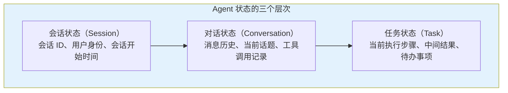
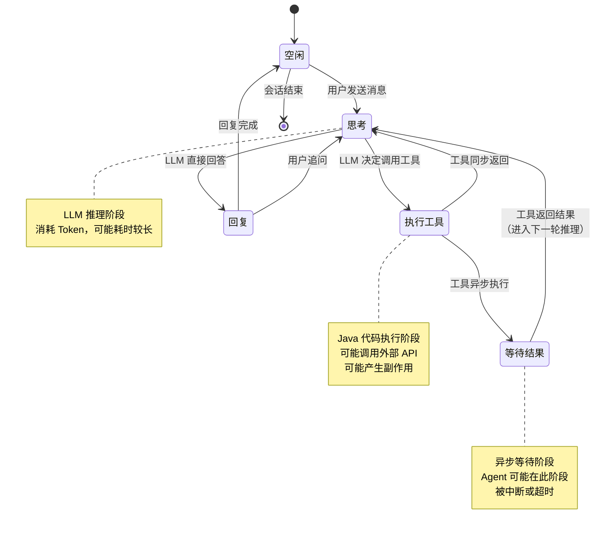
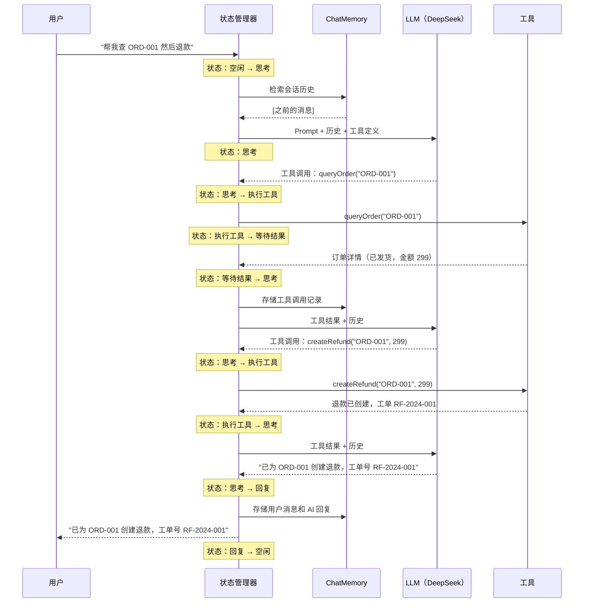
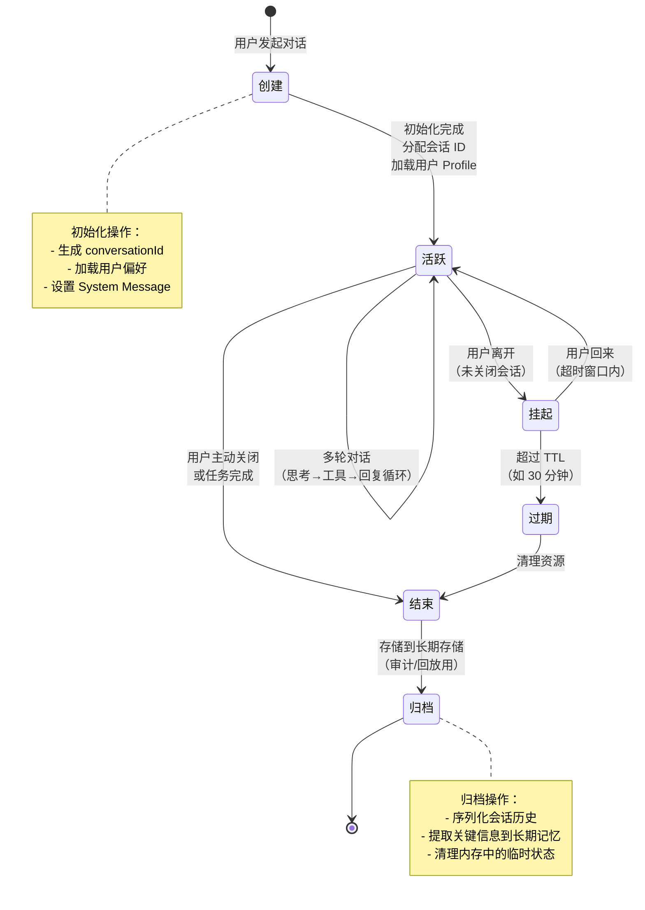
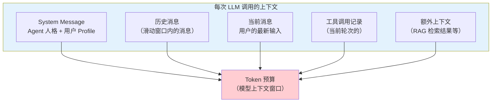
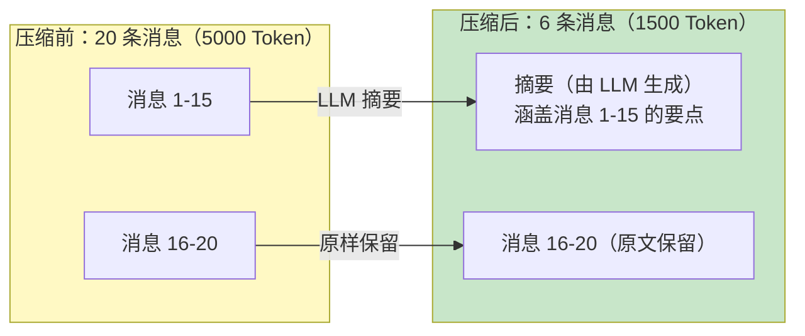
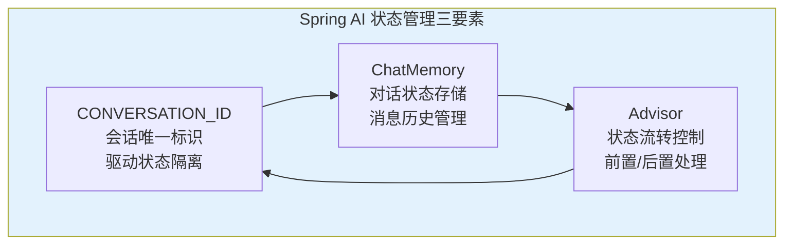
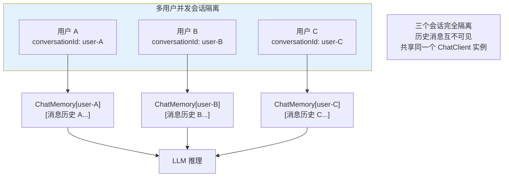
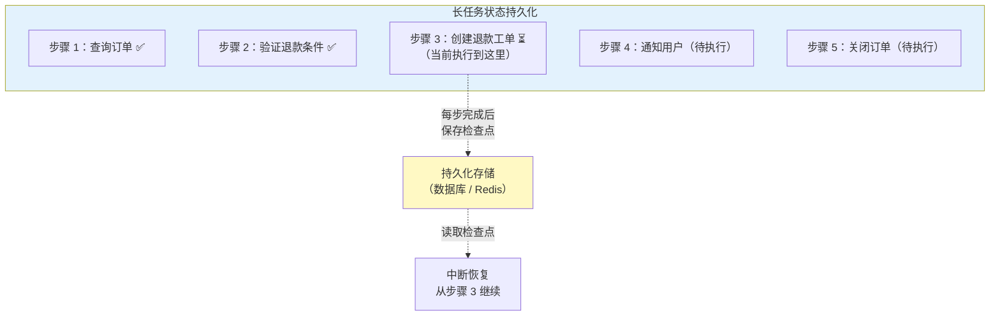

# 11-Agent 状态管理

> **定位**：讲透 Agent 为什么需要状态管理、Agent 状态机的概念、会话生命周期与上下文管理、Spring AI 中基于 ChatMemory + Advisor + 会话 ID 的完整状态管理实现。读完这篇，你能设计出健壮的多轮 Agent 会话系统。
>
> **读者画像**：已经掌握记忆系统和工具调用，需要理解 Agent 运行时状态流转的开发者。
>
> **前置阅读**：[04-记忆与会话管理](04-记忆与会话管理.md)。

---

## 1. 为什么 Agent 需要状态管理

一个没有状态管理的 Agent，就像一个失忆的服务员——每上一道菜都忘了之前上过什么。但 Agent 的状态远不止"记忆"这么简单。

### 1.1 无状态 Agent 的问题

```mermaid
graph TB
    subgraph 无状态Agent["❌ 无状态 Agent"]
        U1["用户：帮我查一下 ORD-001"] --> A1["Agent：查询中..."]
        A1 --> R1["Agent：订单已发货"]
        U2["用户：那帮我退款"] --> A2["Agent：请问哪个订单？"]
        Note1["Agent 不知道"退款"<br/>指的是 ORD-001"]
    end

    subgraph 有状态Agent["✅ 有状态 Agent"]
        U3["用户：帮我查一下 ORD-001"] --> S1["状态：等待用户指令"]
        S1 --> A3["Agent：查询中..."]
        A3 --> S2["状态：已知订单 ORD-001<br/>上下文：已发货"]
        U4["用户：那帮我退款"] --> S2
        S2 --> A4["Agent：为 ORD-001 发起退款流程"]
        Note2["Agent 知道"退款"<br/>指的是 ORD-001"]
    end

    style 无状态Agent fill:#ffcdd2
    style 有状态Agent fill:#c8e6c9
```

### 1.2 Agent 状态的三个层次

Agent 的状态不仅仅是"对话历史"。完整的 Agent 状态包含三个层次：



| 状态层次 | 内容 | 生命周期 | Spring AI 实现 |
|---------|------|---------|---------------|
| **会话状态** | 会话 ID、用户 ID、租户 ID | 从会话开始到结束 | `CONVERSATION_ID` 参数 |
| **对话状态** | 消息历史、工具调用记录 | 滑动窗口内的消息 | `ChatMemory` |
| **任务状态** | 当前步骤、中间变量、待办 | 单次任务执行期间 | Advisor 上下文 / 外部存储 |

---

## 2. Agent 状态机

Agent 的运行本质上是一个状态机。每次用户输入会触发状态迁移，Agent 根据当前状态决定如何响应。

### 2.1 核心状态定义



### 2.2 每个状态的详细职责

| 状态 | 职责 | 触发条件 | 退出条件 |
|------|------|---------|---------|
| **空闲** | 等待用户输入 | 会话初始化 / 回复完成 | 用户发送消息 |
| **思考** | LLM 推理，决定下一步行动 | 用户输入 / 工具结果返回 | LLM 返回回复或工具调用 |
| **执行工具** | 执行 LLM 决定调用的工具方法 | LLM 返回工具调用请求 | 工具执行完成或失败 |
| **等待结果** | 等待异步工具执行完成 | 工具需要异步处理 | 工具返回结果 |
| **回复** | 生成最终回复并发送给用户 | LLM 返回文本回复 | 回复发送完成 |

### 2.3 状态转换中的数据流



---

## 3. 会话生命周期

一个完整的会话从创建到销毁，经历多个阶段。理解生命周期是设计状态管理的基础。

### 3.1 会话生命周期全貌



### 3.2 会话创建

```java
import org.springframework.ai.chat.memory.ChatMemory;
import org.springframework.ai.chat.memory.MessageWindowChatMemory;
import org.springframework.ai.chat.client.advisor.MessageChatMemoryAdvisor;

@RestController
public class SessionController {

    private final ChatClient chatClient;
    private final ChatMemory chatMemory;
    private final UserProfileService profileService;

    // Spring AI 2.0.0 — 会话初始化
    @PostMapping("/session/create")
    public SessionInfo createSession(@RequestBody CreateSessionRequest request) {
        String conversationId = UUID.randomUUID().toString();

        // 加载用户 Profile 作为长期记忆
        UserProfile profile = profileService.getProfile(request.userId());

        // 将关键信息注入 System Message
        String systemPrompt = """
                你是企业客服助手。当前用户信息：
                - 姓名：%s
                - 等级：%s
                - 偏好：%s
                """.formatted(
                profile.name(),
                profile.level(),
                profile.preferences()
        );

        // 初始化会话的 System Message
        chatMemory.add(conversationId, new SystemMessage(systemPrompt));

        return new SessionInfo(conversationId, "会话已创建");
    }
}
```

### 3.3 会话恢复

用户可能离开后回来，需要恢复之前的会话上下文：

```java
// Spring AI 2.0.0 — 会话恢复
@PostMapping("/session/{conversationId}/resume")
public String resumeSession(
        @PathVariable String conversationId,
        @RequestBody String userMessage
) {
    return chatClient.prompt()
            .user(userMessage)
            .advisors(a -> a.param(ChatMemory.CONVERSATION_ID, conversationId))
            .call()
            .content();
    // MessageChatMemoryAdvisor 自动从存储中加载历史消息
}
```

### 3.4 会话过期与清理

```java
// Spring AI 2.0.0 — 会话过期处理
@Scheduled(fixedRate = 300_000) // 每 5 分钟检查一次
public void expireIdleSessions() {
    List<String> expiredSessions = sessionStore.findExpired(Duration.ofMinutes(30));
    
    for (String conversationId : expiredSessions) {
        // 1. 将关键信息提取到长期记忆
        List<Message> history = chatMemory.get(conversationId);
        memoryExtractionService.extractAndStore(conversationId, history);
        
        // 2. 归档完整对话历史
        sessionArchiveService.archive(conversationId, history);
        
        // 3. 清理内存中的会话数据
        chatMemory.clear(conversationId);
        
        // 4. 标记会话状态为已归档
        sessionStore.updateStatus(conversationId, SessionStatus.ARCHIVED);
    }
}
```

---

## 4. 上下文管理

Agent 的上下文（Context）是每次 LLM 调用时实际发送的全部信息。上下文管理决定了 Agent 的推理质量和 Token 成本。

### 4.1 上下文的组成



### 4.2 Token 预算分配

模型的上下文窗口是有限的（DeepSeek 通常 64K-128K Token）。必须合理分配 Token 预算：

```java
import org.springframework.ai.chat.client.advisor.TokenBudgetAdvisor;

// Spring AI 2.0.0 — Token 预算分配
@Bean
ChatClient chatClient(ChatClient.Builder builder, ChatMemory chatMemory) {
    return builder
            .defaultAdvisors(
                    // 记忆 Advisor：管理历史消息
                    MessageChatMemoryAdvisor.builder(chatMemory)
                            .build(),
                    // Token 预算 Advisor：自动控制上下文长度
                    TokenBudgetAdvisor.builder()
                            .tokenBudget(4096)  // 限制历史消息最多 4096 Token
                            .build()
            )
            .build();
}
```

### 4.3 上下文压缩策略

当对话过长时，直接丢弃旧消息会丢失重要信息。更智能的策略是**压缩摘要**：



```java
// Spring AI 2.0.0 — 上下文压缩 Advisor
@Component
public class ContextCompressionAdvisor implements BaseAdvisor {

    private static final int COMPRESS_THRESHOLD = 15;

    @Override
    public AdvisedRequest before(AdvisedRequest request) {
        List<Message> messages = request.messages();
        
        if (messages.size() > COMPRESS_THRESHOLD) {
            // 取出最早的消息进行摘要
            List<Message> toCompress = messages.subList(0, COMPRESS_THRESHOLD - 5);
            List<Message> toKeep = messages.subList(COMPRESS_THRESHOLD - 5, messages.size());
            
            // 用 LLM 生成摘要
            String summary = summarizeMessages(toCompress);
            
            // 用摘要替换原始消息
            List<Message> compressed = new ArrayList<>();
            compressed.add(new SystemMessage("之前的对话摘要：" + summary));
            compressed.addAll(toKeep);
            
            return request.mutate().messages(compressed).build();
        }
        
        return request;
    }

    private String summarizeMessages(List<Message> messages) {
        // 调用 LLM 对历史消息进行摘要
        return chatClient.prompt()
                .system("将以下对话压缩为简洁摘要，保留关键信息")
                .user(messages.stream().map(Message::getText).collect(Collectors.joining("\n")))
                .call()
                .content();
    }
}
```

---

## 5. Spring AI 中的状态管理实现

Spring AI 2.0 没有提供显式的"状态机"抽象，但通过 `ChatMemory` + `Advisor` + `CONVERSATION_ID` 三者的组合，构成了完整的状态管理体系。

### 5.1 状态管理的三要素



### 5.2 完整的状态管理实现

```java
import org.springframework.ai.chat.client.ChatClient;
import org.springframework.ai.chat.client.advisor.MessageChatMemoryAdvisor;
import org.springframework.ai.chat.memory.ChatMemory;
import org.springframework.ai.chat.memory.MessageWindowChatMemory;
import org.springframework.ai.chat.memory.repository.jdbc.JdbcChatMemoryRepository;
import org.springframework.context.annotation.Bean;
import org.springframework.context.annotation.Configuration;

@Configuration
public class AgentStateConfig {

    // Spring AI 2.0.0 — 完整的 Agent 状态管理配置
    @Bean
    ChatMemory chatMemory(JdbcChatMemoryRepository repository) {
        return MessageWindowChatMemory.builder()
                .chatMemoryRepository(repository)
                .maxMessages(20)  // 短期记忆：最近 20 条消息
                .build();
    }

    @Bean
    ChatClient agentClient(
            ChatClient.Builder builder,
            ChatMemory chatMemory
    ) {
        return builder
                .defaultSystem("你是企业级智能客服助手，回答专业、简洁、准确。")
                .defaultAdvisors(
                        // Memory Advisor：自动管理对话历史
                        MessageChatMemoryAdvisor.builder(chatMemory).build()
                )
                .build();
    }
}
```

### 5.3 多用户并发状态隔离

在 Web 应用中，多个用户同时与 Agent 对话。状态隔离的关键是 `CONVERSATION_ID`。

```java
@RestController
public class AgentController {

    private final ChatClient chatClient;

    public AgentController(ChatClient chatClient) {
        this.chatClient = chatClient;
    }

    // Spring AI 2.0.0 — 多用户并发，每个用户独立会话状态
    @PostMapping("/agent/chat")
    public Flux<String> chat(
            @RequestHeader("X-User-Id") String userId,
            @RequestParam String message
    ) {
        // 用 userId 作为 conversationId，确保每个用户的会话独立
        String conversationId = "user-" + userId;

        return chatClient.prompt()
                .user(message)
                .advisors(a -> a.param(ChatMemory.CONVERSATION_ID, conversationId))
                .stream()
                .content();
    }

    // Spring AI 2.0.0 — 同一用户多个独立会话
    @PostMapping("/agent/chat/{sessionId}")
    public Flux<String> chatWithSession(
            @RequestHeader("X-User-Id") String userId,
            @PathVariable String sessionId,
            @RequestParam String message
    ) {
        // userId + sessionId 组合，支持同一用户的多会话
        String conversationId = "user-" + userId + "-session-" + sessionId;

        return chatClient.prompt()
                .user(message)
                .advisors(a -> a.param(ChatMemory.CONVERSATION_ID, conversationId))
                .stream()
                .content();
    }
}
```



### 5.4 Advisor 上下文传递

Agent 在执行过程中可能需要在 Advisor 之间传递中间状态。Spring AI 使用 `Advisor` 的上下文 Map 来实现：

```java
import org.springframework.ai.chat.client.advisor.api.AdvisedRequest;
import org.springframework.ai.chat.client.advisor.api.BaseAdvisor;

// Spring AI 2.0.0 — 自定义 Advisor 用于状态传递
@Component
public class TaskStateAdvisor implements BaseAdvisor {

    public static final String CURRENT_TASK = "currentTask";
    public static final String TASK_STEP = "taskStep";
    public static final String TOOL_RESULTS = "toolResults";

    @Override
    public AdvisedRequest before(AdvisedRequest request) {
        // 前置处理：从上下文中读取任务状态
        String task = request.context().get(CURRENT_TASK);
        Integer step = request.context().get(TASK_STEP);

        // 将任务状态注入 Prompt
        if (task != null) {
            return request.mutate()
                    .system("当前任务：" + task + "，执行步骤：" + (step != null ? step : 0))
                    .build();
        }

        return request;
    }

    @Override
    public AdvisedResponse after(AdvisedResponse response) {
        // 后置处理：更新任务状态
        AdvisedResponse.AdvisedResponseBuilder builder = response.mutate();

        // 记录工具调用结果到上下文
        if (response.response().hasToolCalls()) {
            builder.contextValue(TOOL_RESULTS, response.response().getToolCalls());
        }

        return builder.build();
    }
}
```

---

## 6. 长任务的状态持久化

Agent 可能执行长时间运行的任务（多步骤、需要等待外部事件）。任务状态需要持久化到外部存储，支持中断恢复。



```java
// Spring AI 2.0.0 — 长任务状态持久化
@Service
public class LongRunningTaskService {

    private final ChatClient chatClient;
    private final TaskCheckpointRepository checkpointRepo;

    public LongRunningTaskService(ChatClient chatClient, 
                                   TaskCheckpointRepository checkpointRepo) {
        this.chatClient = chatClient;
        this.checkpointRepo = checkpointRepo;
    }

    public String executeTask(String conversationId, String taskDescription) {
        // 检查是否有未完成的检查点
        TaskCheckpoint checkpoint = checkpointRepo.findByConversationId(conversationId);

        int startStep = (checkpoint != null) ? checkpoint.getLastCompletedStep() : 0;

        // Agent 执行任务
        String result = chatClient.prompt()
                .system("你是一个任务执行 Agent。当前任务：" + taskDescription 
                        + "，从步骤 " + (startStep + 1) + " 开始。")
                .user("执行任务")
                .advisors(a -> a
                        .param(ChatMemory.CONVERSATION_ID, conversationId)
                        .param("startStep", startStep))
                .call()
                .content();

        // 保存检查点
        checkpointRepo.save(new TaskCheckpoint(conversationId, taskDescription, startStep + 1));

        return result;
    }
}
```

> **遇到阻塞？→ [教程 35-长任务持久化与中断恢复]**：长任务的完整持久化方案——检查点机制、故障恢复、幂等设计。

---

## 7. 适用场景与不适用场景

### 适用场景

- 多轮对话场景（客服、咨询、辅导），需要保持上下文连贯
- 多步骤任务执行（需要跟踪当前执行到哪一步）
- 多用户并发（需要会话隔离，互不干扰）
- 长时间运行的 Agent（需要状态持久化，支持中断恢复）
- 个性化服务（根据用户 Profile 定制 Agent 行为）

### 不适用场景

- 一次性问答（无状态的 API 调用，不需要历史上下文）
- 简单的文本生成（如翻译、摘要，不涉及状态）
- 对上下文窗口极度敏感的场景（历史消息会消耗 Token，可能不适合）
- 严格无状态的微服务架构（每个请求必须完全独立）

---

## 8. 本章总结

| 概念 | 一句话 |
|------|--------|
| **Agent 状态** | 三个层次：会话状态、对话状态、任务状态 |
| **状态机** | 空闲 → 思考 → 执行工具 → 等待结果 → 回复 → 空闲 |
| **会话生命周期** | 创建 → 活跃 → 挂起/过期 → 结束 → 归档 |
| **CONVERSATION_ID** | 会话唯一标识，驱动状态隔离，每个请求必填 |
| **ChatMemory** | 对话状态的存储抽象，支持内存/JDBC/Redis 持久化 |
| **Advisor** | 状态流转的拦截器，前置注入上下文，后置更新状态 |
| **上下文管理** | Token 预算分配 + 上下文压缩，平衡推理质量与成本 |
| **长任务持久化** | 检查点机制，每步完成后保存状态，支持中断恢复 |

---

> **想深入？→ [教程 04-记忆与会话管理]**：ChatMemory API 的完整使用细节和持久化方案。
> **遇到阻塞？→ [教程 35-长任务持久化与中断恢复]**：检查点恢复、幂等设计、故障转移的完整方案。
> **想深入？→ [教程 13-Advisor链与拦截器.md]**：Advisor 链的执行机制和自定义 Advisor 的完整实现。
