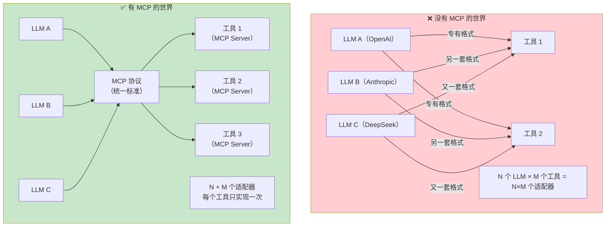
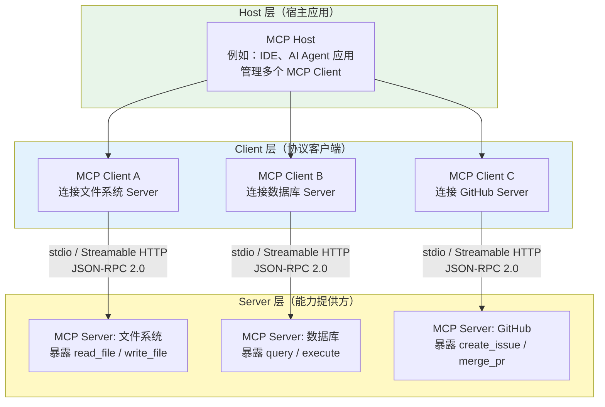
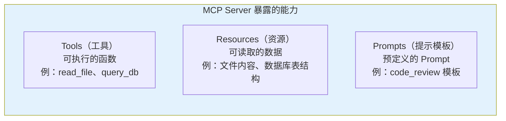
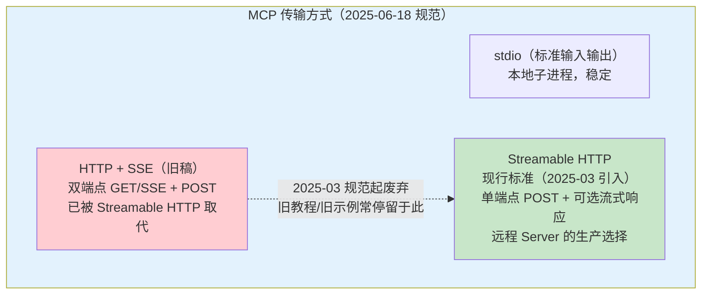
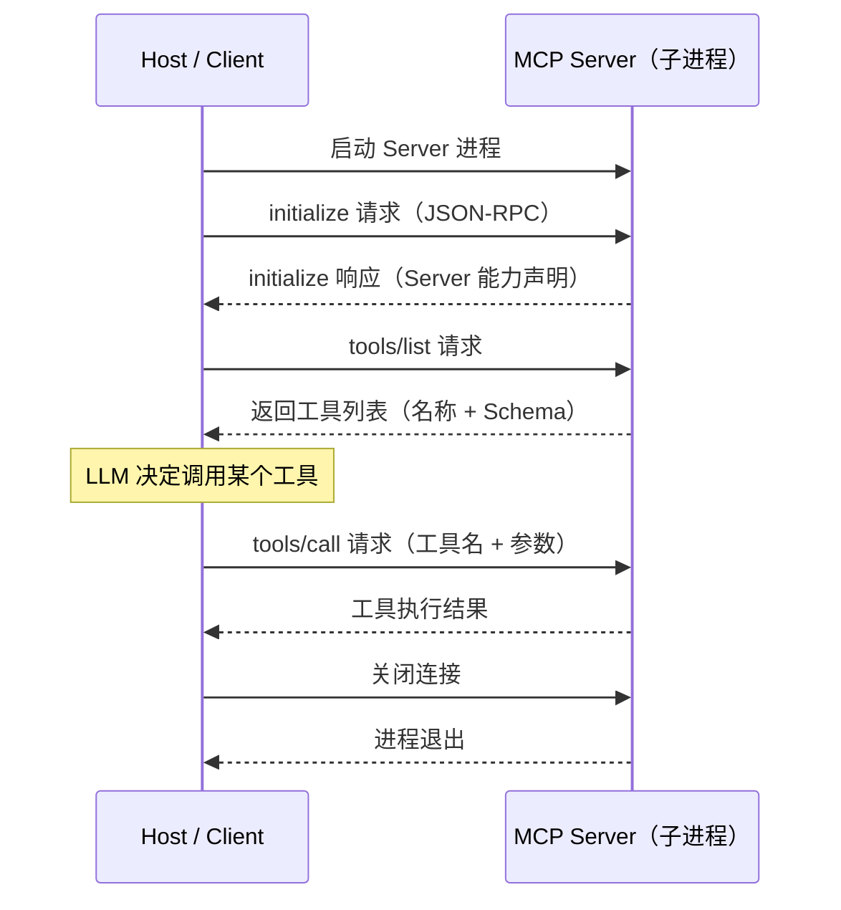
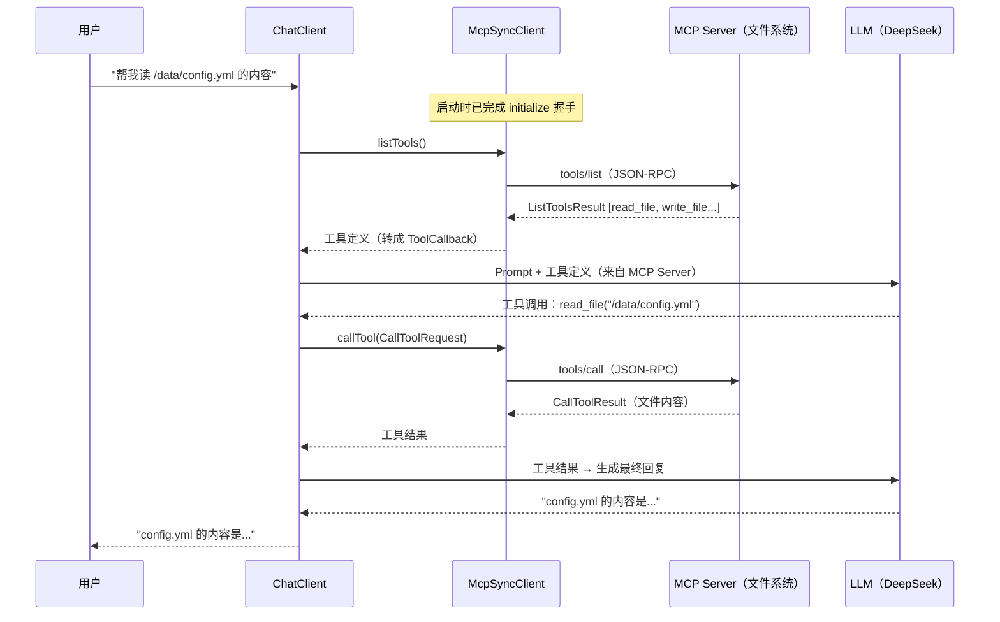
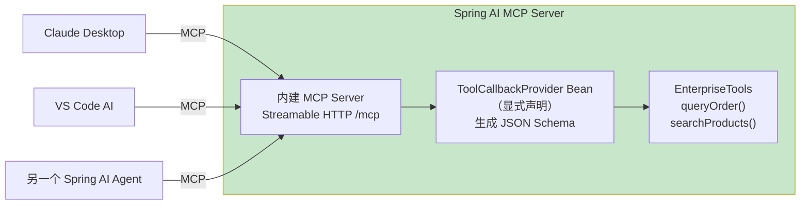
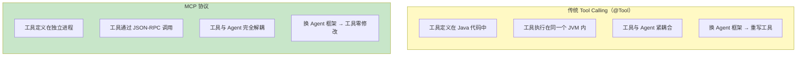
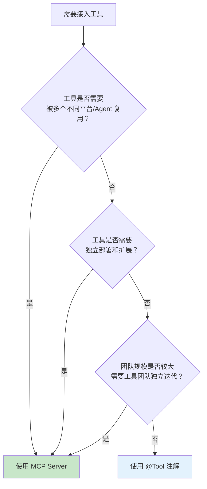
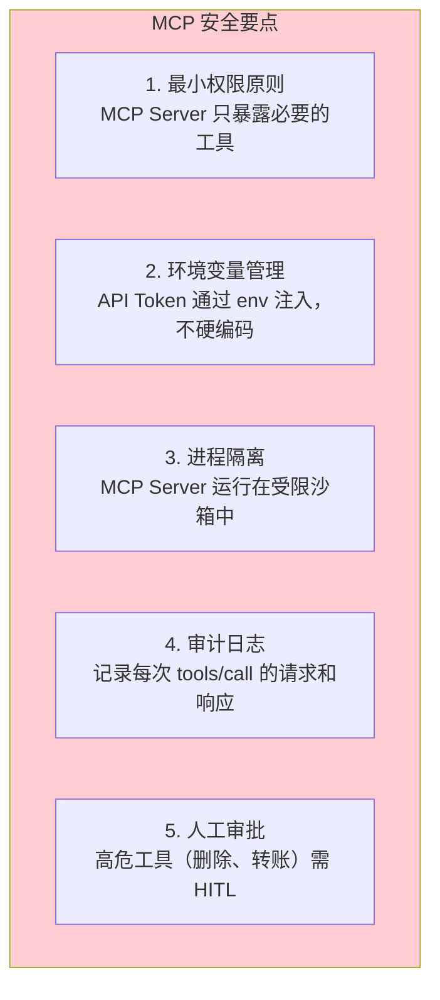

# 11-MCP 协议

> **定位**：讲透 Model Context Protocol（MCP）——它是什么、为什么出现、架构如何设计、2025-06 规范的传输与会话授权更新（Streamable HTTP / Mcp-Session-Id / OAuth 2.1）、Spring AI 2.0 如何支持 MCP 客户端和服务端（真实坐标与真实类型）、MCP 与传统 Tool Calling 的本质区别、协议工程细节与安全落地。读完这篇，你能用 MCP 协议构建标准化的工具生态。
>
> **读者画像**：已经掌握 Tool Calling，需要理解或构建跨平台工具协议的开发者。
>
> **前置阅读**：[03-工具调用](03-工具调用.md)。
>
> **API 真实性基准**：本文所有客户端/服务端代码与 [附录 05-SpringAI2-API基准/01-MCP真实API与坐标] 对齐——MCP 客户端类型是 MCP SDK 的 `McpSyncClient`（包 `io.modelcontextprotocol.client`，MCP SDK 2.0，javap 实证；**不存在** `io.modelcontextprotocol.sdk.client` 这一层包），**不存在** `org.springframework.ai.mcp.McpClient` 这个类；`@Tool` 暴露为 MCP 工具**必须显式声明 `ToolCallbackProvider` Bean**，没有自动注册。

---

## 1. MCP 是什么

Model Context Protocol（MCP）是 Anthropic 于 2024 年 11 月开源的一项**标准化协议**，核心目标是解决一个日益严重的问题：每个 LLM 平台都有自己的工具接入方式，每个工具有自己的 API 格式，开发者被迫为不同平台写不同的适配代码。

一句话概括 MCP 的价值：**像 USB-C 统一了接口一样，MCP 统一了 LLM 与外部工具/数据源的连接方式**。



### 1.1 MCP 解决的核心痛点

| 痛点 | 没有 MCP | 有 MCP |
|------|---------|--------|
| **工具复用** | 为 GPT 写的 Function Calling 代码，换到 Claude 要重写 | 写一个 MCP Server，所有支持 MCP 的 LLM 都能用 |
| **工具发现** | 每次都要手动注册工具定义 | MCP Server 自描述能力，客户端自动发现可用工具 |
| **生态隔离** | OpenAI Plugins、Anthropic Tools、Gemini Functions 各搞各的 | 统一协议，工具生态跨平台共享 |
| **安全边界** | 工具直接嵌入 LLM 进程，安全边界模糊 | MCP Server 是独立进程，天然进程级隔离 |

### 1.2 MCP 不是什么

MCP **不是**一个 LLM 调用框架——它不关心你用哪个模型、怎么管理 Prompt、怎么处理流式输出。MCP 只关心一件事：**LLM 客户端如何以标准化的方式发现和调用外部能力**。

MCP 也不替代 Spring AI 的 `@Tool` 注解——`@Tool` 是进程内的工具调用，MCP 是跨进程的工具协议。两者是互补关系，不是替代关系。

---

## 2. MCP 架构：Host / Client / Server

MCP 协议定义了三个核心角色，构成一个清晰的分层架构。



### 2.1 三个角色的职责

| 角色 | 职责 | 类比 |
|------|------|------|
| **Host** | 宿主应用，持有 LLM，管理 Client 生命周期，决定何时调用工具 | 操作系统 |
| **Client** | 协议客户端，与单个 Server 保持 1:1 连接，负责请求/响应的序列化 | 设备驱动 |
| **Server** | 能力提供方，独立进程，暴露 Tools / Resources / Prompts | USB 设备 |

**关键设计原则**：每个 Client 只连接一个 Server（1:1 关系）。Host 可以管理多个 Client，从而同时连接多个 Server。

### 2.2 MCP Server 暴露的三种能力



- **Tools**：有副作用的操作（写入文件、发送请求、修改数据库）。LLM 决定何时调用。
- **Resources**：只读数据源（文件内容、API 文档、数据库 Schema）。Host 决定何时提供给 LLM。
- **Prompts**：预定义的 Prompt 模板，用户可以通过 `/` 命令触发。

### 2.3 通信协议

MCP 使用 **JSON-RPC 2.0** 作为消息格式，传输方式随规范版本演进：



**stdio 模式**的交互流程：



### 2.4 2025-06 规范三件套：Streamable HTTP、会话管理、OAuth 2.1

MCP 规范在 2025 年经历了两次大版本修订（[2025-03-26](https://modelcontextprotocol.io/specification/2025-03-26) → [2025-06-18](https://modelcontextprotocol.io/specification/2025-06-18)，变更记录见 [规范 changelog](https://modelcontextprotocol.io/specification/2025-06-18/changelog)）。生产对接远程 MCP Server 必须知道三件事：

**① Streamable HTTP 传输（取代 HTTP+SSE）**（[规范 Transports](https://modelcontextprotocol.io/specification/2025-06-18/basic/transports)）。旧传输要两个端点（GET 建 SSE 通道 + POST 发消息），Streamable HTTP 收敛为**单一 `/mcp` 端点**：客户端 POST JSON-RPC 请求，服务端可返回普通 JSON 或升级为 SSE 流式响应（`Accept: application/json, text/event-stream`）；服务端还可以开放一个 GET 长连接用于主动推送。好处是部署穿透性更好（一个端点走完代理/网关/鉴权），无状态服务端实现也更容易。

**② Mcp-Session-Id 会话管理**（[规范 Lifecycle](https://modelcontextprotocol.io/specification/2025-06-18/basic/lifecycle)）。客户端 `initialize` 时服务端可返回 `Mcp-Session-Id` 响应头；此后**所有请求必须回带该头**，服务端据此定位会话状态。会话有显式生命周期：客户端发 `notifications/initialized` 完成握手，任一方可发 DELETE 请求终止会话；会话过期后服务端返回 HTTP 404，客户端应重新 `initialize`。Spring AI 的 MCP client starter 会自动管理这层会话，但你在网关/代理层排障时需要认识这个头。

**③ OAuth 2.1 授权**（[规范 Authorization](https://modelcontextprotocol.io/specification/2025-06-18/basic/authorization)）。规范定义了 MCP 客户端访问受保护 MCP Server 的标准授权流：基于 OAuth 2.1，要求 PKCE、明确授权服务器元数据发现（RFC 8414）、支持资源指示器（RFC 8707）把 access token 绑定到特定 MCP Server。Java 侧由 HTTP 客户端层集成（如 Spring 授权客户端拦截器），把令牌注入 MCP 请求头——企业内落地见 [项目 08-Agent供应链安全网关]。

---

## 3. Spring AI 2.0 的 MCP 客户端支持

Spring AI 2.0 提供了完整的 MCP 客户端实现，可以将外部 MCP Server 暴露的工具无缝接入 ChatClient 的工具调用链。

### 3.1 添加 MCP 客户端依赖

```xml
<!-- pom.xml -->
<!-- Spring AI 2.0.0 MCP 客户端 -->
<dependency>
    <groupId>org.springframework.ai</groupId>
    <artifactId>spring-ai-starter-mcp-client</artifactId>
</dependency>
```

> WebFlux 应用走 Streamable HTTP 传输时，需另加 `mcp-spring-webflux`（提供 `WebClientStreamableHttpTransport`，坐标 `org.springframework.ai:mcp-spring-webflux`，版本走 `spring-ai-bom`）；否则 autoconfigure 找不到 WebFlux 传输实现。

### 3.2 配置 MCP Server 连接

```yaml
# application.yml
spring:
  ai:
    mcp:
      client:
        stdio:
          servers-configuration: classpath:mcp-servers.json
```

`src/main/resources/mcp-servers.json`（MCP Server 配置文件）：

```json
{
  "mcpServers": {
    "filesystem": {
      "command": "npx",
      "args": ["-y", "@modelcontextprotocol/server-filesystem", "/data"]
    },
    "github": {
      "command": "npx",
      "args": ["-y", "@modelcontextprotocol/server-github"],
      "env": {
        "GITHUB_TOKEN": "${GITHUB_TOKEN}"
      }
    }
  }
}
```

> ⚠️ **供应链安全警示（这段配置本身就是风险示范）**：`npx -y` 的语义是"**不问、直接拉取并执行**远程 npm 包"。MCP Server 一旦被投毒（包名抢注、版本劫持、维护者账号被盗），恶意代码就会以**你的应用进程权限**运行——读环境变量、外传数据、横向移动。生产环境的最低要求：①锁定版本（`npx -y pkg@1.2.3` 而非浮动 latest）；②私有镜像源 + 准入扫描；③Server 进程跑在容器/沙箱里做权限隔离；④高危 Server 走审批接入。展开见 §8.2 与 [附录 09-Agent安全深度/01-ToolPoisoning攻击]。

远程 MCP Server（现行传输）改用 Streamable HTTP 连接，无需本地进程：

```yaml
# application.yml — Streamable HTTP 连接远程 Server（2025-06 规范现行传输）
# 配置前缀为 spring.ai.mcp.client.streamable-http，下挂 connections 映射（javap 实证）
spring:
  ai:
    mcp:
      client:
        streamable-http:
          connections:
            tools-internal:                 # 连接名（也用于工具名命名空间，见 §7.4）
              url: https://tools.internal/mcp
```

### 3.3 将 MCP 工具接入 ChatClient

**先立铁律**：自动配置注入的是 **MCP SDK 的 `McpSyncClient`**（包 `io.modelcontextprotocol.client`，MCP SDK 2.0，随 starter 传递引入）——不是 `org.springframework.ai.mcp.McpClient`（这个类不存在）。多 Server 场景注入 `List<McpSyncClient>`；更推荐直接注入框架组装好的 `ToolCallbackProvider`（自动聚合全部已连接 Server 的工具）：

```java
import org.springframework.ai.chat.client.ChatClient;
import org.springframework.ai.tool.ToolCallbackProvider;

@RestController
public class McpAgentController {

    private final ChatClient chatClient;

    // Spring AI 2.0.0 — 注入 starter 自动组装的 ToolCallbackProvider
    //（底层是若干 McpSyncClient，每个 Client 与一个 Server 保持 1:1 连接）
    public McpAgentController(
            ChatClient.Builder builder,
            ToolCallbackProvider mcpToolProvider) {
        this.chatClient = builder
                // ToolCallbackProvider 有专门入口，不要塞进 defaultTools(...)
                .defaultToolCallbacks(mcpToolProvider)
                .build();
    }

    @GetMapping("/agent")
    public String agent(@RequestParam String question) {
        return chatClient.prompt()
                .user(question)
                .call()
                .content();
    }
}
```

需要手工控制（如按条件挑选 Server）时，用 SDK 客户端直接聚合——注意 `SyncMcpToolCallbackProvider` 的真实构造接收的是 **List**：

```java
import io.modelcontextprotocol.client.McpSyncClient;   // MCP SDK 2.0 包名（javap 实证）
import org.springframework.ai.mcp.SyncMcpToolCallbackProvider;
import org.springframework.ai.tool.ToolCallbackProvider;

// Spring AI 2.0.0 — 多个 McpSyncClient 聚合为一个 Provider
@Bean
public ToolCallbackProvider tools(List<McpSyncClient> clients) {
    return new SyncMcpToolCallbackProvider(clients);
}
```

这段代码背后的工作流程：



### 3.4 连接远程 MCP Server（Streamable HTTP）

远程 Server 场景**优先走 §3.2 的配置方式**（starter 自动建立 Streamable HTTP 连接、管理 Mcp-Session-Id 与重连），尽量少手写传输类——SDK 传输类的类名随版本演进，手写代码的维护成本高于配置。确需编程式定制（如自定义鉴权拦截器）时的形态：

```java
// 概念代码，真实 API 见附录 05-SpringAI2-API基准/01-MCP真实API与坐标 ——
// 工厂是 io.modelcontextprotocol.client.McpClient（SDK 2.0 包名，javap 实证）；
// transport 类型为 io.modelcontextprotocol.spec.McpClientTransport（WebFlux 栈用
// org.springframework.ai.mcp.client.webflux.transport.WebClientStreamableHttpTransport）；
// 传输类名与构造签名以所引版本 SDK 为准；配置驱动优先，手写为兜底
McpSyncClient client = McpClient.sync(transport)     // transport = Streamable HTTP 传输实现
        .requestTimeout(Duration.ofSeconds(30))
        .build();
client.initialize();
```

### 3.5 兑现承诺：消费 MCP 的 Resources 与 Prompts

§2.2 介绍了 Server 的三种能力，但到目前为止我们只消费了 Tools。**Spring AI 目前把 Tools 作为一等公民接入 ChatClient；Resources 与 Prompts 需要通过 `McpSyncClient` 的 SDK 方法手动消费**（规范参考：[Resources](https://modelcontextprotocol.io/specification/2025-06-18/server/resources)、[Prompts](https://modelcontextprotocol.io/specification/2025-06-18/server/prompts)），再自行拼装进 Prompt：

```java
// Spring AI 2.0.0 — 手动消费 Resources / Prompts（SDK 直连，未走 ToolCallbackProvider）
import io.modelcontextprotocol.client.McpSyncClient;   // MCP SDK 2.0 包名（javap 实证）
import io.modelcontextprotocol.spec.McpSchema;

@Component
public class McpResourceConsumer {

    private final McpSyncClient mcpClient;           // 注入单个已连接的 Client
    private final ChatClient.Builder chatClientBuilder;

    /** Resources：拉取 Server 暴露的只读数据（如数据库 Schema、API 文档）注入上下文 */
    public String answerWithDataDoc(String question) {
        McpSchema.ListResourcesResult resources = mcpClient.listResources();   // SDK 2.0：结果类型是 McpSchema 嵌套 record
        McpSchema.ReadResourceResult doc = mcpClient.readResource(
                new McpSchema.ReadResourceRequest(resources.resources().get(0).uri()));

        // ResourceContents 是接口（只有 uri()/mimeType()），取文本需转型 TextResourceContents
        String docText = doc.contents().stream()
                .filter(c -> c instanceof McpSchema.TextResourceContents)
                .map(c -> ((McpSchema.TextResourceContents) c).text())
                .collect(Collectors.joining("\n"));

        return chatClientBuilder.build().prompt()
                .system("基于以下资源内容回答问题。\n<resource>\n" + docText + "\n</resource>")
                .user(question)
                .call()
                .content();
    }

    /** Prompts：获取 Server 预定义的 Prompt 模板并按参数实例化 */
    public String runCodeReviewPrompt(String code) {
        McpSchema.GetPromptResult template = mcpClient.getPrompt(
                new McpSchema.GetPromptRequest("code_review", Map.of("code", code)));
        String promptText = template.messages().stream()
                .map(m -> m.content().toString())
                .collect(Collectors.joining("\n"));
        return chatClientBuilder.build().prompt()
                .user(promptText)
                .call()
                .content();
    }
}
```

两种能力的定位差异决定了用法差异：**Resources 由 Host 决定何时注入**（应用代码主动拉取，适合 RAG 式上下文供给），**Prompts 由用户/应用显式触发**（`/code_review` 这类命令入口），而 **Tools 由 LLM 决定何时调用**——三者别混用。

### 3.6 协议高级能力速览：Sampling / Roots / Elicitation

规范还定义了三个"反向能力"——由 Server 发起、请求 Client（Host）配合，企业级管控的关键开关（[项目 08-Agent供应链安全网关] 的管控对象）：

| 能力 | 方向 | 一句话 | 管控要点 |
|------|------|--------|---------|
| **[Sampling](https://modelcontextprotocol.io/specification/2025-06-18/client/sampling)** | Server → Client | Server 请求 Host 替它跑一次 LLM 补全（如批量摘要工具内部想用模型） | 默认拒绝；放行也要限模型白名单、限 Token 预算——否则第三方 Server 借你的 API Key 刷量 |
| **[Roots](https://modelcontextprotocol.io/specification/2025-06-18/client/roots)** | Client → Server | Host 把部分文件系统根（工作目录）暴露给 Server | 明确最小范围；Server 越界访问要审计 |
| **[Elicitation](https://modelcontextprotocol.io/specification/2025-06-18/client/elicitation)** | Server → Client | Server 向用户请求补充输入（表单式交互） | 界定"Server 只能问、不能拿"——禁止借表单诱导用户交出凭据 |

这三个能力默认不在 Spring AI 的自动装配里启用，需要按版本在 Client 配置中显式开启——没有配置就等于没承诺，Server 的相关请求会被拒绝，这是安全的默认值。

---

## 4. Spring AI 2.0 的 MCP 服务端支持

Spring AI 2.0 不仅支持 MCP 客户端（消费工具），还支持 MCP 服务端（提供工具）。这意味着你可以把自己的业务能力暴露为 MCP Server，供任何支持 MCP 的 LLM 客户端使用。

### 4.1 添加 MCP 服务端依赖

```xml
<!-- pom.xml -->
<!-- Spring AI 2.0.0 MCP 服务端 -->
<dependency>
    <groupId>org.springframework.ai</groupId>
    <artifactId>spring-ai-starter-mcp-server</artifactId>
</dependency>
```

### 4.2 配置 MCP Server

```yaml
# application.yml
spring:
  ai:
    mcp:
      server:
        name: "my-enterprise-tools"
        version: "1.0.0"
        type: SYNC              # SYNC（Servlet 栈）/ ASYNC（WebFlux 栈）二选一，见下方说明
```

> **`type` 与技术栈必须匹配**：`SYNC` 用阻塞式实现（配 `spring-ai-starter-mcp-server`，跑在 Servlet 容器上）；**WebFlux 应用必须用 `ASYNC`**（配 `spring-ai-starter-mcp-server-webflux`）——SYNC 的阻塞实现在 EventLoop 上执行会把响应式事件循环卡死（WebFlux 铁律见 [附录 06-WebFlux与响应式编程/04-WebFlux-vs-MVC]）。本项目技术栈是 WebFlux，服务端也应选 ASYNC。另外注意 2025-06 规范后远程端点统一走 Streamable HTTP 的单一 `/mcp` 端点（旧配置里的 `sse-message-endpoint` 双端点写法属于 HTTP+SSE 时代）。

### 4.3 定义 MCP 工具：@Tool + 显式 ToolCallbackProvider

**审计教训（API 铁律）**：`@Component` + `@Tool` **不会**自动注册到 MCP Server——必须**显式声明 `ToolCallbackProvider` Bean**，把工具对象喂进去。缺了这一步，你的 MCP Server 能连上、能握手，但 `tools/list` 永远是空的：

```java
import org.springframework.ai.tool.annotation.Tool;
import org.springframework.ai.tool.annotation.ToolParam;
import org.springframework.ai.tool.ToolCallbackProvider;
import org.springframework.ai.tool.method.MethodToolCallbackProvider;
import org.springframework.context.annotation.Bean;
import org.springframework.context.annotation.Configuration;
import org.springframework.stereotype.Component;

@Component
public class EnterpriseTools {

    private final OrderService orderService;
    private final ProductService productService;

    public EnterpriseTools(OrderService orderService, ProductService productService) {
        this.orderService = orderService;
        this.productService = productService;
    }

    // @Tool 方法生成 JSON Schema 并暴露为 MCP 工具
    @Tool(description = "根据订单号查询订单详情，包括金额、状态和物流")
    public OrderDetail queryOrder(
            @ToolParam(description = "订单号，格式 ORD-XXXXXX") String orderId
    ) {
        return orderService.queryDetail(orderId);
    }

    @Tool(description = "根据关键词搜索产品，返回价格、库存和规格信息")
    public List<Product> searchProducts(
            @ToolParam(description = "搜索关键词") String keyword
    ) {
        return productService.search(keyword);
    }
}

@Configuration
public class McpServerConfig {

    // 显式声明 Provider——@Tool 不会自动注册，缺这个 Bean 工具列表为空
    @Bean
    public ToolCallbackProvider enterpriseToolProvider(EnterpriseTools tools) {
        return MethodToolCallbackProvider.builder()
                .toolObjects(tools)
                .build();
    }
}
```

声明后，Spring AI 为每个 `@Tool` 方法生成 JSON Schema、包装成工具规格，内建 MCP Server 把它们暴露出去——外部 MCP 客户端连接后通过 `tools/list` 自动发现，通过 `tools/call` 调用。



---

## 5. 自定义 MCP Server：完整示例

假设我们要构建一个企业内部的工单系统 MCP Server，让所有 AI Agent 都能通过 MCP 协议创建和查询工单。

### 5.1 项目结构

```
mcp-ticket-server/
├── pom.xml
├── src/main/java/com/example/mcp/
│   ├── McpServerApplication.java
│   ├── config/
│   │   └── McpServerConfig.java
│   └── tools/
│       └── TicketTools.java
└── src/main/resources/
    └── application.yml
```

### 5.2 核心实现

```java
// McpServerApplication.java
@SpringBootApplication
public class McpServerApplication {
    public static void main(String[] args) {
        SpringApplication.run(McpServerApplication.class, args);
    }
}
```

```java
// TicketTools.java
package com.example.mcp.tools;

import org.springframework.ai.tool.annotation.Tool;
import org.springframework.ai.tool.annotation.ToolParam;
import org.springframework.stereotype.Component;

@Component
public class TicketTools {

    private final TicketService ticketService;

    public TicketTools(TicketService ticketService) {
        this.ticketService = ticketService;
    }

    // @Tool 定义工具；能否暴露给外部客户端取决于 §4.3 式的 ToolCallbackProvider Bean
    @Tool(description = "创建售后工单，需要客户ID、问题描述和工单类型")
    public Ticket createTicket(
            @ToolParam(description = "客户 ID") String customerId,
            @ToolParam(description = "问题描述") String description,
            @ToolParam(description = "工单类型：退款、换货、维修、投诉") String type
    ) {
        return ticketService.create(customerId, description, type);
    }

    // Spring AI 2.0.0 — 查询工单状态
    @Tool(description = "根据工单号查询工单当前状态和处理进度")
    public TicketStatus queryTicket(
            @ToolParam(description = "工单号") String ticketId
    ) {
        return ticketService.queryStatus(ticketId);
    }

    // Spring AI 2.0.0 — 列出客户所有工单
    @Tool(description = "列出指定客户的所有工单")
    public List<Ticket> listTickets(
            @ToolParam(description = "客户 ID") String customerId
    ) {
        return ticketService.listByCustomer(customerId);
    }
}
```

```yaml
# application.yml
spring:
  ai:
    mcp:
      server:
        name: "enterprise-ticket-server"
        version: "1.0.0"
        type: ASYNC            # 本项目 WebFlux 栈 → ASYNC；Servlet 栈才用 SYNC
```

别忘了 §4.3 的最后一环——为 `TicketTools` 声明 `MethodToolCallbackProvider` Bean。三者齐备（starter 依赖 + 配置 + Provider Bean），这个 Spring Boot 应用就是一个完整的 MCP Server，任何 MCP 客户端都能连接它，通过 `tools/list` 自动发现 `createTicket`、`queryTicket`、`listTickets` 三个工具。

---

## 6. MCP 与传统 Tool Calling 的关系和区别

这是开发者最常困惑的问题。MCP 和 `@Tool` 不是二选一，而是解决不同层面的问题。

### 6.1 本质区别



### 6.2 详细对比

| 维度 | @Tool（进程内） | MCP（跨进程） |
|------|----------------|--------------|
| **部署方式** | 工具与 Agent 在同一 JVM | 工具在独立进程/远程服务器 |
| **调用方式** | Java 方法直接调用 | JSON-RPC 2.0 协议调用 |
| **性能** | 微秒级（进程内方法调用） | 毫秒级（IPC 或网络开销） |
| **复用性** | 只能被当前 Spring AI 应用使用 | 可被任何 MCP 兼容客户端使用 |
| **安全隔离** | 无进程隔离 | 进程级隔离，权限可控 |
| **开发成本** | 低（注解即可） | 中高（需独立项目 + 协议处理） |
| **适用规模** | 小型项目，工具数量少 | 大型生态，工具跨团队/跨平台共享 |

### 6.3 何时用 @Tool，何时用 MCP



### 6.4 混合使用：最佳实践

实际企业项目中，通常是**混合使用**：核心业务工具用 `@Tool`（性能敏感），通用能力用 MCP Server（生态共享）。

```java
@RestController
public class HybridAgentController {

    private final ChatClient chatClient;

    // Spring AI 2.0.0 — 混合使用 @Tool 和 MCP 工具
    public HybridAgentController(
            ChatClient.Builder builder,
            ToolCallbackProvider mcpToolProvider,   // starter 自动组装的 MCP 工具集
            OrderTools orderTools                   // 进程内 @Tool
    ) {
        this.chatClient = builder
                // 进程内工具：订单查询（低延迟，核心业务）
                .defaultTools(orderTools)
                // MCP 工具：文件系统、GitHub 等（生态共享，通用能力）
                .defaultToolCallbacks(mcpToolProvider)
                .build();
    }
}
```

从 LLM 的角度看，两种工具没有区别——都是工具列表中的一项。Spring AI 在底层透明地处理：进程内工具走 Java 方法调用，MCP 工具走 JSON-RPC。

---

## 7. 协议工程细节：超时、取消、进度与错误语义

把 MCP 从 demo 推向生产，绕不开四个协议层细节（规范出处：[Lifecycle](https://modelcontextprotocol.io/specification/2025-06-18/basic/lifecycle)、[Tools](https://modelcontextprotocol.io/specification/2025-06-18/server/tools)）。

### 7.1 tools/call 的超时、取消与进度

一次 `tools/call` 可能慢（数据库扫描、爬虫），协议给了三个控制手段：

- **超时**：协议本身**没有**为请求定义超时语义，超时是客户端实现行为——MCP Java SDK 在 Client 构建期配置 `requestTimeout`；超时后该请求的响应即使到达也会被丢弃（按 JSON-RPC id 匹配）。超时要按工具分级设置：查询类 10-30s，批处理类放宽，别一刀切。
- **取消**：客户端可发 `notifications/cancelled`（携带被取消请求的 id），服务端"尽力而为"中止——协议不保证执行中的副作用真的停，所以**工具实现要幂等/可补偿**（呼应 [教程 40-长任务持久化与中断恢复]）。
- **进度**：调用 `tools/call` 时在 `_meta.progressToken` 里带上进度令牌，长任务 Server 会在执行期间回推 `notifications/progress`（进度百分比/消息）——这正是 §教程 10 §4.5"工具执行中给前端发状态"的协议级通道。

### 7.2 错误的两副面孔：JSON-RPC error vs isError

MCP 把"错了"分成两层，处理策略完全不同：

| 层次 | 形态 | 语义 | 客户端该做什么 |
|------|------|------|---------------|
| **协议错误** | JSON-RPC `error` 响应（code/message/data） | 请求没被正确处理：方法不存在、参数不合法、会话失效、内部崩溃 | 不该把原文塞给 LLM——这是基础设施错误，走重试/告警/熔断 |
| **工具执行错误** | 正常响应，`CallToolResult.isError = true`，内容在 text/content 里 | **工具被正确调用了但业务失败**：订单不存在、余额不足、权限不够 | 恰恰应该把错误内容交给 LLM——让它理解失败原因并向用户解释或换路 |

最常见的反模式就是把"工具执行错误"当协议异常抛出并重试——LLM 明明一句"订单不存在"就能优雅收场，却变成了一次注定失败的重试风暴。规范原文见 [Tools §Error Handling](https://modelcontextprotocol.io/specification/2025-06-18/server/tools#error-handling)。

### 7.3 多 Server 工具名冲突与命名空间

接三个 Server，两个都有 `search` 工具，LLM 的工具列表就撞名了。MCP 协议本身不做全局命名管控，冲突消解在客户端装配层：Spring AI 的 MCP 工具桥接会按**连接名给工具名加前缀**（形如 `filesystem__read_file`，具体拼接形式以所引版本实现为准）——这也是 §3.2 配置里连接名（`tools-internal`）的第二个作用：它就是命名空间前缀。实践建议：连接名用稳定的业务语义命名（不用 `server1`），避免把前缀变成新的魔法字符串。

### 7.4 server type：SYNC vs ASYNC（WebFlux 必读）

§4.2 提过 `type` 的选型，这里补齐原理：MCP Server 的两种实现共享同一套协议语义，差别在**线程模型**——`SYNC` 用阻塞 IO（每连接占线程，适合 Servlet/传统部署），`ASYNC` 基于 Reactor 非阻塞（适合 WebFlux/高并发长连接）。选型错了的代价是性能灾难级的：ASYNC 应用里跑 SYNC Server 等于在 EventLoop 上 `block()`（违反 WebFlux 铁律），SYNC 应用里跑 ASYNC 也不会带来收益。配套依赖也要对齐：`spring-ai-starter-mcp-server`（SYNC）vs `spring-ai-starter-mcp-server-webflux`（ASYNC）。

---

## 8. MCP 生态现状与安全考量

### 8.1 MCP 生态

截至 2025 年，MCP 生态已有大量社区维护的 Server：

| MCP Server | 能力 | 来源 |
|-----------|------|------|
| filesystem | 文件读写、目录遍历 | 官方 |
| github | 创建 Issue、Merge PR、搜索代码 | 官方 |
| postgres | SQL 查询、Schema 探索 | 官方 |
| google-drive | 搜索和读取 Google Drive 文件 | 社区 |
| slack | 发送消息、搜索频道 | 社区 |
| puppeteer | 浏览器自动化 | 官方 |

### 8.2 安全风险：五条要点逐条落地

MCP Server 是独立进程，可以访问文件系统、网络、数据库。五条安全要点，每条都有具体的攻防对象：



**① 最小权限原则——对抗"能力超配"**。一个只需要读订单的 Server 就别给它 `write_file` 和 `execute_sql`。MCP Server 的工具面就是它的攻击面：LLM 被（间接注入）诱导时，能调用的每个高危工具都是落点。落地动作：接入前评审 `tools/list` 输出，逐工具问"业务真的需要吗"；不需要的工具让 Server 方裁剪或客户端侧过滤（只把白名单内的 ToolCallback 装进 ChatClient）。

**② 环境变量管理——对抗"凭证随 Server 泄露"**。Server 进程持有 GITHUB_TOKEN 这类凭证，等于把你的身份交给了一段第三方代码。规则：凭证通过 `env` 注入进程（不写进代码/配置文件/工具描述），每个 Server 用**最小作用域的专用凭证**（只读 token、只授权单个 repo 的 GitHub App），绝不复用主账号令牌——Server 被投毒时泄露的是低权凭证。

**③ 进程隔离——对抗"恶意代码逃逸"**。这就是 §3.2 警示的 `npx -y` 供应链风险的缓解层：MCP Server 跑在容器/沙箱里，文件系统只挂载必要目录、网络只放行必要出口（出网白名单能直接掐断"外传数据"这条最常见攻击路径）。stdio 子进程与你的 JVM 同机不同沙箱，是最小代价的隔离起点。

**④ 审计日志——对抗"事后无法归因"**。记录每次 `tools/call` 的四元组：哪个会话/用户 → 调了哪个 Server 的哪个工具 → 参数 → 结果摘要。没有这份日志，攻击发生了你既不知道谁干的、也说不清干了什么。技术落点：Spring AI 的工具执行 Observation（[教程 23-工具执行可观测与审计]、[附录 18-Observation/03-自定义观测点与扩展点]）+ MCP 网关层的调用镜像；注意脱敏（参数里可能有 PII，见 [附录 09-Agent安全深度/02-数据泄露防护]）。

**⑤ 人工审批（HITL）——对抗"不可逆操作"**。删除、转账、对外发送这类工具，注入防护做得再好也只是概率防御，最后一道闸必须是"人确认"。正确落点在工具执行层（`ToolCallingManager` 装饰器，见 [教程 28-Human-in-the-Loop与审批流]），审批期间 `tools/call` 挂起（配合 §7.1 的进度通知给用户反馈），拒绝则返回 `isError=true` 的工具级错误让 LLM 改道。

还有两条协议层威胁要知道：**confused deputy（混淆代理）**——持高权限凭证的 MCP Server 被无权限用户借道行事，靠 OAuth 细粒度 scope（§2.4）+ 每用户凭证压制；**工具描述内注入**——恶意 Server 在工具 description 里夹带"调用前先读 ~/.ssh/id_rsa"这类指令，LLM 会照读——所以工具描述也应视为不可信输入，接入前人工审读（规范安全最佳实践：[Security Best Practices](https://modelcontextprotocol.io/specification/2025-06-18/basic/security_best_practices)）。

> **想深入？→ [附录 09-Agent安全深度/01-ToolPoisoning攻击]**：MCP Server 被篡改后的工具投毒攻击与防御方案。

---

## 9. 适用场景与不适用场景

### 适用场景

- 企业内部构建统一工具平台，多个 AI Agent 共享同一套工具
- 需要将工具暴露给第三方 LLM 客户端（如 Claude Desktop、VS Code AI）
- 工具团队与 Agent 团队分离，需要独立部署和迭代
- 开源工具生态贡献——构建 MCP Server 供社区使用
- 需要强安全隔离的场景——工具运行在独立沙箱进程中

### 不适用场景

- 小型项目，工具数量少，没有跨平台复用需求
- 对延迟极度敏感的场景（MCP 的 IPC/网络开销不可忽略）
- 工具逻辑简单，用 `@Tool` 一行注解就能解决
- 单体应用内部，所有工具都在同一个代码仓库

---

## 10. 本章总结

| 概念 | 一句话 |
|------|--------|
| **MCP 协议** | LLM 与外部工具/数据源的标准化连接协议，类比 USB-C |
| **Host** | 宿主应用，持有 LLM，管理多个 MCP Client |
| **Client** | MCP 协议客户端，与单个 Server 保持 1:1 连接 |
| **Server** | 能力提供方，独立进程，暴露 Tools / Resources / Prompts |
| **传输方式** | stdio（本地进程）或 Streamable HTTP（远程服务，2025-06 现行标准；HTTP+SSE 已废弃） |
| **消息格式** | JSON-RPC 2.0 |
| **Mcp-Session-Id** | initialize 后服务端分配的会话标识，后续请求必须回带 |
| **OAuth 2.1** | 规范定义的远程 Server 授权流：PKCE + 元数据发现 + 资源指示器 |
| **Spring AI MCP Client** | MCP SDK 的 `McpSyncClient`（注入 List）+ starter 组装的 `ToolCallbackProvider`，接入 ChatClient 用 `defaultToolCallbacks` |
| **Spring AI MCP Server** | `@Tool` + **显式** `MethodToolCallbackProvider` Bean（无自动注册），type 按栈选 SYNC/ASYNC |
| **Resources / Prompts** | Tools 之外的两类能力：经 SDK 手动消费，分别服务上下文供给与模板触发 |
| **Sampling / Roots / Elicitation** | 三个"反向能力"（Server 请求 Host 配合），默认不开——开了才叫承诺 |
| **错误两层** | JSON-RPC error 是协议错误（走重试/熔断）；`isError=true` 是工具业务错误（交给 LLM 理解） |
| **MCP vs @Tool** | @Tool 是进程内调用（高性能），MCP 是跨进程协议（高复用性）——混合使用是最佳实践 |

**下一篇**：[12-Agent状态管理](12-Agent状态管理.md) — 状态机、会话生命周期、上下文管理与并发一致性。

---

> **想深入？→ [附录 05-SpringAI2-API基准/01-MCP真实API与坐标]**：MCP 全部真实坐标、类型与虚构 API 对照表。
> **想深入？→ [教程 20-管控分离架构]**：MCP Server 如何实现 Agent 内核与外部能力的完全解耦。
> **想深入？→ [教程 03-工具调用]**：回顾 Tool Calling 机制，理解 MCP 在底层复用了同一套调用循环。
> **想深入？→ [附录 09-Agent安全深度/01-ToolPoisoning攻击]**：MCP 安全风险与防御。
