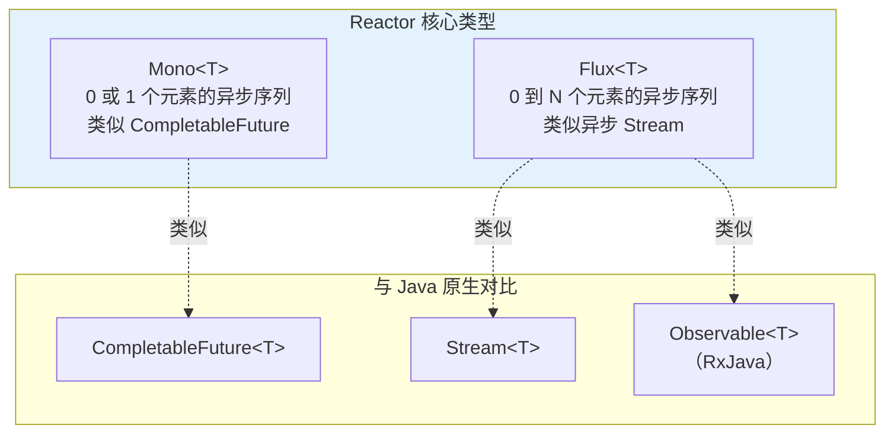
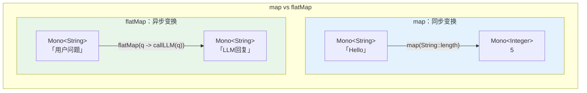
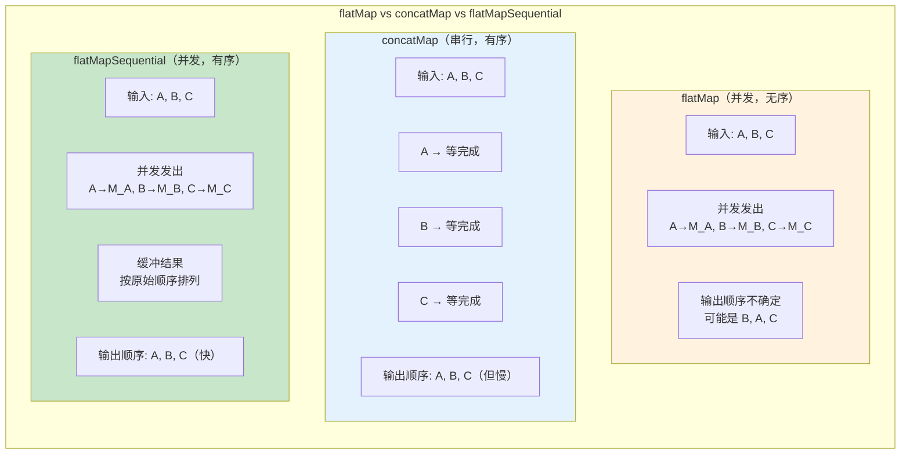
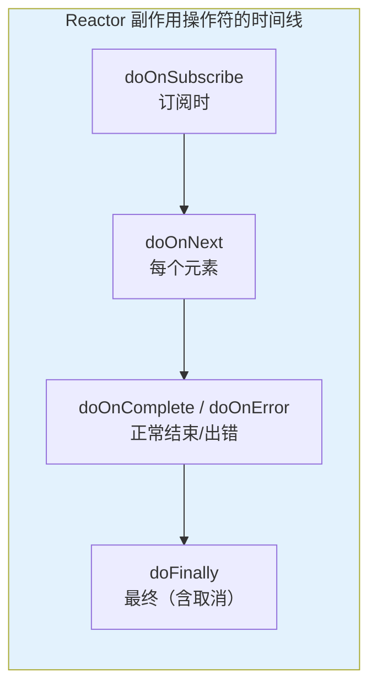
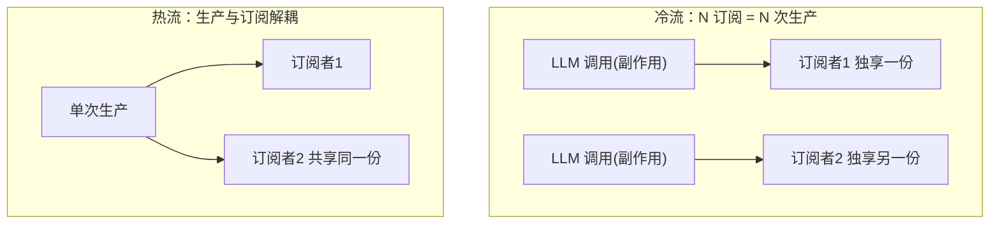
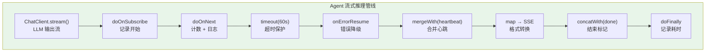

# Reactor 核心：Mono / Flux 操作符全解

> 「本文是对 [教程 01-Spring-AI入门 §3] 和 [教程 10-SSE §2-§4] 的深入展开」

> **定位**：系统讲解 Reactor 的核心抽象 `Mono` 和 `Flux`，覆盖创建、变换、过滤、组合、错误处理、时间操作、背压等全部操作符类别，以及在 Spring AI 流式输出场景中的实战。
>
> **读者画像**：已读完 [教程 10-WebFlux从零入门]（跑通了最小工程与 SSE），需要系统补全 Reactor 操作符体系的开发者。

---

## 1. Reactor 是什么

Reactor 是 Spring 全家桶的响应式编程基础库，也是 Spring WebFlux 和 Spring AI 2.0 的流式 API 基石。它实现了 Reactive Streams 规范（RP204），提供两个核心类型：



| 类型 | 元素数量 | 完成信号 | 对标 |
|------|---------|---------|------|
| `Mono<T>` | 0 或 1 | `onComplete` / `onError` | CompletableFuture |
| `Flux<T>` | 0 到 N | `onComplete` / `onError` | RxJava Observable |

关键理念：**Reactor 是声明式的**——你用操作符链描述数据流"应该怎么处理"，在 `subscribe()` 之前不会执行任何操作。

```java
// 声明式——此时什么都不会发生
Flux<String> pipeline = Flux.fromIterable(List.of("a", "b", "c"))
    .map(String::toUpperCase)
    .filter(s -> s.length() == 1)
    .doOnNext(s -> System.out.println("Processing: " + s));

// 订阅——此时开始执行
pipeline.subscribe();
```

---

## 2. Mono 操作符全解

### 2.1 创建 Mono

```java
// 1. 从已有值创建
Mono<String> m1 = Mono.just("Hello");

// 2. 空 Mono
Mono<Object> m2 = Mono.empty();

// 3. 错误 Mono
Mono<String> m3 = Mono.error(new RuntimeException("失败"));

// 4. 从 Supplier 延迟创建（订阅时才执行）
Mono<String> m4 = Mono.fromSupplier(() -> expensiveOperation());

// 5. 从 Callable
Mono<String> m5 = Mono.fromCallable(() -> blockingDbCall());

// 6. 从 Future
Mono<String> m6 = Mono.fromFuture(CompletableFuture.supplyAsync(() -> "result"));

// 7. 从另一个 Publisher
Mono<String> m7 = Mono.from(flux);  // 取 Flux 的第一个元素
```

### 2.2 Spring AI 中的 Mono

Spring AI 的 `ChatClient.call()` 返回 `Mono`（在 WebFlux 模式下）：

```java
Mono<String> response = chatClient.prompt()
    .user("你好")
    .call()
    .content();  // 返回 Mono<String>

// 等价于
Mono<ChatResponse> chatResponse = chatClient.prompt()
    .user("你好")
    .call()
    .chatResponse();
```

### 2.3 Mono 变换操作符

```java
// map：同步变换
Mono<Integer> length = Mono.just("Hello")
    .map(String::length);  // 5

// flatMap：异步变换（返回另一个 Mono）
Mono<String> enhanced = Mono.just("用户问题")
    .flatMap(question -> chatClient.prompt()  // 返回 Mono<String>
        .user(question)
        .call()
        .content()
    );

// handle：带条件的同步+异步混合
Mono<String> filtered = Mono.just("test")
    .handle((value, sink) -> {
        if (value.length() > 3) {
            sink.next(value.toUpperCase());
        } else {
            sink.complete();
        }
    });
```



### 2.4 Mono 错误处理

```java
Mono<String> safe = chatClient.prompt()
    .user("你好")
    .call()
    .content()
    // 超时
    .timeout(Duration.ofSeconds(30))
    // 出错时返回默认值
    .onErrorReturn("服务暂时不可用")
    // 出错时降级到备用 Mono
    .onErrorResume(e -> {
        if (e instanceof TimeoutException) {
            return fallbackService.call();  // 返回 Mono<String>
        }
        return Mono.error(e);  // 重新抛出其他错误
    })
    // 出错时重试
    .retryWhen(Retry.backoff(3, Duration.ofSeconds(1))
        .maxBackoff(Duration.ofSeconds(10))
        .jitter(0.5)
    )
    // 最终兜底
    .doOnError(e -> log.error("LLM调用失败", e))
    .doFinally(signal -> log.info("请求结束: {}", signal));
```

---

## 3. Flux 操作符全解

### 3.1 创建 Flux

```java
// 1. 从已知元素
Flux<Integer> f1 = Flux.just(1, 2, 3);
Flux<Integer> f2 = Flux.range(1, 100);         // 1 到 100
Flux<String> f3 = Flux.fromIterable(List.of("a", "b", "c"));
Flux<String> f4 = Flux.fromArray(new String[]{"x", "y", "z"});

// 2. 间隔创建
Flux<Long> f5 = Flux.interval(Duration.ofSeconds(1));  // 0, 1, 2, ... 每秒一个

// 3. 空 Flux
Flux<Object> f6 = Flux.empty();

// 4. 从 Supplier
Flux<String> f7 = Flux.generate(
    () -> 0,                                           // 初始状态
    (state, sink) -> {
        sink.next("Value " + state);                   // 发送元素
        if (state == 10) sink.complete();
        return state + 1;                              // 新状态
    }
);

// 5. 从 Stream
Flux<String> f8 = Flux.fromStream(() -> Files.lines(Path.of("file.txt")));

// 6. 合并多个源
Flux<String> f9 = Flux.concat(mono1, mono2);  // 顺序连接
```

### 3.2 Spring AI 中的 Flux

Spring AI 的 `ChatClient.stream()` 返回 `Flux`——LLM 流式输出的每个 token 作为一个元素：

```java
Flux<String> tokenStream = chatClient.prompt()
    .user("写一首关于春天的诗")
    .stream()
    .content();
// Flux<String>：每个元素是 LLM 生成的一个 chunk
// 例如：["春", "风", "又", "绿", "江", "南", "岸", ...]
```

### 3.3 Flux 变换操作符

```java
// === 基本变换 ===

// map：逐元素同步变换
Flux<Integer> lengths = Flux.just("hello", "world", "ai")
    .map(String::length);  // [5, 5, 2]

// flatMap：逐元素异步变换（无序）
Flux<String> results = Flux.just("q1", "q2", "q3")
    .flatMap(query -> callLlmAsync(query)  // 返回 Mono<String>
        .subscribeOn(Schedulers.parallel()),
        2  // 并发度：同时最多 2 个
    );

// concatMap：逐元素异步变换（有序，等待前一个完成）
Flux<String> ordered = Flux.just("q1", "q2", "q3")
    .concatMap(query -> callLlmAsync(query));

// flatMapSequential：异步但最终有序
Flux<String> fastOrdered = Flux.just("q1", "q2", "q3")
    .flatMapSequential(query -> callLlmAsync(query));
```



### 3.4 Flux 过滤操作符

```java
// filter：条件过滤
Flux<Integer> evens = Flux.range(1, 10)
    .filter(n -> n % 2 == 0);  // [2, 4, 6, 8, 10]

// distinct：去重
Flux<String> unique = Flux.just("a", "b", "a", "c", "b")
    .distinct();  // ["a", "b", "c"]

// take：取前 N 个
Flux<Integer> first3 = Flux.range(1, 100)
    .take(3);  // [1, 2, 3]

// takeUntil：取到条件满足
Flux<Integer> taken = Flux.range(1, 100)
    .takeUntil(n -> n > 5);  // [1, 2, 3, 4, 5, 6]

// skip：跳过前 N 个
Flux<Integer> after2 = Flux.range(1, 10)
    .skip(2);  // [3, 4, 5, 6, 7, 8, 9, 10]

// next：只取第一个
Mono<Integer> first = Flux.range(1, 10)
    .next();  // Mono(1)

// last：只取最后一个
Mono<Integer> end = Flux.range(1, 10)
    .last();  // Mono(10)
```

### 3.5 Flux 组合操作符

```java
// merge：合并多个 Flux（交错，按时间顺序）
Flux<String> merged = Flux.merge(
    Flux.just("A1", "A2").delayElements(Duration.ofMillis(100)),
    Flux.just("B1", "B2").delayElements(Duration.ofMillis(50))
);
// 输出可能: B1, A1, B2, A2（按到达顺序）

// concat：顺序连接（等前一个完成）
Flux<String> concatenated = Flux.concat(
    Flux.just("A1", "A2"),
    Flux.just("B1", "B2")
);
// 输出: A1, A2, B1, B2

// zip：按位置配对
Flux<String> zipped = Flux.zip(
    Flux.just("A", "B", "C"),
    Flux.just("1", "2", "3"),
    (letter, number) -> letter + number
);
// 输出: A1, B2, C3

// combineLatest：任一更新就组合
Flux<String> latest = Flux.combineLatest(
    Flux.interval(Duration.ofMillis(100)).take(3),  // 0, 1, 2
    Flux.interval(Duration.ofMillis(150)).take(2),  // 0, 1
    (a, b) -> "a=" + a + ",b=" + b
);
// 每当任一源发出，就组合最新的值
```

### 3.6 SSE 流式输出中的组合实战

```java
// Agent 场景：合并 LLM 输出流 + 心跳流，保证连接不超时
@GetMapping(value = "/chat/stream", produces = MediaType.TEXT_EVENT_STREAM_VALUE)
public Flux<ServerSentEvent<String>> streamWithHeartbeat(@RequestParam String query) {

    // LLM 输出流
    Flux<ServerSentEvent<String>> dataStream = chatClient.prompt()
        .user(query)
        .stream()
        .content()
        .map(chunk -> ServerSentEvent.<String>builder()
            .event("data")
            .data(chunk)
            .build());

    // 心跳流：每 15 秒发一个心跳
    Flux<ServerSentEvent<String>> heartbeat = Flux.interval(Duration.ofSeconds(15))
        .map(i -> ServerSentEvent.<String>builder()
            .event("heartbeat")
            .data("ping")
            .build());

    // 合并两个流
    return Flux.merge(dataStream, heartbeat)
        .takeUntilOther(completionSignal);  // 完成信号到来时停止
}
```

---

## 4. 时间与调度操作符

### 4.1 调度器（Scheduler）

```java
// Schedulers.parallel()：CPU 密集型，线程数 = CPU 核心数
// Schedulers.boundedElastic()：I/O 密集型，适合阻塞调用
// Schedulers.single()：单线程
// Schedulers.immediate()：当前线程

// publishOn：改变后续操作符的执行线程
Flux.range(1, 10)
    .publishOn(Schedulers.parallel())  // 后面的 map 在 parallel 线程执行
    .map(n -> transform(n))
    .publishOn(Schedulers.boundedElastic())  // 后面的操作在 boundedElastic
    .map(n -> blockingCall(n));

// subscribeOn：改变源的数据生产线程
Flux.fromCallable(() -> blockingDbCall())
    .subscribeOn(Schedulers.boundedElastic())  // 从源头就切换线程
    .map(result -> process(result));  // 也在 boundedElastic

// 在 Spring AI 中，LLM 调用通常是 I/O 操作
Mono<String> llmCall = Mono.fromCallable(() ->
        chatClient.prompt().user("query").call().content()
    )
    .subscribeOn(Schedulers.boundedElastic());
```

### 4.2 时间操作符

```java
// delayElements：每个元素延迟
Flux<String> delayed = Flux.just("A", "B", "C")
    .delayElements(Duration.ofSeconds(1));  // 每个元素延迟 1 秒

// interval：固定速率产生
Flux<Long> ticker = Flux.interval(Duration.ofSeconds(5));  // 每 5 秒产生一个

// timeout：超时
Mono<String> withTimeout = chatClient.prompt()
    .user("query")
    .call()
    .content()
    .timeout(Duration.ofSeconds(30))
    .onErrorResume(TimeoutException.class, e ->
        Mono.just("LLM 响应超时")
    );

// elapsed：附带时间戳
Flux<String> withTime = Flux.just("A", "B", "C")
    .elapsed()  // 变成 Flux<Tuple2<Long, String>>，Long 是距上一元素的毫秒数
    .map(t -> t.getT2() + " (+" + t.getT1() + "ms)");
```

---

## 5. 副作用操作符（Side Effects）

副作用操作符不改变数据流，用于"旁路"执行日志、缓存、指标等：

```java
Flux<String> pipeline = chatClient.prompt()
    .user("query")
    .stream()
    .content()
    // 每个元素到达时执行
    .doOnNext(chunk -> {
        log.debug("收到 chunk: {}", chunk);
        metricsCounter.increment();
    })
    // 流完成时执行
    .doOnComplete(() -> {
        log.info("LLM 输出完成");
    })
    // 流出错时执行
    .doOnError(e -> {
        log.error("LLM 输出错误", e);
        errorCounter.increment();
    })
    // 订阅时执行
    .doOnSubscribe(subscription -> {
        log.info("开始订阅 LLM 输出");
    })
    // 最终（无论成功失败）执行
    .doFinally(signal -> {
        log.info("流结束: {}", signal);  // ON_COMPLETE, ON_ERROR, CANCEL
        requestTimer.record(System.nanoTime() - startTime, TimeUnit.NANOSECONDS);
    });
```



---

## 6. 冷流与热流：publish / share / cache 家族

### 6.1 一条数据的旅程差异

同一个 `Flux`，冷热之差决定"第二次订阅会发生什么"：

- **冷流（Cold）**：每个订阅者触发一次完整生产。`just/fromIterable/create/WebClient 调用`都是冷的——两次订阅 = **两次真实副作用**（两次 LLM 调用、两次计费）。
- **热流（Hot）**：数据独立于订阅者存在，订阅只是"把喇叭接到广播上"。`Sinks` 的 `asFlux()`、`Flux.share()` 之后都是热的——错过就错过（replay 系除外）。



**Agent 场景的典型翻车**：一个会话里两个组件都订阅了 `chatClient.stream()` 的返回值 → 模型被调了两次、两个组件收到**不同**的回答。副作用唯一性是冷热流问题的第一动因。

### 6.2 把冷流转热：三个档位（全部 javap 实证，reactor-core 3.8.6）

```java
// Flux 上的入口
public final ConnectableFlux<T> publish();            // 挂起订阅，等 connect()
public final ConnectableFlux<T> replay();             // publish + 重放全部历史
public final ConnectableFlux<T> replay(int history);  // 重放最近 n 条
public final ConnectableFlux<T> replay(Duration ttl); // 重放 TTL 内历史
public final Flux<T> share();                         // publish().refCount(1)：最常用
public final Flux<T> cache();                         // 订阅前预取并缓存全部
public final Flux<T> cache(int history);
public final Flux<T> cache(Duration ttl);

// ConnectableFlux 上的控制（实证）
public final Disposable connect();                    // 手动点火：从此刻开始，后来的订阅者只能收到之后的数据
public final Flux<T> autoConnect(int n);              // 第 n 个订阅者到达时自动点火
public final Flux<T> refCount();                      // 订阅者归零 → 断开上游；再来 → 重新订阅（重新生产！）
public final Flux<T> refCount(int n, Duration grace); // 归零后宽限期内不断开
```

三档选型：

| 手段 | 语义 | 什么时候用 |
|---|---|---|
| `share()` | `publish().refCount()`：**有订阅才生产，订阅归零就停**；每个订阅周期重放一次生产 | 一个请求内多个观察者共享同一次 LLM 调用（日志、SSE、缓存三个消费者） |
| `replay(n)` + `connect()` | 热广播 + 迟到者补看 n 条 | 直播型：先启动生产，页面随到随看（与 [13-Sinks详解 §4.3] `replay().limit()` 相对——Sinks 版数据从命令式世界来） |
| `cache(ttl)` | 首次订阅触发生产，结果缓存 ttl，后来的直接回放 | **LLM 结果短时缓存**：10 秒内同 prompt 的重复请求不再打模型 |

```java
// share()：一次 LLM 调用，三方共享
Flux<String> shared = chatClient.prompt().user(q).stream()
        .chatResponse()
        .map(r -> r.getResult().getOutput().getText())
        .share();                       // 在 share 之后的分叉才共享
shared.subscribe(sseSink::tryEmitNext);  // 触发真实调用
shared.subscribe(log::debug);            // 同一份数据，不重复调用

// cache(ttl)：10 秒同题免打模型
Flux<String> cached = askLlm(q).cache(Duration.ofSeconds(10));
cached.subscribe();   // 真调用
cached.subscribe();   // 命中缓存回放，0 成本
```

### 6.3 share/cache 与 Sinks 的分界线

两者都能"多订阅者共享一份数据"，分界在**生产的触发方式**（呼应 [13-Sinks详解 §10.1] 的对比表）：

- 生产能表达为"订阅驱动的管道"（副作用随订阅起止）→ `share/cache`，声明式、自动管理生命周期
- 生产来自**管道外部**（回调、别的线程、别的请求）→ Sinks，热源独立于任何订阅存在

「Sinks 全家族与更细的对比？→ [教程 13-Sinks详解]」

---

## 7. 背压（Backpressure）基础

Flux 的消费者可以通过 `request(n)` 控制上游的生产速率——这就是背压：

```java
// 自定义订阅者控制拉取速率
tokenStream.subscribe(new BaseSubscriber<String>() {
    @Override
    protected void hookOnSubscribe(Subscription subscription) {
        request(10);  // 初始请求 10 个
    }

    @Override
    protected void hookOnNext(String value) {
        process(value);
        request(5);  // 处理完一批再请求 5 个
    }
});

// onBackpressureBuffer：缓冲
Flux.range(1, 1000000)
    .onBackpressureBuffer(1000)  // 缓冲 1000 个
    .subscribe(i -> { if (i % 100000 == 0) System.out.println("已发射(缓冲): " + i); });

// onBackpressureDrop：丢弃
Flux.interval(Duration.ofMillis(1))
    .onBackpressureDrop(dropped -> log.warn("丢弃: {}", dropped))
    .subscribe(i -> System.out.println("背压丢弃策略收到: " + i));

// onBackpressureLatest：只保留最新
Flux.interval(Duration.ofMillis(10))
    .onBackpressureLatest()
    .subscribe(i -> System.out.println("Latest 保留最新值: " + i));
```

> 背压的深入讨论见 [01-背压与流量控制](12-背压与流量控制.md)。

---

## 8. 完整实战：Agent 流式推理管线

把所有操作符组合起来，构建一个生产级的 Agent 流式推理管线：

```java
@Service
public class AgentStreamingService {

    private final ChatClient chatClient;
    private final MeterRegistry meters;
    private final ChatMemory chatMemory;

    public Flux<ServerSentEvent<String>> stream(String sessionId, String userQuery) {
        long startTime = System.nanoTime();

        return chatClient.prompt()
            .system("你是一个专业的 AI 助手。")
            .user(userQuery)
            .advisors(a -> a.param("chatId", sessionId))  // 记忆 Advisor
            .stream()
            .content()
            // 副作用：日志 + 指标
            .doOnSubscribe(sub -> log.info("[{}] 开始流式推理", sessionId))
            .doOnNext(chunk -> meters.counter("agent.stream.tokens").increment())
            .doOnError(e -> {
                log.error("[{}] 流式推理失败", sessionId, e);
                meters.counter("agent.stream.errors").increment();
            })
            .doFinally(signal -> {
                long elapsed = System.nanoTime() - startTime;
                meters.timer("agent.stream.duration").record(elapsed, TimeUnit.NANOSECONDS);
                log.info("[{}] 流式推理结束: {} in {}ms", sessionId, signal,
                    elapsed / 1_000_000);
            })
            // 超时保护
            .timeout(Duration.ofSeconds(60))
            // 错误降级
            .onErrorResume(e -> Flux.just(
                "[错误] 推理过程出现问题，请重试: " + e.getMessage()
            ))
            // 合并心跳（防止代理超时断开）
            .mergeWith(
                Flux.interval(Duration.ofSeconds(15))
                    .map(i -> "❤")  // 心跳标记
                    .takeUntilOther(
                        Mono.delay(Duration.ofSeconds(60))  // 心跳最长发 60 秒
                    )
            )
            // 转为 SSE 格式
            .map(chunk -> {
                if ("❤".equals(chunk)) {
                    return ServerSentEvent.<String>builder()
                        .event("heartbeat")
                        .data("ping")
                        .build();
                } else {
                    return ServerSentEvent.<String>builder()
                        .event("data")
                        .data(chunk)
                        .build();
                }
            })
            // 完成事件
            .concatWith(
                Mono.just(ServerSentEvent.<String>builder()
                    .event("done")
                    .data("[DONE]")
                    .build())
            );
    }
}
```



---

## 9. 常见陷阱

### 9.1 忘记 subscribe

```java
// 问题：声明了但没订阅，什么都不会发生
chatClient.prompt()
    .user("你好")
    .call()
    .content()
    .doOnNext(r -> log.info("收到: {}", r));
// 没有任何输出！需要 .subscribe()

// 修复：在 WebFlux Controller 中返回 Mono/Flux 即可，框架会自动订阅
@GetMapping("/ask")
public Mono<String> ask() {
    return chatClient.prompt()  // 框架负责 subscribe
        .user("你好")
        .call()
        .content();
}
```

### 9.2 在 flatMap 中调用 block()

```java
// 问题：在 reactive 链中调用 block() 会阻塞 Event Loop 线程
Flux.range(1, 10)
    .flatMap(n -> {
        String result = blockingCall(n);  // 阻塞调用
        return Mono.just(result);         // 包成 Mono 仍然阻塞
    });

// 修复：用 fromCallable + subscribeOn
Flux.range(1, 10)
    .flatMap(n -> Mono.fromCallable(() -> blockingCall(n))
        .subscribeOn(Schedulers.boundedElastic())  // 在专用线程池阻塞
    );
```

### 9.3 错误被吞没

```java
// 问题：onErrorReturn 会吞没所有错误信息
chatClient.call().content()
    .onErrorReturn("默认值");  // 你永远不知道为什么失败

// 修复：先记录再降级
chatClient.call().content()
    .doOnError(e -> log.error("调用失败", e))  // 记录错误
    .onErrorReturn("默认值");                   // 再降级
```

---

## 10. 总结

Reactor 是 Spring WebFlux 和 Spring AI 流式 API 的基石。掌握 Mono / Flux 的操作符体系，是开发高性能 Agent 应用的前提：

1. **Mono（0/1）**：用于单次 LLM 调用、数据获取
2. **Flux（0/N）**：用于 SSE 流式输出、批量处理、实时推送
3. **变换**：map（同步）、flatMap（异步无序）、concatMap（异步有序）
4. **组合**：merge（交错）、concat（顺序）、zip（配对）
5. **错误处理**：onErrorResume、retryWhen、timeout 组合使用
6. **副作用**：doOnNext/doOnComplete/doFinally 用于日志和指标
7. **调度器**：publishOn 切换下游线程，subscribeOn 切换上游线程

Spring AI 2.0 的 `ChatClient.stream()` 返回 `Flux<String>`，所有流式 Agent 交互——SSE 推送、多 Agent 并行、工具流式调用——都建立在这些操作符之上。
