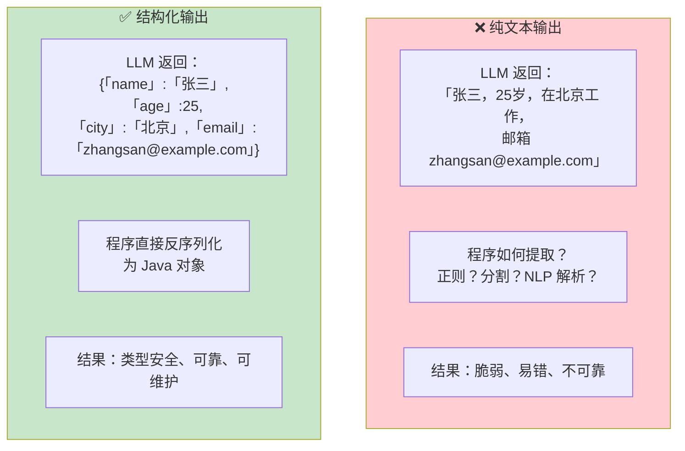
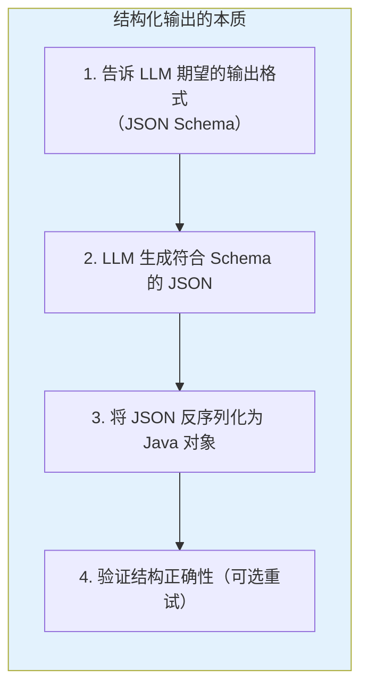
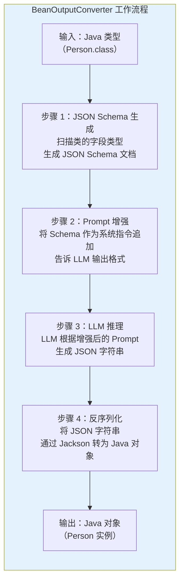
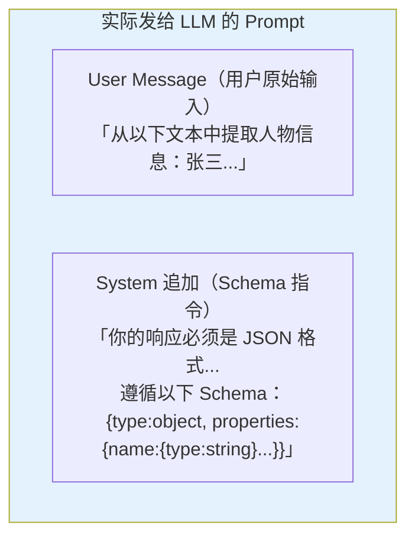
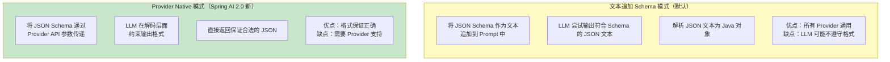
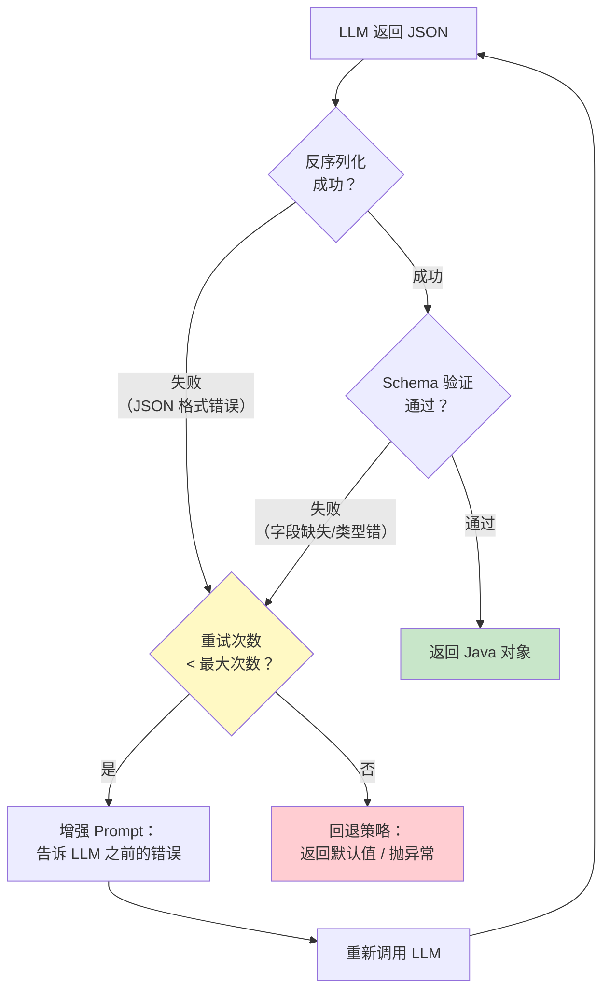
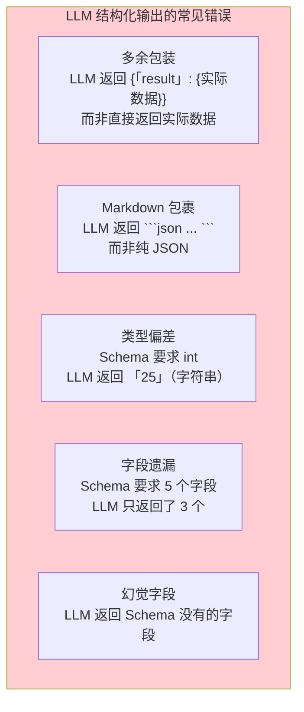

# 12-结构化输出

> **定位**：讲透 LLM 结构化输出的完整机制——为什么需要结构化输出、Spring AI 2.0 的 `entity()` 方法、BeanOutputConverter 的底层原理、JSON Schema 自动生成、Provider Native Structured Output、Schema 验证与自动重试。读完这篇，你能让 LLM 精确返回你需要的 Java 对象。
>
> **读者画像**：已经会用 ChatClient 进行对话，需要让 LLM 返回结构化数据而非纯文本。
>
> **前置阅读**：[02-ChatClient 与对话模型](02-ChatClient与对话模型.md)。

---

## 1. 为什么需要结构化输出

LLM 的原生输出是**自由文本字符串**。这对人类阅读很友好，但对程序处理是灾难。

### 1.1 纯文本输出的问题



### 1.2 企业级场景中的结构化需求

| 场景 | 需要的结构 | 为什么纯文本不行 |
|------|-----------|----------------|
| 信息提取 | 从简历中提取 `Person` 对象 | 纯文本无法被代码消费 |
| 意图分类 | 返回 `ClassificationResult`（枚举 + 置信度） | 需要精确的枚举值，不能是描述性文字 |
| 数据转换 | 将自然语言转为 `DatabaseQuery` | SQL 参数需要精确的类型和结构 |
| 多选项生成 | 返回 `List<Recommendation>` | 需要固定字段（标题、理由、评分）的列表 |
| Agent 决策 | 返回 `AgentDecision`（动作 + 参数 + 理由） | 下游代码需要按动作类型分发 |

### 1.3 结构化输出的本质



---

## 2. Spring AI 2.0 的 entity() 方法

`entity()` 是 Spring AI 中获取结构化输出的核心方法。它将 LLM 的输出直接映射为 Java 对象。

### 2.1 基本用法：返回单个 POJO

```java
import org.springframework.ai.chat.client.ChatClient;

// Spring AI 2.0.0 — 定义结构化输出的目标类型
public record Person(
    String name,
    int age,
    String city,
    String email
) {}

// 使用 entity() 直接获取 Java 对象
Person person = chatClient.prompt()
        .user("从以下文本中提取人物信息：张三，25岁，在北京工作，邮箱 zhangsan@example.com")
        .call()
        .entity(Person.class);

// person.name() = "张三"
// person.age() = 25
// person.city() = "北京"
// person.email() = "zhangsan@example.com"
```

### 2.2 返回集合

```java
import org.springframework.core.ParameterizedTypeReference;

public record Movie(String title, int year, double rating) {}

// Spring AI 2.0.0 — 返回列表
List<Movie> movies = chatClient.prompt()
        .user("推荐 5 部科幻电影，包含片名、年份和评分")
        .call()
        .entity(new ParameterizedTypeReference<List<Movie>>() {});

// 返回 Map
Map<String, Object> data = chatClient.prompt()
        .user("提取以下信息的键值对：张三 25岁 北京")
        .call()
        .entity(new ParameterizedTypeReference<Map<String, Object>>() {});
```

### 2.3 嵌套复杂结构

```java
// Spring AI 2.0.0 — 复杂嵌套结构
public record OrderExtraction(
    String orderId,
    CustomerInfo customer,
    List<OrderItem> items,
    PaymentInfo payment,
    ShippingAddress shipping
) {}

public record CustomerInfo(
    String name,
    String phone,
    String email
) {}

public record OrderItem(
    String productName,
    int quantity,
    double unitPrice
) {}

public record PaymentInfo(
    String method,    // 信用卡、支付宝、微信
    double amount,
    String currency
) {}

public record ShippingAddress(
    String province,
    String city,
    String detail,
    String zipCode
) {}

// 从非结构化文本中提取完整订单
OrderExtraction order = chatClient.prompt()
        .user("""
              从以下邮件内容中提取订单信息：
              客户张三（手机13800138000，邮箱zs@qq.com）下单了：
              2 件 Java 编程思想（单价 89.5），
              1 件 Spring 实战（单价 59.0）。
              用信用卡支付，总金额 238.0 元。
              配送地址：北京市海淀区中关村大街 1 号，邮编 100080。
              """)
        .call()
        .entity(OrderExtraction.class);
```

Spring AI 的 BeanOutputConverter 能自动处理任意深度的嵌套结构，生成对应的 JSON Schema。

---

## 3. BeanOutputConverter：底层原理

`entity()` 方法看似简单，底层做了三件事。理解这些步骤是调试结构化输出问题的关键。

### 3.1 转换架构



### 3.2 步骤 1：JSON Schema 自动生成

Spring AI 使用 Jackson 的 `JsonSchemaGenerator` 将 Java 类型转换为 JSON Schema：

```java
import org.springframework.ai.converter.BeanOutputConverter;

// Spring AI 2.0.0 — 手动使用 BeanOutputConverter
BeanOutputConverter<Person> converter = new BeanOutputConverter<>(Person.class);

// 查看自动生成的 JSON Schema
String schema = converter.getFormat();
// 输出类似：
// Your response should be in JSON format.
// Do not include any explanations, only provide a RFC8259 compliant JSON response
// following this format without deviation.
// Do not include markdown code blocks in your response.
// Here is the JSON Schema instance your output must adhere to:
// {\"$schema\":\"https://json-schema.org/draft/2020-12/schema\",\"type\":\"object\",
//  \"properties\":{\"name\":{\"type\":\"string\"},\"age\":{\"type\":\"integer\"},
//  \"city\":{\"type\":\"string\"},\"email\":{\"type\":\"string\"}}}
```

### 3.3 步骤 2：Prompt 增强

这步是隐式的——`entity()` 方法自动将生成的 Schema 指令追加到 Prompt 中。实际发给 LLM 的 Prompt 如下：



> **调试技巧**：如果结构化输出不理想，可以用 `BeanOutputConverter` 手动生成 Schema，检查它是否准确描述了你的期望。

### 3.4 步骤 3-4：LLM 推理与反序列化

```java
// Spring AI 2.0.0 — 手动完成完整流程（调试用）
BeanOutputConverter<Person> converter = new BeanOutputConverter<>(Person.class);

// 1. 获取 Schema 指令
String formatInstructions = converter.getFormat();

// 2. 构建增强 Prompt
String enhancedPrompt = """
        从以下文本中提取人物信息：张三，25岁，在北京工作，邮箱 zhangsan@example.com
        
        %s
        """.formatted(formatInstructions);

// 3. 调用 LLM（获取纯文本 JSON）
String jsonResult = chatClient.prompt()
        .user(enhancedPrompt)
        .call()
        .content();
// jsonResult = {"name":"张三","age":25,"city":"北京","email":"zhangsan@example.com"}

// 4. 手动反序列化
Person person = converter.convert(jsonResult);
// person.name() = "张三"
```

---

## 4. Provider Native Structured Output

Spring AI 2.0 引入了 **Provider Native Structured Output**——直接使用 LLM 提供商的原生结构化输出能力，而不是通过文本追加 Schema。

### 4.1 文本模式 vs 原生模式



### 4.2 使用 Provider Native Structured Output

```java
// Spring AI 2.0.0 — 使用 Provider 原生结构化输出
Person person = chatClient.prompt()
        .user("提取人物信息：张三，25岁，在北京")
        .call()
        .entity(Person.class, spec -> spec
                .useProviderStructuredOutput()  // 使用 DeepSeek 原生结构化输出
        );
```

### 4.3 两种模式的对比

| 维度 | 文本追加 Schema | Provider Native |
|------|----------------|-----------------|
| **格式可靠性** | 中（LLM 可能偏离） | 高（解码层约束） |
| **Token 消耗** | 高（Schema 占用 Prompt 空间） | 低（Schema 走 API 参数） |
| **Provider 兼容** | 所有 Provider | 需要 Provider 支持（DeepSeek 兼容 OpenAI 格式，支持此功能） |
| **嵌套复杂度** | 复杂 Schema 时 LLM 容易出错 | 原生模式更稳定 |
| **推荐** | 简单结构 / 不确定 Provider 支持 | 复杂结构 / 生产环境优先 |

---

## 5. Schema 验证与自动重试

LLM 并非 100% 可靠。即使给了 Schema，LLM 也可能返回格式错误的 JSON（多余字段、类型不匹配、遗漏字段）。Spring AI 2.0 新增了 **Schema 验证 + 自动重试** 机制。

### 5.1 验证与重试的工作流程



### 5.2 启用 Schema 验证

```java
// Spring AI 2.0.0 — 启用 Schema 验证 + 自动重试
Person person = chatClient.prompt()
        .user("提取人物信息：张三，25岁，在北京")
        .call()
        .entity(Person.class, spec -> spec
                .useProviderStructuredOutput()  // 使用原生结构化输出
                .validateSchema()                // 启用 Schema 验证
                .maxAttempts(3)                  // 最多重试 3 次
        );
```

### 5.3 验证失败的回退策略

```java
// Spring AI 2.0.0 — 带回退的结构化输出
Person person;
try {
    person = chatClient.prompt()
            .user("提取人物信息：" + rawText)
            .call()
            .entity(Person.class, spec -> spec
                    .validateSchema()
                    .maxAttempts(3)
            );
} catch (StructuredOutputConversionException e) {
    // 重试 3 次后仍然失败
    log.warn("结构化输出解析失败，使用回退策略", e);

    // 回退策略 1：用宽松的解析提取部分字段
    person = fallbackParser.extractPartial(rawText);

    // 回退策略 2：返回带标记的默认值
    // person = new Person("", 0, "", "");
}
```

### 5.4 常见的结构化输出错误



**应对策略**：

```java
// Spring AI 2.0.0 — 通过 System Message 增强格式遵从性
Person person = chatClient.prompt()
        .system("""
                你是一个信息提取助手。你的输出必须严格遵守以下规则：
                1. 只输出 JSON，不要有任何其他文字
                2. 不要用 Markdown 代码块包裹
                3. 不要添加额外的包装字段
                4. 确保所有字段都有值，缺失字段使用空字符串或 0
                """)
        .user("提取人物信息：" + rawText)
        .call()
        .entity(Person.class, spec -> spec
                .validateSchema()
                .maxAttempts(3)
        );
```

---

## 6. 高级用法

### 6.1 枚举类型的结构化输出

```java
// Spring AI 2.0.0 — 枚举约束输出
public enum Intent {
    ORDER_QUERY,     // 订单查询
    REFUND_REQUEST,  // 退款申请
    COMPLAINT,       // 投诉
    CONSULTATION,    // 咨询
    OTHER            // 其他
}

public record IntentClassification(
    Intent intent,
    double confidence,
    String reasoning
) {}

IntentClassification result = chatClient.prompt()
        .user("用户说：我昨天买的手机还没发货，能不能退了？")
        .call()
        .entity(IntentClassification.class);

// result.intent() = REFUND_REQUEST
// result.confidence() = 0.92
// result.reasoning() = "用户提到'退了'，且涉及已购商品"
```

### 6.2 多种可能结构的选择

当输出可能是多种不同结构之一时，使用继承或多态：

```java
// Spring AI 2.0.0 — 多态结构化输出
import com.fasterxml.jackson.annotation.JsonSubTypes;
import com.fasterxml.jackson.annotation.JsonTypeInfo;

@JsonTypeInfo(use = JsonTypeInfo.Id.NAME, property = "type")
@JsonSubTypes({
    @JsonSubTypes.Type(value = TextResponse.class, name = "text"),
    @JsonSubTypes.Type(value = ToolRequest.class, name = "tool"),
    @JsonSubTypes.Type(value = ClarificationQuestion.class, name = "question")
})
public sealed interface AgentResponse
        permits TextResponse, ToolRequest, ClarificationQuestion {}

public record TextResponse(String text) implements AgentResponse {}
public record ToolRequest(String toolName, Map<String, Object> arguments) 
        implements AgentResponse {}
public record ClarificationQuestion(String question, List<String> options) 
        implements AgentResponse {}

// Agent 根据用户输入决定返回哪种结构
AgentResponse response = chatClient.prompt()
        .system("分析用户输入，决定是直接回复、调用工具还是追问澄清。")
        .user("帮我查一下订单状态")
        .call()
        .entity(AgentResponse.class);

// 根据实际类型处理
switch (response) {
    case TextResponse t -> System.out.println("回复：" + t.text());
    case ToolRequest t -> System.out.println("调用工具：" + t.toolName());
    case ClarificationQuestion t -> System.out.println("追问：" + t.question());
}
```

### 6.3 流式结构化输出

结构化输出与流式调用结合时需要注意：JSON 在流式传输中是不完整的，无法逐块反序列化。

```java
// Spring AI 2.0.0 — 流式收集后统一解析
Mono<Person> personMono = chatClient.prompt()
        .user("提取人物信息：张三，25岁，在北京")
        .stream()
        .content()
        .collectList()                    // 收集所有 chunk
        .map(chunks -> String.join("", chunks))  // 拼接完整 JSON
        .map(json -> new BeanOutputConverter<Person>(Person.class).convert(json));
```

---

## 7. 完整示例：智能信息提取

```java
@RestController
@RequestMapping("/extract")
public class ExtractionController {

    private final ChatClient chatClient;

    public ExtractionController(ChatClient chatClient) {
        this.chatClient = chatClient;
    }

    // Spring AI 2.0.0 — 从简历中提取结构化信息
    @PostMapping("/resume")
    public Resume extractResume(@RequestBody String resumeText) {
        return chatClient.prompt()
                .system("""
                        你是一个简历解析专家。从简历文本中提取结构化信息。
                        规则：
                        - 日期格式统一为 yyyy-MM
                        - 如果某个字段无法从简历中提取，使用空字符串或空列表
                        - 技能列表按熟练度排序
                        """)
                .user(resumeText)
                .call()
                .entity(Resume.class, spec -> spec
                        .useProviderStructuredOutput()
                        .validateSchema()
                        .maxAttempts(3)
                );
    }

    // Spring AI 2.0.0 — 批量产品评论分析
    @PostMapping("/reviews/analyze")
    public List<ReviewAnalysis> analyzeReviews(@RequestBody List<String> reviews) {
        String reviewsText = reviews.stream()
                .map(r -> IntStream.range(0, reviews.size())
                        .mapToObj(i -> (i + 1) + ". " + reviews.get(i))
                        .collect(Collectors.joining("\n")))
                .findFirst()
                .orElse("");

        return chatClient.prompt()
                .system("分析每条评论的情感、提及的优缺点和评分建议（1-5）。")
                .user(reviewsText)
                .call()
                .entity(new ParameterizedTypeReference<List<ReviewAnalysis>>() {});
    }
}

public record Resume(
    String name,
    String phone,
    String email,
    String summary,
    List<WorkExperience> workExperiences,
    List<Education> education,
    List<String> skills
) {}

public record WorkExperience(
    String company,
    String position,
    String startDate,
    String endDate,
    String description
) {}

public record Education(
    String school,
    String degree,
    String major,
    String startDate,
    String endDate
) {}

public record ReviewAnalysis(
    String sentiment,     // positive / negative / neutral
    double sentimentScore, // 0.0 - 1.0
    List<String> pros,
    List<String> cons,
    int suggestedRating   // 1-5
) {}
```

---

## 8. 适用场景与不适用场景

### 适用场景

- 信息提取（从非结构化文本中提取结构化数据）
- 意图分类（返回枚举 + 置信度）
- 数据转换（自然语言到 SQL/JSON/配置）
- 内容生成（生成固定结构的文案、报告）
- Agent 决策（返回动作 + 参数 + 理由的结构化决策）
- 批量处理（对大量文本进行统一格式的结构化分析）

### 不适用场景

- 创意写作（诗歌、故事、对话——不需要固定结构）
- 长篇内容生成（超过上下文窗口的结构化数据，应该分批处理）
- 实时性要求极高的场景（Schema 验证 + 重试会增加延迟）
- LLM 无法准确理解的结构（如高度专业化的领域 Schema——需要 Few-shot 示例辅助）

---

## 9. 本章总结

| 概念 | 一句话 |
|------|--------|
| **结构化输出的本质** | 告诉 LLM 期望的格式 → 生成符合 Schema 的 JSON → 反序列化为 Java 对象 |
| **entity()** | Spring AI 核心方法，一行代码获取 Java 对象 |
| **BeanOutputConverter** | 底层转换器：生成 Schema → 增强 Prompt → 反序列化 |
| **JSON Schema 自动生成** | 从 Java 类型（含 record、泛型、嵌套）自动推导 Schema |
| **Provider Native** | 通过 API 参数传递 Schema，解码层约束输出格式（比文本追加更可靠） |
| **Schema 验证 + 重试** | Spring AI 2.0 新特性，验证失败自动增强 Prompt 重试 |
| **System Message 辅助** | 用明确的格式规则 System Message 提高输出遵从性 |
| **多态结构** | 使用 Jackson 多态注解处理"多种可能结构之一"的场景 |

---

> **想深入？→ [教程 02-ChatClient与对话模型]**：回顾 ChatClient API 的完整能力，包括 `entity()` 在流式调用中的注意事项。
> **想深入？→ [教程 13-Advisor链与拦截器.md]**：理解 Advisor 链如何在结构化输出的前后添加自定义处理逻辑。
