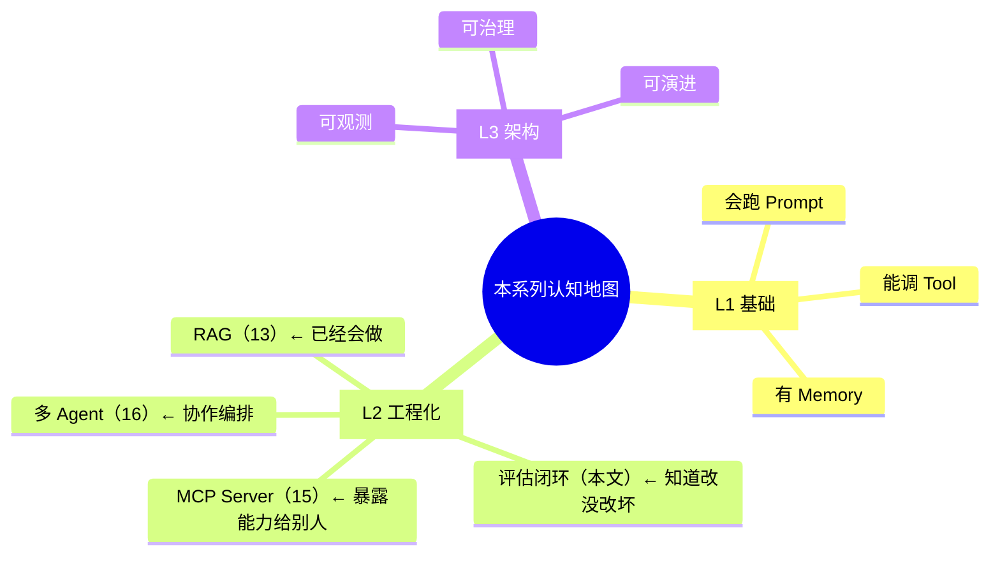
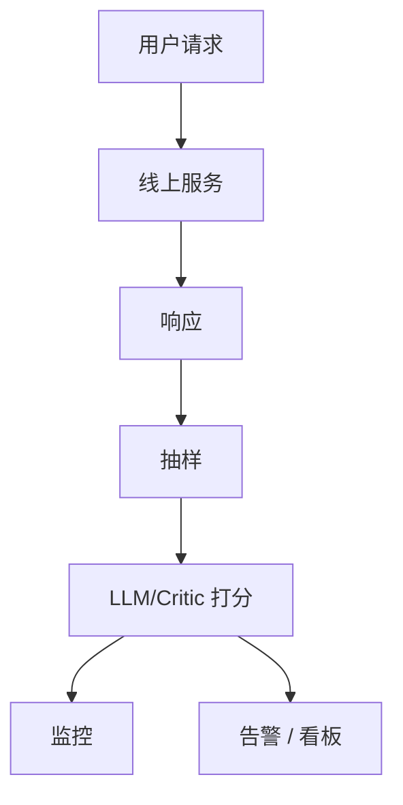
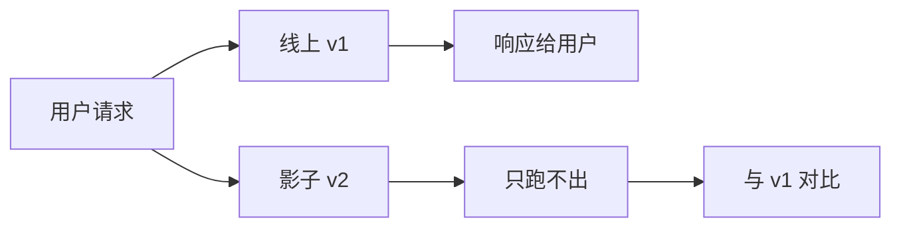
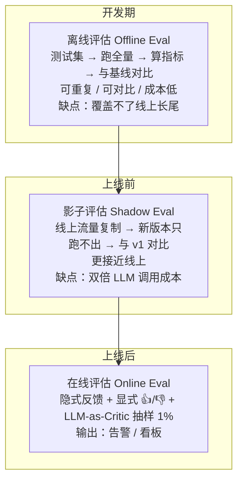
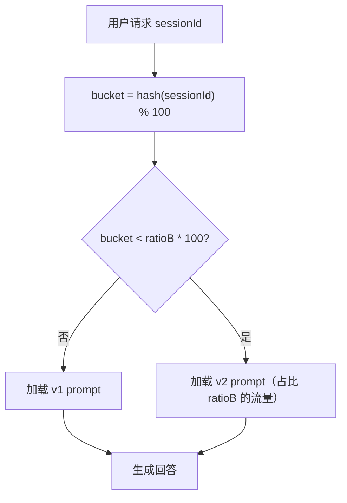
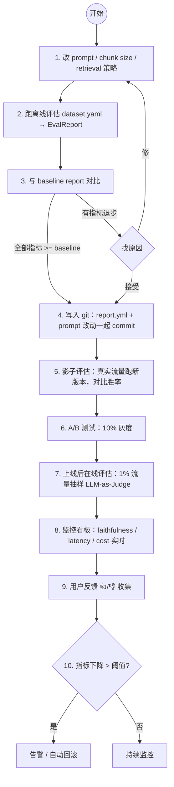
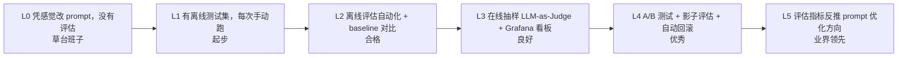

# L2 评估闭环与 Prompt 版本管理（Spring AI 2.0）

> 本文回答一个核心问题：**怎么知道你的 Prompt / RAG / Agent 改对了，而不是改坏了？**
>
> 没有评估闭环的 AI 工程等于盲改 —— 改一行 prompt 可能让 80% 的 case 通过变成 60%。
>
> 前提：你已搭出一套能跑的 RAG 系统，理解检索 + 生成链路（即 09 的能力）。
> 预计：1 天

---


> 📖 **评估学习路径 · 第 2 级 评估闭环**：第 1 级评估入门方法论已并入本文 §1（原 `进阶-Agent-06-评估与测试` 已归档）。
> 下一级 → `13-测试工程化.md`（第 3 级）；理论 → `../理论/11-LLMOps.md`。

## 0. 认知地图



**本文解决的痛点**：

| 场景 | 没有评估闭环 | 有评估闭环 |
|------|------------|-----------|
| 改 RAG chunk size | 主观感觉"好像更好了" | 自动跑 100 条测试集，准确率从 72% → 78% |
| Prompt 调温度 | 上线后用户投诉答非所问 | 灰度 10% 流量，对比旧版胜率 65% |
| 切模型（gpt-4 → claude） | 拍脑袋决定 | 跑全量回归，知道哪些 case 退步 |
| Agent 加新工具 | 不知道有没有破坏老逻辑 | 评估集自动跑，看到工具调用率变化 |

---

## 1. 评估方法论入门：三件套与通过率

> 本小节吸收自 `进阶-Agent-06-评估与测试`（原"评估学习路径"第 1 级，已归档到 `../archive/absorbed-内容融合/`）。先补方法论，再进入评估闭环的具体设计。

### 1.1 为什么评估难：传统测试 vs Agent 测试

Agent 测试不像传统单元测试——输入输出都是自然语言、行为路径多样、且 LLM 有概率性，同一条 case 跑两次可能结果不同。

| 维度 | 传统测试 | Agent 测试 |
|------|---------|-----------|
| 输入 | 确定 | 自然语言（多变性） |
| 输出 | 确定 | 自然语言（多义性） |
| 行为 | 单一路径 | 多种合理路径 |
| 可重复 | ✅ | ❌（LLM 有概率） |
| 失败原因 | 代码 bug | prompt / Tool / 模型 / 参数 |

Agent 评估分单元（单个 Tool）、集成（Tool + Service 协作）、端到端（用户问题 → Agent 回答）三类，本系列的阶段重点是 **端到端评估**。

### 1.2 三件套：测试集构建 / LLM-as-Judge / 人工标注

评估体系由三件套构成，各有分工：

| 手段 | 做法 | 适用阶段 | 成本 |
|------|------|---------|------|
| **测试集构建** | 先有"标准答案"才有评估对象：每条 case 标注期望的 Tool 调用 / 参数 / 关键词 / 期望输出 | 起步必备 | 一次性人力 |
| **人工标注** | 人肉看回答打标签；起步阶段人工抽检就够 | 小规模 / 抽检 | 人力成本高 |
| **LLM-as-Judge** | 用更强的 LLM 当裁判，按 rubric 打分 | 规模化 / 自动化 | LLM 调用成本 |

**路线**：先用"测试集 + 人工抽检"把闭环跑通 → 规模大了再上 LLM-as-Judge 自动化（§4）→ 成熟后接 RAGAS / Langfuse 现成框架（§13）。

### 1.3 测试集怎么构建：评估集结构与难度分级

RAG 场景的测试集用 YAML（`query` + `expected_answer` + `expected_docs`，见 §5.1）；Agent 场景更关注"工具调用对不对"，评估集结构如下：

```json
{
  "id": "w1",
  "input": "明天北京天气",
  "expected_tools": ["getWeather"],
  "expected_keywords": ["温度", "度", "晴雨雪"],
  "expected_tool_calls": {
    "getWeather": {"city": "北京", "date": "*"}
  },
  "category": "weather",
  "difficulty": "easy"
}
```

| 字段 | 作用 |
|------|------|
| `input` | 用户问题 |
| `expected_tools` | 应该调用的 Tool 列表 |
| `expected_keywords` | 回答中应该包含的关键词 |
| `expected_tool_calls` | Tool 应该用什么参数（支持通配符） |
| `category` | 分类（用于按类别统计） |
| `difficulty` | easy / medium / hard / expert |

**难度分级**（决定测试集覆盖了多难的能力）：

| 难度 | 特征 | 示例 |
|------|------|------|
| easy | 单 Tool，参数明确 | "查北京天气" |
| medium | 单 Tool，参数需推理 | "我明天出差去上海，要带伞吗" |
| hard | 多 Tool 串联 | "查张三工位" |
| expert | 多 Tool + 上下文 | "我和张三的待办合在一起" |

### 1.4 通过率：第一个总指标

在没上复杂指标前，**通过率（Pass Rate）**是最直观的总指标：

```
通过率 = 通过的 case 数 / 总 case 数 × 100%
```

- 单条 case"通过" = 工具调对（命中 `expected_tools`）**且** 回答命中至少一个 `expected_keywords`。
- 建议分 `category` / `difficulty` 统计，别只看总数——"weather 95% 但 travel 60%"才是真问题。
- 实践门槛：评估集 20~100 条，达标线约 80%+；低于 70% 先别谈优化，先修稳定问题。

> 通过率是"粗筛"，看不到"回答够不够忠实 / 切题"这类质量问题——那部分由 §3 的评估指标和 §4 的 LLM-as-Judge 补上。

### 1.5 起步建议

1. 先建 20+ 条测试集（覆盖 easy~hard），人工抽检确认标注没标错。
2. 实现最简单的通过率统计（关键词 + 工具名匹配），跑出第一个数字。
3. 再上 LLM-as-Judge 细化质量指标（§4），最后才谈 Prompt 版本管理（§6）和 CI 门禁（`13-测试工程化.md`）。

---

## 2. 评估的三种模式

### 2.1 离线评估（Offline Eval）

**时机**：开发期、上线前、改动后回归。

**做法**：固定一个测试集（100~10000 条），跑全量，算指标。


**优点**：可重复、可对比、成本低。
**缺点**：测试集是有限的，覆盖不了线上长尾。

### 2.2 在线评估（Online Eval）

**时机**：上线后持续监控。

**做法**：

- **隐式反馈**：用户点击、复制、停留时长、是否重试同个问题。
- **显式反馈**：👍/👎 按钮、"回答有用吗？"。
- **LLM-as-Critic**：抽样 1% 流量，让另一个 LLM 打分。



### 2.3 影子评估（Shadow Eval）

**时机**：发版前对比新旧版本。

**做法**：把线上真实流量复制一份给新版本跑（不影响用户），对比两个版本的输出。



**优点**：用真实流量验证，比离线测试更接近线上。
**缺点**：双倍 LLM 调用成本。

**三种评估模式的时机与生命周期**：



---

## 3. 评估指标的三个维度

### 3.1 检索质量（Retrieval Metrics）

适用：RAG 系统的"召回"阶段。

| 指标 | 含义 | 计算方式 |
|------|------|---------|
| **Hit Rate@K** | Top-K 中是否包含相关文档 | 命中数 / 总查询数 |
| **MRR**（Mean Reciprocal Rank） | 第一个相关文档的平均排名倒数 | 平均(1/rank) |
| **NDCG@K** | 排序质量（考虑位置加权） | DCG/iDCG |
| **Recall@K** | 召回的所有相关文档比例 | 命中相关 / 全部相关 |

**前提**：测试集要有 ground truth —— 每条 query 标注哪些文档是相关的。

### 3.2 生成质量（Generation Metrics）

适用：LLM 的回答质量。

| 指标 | 含义 | 怎么算 |
|------|------|--------|
| **Faithfulness**（忠实度） | 回答是否基于检索到的上下文（不编造） | LLM-as-Judge |
| **Relevance**（相关性） | 回答是否针对用户问题 | LLM-as-Judge |
| **Context Precision** | 检索到的上下文有多少真正被用上了 | LLM-as-Judge |
| **Answer Correctness** | 与标准答案的语义相似度 | LLM-as-Judge 或 embedding 余弦 |
| **BERTScore / ROUGE** | 与参考答案的字面/n-gram 重叠 | 算法 |

### 3.3 系统指标（System Metrics）

适用：工程层。

| 指标 | 含义 |
|------|------|
| **P50/P95 延迟** | 首 token 延迟、总耗时 |
| **Token 成本** | 输入 + 输出 token 数 |
| **工具调用次数** | 平均每个 query 触发几次 tool call |
| **错误率** | 5xx、超时、context overflow |

---

## 4. LLM-as-Judge 的工程化

LLM-as-Judge 是 2.0 时代最实用的评估方式 —— 不用人工标注，让一个强模型给被测模型的输出打分。

### 4.1 三个关键设计

**1. Judge 模型要比被测模型强**：用 GPT-4 / Claude Opus 评判 GPT-3.5 / DeepSeek，不能反过来。

**2. Prompt 要明确评分标准**：不能只说"打 0~10 分"，要给 rubric（评分细则）。

**3. 结构化输出**：让 Judge 返回 JSON，方便程序解析。

### 4.2 Faithfulness 评估 Prompt（参考）

```text
你是一个严格的评估员，判断【回答】是否完全基于【上下文】，不编造、不引入外部知识。

【上下文】
{retrieved_context}

【用户问题】
{question}

【回答】
{answer}

请按以下规则判断：
1. 把回答拆成若干个 atomic statement（不可再分的陈述句）。
2. 对每条 statement，判断是否能从上下文直接推断出来：
   - Yes：可推断（忠实）
   - No：不可推断（编造）
   - Unclear：模糊
3. 忠实度 = Yes 数量 / 总 statement 数量。

输出 JSON：
{
  "statements": [
    {"text": "...", "label": "Yes|No|Unclear", "reason": "..."}
  ],
  "faithfulness": 0.0~1.0,
  "summary": "一句话总结主要问题"
}
```

### 4.3 Judge 的常见偏差

| 偏差 | 表现 | 缓解 |
|------|------|------|
| **位置偏差** | 倾向于选第一个/最后一个 | A/B 顺序随机化，跑两次取平均 |
| **冗长偏差** | 偏好长回答 | 在 prompt 里强调"长度不是质量" |
| **自我偏好** | GPT-4 偏好 GPT 系列输出 | 用不同家族的模型交叉评估 |
| **极端分偏差** | 全打 8 分或全打 2 分 | 用 pairwise comparison（A vs B 二选一）替代绝对打分 |

### 4.4 Pairwise 比 Absolute 更稳

绝对打分（"给这个回答打 0-10 分"）的 Judge 容易飘 —— 同一个回答今天打 7 分明天打 8 分。

**Pairwise**（"A 和 B 哪个更好？"）更稳，因为人类和 LLM 都更擅长比较而非绝对评估。

```text
你将看到对同一个问题的两个回答 A 和 B，判断哪个更好。

【问题】{question}

【回答 A】{answer_a}

【回答 B】{answer_b}

判断标准：
1. 准确性：哪个更正确？
2. 完整性：哪个更全面回答了问题？
3. 简洁性：哪个更精炼不啰嗦？

输出：
{"winner": "A" | "B" | "tie", "reason": "..."}
```

**胜率（Win Rate）**：跑 N 次 pairwise，A 赢的比例。A vs B 胜率 65% 比 "A 平均 8.2 分 B 平均 7.8 分" 更可解释。

---

## 5. 离线评估管道（参考代码）

> 本代码仅作学习材料参考，需要你手动在 `org.demo02.eval.*` 下实现

### 5.1 测试集格式（YAML）

```yaml
# src/main/resources/eval/dataset-rag.yaml
- id: case-001
  query: "Spring AI 2.0 的 Advisor 默认 order 是多少？"
  expected_answer: "MessageChatMemoryAdvisor 默认 -2147483448，ToolCallingAdvisor 默认 -2147483348"
  expected_docs:
    - "12-Advisor顺序与实现选择.md"
  tags: ["advisor", "factual"]

- id: case-002
  query: "怎么实现流式响应？"
  expected_answer: "用 ChatClient.prompt().stream() 返回 Flux<ChatClientResponse>"
  expected_docs:
    - "11-复现手册-流式与工具调用.md"
  tags: ["streaming", "factual"]

- id: case-003
  query: "为什么我的 Advisor order 设了但不生效？"
  expected_answer: "Builder 里硬编码了 order，override getOrder() 无效"
  expected_docs:
    - "12-Advisor顺序与实现选择.md"
  tags: ["advisor", "troubleshooting"]
```

### 5.2 单条评估结果

```java
// org.demo02.eval.SingleEvalResult
public record SingleEvalResult(
    String caseId,
    String query,
    String actualAnswer,
    List<String> retrievedDocs,   // 实际检索到的文档名
    double faithfulness,           // 0~1
    double relevance,              // 0~1
    double contextPrecision,       // 0~1
    double docHitRate,             // expected_docs 命中率
    int inputTokens,
    int outputTokens,
    long latencyMs,
    String judgeReason
) {}
```

### 5.3 评估器（核心）

```java
// org.demo02.eval.RagEvaluator
// 本代码仅作学习材料参考

@Component
public class RagEvaluator {

    private final ChatClient ragClient;       // 被测的 RAG 客户端
    private final ChatClient judgeClient;     // Judge 模型（更强）
    private final ObjectMapper json;

    public RagEvaluator(
            @Qualifier("ragChatClient") ChatClient ragClient,
            @Qualifier("judgeChatClient") ChatClient judgeClient,
            ObjectMapper json) {
        this.ragClient = ragClient;
        this.judgeClient = judgeClient;
        this.json = json;
    }

    public SingleEvalResult evaluate(EvalCase evalCase) {
        long start = System.currentTimeMillis();

        // 1. 跑被测 RAG
        String response = ragClient.prompt()
                .user(evalCase.query())
                .call()
                .content();
        long latency = System.currentTimeMillis() - start;

        // 2. 调 Judge 算 Faithfulness
        FaithfulnessScore faith = judgeFaithfulness(
                evalCase.query(), evalCase.retrievedContext(), response);

        // 3. 调 Judge 算 Relevance
        double relevance = judgeRelevance(evalCase.query(), response);

        // 4. 算文档命中率
        double hitRate = computeDocHitRate(evalCase.expectedDocs(), faith.citedDocs());

        return new SingleEvalResult(
                evalCase.id(), evalCase.query(), response,
                faith.citedDocs(),
                faith.score(), relevance, faith.contextPrecision(),
                hitRate,
                faith.inputTokens(), faith.outputTokens(),
                latency,
                faith.reason()
        );
    }

    private FaithfulnessScore judgeFaithfulness(
            String question, String context, String answer) {
        String prompt = """
            你是严格的评估员，判断【回答】是否基于【上下文】。
            
            【上下文】%s
            【问题】%s
            【回答】%s
            
            把回答拆成 atomic statement，逐条判断能否从上下文推断。
            输出 JSON：{"faithfulness": 0.0~1.0, "reason": "...", "citedDocs": [...]}
            """.formatted(context, question, answer);

        String json = judgeClient.prompt()
                .user(prompt)
                .call()
                .content();
        return parseFaithfulness(json);
    }

    private double judgeRelevance(String question, String answer) {
        String prompt = """
            判断【回答】对【问题】的相关性，输出 0.0~1.0 的分数（只输出数字）。
            
            【问题】%s
            【回答】%s
            """.formatted(question, answer);

        String score = judgeClient.prompt().user(prompt).call().content().trim();
        return Double.parseDouble(score);
    }

    private double computeDocHitRate(List<String> expected, List<String> actual) {
        if (expected.isEmpty()) return 1.0;
        long hit = expected.stream().filter(actual::contains).count();
        return (double) hit / expected.size();
    }
}
```

### 5.4 批量跑 + 聚合

```java
// org.demo02.eval.EvalRunner
// 本代码仅作学习材料参考

@Component
public class EvalRunner {

    private final RagEvaluator evaluator;
    private final ObjectMapper yaml;

    public EvalRunner(RagEvaluator evaluator, ObjectMapper yaml) {
        this.evaluator = evaluator;
        this.yaml = yaml;
    }

    public EvalReport run(String datasetPath, String versionTag) throws Exception {
        List<EvalCase> cases = loadDataset(datasetPath);

        List<SingleEvalResult> results = cases.stream()
                .map(evaluator::evaluate)
                .toList();

        EvalReport report = EvalReport.aggregate(versionTag, results);
        writeReport(report, versionTag);
        return report;
    }

    @SuppressWarnings("unchecked")
    private List<EvalCase> loadDataset(String path) throws Exception {
        try (InputStream is = new ClassPathResource(path).getInputStream()) {
            return new Yaml().loadAs(is, List.class);
        }
    }
}

// org.demo02.eval.EvalReport
public record EvalReport(
    String version,
    int totalCases,
    double avgFaithfulness,
    double avgRelevance,
    double avgContextPrecision,
    double avgDocHitRate,
    double p95LatencyMs,
    int totalInputTokens,
    int totalOutputTokens,
    List<SingleEvalResult> cases,
    Map<String, Double> metricsByTag    // 按 tag 分组的指标
) {
    public static EvalReport aggregate(String version, List<SingleEvalResult> results) {
        double avgFaith = results.stream().mapToDouble(SingleEvalResult::faithfulness).average().orElse(0);
        // ... 其余聚合逻辑
        return new EvalReport(version, results.size(), avgFaith, /*...*/ 0, 0, 0, 0, 0, 0,
                results, Map.of());
    }
}
```

### 5.5 命令行触发评估

```java
// org.demo02.eval.EvalController
// 本代码仅作学习材料参考

@RestController
@RequestMapping("/demo02/eval")
public class EvalController {

    private final EvalRunner runner;

    @PostMapping("/run")
    public EvalReport run(@RequestParam(defaultValue = "eval/dataset-rag.yaml") String dataset,
                          @RequestParam String versionTag) throws Exception {
        return runner.run(dataset, versionTag);
    }
}
```

触发：

```bash
curl -X POST "http://127.0.0.1:8080/demo02/eval/run?versionTag=v1.2.0"
```

### 5.6 对照实现：Agent 场景评估器（吸收自 Agent 进阶 06）

5.1~5.5 是 RAG 场景的评估管道；Agent 场景多一个维度——**要校验工具调用**。以下是来自 Agent 进阶评估与测试的对照实现（字段含义见 §1.3）。

```java
// Agent 场景：单条用例评估（简单实现）
public class AgentEvaluator {

    private final ChatClient client;
    private final ToolCallRecorder recorder;

    public EvalResult evaluate(TestCase testCase) {
        recorder.start();
        String response = client.prompt()
                .user(testCase.input())
                .call()
                .content();
        List<ToolCall> calls = recorder.stop();

        return EvalResult.builder()
                .caseId(testCase.id())
                .input(testCase.input())
                .response(response)
                .toolCalls(calls)
                .toolSelectionScore(scoreToolSelection(calls, testCase.expectedTools()))
                .paramScore(scoreParams(calls, testCase.expectedToolCalls()))
                .answerScore(scoreAnswer(response, testCase.expectedKeywords()))
                .passed(isPassed(testCase, calls, response))
                .build();
    }

    private boolean isPassed(TestCase tc, List<ToolCall> calls, String resp) {
        // 至少调对了 Tool，且至少一个关键词命中
        boolean toolOk = tc.expectedTools().stream()
                .allMatch(t -> calls.stream().anyMatch(c -> c.name().equals(t)));
        boolean kwOk = tc.expectedKeywords().stream()
                .anyMatch(resp::contains);
        return toolOk && kwOk;
    }
}
```

**ToolCallRecorder（关键工具）**：需要记录 Agent 调了哪些 Tool、参数是什么。Spring AI 里写一个 Advisor 拦截：

```java
public class ToolCallRecorderAdvisor implements CallAdvisor {
    private final ThreadLocal<List<ToolCall>> recorder = new ThreadLocal<>();

    @Override
    public String getName() { return "ToolCallRecorderAdvisor"; }
    @Override
    public int getOrder() { return 50; }

    @Override
    public ChatClientResponse adviseCall(ChatClientRequest req, CallAdvisorChain chain) {
        // 拦截 Tool 调用，记录到 ThreadLocal
        // 1.0.0 入参是 ChatClientRequest，链推进用 chain.nextCall(req)
    }
}
```

**批量评估 + 通过率**：

```java
public EvaluationReport evaluateAll(Path jsonlFile) {
    List<TestCase> cases = loadCases(jsonlFile);
    List<EvalResult> results = cases.stream()
            .map(this::evaluate)
            .toList();

    return EvaluationReport.builder()
            .totalCases(results.size())
            .passed((int) results.stream().filter(EvalResult::passed).count())
            .passRate(results.stream().filter(EvalResult::passed).count()
                    * 100.0 / results.size())
            .byCategory(statsBy(results, EvalResult::category))
            .byDifficulty(statsBy(results, EvalResult::difficulty))
            .failedCases(results.stream()
                    .filter(r -> !r.passed())
                    .toList())
            .build();
}
```

**鲁棒性测试**：同一问题问 N 次看稳定率，或同义不同说法验证泛化：

```java
@Test
void robustness_weatherQuery() {
    int trials = 10, passed = 0;
    for (int i = 0; i < trials; i++) {
        String r = client.prompt().user("明天北京天气").call().content();
        if (r.contains("温度") || r.contains("度")) passed++;
    }
    assertTrue(passed >= trials * 0.9);  // 至少 90% 通过
}

@ParameterizedTest
@ValueSource(strings = {
    "明天北京天气",
    "明天北京天气怎么样",
    "明天北京什么天气",
    "明天去北京要穿什么",
    "明天北京会下雨吗"
})
void weatherVariations(String q) {
    String r = client.prompt().user(q).call().content();
    assertNotNull(r);
}
```

**Agent 失败用例分析**：评估不是跑完就结束，关键是分析失败。常见失败模式及解决方向：

| 失败类型 | 表现 | 解决方向 |
|---------|------|---------|
| Tool 选错 | 该调 A 调了 B | 改 Tool 描述 |
| 参数错 | city 填了"上海"（应为"北京"） | 改参数描述 |
| 没调 Tool | LLM 直接编造 | 强化 system prompt |
| 多调 Tool | 调了无关 Tool | 描述写"不适用场景" |
| 回答不完整 | 缺关键词 | system prompt 要求"包含 X" |

> 每改一处 prompt / Tool 描述就**跑评估集验证**——这是回归测试的雏形（完整 CI 门禁见 `13-测试工程化.md`）。

---

## 6. Prompt 版本管理

Prompt 改一个字都可能让线上指标抖动。**Prompt 不是代码但比代码敏感**，必须有版本管理。

### 6.1 反模式：Prompt 写在 Java 代码里

```java
// ❌ 反模式
String prompt = "你是助手，回答用户问题：" + userInput;
```

**问题**：

- 改 prompt 要重新编译发版
- 多人改同一文件容易冲突
- 无法对比新旧 prompt 的效果
- 无法回滚到旧版本

### 6.2 正模式：Prompt 抽到资源文件

```
src/main/resources/
└── prompts/
    ├── v1/
    │   ├── rag-system.st
    │   └── judge-faithfulness.st
    ├── v2/
    │   ├── rag-system.st
    │   └── judge-faithfulness.st
    └── current -> v2   (软链或配置)
```

### 6.3 Spring AI 的 StringTemplate 加载

Spring AI 提供 `org.springframework.ai.template.st.StTemplateRenderer`，可以加载 `.st` 文件并填充变量。

```java
// org.demo02.prompt.PromptLoader
// 本代码仅作学习材料参考

@Component
public class PromptLoader {

    private final Map<String, String> cache = new ConcurrentHashMap<>();

    public String load(String version, String name) {
        String path = "prompts/" + version + "/" + name + ".st";
        return cache.computeIfAbsent(path, k -> {
            try (InputStream is = new ClassPathResource(k).getInputStream()) {
                return new String(is.readAllBytes(), StandardCharsets.UTF_8);
            } catch (IOException e) {
                throw new IllegalStateException("Prompt not found: " + k, e);
            }
        });
    }
}
```

### 6.4 版本切换：配置驱动

```yaml
# application.yaml
demo02:
  prompt:
    version: v2    # 改这里就切换版本
```

```java
@Value("${demo02.prompt.version}")
private String promptVersion;

String systemPrompt = promptLoader.load(promptVersion, "rag-system");
```

### 6.5 A/B 测试：运行时切换

```java
// org.demo02.prompt.ABPromptRouter
// 本代码仅作学习材料参考

@Component
public class ABPromptRouter {

    private final PromptLoader loader;
    private final double ratioB;    // 例如 0.1 = 10% 走 B 版本

    public ABPromptRouter(PromptLoader loader,
                          @Value("${demo02.prompt.ab.ratio-b:0.0}") double ratioB) {
        this.loader = loader;
        this.ratioB = ratioB;
    }

    public String routeSystem(String sessionId) {
        // 用 hash(sessionId) 保证同一用户同一版本
        int bucket = Math.floorMod(sessionId.hashCode(), 100);
        String version = bucket < ratioB * 100 ? "v2" : "v1";
        return loader.load(version, "rag-system");
    }
}
```

**关键**：用 `hash(sessionId)` 而非随机，保证同一用户每次访问同一版本（不然体验抖动）。

**A/B 路由流程**：



---

## 7. 评估闭环的完整工作流



---

## 8. EvalReport 的对比与判定

### 8.1 对比基线

```yaml
# reports/baseline-v1.1.0.yml
version: v1.1.0
totalCases: 100
avgFaithfulness: 0.85
avgRelevance: 0.82
avgDocHitRate: 0.78
p95LatencyMs: 2300
totalInputTokens: 45000
totalOutputTokens: 18000
```

```yaml
# reports/current-v1.2.0.yml（当前改动）
version: v1.2.0
totalCases: 100
avgFaithfulness: 0.88   # +0.03
avgRelevance: 0.85      # +0.03
avgDocHitRate: 0.84     # +0.06
p95LatencyMs: 2100      # -200ms
totalInputTokens: 42000 # -3000
totalOutputTokens: 19000
```

### 8.2 自动判定脚本

```java
// org.demo02.eval.EvalComparator
// 本代码仅作学习材料参考

public record EvalComparison(
    String baselineVersion,
    String currentVersion,
    Map<String, Delta> deltas,    // 指标 → 涨跌幅
    boolean pass,
    List<String> failures
) {
    public record Delta(double baseline, double current, double diff) {}

    public static EvalComparator compare(EvalReport baseline, EvalReport current,
                                          double tolerance) {
        Map<String, Delta> deltas = new LinkedHashMap<>();
        List<String> failures = new ArrayList<>();

        addMetric(deltas, failures, tolerance, "avgFaithfulness",
                baseline.avgFaithfulness(), current.avgFaithfulness(), true);
        addMetric(deltas, failures, tolerance, "avgRelevance",
                baseline.avgRelevance(), current.avgRelevance(), true);
        addMetric(deltas, failures, tolerance, "avgDocHitRate",
                baseline.avgDocHitRate(), current.avgDocHitRate(), true);
        addMetric(deltas, failures, tolerance, "p95LatencyMs",
                baseline.p95LatencyMs(), current.p95LatencyMs(), false);

        boolean pass = failures.isEmpty();
        return new EvalComparator(baseline.version(), current.version(),
                deltas, pass, failures);
    }

    private static void addMetric(Map<String, Delta> deltas, List<String> failures,
                                    double tolerance, String name,
                                    double b, double c, boolean higherBetter) {
        double diff = c - b;
        deltas.put(name, new Delta(b, c, diff));
        boolean regressed = higherBetter ? diff < -tolerance : diff > tolerance;
        if (regressed) {
            failures.add(name + ": " + b + " → " + c + " (退步 " + Math.abs(diff) + ")");
        }
    }
}
```

---

## 9. 在线评估与监控

### 9.1 抽样打分

```java
// org.demo02.eval.OnlineEvalAdvisor
// 本代码仅作学习材料参考

public class OnlineEvalAdvisor implements BaseAdvisor {

    private final ChatClient judge;
    private final double sampleRate;
    private final MeterRegistry meters;

    @Override
    public ChatClientResponse after(ChatClientResponse resp, AdvisorChain chain) {
        if (Math.random() < sampleRate) {
            String answer = resp.chatResponse().getResult().getOutput().getText();
            // ChatClientResponse.context() 返回 Map，不能直接拿 userMessage。
            // 在 before 阶段把 user query 存进 context（key 自定义），after 才能拿到。
            String question = (String) resp.context().getOrDefault("__last_user_query", "");
            double score = quickJudge(question, answer);
            meters.timer("ai.eval.online").record(Duration.ofMillis(0));
            meters.gauge("ai.eval.online.score", score);
        }
        return resp;
    }

    private double quickJudge(String q, String a) {
        String score = judge.prompt()
                .user("判断回答的相关性 0~1，只输出数字。问题：" + q + " 回答：" + a)
                .call().content();
        try { return Double.parseDouble(score.trim()); }
        catch (NumberFormatException e) { return 0.5; }
    }

    @Override
    public ChatClientRequest before(ChatClientRequest req, AdvisorChain chain) {
        // 把 user query 缓存进 context，给 after 阶段用
        req.context().put("__last_user_query", req.prompt().getUserMessage().getText());
        return req;
    }
    @Override public String getName() { return "OnlineEvalAdvisor"; }
    @Override public int getOrder() { return LOWEST_PRECEDENCE; }  // 最内层
}
```

### 9.2 Grafana 看板的关键面板

- **Faithfulness 时间序列**：按小时聚合的均值 + P5（最低 5%）。
- **Faithfulness 分布直方图**：能看到长尾低分 case。
- **延迟分位数**：P50/P95/P99。
- **Token 消耗趋势**：日累计 + 同比上周。
- **错误率**：5xx、超时、context overflow 分别计数。
- **用户反馈率**：👍/👎 数量 + 差评占比。

---

## 10. A/B 测试的工程实现

### 10.1 流量分桶

```java
// org.demo02.eval.ABTestRouter
// 本代码仅作学习材料参考

@Component
public class ABTestRouter {

    public enum Variant { A, B }

    private final double ratioB;
    private final Map<Variant, ChatClient> clients;

    public Variant assign(String sessionId) {
        int bucket = Math.floorMod(sessionId.hashCode(), 100);
        return bucket < ratioB * 100 ? Variant.B : Variant.A;
    }

    public ChatClient client(Variant v) { return clients.get(v); }
}
```

### 10.2 记录对照数据

```java
@GetMapping("/chat")
public String chat(@RequestParam String q, @RequestParam String sessionId) {
    ABTestRouter.Variant v = router.assign(sessionId);
    String answer = router.client(v).prompt().user(q).call().content();
    // 记录到 ab_test_log 表，事后做胜率分析
    abTestLogger.log(sessionId, v, q, answer);
    return answer;
}
```

### 10.3 胜率分析

```sql
-- 用 LLM-as-Judge 对同一 query 的 A/B 两个答案 pairwise
SELECT
    query,
    variant_a_answer,
    variant_b_answer,
    llm_judge_winner
FROM ab_test_log
WHERE created_at > '2026-07-10'
GROUP BY query;
```

胜率 >= 55% 才有统计意义（N > 200 时）；胜率 50~55% 视为无显著差异。

---

## 11. 实战避坑

### 11.1 "测试集被过拟合"

**症状**：评估集准确率 95%，上线后用户投诉 30%。

**原因**：你看着测试集写 prompt，prompt 学会了这 100 条 case 的具体形态，但学不到长尾。

**解决**：

- 测试集分 **dev set**（开发期看）和 **holdout set**（只在最终评估时看一次）。
- 测试集要持续扩充 —— 线上用户实际问的问题是最宝贵的素材。

### 11.2 "Judge 模型和被测模型相同"

**症状**：评估指标虚高，自己评自己全是 10 分。

**原因**：Judge 和被测是同一个模型家族（如都用 GPT-4）。

**解决**：用不同家族的强模型做 Judge（被测是 DeepSeek，Judge 用 Claude）。

### 11.3 "EvalReport 指标都涨但用户体验下降"

**症状**：faithfulness +0.05，但用户 👎 增加。

**原因**：指标设计漏了维度。比如你优化了"忠实度"但牺牲了"简洁性"，回答变长了用户烦。

**解决**：

- 评估维度要全面（至少 Faithfulness / Relevance / Conciseness）。
- 在线用户反馈是最终裁判，离线指标是辅助。

### 11.4 "Latency 延迟分桶选错"

**症状**：P95 latency 显示 800ms，但用户反馈"很慢"。

**原因**：流式下首 token 延迟（TTFT）和总延迟（total）是两个概念。你测了 total，但用户感知的是 TTFT。

**解决**：分别监控 TTFT 和 total，TTFT > 1s 才是用户感知的"慢"。

### 11.5 "A/B 测试样本量不够就下结论"

**症状**：B 版本第一天胜率 70%，全量后实际胜率 52%。

**原因**：前 20 条 case 不代表总体。

**解决**：

- 至少 200 条样本才有统计意义。
- 用 t-test 或 bootstrap 算置信区间，置信区间下界 > 50% 才declare胜出。

---

## 12. 评估闭环的成熟度模型

| 级别 | 特征 | 阶段 |
|------|------|------|
| L0 | 凭感觉改 prompt，没有评估 | 草台班子 |
| L1 | 有离线测试集，但每次手动跑 | 起步 |
| L2 | 离线评估自动化，有 baseline 对比 | 合格 |
| L3 | 在线抽样 LLM-as-Judge，有 Grafana 看板 | 良好 |
| L4 | A/B 测试 + 影子评估 + 自动回滚 | 优秀 |
| L5 | 评估指标反推 prompt 优化方向（自动建议） | 业界领先 |

**目标**：本文读完你应该能从 L0/L1 进到 L2/L3。

**评估成熟度演进**：



---

## 13. 配套工具栈

| 用途 | 工具 | 备注 |
|------|------|------|
| YAML 测试集 | SnakeYAML | Spring Boot 自带 |
| 报告持久化 | YAML / Markdown | git 可追踪 diff |
| 看板 | Grafana + Prometheus | 标准 Spring Boot Actuator 集成 |
| 评估框架 | **Langfuse**（开源自托管） | Web UI + Python/Java SDK，专业做 LLM 评估 |
| 评估框架 | **Phoenix**（Arize） | 类似 Langfuse，trace + eval 一体 |
| 评估框架 | **RAGAS** | RAG 专用，LLM 当裁判打 Faithfulness / Relevance；起步可人工抽检 |
| 评估框架 | **Promptfoo** | 开源 prompt 评估 CLI，YAML 定义规则 + LLM-as-Judge，CI 友好 |
| A/B 平台 | GrowthBook / Unleash | 特性开关 + 实验平台 |

**学习建议**：先用本文的方法自己实现一遍（理解原理），再在生产环境引入 Langfuse/Phoenix。

---

## 14. 理解检查

1. 离线评估、在线评估、影子评估分别解决什么问题？
2. LLM-as-Judge 的四个常见偏差是什么？怎么缓解？
3. Pairwise 为什么比 Absolute 打分更稳？
4. 测试集为什么要分 dev set 和 holdout set？
5. Prompt 抽到资源文件相比写在 Java 代码里有什么好处？
6. A/B 测试为什么至少要 200 条样本才能下结论？
7. 评估方法论三件套（测试集 / LLM-as-Judge / 人工标注）分别负责什么？通过率能衡量什么、不能衡量什么？

---

## 15. 练习任务

1. 为你在 RAG 工程化实战篇搭的 RAG 系统建一个 20 条 case 的 YAML 测试集。
2. 实现一个 `RagEvaluator`，跑出 EvalReport，包含 faithfulness / relevance / docHitRate。
3. 把你的 RAG 系统的 prompt 抽到 `prompts/v1/` 资源文件，用配置驱动版本切换。
4. 改 chunk size 从 500 → 800，跑离线评估，对比 baseline，写出哪些指标涨了哪些退步。
5. （进阶）实现 `ABPromptRouter`，让 10% 流量走 v2 prompt，记录日志做胜率分析。
6. （选做）集成 Langfuse，把 trace 和 eval 数据自动上报。
7. （进阶）为你的 Agent 场景建一个 20 条含 `expected_tools` / `expected_keywords` 的评估集，用 §5.6 的对照实现跑出通过率。

---

## 16. 进 L2 下一篇之前的能力确认

完成本篇你应该能：

- [ ] 说出三种评估模式（离线/在线/影子）的适用场景
- [ ] 设计一个完整的 EvalReport 字段
- [ ] 用 LLM-as-Judge 写一个 Faithfulness 评估 prompt
- [ ] 解释为什么 Prompt 要做版本管理
- [ ] 实现 A/B 测试的流量分桶（hash-based）
- [ ] 知道评估闭环成熟度模型的 5 个级别
- [ ] 说清评估方法论三件套（测试集 / LLM-as-Judge / 人工标注）的分工
- [ ] 能为 Agent 场景设计评估集（`expected_tools` / `expected_keywords` / 难度分级）

---

## 17. 相关文档

- [Langfuse 文档](https://langfuse.com/docs) —— 开源 LLM 评估平台
- [OpenAI Evals](https://github.com/openai/evals) —— OpenAI 官方评估框架（思路参考）
- [Promptfoo](https://promptfoo.dev) —— 开源 prompt 评估 CLI，YAML 定义规则，CI 友好

---

> 💡 **卡壳了？** 概念不懂查 `../理论/` 字典（01-16）；响应式 / Redis / Kafka / SSE / 事务等底层背景去 `../附录/` 对应专题补基础。
