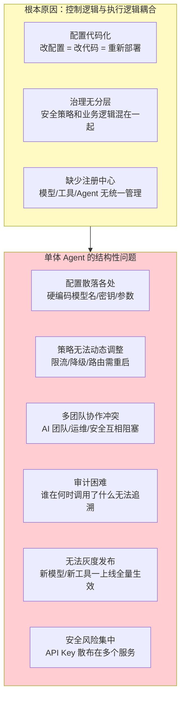
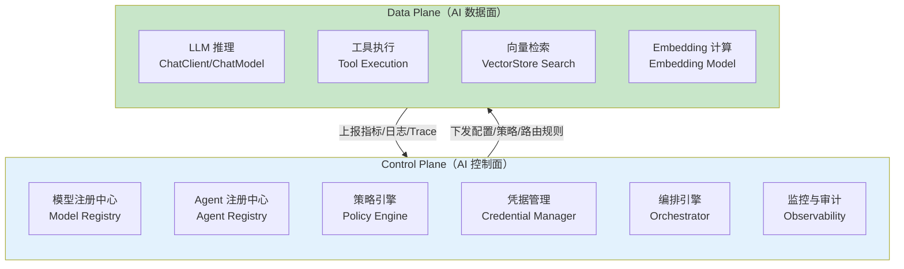
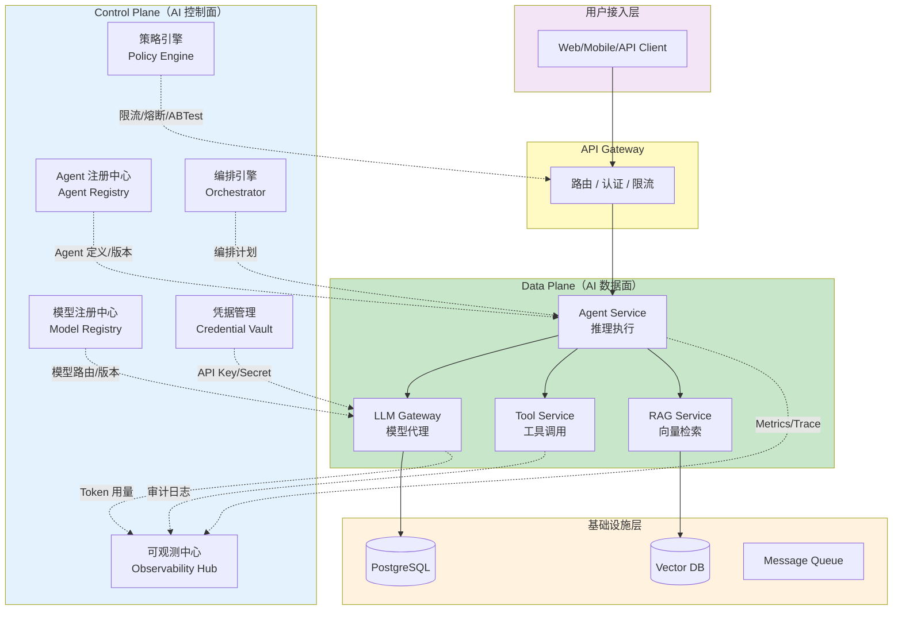
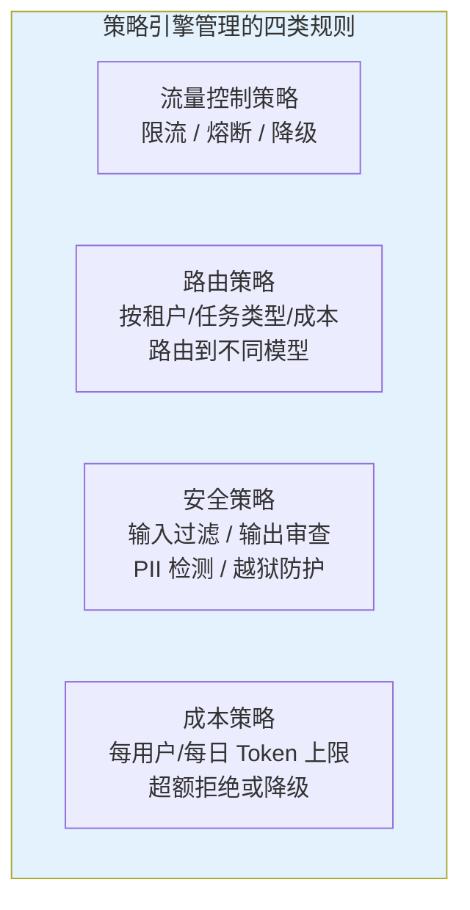
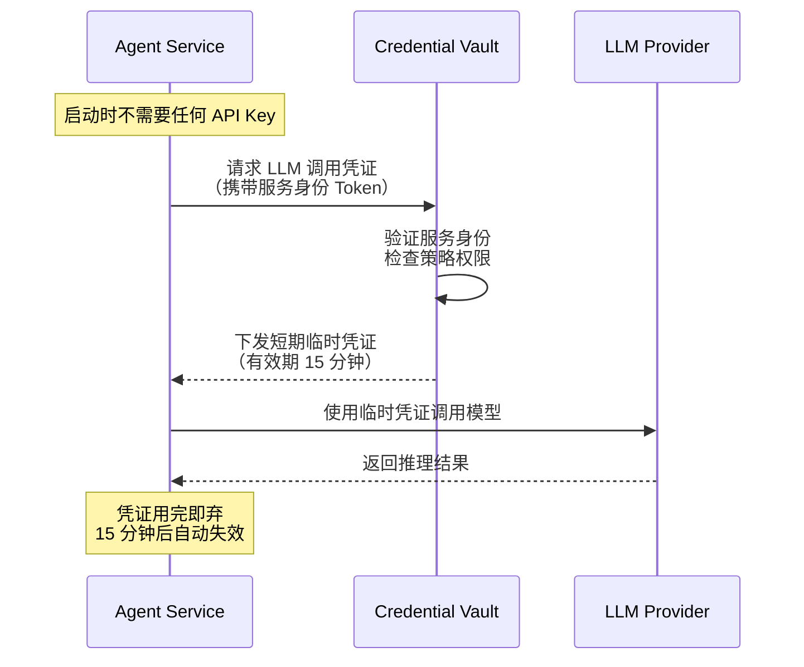
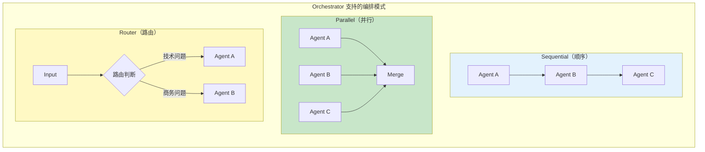
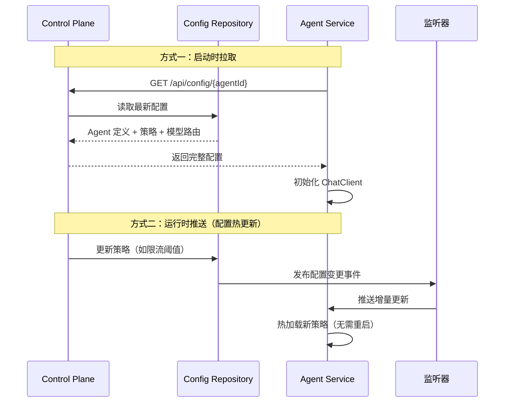

# 14-管控分离架构

> **定位**：讲透 Agent 系统的 Control Plane（控制面）与 Data Plane（数据面）架构分离模式——为什么 AI 系统需要管控分离、控制面的核心组件、在 Spring AI 2.0 项目中如何落地。读完这篇，你能设计出企业级可治理的 Agent 架构。
>
> **读者画像**：已经掌握 Spring AI 核心能力（ChatClient、工具调用、RAG、记忆管理），正在设计企业级多 Agent 系统，需要解决配置管理、策略治理、安全凭据、动态编排等问题。
>
> **前置阅读**：[05-RAG 检索增强生成](05-RAG检索增强生成.md)。

---

## 1. 为什么 Agent 系统需要管控分离

### 1.1 传统单体 Agent 的困境

在早期 Agent 开发中，所有逻辑揉在一个进程里——模型选择、工具注册、策略控制、推理执行全部耦合。这种"一体化"方式在 Demo 阶段足够简单，但进入企业生产环境后，会暴露一系列结构性问题：



这些问题的根因是一个：**控制逻辑（该用什么模型、什么策略、谁能调用什么）和执行逻辑（真正做推理、检索、工具调用）没有分离**。

### 1.2 从网络世界借鉴的经典智慧

管控分离不是新概念。在多个成熟的工程领域中，这一模式已被验证为处理复杂系统的核心方法论：

| 领域 | Control Plane 做什么 | Data Plane 做什么 |
|------|---------------------|-------------------|
| **SDN（软件定义网络）** | 路由计算、拓扑管理、策略下发 | 包转发、流量交换 |
| **Kubernetes** | API Server / Scheduler / Controller Manager | Kubelet / Container Runtime |
| **Service Mesh（Istio）** | Pilot（路由规则）、Citadel（证书） | Envoy Sidecar（转发请求） |
| **数据库系统** | 查询优化器、事务管理器 | 存储引擎、Buffer Pool |

核心思想一致：**控制面负责"决策"（该做什么），数据面负责"执行"（实际去做）**。控制面是大脑，数据面是肌肉。

### 1.3 AI 时代的 Control Plane

将这一理念引入 Agent 系统后：



**Control Plane 不直接参与推理**——它配置"该用什么模型"、"什么策略"、"谁能访问什么"。**Data Plane 不关心策略决策**——它只是忠实地执行控制面下发的规则，完成实际的 AI 工作。

---

## 2. 管控分离架构全景图

下面是 Agent 系统中管控分离的完整架构，展示控制面各组件如何与数据面交互：



**虚线 = 控制信号**（配置、策略、路由——低频但关键）。**实线 = 数据流**（实际推理请求——高频但简单）。这就是管控分离的视觉表达：控制面和数据面在物理上是分离的，通过明确定义的接口通信。

---

## 3. Control Plane 核心组件详解

### 3.1 模型注册中心（Model Registry）

模型注册中心是 AI 控制面的"模型目录"。它管理所有可用 LLM 的元数据：名称、提供商、版本、能力描述、定价、上下文窗口、是否支持流式输出。

```java
// Spring AI 2.0.0
// 模型注册中心的核心数据模型
public record ModelDefinition(
    String modelId,           // 唯一标识，如 "deepseek-chat-v2"
    String displayName,       // 展示名称
    String provider,          // 提供商，如 "deepseek" / "openai-compatible"
    String endpoint,          // API 地址
    int contextWindow,        // 上下文窗口大小
    boolean streamingCapable, // 是否支持流式输出
    boolean toolCapable,      // 是否支持工具调用
    double inputCostPer1M,    // 每百万 Token 输入成本
    double outputCostPer1M,   // 每百万 Token 输出成本
    ModelStatus status,       // ACTIVE / DEPRECATED / EXPERIMENTAL
    Map<String, String> tags  // 标签：用于路由，如 tier=premium
) {}

public enum ModelStatus {
    ACTIVE,        // 正式可用
    DEPRECATED,    // 即将下线，新请求不再路由到此模型
    EXPERIMENTAL,  // 实验中，仅灰度流量
    DISABLED       // 已禁用
}
```

模型注册中心的核心职责是提供**模型发现和版本管理**能力。Agent Service 在启动时或运行时从注册中心拉取可用模型列表，而不是在代码中硬编码模型名。

```java
// Spring AI 2.0.0
// 模型注册中心服务
@Service
public class ModelRegistryService {

    private final ModelDefinitionRepository repository;

    public ModelRegistryService(ModelDefinitionRepository repository) {
        this.repository = repository;
    }

    // 根据条件查找合适的模型
    public ModelDefinition findModel(ModelQuery query) {
        return repository.findActiveModels().stream()
                .filter(m -> m.streamingCapable() || !query.requiresStreaming())
                .filter(m -> m.toolCapable() || !query.requiresToolCalling())
                .filter(m -> m.contextWindow() >= query.minContextWindow())
                .filter(m -> query.tags().isEmpty() || m.tags().entrySet()
                        .containsAll(query.tags().entrySet()))
                .min(Comparator.comparingDouble(m ->
                        estimateCost(m, query.estimatedInputTokens())))
                .orElseThrow(() -> new ModelNotFoundException(
                        "No model matches query: " + query));
    }

    // 模型版本灰度切换
    public void promoteModel(String modelId, ModelStatus newStatus) {
        ModelDefinition model = repository.findById(modelId)
                .orElseThrow(() -> new ModelNotFoundException(modelId));
        repository.save(new ModelDefinition(
                model.modelId(), model.displayName(), model.provider(),
                model.endpoint(), model.contextWindow(), model.streamingCapable(),
                model.toolCapable(), model.inputCostPer1M(), model.outputCostPer1M(),
                newStatus, model.tags()
        ));
    }

    private double estimateCost(ModelDefinition m, int tokens) {
        return (tokens / 1_000_000.0) * (m.inputCostPer1M() + m.outputCostPer1M());
    }
}
```

**为什么需要模型注册中心？** 因为在多模型环境中，模型会频繁迭代——新版本上线、旧版本下线、不同任务用不同模型。如果没有集中注册，每个 Agent 服务各自硬编码模型名，变更时需要逐个修改、重新部署。有了注册中心，只需在控制面修改一次，所有数据面服务自动感知。

### 3.2 Agent 注册中心（Agent Registry）

Agent 注册中心管理所有 Agent 的定义：名称、描述、系统提示词、绑定工具列表、绑定模型、记忆策略。

```java
// Spring AI 2.0.0
// Agent 定义——控制面管理的核心实体
public record AgentDefinition(
    String agentId,            // 唯一标识，如 "customer-service-agent"
    String displayName,        // "客服 Agent"
    String description,        // Agent 能力描述
    String systemPrompt,       // 系统提示词
    String preferredModel,     // 首选模型 ID（关联 ModelRegistry）
    List<String> toolIds,      // 绑定的工具 ID 列表
    String memoryStrategy,     // 记忆策略：short-term / long-term / none
    int maxTurns,              // 最大对话轮次
    AgentStatus status,        // ACTIVE / INACTIVE
    int version                // 版本号（支持灰度发布）
) {}
```

```java
// Spring AI 2.0.0
// Agent 注册中心——控制面的核心组件
@Service
public class AgentRegistryService {

    private final AgentDefinitionRepository repository;

    public AgentRegistryService(AgentDefinitionRepository repository) {
        this.repository = repository;
    }

    // 根据 ID 获取 Agent 定义（带版本）
    public AgentDefinition getAgent(String agentId, String version) {
        if ("latest".equals(version)) {
            return repository.findLatestActive(agentId)
                    .orElseThrow(() -> new AgentNotFoundException(agentId));
        }
        return repository.findByIdAndVersion(agentId, version)
                .orElseThrow(() -> new AgentNotFoundException(agentId + ":" + version));
    }

    // 注册新 Agent 或新版本
    public AgentDefinition register(AgentDefinition definition) {
        int nextVersion = repository.findMaxVersion(definition.agentId()) + 1;
        AgentDefinition newVersion = new AgentDefinition(
                definition.agentId(), definition.displayName(),
                definition.description(), definition.systemPrompt(),
                definition.preferredModel(), definition.toolIds(),
                definition.memoryStrategy(), definition.maxTurns(),
                AgentStatus.ACTIVE, nextVersion
        );
        return repository.save(newVersion);
    }

    // 灰度发布：按比例路由到新版本
    public void setCanaryRatio(String agentId, int version, double ratio) {
        repository.setCanaryRatio(agentId, version, ratio);
    }
}
```

Agent 注册中心的价值在于**Agent 的生命周期管理**。你可以像管理微服务一样管理 Agent：版本化、灰度发布、A/B 测试、回滚。某个 Agent 出了问题？在注册中心一键回滚到上一个版本，不需要重新部署代码。

### 3.3 策略引擎（Policy Engine）

策略引擎是控制面的"交通规则"——它定义谁能在什么条件下以什么方式使用 AI 能力。包含四类策略：



```java
// Spring AI 2.0.0
// 策略引擎核心接口
public interface Policy {

    // 策略评估：给定请求上下文，返回决策
    PolicyDecision evaluate(PolicyContext context);

    String getPolicyId();
    PolicyType getType();
    int getPriority();  // 优先级，数字越小越先执行
}

public record PolicyContext(
    String userId,
    String tenantId,
    String agentId,
    String modelId,
    int estimatedTokens,
    String userInput,
    Map<String, Object> attributes
) {}

public record PolicyDecision(
    Decision decision,        // ALLOW / DENY / DOWNGRADE
    String reason,            // 决策原因
    String downgradeModel,    // 降级时推荐使用的模型
    Map<String, String> headers  // 附加 headers 传给数据面
) {}

public enum Decision { ALLOW, DENY, DOWNGRADE }
```

```java
// Spring AI 2.0.0
// 示例：成本控制策略——每用户每日 Token 上限
@Component
public class DailyTokenLimitPolicy implements Policy {

    private final TokenUsageRepository usageRepo;

    public DailyTokenLimitPolicy(TokenUsageRepository usageRepo) {
        this.usageRepo = usageRepo;
    }

    @Override
    public PolicyDecision evaluate(PolicyContext ctx) {
        int todayUsage = usageRepo.getDailyUsage(ctx.userId(), LocalDate.now());
        int limit = getUserLimit(ctx.userId());

        if (todayUsage + ctx.estimatedTokens() > limit) {
            // 超额：降级到更便宜的模型而非直接拒绝
            return new PolicyDecision(
                    Decision.DOWNGRADE,
                    "Daily token limit exceeded (" + todayUsage + "/" + limit + ")",
                    "deepseek-chat-lite",
                    Map.of()
            );
        }
        return new PolicyDecision(Decision.ALLOW, "Within limit", null, Map.of());
    }

    @Override
    public String getPolicyId() { return "daily-token-limit"; }

    @Override
    public PolicyType getType() { return PolicyType.COST; }

    @Override
    public int getPriority() { return 50; }

    private int getUserLimit(String userId) {
        return 100_000; // 默认 10 万 Token/天
    }
}
```

```java
// Spring AI 2.0.0
// 策略引擎——按优先级链式执行所有匹配策略
@Service
public class PolicyEngine {

    private final List<Policy> policies;

    public PolicyEngine(List<Policy> policies) {
        this.policies = policies.stream()
                .sorted(Comparator.comparingInt(Policy::getPriority))
                .toList();
    }

    public PolicyDecision evaluate(PolicyContext context) {
        String effectiveModel = context.modelId();

        for (Policy policy : policies) {
            if (!matches(policy, context)) continue;

            PolicyDecision decision = policy.evaluate(context);
            switch (decision.decision()) {
                case DENY -> {
                    return decision;  // 直接拒绝，短路返回
                }
                case DOWNGRADE -> {
                    effectiveModel = decision.downgradeModel();
                    // 继续评估其他策略（安全策略不能跳过）
                }
                case ALLOW -> { /* 继续评估 */ }
            }
        }

        return new PolicyDecision(Decision.ALLOW, "All policies passed",
                effectiveModel, Map.of());
    }

    private boolean matches(Policy policy, PolicyContext ctx) {
        // 根据策略的适用范围判断是否生效
        return true;  // 简化示例
    }
}
```

策略引擎的关键设计是**策略可热更新**。限流阈值从 100 QPS 调整到 200 QPS，不需要重启服务——只需在策略引擎的配置中修改，所有数据面服务实时生效。这是管控分离的核心价值之一。

### 3.4 凭据管理（Credential Vault）

凭据管理是控制面中安全性最高的组件。它集中保管所有 API Key、数据库密码、第三方 Token，并通过短期凭证下发机制避免密钥散布。



```java
// Spring AI 2.0.0
// 凭据管理服务
@Service
public class CredentialVaultService {

    private final SecretBackend secretBackend;  // 如 Vault / AWS Secrets Manager
    private final TokenSigner tokenSigner;

    public CredentialVaultService(SecretBackend secretBackend, TokenSigner tokenSigner) {
        this.secretBackend = secretBackend;
        this.tokenSigner = tokenSigner;
    }

    // 获取临时 LLM 凭证
    public LLMCredential issueCredential(String serviceId, String modelProvider) {
        // 1. 验证服务身份
        ServiceIdentity identity = authenticateService(serviceId);

        // 2. 检查该服务是否有权使用此 provider
        if (!identity.canAccess(modelProvider)) {
            throw new AccessDeniedException(
                    serviceId + " cannot access " + modelProvider);
        }

        // 3. 从后端获取真实 API Key
        String apiKey = secretBackend.getSecret("llm/" + modelProvider + "/api-key");

        // 4. 签发短期 JWT 代理凭证（包含真实 Key 或其引用）
        String proxyToken = tokenSigner.sign(JWTPayload.builder()
                .serviceId(serviceId)
                .provider(modelProvider)
                .expiresAt(Instant.now().plus(Duration.ofMinutes(15)))
                .keyReference(secretBackend.getKeyReference(apiKey))
                .build());

        return new LLMCredential(proxyToken, Duration.ofMinutes(15));
    }
}

public record LLMCredential(String token, Duration validFor) {}
```

**核心安全原则**：数据面服务永远不持有原始 API Key。它们通过服务身份向凭据中心请求短期凭证，凭证使用完毕或超时后自动失效。即使某个数据面服务被攻破，攻击者拿到的也只是一个 15 分钟内有效的临时 Token。

### 3.5 编排引擎（Orchestrator）

编排引擎管理多 Agent 协作和复杂任务流程。它定义"先做什么、再做什么、哪个 Agent 负责什么"。

```java
// Spring AI 2.0.0
// 编排计划定义
public record OrchestrationPlan(
    String planId,
    String triggerAgent,              // 触发此计划的 Agent
    List<OrchestrationStep> steps,    // 执行步骤
    OrchestrationPattern pattern,     // 编排模式
    Map<String, Object> variables     // 上下文变量
) {}

public record OrchestrationStep(
    int order,                        // 执行顺序
    String agentId,                   // 负责此步骤的 Agent
    String inputTemplate,             // 输入模板（可引用上一步输出）
    List<String> dependsOn,           // 依赖的前置步骤（用于并行编排）
    String outputVariable             // 输出变量名（供后续步骤引用）
) {}

public enum OrchestrationPattern {
    SEQUENTIAL,   // 顺序执行
    PARALLEL,     // 并行执行
    PIPELINE,     // 管道（前一步输出是后一步输入）
    ROUTER,       // 路由（根据输入选择不同分支）
    FAN_OUT_FAN_IN  // 扇出-扇入
}
```



```java
// Spring AI 2.0.0
// 编排引擎执行器
@Service
public class OrchestrationEngine {

    private final AgentRegistryService agentRegistry;
    private final AgentExecutionClient executionClient;

    public OrchestrationEngine(AgentRegistryService agentRegistry,
                                AgentExecutionClient executionClient) {
        this.agentRegistry = agentRegistry;
        this.executionClient = executionClient;
    }

    public OrchestrationResult execute(OrchestrationPlan plan, String userInput) {
        Map<String, String> variables = new HashMap<>(plan.variables());
        variables.put("user_input", userInput);

        List<OrchestrationStep> sortedSteps = sortByDependency(plan.steps());

        for (OrchestrationStep step : sortedSteps) {
            // 等待依赖步骤完成
            String resolvedInput = resolveTemplate(step.inputTemplate(), variables);

            AgentDefinition agent = agentRegistry.getAgent(step.agentId(), "latest");

            String output = executionClient.execute(agent, resolvedInput);

            variables.put(step.outputVariable(), output);
        }

        return new OrchestrationResult(variables);
    }

    private List<OrchestrationStep> sortByDependency(List<OrchestrationStep> steps) {
        // 拓扑排序：按依赖关系排列步骤
        // 无依赖的步骤可以并行执行（此处简化为顺序）
        return steps.stream()
                .sorted(Comparator.comparingInt(OrchestrationStep::order))
                .toList();
    }

    private String resolveTemplate(String template, Map<String, String> variables) {
        String result = template;
        for (Map.Entry<String, String> entry : variables.entrySet()) {
            result = result.replace("${" + entry.getKey() + "}", entry.getValue());
        }
        return result;
    }
}
```

### 3.6 可观测中心（Observability Hub）

可观测中心聚合所有数据面的 Metrics、Trace、Log，提供全局视角。这不是简单的日志收集，而是 AI 系统专属的监控能力——Token 成本追踪、模型延迟分布、Agent 调用链路、工具执行审计。

> 关于可观测性的完整方案，详见 [16-全链路可观测性](16-全链路可观测性.md)。

---

## 4. 在 Spring AI 项目中落地管控分离

### 4.1 整体项目结构

将管控分离落地到 Spring AI 项目中，需要将代码组织为以下模块结构：

```
ai-platform/
├── control-plane/                 # 控制面
│   ├── model-registry/            # 模型注册中心
│   ├── agent-registry/            # Agent 注册中心
│   ├── policy-engine/             # 策略引擎
│   ├── credential-vault/          # 凭据管理
│   └── orchestrator/              # 编排引擎
│
├── data-plane/                    # 数据面
│   ├── agent-service/             # Agent 推理服务
│   ├── tool-service/              # 工具执行服务
│   ├── rag-service/               # 检索增强服务
│   └── llm-gateway/               # LLM 网关（模型代理）
│
├── gateway/                       # API 网关
│   └── ai-gateway/
│
└── shared/                        # 共享库
    ├── contracts/                 # 接口定义/DTO
    └── observability/             # 可观测工具库
```

### 4.2 控制面配置下发机制

控制面通过两种方式将配置和策略下发给数据面：



```java
// Spring AI 2.0.0
// 数据面 Agent 服务——从控制面拉取配置
@Service
public class ControlPlaneConfigLoader {

    private final ControlPlaneClient controlPlaneClient;
    private final ChatClient.Builder chatClientBuilder;

    // Agent 定义缓存
    private volatile AgentDefinition currentAgentDefinition;
    // 当前生效的策略列表
    private volatile List<Policy> activePolicies;

    public ControlPlaneConfigLoader(ControlPlaneClient controlPlaneClient,
                                     ChatClient.Builder chatClientBuilder) {
        this.controlPlaneClient = controlPlaneClient;
        this.chatClientBuilder = chatClientBuilder;
    }

    @PostConstruct
    public void initialize() {
        // 1. 从控制面拉取 Agent 定义
        this.currentAgentDefinition = controlPlaneClient
                .getAgentDefinition("customer-service-agent");

        // 2. 拉取该 Agent 关联的策略
        this.activePolicies = controlPlaneClient
                .getPolicies(currentAgentDefinition.agentId());

        // 3. 拉取模型路由信息
        ModelRoute route = controlPlaneClient
                .getModelRoute(currentAgentDefinition.preferredModel());

        // 4. 使用控制面配置构建 ChatClient
        // 注意：API Key 不在此处配置，由 LLM Gateway 统一注入
    }

    @Scheduled(fixedDelay = 30_000)  // 每 30 秒检查配置更新
    public void refreshConfig() {
        AgentDefinition latest = controlPlaneClient
                .getAgentDefinition(currentAgentDefinition.agentId());

        if (latest.version() != currentAgentDefinition.version()) {
            // 版本变更：热加载新定义
            this.currentAgentDefinition = latest;
            reloadChatClient(latest);
        }

        List<Policy> latestPolicies = controlPlaneClient
                .getPolicies(currentAgentDefinition.agentId());
        this.activePolicies = latestPolicies;
    }

    private void reloadChatClient(AgentDefinition def) {
        // 根据新定义重建 ChatClient（系统提示词、工具绑定等）
        // 此处省略重建逻辑
    }
}
```

### 4.3 策略拦截器：在数据面执行控制面策略

数据面在执行推理前，必须先经过控制面下发的策略检查。通过 Advisor 链实现拦截：

```java
// Spring AI 2.0.0
// 策略拦截 Advisor——在 ChatClient 调用链中执行控制面策略
public class PolicyEnforcementAdvisor implements BaseAdvisor {

    private final PolicyEngine policyEngine;

    public PolicyEnforcementAdvisor(PolicyEngine policyEngine) {
        this.policyEngine = policyEngine;
    }

    @Override
    public AdvisedResponse adviseRequest(AdvisedRequest request,
                                          Map<String, Object> context) {
        // 构造策略上下文
        PolicyContext policyCtx = new PolicyContext(
                (String) context.get("userId"),
                (String) context.get("tenantId"),
                (String) context.get("agentId"),
                request.chatOptions() != null
                        ? request.chatOptions().getModel() : "default",
                estimateTokens(request.userText()),
                request.userText(),
                context
        );

        // 执行策略评估
        PolicyDecision decision = policyEngine.evaluate(policyCtx);

        switch (decision.decision()) {
            case DENY -> {
                throw new PolicyViolationException(decision.reason());
            }
            case DOWNGRADE -> {
                // 切换到策略引擎指定的降级模型
                context.put("originalModel", policyCtx.modelId());
                context.put("downgradeReason", decision.reason());
                // 通过 ChatOptions 覆盖模型选择
                return AdvisedRequest.from(request)
                        .withChatOptions(ChatOptionsBuilder.builder()
                                .model(decision.downgradeModel())
                                .build())
                        .build();
            }
            case ALLOW -> {
                // 正常通过
                return request;
            }
            default -> {
                return request;
            }
        }
    }

    private int estimateTokens(String text) {
        // 粗略估算：1 个中文字约 2 Token，1 个英文单词约 1.3 Token
        return (int) (text.length() * 1.5);
    }
}
```

### 4.4 LLM Gateway：统一模型代理

LLM Gateway 是数据面中模型调用的唯一出口。所有 Agent 服务不直接调用 LLM API，而是通过 Gateway 转发。Gateway 负责：注入 API Key、记录 Token 用量、执行模型路由、缓存重复请求。

```java
// Spring AI 2.0.0
// LLM Gateway——数据面的模型代理
@RestController
@RequestMapping("/gateway/llm")
public class LLMGatewayController {

    private final CredentialVaultService credentialVault;
    private final ModelRegistryService modelRegistry;
    private final TokenUsageRecorder usageRecorder;
    private final WebClient webClient;

    public LLMGatewayController(CredentialVaultService credentialVault,
                                 ModelRegistryService modelRegistry,
                                 TokenUsageRecorder usageRecorder,
                                 WebClient webClient) {
        this.credentialVault = credentialVault;
        this.modelRegistry = modelRegistry;
        this.usageRecorder = usageRecorder;
        this.webClient = webClient;
    }

    @PostMapping("/chat/completions")
    public Mono<String> chatCompletion(@RequestBody ChatCompletionRequest request,
                                        @RequestHeader("X-Service-Id") String serviceId) {
        // 1. 查找模型定义
        ModelDefinition model = modelRegistry.findModel(
                ModelQuery.forModel(request.model()));

        // 2. 获取短期凭证
        LLMCredential credential = credentialVault
                .issueCredential(serviceId, model.provider());

        // 3. 转发到真实 LLM API（OpenAI 兼容格式，DeepSeek 等）
        return webClient.post()
                .uri(model.endpoint() + "/v1/chat/completions")
                .header("Authorization", "Bearer " + credential.token())
                .bodyValue(request)
                .retrieve()
                .bodyToMono(String.class)
                .doOnSuccess(resp -> {
                    // 4. 记录 Token 用量（用于成本核算）
                    TokenUsage usage = parseUsage(resp);
                    usageRecorder.record(serviceId, model.modelId(), usage);
                });
    }

    private TokenUsage parseUsage(String response) {
        // 从 LLM 响应中解析 token usage
        // 简化示例
        return new TokenUsage(0, 0, 0);
    }
}
```

### 4.5 完整的 Bean 配置

将所有控制面组件整合到 Spring 配置中：

```java
// Spring AI 2.0.0
@Configuration
public class ControlPlaneConfiguration {

    @Bean
    ModelRegistryService modelRegistry(ModelDefinitionRepository repo) {
        return new ModelRegistryService(repo);
    }

    @Bean
    AgentRegistryService agentRegistry(AgentDefinitionRepository repo) {
        return new AgentRegistryService(repo);
    }

    @Bean
    PolicyEngine policyEngine(List<Policy> policies) {
        return new PolicyEngine(policies);
    }

    @Bean
    CredentialVaultService credentialVault(SecretBackend backend,
                                            TokenSigner signer) {
        return new CredentialVaultService(backend, signer);
    }

    @Bean
    OrchestrationEngine orchestrator(AgentRegistryService registry,
                                      AgentExecutionClient client) {
        return new OrchestrationEngine(registry, client);
    }
}
```

```java
// Spring AI 2.0.0
@Configuration
public class DataPlaneConfiguration {

    @Bean
    ChatClient chatClient(ChatClient.Builder builder,
                          PolicyEngine policyEngine,
                          AgentDefinition agentDef) {
        return builder
                .defaultSystem(agentDef.systemPrompt())
                .defaultAdvisors(
                        new PolicyEnforcementAdvisor(policyEngine),
                        // ... 其他 Advisor
                )
                .defaultTools(loadTools(agentDef.toolIds()))
                .build();
    }

    private ToolCallback[] loadTools(List<String> toolIds) {
        // 从工具服务加载工具定义
        // 简化示例
        return new ToolCallback[0];
    }
}
```

---

## 5. 管控分离的运维优势

### 5.1 动态模型切换

传统方式下，切换模型（如从 DeepSeek-V2 切到 V3）需要修改代码、重新部署。有了控制面：

```
操作：在 Model Registry 中将 deepseek-v3 的 status 从 EXPERIMENTAL 改为 ACTIVE
       同时将 deepseek-v2 改为 DEPRECATED
效果：所有 Agent 服务在下次配置刷新时自动切换到 V3
       无需重启任何服务
```

### 5.2 策略热更新

```
操作：在 Policy Engine 中将限流阈值从 100 QPS 调整为 200 QPS
效果：30 秒内所有 Agent 服务生效新阈值
     无需修改代码、无需重新部署
```

### 5.3 灰度发布

```
操作：在 Agent Registry 中将 customer-service-agent v2 的 canary_ratio 设为 10%
效果：10% 的流量路由到新版本 Agent
       90% 的流量仍使用 v1
       观察 1 小时后无异常，逐步提升到 50%、100%
```

### 5.4 安全凭据轮换

```
操作：在 Credential Vault 中更新 DeepSeek 的 API Key
效果：所有数据面服务在 15 分钟内（旧凭证过期后）自动获取新 Key
       攻击窗口最小化
       无需人工逐个修改配置
```

---

## 6. 管控分离 vs 单体架构的对比

| 维度 | 单体架构 | 管控分离架构 |
|------|---------|-------------|
| **配置管理** | 硬编码在 application.yml | 控制面集中管理，热更新 |
| **模型切换** | 修改代码 + 重新部署 | 注册中心一键切换 |
| **策略调整** | 修改代码 + 重新部署 | 策略引擎实时生效 |
| **API Key 安全** | 散布在各服务配置中 | 集中保管，短期凭证下发 |
| **多团队协作** | AI 团队全权控制 | AI/运维/安全各管一面 |
| **灰度发布** | 难以实现 | Agent 版本 + 流量比例控制 |
| **审计能力** | 日志散落 | 可观测中心统一聚合 |
| **初始复杂度** | 低 | 高（需建控制面基础设施） |
| **长期维护成本** | 高（每次变更需部署） | 低（配置级别变更） |

---

## 7. 适用场景与不适用场景

### 适用场景

- **多 Agent 企业系统**：3 个以上 Agent 协同工作，需要统一管理
- **多模型环境**：同时使用多个 LLM（DeepSeek + 其他模型），需要统一路由
- **多租户 SaaS**：不同租户有不同模型、策略、成本限制
- **高安全要求**：金融、医疗等行业，需要凭据集中管控和全链路审计
- **频繁迭代**：模型、工具、策略经常变更，需要快速发布和回滚
- **多团队协作**：AI 团队、运维团队、安全团队需要分工治理

### 不适用场景

- **单 Agent Demo**：只有一个简单 Agent，控制面开销大于收益
- **学习/实验项目**：理解 Spring AI 核心概念阶段，不需要管控复杂度
- **短期 POC**：验证可行性阶段，直接硬编码更快
- **单团队小项目**：1-2 个开发者，沟通成本低，控制面反而增加协调成本
- **极低流量**：日均调用量不超过几百次的内部工具

---

## 8. 本章总结

| 概念 | 一句话 |
|------|--------|
| **管控分离** | 控制面负责"决策"（配置、策略、编排），数据面负责"执行"（推理、检索、工具调用） |
| **Control Plane** | AI 系统的大脑——不直接推理，只管理"该用什么模型、什么策略、谁能调用什么" |
| **Data Plane** | AI 系统的肌肉——不关心策略决策，只执行控制面下发的规则 |
| **Model Registry** | 模型注册中心——集中管理所有 LLM 的元数据和生命周期 |
| **Agent Registry** | Agent 注册中心——版本化管理 Agent 定义，支持灰度发布和回滚 |
| **Policy Engine** | 策略引擎——限流、路由、安全、成本四类策略的统一执行点 |
| **Credential Vault** | 凭据管理——API Key 集中保管，短期凭证下发，密钥不散布 |
| **Orchestrator** | 编排引擎——管理多 Agent 协作的步骤和流程 |
| **LLM Gateway** | LLM 网关——数据面模型调用的唯一出口，统一注入凭据和记录用量 |
| **配置热更新** | 控制面修改配置后，数据面秒级生效，无需重启 |
| **策略拦截 Advisor** | 在 ChatClient 调用链中插入策略检查点，DENY/DOWNGRADE/ALLOW |

---

> **下一篇**：[15-微服务拆分与 Agent 部署](15-微服务拆分与Agent部署.md) — Agent 服务、工具服务、LLM 网关如何独立部署，服务间通信与 Spring Cloud 集成。
>
> **想深入**：[16-全链路可观测性](16-全链路可观测性.md) — 控制面可观测中心的数据来源和 Span 全链路追踪。
>
> **想深入**：[17-工具执行可观测与审计](17-工具执行可观测与审计.md) — 工具调用的安全审计需求与控制面策略引擎的关系。
