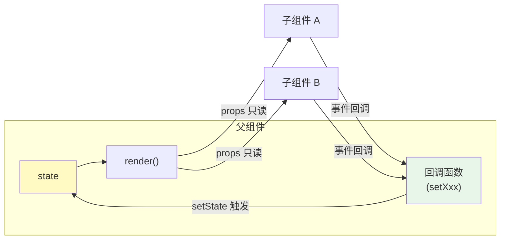
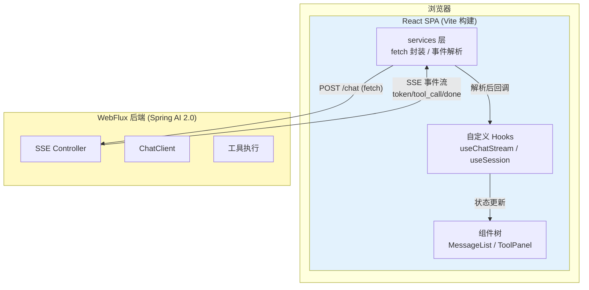

# 41-React 入门与现代前端工程

> **定位**：本文是 React 学习路线的第一篇——从 Java 开发者视角讲透 React 的核心心智模型与现代前端工程，为后续 Agent 前端（流式 UI、Agentic UI）打地基。读者画像：熟悉 Java/Spring 但前端经验有限或停留在 jQuery/JSP 时代的中高级开发者。前置阅读：无（本篇自包含）；后端衔接篇见 [教程 10-SSE流式通信 §5]。
>
> **为什么 Java 架构师要学 React**：2026 年的企业级 Agent 系统，前端不再是"一个聊天框"——工具调用中间态、审批流、多会话管理、流式思考过程展示，这些 Agentic UI 的复杂度已经接近一个中型前端应用。架构师若看不懂前端的数据流和状态模型，就无法设计出合理的前后端事件协议（这正是 [教程 18-Agentic-UI设计] 的核心主题）。

---

## 1. 从 Java 视角理解 React：一场声明式的思维转换

### 1.1 命令式 vs 声明式

Java 开发者最熟悉的 UI 编程是命令式的（如 Swing/JQuery）：

```java
// 命令式：你告诉机器"怎么做"
label.setText("加载中...");
button.setEnabled(false);
listPanel.removeAll();
for (Item item : items) {
    listPanel.add(new ItemRow(item));
}
panel.revalidate();
```

React 是声明式的——你只描述"UI 应该长什么样（给定状态）"，框架负责把 DOM 从当前状态变到目标状态：

```tsx
// 声明式：你告诉机器"结果是什么"
function AgentPanel({ status, items }: AgentPanelProps) {
  return (
    <div>
      <p>{status === 'loading' ? '加载中...' : '就绪'}</p>
      <ul>
        {items.map(item => <ItemRow key={item.id} item={item} />)}
      </ul>
    </div>
  );
}
```

`UI = f(state)` 是 React 的核心公式。状态变了，React 自动重算 UI。对 Java 开发者，最贴近的类比是：

| React 概念 | Java 世界类比 | 差异点 |
|-----------|--------------|--------|
| 组件 | 类 / 静态内部类 | 组件是"函数 + 状态"，不是实例 |
| `props` | 构造函数参数 / 不可变入参 | 只读，父→子单向流动 |
| `state` | 可变成员字段 | 不可变更新（类似替换整个 record 实例） |
| 重新渲染 | `toString()` 重新生成 | 框架自动做 DOM diff |
| Hooks | 装饰器 / 模板方法 | 在函数组件里"挂接"生命周期 |
| Context | Spring ApplicationContext | 显式注入，避免 props 逐层透传 |
| 受控组件 | 表单绑定到 POJO | 输入框的值永远来自 state |

**关键心智转换**：Java 里我们习惯"持有引用、原地修改"；React 里状态更新必须**创建新对象/新数组**（`[...old, item]` 而非 `old.push(item)`），因为 React 用引用相等性判断是否需要重渲染——这与 Java 21 Record 的不可变哲学高度一致（参见 [附录 00-Java21新特性/01-Record与模式匹配 §1]）。

### 1.2 单向数据流



数据只能从父流向子（props），子想改数据只能调用父传下来的回调。这就是"单向数据流"——它让数据来源可追溯，避免了双向绑定的"改了这个值，不知道是谁改的"问题。对架构师的价值：**前端的数据流向图就是你的架构图的一部分**，复杂 Agent 前端的数据流必须在设计期画出来（见 §7）。

### 1.3 虚拟 DOM 与协调

React 不直接操作 DOM。每次渲染生成一棵虚拟 DOM 树，React 用 Diff 算法（称为协调，Reconciliation）比较新旧树，只把差异部分应用到真实 DOM。

对性能敏感的 Agent 前端（每秒几十个 token 流式更新），理解这一点至关重要：
- 列表渲染必须提供 `key`（稳定 ID，不要用数组索引）——否则 token 追加时整个列表重建
- Diff 是同层比较——组件类型变了（`<div>` 变 `<section>`），整棵子树重建
- `key` 用索引的场景：列表静态且不重排（Agent 消息列表**不适用**，消息会插入历史）

---

## 2. 组件：函数式一统天下

### 2.1 函数组件与 JSX

2026 年的 React（19.x）中，类组件只存在于遗留代码。函数组件 + Hooks 是唯一推荐写法：

```tsx
// TypeScript + 函数组件
interface Message {
  id: string;
  role: 'user' | 'assistant' | 'tool';
  content: string;
}

function MessageList({ messages }: { messages: Message[] }) {
  return (
    <div className="message-list">
      {messages.map(msg => (
        <div key={msg.id} className={`msg msg-${msg.role}`}>
          {msg.content}
        </div>
      ))}
    </div>
  );
}
```

JSX 不是模板语言——它是 JavaScript 表达式的语法糖，`<div>...</div>` 编译后就是函数调用 `jsx('div', {...})`。所以 JSX 里能用任何 JS 表达式：条件渲染用 `&&` / 三元，循环用 `.map()`，这比任何模板引擎（Thymeleaf/Freemarker）都直接。

### 2.2 Props 与组合

```tsx
// props 解构 + 默认值 + children
interface CardProps {
  title: string;
  collapsible?: boolean;      // 可选 prop，TypeScript 标注
  children: React.ReactNode;  // 类似 Java 泛型通配符的内容插槽
}

function Card({ title, collapsible = false, children }: CardProps) {
  return (
    <section>
      <header>{title}{collapsible && <CollapseButton />}</header>
      {children}
    </section>
  );
}

// 使用：<Card title="工具调用记录">...</Card> 之间的内容就是 children
```

**组合优于继承**——React 社区与《Effective Java》在此观点一致。没有组件继承，只有组合：`<Card>` 包 `<ToolCallTimeline>` 包 `<JsonViewer>`。Agent 前端的常见错误是把一个大组件写到底（前端的 God Component 反模式，呼应 [教程 40-Agent架构反模式 §God Agent]）。

### 2.3 组件拆分原则

什么时候该拆组件？三个信号：
1. **状态隔离**：一块 UI 的状态与其他部分无关（如"工具调用详情抽屉"的展开状态）
2. **复用**：同一 UI 出现在多处（如"Token 用量徽章"）
3. **渲染优化边界**：一块 UI 高频重渲染而父级不该跟着渲染（见 §5 memo）

---

## 3. Hooks：函数组件的"超能力"

### 3.1 useState：本地状态

```tsx
function ChatInput({ onSend }: { onSend: (text: string) => void }) {
  const [input, setInput] = useState<string>('');
  const [disabled, setDisabled] = useState(false);

  const handleSubmit = () => {
    if (!input.trim()) return;
    onSend(input);
    setInput('');        // 状态更新 → 触发重渲染
  };

  return (
    <div>
      <textarea value={input} onChange={e => setInput(e.target.value)} />
      <button onClick={handleSubmit} disabled={disabled}>发送</button>
    </div>
  );
}
```

注意：`setInput` 是异步批处理的——同一事件处理器里多次 setState 会被合并为一次渲染（React 18+ 自动批处理，包括异步回调里）。这与 Java 世界的"方法调用立即生效"不同，是新手最大坑点之一。

### 3.2 useEffect：副作用与外部系统同步

```tsx
useEffect(() => {
  // 副作用：订阅事件、定时器、网络请求、操作浏览器 API
  const timer = setInterval(() => heartbeat(), 15000);

  // 清理函数：组件卸载或依赖变化前执行——类似 try-with-resources
  return () => clearInterval(timer);
}, []);  // 依赖数组：[] 表示只在挂载时执行一次
```

useEffect 的心智模型是**同步**而非生命周期：它把组件状态与外部系统（浏览器、网络、订阅）保持同步。依赖数组是"声明这个 effect 依赖哪些值"。

**Agent 前端的高频坑**：在 useEffect 里建 SSE 连接时，依赖数组写错会导致连接反复创建/销毁：

```tsx
// ❌ 错误：每次 input 变化都重建连接
useEffect(() => {
  const es = createSSE(input);
  return () => es.close();
}, [input]);  // input 是输入框内容，不应该是连接依赖！

// ✅ 正确：依赖会话 ID，连接只随会话重建
useEffect(() => {
  const es = createSSE(sessionId);
  return () => es.close();
}, [sessionId]);
```

SSE 连接管理的完整方案见 [教程 17-React与SSE流式UI §3]。

### 3.3 useRef：可变引用与 DOM

```tsx
function MessageList({ messages }: { messages: Message[] }) {
  const bottomRef = useRef<HTMLDivElement>(null);

  useEffect(() => {
    // 滚动到底部——ref 是访问真实 DOM 的合法通道
    bottomRef.current?.scrollIntoView({ behavior: 'smooth' });
  }, [messages]);

  return (
    <div>
      {messages.map(m => <MessageBubble key={m.id} message={m} />)}
      <div ref={bottomRef} />
    </div>
  );
}
```

`useRef` 的两个用途：访问 DOM；保存**不需要触发重渲染**的可变值（如 AbortController 实例、上一次的值）。后者在管理 SSE 取消连接时是关键工具。

### 3.4 自定义 Hook：逻辑复用的正统

React 没有 mixins、没有 HOC 继承链（那些是历史包袱），逻辑复用靠自定义 Hook——一个以 `use` 开头、内部调用其他 Hook 的函数：

```tsx
// useChatStream.ts —— 把"建立连接、收 token、收事件、清理"封装成可复用逻辑
function useChatStream(sessionId: string) {
  const [messages, setMessages] = useState<Message[]>([]);
  const [status, setStatus] = useState<'idle'|'streaming'|'error'>('idle');

  useEffect(() => {
    const controller = new AbortController();
    // fetch + ReadableStream 逻辑（详见教程 43）
    return () => controller.abort();
  }, [sessionId]);

  return { messages, status, send: /* ... */ };
}

// 任何组件直接使用
function ChatPage({ sessionId }: { sessionId: string }) {
  const { messages, status, send } = useChatStream(sessionId);
  // ...
}
```

自定义 Hook 是 Agent 前端架构的核心武器——`useChatStream`、`useToolCallVisualization`、`useSessionRecovery` 每一个都对应后端的一组 API 语义。**自定义 Hook 就是前端的"领域服务层"**。

### 3.5 Hooks 规则

- 只在**顶层**调用 Hook（不能在 if/循环/嵌套函数里）——React 靠调用顺序关联状态
- 只在 React 函数（组件或自定义 Hook）里调用
- 这就是为什么 Hooks 不能像 Java 方法那样随意放置——它依赖调用位置的稳定性做状态寻址

---

## 4. 现代前端工程：Vite + TypeScript + React 19

### 4.1 为什么是 Vite

构建工具的演进：Webpack（慢，配置地狱）→ Vite（快，零配置起步）。Vite 开发模式基于**原生 ES Module**，不做打包——启动毫秒级，按需编译。生产构建用 Rollup。

```bash
npm create vite@latest agent-console -- --template react-ts
cd agent-console
npm install
npm run dev
```

项目结构：

```
agent-console/
├── index.html          # 单页应用入口（Vite 以 HTML 为中心）
├── package.json        # 依赖与脚本（类比 pom.xml）
├── vite.config.ts      # 构建配置（类比 application.yml）
├── tsconfig.json       # TypeScript 配置
└── src/
    ├── main.tsx        # 应用入口
    ├── App.tsx         # 根组件
    ├── components/     # 展示组件
    ├── hooks/          # 自定义 Hook（领域逻辑）
    ├── services/       # API 调用层（对接后端）
    └── types/          # 类型定义（与后端 DTO 对齐）
```

### 4.2 TypeScript：Java 开发者的天然优势

TypeScript 对 Java 开发者几乎是零门槛——类型系统理念高度相似，且 TS 更严格（结构化类型 vs Java 的名义类型）：

```typescript
// 后端 Spring AI 返回的流式事件——前端类型定义必须与后端协议对齐
type AgentEvent =
  | { type: 'token'; content: string }
  | { type: 'tool_call'; toolCallId: string; name: string; args: Record<string, unknown> }
  | { type: 'tool_result'; toolCallId: string; result: string; durationMs: number }
  | { type: 'done'; usage: { promptTokens: number; completionTokens: number } }
  | { type: 'error'; message: string; recoverable: boolean };

// 可辨识联合（discriminated union）= Java sealed interface + 模式匹配
function renderEvent(event: AgentEvent): JSX.Element {
  switch (event.type) {
    case 'token': return <span>{event.content}</span>;
    case 'tool_call': return <ToolCallBadge name={event.name} />;
    // TS 保证分支穷尽——漏写任何 case 编译报错，与 Java 21 sealed switch 同理
  }
}
```

`AgentEvent` 这种可辨识联合类型正是前后端事件协议的 TS 表达，与后端的 sealed interface 遥相呼应（协议设计详见 [教程 18-Agentic-UI设计 §2]、[教程 19-流式工具调用与事件协议]）。

### 4.3 React 19 要点

React 19（2024 年底发布，2026 年已是成熟主流）相对旧版的关键变化：

| 特性 | 说明 | Agent 前端价值 |
|------|------|---------------|
| `use()` Hook | 在渲染中读取 Promise/Context | 组件级加载态简化 |
| `useOptimistic` | 乐观更新内置支持 | "发送消息立即上屏"不再手写回滚 |
| `useActionState` / `useTransition` 表单扩展 | 表单提交与 pending 状态 | 审批表单、HITL 交互（呼应 [教程 22]） |
| Server Components（RSC） | 组件在服务端渲染 | **本体系不采用**——后端是 WebFlux 纯 API 服务，前端是独立 SPA，RSC 需要 Node 中间层 |
| 文档元数据原生支持 | `<title>` 等可直接写在组件里 | 多会话页签标题管理 |

**选型说明**：本体系教程采用 **SPA（单页应用）+ Vite + React 19 + TypeScript**，不用 Next.js/SSR/RSC——因为 Agent 后端是独立部署的 WebFlux 微服务（[教程 21-微服务拆分与Agent部署]），前端独立构建部署、通过 SSE/REST 通信，这是企业级 Agent 最常见也最解耦的架构。

### 4.4 npm 生态与依赖管理

| 概念 | Java 对应物 |
|------|------------|
| `package.json` | `pom.xml` |
| `npm install` / `npm ci` | `mvn install`（语义不同：npm 是装到本地 node_modules） |
| `package-lock.json` | 锁定依赖版本（类比 lockfile 语义） |
| `node_modules/` | 本地仓库（每个项目一份，必须进 .gitignore） |
| `npx` | `mvn exec`（执行一次性命令） |

Agent 前端最小依赖集：`react`、`react-dom`、`typescript`、`vite`——其余按需（路由用 react-router，服务端状态用 TanStack Query，见 [教程 42]）。

---

## 5. 渲染性能：流式 UI 的生命线

### 5.1 重渲染的触发条件

组件在以下情况重渲染：自身 state 变化；父组件重渲染（即使 props 没变）；Context 值变化。

流式场景的典型问题：每个 token 到达 → `setMessages` → 整个消息列表组件树重渲染。10 条历史消息每条都重渲染，每秒 30 次——UI 开始卡顿。

### 5.2 三层防御

```tsx
// 第一层：React.memo —— props 没变就跳过重渲染（类似缓存）
const MessageBubble = React.memo(function MessageBubble({ message }: { message: Message }) {
  return <div className={message.role}>{message.content}</div>;
});

// 第二层：useMemo —— 缓存昂贵计算结果
const sortedTools = useMemo(
  () => [...toolCalls].sort((a, b) => b.durationMs - a.durationMs),
  [toolCalls]
);

// 第三层：useCallback —— 缓存函数引用（否则 memo 的子组件因函数 props 每次都是新引用而失效）
const handleSend = useCallback((text: string) => {
  sendMessage(text);
}, [sendMessage]);
```

### 5.3 正确的姿势：让高频状态"下沉"

比 memo 更重要的是**状态设计**——把高频变化的状态隔离到小组件里：

```tsx
// ❌ 反模式：streamingText 放在页面级，整个页面每 token 重渲染一次
function ChatPage() {
  const [streamingText, setStreamingText] = useState('');
  return (
    <>
      <SessionSidebar />        {/* 300 个会话项，跟着白渲染 */}
      <MessageHistory />        {/* 50 条历史，跟着白渲染 */}
      <StreamingText text={streamingText} />
    </>
  );
}

// ✅ 正确：StreamingText 自己管理流式状态，只有它重渲染
function StreamingOutput({ sessionId }: { sessionId: string }) {
  const [text, setText] = useState('');
  useChatStream(sessionId, chunk => setText(prev => prev + chunk));
  return <div className="streaming">{text}</div>;
}
```

这一原则在 [教程 43 §性能优化] 会结合 token 批量缓冲（每 50ms 批量 setState 而非每 token 一次）进一步展开。

---

## 6. React 与 Agent 后端的整体协作架构



后端每部分的实现分别对应：SSE Controller（[教程 10-SSE流式通信 §4]）、跨页面会话管理（[教程 24-多页面流式响应与会话管理]）、前端事件协议设计（[教程 44]）。本篇的组件/Hook 模型是这座桥的地基。

---

## 7. 常见误区与反模式

| 反模式 | 症状 | 纠正 |
|--------|------|------|
| 上帝组件 | 一个文件上千行，混合十几种状态 | 按"状态边界 + 复用"拆分，逻辑进自定义 Hook |
| 直接改 state | `messages.push(msg)` 后 UI 不更新 | 不可变更新 `[...messages, msg]` |
| effect 万能主义 | 所有逻辑塞 useEffect | effect 只做"与外部系统同步"；数据转换用 useMemo，事件响应用回调 |
| key 用数组索引 | 列表插入/重排时状态错乱 | 用稳定业务 ID |
| props 钻取 | 数据传 5 层只为给最深组件 | Context 或状态库（[教程 42 §3]） |
| 每渲染重建昂贵对象 | filter/sort 直接写在 JSX 里 | useMemo 缓存 |
| 忽视严格模式警告 | 开发时数据获取两次 | StrictMode 双调用是故意的，暴露 effect 清理缺失 |
| 把 React 当 jQuery | DOM 查询满天飞 | 状态驱动 UI，ref 仅限 DOM 接入与外部库桥接 |

---

## 8. 适用场景与不适用场景

### 适用场景

- 流式、高交互的 Agent 前端（token 级更新 + 工具调用可视化）
- 多会话/多页签的复杂状态管理（会话列表、连接池、断线恢复）
- 需要与后端共同演进事件协议的长周期项目（类型系统保障前后端契约）
- 组件复用需求高的中大型前端（设计系统、工具组件库）

### 不适用场景

- 纯内容展示、SEO 重的官网（用 SSR 框架或静态生成）
- 极简管理后台（表单 CRUD 为主，Vue/服务端渲染更省事）
- 团队完全没有前端工程化基础且项目周期极短（先补工程能力）
- 需要 RSC/流式服务端渲染的全栈一体化项目（考虑 Next.js，但注意与 WebFlux 微服务的架构边界）

---

## 9. 总结

| 概念 | 一句话 |
|------|--------|
| 声明式 UI | `UI = f(state)`，描述结果而非过程 |
| 组件 | 函数 + props + 状态，组合优于继承 |
| 单向数据流 | props 下行、回调上行，数据可追溯 |
| useState/useEffect | 本地状态 / 与外部系统同步 |
| 自定义 Hook | 前端的"领域服务层"，逻辑复用正统 |
| 不可变更新 | 新数组新对象，引用相等性驱动 diff |
| Vite + TS + React 19 | 现代工程的默认起点，SPA 与 WebFlux API 解耦 |
| memo/useMemo/useCallback | 渲染优化三层防御，但状态下沉优先 |

**下一篇**：[16-React状态管理.md](16-React状态管理.md) — 组件本地状态之外的世界：Context、Zustand、TanStack Query，以及 Agent 前端的三层状态模型。
