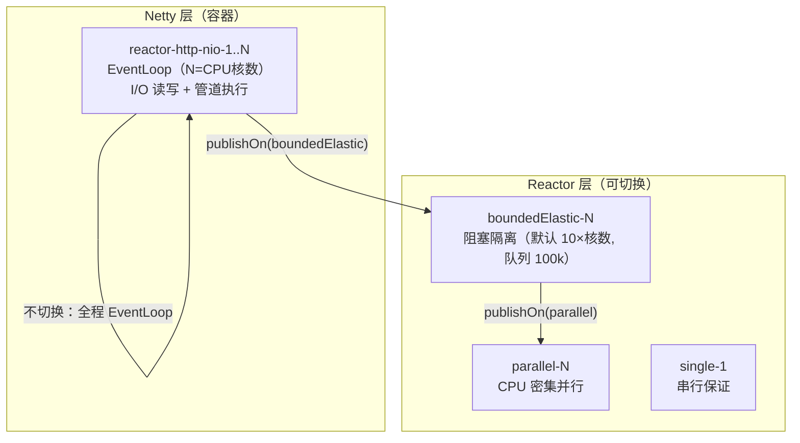
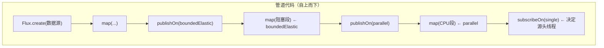

# 线程模型与调度器：WebFlux 的引擎室

> **定位**：本系列第 16 篇（教程 16）（前置：[教程 10-WebFlux从零入门 §7]、[教程 11-Reactor核心 §4]）。前五篇告诉你"怎么用"调度器，这一篇打开引擎室：**Scheduler 全家族选型、flatMap 并发编排三兄弟、EventLoop 与阻塞的战争、Loom 虚拟线程与响应式的合流**。读完你应该能回答：这条管道的每一段跑在哪个线程上、为什么、怎么验证。API 版本：reactor-core 3.8.6 + reactor-netty 1.3.6，全部签名经本地 jar `javap` 实证。

---

## 1. 全景：一条请求在 WebFlux 里经过哪些线程



**默认情况下什么都不做，你的整条管道都跑在 EventLoop 上**（这就是 [10-WebFlux从零入门 §7] 三条铁律的由来）。Scheduler 的意义是**按需把某段管道"搬家"到更合适的线程池**。

## 2. Schedulers 家族全解（javap 实证）

```java
public abstract class Schedulers {
    // 五个全局缓存实例（重复调用返回同一实例）
    public static Scheduler boundedElastic();   // 阻塞专用弹性池
    public static Scheduler parallel();         // CPU 并行池（默认 CPU 核数）
    public static Scheduler single();           // 单线程串行
    public static Scheduler immediate();        // 不切换（当前线程继续）
    // 自建实例（不复用全局缓存，用完需 dispose）
    public static Scheduler newBoundedElastic(int threads, int queued, String name, int ttl, boolean daemon);
    public static Scheduler newParallel(String name, int n, boolean daemon);
    public static Scheduler newSingle(String name, boolean daemon);
    // 从 JDK 线程池包装
    public static Scheduler fromExecutor(Executor e);
    public static Scheduler fromExecutorService(ExecutorService s);
    // 判定辅助 + 全局调整
    public static boolean isInNonBlockingThread();
    public static void enableMetrics();         // 调度器指标接入 Micrometer
    // Loom 支持（3.8 新增实证）
    public static final boolean DEFAULT_BOUNDED_ELASTIC_ON_VIRTUAL_THREADS;
    static final String LOOM_BOUNDED_ELASTIC;   // 基于 Loom 的 boundedElastic 内部标识
}
```

| Scheduler | 线程数 | 用途 | 误用后果 |
|---|---|---|---|
| `immediate()` | 不切换 | 声明"保持现状" | 无（它就是透明） |
| `single()` | 1 | 强串行（如顺序写文件） | 放并发任务 → 全部排队 |
| `parallel()` | CPU 核数 | 纯 CPU 计算 | 放阻塞 I/O → 核数个槽位秒满 |
| `boundedElastic()` | 10×核数（默认），队列 100k | **阻塞代码隔离区** | 放 CPU 计算 → 弹性池被占满，阻塞任务排队 |
| `newXxx()` | 自定 | 独占隔离（如"LLM 专用池"） | 忘记 dispose → 线程泄漏 |

**适用场景**：`boundedElastic` 包 JDBC/遗留 SDK/`toBlocking()`；`parallel` 配合 `Flux.parallel().runOn()` 做分片计算；`newBoundedElastic` 给不同租户/业务做物理隔离。
**不适用场景**：非阻塞管道里加 `publishOn` "以防万一"——每次切换是一次入队+唤醒，白白增加延迟与上下文切换；无阻塞就不要切。

## 3. subscribeOn vs publishOn：一次讲透

两条规则（[11-Reactor核心 §4] 提过结论，这里给机理）：

- **`publishOn(s)`：影响它"下游"**。数据到达该算子时被调度到 `s` 执行，之后的算子都跑在 `s` 上，直到下一个 `publishOn`。
- **`subscribeOn(s)`：影响"源头"**。订阅信号从最下游向上传播时，遇到第一个 `subscribeOn` 就切到 `s` 发起订阅；**整条链只在最靠近源的 subscribeOn 生效一次**（写多处只有一处起作用）。



**最常见组合拳**（Agent 服务里几乎天天写）：

```java
Mono.fromCallable(() -> legacyBlockingSdk.call())          // 阻塞源头
    .subscribeOn(Schedulers.boundedElastic())               // ① 源头就在弹性池（EventLoop 从未触碰阻塞）
    .map(r -> heavyTransform(r))                            // ② 仍在弹性池（如需 CPU 密集再 publishOn(parallel)）
    .flatMap(r -> webClient.post()...bodyToMono(X.class));  // ③ 切回非阻塞调用，不占弹性池
```

一个隐蔽陷阱：`subscribeOn` 对 `Flux.create` 生效（lambda 在订阅线程执行），但**对 `Flux.fromIterable` 这类"同步即时源"只影响订阅瞬间**——元素发射仍在下游第一个 `publishOn` 之前所在的线程。判断不了就打日志验证：`.doOnNext(x -> log.info("{}", Thread.currentThread()))`，实证优先于记忆。

## 4. 并发编排三兄弟：flatMap / concatMap / flatMapSequential

实证重载（Flux，reactor-core 3.8.6）：

```java
<R> Flux<R> flatMap(Function<? super T, ? extends Publisher<? extends R>> mapper);
<V> Flux<V> flatMap(Function<...>, int concurrency);            // 并发上限
<V> Flux<V> flatMap(Function<...>, int concurrency, int prefetch); // 并发上限 + 预取量
<V> Flux<V> concatMap(Function<...>, int prefetch);
<R> Flux<R> flatMapSequential(Function<...>, int concurrency);
```

三者语义（每个元素映射成内部流后的行为差异）：

| 算子 | 内部流并发 | 输出顺序 | 记忆点 |
|---|---|---|---|
| `concatMap` | **1**（串行） | 源顺序 | "排队办事" |
| `flatMap` | N（默认 256！） | **完成顺序（乱序）** | "同时办事，谁先完谁先走" |
| `flatMapSequential` | N | 源顺序（乱序完成但按序放行） | "同时办事，按号出结果" |

**默认并发 256 是 Agent 服务最大的隐形炸弹**：`flatMap(this::callLlm)` 遇到 1000 个元素会同时打 256 路 LLM 请求——瞬间打爆供应商限流、烧光预算。必须显式限流：

```java
questions.flatMap(this::askLlm, 8)          // 最多 8 路并发
// 等价语义：Semaphore(8) 的响应式版本，且慢请求自动让出槽位
```



```mermaid
gantt
    title 三兄弟处理 3 个元素的时序（每个内部流耗时不同）
    dateFormat X
    axisFormat %s
    section flatMap(乱序)
    任务1(3s) :0, 3
    任务2(1s) :0, 1
    任务3(2s) :0, 2
    section concatMap(串行)
    任务1 :0, 3
    任务2 :3, 4
    任务3 :4, 6
    section flatMapSequential(并发执行 按序输出)
    任务1 :0, 3
    任务2 :0, 1
    任务3 :0, 2
```

选型决策：

- 每个内部流独立展示给用户（token 流聚合、多页面）→ `flatMap`，乱序无所谓
- 结果必须按序拼接（文档章节、SQL 批次依赖顺序）→ `flatMapSequential`（并发红利 + 顺序保证，多数人不知道它）
- 后一个依赖前一个完成（分页游标、顺序状态机）→ `concatMap`

## 5. EventLoop 与阻塞的战争：防御体系

### 5.1 为什么"偶尔阻塞一下"也不行

EventLoop 只有 N 个（=核数）。它同时负责**所有连接**的 I/O 事件分发。任何一个 EventLoop 线程阻塞 500ms，这 1/N 的连接**全部**无响应——不是这条请求慢，是随机一批用户集体卡顿。这就是 [10-WebFlux从零入门 §7] 把"禁阻塞"列为铁律 1 的机理。

### 5.2 防线一：运行时判定 API

```java
// 实证：reactor-core 3.8.6
Schedulers.isInNonBlockingThread();       // 当前线程是否被标记为非阻塞
Schedulers.registerNonBlockingThreadPredicate(p -> ...); // 把自定义线程池标记为非阻塞
```

可用来写防御性断言（在开发/测试 profile 生效）：

```java
.flatMap(step -> {
    assert !Schedulers.isInNonBlockingThread() || step.isNonBlocking()
            : "EventLoop 上出现阻塞步骤: " + step;
    return step.run();
})
```

### 5.3 防线二：BlockHound（需引入依赖）

本地仓库暂无该 jar，坐标如下（版本随 reactor-bom 管理，需添加后 javap 实证）：

```xml
<dependency>
    <groupId>io.projectreactor.tools</groupId>
    <artifactId>blockhound</artifactId>
    <scope>test</scope>
</dependency>
```

原理：字节码插桩拦截 `Thread.sleep()/lock park/Socket read` 等阻塞点，若发生在非阻塞线程直接抛异常——把"隐形阻塞"变成"测试期红牌"。这是 CI 阶段抓阻塞回归的标准武器。

## 6. Loom 合流：虚拟线程时代的 boundedElastic

reactor-core 3.8 实证出现了 `DEFAULT_BOUNDED_ELASTIC_ON_VIRTUAL_THREADS` 常量与内部 `LOOM_BOUNDED_ELASTIC` 标识：**boundedElastic 可以切换为虚拟线程实现**。这带来架构层面的新选择题：

| 方案 | 模型 | 适合 |
|---|---|---|
| 传统 WebFlux（EventLoop + 弹性池） | 全链路非阻塞 | 高并发长连接（SSE 大户）、已有 Reactor 资产 |
| MVC + 虚拟线程（`spring.threads.virtual.enabled=true`） | 阻塞代码写在廉价虚拟线程上 | 阻塞生态（JDBC/老 SDK）为主、团队不想学 Reactor |
| 混合：WebFlux + 虚拟线程 boundedElastic | EventLoop 管 I/O，虚拟线程管阻塞段 | 存量 WebFlux 服务渐进消化阻塞库 |

**架构师判断**：虚拟线程让"阻塞写的代价"大幅下降，但没有消灭 [10-WebFlux从零入门 §1] 的核心差异——**SSE 长连接的内存与调度成本仍以响应式最低**。Agent 网关（海量 SSE）选 WebFlux、业务服务（JDBC 密集）可选虚拟线程 MVC，通过 HTTP 解耦两者，是 2026 年的常见组合。「线程模型 vs 响应式的完整选型对照？→ [教程 14-WebFlux-vs-MVC]」

## 7. 每线程池隔离：LLM 专用池实战

把 §2 的 `newBoundedElastic` 用于真实痛点——**LLM 供应商慢 + 供应商要求限流**：

```java
// Spring Boot 4.1.0 + reactor-core 3.8.6
@Configuration
class SchedulerConfig {

    /** LLM 专用池：与全局 boundedElastic 物理隔离，慢供应商不拖累其他阻塞任务 */
    @Bean(destroyMethod = "dispose")
    reactor.core.scheduler.Scheduler llmScheduler() {
        return Schedulers.newBoundedElastic(
                16,                          // 16 线程 = 对供应商的并发上限（配合商务配额）
                10_000,                      // 排队上限：过载时显式失败而非无限堆积
                "llm-worker",                // 线程名：日志/线程 dump 直接可辨
                60, true);                   // 空闲 60s 回收 + daemon
    }
}

@Service
class LlmService {
    private final reactor.core.scheduler.Scheduler llmScheduler;

    Mono<String> call(String q) {
        return Mono.fromCallable(() -> blockingLlmSdk.chat(q))   // 阻塞 SDK（唯一入口）
                .subscribeOn(llmScheduler)                        // 隔离 + 隐式并发上限
                .timeout(Duration.ofSeconds(60));
    }
}
```

线程池即限流器：16 个线程天然把供应商并发压在 16，队列 10000 保证过载时快速失败而不是 OOM——比在管道里手工塞 `Semaphore` 更直观，且线程 dump 里 `llm-worker-*` 一眼定位。

## 8. 陷阱清单

| 陷阱 | 现象 | 修复 |
|---|---|---|
| `flatMap` 默认并发 256 打爆 LLM 限流 | 429 风暴、账单暴涨 | `flatMap(fn, n)` 显式限并发 |
| `subscribeOn` 写多处以为都生效 | 只有最靠近源的一处生效 | 只写一处；用日志验证 |
| 把 CPU 计算丢进 boundedElastic | 弹性池被算力占满，阻塞任务排队超时 | CPU → `parallel()`，阻塞 → boundedElastic |
| 自建 Scheduler 忘记 dispose | 线程泄漏（压测后线程数只增不减） | 注册为 Bean 用 `destroyMethod = "dispose"` |
| 用 `new Thread`/自建池做"隔离" | 不受 Reactor 管理，Context/取消不传播 | 一律 `fromExecutorService` 包装或直接 newXxx |
| 以为 `publishOn` 能"提速" | 无阻塞时纯增加两级队列调度 | 无阻塞不切换；先测后切 |

## 9. 总结

- 管道默认全程 EventLoop；Scheduler 是按需搬家的工具：`boundedElastic`=阻塞隔离区、`parallel`=CPU 并行、`single`=串行、`newXxx`=业务物理隔离
- `publishOn` 管下游、`subscribeOn` 管源头（仅一处生效）；判断不了线程归属就 `doOnNext` 打日志实证
- 并发三兄弟：`concatMap` 串行、`flatMap` 乱序（默认 256 并发！）、`flatMapSequential` 并发+保序——LLM 聚合场景永远显式给并发度
- 防阻塞三防线：判定 API 断言、BlockHound 测试期红牌（需依赖）、线程池隔离即限流
- Loom 合流后虚拟线程降低了阻塞写的代价，但 SSE 长连接场景响应式仍是最低成本；混合架构（网关 WebFlux + 业务虚拟线程 MVC）是 2026 常态

下一篇 [教程 17-WebFlux测试与性能调优] 把镜头转向工程化：如何测试这些线程行为、如何压测与调优 Netty。
