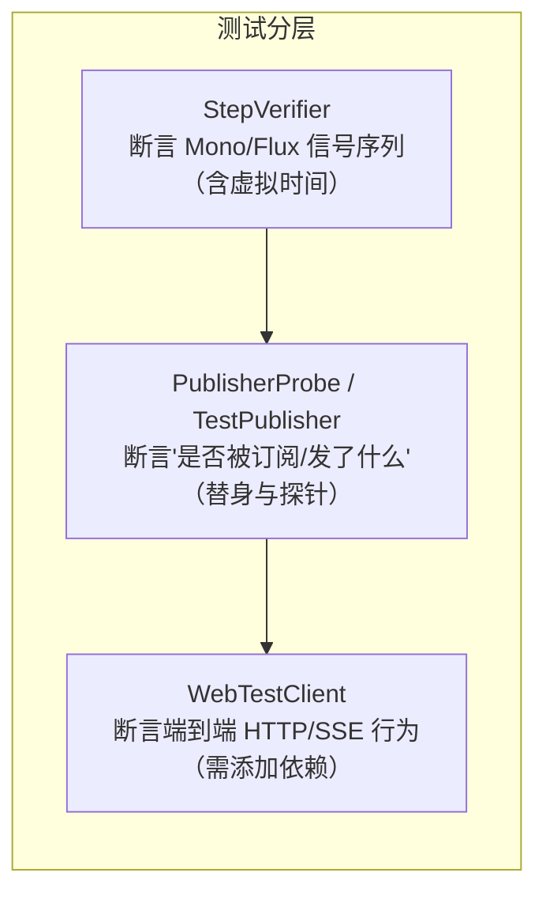
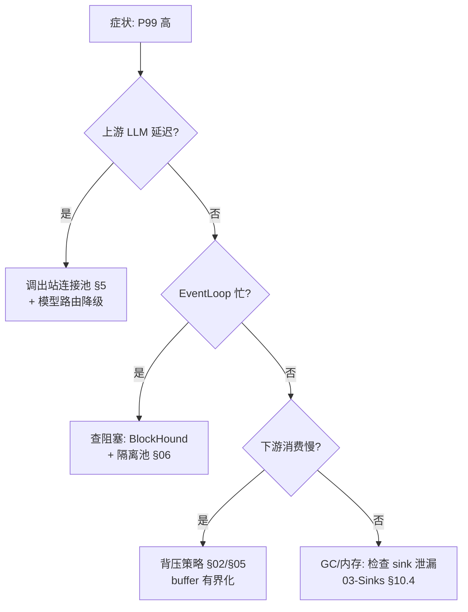

# WebFlux 测试与性能调优：从 StepVerifier 到压测调参

> **定位**：本系列收官篇（前置：[教程 15-WebFlux进阶实战]、[教程 16-线程模型与调度器]）。前六篇建的"时序敏感、线程敏感"的管道，靠肉眼读代码测不住——本文给出**测试三板斧（StepVerifier/WebTestClient/Sinks 时序测试）**与**调优四层（Netty/连接池/背压/观测指标）**。API：reactor-core 3.8.6、reactor-netty 1.3.6（实证）；`WebTestClient` 所在的 spring-boot-starter-test 本地仓库暂无 jar，标注「需添加依赖」。「通用测试策略？→ [附录 04-测试策略]」

---

## 1. 为什么响应式测试是另一个物种

MVC 测试断言"返回值"；WebFlux 要断言的是**随时间展开的信号序列**（next/error/complete 的顺序与时机）、以及**线程行为**（哪段跑在哪个池上）。三类断言对应三层工具：



## 2. StepVerifier：信号序列断言

需添加依赖（本地仓库暂无 reactor-test jar，版本由 reactor-bom 2025.0.6 管理）：

```xml
<dependency>
    <groupId>io.projectreactor</groupId>
    <artifactId>reactor-test</artifactId>
    <scope>test</scope>
</dependency>
```

核心模式（承接 [教程 13-Sinks详解 §10.3] 的入门版，这里是体系）：

```java
// 模式1：时序断言（then 触发外部动作，验证"事件驱动"而非"预置数据"）
StepVerifier.create(sink.asFlux())
        .then(() -> sink.tryEmitNext("a"))
        .expectNext("a")
        .then(() -> sink.tryEmitNext("b"))
        .expectNext("b")
        .then(() -> sink.tryEmitComplete())
        .verifyComplete();

// 模式2：错误断言（error 信号也是序列一员）
StepVerifier.create(Flux.error(new IllegalStateException("boom")))
        .expectError(IllegalStateException.class)   // 只断类型
        .verify();
StepVerifier.create(Flux.error(new IllegalStateException("boom")))
        .expectErrorMessage("boom")                  // 断消息
        .verify();

// 模式3：expectNextCount/expectNextSequence 混搭（token 流场景）
StepVerifier.create(tokenFlux.take(3))
        .expectNextCount(3)
        .verifyComplete();

// 模式4：条件断言（只验前缀，容忍后续开放集合）
StepVerifier.create(tokenFlux)
        .expectNextMatches(t -> t.startsWith("你好"))
        .thenCancel()                                 // 验完就取消，不等流结束
        .verify();
```

**虚拟时间**（`WithVirtualTime`）——测 `delay/interval/timestamp` 类管道不必真等：

```java
StepVerifier.withVirtualTime(() -> Flux.interval(Duration.ofHours(1)).take(2))
        .expectSubscription()
        .thenAwait(Duration.ofHours(2))   // 时间快进 2 小时，测试毫秒级完成
        .expectNextCount(2)
        .verifyComplete();
```

**适用场景**：任何含 `delay/retry/timeout` 的管道单测。
**不适用场景**：真 I/O（网络/DB）参与的集成测试——虚拟时间只对 Reactor 内建时间算子生效，真实 I/O 不会被快进。

## 3. TestPublisher 与 PublisherProbe：替身与探针

```java
// TestPublisher：完全受控的"假上游"，可故意违规（比 mock 灵活）
reactor.test.publisher.TestPublisher<String> tp =
        reactor.test.publisher.TestPublisher.create();
Flux<String> flux = tp.flux();
tp.next("a", "b");      // 命令式发射——测背压/异常分支的利器
tp.assertMinRequested(n);

// PublisherProbe：验证"下游是否真的订阅了我"（测惰性/防提前订阅）
reactor.test.publisher.PublisherProbe<String> probe = PublisherProbe.of(Mono.just("x"));
Mono<String> gated = Mono.defer(() -> probe.mono())   // 只有订阅 probe.mono 才执行
        .filter(s -> true);
gated.subscribe();
probe.assertWasSubscribed();    // 断言确实发生过订阅
```

典型用法：把 LLM 调用替换成 `PublisherProbe`，断言"错误路径下 LLM **没有**被订阅"（防止降级逻辑反而多调一次模型——既省钱又是正确性）。

## 4. WebTestClient：端到端响应式测试

需添加依赖（本地仓库暂无 spring-boot-starter-test jar，需在 pom.xml 中添加后实证）：

```xml
<dependency>
    <groupId>org.springframework.boot</groupId>
    <artifactId>spring-boot-starter-test</artifactId>
    <scope>test</scope>
</dependency>
```

两种绑定方式——**优先 `bindToController`**（不起真实端口，快；`bindToServer` 用于集成）：

```java
// Spring Boot 4.1.0（WebTestClient 属 spring-test 体系，需上述依赖）
@SpringBootTest
class ChatSseTest {

    org.springframework.test.web.reactive.server.WebTestClient client =
            org.springframework.test.web.reactive.server.WebTestClient
                    .bindToController(new ChatSseController(chatClientBuilder))
                    .build();

    @Test
    void sseStreamsTokens() {
        client.get().uri("/chat/stream?q=hi")
                .accept(org.springframework.http.MediaType.TEXT_EVENT_STREAM)
                .exchange()
                .expectStatus().isOk()
                .returnResult(String.class)      // FluxExchangeResult：可断言流式前缀
                .getResponseBody()
                .as(StepVerifier::create)
                .expectNextCount(1)
                .thenCancel()
                .verify();
    }
}
```

**SSE 测试要点**：流可能永不 complete（长连接语义），必须 `thenCancel()` 主动收尾，否则测试挂到超时。这本身就是一次"取消传播"的实战（[15-WebFlux进阶实战 §4.3]）。

## 5. 调优第 1 层：reactor-netty 连接池

LLM 网关对上游（DeepSeek 等）的出站连接由 reactor-netty `ConnectionProvider` 管理（实证：`reactor.netty.resources.ConnectionProvider`，1.3.6）：

```java
// Spring Boot 4.1.0 + reactor-netty 1.3.6
@Bean
WebClient llmWebClient() {
    var provider = reactor.netty.resources.ConnectionProvider.builder("llm-pool")
            .maxConnections(200)                    // 对上游的连接上限（≈ 并发上限）
            .pendingAcquireMaxCount(1000)           // 等连接的排队上限：防无限堆积
            .pendingAcquireTimeout(Duration.ofSeconds(5))  // 排队超时：快速失败
            .build();
    var httpClient = reactor.netty.http.client.HttpClient.create(provider)
            .responseTimeout(Duration.ofSeconds(120));      // 实证方法：单响应超时
    return WebClient.builder()
            .clientConnector(new org.springframework.http.client.ReactorClientHttpConnector(httpClient))
            .baseUrl("https://api.deepseek.com")
            .build();
}
```

**为什么 maxConnections 是第一调优项**：默认连接池对单一 host 的上限较低，Agent 高并发下会出现"管道排队等连接"——表现为 P99 飙高但上游毫无压力。把 `pendingAcquireTimeout` 压到 5s 让过载**显式失败**（可降级），好过隐性排队拖垮全部请求。

## 6. 调优第 2 层：Netty 服务端与线程

```yaml
# application-demo01.yaml（示意；参数值按压测校准，非默认推荐）
server:
  netty:
    # 连接保活：SSE 长连接多时重点关注
    connection-timeout: 30s
```

服务端 EventLoop 数默认 = CPU 核数，**通常不要动**；容器 CPU limit 是 2 核就只有 2 个 EventLoop——K8s 部署时 limit 给太低是"WebFlux 莫名卡顿"的头号原因。改池优先级：先看出站连接池（§5）与业务隔离池（[16-线程模型与调度器 §7]），最后才考虑 EventLoop。

## 7. 调优第 3 层：背压与缓冲监控

`Schedulers.enableMetrics()`（实证于 reactor-core 3.8.6）把调度器队列深度接入 Micrometer；再配合 [12-背压与流量控制 §5] 的 requested/produced/dropped 指标，形成调优闭环：

```java
Schedulers.enableMetrics();   // 启动时调用一次：boundedElastic 队列长度等可观测
```

调优决策树：



## 8. 调优第 4 层：压测方法与指标口径

压测 Agent SSE 服务的特殊之处：**连接是长活的，RPS 口径失真**，应改用"并发连接数 × 每连接完成时长"：

```bash
# SSE 压测用并发连接模拟而非纯 RPS（vegeta/wrk 需改造，推荐自写 Reactor 压测客户端）
# 关键指标口径：
#  - 首 token 延迟（TTFT）：连接建立→第一个 data 帧
#  - 流内 token 间隔：后续帧间延迟（反映背压/线程争抢）
#  - 并发连接数下的 EventLoop 利用率（netty eventloop 指标）
```

**指标分层**：

| 层 | 指标 | 来源 |
|---|---|---|
| 接入 | 并发连接数、连接错误率 | reactor-netty metrics |
| 管道 | 调度器队列深度、背压 dropped | `Schedulers.enableMetrics()` + §7 |
| 上游 | 连接池 pending 数、上游 P99 | ConnectionProvider 指标 |
| 业务 | TTFT、token 间隔 | 自定义 Micrometer 计时（`Observation` 体系，见 [教程 33-最小闭环：Agent各阶段输出打印到控制台]） |

## 9. 陷阱清单

| 陷阱 | 现象 | 修复 |
|---|---|---|
| 测 SSE 忘了 `thenCancel()` | 测试"永远不结束"挂到超时 | 长流测试必 cancel 收尾 |
| 虚拟时间用于真 I/O 测试 | 时间没被快进，测试仍慢 | 虚拟时间只管 Reactor 时间算子 |
| mock 了 LLM 却没断言"未调用" | 降级路径偷偷多调一次模型 | `PublisherProbe.assertWasNotSubscribed()` |
| 压测只看 RPS | SSE 长连接下 RPS 极低但服务很健康 | 用 TTFT/并发连接数口径 |
| K8s CPU limit=2 还嫌慢 | 仅 2 个 EventLoop，吞吐天花板 | 提高 limit 或拆分接入层 |
| 调优先动 EventLoop 数 | 通常无效甚至更差 | 顺序：连接池→隔离池→背压→最后才是 EventLoop |

## 10. 总结（全附录收官）

- 测试三层：StepVerifier 断信号序列（虚拟时间测时间逻辑）、TestPublisher/PublisherProbe 做受控替身与订阅探针、WebTestClient 端到端（SSE 测试必须主动 cancel）
- 调优四层顺序固定：出站连接池（maxConnections/pendingAcquireTimeout）→ Netty 与线程（先查 CPU limit）→ 背压缓冲有界化 → EventLoop 最后动
- SSE 压测口径换轨：RPS → 并发连接数 + TTFT + 流内 token 间隔
- 观测闭环：`Schedulers.enableMetrics()` + 背压指标 + ConnectionProvider 指标 + Observation 业务层计时

本篇四层调优讲完，单进程的"会用、会控、会选、会查、会调"全部齐备——但 Sinks 和这些手段都有一个隐含前提：**同一个 JVM**。多实例部署的边界与 Redis Streams 跨服务方案，见最后一篇 [教程 18-跨服务流与RedisStreams背压]。
