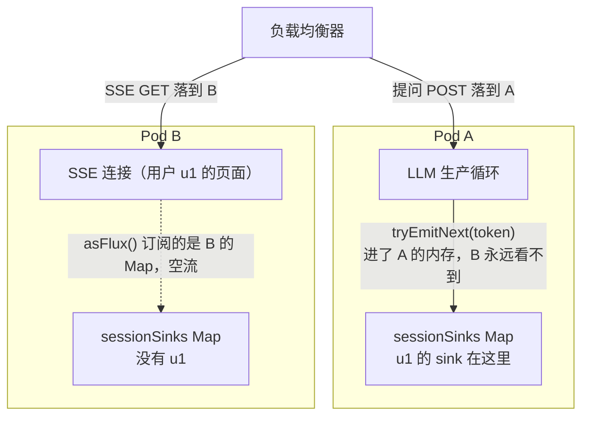
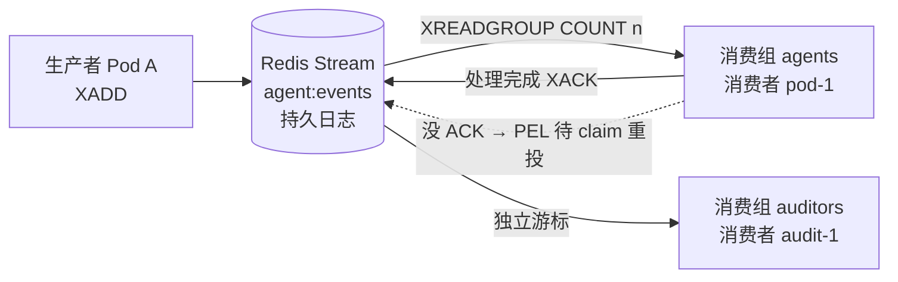
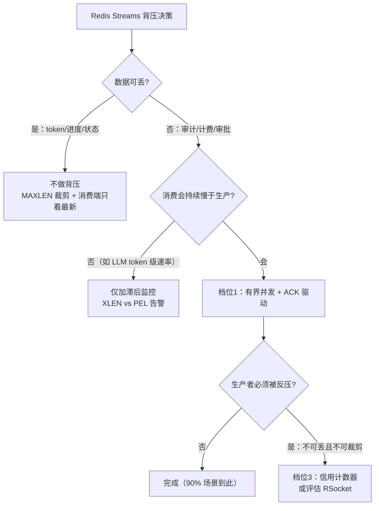

# 跨服务流与 Redis Streams 背压：Sinks 的边界之外

> **定位**：本系列第 18 篇（教程 18）（前置：[教程 13-Sinks详解]、[教程 12-背压与流量控制]）。前三篇的 Sinks 方案有一个隐含前提——**生产者与消费者在同一个 JVM 里**。本文讲清这个边界在哪里、跨出去之后怎么办：粘性路由 vs 跨实例广播的架构抉择、Redis Streams 的 Consumer Group 模型、**"Redis 里怎么做背压"的三档实现**、以及与 EventBus/Kafka/RSocket 的横向对照。API：spring-data-redis 4.1.0 的 `ReactiveStreamOperations` 已本地 jar 实证。

---

## 1. Sinks 的边界：多实例部署的第一道裂缝

[13-Sinks详解 §7] 的"每会话一个 sink + `ConcurrentHashMap`"在单实例下完美工作。但上 K8s 后：



两个 Pod 各有一份 Map，**u1 的 sink 在 A、SSE 连接在 B**——token 发进 A 的内存，B 上的订阅者永远收不到。这是"从 demo 到生产"的第一道裂缝，解法只有两条路：

| 方案 | 原理 | 代价 | 适用 |
|---|---|---|---|
| **粘性路由**（Session Affinity） | 负载均衡按 `sessionId` 哈希，同一会话的所有请求固定打到同一 Pod，Sinks 方案原样有效 | Pod 扩缩容/宕机时会话重连；单 Pod 承载其哈希段全部会话 | **默认首选**：零新增组件、零额外延迟 |
| **跨实例广播** | 消息经外部 broker（Redis Streams/Pub-Sub）中转，任意 Pod 可消费 | 一跳网络延迟 + broker 运维 + 序列化 | 无状态多实例、SSE 断线重连跨 Pod 补偿、多团队消费同一事件流 |

**架构师默认决策**：先粘性路由跑通，只在两个明确信号出现时升级广播——①扩缩容频繁导致会话大面积重连；②同一事件流需要**多实例/多团队**消费（如"LLM 输出流"同时喂 SSE 网关 + 审计服务 + 评估采样器）。

## 2. 为什么是 Redis Streams 而不是 Pub/Sub

Redis 有两个"发布订阅"能力，语义差异正好对应 Sinks 家族的两个成员：

| Redis 能力 | 语义 | ≈ Sinks 的谁 |
|---|---|---|
| **Pub/Sub**（SUBSCRIBE/PUBLISH） | 发了就没了：无订阅者=丢，断线=丢，无重放 | `multicast().directBestEffort()`（无 replay 版） |
| **Streams**（XADD/XREADGROUP） | 持久日志：消费组各自有游标，没 ACK 的进 PEL 可重投，可回溯历史 | `replay().limit(n)` + 消费组 + 确认机制 |

Agent 场景的基本盘是 Streams（断线重连要补历史、消费要可确认），Pub/Sub 只适合"丢了无所谓"的心跳/通知。

## 3. Consumer Group：Streams 的核心模型

实证 API（spring-data-redis 4.1.0，`org.springframework.data.redis.core.ReactiveStreamOperations`，经 `ReactiveRedisTemplate.opsForStream()` 获得）：

```java
// 读：消费组 + 拉取语义
public Flux<MapRecord<K, HK, HV>> read(Consumer, StreamReadOptions, StreamOffset<K>...);
// 写：XADD，永不阻塞（可带 MAXLEN 裁剪选项）
public Mono<RecordId> add(K key, Map<? extends HK, ? extends HV> body, XAddOptions);
public Flux<RecordId> add(K key, Publisher<? extends Map> bodyPublisher);   // Flux 直灌
// 确认与重投
public Mono<Long> acknowledge(K key, String group, String... recordIds);
public Flux<MapRecord<K, HK, HV>> claim(K key, String group, String consumer,
                                        Duration minIdleTime, RecordId... ids);   // 认领僵尸消息
```



关键性质：**每个消费组独立游标**（agents 组和审计组各自消费全量、互不干扰——一个"广播"两个"单播"语义兼得）；**组内消费者分摊**（水平扩容消费能力）；**PEL（Pending Entries List）**记录已分发未 ACK 的消息，Pod 崩溃后由其他消费者 `claim` 认领——这三样是 Sinks 完全给不了的消息队列能力。

## 4. 核心问题：Redis Streams 有背压吗？

精确答案分三层——**消费端有"拉模型"，生产端零背压反馈，协议层不存在 request(n) 传播**：

| 层 | Redis Streams 行为 | 对照 Reactor |
|---|---|---|
| 生产端 | `XADD` 永不阻塞，写多快收多快，Stream 无限增长 | 没有 `FAIL_OVERFLOW`；需 `XADD MAXLEN ~` 手工裁剪 ≈ `onBackpressureBuffer(n, DROP_OLDEST)` |
| 消费端 | `XREADGROUP COUNT n BLOCK ms`：**一次拉 n 条，处理完再拉** | `COUNT` 就是**手工版 request(n)**；拉模型保证慢消费者天然不被打爆（对比 EventBus 的推模型） |
| 确认端 | 处理完 `XACK`；未 ACK 进 PEL 可重投 | Reactor 无对应——这是 at-least-once 语义，消息队列特有 |

Reactive Streams 的 `request(n)` 会**一路传播到生产者让它停**；Redis Streams 的生产者永远不知道下游积压了。所以"要不要在 Redis 上做背压"是一个**按数据性质决策**的问题：



Agent 场景的真实画像：LLM 生产 token 是"人打字级"速度，Redis 又是持久缓冲——**大多数 Agent 项目只需要档位 1（消费端背压）**，生产端给 `MAXLEN` 保护即可。别过度设计。

## 5. 背压三档实现（全实证 API）

### 档位 1：消费端背压——有界并发 + ACK 驱动（90% 场景）

核心思想：**"在飞的最多 n 条，ACK 完才继续拉"**——这就是消息队列世界的 `request(n)`：

```java
// Spring Boot 4.1.0 + spring-data-redis 4.1.0（需添加 spring-boot-starter-data-redis 依赖）
var ops = reactiveRedisTemplate.opsForStream();

ops.read(Consumer.from("agents", "pod-1"),
         StreamReadOptions.empty().count(16),              // 每批最多 16 条 ≈ request(16)
         StreamOffset.create("agent:events", ReadOffset.lastConsumed()))
   .flatMap(rec -> handle(rec)                             // 业务处理（非阻塞 Mono）
           .then(ops.acknowledge("agent:events", "agents", rec.getId()))
           .onErrorResume(e -> Mono.empty()),              // 失败不 ACK → 留 PEL 待重投
       8)                                                  // ← 在飞上限 8：背压的阀门
   .subscribe();
```

三个旋钮构成全部背压：`COUNT`（批大小）、`flatMap` 第二参（并发阀门，呼应 [教程 16-线程模型与调度器 §4] 的并发编排——**同一套心智在消息队列里复用**）、ACK（完成语义）。要 `request(1)` 语义就换 `concatMap`。

僵尸消息兜底（Pod 崩溃后没人 ACK 的消息）：

```java
ops.claim("agent:events", "agents", "pod-1",
          Duration.ofMinutes(5))      // 认领闲置超 5 分钟的 pending 消息
   .flatMap(rec -> handle(rec).then(ops.acknowledge(...)));
```

### 档位 2：生产端保护——防打爆 Redis，而非真背压

```java
// 写入侧：MAXLEN 有界裁剪（approximate 裁剪更快）
ops.add("agent:events",
        Map.of("sid", sessionId, "type", "token", "v", token),
        RedisStreamCommands.XAddOptions.maxlen(10_000).approximateTrimming(true));

// 滞后监控：流长度 vs 消费组 pending 数，持续增长 → 告警/业务降级
ops.size("agent:events");
```

消费滞后时的正确动作是**业务降级**（砍流式粒度、换便宜模型），而不是试图让生产者等——跨进程通知不到它，除非上档位 3。

### 档位 3：真·端到端背压——生产者必须被反压时

- **信用计数器（手工版 request(n)）**：消费方处理完往 `agent:credit` 计数器 `INCR`；生产方每次 `XADD` 前 Lua 原子 `DECR`，到 0 就挂起。能做，但竞态/原子性全自己管——**只有"不可丢且不可裁剪的强契约"场景才值得**
- **换协议**：协议级背压传播只有 **RSocket**（把 `request(n)` 写进网络协议的主流技术）。Agent 推流为它做整体改造通常不划算，优先重新审视是否真的需要端到端背压

## 6. 横向对照：EventBus / Kafka / RSocket

把本系列出现过的所有"通知/流"机制放进一张表（EventBus 是从传统 Java 带过来的常见问题）：

| 维度 | EventBus（Guava/Spring 事件） | Sinks（进程内） | Redis Streams | Kafka | RSocket |
|---|---|---|---|---|---|
| 跨进程 | ✗ | ✗ | ✓ | ✓ | ✓ |
| 消费模型 | **推**（回调） | 拉+背压协议 | 拉模型（COUNT 手工合成） | 拉+有界预取 | **拉+协议级背压** |
| 慢消费者保护 | 无（同步阻塞发布者 / 异步无界堆积） | 四策略显式选择 | COUNT+并发阀门 | fetch/max.poll 限流 | request(n) 原生 |
| 重放/断线补偿 | ✗ | replay 系可补 | 持久日志+游标回溯 | 持久日志+offset 回溯 | 应用层自建 |
| at-least-once 确认 | ✗ | ✗ | PEL+XACK | offset 提交 | 应用层 |
| 组合能力（flatMap/timeout） | ✗（回调即终点） | ✓ 全套算子 | ✓（reactive API 返回 Flux） | ✓（reactive-kafka） | ✓ |

**EventBus 为什么不够**：它是"通知机制"——推模型无背压（慢 listener 拖垮发布者或无界堆积）、异常被框架吞掉、无终态语义、无法组合。**Sinks 是"通知 + 流量契约 + 组合能力"**。而跨出进程后，"流量契约"就要像 §5 那样手工合成——这就是本篇存在的理由。「Kafka 深水区？→ [教程 67-Kafka全景与核心概念]（00-09 全 10 篇）」

## 7. 实战骨架：SSE 网关消费 Redis Streams

把 §5 档位 1 组装成"Pod B 上的 SSE 端点消费 Pod A 生产的事件流"的完整闭环：

```java
// Spring Boot 4.1.0 + spring-data-redis 4.1.0
@RestController
class CrossPodSseController {

    private final ReactiveStringRedisTemplate redis;   // CLAUDE.md 铁律：响应式场景用 Reactive 模板

    CrossPodSseController(ReactiveStringRedisTemplate redis) { this.redis = redis; }

    /** SSE 端点：从消费组拉流转发给页面（任意 Pod 都能服务任意会话） */
    @GetMapping(value = "/session/{id}/stream", produces = MediaType.TEXT_EVENT_STREAM_VALUE)
    Flux<String> watch(@PathVariable String id) {
        var ops = redis.opsForStream();
        return ops.read(Consumer.from("sse-gateway", id),              // 每会话一个消费者
                       StreamReadOptions.empty().count(8),
                       StreamOffset.create("session:" + id + ":events",
                               ReadOffset.lastConsumed()))
                .concatMap(rec -> ops.acknowledge("session:" + id + ":events",
                                                  "sse-gateway", rec.getId())
                        .thenReturn(String.valueOf(rec.getValue().get("v"))))
                .onBackpressureLatest()                                 // 页面慢：只推最新（05 §3）
                .doFinally(sig -> log.info("SSE 结束: {}, 应触发会话消费组清理", id)); // 见下方"消费组生命周期"标注
    }
}
```

（标注：消费组生命周期管理按会话创建/销毁是简化示意——生产实现应在会话建立时 `XGROUP CREATE`（`StreamOperations` 的 `createGroup` 系 API，本机未逐个 javap，落地前实证），结束时 `XGROUP DESTROY`，并配合 TTL 兜底清理。）

**适用场景**：无状态多实例部署、SSE 连接与生产 Pod 天然分离、事件流需多组消费（SSE 网关 + 审计 + 评估采样）。
**不适用场景**：单实例或粘性路由已解决——多一跳 Redis 纯属增加延迟与故障面；超大流量事件（token 级 × 万级会话）应评估 Kafka（分区并行、磁盘顺序写）而非 Redis（内存成本、单节点吞吐上限）。

## 8. 陷阱清单

| 陷阱 | 现象 | 修复 |
|---|---|---|
| 以为 `read()` 返回的 Flux 自带协议背压 | 消费端 backlog 无限涨 | 背压= `count + flatMap(fn, n)` + ACK 驱动，阀门全是自己设 |
| Stream 无 MAXLEN | 内存型 Redis 被历史撑爆 | `XAddOptions.maxlen(n).approximateTrimming(true)` + 滞后告警 |
| 失败也 ACK | at-least-once 变成 at-most-once，消息丢 | 只有成功路径 `acknowledge`；失败留 PEL + 重投 + 幂等消费 |
| 忘了 claim 僵尸消息 | Pod 崩溃后其 pending 消息永远卡住 | 定时 `claim(minIdleTime)` 认领重投 |
| 每会话建消费组但不销毁 | 消费组无限累积 | 会话结束 `XGROUP DESTROY` + TTL 兜底 |
| 在 Redis 上硬做端到端背压 | 信用计数器竞态 bug 频出 | 先问数据是否真的"不可丢且不可裁剪"；多数该降级或换 Kafka/RSocket |
| 多实例部署仍用进程内 Sinks 且无粘性路由 | 随机丢流（token 进了 A 的内存） | 粘性路由 或 本篇广播方案，二选一必须有 |

## 9. 总结

- Sinks 是 JVM 内结构；多实例下"Map 在不同 Pod"是必然裂缝——默认粘性路由，出现扩缩容痛或多组消费需求才上广播
- Redis Streams ≈ `replay + 消费组 + ACK 确认`，Pub/Sub ≈ 无 replay 的 multicast；Agent 场景基本盘是 Streams
- "Redis 的背压"不是配置项而是**消费模式**：`COUNT + 有界 flatMap + ACK 驱动` 三件套就是手工版 `request(n)`；生产端用 `MAXLEN` + 滞后告警；端到端背压（信用计数器/RSocket）多数场景属于"能做但不该做"
- 决策主线始终是数据性质：可丢→裁剪+最新值；不可丢→档位 1；不可丢且必须反压生产者→档位 3 或换协议
- 横向口诀：EventBus=通知，Sinks=通知+契约+组合（进程内），Streams/Kafka=跨进程持久流（背压手工合成），RSocket=唯一协议级背压

本系列 00-08 九篇至此收官：从单进程的"会用（00-01）、会控（02-03）、会选（04）、会调（05-07）"，到跨进程的"会扩（08）"——响应式流的完整能力地图闭合。
