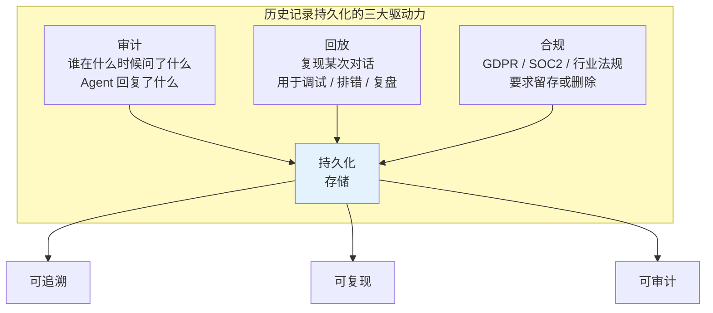
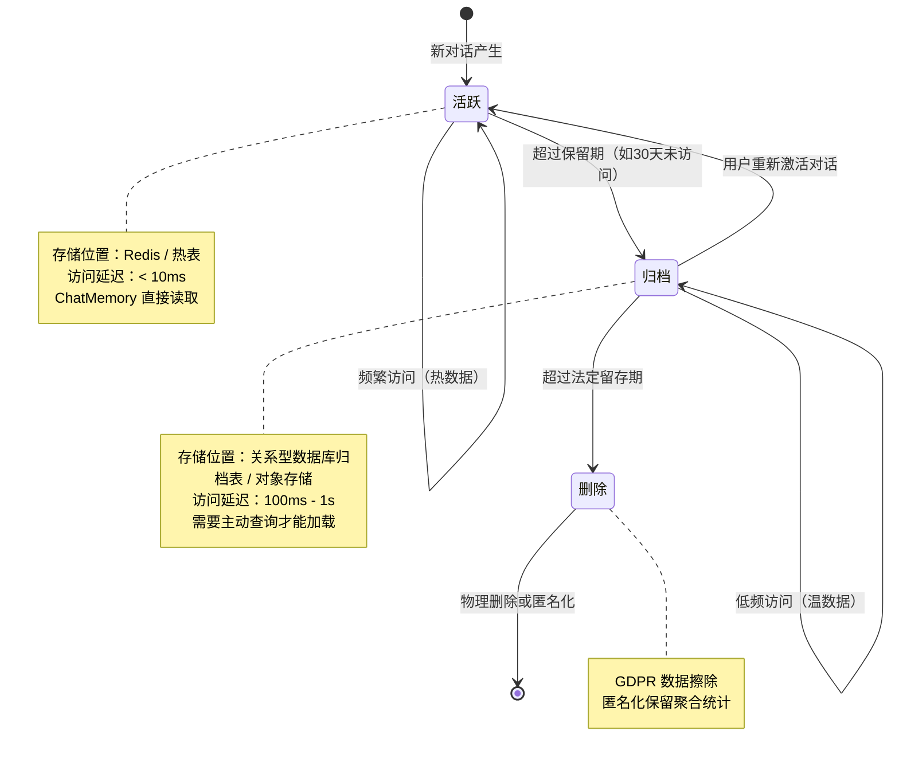
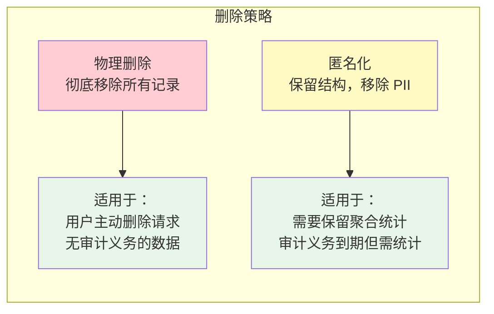
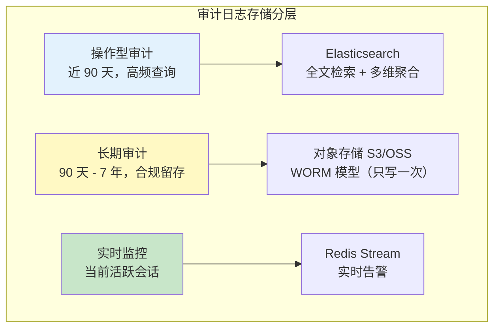
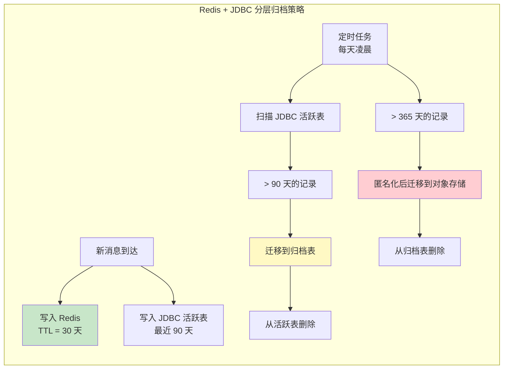
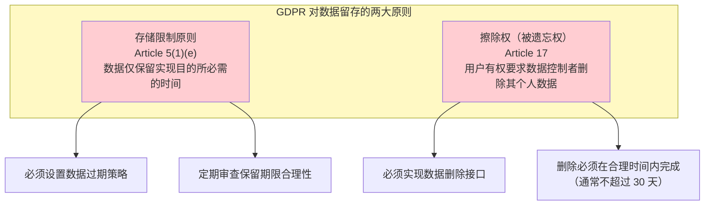

# 19-历史记录持久化与合规

> **定位**：讲透 Agent 对话历史的持久化体系——数据生命周期管理（活跃→归档→删除）、对话回放、审计日志规范、GDPR 合规的数据留存策略。读完这篇，你的 Agent 不再"健忘"，也不会因为留存过多数据而踩合规红线。
>
> **读者画像**：已经会让 Agent 拥有多轮记忆，现在要让历史数据满足审计、回放和合规要求。
>
> **前置阅读**：[04-记忆与会话管理](04-记忆与会话管理.md)。

---

## 1. 为什么需要持久化历史记录

内存中的 ChatMemory 只解决了"当前会话记得住"的问题。但在企业级场景中，历史记录的价值远不止于此——它同时是**审计证据**、**回放素材**和**合规对象**。



### 1.1 审计需求

在金融、医疗、法律等受监管行业中，每一次 AI 交互都可能被视为"业务决策辅助"。监管机构要求企业能够回答：

- **谁**（用户 ID）在**什么时候**（时间戳）问了**什么**（用户消息）
- Agent 给出了**什么回复**（助手消息），回复依据了**哪些检索结果或工具调用**
- Agent 是否调用了**受限工具**（如资金转账、数据删除），调用的**参数和结果**是什么

没有持久化的历史记录，这些问题一个都答不了。

### 1.2 回放需求

当 Agent 出现异常行为（幻觉、错误工具调用、不当回复）时，你需要**精确复现**当时的对话上下文来回溯根因。这要求历史记录不仅存在，还要保留完整的消息序列（包括 System Message 的当时版本、工具调用的完整参数和返回值）。

### 1.3 合规需求

GDPR 第 5 条规定个人数据的"存储限制"——数据只能为特定目的保留必要的时间。这意味着你不能无限期存储用户对话；到了法定期限，必须删除或匿名化。同时，某些行业法规（如金融交易记录留存）又**要求**你必须保留足够长的时间。持久化方案必须同时满足这两面要求。

---

## 2. 数据生命周期管理

历史记录不是静态存储——它有**生命周期**。一条对话从产生到最终删除，经历三个阶段：



### 2.1 活跃期（热数据）

活跃期的对话数据存放在**低延迟存储**中，ChatMemory 直接读取。典型配置是用 Redis 存储，设置 TTL 自动过期。

```java
import org.springframework.ai.chat.memory.repository.redis.RedisChatMemoryRepository;
import org.springframework.ai.chat.memory.MessageWindowChatMemory;
import org.springframework.ai.chat.memory.ChatMemory;

import java.time.Duration;

@Configuration
public class ChatMemoryConfig {

    @Bean
    ChatMemory chatMemory(RedisChatMemoryRepository repository) {
        return MessageWindowChatMemory.builder()
                .chatMemoryRepository(repository)
                .maxMessages(30)  // 活跃窗口：最近 30 条消息
                .build();
    }
}
```

在 Redis 中，可以通过配置 `spring.data.redis.timeout` 和 Key 前缀策略来管理 TTL：

```yaml
# application.yml
spring:
  data:
    redis:
      host: ${REDIS_HOST:localhost}
      port: ${REDIS_PORT:6379}
  ai:
    chat:
      memory:
        redis:
          # 对话历史在 Redis 中保留 30 天，之后自动过期
          time-to-live: 30d
```

### 2.2 归档期（温数据）

当一条对话超过活跃期（如 30 天未被访问），它从 Redis 迁移到关系型数据库的归档表。归档数据**不参与** ChatMemory 的常规读取——只有在用户重新激活对话或审计需要时才查询。

```java
import org.springframework.scheduling.annotation.Scheduled;
import org.springframework.stereotype.Service;

@Service
public class ConversationArchiveService {

    private final RedisChatMemoryRepository hotStore;
    private final JdbcChatMemoryRepository archiveStore;
    private final ConversationMetadataRepository metadataRepo;

    /**
     * 每天凌晨 2 点执行归档：将超过 30 天未访问的对话从 Redis 迁移到 JDBC 归档库。
     */
    @Scheduled(cron = "0 0 2 * * ?")
    public void archiveInactiveConversations() {
        // 1. 查询超过 30 天未访问的 conversationId 列表
        var inactiveIds = metadataRepo.findInactiveSince(
                LocalDateTime.now().minusDays(30));

        for (String conversationId : inactiveIds) {
            // 2. 从 Redis 读取完整历史
            var messages = hotStore.findByConversationId(conversationId);
            if (!messages.isEmpty()) {
                // 3. 写入 JDBC 归档库
                archiveStore.saveAll(conversationId, messages);
                // 4. 从 Redis 删除热数据
                hotStore.deleteByConversationId(conversationId);
                // 5. 更新元数据状态
                metadataRepo.updateStatus(conversationId, "ARCHIVED");
            }
        }
    }
}
```

### 2.3 删除期（数据擦除）

当对话超过法定留存期限（如 GDPR 要求的最长保留期，或用户主动发起删除请求），数据进入删除阶段。删除有两种策略：



```java
@Service
public class ConversationPurgeService {

    /**
     * GDPR 数据擦除：用户请求删除其全部数据。
     * 物理删除所有对话记录，不可恢复。
     */
    public void purgeUserData(String userId) {
        var conversationIds = metadataRepo.findAllByUserId(userId);
        for (String conversationId : conversationIds) {
            hotStore.deleteByConversationId(conversationId);
            archiveStore.deleteByConversationId(conversationId);
            auditLogStore.anonymizeByConversationId(conversationId);
            metadataRepo.deleteByConversationId(conversationId);
        }
    }

    /**
     * 定期清理：超过法定保留期的数据自动匿名化。
     * 保留聚合统计（消息数、Token 数），移除消息内容。
     */
    @Scheduled(cron = "0 0 3 * * ?")
    public void anonymizeExpiredConversations() {
        var expiredIds = metadataRepo.findExpiredBefore(
                LocalDateTime.now().minusDays(365));  // 保留 1 年
        for (String conversationId : expiredIds) {
            archiveStore.deleteByConversationId(conversationId);
            metadataRepo.markAnonymized(conversationId);
        }
    }
}
```

---

## 3. 对话回放功能

回放（Replay）是指**从持久化存储加载历史对话，重建 Agent 上下文**的能力。典型场景：

- 用户关闭浏览器后回来，继续之前的对话
- 调试时复现 Agent 的异常行为
- 审计时查看某次对话的完整过程

### 3.1 回放的核心：从归档恢复到活跃

```java
@Service
public class ConversationReplayService {

    private final ChatMemory chatMemory;
    private final JdbcChatMemoryRepository archiveStore;
    private final ConversationMetadataRepository metadataRepo;

    /**
     * 恢复一个已归档的对话。
     * 将归档库中的历史消息加载回活跃 ChatMemory，重建 Agent 上下文。
     */
    public String resumeConversation(String conversationId) {
        var metadata = metadataRepo.findById(conversationId)
                .orElseThrow(() -> new ConversationNotFoundException(conversationId));

        if ("ARCHIVED".equals(metadata.status())) {
            // 从归档库加载历史消息
            var messages = archiveStore.findByConversationId(conversationId);
            if (!messages.isEmpty()) {
                // 将历史消息写回活跃 ChatMemory
                for (var message : messages) {
                    chatMemory.add(conversationId, message);
                }
                // 更新元数据为活跃状态
                metadataRepo.updateStatus(conversationId, "ACTIVE");
                metadataRepo.updateLastAccessedAt(
                        conversationId, LocalDateTime.now());
            }
        }

        return conversationId;
    }
}
```

### 3.2 完整回放记录

审计场景下的回放不仅要看到消息序列，还要看到**工具调用过程**、**检索结果**和**Token 消耗**。这要求在每次对话时持久化完整的 Advisor 执行链路信息。

```java
import org.springframework.ai.chat.client.advisor.api.*;
import org.springframework.ai.chat.model.ChatResponse;
import org.springframework.ai.chat.prompt.Prompt;
import reactor.core.publisher.Flux;
import org.springframework.core.Ordered;

/**
 * 审计 Advisor：记录每次 LLM 调用的完整上下文（含工具调用和检索结果）。
 */
public class AuditLoggingAdvisor implements CallAdvisor, StreamAdvisor {

    private final AuditLogRepository auditLogRepository;

    public AuditLoggingAdvisor(AuditLogRepository auditLogRepository) {
        this.auditLogRepository = auditLogRepository;
    }

    @Override
    public String getName() {
        return "AuditLoggingAdvisor";
    }

    @Override
    public int getOrder() {
        // 在所有 Advisor 之前执行（记录进入时的请求），最低优先级最先执行
        return Ordered.HIGHEST_PRECEDENCE;
    }

    @Override
    public AdvisedResponse adviseCall(AdvisedRequest request, CallAdvisorChain chain) {
        var conversationId = request.adviseContext()
                .get(ChatMemory.CONVERSATION_ID, String.class);

        var auditEntry = new AuditLog();
        auditEntry.setConversationId(conversationId);
        auditEntry.setRequestTime(LocalDateTime.now());
        auditEntry.setUserMessage(extractUserMessage(request));
        auditEntry.setSystemPrompt(request.systemText());
        auditEntry.setUserId(SecurityContextHolder.getCurrentUserId());
        auditEntry.setTenantId(TenantContext.getCurrentTenantId());

        AdvisedResponse response = chain.nextAroundCall(request);

        // 记录 LLM 响应和元数据（Token 用量等）
        auditEntry.setAssistantResponse(response.response().getResult()
                .getOutput().getText());
        auditEntry.setTokenUsage(response.response().getMetadata().getUsage());
        auditEntry.setToolCalls(extractToolCalls(response));

        auditLogRepository.save(auditEntry);
        return response;
    }

    @Override
    public Flux<AdvisedResponse> adviseStream(AdvisedRequest request,
                                               StreamAdvisorChain chain) {
        var conversationId = request.adviseContext()
                .get(ChatMemory.CONVERSATION_ID, String.class);

        StringBuilder accumulated = new StringBuilder();
        return chain.nextAroundStream(request)
                .doOnNext(response -> {
                    var text = response.response().getResult()
                            .getOutput().getText();
                    if (text != null) {
                        accumulated.append(text);
                    }
                })
                .doOnComplete(() -> {
                    var auditEntry = new AuditLog();
                    auditEntry.setConversationId(conversationId);
                    auditEntry.setRequestTime(LocalDateTime.now());
                    auditEntry.setUserMessage(extractUserMessage(request));
                    auditEntry.setAssistantResponse(accumulated.toString());
                    auditLogRepository.save(auditEntry);
                });
    }

    private String extractUserMessage(AdvisedRequest request) {
        return request.messages().stream()
                .filter(m -> m instanceof org.springframework.ai.chat.messages.UserMessage)
                .map(m -> m.getText())
                .reduce("", (a, b) -> a + b);
    }

    private List<ToolCallRecord> extractToolCalls(AdvisedResponse response) {
        // 从响应中提取工具调用记录
        return List.of();
    }
}
```

---

## 4. 审计日志规范

审计日志不同于 ChatMemory——它记录的是**业务可追溯**信息，不是 LLM 的上下文窗口。

### 4.1 审计日志的必备字段

| 字段 | 类型 | 说明 |
|------|------|------|
| `id` | UUID | 审计记录唯一 ID |
| `conversationId` | String | 关联的会话 ID |
| `tenantId` | String | 租户 ID |
| `userId` | String | 用户 ID |
| `requestTime` | Timestamp | 请求时间 |
| `responseTime` | Timestamp | 响应完成时间 |
| `userMessage` | Text | 用户消息原文 |
| `assistantResponse` | Text | Agent 回复原文 |
| `systemPromptVersion` | String | System Prompt 版本号 |
| `toolCalls` | JSON | 工具调用列表（名称 + 参数 + 结果） |
| `retrievalResults` | JSON | RAG 检索结果列表 |
| `tokenUsage` | JSON | Token 消耗明细（输入/输出/总计） |
| `modelId` | String | 实际调用的模型 ID |
| `ipAddress` | String | 请求来源 IP |
| `complianceFlags` | JSON | 合规标记（含敏感词、违规检测等） |

### 4.2 审计日志的存储要求



**WORM（Write Once Read Many）存储**是合规审计的关键——日志一旦写入就不可篡改、不可删除。这在金融行业（SEC Rule 17a-4）和医疗行业（HIPAA）中是硬性要求。

### 4.3 敏感数据脱敏

审计日志中可能包含用户输入的敏感信息（如身份证号、银行卡号）。在持久化前应进行脱敏处理：

```java
@Component
public class AuditDataMasker {

    private static final Pattern ID_CARD = Pattern.compile("\\d{17}[0-9Xx]");
    private static final Pattern PHONE = Pattern.compile("1[3-9]\\d{9}");
    private static final Pattern BANK_CARD = Pattern.compile("\\d{16,19}");

    /**
     * 对审计日志中的 PII（个人身份信息）进行脱敏。
     */
    public String maskSensitiveData(String text) {
        if (text == null) return null;
        text = ID_CARD.matcher(text).replaceAll(mr -> 
                mr.group().substring(0, 6) + "********" + 
                mr.group().substring(14));
        text = PHONE.matcher(text).replaceAll(mr -> 
                mr.group().substring(0, 3) + "****" + 
                mr.group().substring(7));
        text = BANK_CARD.matcher(text).replaceAll(mr -> 
                mr.group().substring(0, 4) + "********" + 
                mr.group().substring(12));
        return text;
    }
}
```

---

## 5. Spring AI ChatMemory 持久化方案

### 5.1 方案对比

| 方案 | 活跃期存储 | 归档期存储 | 适用规模 | TTL 支持 | 检索能力 |
|------|-----------|-----------|---------|---------|---------|
| **纯 JDBC** | MySQL / PostgreSQL | 同库分表 | 中小规模（< 100 万对话） | 需定时任务 | SQL 查询 |
| **纯 Redis** | Redis | 无归档 | 小规模 / 临时对话 | 原生 TTL | 有限 |
| **Redis + JDBC** | Redis（热） | JDBC（冷） | 中大规模（< 1000 万对话） | Redis TTL + 定时迁移 | SQL 查询归档 |
| **Redis + 对象存储** | Redis（热） | S3/OSS（冷） | 超大规模 | Redis TTL + 生命周期规则 | 需索引层 |

### 5.2 JDBC 持久化配置

```java
import org.springframework.ai.chat.memory.repository.jdbc.JdbcChatMemoryRepository;
import org.springframework.context.annotation.Bean;
import org.springframework.context.annotation.Configuration;
import javax.sql.DataSource;

@Configuration
public class JdbcMemoryConfig {

    @Bean
    JdbcChatMemoryRepository jdbcChatMemoryRepository(DataSource dataSource) {
        return JdbcChatMemoryRepository.builder()
                .dataSource(dataSource)
                .dialect(JdbcChatMemoryRepository.Dialect.POSTGRESQL)
                .build();
    }

    @Bean
    ChatMemory chatMemory(JdbcChatMemoryRepository repository) {
        return MessageWindowChatMemory.builder()
                .chatMemoryRepository(repository)
                .maxMessages(20)
                .build();
    }
}
```

Spring AI 自动创建 `SPRING_AI_CHAT_MEMORY` 表，包含 `conversation_id`、`content`、`type`、`created_at` 等字段。

### 5.3 分层归档策略



```java
@Configuration
public class TieredMemoryConfig {

    /**
     * 活跃存储：Redis，最近 30 天对话，低延迟读取。
     */
    @Bean
    @Primary
    ChatMemory activeMemory(RedisChatMemoryRepository redisRepo) {
        return MessageWindowChatMemory.builder()
                .chatMemoryRepository(redisRepo)
                .maxMessages(30)
                .build();
    }

    /**
     * 归档存储：JDBC，30 天以前的完整对话历史。
     * 不参与常规 ChatMemory 读取，仅用于回放和审计。
     */
    @Bean
    JdbcChatMemoryRepository archiveMemory(DataSource dataSource) {
        return JdbcChatMemoryRepository.builder()
                .dataSource(dataSource)
                .dialect(JdbcChatMemoryRepository.Dialect.POSTGRESQL)
                .build();
    }
}
```

---

## 6. GDPR 合规的数据留存策略

### 6.1 GDPR 的核心要求



### 6.2 数据留存期限矩阵

| 数据类型 | 建议保留期 | 删除方式 | 法规依据 |
|---------|-----------|---------|---------|
| 一般对话记录 | 90 天 | 匿名化 | GDPR 存储限制原则 |
| 含金融交易对话 | 5-7 年 | 物理删除 | SEC Rule 17a-4 |
| 含医疗建议对话 | 10 年 | 物理删除 | HIPAA |
| 用户偏好数据 | 用户账户活跃期 + 30 天 | 物理删除 | GDPR 擦除权 |
| 审计日志（脱敏后） | 7 年 | 匿名化 | SOC 2 Type II |
| 向量索引（对话衍生） | 随对话删除同步删除 | 物理删除 | GDPR 完整擦除 |

### 6.3 留存策略实现

```java
@Service
public class ComplianceRetentionService {

    private final ConversationMetadataRepository metadataRepo;
    private final Map<String, RetentionPolicy> policies;

    public ComplianceRetentionService(
            ConversationMetadataRepository metadataRepo) {
        this.metadataRepo = metadataRepo;
        this.policies = Map.of(
            "GENERAL", new RetentionPolicy(Duration.ofDays(90), "ANONYMIZE"),
            "FINANCIAL", new RetentionPolicy(Duration.ofDays(2555), "DELETE"), // 7年
            "MEDICAL", new RetentionPolicy(Duration.ofDays(3650), "DELETE"),   // 10年
            "AUDIT", new RetentionPolicy(Duration.ofDays(2555), "ANONYMIZE")
        );
    }

    /**
     * 根据数据类别应用对应的留存策略。
     */
    @Scheduled(cron = "0 0 4 * * ?")
    public void enforceRetentionPolicies() {
        for (var entry : policies.entrySet()) {
            String category = entry.getKey();
            RetentionPolicy policy = entry.getValue();

            var expired = metadataRepo.findExpiredByCategory(
                    category, LocalDateTime.now().minus(policy.duration()));

            for (String conversationId : expired) {
                switch (policy.action()) {
                    case "DELETE" -> hardDelete(conversationId);
                    case "ANONYMIZE" -> anonymize(conversationId);
                }
            }
        }
    }

    private void hardDelete(String conversationId) {
        metadataRepo.deleteByConversationId(conversationId);
        // 同时删除向量索引中由该对话衍生的数据
        vectorStore.deleteByConversationId(conversationId);
    }

    private void anonymize(String conversationId) {
        metadataRepo.markAnonymized(conversationId);
        // 保留聚合统计，移除消息内容
        archiveStore.deleteMessagesByConversationId(conversationId);
    }

    private record RetentionPolicy(Duration duration, String action) {}
}
```

### 6.4 用户数据导出权（GDPR Article 20）

GDPR 还赋予用户**数据可携带权**——用户有权以结构化格式导出自己的全部数据。这对持久化方案提出了额外要求：必须能按 `userId` 快速聚合所有数据。

```java
@RestController
@RequestMapping("/api/compliance")
public class ComplianceController {

    /**
     * GDPR 数据可携带权：导出用户全部数据。
     */
    @GetMapping("/export/{userId}")
    public ResponseEntity<Resource> exportUserData(@PathVariable String userId) {
        var conversations = metadataRepo.findAllByUserId(userId);
        var auditLogs = auditLogRepository.findAllByUserId(userId);
        var vectorData = vectorStore.findByUserId(userId);

        var export = new UserDataExport(userId, conversations, auditLogs, vectorData);

        String json = objectMapper.writeValueAsString(export);
        Resource resource = new ByteArrayResource(json.getBytes(StandardCharsets.UTF_8));

        return ResponseEntity.ok()
                .header(HttpHeaders.CONTENT_DISPOSITION,
                        "attachment; filename=\"user-data-" + userId + ".json\"")
                .contentType(MediaType.APPLICATION_JSON)
                .body(resource);
    }

    /**
     * GDPR 擦除权：删除用户全部数据。
     */
    @DeleteMapping("/purge/{userId}")
    public ResponseEntity<Void> purgeUserData(@PathVariable String userId) {
        retentionService.purgeUserData(userId);
        return ResponseEntity.noContent().build();
    }
}
```

---

## 7. 适用场景

### 适用场景

- **金融、医疗、法律等受监管行业**：必须满足审计和合规留存要求
- **需要对话回放的调试场景**：Agent 出现异常时需要复现上下文
- **多租户 SaaS 平台**：每个租户的数据独立留存，支持独立删除
- **长期对话服务**：客服系统、心理咨询、法律咨询等需要长期保留对话历史
- **面向欧盟用户的产品**：必须满足 GDPR 的数据留存和擦除要求

### 不适用场景

- **一次性问答 API**：无状态调用，不需要保留历史，反而增加存储成本
- **内部工具 / 开发调试**：InMemory 足够，无需搭建完整持久化体系
- **超低延迟场景**：每次请求都做审计写入会引入延迟（可用异步写入缓解）
- **无合规义务的免费产品**：投入产出比低，简单的过期清理即可

---

## 8. 本章总结

| 概念 | 一句话 |
|------|--------|
| **持久化的三大驱动** | 审计（可追溯）、回放（可复现）、合规（合法留存） |
| **数据生命周期** | 活跃（Redis 热数据）→ 归档（JDBC 冷数据）→ 删除（物理/匿名化） |
| **对话回放** | 从归档库加载历史消息重建上下文，用于复现和继续对话 |
| **审计日志规范** | 记录完整调用链路（消息+工具+检索+Token），存储于 WORM |
| **GDPR 合规** | 存储限制原则 + 擦除权，按数据类别设置差异化留存期限 |
| **分层存储** | Redis 热存储 + JDBC 温存储 + 对象存储冷归档 |
| **敏感数据脱敏** | 持久化前对 PII 进行正则脱敏，审计日志不含明文敏感信息 |

---

## 9. 交叉引用

**下一篇**：[20-多租户隔离与资源治理](20-多租户隔离与资源治理.md) — 多租户场景下的会话隔离、数据隔离、资源配额、工具权限分级。

**前置阅读**：
- [04-记忆与会话管理](04-记忆与会话管理.md) — ChatMemory 的基本概念，本篇在此基础上讨论持久化与合规。

**相关阅读**：
- [21-成本治理与Token计量](21-成本治理与Token计量.md) — 审计日志中的 Token 消耗数据如何用于成本治理。
- [22-Human-in-the-Loop与审批流](22-Human-in-the-Loop与审批流.md) — 危险操作的审计追踪。
- [05-RAG检索增强生成](05-RAG检索增强生成.md) — 向量索引中的对话衍生数据也需要随合规策略同步删除。
