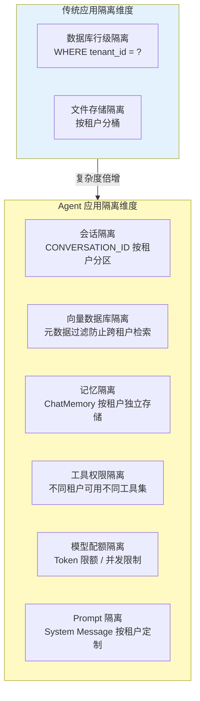
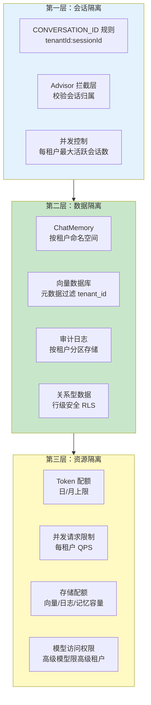
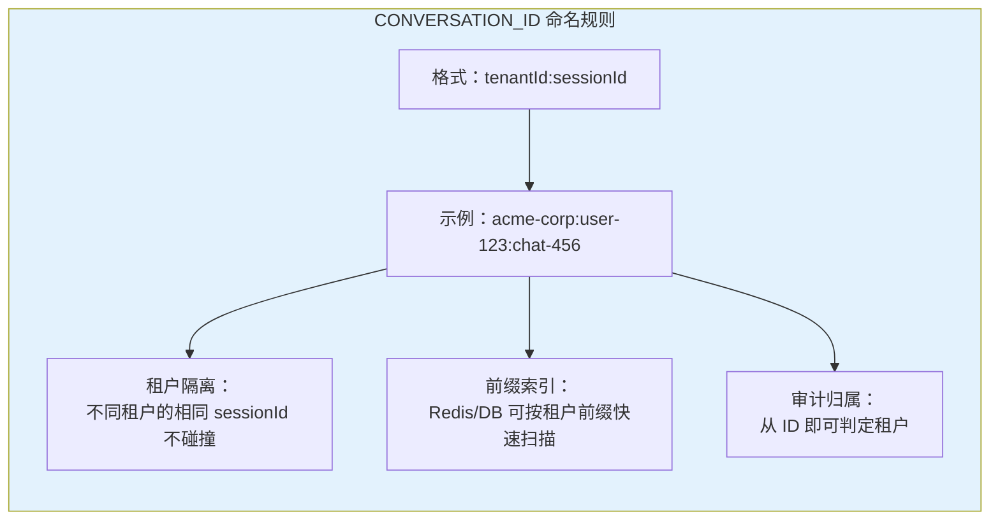
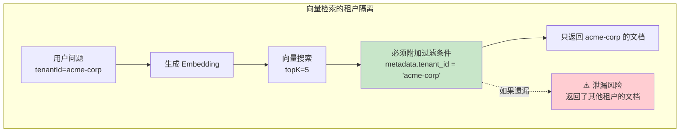
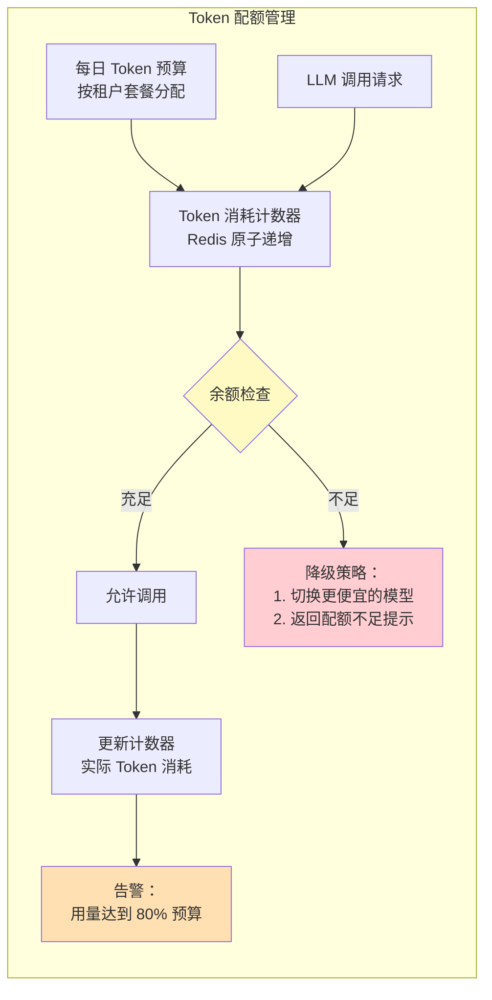
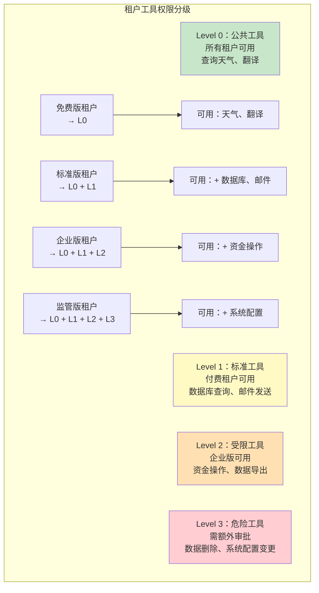
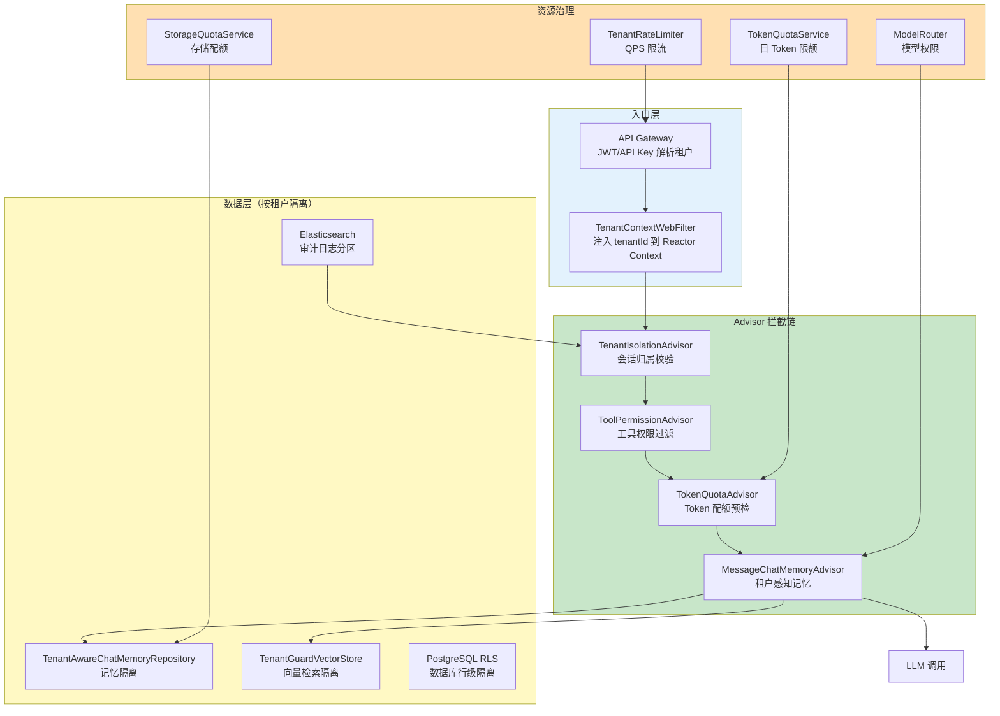
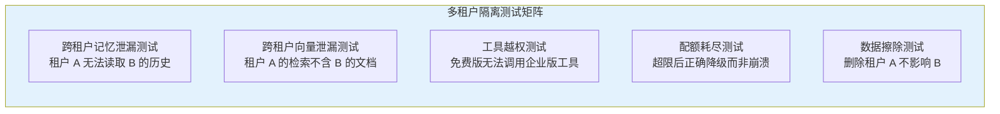

# 20-多租户隔离与资源治理

> **定位**：讲透多租户 Agent 系统的隔离架构——会话隔离、数据隔离、资源隔离三层模型，以及资源配额、工具权限分级、租户级成本控制的完整实现。读完这篇，你能构建一个让多个组织安全共用同一套 Agent 基础设施的平台。
>
> **读者画像**：正在构建 SaaS 型 AI Agent 平台，需要让多个客户（租户）安全隔离地使用同一套 Agent 服务。
>
> **前置阅读**：[04-记忆与会话管理](04-记忆与会话管理.md)、[19-历史记录持久化与合规](19-历史记录持久化与合规.md)。

---

## 1. 为什么多租户 Agent 比传统应用更难

传统多租户应用（如 CRM、ERP）主要隔离的是**结构化数据**——通过 `tenant_id` 外键就能实现行级隔离。但 AI Agent 系统中，隔离的复杂度急剧上升：



核心难点在于：Agent 的输出是**动态生成**的。即使数据层隔离做得很好，如果 System Prompt 中混入了其他租户的信息、或者向量检索泄漏了跨租户的文档，LLM 可能在回复中**间接泄漏**其他租户的数据。这不是数据库 `WHERE` 条件能解决的问题——需要**全链路隔离**。

### 1.1 典型事故场景

> 租户 A 的客服 Agent 在回答用户问题时，因为向量数据库没有正确过滤租户边界，检索到了租户 B 的内部文档片段，导致租户 B 的商业机密被泄漏给了租户 A 的用户。

这种事故的责任远大于传统应用的 SQL 注入——因为 Agent 的回复看起来合理自然，用户不会质疑。因此多租户隔离不是"可选项"，而是平台型 Agent 的**生存基线**。

---

## 2. 多租户隔离三层模型



三层模型的设计原则是**纵深防御**——任何一层被突破，其他层仍然能阻止数据泄漏。下面逐层详解。

---

## 3. 第一层：会话隔离

### 3.1 CONVERSATION_ID 按租户分区

Spring AI 用 `CONVERSATION_ID` 标识一个会话。在多租户场景中，`CONVERSATION_ID` 必须编码租户信息，确保跨租户不会出现 ID 碰撞：



```java
import org.springframework.ai.chat.memory.ChatMemory;
import org.springframework.stereotype.Component;

@Component
public class TenantConversationIdResolver {

    private static final String SEPARATOR = ":";

    /**
     * 构造租户感知的 ConversationId。
     * 格式：{tenantId}:{userId}:{sessionId}
     */
    public String resolveConversationId(String tenantId, String userId,
                                         String sessionId) {
        return tenantId + SEPARATOR + userId + SEPARATOR + sessionId;
    }

    /**
     * 从 ConversationId 中提取租户 ID。
     */
    public String extractTenantId(String conversationId) {
        if (conversationId == null || conversationId.isEmpty()) {
            throw new IllegalArgumentException("ConversationId cannot be null");
        }
        int firstColon = conversationId.indexOf(SEPARATOR);
        if (firstColon <= 0) {
            throw new IllegalArgumentException(
                    "Invalid conversationId format: " + conversationId);
        }
        return conversationId.substring(0, firstColon);
    }
}
```

### 3.2 租户上下文传播

在 WebFlux 环境中，请求在不同线程间切换，需要用 Reactor 的 `Context` 传播租户信息：

```java
import reactor.core.publisher.Mono;
import org.springframework.web.server.ServerWebExchange;
import org.springframework.web.server.WebFilter;
import org.springframework.web.server.WebFilterChain;
import org.springframework.http.HttpHeaders;

@Component
public class TenantContextWebFilter implements WebFilter {

    private final TenantResolver tenantResolver;

    public TenantContextWebFilter(TenantResolver tenantResolver) {
        this.tenantResolver = tenantResolver;
    }

    @Override
    public Mono<Void> filter(ServerWebExchange exchange, WebFilterChain chain) {
        return Mono.fromCallable(() -> {
                    // 从请求中解析租户（API Key / JWT / Header）
                    String tenantId = tenantResolver.resolve(exchange);
                    if (tenantId == null) {
                        throw new TenantNotAuthenticatedException(
                                "Missing tenant identity");
                    }
                    return tenantId;
                })
                .flatMap(tenantId -> chain.filter(exchange)
                        .contextWrite(ctx -> ctx.put("tenantId", tenantId)));
    }
}
```

### 3.3 会话归属校验 Advisor

在每次 LLM 调用前，Advisor 拦截并验证请求者是否有权访问目标会话：

```java
import org.springframework.ai.chat.client.advisor.api.*;
import org.springframework.ai.chat.memory.ChatMemory;
import org.springframework.core.Ordered;
import reactor.core.publisher.Flux;

/**
 * 租户隔离 Advisor：验证 CONVERSATION_ID 属于当前租户。
 * 必须在 MemoryAdvisor 之前执行，防止跨租户读取历史。
 */
public class TenantIsolationAdvisor implements CallAdvisor, StreamAdvisor {

    private final ConversationOwnershipService ownershipService;

    public TenantIsolationAdvisor(ConversationOwnershipService ownershipService) {
        this.ownershipService = ownershipService;
    }

    @Override
    public String getName() {
        return "TenantIsolationAdvisor";
    }

    @Override
    public int getOrder() {
        // 在 MemoryAdvisor（默认顺序 Integer.MAX_VALUE - 10）之前执行
        return Ordered.HIGHEST_PRECEDENCE + 100;
    }

    @Override
    public AdvisedResponse adviseCall(AdvisedRequest request,
                                       CallAdvisorChain chain) {
        String conversationId = request.adviseContext()
                .get(ChatMemory.CONVERSATION_ID, String.class);
        String tenantId = request.adviseContext()
                .get("tenantId", String.class);

        if (!ownershipService.validate(conversationId, tenantId)) {
            throw new TenantAccessDeniedException(
                    "Conversation " + conversationId + 
                    " does not belong to tenant " + tenantId);
        }

        return chain.nextAroundCall(request);
    }

    @Override
    public Flux<AdvisedResponse> adviseStream(AdvisedRequest request,
                                               StreamAdvisorChain chain) {
        String conversationId = request.adviseContext()
                .get(ChatMemory.CONVERSATION_ID, String.class);
        String tenantId = request.adviseContext()
                .get("tenantId", String.class);

        if (!ownershipService.validate(conversationId, tenantId)) {
            return Flux.error(new TenantAccessDeniedException(
                    "Conversation " + conversationId +
                    " does not belong to tenant " + tenantId));
        }

        return chain.nextAroundStream(request);
    }
}
```

### 3.4 并发会话数限制

```java
import org.springframework.stereotype.Service;
import java.util.concurrent.ConcurrentHashMap;
import java.util.concurrent.atomic.AtomicInteger;

@Service
public class TenantSessionQuotaService {

    private final ConcurrentHashMap<String, AtomicInteger> activeSessions =
            new ConcurrentHashMap<>();
    private final TenantConfigRepository tenantConfigRepo;

    public boolean tryAcquireSession(String tenantId) {
        int limit = tenantConfigRepo.findById(tenantId)
                .map(TenantConfig::maxConcurrentSessions)
                .orElse(10);  // 默认每租户最多 10 个并发会话

        AtomicInteger counter = activeSessions.computeIfAbsent(
                tenantId, k -> new AtomicInteger(0));
        return counter.incrementAndGet() <= limit;
    }

    public void releaseSession(String tenantId) {
        activeSessions.computeIfPresent(tenantId, (k, v) -> {
            v.decrementAndGet();
            return v.get() <= 0 ? null : v;
        });
    }
}
```

---

## 4. 第二层：数据隔离

### 4.1 ChatMemory 按租户存储

Spring AI 的 `ChatMemoryRepository` 需要按租户命名空间隔离。自定义实现通过在存储层附加租户前缀来实现：

```java
import org.springframework.ai.chat.memory.ChatMemoryRepository;
import org.springframework.ai.chat.messages.Message;
import java.util.List;

/**
 * 租户感知的 ChatMemory Repository 包装器。
 * 在内部存储 Key 上附加 tenantId 前缀，确保跨租户绝对隔离。
 */
public class TenantAwareChatMemoryRepository implements ChatMemoryRepository {

    private final ChatMemoryRepository delegate;
    private final TenantIdProvider tenantIdProvider;

    public TenantAwareChatMemoryRepository(ChatMemoryRepository delegate,
                                            TenantIdProvider tenantIdProvider) {
        this.delegate = delegate;
        this.tenantIdProvider = tenantIdProvider;
    }

    private String tenantScopedId(String conversationId) {
        String tenantId = tenantIdProvider.getCurrentTenantId();
        return "tenant:" + tenantId + ":" + conversationId;
    }

    @Override
    public List<String> findConversationIds() {
        // 只返回当前租户的 conversationId
        String prefix = "tenant:" + tenantIdProvider.getCurrentTenantId() + ":";
        return delegate.findConversationIds().stream()
                .filter(id -> id.startsWith(prefix))
                .map(id -> id.substring(prefix.length()))
                .toList();
    }

    @Override
    public List<Message> findByConversationId(String conversationId) {
        return delegate.findByConversationId(tenantScopedId(conversationId));
    }

    @Override
    public void saveAll(String conversationId, List<Message> messages) {
        delegate.saveAll(tenantScopedId(conversationId), messages);
    }

    @Override
    public void deleteByConversationId(String conversationId) {
        delegate.deleteByConversationId(tenantScopedId(conversationId));
    }
}
```

### 4.2 向量数据库元数据过滤

多租户 RAG 中最危险的泄漏路径是**向量检索跨租户**。必须在每次检索时强制附加租户过滤条件。



```java
import org.springframework.ai.vectorstore.SearchRequest;
import org.springframework.ai.vectorstore.VectorStore;
import org.springframework.ai.document.Document;
import org.springframework.stereotype.Service;
import java.util.List;
import java.util.Map;

@Service
public class TenantAwareRagService {

    private final VectorStore vectorStore;
    private final TenantIdProvider tenantIdProvider;

    /**
     * 租户隔离的向量检索。
     * 过滤表达式强制限定 tenant_id，防止跨租户检索。
     */
    public List<Document> retrieve(String query, int topK) {
        String tenantId = tenantIdProvider.getCurrentTenantId();

        SearchRequest request = SearchRequest.builder()
                .query(query)
                .topK(topK)
                // 关键：强制附加租户过滤条件
                .filterExpression("tenant_id == '" + tenantId + "'")
                .similarityThreshold(0.75)
                .build();

        return vectorStore.similaritySearch(request);
    }

    /**
     * 写入文档时附加租户元数据。
     */
    public void ingest(String content, Map<String, Object> extraMetadata) {
        String tenantId = tenantIdProvider.getCurrentTenantId();
        var metadata = new java.util.HashMap<>(extraMetadata);
        metadata.put("tenant_id", tenantId);  // 强制写入租户归属

        var doc = Document.builder()
                .text(content)
                .metadata(metadata)
                .build();
        vectorStore.add(List.of(doc));
    }
}
```

**防御性设计原则**：即使调用方忘记传租户过滤条件，底层也应该有默认过滤。这可以通过自定义 `VectorStore` 装饰器来实现：

```java
public class TenantGuardVectorStore implements VectorStore {

    private final VectorStore delegate;
    private final TenantIdProvider tenantIdProvider;

    @Override
    public List<Document> similaritySearch(SearchRequest request) {
        String tenantId = tenantIdProvider.getCurrentTenantId();
        String tenantFilter = "tenant_id == '" + tenantId + "'";

        // 如果调用方已有过滤条件，用 AND 合并；否则直接设置
        SearchRequest guardedRequest = request.getFilterExpression() != null
                ? SearchRequest.builder()
                        .query(request.getQuery())
                        .topK(request.getTopK())
                        .filterExpression(
                                "(" + request.getFilterExpression() + ") && " + tenantFilter)
                        .build()
                : SearchRequest.builder()
                        .from(request)
                        .filterExpression(tenantFilter)
                        .build();

        return delegate.similaritySearch(guardedRequest);
    }
    // ... 其他方法委托
}
```

### 4.3 审计日志按租户分区

审计日志也必须按租户隔离。物理隔离（每租户独立索引/表）比逻辑隔离（同表 tenant_id 过滤）更安全，但成本更高：

| 隔离方式 | 安全性 | 成本 | 适用场景 |
|---------|--------|------|---------|
| **逻辑隔离** | 中（依赖过滤条件正确） | 低 | 中小租户、SaaS 标准 |
| **物理隔离** | 高（独立表/索引） | 高 | 金融、医疗、高敏感租户 |
| **混合隔离** | 高（核心数据物理隔离） | 中 | 大客户物理 + 小客户逻辑 |

```java
@Service
public class TenantAwareAuditService {

    /**
     * 混合隔离策略：
     * - 企业版租户（高敏感）→ 独立 Elasticsearch 索引
     * - 标准版租户 → 共享索引 + tenant_id 过滤
     */
    public void log(AuditEntry entry) {
        TenantConfig config = tenantConfigRepo.findById(entry.getTenantId());
        String indexName = config.isEnterprise()
                ? "audit-" + entry.getTenantId()  // 独立索引
                : "audit-shared";                   // 共享索引

        auditEsClient.index(indexRequest -> indexRequest
                .index(indexName)
                .id(entry.getId())
                .document(entry), AuditEntry.class);
    }
}
```

### 4.4 数据库行级安全（RLS）

对于使用 PostgreSQL 的系统，可以利用原生 RLS（Row Level Security）在数据库层面强制隔离：

```sql
-- 启用行级安全
ALTER TABLE conversation_history ENABLE ROW LEVEL SECURITY;

-- 创建租户隔离策略：每行只能被对应租户的用户看到
CREATE POLICY tenant_isolation ON conversation_history
    USING (tenant_id = current_setting('app.current_tenant_id'));

-- 应用层在每次连接时设置当前租户
SET app.current_tenant_id = 'acme-corp';
```

```java
@Component
public class TenantRlsHandler {

    private final DataSource dataSource;

    /**
     * 在每次数据库操作前设置 RLS 上下文变量。
     */
    public void setTenantContext(String tenantId) {
        try (Connection conn = dataSource.getConnection();
             Statement stmt = conn.createStatement()) {
            stmt.execute("SET app.current_tenant_id = '" + tenantId + "'");
        } catch (SQLException e) {
            throw new RuntimeException("Failed to set tenant context", e);
        }
    }
}
```

---

## 5. 第三层：资源隔离

### 5.1 Token 配额

Token 是 Agent 最昂贵的资源。每租户必须设置 Token 配额上限，防止一个租户的流量暴涨影响其他租户。



```java
import org.springframework.data.redis.core.StringRedisTemplate;
import org.springframework.stereotype.Service;
import java.time.Duration;

@Service
public class TokenQuotaService {

    private final StringRedisTemplate redis;
    private final TenantConfigRepository tenantConfigRepo;

    private static final String QUOTA_KEY_PATTERN = "quota:token:{tenant}:{date}";

    /**
     * 检查租户是否还有足够的 Token 预算。
     * 在 LLM 调用前预检，调用后扣减实际消耗。
     */
    public boolean canConsume(String tenantId, int estimatedTokens) {
        String key = buildKey(tenantId);
        String used = redis.opsForValue().get(key);
        int usedTokens = used != null ? Integer.parseInt(used) : 0;

        int dailyLimit = tenantConfigRepo.findById(tenantId)
                .map(TenantConfig::dailyTokenLimit)
                .orElse(100_000);  // 默认每日 10 万 Token

        return usedTokens + estimatedTokens <= dailyLimit;
    }

    /**
     * 扣减实际消耗的 Token。
     */
    public void recordConsumption(String tenantId, int actualTokens) {
        String key = buildKey(tenantId);
        redis.opsForValue().increment(key, actualTokens);
        // 设置当日 Key 次日过期
        redis.expire(key, Duration.ofDays(2));
    }

    private String buildKey(String tenantId) {
        String today = java.time.LocalDate.now().toString();
        return QUOTA_KEY_PATTERN
                .replace("{tenant}", tenantId)
                .replace("{date}", today);
    }
}
```

### 5.2 并发请求限制（Rate Limiting）

```java
import io.github.bucket4j.Bucket;
import io.github.bucket4j.BucketConfiguration;
import io.github.bucket4j.redis.lettuce.LettuceBasedProxyManager;
import org.springframework.stereotype.Service;
import java.time.Duration;
import java.util.concurrent.ConcurrentHashMap;

@Service
public class TenantRateLimiter {

    private final ConcurrentHashMap<String, Bucket> buckets = new ConcurrentHashMap<>();
    private final TenantConfigRepository tenantConfigRepo;

    /**
     * 尝试获取请求许可。
     * 每租户独立限流桶，互不影响。
     */
    public boolean tryConsume(String tenantId) {
        Bucket bucket = buckets.computeIfAbsent(tenantId, this::createBucket);
        return bucket.tryConsume(1);
    }

    private Bucket createBucket(String tenantId) {
        TenantConfig config = tenantConfigRepo.findById(tenantId).orElseThrow();
        // 企业版：100 QPS；标准版：20 QPS
        int capacity = config.isEnterprise() ? 100 : 20;
        int refillPerSecond = capacity;

        return Bucket.builder()
                .addLimit(limit -> limit.capacity(capacity)
                        .refillIntervally(refillPerSecond, Duration.ofSeconds(1)))
                .build();
    }
}
```

### 5.3 存储配额

```java
@Service
public class TenantStorageQuotaService {

    private final ConversationMetadataRepository metadataRepo;
    private final TenantConfigRepository tenantConfigRepo;

    /**
     * 检查租户是否还能存储更多对话。
     */
    public boolean canStoreConversation(String tenantId) {
        long currentCount = metadataRepo.countByTenantId(tenantId);
        long maxConversations = tenantConfigRepo.findById(tenantId)
                .map(TenantConfig::maxConversations)
                .orElse(10_000L);

        return currentCount < maxConversations;
    }

    /**
     * 检查向量存储容量。
     */
    public boolean canIngestDocuments(String tenantId, int documentCount) {
        long currentDocs = vectorStore.countByTenantId(tenantId);
        long maxDocs = tenantConfigRepo.findById(tenantId)
                .map(TenantConfig::maxVectorDocuments)
                .orElse(50_000L);

        return currentDocs + documentCount <= maxDocs;
    }
}
```

### 5.4 模型访问权限

不同租户套餐可以访问不同的模型。企业版可以用 GPT-4 级模型，免费版只能用小模型：

```java
import org.springframework.ai.chat.model.ChatModel;
import org.springframework.stereotype.Service;

@Service
public class TenantModelRouter {

    private final Map<String, ChatModel> modelRegistry;
    private final TenantConfigRepository tenantConfigRepo;

    public TenantModelRouter(Map<String, ChatModel> modelRegistry,
                              TenantConfigRepository tenantConfigRepo) {
        this.modelRegistry = modelRegistry;
        this.tenantConfigRepo = tenantConfigRepo;
    }

    /**
     * 根据租户套餐选择可用的 ChatModel。
     */
    public ChatModel resolveModel(String tenantId) {
        TenantConfig config = tenantConfigRepo.findById(tenantId)
                .orElseThrow(() -> new TenantNotFoundException(tenantId));

        String allowedModel = config.allowedModelId();  // "gpt-4o" / "gpt-4o-mini"
        ChatModel model = modelRegistry.get(allowedModel);

        if (model == null) {
            // 租户无权访问高配模型，降级到基础模型
            return modelRegistry.get("default-mini");
        }

        return model;
    }
}
```

---

## 6. 工具权限分级

### 6.1 工具集分级模型



### 6.2 工具权限过滤 Advisor

Spring AI 的工具注册是全局的，但可以通过 Advisor 在运行时根据租户过滤可用工具：

```java
import org.springframework.ai.chat.client.advisor.api.*;
import org.springframework.ai.tool.ToolCallback;
import org.springframework.core.Ordered;
import java.util.List;
import java.util.Set;
import java.util.stream.Collectors;

/**
 * 工具权限 Advisor：根据租户套餐过滤可用工具。
 */
public class ToolPermissionAdvisor implements CallAdvisor {

    private final TenantToolPermissionService permissionService;

    public ToolPermissionAdvisor(TenantToolPermissionService permissionService) {
        this.permissionService = permissionService;
    }

    @Override
    public String getName() {
        return "ToolPermissionAdvisor";
    }

    @Override
    public int getOrder() {
        return Ordered.HIGHEST_PRECEDENCE + 200;
    }

    @Override
    public AdvisedResponse adviseCall(AdvisedRequest request,
                                       CallAdvisorChain chain) {
        String tenantId = request.adviseContext().get("tenantId", String.class);
        Set<String> allowedTools = permissionService.getAllowedTools(tenantId);

        // 过滤请求中的工具定义，只保留租户有权使用的
        AdvisedRequest filteredRequest = AdvisedRequest.from(request)
                .withToolCallbacks(request.toolCallbacks().stream()
                        .filter(tool -> allowedTools.contains(tool.getToolDefinition().name()))
                        .collect(Collectors.toList()))
                .build();

        return chain.nextAroundCall(filteredRequest);
    }
}
```

### 6.3 工具权限配置

```java
@Service
public class TenantToolPermissionService {

    private final TenantConfigRepository tenantConfigRepo;

    /**
     * 按套餐级别定义工具集。
     */
    private static final Map<String, Set<String>> TIER_TOOLS = Map.of(
        "FREE", Set.of("weather_query", "translation"),
        "STANDARD", Set.of("weather_query", "translation", 
                           "database_query", "email_send"),
        "ENTERPRISE", Set.of("weather_query", "translation",
                             "database_query", "email_send",
                             "fund_transfer", "data_export"),
        "REGULATED", Set.of("weather_query", "translation",
                            "database_query", "email_send",
                            "fund_transfer", "data_export",
                            "data_delete", "system_config")
    );

    /**
     * 获取租户可用的工具集。
     */
    public Set<String> getAllowedTools(String tenantId) {
        String tier = tenantConfigRepo.findById(tenantId)
                .map(TenantConfig::tier)
                .orElse("FREE");
        return TIER_TOOLS.getOrDefault(tier, TIER_TOOLS.get("FREE"));
    }

    /**
     * 检查租户是否有权使用特定工具。
     */
    public boolean hasPermission(String tenantId, String toolName) {
        return getAllowedTools(tenantId).contains(toolName);
    }
}
```

---

## 7. 多租户隔离架构全景



---

## 8. 租户配置管理

每个租户的隔离策略需要可配置、可调整。推荐使用一张配置表统一管理：

```java
public record TenantConfig(
    String tenantId,
    String tier,                    // FREE / STANDARD / ENTERPRISE / REGULATED
    int maxConcurrentSessions,      // 并发会话上限
    int dailyTokenLimit,            // 日 Token 限额
    int rateLimitPerSecond,         // QPS 限制
    long maxConversations,          // 最大对话数
    long maxVectorDocuments,        // 最大向量文档数
    String allowedModelId,          // 允许的模型 ID
    boolean isEnterprise,           // 是否企业版
    int dataRetentionDays,          // 数据保留天数
    String isolationMode            // LOGICAL / PHYSICAL
) {}
```

```java
@Configuration
public class TenantAdvisorConfig {

    @Bean
    public ChatClient tenantAwareChatClient(
            ChatModel chatModel,
            ChatMemory chatMemory,
            TenantIsolationAdvisor isolationAdvisor,
            ToolPermissionAdvisor toolAdvisor,
            TokenQuotaAdvisor quotaAdvisor) {

        return ChatClient.builder(chatModel)
                .defaultAdvisors(
                        isolationAdvisor,                    // 1. 会话归属校验
                        toolAdvisor,                          // 2. 工具权限过滤
                        quotaAdvisor,                         // 3. Token 配额预检
                        MessageChatMemoryAdvisor.builder(chatMemory).build()  // 4. 记忆注入
                )
                .build();
    }
}
```

---

## 9. 多租户测试策略

多租户隔离的正确性必须通过专门的测试来验证。关键测试场景：



```java
@SpringBootTest
class TenantIsolationTest {

    @Autowired ChatClient chatClient;
    @Autowired VectorStore vectorStore;

    @Test
    void tenant_a_cannot_retrieve_tenant_b_documents() {
        // 租户 B 写入文档
        TenantContext.runAs("tenant-b", () -> {
            vectorStore.add(List.of(Document.builder()
                    .text("Tenant B 的机密信息")
                    .metadata("tenant_id", "tenant-b")
                    .build()));
        });

        // 租户 A 检索——不应返回租户 B 的文档
        TenantContext.runAs("tenant-a", () -> {
            List<Document> results = vectorStore.similaritySearch(
                    SearchRequest.builder()
                            .query("机密信息")
                            .topK(5)
                            .filterExpression("tenant_id == 'tenant-a'")
                            .build());
            assertThat(results).allSatisfy(doc ->
                    assertThat(doc.getMetadata().get("tenant_id"))
                            .isEqualTo("tenant-a"));
        });
    }

    @Test
    void free_tier_cannot_use_enterprise_tools() {
        TenantContext.runAs("tenant-free", () -> {
            assertThatExceptionOfType(ToolNotAllowedException.class)
                    .isThrownBy(() -> chatClient.prompt()
                            .user("帮我转账 1000 元")
                            .toolCallbacks(fundTransferTool)
                            .call());
        });
    }
}
```

---

## 10. 适用场景

### 适用场景

- **SaaS 型 AI 平台**：多个企业客户共用同一套 Agent 服务，需要严格隔离
- **面向不同行业的 Agent 服务**：不同行业的合规要求不同，需要租户级差异化策略
- **内部多部门 Agent 平台**：企业内部不同部门共用 Agent 基础设施，需要部门级隔离
- **免费 + 付费模式**：不同套餐的租户享受不同的资源配额和工具权限
- **数据敏感型场景**：金融、医疗、法律行业的多客户平台

### 不适用场景

- **单租户内部应用**：只有一个组织使用，不需要租户隔离的复杂性
- **完全公开的 AI 助手**：所有用户共享同一个 Agent 实例，无数据敏感性差异
- **原型 / POC 阶段**：快速验证时不需要构建完整的隔离体系
- **极低用户量场景**：隔离的架构开销远大于收益

---

## 11. 本章总结

| 概念 | 一句话 |
|------|--------|
| **三层隔离模型** | 会话隔离（CONVERSATION_ID 分区）→ 数据隔离（元数据过滤）→ 资源隔离（配额限制） |
| **会话隔离** | `tenantId:userId:sessionId` 命名规则，Advisor 校验会话归属 |
| **数据隔离** | ChatMemory 按租户命名空间，向量检索强制 `tenant_id` 过滤 |
| **资源隔离** | Token 日限额 + QPS 限流 + 存储配额 + 模型权限 |
| **工具权限分级** | 按套餐级别分配工具集，运行时 Advisor 过滤可用工具 |
| **纵深防御** | 任何一层被突破，其他层仍能阻止泄漏 |
| **RLS** | PostgreSQL 行级安全提供数据库层面的强制隔离 |
| **测试策略** | 必须有跨租户泄漏、越权访问、配额耗尽的自动化测试 |

---

## 12. 交叉引用

**上一篇**：[19-历史记录持久化与合规](19-历史记录持久化与合规.md) — 数据生命周期管理为多租户隔离提供了归档和合规基础。

**下一篇**：[21-成本治理与Token计量](21-成本治理与Token计量.md) — 多租户场景下的 Token 配额需要精细化的成本计量体系。

**相关阅读**：
- [04-记忆与会话管理](04-记忆与会话管理.md) — ChatMemory 的基本概念，本篇在此基础上增加了租户隔离层。
- [22-Human-in-the-Loop与审批流](22-Human-in-the-Loop与审批流.md) — Level 3 危险工具的审批流程。
- [23-灰度发布与版本管理](23-灰度发布与版本管理.md) — 按租户灰度发布新 Prompt 和模型。
