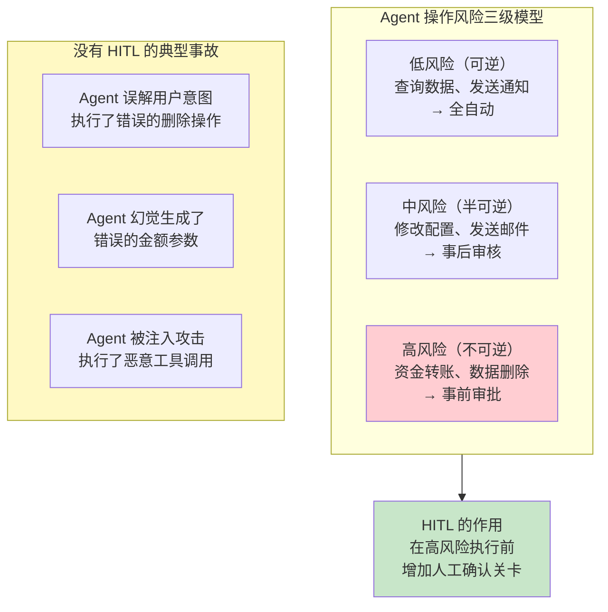
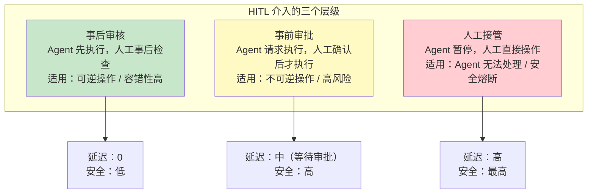
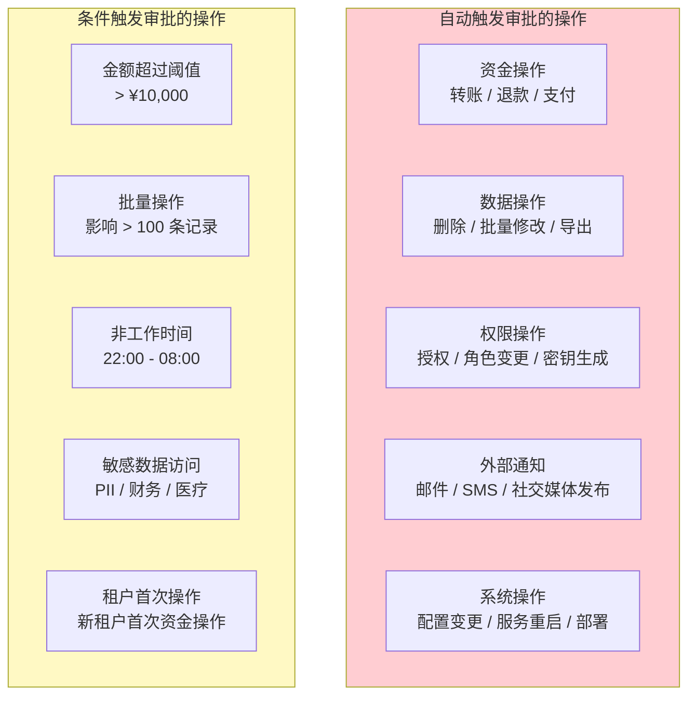
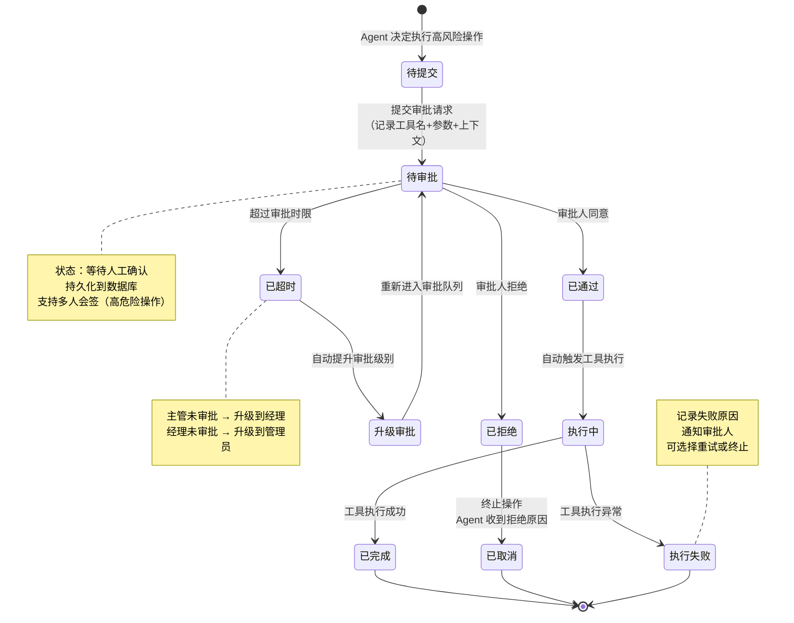
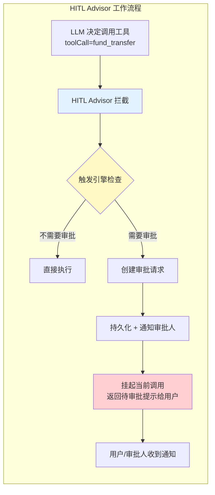
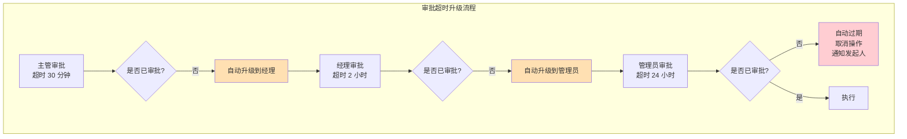
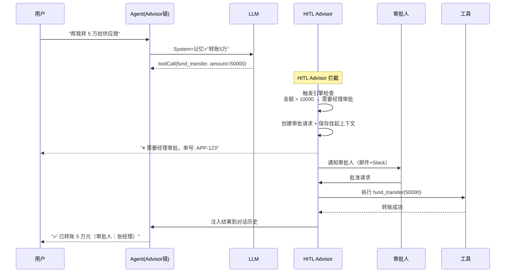

# 22-Human-in-the-Loop与审批流

> **定位**：讲透 Agent 系统中人工介入（Human-in-the-Loop, HITL）的完整设计——哪些操作需要审批、触发条件如何设计、审批状态机、超时升级机制，以及通过 Spring AI Advisor 实现 HITL 拦截的代码方案。读完这篇，你的 Agent 能在关键时刻"停下来等人拍板"。
>
> **读者画像**：已经构建了具备工具调用能力的 Agent，现在需要为高风险操作增加人工审批环节。
>
> **前置阅读**：[03-工具调用](03-工具调用.md)、[04-记忆与会话管理](04-记忆与会话管理.md)。

---

## 1. 为什么 Agent 需要人工审批

LLM 足够聪明，但还不够**可靠**——它可能产生幻觉、误解上下文、或在边界条件下做出意外决策。对于不可逆或高风险的操作，Agent 不应拥有完全自主权。



### 1.1 HITL 不是不信任 Agent

HITL 的目的不是"否定 Agent 的能力"，而是**承认 LLM 概率性输出的本质**。即使 Agent 99% 的情况下是正确的，那 1% 的错误如果发生在不可逆操作上（如删除生产数据库），代价也远远超过收益。HITL 是以极小的延迟代价换取巨大的风险降低。

### 1.2 HITL 的三个层级



---

## 2. 触发条件设计

### 2.1 哪些操作需要审批



### 2.2 触发规则配置

```java
import org.springframework.stereotype.Service;
import java.math.BigDecimal;
import java.util.List;

@Service
public class ApprovalTriggerEngine {

    private final List<ApprovalRule> rules;

    public ApprovalTriggerEngine() {
        this.rules = List.of(
            // 资金操作：金额超过 1 万必须审批
            new ApprovalRule(
                toolName -> toolName.startsWith("fund_"),
                params -> {
                    BigDecimal amount = new BigDecimal(
                            params.getOrDefault("amount", "0").toString());
                    return amount.compareTo(new BigDecimal("10000")) > 0;
                },
                ApprovalLevel.MANAGER
            ),
            // 数据删除：始终需要审批
            new ApprovalRule(
                toolName -> toolName.contains("delete") || toolName.contains("drop"),
                params -> true,
                ApprovalLevel.ADMIN
            ),
            // 批量操作：影响超过 100 条记录
            new ApprovalRule(
                toolName -> toolName.contains("batch"),
                params -> {
                    int count = Integer.parseInt(
                            params.getOrDefault("count", "0").toString());
                    return count > 100;
                },
                ApprovalLevel.MANAGER
            ),
            // 非工作时间的外部通知
            new ApprovalRule(
                toolName -> toolName.startsWith("notify_"),
                params -> {
                    int hour = java.time.LocalTime.now().getHour();
                    return hour >= 22 || hour < 8;
                },
                ApprovalLevel.SUPERVISOR
            )
        );
    }

    /**
     * 检查工具调用是否需要审批。
     * 返回 null 表示不需要审批，返回 ApprovalRequest 表示需要。
     */
    public ApprovalRequest check(String toolName, java.util.Map<String, Object> params) {
        for (ApprovalRule rule : rules) {
            if (rule.toolMatcher().test(toolName) && rule.condition().test(params)) {
                return new ApprovalRequest(toolName, params, rule.level());
            }
        }
        return null;
    }

    public record ApprovalRule(
            java.util.function.Predicate<String> toolMatcher,
            java.util.function.Predicate<java.util.Map<String, Object>> condition,
            ApprovalLevel level
    ) {}
}
```

### 2.3 审批级别

```java
public enum ApprovalLevel {
    SUPERVISOR(1, "主管审批", Duration.ofMinutes(30)),
    MANAGER(2, "经理审批", Duration.ofHours(2)),
    ADMIN(3, "管理员审批", Duration.ofHours(24)),
    SECURITY_OFFICER(4, "安全官审批", Duration.ofHours(48));

    private final int severity;
    private final String description;
    private final Duration defaultTimeout;

    ApprovalLevel(int severity, String description, Duration defaultTimeout) {
        this.severity = severity;
        this.description = description;
        this.defaultTimeout = defaultTimeout;
    }
}
```

---

## 3. 审批流程状态机

### 3.1 状态机定义



### 3.2 审批请求实体

```java
import java.time.LocalDateTime;
import java.util.Map;
import java.util.UUID;

public class ApprovalRequest {

    private final String id = UUID.randomUUID().toString();
    private String conversationId;
    private String tenantId;
    private String userId;
    private String toolName;
    private Map<String, Object> toolParams;
    private String llmReasoning;       // Agent 为什么决定调用此工具
    private ApprovalLevel requiredLevel;
    private ApprovalStatus status = ApprovalStatus.PENDING;
    private String approverId;         // 实际审批人
    private String approvalComment;    // 审批意见
    private LocalDateTime createdAt = LocalDateTime.now();
    private LocalDateTime resolvedAt;
    private LocalDateTime expiresAt;   // 审批截止时间

    /**
     * 根据审批级别计算过期时间。
     */
    public void calculateExpiry() {
        this.expiresAt = this.createdAt.plus(this.requiredLevel.getDefaultTimeout());
    }

    /**
     * 是否已超时。
     */
    public boolean isExpired() {
        return status == ApprovalStatus.PENDING
                && LocalDateTime.now().isAfter(expiresAt);
    }
}

public enum ApprovalStatus {
    PENDING,     // 待审批
    APPROVED,    // 已通过
    REJECTED,    // 已拒绝
    EXPIRED,     // 已超时
    EXECUTING,   // 执行中
    COMPLETED,   // 已完成
    CANCELLED,   // 已取消
    FAILED       // 执行失败
}
```

---

## 4. 通过 Spring AI Advisor 实现 HITL 拦截

### 4.1 HITL Advisor 核心设计



### 4.2 完整实现

```java
import org.springframework.ai.chat.client.advisor.api.*;
import org.springframework.ai.chat.messages.AssistantMessage;
import org.springframework.ai.chat.model.ChatResponse;
import org.springframework.ai.chat.model.Generation;
import org.springframework.ai.tool.definition.ToolDefinition;
import org.springframework.core.Ordered;
import reactor.core.publisher.Flux;
import reactor.core.publisher.Mono;

/**
 * Human-in-the-Loop Advisor：拦截高风险工具调用，创建审批请求并暂停执行。
 *
 * 核心机制：
 * 1. 在 LLM 返回工具调用请求后拦截
 * 2. 检查是否需要审批
 * 3. 如果需要：创建审批记录，返回"等待审批"提示，不执行工具
 * 4. 审批通过后由独立流程执行被挂起的工具调用
 */
public class HumanInTheLoopAdvisor implements CallAdvisor {

    private final ApprovalTriggerEngine triggerEngine;
    private final ApprovalRequestRepository approvalRepo;
    private final ApprovalNotificationService notificationService;
    private final PendingToolExecutionStore pendingStore;

    public HumanInTheLoopAdvisor(ApprovalTriggerEngine triggerEngine,
                                  ApprovalRequestRepository approvalRepo,
                                  ApprovalNotificationService notificationService,
                                  PendingToolExecutionStore pendingStore) {
        this.triggerEngine = triggerEngine;
        this.approvalRepo = approvalRepo;
        this.notificationService = notificationService;
        this.pendingStore = pendingStore;
    }

    @Override
    public String getName() {
        return "HumanInTheLoopAdvisor";
    }

    @Override
    public int getOrder() {
        // 在工具执行 Advisor 之后拦截——LLM 已决定调用工具，但还未执行
        return Ordered.LOWEST_PRECEDENCE - 100;
    }

    @Override
    public ChatClientResponse adviseCall(ChatClientRequest request,
                                       CallAdvisorChain chain) {
        // 先让 LLM 生成响应（包含可能的工具调用意图）
        ChatClientResponse response = chain.nextCall(request);

        // 检查响应中是否包含工具调用
        var toolCalls = extractToolCalls(response);
        if (toolCalls.isEmpty()) {
            return response;  // 没有工具调用，直接返回
        }

        // 检查每个工具调用是否需要审批
        for (ToolCallContext tc : toolCalls) {
            ApprovalRequest approval = triggerEngine.check(tc.toolName(),
                    tc.arguments());
            if (approval != null) {
                // 需要审批——挂起执行
                return suspendForApproval(request, response, approval, tc);
            }
        }

        return response;  // 全部不需要审批，正常返回
    }

    /**
     * 挂起工具执行，创建审批请求。
     */
    private ChatClientResponse suspendForApproval(ChatClientRequest request,
                                                ChatClientResponse originalResponse,
                                                ApprovalRequest approval,
                                                ToolCallContext toolCall) {
        // 1. 填充审批请求上下文
        var ctx = request.context();
        approval.setConversationId(ctx.get(ChatMemory.CONVERSATION_ID, String.class));
        approval.setTenantId(ctx.get("tenantId", String.class));
        approval.setUserId(ctx.get("userId", String.class));
        approval.setLlmReasoning(extractReasoning(originalResponse));
        approval.calculateExpiry();

        // 2. 持久化审批请求
        approvalRepo.save(approval);

        // 3. 保存被挂起的工具调用上下文（审批通过后恢复执行）
        PendingToolExecution pending = new PendingToolExecution(
                approval.getId(),
                toolCall.toolName(),
                toolCall.arguments(),
                request.context(),
                originalResponse
        );
        pendingStore.save(pending);

        // 4. 通知审批人
        notificationService.notifyApprovers(approval);

        // 5. 替换响应内容——告诉用户正在等待审批
        String userNotice = """
            ⏸ 需要审批才能继续操作。

            操作：%s
            原因：%s
            审批级别：%s
            审批单号：%s

            已通知审批人，预计处理时间：%s。
            """.formatted(
                toolCall.toolName(),
                approval.getLlmReasoning(),
                approval.getRequiredLevel().getDescription(),
                approval.getId(),
                approval.getRequiredLevel().getDefaultTimeout().toHours() + " 小时"
        );

        // 构造替代响应
        var modifiedResponse = ChatResponse.builder()
                .withGenerations(List.of(new Generation(new AssistantMessage(userNotice))))
                .build();

        return new ChatClientResponse(modifiedResponse, request.context());
    }

    private List<ToolCallContext> extractToolCalls(ChatClientResponse response) {
        return response.response().getResults().stream()
                .flatMap(g -> g.getOutput().getToolCalls().stream())
                .map(tc -> new ToolCallContext(tc.name(), tc.arguments()))
                .toList();
    }

    private String extractReasoning(ChatClientResponse response) {
        return response.response().getResult().getOutput().getText();
    }

    private record ToolCallContext(String toolName, Map<String, Object> arguments) {}
}
```

### 4.3 审批通过后的执行

审批通过后，由独立的调度器恢复被挂起的工具调用：

```java
@Service
public class ApprovalResolutionService {

    private final ApprovalRequestRepository approvalRepo;
    private final PendingToolExecutionStore pendingStore;
    private final ToolExecutionService toolExecutionService;
    private final ChatMemory chatMemory;

    /**
     * 审批通过后调用此方法，恢复被挂起的工具执行。
     */
    public void onApproved(String approvalId, String approverId, String comment) {
        ApprovalRequest approval = approvalRepo.findById(approvalId);
        approval.setStatus(ApprovalStatus.APPROVED);
        approval.setApproverId(approverId);
        approval.setApprovalComment(comment);
        approval.setResolvedAt(LocalDateTime.now());
        approvalRepo.save(approval);

        // 恢复被挂起的工具调用
        PendingToolExecution pending = pendingStore.findById(approvalId);
        executePendingTool(pending, approval);
    }

    /**
     * 审批拒绝后调用此方法，通知 Agent 和用户。
     */
    public void onRejected(String approvalId, String approverId, String comment) {
        ApprovalRequest approval = approvalRepo.findById(approvalId);
        approval.setStatus(ApprovalStatus.REJECTED);
        approval.setApproverId(approverId);
        approval.setApprovalComment(comment);
        approval.setResolvedAt(LocalDateTime.now());
        approvalRepo.save(approval);

        // 将拒绝信息注入对话历史，让 Agent 知道操作被拒绝
        String rejectionMessage = "操作被拒绝。审批人：%s。理由：%s"
                .formatted(approverId, comment);
        chatMemory.add(approval.getConversationId(),
                new AssistantMessage(rejectionMessage));

        // 清理挂起状态
        pendingStore.deleteById(approvalId);
    }

    private void executePendingTool(PendingToolExecution pending,
                                     ApprovalRequest approval) {
        approval.setStatus(ApprovalStatus.EXECUTING);
        approvalRepo.save(approval);

        try {
            Object result = toolExecutionService.execute(
                    pending.toolName(),
                    pending.arguments()
            );

            // 将工具执行结果注入对话历史
            String resultMessage = "工具 %s 执行成功。结果：%s"
                    .formatted(pending.toolName(), result);
            chatMemory.add(pending.conversationId(),
                    new AssistantMessage(resultMessage));

            approval.setStatus(ApprovalStatus.COMPLETED);
        } catch (Exception e) {
            approval.setStatus(ApprovalStatus.FAILED);
            notificationService.notifyFailure(approval, e);
        } finally {
            approval.setResolvedAt(LocalDateTime.now());
            approvalRepo.save(approval);
            pendingStore.deleteById(approval.getId());
        }
    }
}
```

---

## 5. 超时升级机制

### 5.1 升级逻辑



### 5.2 升级实现

```java
@Service
public class ApprovalEscalationService {

    private final ApprovalRequestRepository approvalRepo;
    private final ApprovalNotificationService notificationService;

    /**
     * 定时检查超时审批请求，自动升级审批级别。
     */
    @org.springframework.scheduling.annotation.Scheduled(
            fixedRate = 60_000)  // 每分钟检查一次
    public void checkAndEscalate() {
        var pendingApprovals = approvalRepo.findByStatus(ApprovalStatus.PENDING);

        for (ApprovalRequest approval : pendingApprovals) {
            if (!approval.isExpired()) continue;

            // 获取当前级别的下一级
            ApprovalLevel nextLevel = getNextLevel(approval.getRequiredLevel());

            if (nextLevel != null) {
                // 升级审批级别
                approval.setRequiredLevel(nextLevel);
                approval.calculateExpiry();  // 重新计算过期时间
                approvalRepo.save(approval);

                // 通知更高级别审批人
                notificationService.notifyApprovers(approval);

                // 记录升级日志
                auditLogService.logEscalation(approval, nextLevel);
            } else {
                // 已经是最高级别——自动过期取消
                approval.setStatus(ApprovalStatus.EXPIRED);
                approvalRepo.save(approval);

                // 通知发起人
                notificationService.notifyExpiry(approval);

                // 清理挂起的工具执行
                pendingStore.deleteById(approval.getId());
            }
        }
    }

    private ApprovalLevel getNextLevel(ApprovalLevel current) {
        ApprovalLevel[] levels = ApprovalLevel.values();
        int currentIndex = current.ordinal();
        return currentIndex < levels.length - 1 ? levels[currentIndex + 1] : null;
    }
}
```

---

## 6. 审批通知

### 6.1 多渠道通知

```java
@Service
public class ApprovalNotificationService {

    private final EmailService emailService;
    private final SmsService smsService;
    private final SlackService slackService;
    private final WebSocketPushService wsService;

    /**
     * 根据审批级别选择通知渠道。
     */
    public void notifyApprovers(ApprovalRequest approval) {
        Set<String> approverIds = findApprovers(approval.getRequiredLevel(),
                approval.getTenantId());

        // 根据级别决定通知方式
        switch (approval.getRequiredLevel()) {
            case SUPERVISOR -> {
                // 低级别：只通知在线审批人
                wsService.notifyOnlineApprovers(approverIds, approval);
            }
            case MANAGER -> {
                // 中级别：WebSocket + 邮件
                wsService.notifyOnlineApprovers(approverIds, approval);
                emailService.sendApprovalEmail(approverIds, approval);
            }
            case ADMIN, SECURITY_OFFICER -> {
                // 高级别：全渠道通知
                wsService.notifyOnlineApprovers(approverIds, approval);
                emailService.sendApprovalEmail(approverIds, approval);
                smsService.sendApprovalSms(approverIds, approval);
                slackService.sendApprovalMessage(approverIds, approval);
            }
        }
    }
}
```

### 6.2 审批交互界面

```java
@RestController
@RequestMapping("/api/approvals")
public class ApprovalController {

    private final ApprovalResolutionService resolutionService;
    private final ApprovalRequestRepository approvalRepo;

    /**
     * 查看待我审批的请求列表。
     */
    @GetMapping("/pending")
    public List<ApprovalRequest> myPendingApprovals(
            @RequestParam String approverId) {
        return approvalRepo.findPendingForApprover(approverId);
    }

    /**
     * 批准审批请求。
     */
    @PostMapping("/{id}/approve")
    public ResponseEntity<Void> approve(
            @PathVariable String id,
            @RequestParam String approverId,
            @RequestBody(required = false) String comment) {
        resolutionService.onApproved(id, approverId, comment);
        return ResponseEntity.ok().build();
    }

    /**
     * 拒绝审批请求。
     */
    @PostMapping("/{id}/reject")
    public ResponseEntity<Void> reject(
            @PathVariable String id,
            @RequestParam String approverId,
            @RequestBody(required = false) String comment) {
        resolutionService.onRejected(id, approverId, comment);
        return ResponseEntity.ok().build();
    }

    /**
     * 审批详情（包含 Agent 的推理上下文、工具参数等）。
     */
    @GetMapping("/{id}")
    public ApprovalDetail getDetail(@PathVariable String id) {
        ApprovalRequest approval = approvalRepo.findById(id);
        PendingToolExecution pending = pendingStore.findById(id);
        return new ApprovalDetail(approval, pending);
    }
}
```

---

## 7. HITL 的 Advisor 注册

```java
@Configuration
public class HitlAdvisorConfig {

    @Bean
    public ChatClient hitlAwareChatClient(
            ChatModel chatModel,
            ChatMemory chatMemory,
            HumanInTheLoopAdvisor hitlAdvisor,
            TenantIsolationAdvisor tenantAdvisor) {

        return ChatClient.builder(chatModel)
                .defaultAdvisors(
                        tenantAdvisor,                    // 1. 租户隔离
                        MessageChatMemoryAdvisor.builder(chatMemory).build(),  // 2. 记忆
                        hitlAdvisor                       // 3. HITL 拦截
                )
                .build();
    }
}
```

### 7.1 完整流程时序图



---

## 8. 适用场景

### 适用场景

- **金融 Agent**：转账、支付、退款等资金操作必须经过人工审批
- **运维 Agent**：数据库变更、服务部署、配置修改等高风险操作
- **数据处理 Agent**：批量删除、敏感数据导出、数据迁移
- **客服 Agent**：退款审批、投诉升级、VIP 客户特殊处理
- **DevOps Agent**：CI/CD 管道触发、生产环境操作、密钥管理
- **合规要求场景**：金融、医疗等受监管行业中涉及决策的操作

### 不适用场景

- **纯信息查询**：只读操作，没有副作用，不需要审批
- **低风险自动化**：如推荐内容生成、文本翻译、摘要提取
- **用户自服务**：用户操作自己的数据（如编辑自己的文档）
- **实时对话场景**：审批延迟会破坏对话体验（如闲聊、咨询）
- **高频操作**：审批成本远高于操作本身的场景

---

## 9. 本章总结

| 概念 | 一句话 |
|------|--------|
| **HITL 三层** | 事后审核（低风险）→ 事前审批（高风险）→ 人工接管（安全熔断） |
| **触发条件** | 按工具类型（自动触发）+ 按参数阈值（条件触发）双重判定 |
| **审批状态机** | 待提交→待审批→已通过/已拒绝/已超时→执行中→已完成/失败 |
| **超时升级** | PENDING 超时后自动提升审批级别，最高级仍超时则自动取消 |
| **HITL Advisor** | 拦截 LLM 工具调用意图，需要审批时挂起执行并返回用户提示 |
| **挂起恢复** | 审批通过后，由独立服务恢复被挂起的工具执行 |
| **审计追踪** | 每次审批记录：操作类型+参数+审批人+审批意见+时间戳 |

---

## 10. 交叉引用

**上一篇**：[21-成本治理与Token计量](21-成本治理与Token计量.md) — 审批等待期间不消耗 Token，HITL 也是成本治理的一种手段。

**下一篇**：[23-灰度发布与版本管理](23-灰度发布与版本管理.md) — 新版本 Prompt 的灰度发布也需要 HITL 机制来保障安全。

**相关阅读**：
- [03-工具调用](03-工具调用.md) — HITL 拦截的是工具调用，需要先理解工具调用机制。
- [20-多租户隔离与资源治理](20-多租户隔离与资源治理.md) — Level 3 危险工具需要额外的 HITL 审批层。
- [19-历史记录持久化与合规](19-历史记录持久化与合规.md) — 审批记录是合规审计日志的关键组成部分。
