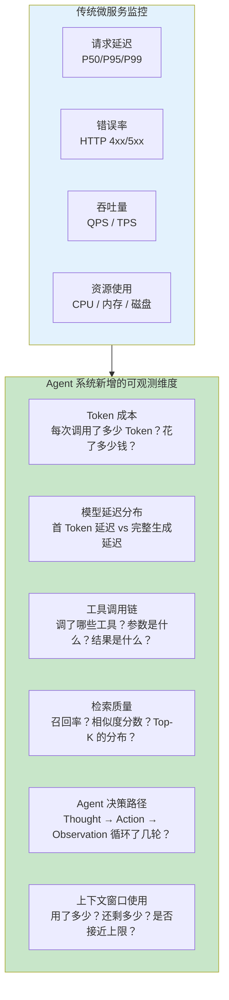
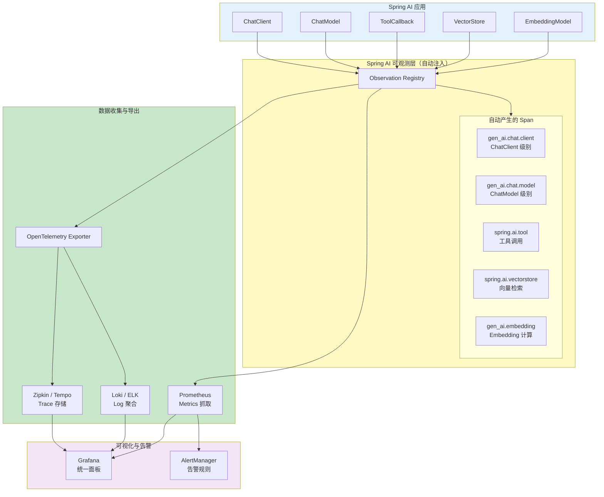
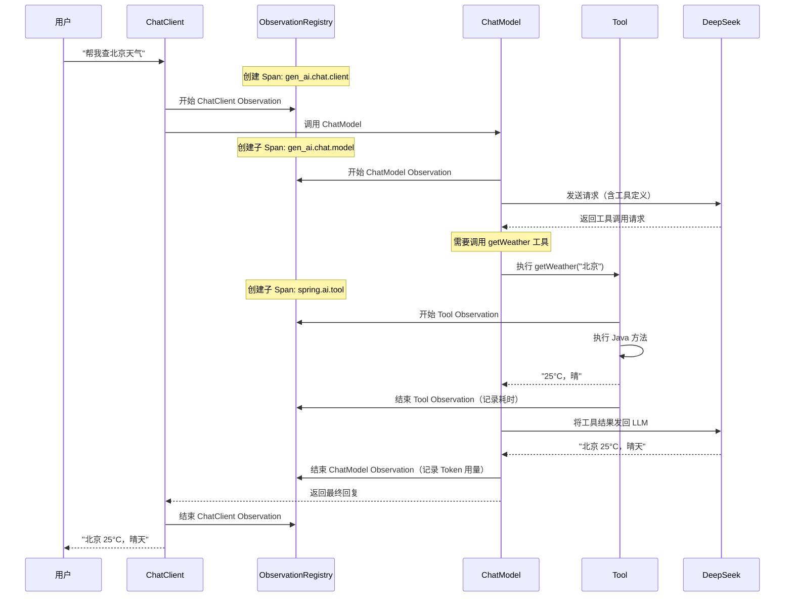
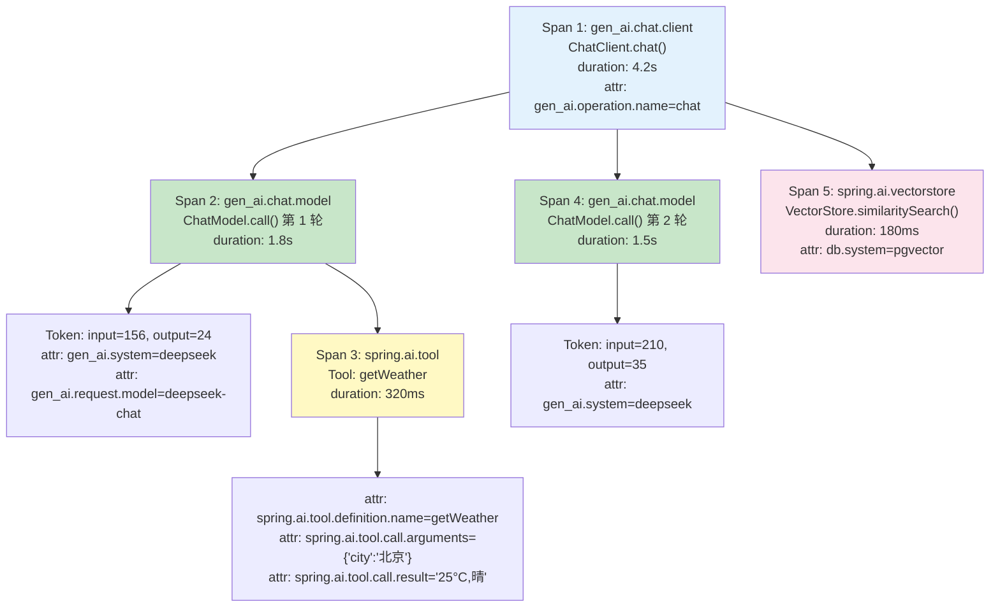
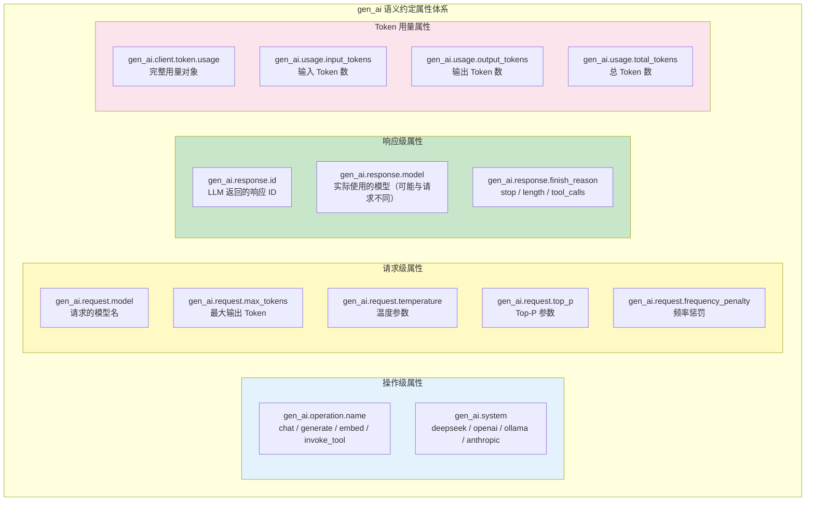
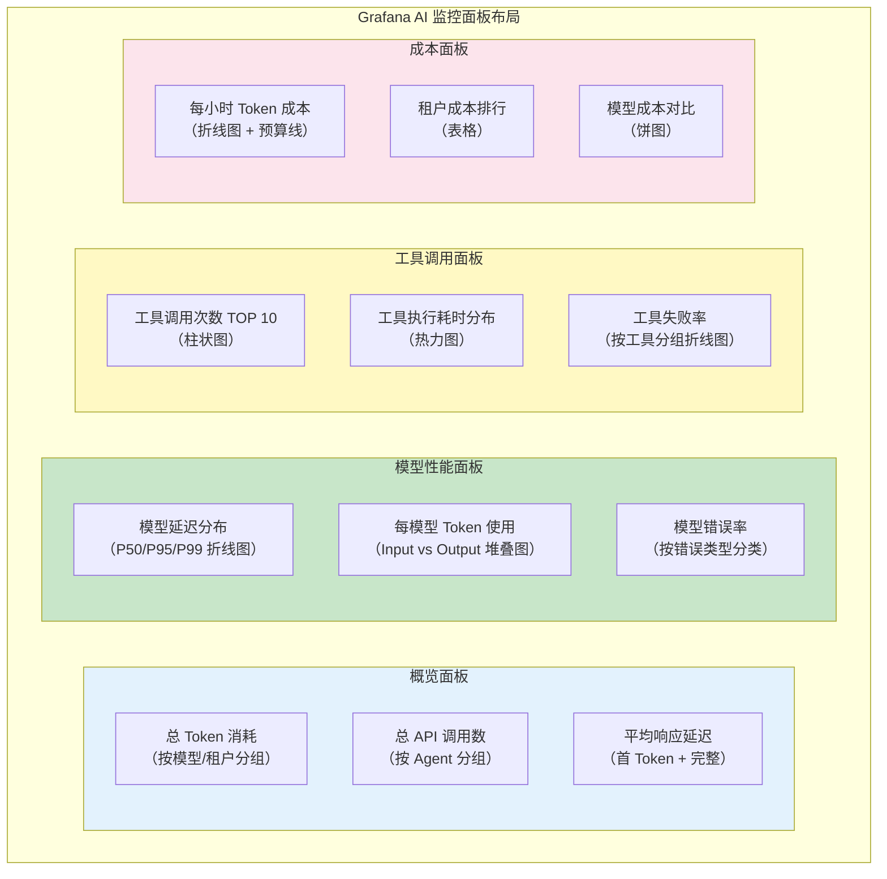
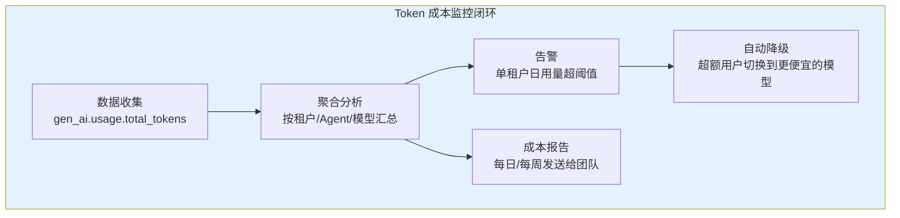

# 22-全链路可观测性

> **定位**：讲透 Spring AI 2.0 原生可观测性体系——ChatClient/ChatModel/Tool/VectorStore/EmbeddingModel 全链路 Micrometer Observation、gen_ai 语义约定、OpenTelemetry 集成、Prometheus + Grafana 监控面板。读完这篇，你能搭建出覆盖 Agent 每一步操作的完整可观测体系，从用户输入到 Token 消耗到工具执行，全链路可见、可追溯、可告警。
>
> **读者画像**：已经完成 Agent 系统的微服务拆分（[21-微服务拆分与 Agent 部署](21-微服务拆分与Agent部署.md)），需要解决跨服务追踪、性能瓶颈定位、成本监控、异常排查等问题。
>
> **前置阅读**：[21-微服务拆分与 Agent 部署](21-微服务拆分与Agent部署.md)。

---

## 1. 为什么 Agent 系统需要专属的可观测性

### 1.1 传统微服务监控不够用的地方

传统微服务的可观测性关注三件事：请求延迟（P99 延迟多少）、错误率（HTTP 5xx 比例）、吞吐量（QPS 多少）。但 Agent 系统引入了全新的可观测维度：



### 1.2 Agent 系统可观测性的三大支柱

| 支柱 | 关注什么 | 传统对应 |
|------|---------|---------|
| **Metrics（指标）** | Token 消耗速率、模型延迟分布、工具调用频次 | QPS、延迟、错误率 |
| **Traces（链路追踪）** | 一次用户请求经过哪些 Span（ChatModel → Tool → VectorStore） | HTTP 请求链路 |
| **Logs（日志）** | 用户输入内容、LLM 输出内容、工具参数和结果 | 应用日志 |

关键区别：Agent 系统的 Trace 不是简单的"Service A 调 Service B"，而是一个树形结构——一次对话可能包含多次模型调用、多次工具调用、多次向量检索，形成嵌套的 Span 树。

---

## 2. Spring AI 2.0 可观测性架构全景

### 2.1 架构总览



### 2.2 自动埋点的工作原理

Spring AI 2.0 在每个核心组件中内置了 Micrometer Observation。你不需要手动埋点——只要引入了正确的依赖，所有 ChatClient 调用、工具执行、向量检索、Embedding 计算都会自动产生 Observation 事件。



---

## 3. 全链路 Span 树形结构

### 3.1 一次完整 Agent 对话的 Span 树



从这棵 Span 树中，你可以清晰地看到：

1. **总耗时 4.2 秒**——其中两轮模型调用占 3.3 秒（78%），工具调用 320ms（8%），向量检索 180ms（4%）
2. **Token 消耗**——第 1 轮 input=156/output=24，第 2 轮 input=210/output=35，总计 425 Token
3. **工具调用详情**——调用了 getWeather 工具，参数是 `{'city':'北京'}`，结果 `"25°C,晴"`
4. **向量检索**——发生了向量检索，耗时 180ms，使用的 pgvector

### 3.2 Span 之间的父子关系

```java
// Spring AI 2.0.0
// Span 父子关系由 ObservationRegistry 自动管理
// 当前 Span 用 Micrometer Tracing 的 Tracer.currentSpan() 获取（响应式线程经 Reactor Context 传播）
// import: io.micrometer.tracing.Tracer / Span / SpanContext   // ⚠ 需引入依赖 io.micrometer:micrometer-tracing（本地未下载，未 javap 实证）
@Component
public class SpanHierarchyInspector {

    private final Tracer tracer;   // ⚠ 需引入依赖 io.micrometer:micrometer-tracing（本地未下载，未 javap 实证）

    public SpanHierarchyInspector(Tracer tracer) {
        this.tracer = tracer;
    }

    public void printCurrentSpanHierarchy() {
        Span current = tracer.currentSpan();
        if (current == null) {
            System.out.println("No active span");
            return;
        }

        // 打印当前 Span 的 Trace/Span 标识（Observation.Context 没有 getTraceId/getDuration）
        SpanContext spanContext = current.context();
        System.out.println("TraceId: " + spanContext.traceId());
        System.out.println("SpanId: " + spanContext.spanId());
        System.out.println("ParentId: " + spanContext.parentId());
    }
}
```

---

## 4. gen_ai 语义约定详解

### 4.1 什么是 gen_ai 语义约定

OpenTelemetry 社区定义了一套专门针对 AI/LLM 的语义约定（Semantic Conventions），命名空间为 `gen_ai.*`。Spring AI 2.0 完整实现了这些约定，确保你的 Agent 可观测数据可以与业界标准工具兼容。

### 4.2 核心属性体系



### 4.3 完整属性详解表格

| 属性名 | 类型 | 说明 | 示例值 |
|--------|------|------|--------|
| `gen_ai.operation.name` | string | AI 操作类型 | `chat`, `generate`, `embed`, `invoke_tool` |
| `gen_ai.system` | string | AI 系统标识（模型提供商） | `deepseek`, `openai`, `ollama` |
| `gen_ai.request.model` | string | 请求中指定的模型 | `deepseek-chat`, `deepseek-reasoner` |
| `gen_ai.request.max_tokens` | int | 最大输出 Token 限制 | `4096` |
| `gen_ai.request.temperature` | double | 温度参数 | `0.7` |
| `gen_ai.request.top_p` | double | Top-P 采样参数 | `0.9` |
| `gen_ai.request.frequency_penalty` | double | 频率惩罚参数 | `0.0` |
| `gen_ai.request.presence_penalty` | double | 存在惩罚参数 | `0.0` |
| `gen_ai.request.stop_sequences` | string[] | 停止序列 | `["\n\n"]` |
| `gen_ai.response.id` | string | LLM 返回的唯一响应 ID | `chatcmpl-abc123` |
| `gen_ai.response.model` | string | 实际使用的模型 | `deepseek-chat-v2` |
| `gen_ai.response.finish_reason` | string | 生成结束原因 | `stop`, `length`, `tool_calls` |
| `gen_ai.usage.input_tokens` | int | 输入 Token 数 | `156` |
| `gen_ai.usage.output_tokens` | int | 输出 Token 数 | `35` |
| `gen_ai.usage.total_tokens` | int | 总 Token 数 | `191` |
| `gen_ai.client.token.usage` | object | 完整用量对象（结构化） | `{"input":156,"output":35}` |

### 4.4 Spring AI 工具相关 Span 属性（javap 实证 `ToolCallingObservationDocumentation` 字节码，2026-08-16）

| 基数 | 属性名 | 类型 | 说明 | 示例值 |
|------|--------|------|------|--------|
| 低 | `gen_ai.operation.type` | string | 操作类型（OTel 语义） | `execute_tool` |
| 低 | `gen_ai.provider` | string | 提供商 | `deepseek` |
| 低 | `spring.ai.kind` | string | Spring AI 观测类型 | `tool_call` |
| 低 | `spring.ai.tool.definition.name` | string | 工具方法名 | `getWeather` |
| 低 | `spring.ai.tool.type` | string | 工具类型 | `function`, `method` |
| 高 | `spring.ai.tool.definition.description` | string | 工具描述 | `查询指定城市的天气` |
| 高 | `spring.ai.tool.definition.schema` | string | 工具入参 JSON Schema | `{"type":"object",...}` |
| 高 | `spring.ai.tool.call.id` | string | 工具调用唯一 ID | `call_abc123` |
| 高 | `spring.ai.tool.call.arguments` | string | 工具调用参数（JSON） | `{"city":"北京"}` |
| 高 | `spring.ai.tool.call.result` | string | 工具返回结果 | `25°C，晴` |

> **实证要点**：真实标签**没有** `spring.ai.tool.definition.type`（工具类型是 `spring.ai.tool.type`）、**没有** `spring.ai.tool.call.error`/`call.duration`（错误走 Span 状态/事件、耗时由 Span 计时，不落标签）。以上 10 个键名从 `ToolCallingObservationDocumentation$LowCardinalityKeyNames/$HighCardinalityKeyNames` 字节码 `asString()` 提取。

### 4.5 VectorStore 相关 Span 属性（javap 实证 `VectorStoreObservationDocumentation`，2026-08-16）

| 基数 | 属性名 | 类型 | 说明 | 示例值 |
|------|--------|------|------|--------|
| 低 | `db.system` | string | 向量数据库类型（OTel 语义） | `pgvector`, `milvus`, `redis` |
| 低 | `db.operation.name` | string | 数据库操作 | `similarity_search`, `add` |
| 低 | `spring.ai.kind` | string | Spring AI 观测类型 | `vector_store` |
| 高 | `db.vector.query.filter` | string | 检索过滤表达式 | `category = '退换货'` |

> 其余向量库细节标签（如检索 top-k / 相似度阈值 / 结果数）由具体实现的 Convention 决定，**以所引版本 javap 输出为准**——本表仅列 `VectorStoreObservationDocumentation` 已实证键。

---

## 5. 配置 Spring AI 可观测性

### 5.1 依赖配置

```xml
<!-- pom.xml -->
<!-- Spring AI 核心（自动启用 Observation） -->
<dependency>
    <groupId>org.springframework.ai</groupId>
    <artifactId>spring-ai-starter-model-openai</artifactId>
</dependency>

<!-- Micrometer + Prometheus（Metrics 导出） -->
<dependency>
    <groupId>io.micrometer</groupId>
    <artifactId>micrometer-registry-prometheus</artifactId>
</dependency>

<!-- OpenTelemetry（Trace 导出） -->
<dependency>
    <groupId>io.opentelemetry.instrumentation</groupId>
    <artifactId>opentelemetry-spring-boot-starter</artifactId>
</dependency>

<!-- OpenTelemetry Zipkin Exporter -->
<dependency>
    <groupId>io.opentelemetry</groupId>
    <artifactId>opentelemetry-exporter-zipkin</artifactId>
</dependency>
```

### 5.2 application.yml 配置

```yaml
# application.yml
spring:
  ai:
    # 模型配置（DeepSeek，OpenAI 兼容格式）
    openai:
      api-key: ${DEEPSEEK_API_KEY}
      base-url: https://api.deepseek.com
      chat:
        options:
          model: deepseek-chat
          temperature: 0.7

    # 可观测性配置（ChatObservationProperties 实证：前缀 spring.ai.chat.observations.*，无 include-prompt-content）
    chat:
      observations:
        log-prompt: true          # 记录用户输入（注意 PII 风险）
        log-completion: true      # 记录 LLM 输出（注意 PII 风险）
        include-error-logging: true

management:
  endpoints:
    web:
      exposure:
        include: health,info,prometheus,metrics
  metrics:
    tags:
      application: ai-agent-service
      namespace: production
  tracing:
    sampling:
      probability: 1.0  # 开发环境 100% 采样；生产环境建议 0.1-0.5
  prometheus:
    metrics:
      export:
        enabled: true
        step: 15s
```

### 5.3 高级 Observation 配置

```java
// Spring AI 2.0.0
// 自定义 Observation 配置——控制哪些内容被记录
@Configuration
public class ObservationConfiguration {

    // 说明：Spring Boot 自动装配已提供 ObservationRegistry Bean（ObservationAutoConfiguration），
    // 一般只需注册 ObservationHandler / ObservationFilter Bean 即可自动挂载。
    // 若需手工组装，用 Micrometer 的 AllMatchingCompositeObservationHandler（ObservationHandlerGrouping 不存在）。
    @Bean
    public ObservationRegistry observationRegistry(
            List<ObservationHandler<?>> handlers) {
        ObservationRegistry registry = ObservationRegistry.create();
        registry.observationConfig().observationHandler(
                new AllMatchingCompositeObservationHandler(handlers));
        return registry;
    }

    // 自定义 Observation Filter——在 Span 上附加业务标签
    @Bean
    public ObservationFilter businessContextFilter() {
        return context -> {
            // 给每个 Span 附加业务信息
            if (context.getName().startsWith("gen_ai")) {
                // WebFlux 铁律：禁止 MDC/ThreadLocal 传请求上下文。
                // 正确姿势：请求上下文经 Reactor Context 传播，在入口（Controller/Advisor）
                // 写入 ChatClientRequest.context，再由上游写入 Observation.Context 属性。
                Object userId = context.get("userId");
                Object tenantId = context.get("tenantId");
                Object agentId = context.get("agentId");

                // Observation.Context 无 putKey()，用 addLowCardinalityKeyValue(KeyValue)（Micrometer 实证）
                if (userId != null) {
                    context.addLowCardinalityKeyValue(
                            KeyValue.of("business.user.id", String.valueOf(userId)));
                }
                if (tenantId != null) {
                    context.addLowCardinalityKeyValue(
                            KeyValue.of("business.tenant.id", String.valueOf(tenantId)));
                }
                if (agentId != null) {
                    context.addLowCardinalityKeyValue(
                            KeyValue.of("business.agent.id", String.valueOf(agentId)));
                }
            }
            return context;
        };
    }

    // 自定义 Observation Handler——将 Span 事件转发到日志
    @Bean
    public ObservationHandler<Observation.Context> loggingHandler() {
        return new ObservationTextPublisher(
                event -> System.out.println("[OBSERVATION] " + event)
        );
    }
}
```

### 5.4 敏感信息过滤

```java
// Spring AI 2.0.0
// 自定义 ChatModel Observation Convention——对 Prompt/Completion 做 PII 脱敏
// 说明：Observation.Context 无 get("gen_ai.prompt")/putKey()；正确扩展点是实现
// ChatModelObservationConvention，委托 DefaultChatModelObservationConvention 后改写高基数属性。
// import: java.util.ArrayList / List / regex.Pattern
//         io.micrometer.common.KeyValue / KeyValues
//         io.micrometer.observation.Observation
//         org.springframework.ai.chat.observation.ChatModelObservationContext / ChatModelObservationConvention / DefaultChatModelObservationConvention
@Component
public class PIIFilteringObservationConvention implements ChatModelObservationConvention {

    private static final List<Pattern> PII_PATTERNS = List.of(
            Pattern.compile("\\b\\d{11}\\b"),                    // 手机号
            Pattern.compile("\\b\\d{15,18}[0-9Xx]\\b"),         // 身份证
            Pattern.compile("\\b[\\w.-]+@[\\w.-]+\\.\\w+\\b"),  // 邮箱
            Pattern.compile("\\b\\d{16,19}\\b")                  // 银行卡号
    );

    private final DefaultChatModelObservationConvention delegate =
            new DefaultChatModelObservationConvention();

    @Override
    public boolean supportsContext(Observation.Context context) {
        return context instanceof ChatModelObservationContext;
    }

    @Override
    public String getName() {
        return delegate.getName();
    }

    @Override
    public KeyValues getLowCardinalityKeyValues(
            ChatModelObservationContext context) {
        return delegate.getLowCardinalityKeyValues(context);
    }

    @Override
    public KeyValues getHighCardinalityKeyValues(
            ChatModelObservationContext context) {
        // 复用默认约定的高基数属性，仅对 Prompt/Completion 做 PII 脱敏
        List<KeyValue> masked = new ArrayList<>();
        delegate.getHighCardinalityKeyValues(context).forEach(kv -> {
            if ("gen_ai.prompt".equals(kv.getKey())
                    || "gen_ai.completion".equals(kv.getKey())) {
                masked.add(KeyValue.of(kv.getKey(), maskPII(kv.getValue())));
            } else {
                masked.add(kv);
            }
        });
        return KeyValues.of(masked);
    }

    private String maskPII(String text) {
        String masked = text;
        for (Pattern pattern : PII_PATTERNS) {
            masked = pattern.matcher(masked).replaceAll("[REDACTED]");
        }
        return masked;
    }
}
```

---

## 6. OpenTelemetry 集成

### 6.1 Trace 导出到 Zipkin

```java
// Spring AI 2.0.0
// OpenTelemetry 配置——将 Trace 导出到 Zipkin
@Configuration
public class TracingConfiguration {

    @Bean
    public OpenTelemetry openTelemetry() {
        Resource resource = Resource.getDefault()
                .merge(Resource.create(Attributes.of(
                        ResourceAttributes.SERVICE_NAME, "ai-agent-service",
                        ResourceAttributes.SERVICE_VERSION, "2.0.0",
                        ResourceAttributes.DEPLOYMENT_ENVIRONMENT, "production"
                )));

        // Zipkin 导出器
        ZipkinSpanExporter exporter = ZipkinSpanExporter.builder()
                .setEndpoint("http://zipkin:9411/api/v2/spans")
                .build();

        SdkTracerProvider tracerProvider = SdkTracerProvider.builder()
                .addSpanProcessor(BatchSpanProcessor.builder(exporter).build())
                .setResource(resource)
                .build();

        // 采样器：生产环境使用 ParentBased + TraceIdRatio（0.1 = 10% 采样）
        // 开发环境使用 AlwaysOnSampler（100% 采样）
        W3CTraceContextPropagator propagator = W3CTraceContextPropagator.getInstance();

        return OpenTelemetrySdk.builder()
                .setTracerProvider(tracerProvider)
                .setPropagators(ContextPropagators.create(
                        TextMapPropagator.composite(propagator)
                ))
                .build();
    }
}
```

### 6.2 自定义 Span 注解

在业务逻辑中手动添加 Span：

```java
// Spring AI 2.0.0
// 使用 @Observed 注解自动创建 Span
@Service
public class AgentService {

    private final ChatClient chatClient;
    private final ObservationRegistry observationRegistry;

    public AgentService(ChatClient chatClient,
                        ObservationRegistry observationRegistry) {
        this.chatClient = chatClient;
        this.observationRegistry = observationRegistry;
    }

    // @Observed 注解自动创建 Observation（由 Spring Boot 的 ObservationAutoConfiguration 切面驱动）
    // @Observed 真实属性仅 name / contextualName / lowCardinalityKeyValues（Micrometer 实证）
    @Observed(name = "agent.conversation",
              contextualName = "handle-user-conversation",
              lowCardinalityKeyValues = {"agent.type", "customer-service"})
    public String handleConversation(String userId, String message) {
        // 此方法内的所有 ChatClient 调用都会成为这个 Observation 的子 Span

        String response = chatClient.prompt()
                .user(message)
                .advisors(a -> a.param("userId", userId))
                .call()
                .content();

        logInteraction(userId, message, response);
        return response;
    }

    // 手动创建自定义 Observation（更精细的控制）
    public String handleWithCustomSpan(String userId, String message) {
        // Micrometer 1.17：createNotStarted 返回 Observation 本身，fluent 方法直接链式调用（无 Builder 嵌套类）
        return Observation.createNotStarted("agent.custom-processing", observationRegistry)
                .contextualName("custom-agent-flow")
                .lowCardinalityKeyValue("user.tier", getUserTier(userId))
                .highCardinalityKeyValue("user.id", userId)
                .observe(() -> {
                    // 这里的所有操作都在自定义 Observation 下
                    return chatClient.prompt()
                            .user(message)
                            .call()
                            .content();
                });
    }

    private String getUserTier(String userId) {
        return "premium";  // 简化示例
    }

    private void logInteraction(String userId, String input, String output) {
        // 记录交互日志
    }
}
```

### 6.3 跨服务 Trace 传播

在微服务架构中，Trace Context 需要跨服务传播：

```java
// Spring AI 2.0.0
// Agent Service → Tool Service 的 Trace 传播
@Service
public class AgentToToolCommunicator {

    private final WebClient webClient;

    public AgentToToolCommunicator(WebClient webClient) {
        this.webClient = webClient;
    }

    // OpenTelemetry 自动通过 W3C TraceContext headers 传播
    // 只需确保 WebClient 配置了 OpenTelemetry 拦截器
    public Mono<ToolResult> callTool(String toolName, Map<String, Object> args) {
        // 返回 Mono 而非 block()——WebFlux 铁律：EventLoop 上禁止阻塞
        return webClient.post()
                .uri("http://tool-service/api/tools/execute")
                .header("Content-Type", "application/json")
                .bodyValue(Map.of("toolName", toolName, "arguments", args))
                .retrieve()
                .bodyToMono(ToolResult.class);
        // Trace Context 由 WebClient 拦截器自动传播
    }
}

// WebClient 配置——注入 OpenTelemetry 拦截器
@Configuration
public class WebClientConfiguration {

    @Bean
    public WebClient.Builder webClientBuilder(
            ClientHttpConnector connector) {
        return WebClient.builder()
                .clientConnector(connector);
    }
}
```

---

## 7. Prometheus + Grafana 监控面板

### 7.1 Prometheus 抓取配置

```yaml
# prometheus.yml
global:
  scrape_interval: 15s
  evaluation_interval: 15s

scrape_configs:
  - job_name: 'spring-ai-agent'
    metrics_path: '/actuator/prometheus'
    static_configs:
      - targets:
          - 'agent-service:8080'
          - 'tool-service:8081'
          - 'llm-gateway:8090'
          - 'rag-service:8082'

  # 自定义告警规则
rule_files:
  - 'alerts.yml'
```

### 7.2 关键告警规则

```yaml
# alerts.yml
groups:
  - name: ai-agent-alerts
    rules:
      # Token 消耗速率告警
      - alert: HighTokenConsumptionRate
        expr: rate(gen_ai_client_token_usage_total[5m]) > 50000
        for: 10m
        labels:
          severity: warning
        annotations:
          summary: "Token consumption rate exceeds 50K/min"
          description: "Current rate: {{ $value }} tokens/sec on {{ $labels.application }}"

      # 模型调用延迟告警
      - alert: HighModelLatency
        expr: histogram_quantile(0.95,
          rate(gen_ai_chat_model_duration_seconds_bucket[5m])) > 10
        for: 5m
        labels:
          severity: warning
        annotations:
          summary: "Model P95 latency exceeds 10 seconds"

      # 工具调用失败率告警
      - alert: HighToolFailureRate
        expr: |
          rate(spring_ai_tool_call_total{status="error"}[5m])
          / rate(spring_ai_tool_call_total[5m]) > 0.1
        for: 5m
        labels:
          severity: critical
        annotations:
          summary: "Tool failure rate exceeds 10%"

      # LLM 调用错误率告警
      - alert: LLMApiErrors
        expr: rate(gen_ai_chat_model_errors_total[5m]) > 0.05
        for: 2m
        labels:
          severity: critical
        annotations:
          summary: "LLM API error rate exceeds 5%"
```

### 7.3 Grafana 面板核心指标



### 7.4 自定义业务 Metrics

```java
// Spring AI 2.0.0
// 使用 Micrometer 注册自定义业务指标
@Service
public class AgentMetricsRecorder {

    private final MeterRegistry meterRegistry;

    // 计数器：对话轮次（按 Agent 分组）
    private final Counter conversationCounter;

    // 计时器：端到端响应延迟
    private final Timer responseTimer;

    // 分布式摘要：单次对话 Token 消耗
    private final DistributionSummary tokenUsageSummary;

    public AgentMetricsRecorder(MeterRegistry meterRegistry) {
        this.meterRegistry = meterRegistry;

        this.conversationCounter = Counter.builder("agent.conversation.total")
                .description("Total conversations handled by agent")
                .tag("agent.type", "customer-service")
                .register(meterRegistry);

        this.responseTimer = Timer.builder("agent.response.duration")
                .description("End-to-end agent response time")
                .publishPercentiles(0.5, 0.95, 0.99)
                .register(meterRegistry);

        this.tokenUsageSummary = DistributionSummary.builder("agent.token.usage")
                .description("Token usage per conversation")
                .baseUnit("tokens")
                .register(meterRegistry);
    }

    public void recordConversation(String agentId, long durationMs,
                                    int totalTokens, boolean success) {
        conversationCounter.increment();
        responseTimer.record(durationMs, TimeUnit.MILLISECONDS);
        tokenUsageSummary.record(totalTokens);

        // 使用 Gauges 记录当前状态
        meterRegistry.gauge("agent.active_conversations",
                Tags.of("agent.id", agentId),
                this,
                recorder -> (double) getActiveConversationCount(agentId));
    }

    private int getActiveConversationCount(String agentId) {
        // 返回当前活跃对话数
        return 0;  // 简化示例
    }
}
```

---

## 8. gen_ai 指标体系完整表格

### 8.1 自动产生的 Metrics

| 指标名 | 类型 | 标签 | 说明 |
|--------|------|------|------|
| `gen_ai.client.operation.duration` | Timer | `gen_ai.operation.name`, `gen_ai.system`, `gen_ai.request.model` | AI 操作总耗时 |
| `gen_ai.client.token.usage` | Counter | `gen_ai.system`, `gen_ai.request.model`, `type`(input/output) | Token 消耗总量 |
| `gen_ai.chat.client.duration` | Timer | `gen_ai.system` | ChatClient 调用耗时 |
| `gen_ai.chat.model.duration` | Timer | `gen_ai.system`, `gen_ai.request.model`, `gen_ai.response.finish_reason` | ChatModel 调用耗时 |
| `gen_ai.chat.model.errors` | Counter | `gen_ai.system`, `error.type` | 模型调用错误数 |
| `gen_ai.embedding.duration` | Timer | `gen_ai.system`, `gen_ai.request.model` | Embedding 计算耗时 |
| `spring_ai_tool_call_duration` | Timer | `spring.ai.tool.name`, `status` | 工具调用耗时 |
| `spring_ai_tool_call_total` | Counter | `spring.ai.tool.name`, `status` | 工具调用总数 |
| `spring_ai_vectorstore_query_duration` | Timer | `db.system` | 向量检索耗时 |

### 8.2 自定义业务 Metrics（建议添加）

| 指标名 | 类型 | 标签 | 说明 |
|--------|------|------|------|
| `agent.conversation.total` | Counter | `agent.type` | 对话总数 |
| `agent.response.duration` | Timer | - | 端到端响应延迟 |
| `agent.token.usage` | Summary | - | 单次对话 Token 消耗分布 |
| `agent.active_conversations` | Gauge | `agent.id` | 当前活跃对话数 |
| `agent.cost.hourly` | Gauge | `model` | 每小时成本 |
| `agent.tenant.token.total` | Counter | `tenant.id`, `model` | 按租户统计的 Token 用量 |

---

## 9. 完整可观测性实现示例

### 9.1 将 Observation 数据写入自定义存储

```java
// Spring AI 2.0.0
// 自定义 Observation Handler——将 Span 数据写入数据库用于分析
@Component
public class DatabaseObservationHandler implements ObservationHandler<Observation.Context> {

    private final SpanRecordRepository repository;

    public DatabaseObservationHandler(SpanRecordRepository repository) {
        this.repository = repository;
    }

    @Override
    public boolean supportsContext(Observation.Context context) {
        // 只处理 gen_ai 和 spring.ai 开头的 Span
        return context.getName().startsWith("gen_ai")
                || context.getName().startsWith("spring.ai");
    }

    @Override
    public void onStart(Observation.Context context) {
        // Span 开始时记录起始时间
        context.put("startTime", System.nanoTime());
    }

    @Override
    public void onStop(Observation.Context context) {
        // Span 结束时记录完整信息
        long startTime = (long) context.get("startTime");
        long durationMs = (System.nanoTime() - startTime) / 1_000_000;

        SpanRecord record = new SpanRecord(
                UUID.randomUUID().toString(),
                context.getName(),
                context.getContextualName(),
                durationMs,
                extractAttributes(context),
                Instant.now()
        );

        // 异步写入数据库
        repository.save(record);
    }

    private Map<String, String> extractAttributes(Observation.Context context) {
        Map<String, String> attrs = new HashMap<>();
        // 提取所有 KeyValues（Observation.Context#forEachKeyValue 不存在，用 getAllKeyValues() 遍历）
        context.getAllKeyValues().forEach(kv ->
                attrs.put(kv.getKey(), kv.getValue()));
        return attrs;
    }
}

// Span 记录实体
public record SpanRecord(
        String id,
        String spanName,
        String contextualName,
        long durationMs,
        Map<String, String> attributes,
        Instant timestamp
) {}
```

### 9.2 完整查询示例：查找慢对话

```java
// Spring AI 2.0.0
// 基于 Observation 数据查询性能问题
@Service
public class PerformanceAnalyzer {

    private final SpanRecordRepository spanRepo;

    public PerformanceAnalyzer(SpanRecordRepository spanRepo) {
        this.spanRepo = spanRepo;
    }

    // 查找 P95 延迟最高的对话
    public List<SlowConversation> findSlowConversations(Duration threshold) {
        List<SpanRecord> slowRootSpans = spanRepo
                .findByNameAndDurationGreaterThan(
                        "gen_ai.chat.client",
                        threshold.toMillis()
                );

        return slowRootSpans.stream()
                .map(root -> {
                    // 查找该 Trace 下的所有子 Span
                    List<SpanRecord> children = spanRepo
                            .findByTraceId(root.id());

                    // 分析瓶颈
                    String bottleneck = children.stream()
                            .max(Comparator.comparingLong(SpanRecord::durationMs))
                            .map(s -> s.contextualName() + " (" + s.durationMs() + "ms)")
                            .orElse("unknown");

                    int totalTokens = children.stream()
                            .filter(s -> s.attributes()
                                    .containsKey("gen_ai.usage.total_tokens"))
                            .mapToInt(s -> Integer.parseInt(
                                    s.attributes().get("gen_ai.usage.total_tokens")))
                            .sum();

                    return new SlowConversation(root.id(), root.durationMs(),
                            bottleneck, totalTokens, root.timestamp());
                })
                .sorted(Comparator.comparingLong(
                        SlowConversation::durationMs).reversed())
                .toList();
    }
}

public record SlowConversation(
        String traceId,
        long durationMs,
        String bottleneck,
        int totalTokens,
        Instant timestamp
) {}
```

---

## 10. 生产环境最佳实践

### 10.1 采样策略

| 环境 | 采样率 | 原因 |
|------|--------|------|
| 开发环境 | 100% | 需要看到所有请求以便调试 |
| 预发布环境 | 50% | 接近生产流量但需要较高可见性 |
| 生产环境 | 10%-20% | 平衡可见性和存储成本 |
| 异常请求 | 100% | 所有错误请求必须保留 Trace |

### 10.2 成本控制



### 10.3 数据保留策略

| 数据类型 | 保留时长 | 原因 |
|---------|---------|------|
| Metrics（Prometheus） | 30 天 | 足够分析趋势和月度报告 |
| Traces（Zipkin） | 7 天 | 足够排查近期问题 |
| 日志（Loki） | 30 天 | 合规审计需要 |
| Token 审计记录 | 90 天 | 成本审计需要长期保留 |
| 用户对话内容 | 0 天（不存储） | PII 合规要求，仅实时处理 |

---

## 11. 适用场景与不适用场景

### 适用场景

- **生产环境 Agent 系统**：需要实时监控、异常排查、成本控制
- **多模型环境**：需要对比不同模型的延迟、成本、质量
- **合规要求高的行业**：金融、医疗需要完整审计链路
- **性能优化**：定位系统瓶颈（是 LLM 慢？工具慢？还是检索慢？）
- **成本优化**：追踪 Token 消耗，识别浪费，优化 Prompt

### 不适用场景

- **单次脚本/Demo**：不需要长期可观测性的临时脚本
- **学习项目**：理解 Spring AI 核心概念阶段，可观测性引入不必要的复杂度
- **极低流量内部工具**：日均调用不超过几十次，手动查日志足够
- **严格的数据合规限制**：某些场景下连 Prompt 内容都不能记录，需要特殊处理

---

## 12. 本章总结

| 概念 | 一句话 |
|------|--------|
| **Spring AI Observation** | ChatClient/ChatModel/Tool/VectorStore/EmbeddingModel 全链路自动埋点 |
| **gen_ai 语义约定** | OpenTe社区定义的 LLM 专属属性标准，Spring AI 2.0 完整实现 |
| **Span 树** | 一次对话产生嵌套的 Span 树——ChatClient → ChatModel → Tool/VectorStore |
| **gen_ai.operation.name** | AI 操作类型：chat / generate / embed / invoke_tool |
| **gen_ai.system** | 模型提供商标识：deepseek / openai / ollama |
| **gen_ai.usage.input/output_tokens** | Token 用量——成本核算的基础 |
| **spring.ai.tool.* 属性** | 工具调用的 name/type/arguments/result 全记录 |
| **Micrometer + Prometheus** | Metrics 收集与存储 |
| **OpenTelemetry + Zipkin** | 分布式 Trace 收集与存储 |
| **Grafana** | 统一可视化——Metrics + Trace + Log |
| **采样策略** | 生产环境 10-20% 采样，异常请求 100% 保留 |
| **PII 过滤** | 敏感信息脱敏后再记录到 Span 属性中 |

---

> **上一篇**：[21-微服务拆分与 Agent 部署](21-微服务拆分与Agent部署.md) — 微服务拆分后，跨服务 Trace 传播依赖本文的 OpenTelemetry 集成。
>
> **下一篇**：[23-工具执行可观测与审计](23-工具执行可观测与审计.md) — 本文的 spring.ai.tool Span 属性详解，深入工具调用的审计需求。
>
> **想深入**：[20-管控分离架构](20-管控分离架构.md) — 控制面的可观测中心如何消费本文产生的 Metrics 和 Trace 数据。
>
> **机制层下钻**：[附录 18-Observation/00-Observation全景与核心概念]（6 篇）— 本文的需求侧到机制层的完整下钻：Observation 门面六件套、核心 API、Boot 自动装配、自定义 Handler/Convention/Filter、Trace 跨 HTTP/Reactor/Kafka 传播、Agent 全链路实战（TTFT/成本/质量/审计三管道）。
