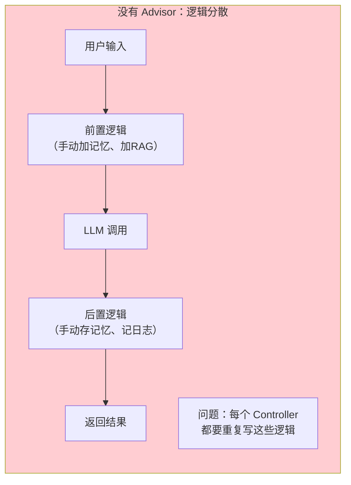
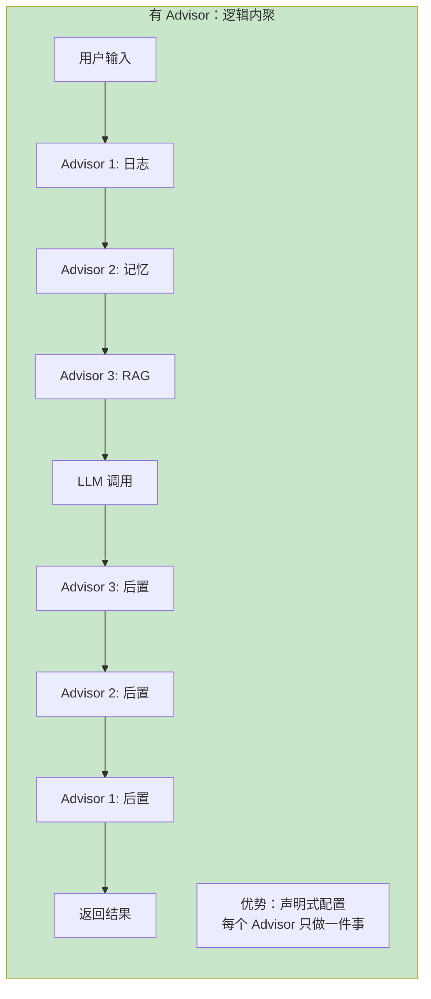
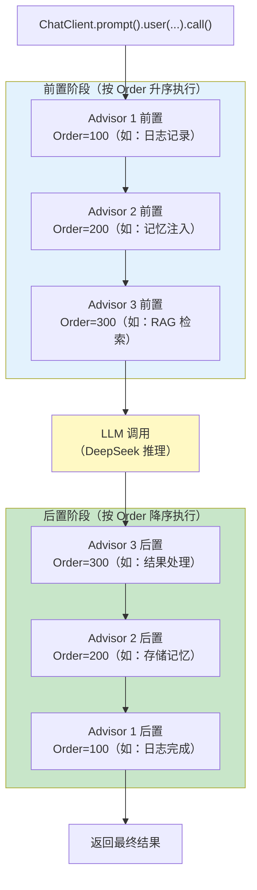
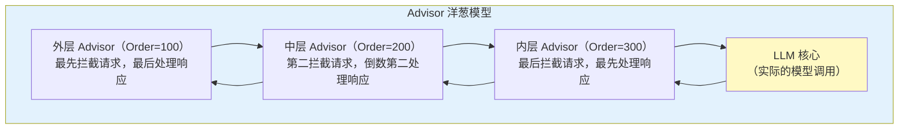
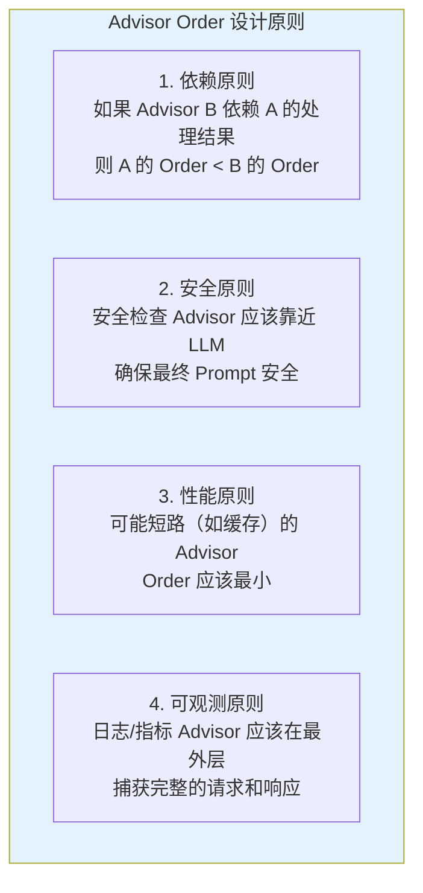
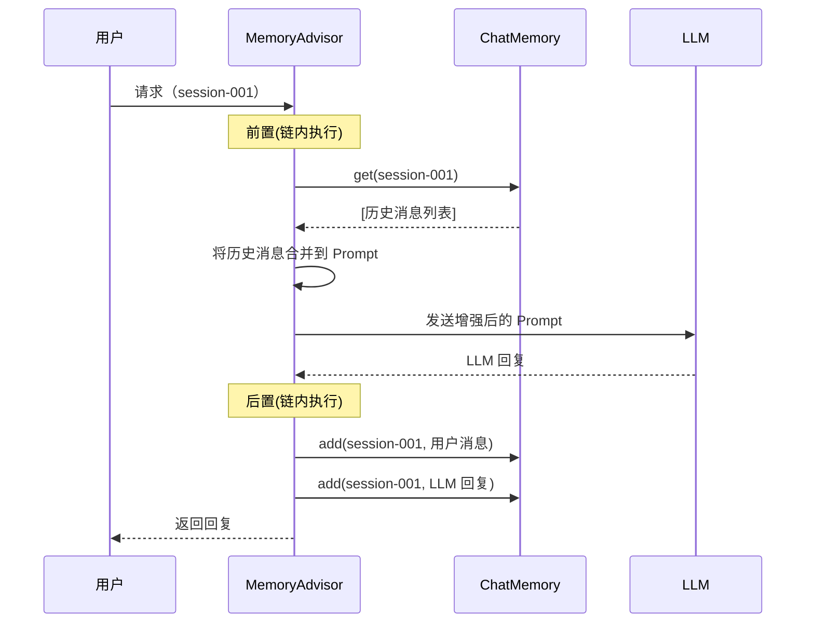
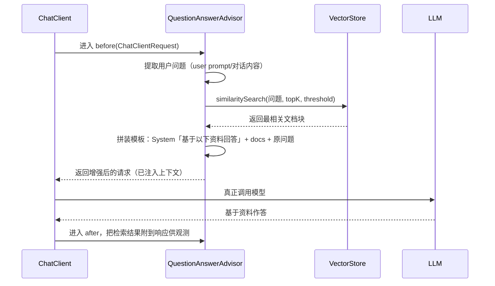
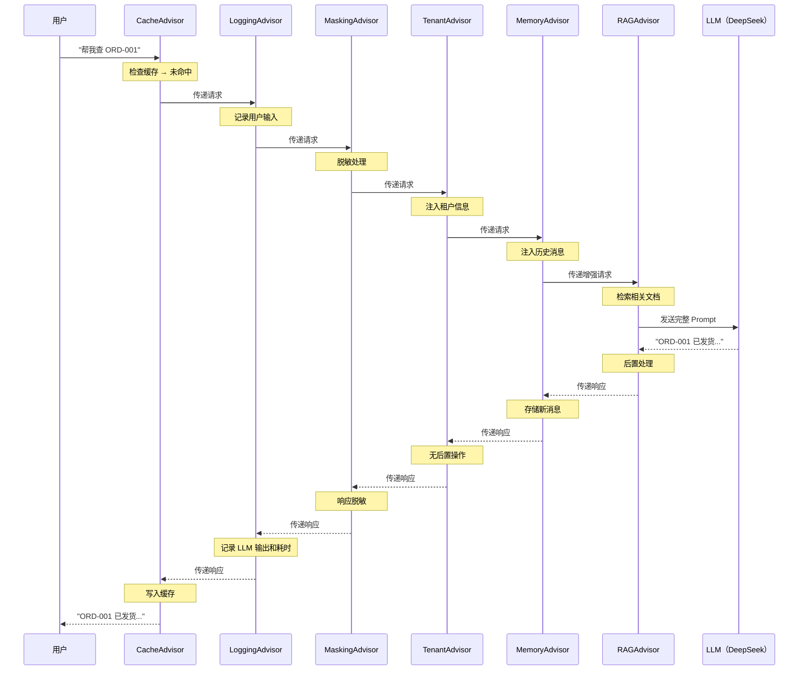
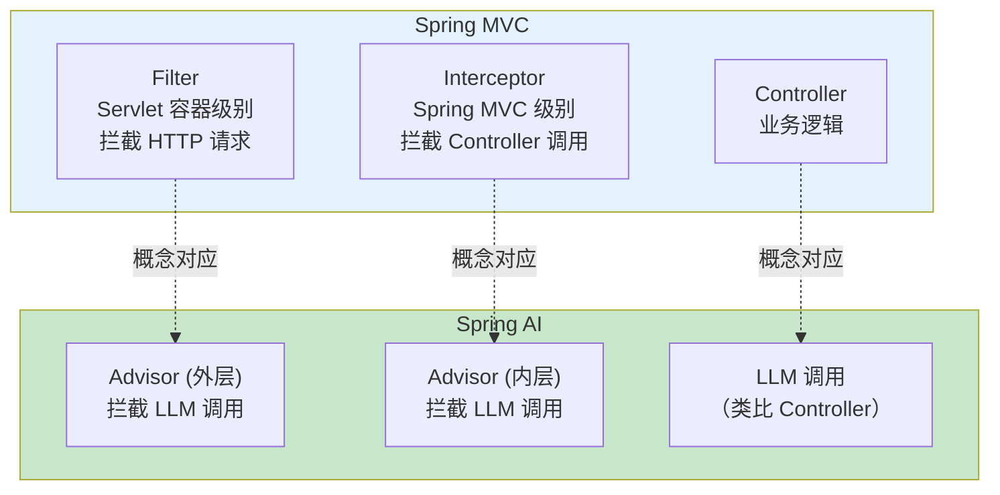
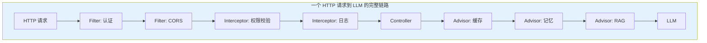

# 14-Advisor 链与拦截器

> **定位**：讲透 Advisor——Spring AI 的核心架构模式。Advisor 接口、执行链机制、前置/后置处理、Order 顺序控制、内置 Advisor 全览、自定义 Advisor 的完整实现，以及 Advisor 与 Spring MVC Interceptor/Filter 的深度对比。读完这篇，你能通过 Advisor 链实现任何 Agent 级别的横切关注点。
>
> **读者画像**：已经掌握 ChatClient、工具调用和记忆系统，需要深入理解 Spring AI 架构核心机制的开发者。
>
> **前置阅读**：[02-ChatClient 与对话模型](02-ChatClient与对话模型.md)。

---

## 1. Advisor 是 Spring AI 的核心架构模式

如果把 Spring AI 比作一座建筑，ChatClient 是大门，那么 Advisor 就是贯穿整栋建筑的走廊——每一次请求都必须穿过这条走廊，走廊上的每个 Advisor 都有机会对请求和响应做加工。

### 1.1 没有 Advisor 的世界



### 1.2 有 Advisor 的世界



### 1.3 Advisor 的定义

Advisor 是 Spring AI 中的**拦截器接口**，允许你在 LLM 调用前后插入自定义逻辑。它的设计灵感来自 Spring AOP（面向切面编程），但专门为 LLM 交互场景优化。

一个 Advisor 可以做以下任何事：
- **修改请求**：在发送给 LLM 之前修改 Prompt、添加系统指令、注入上下文
- **修改响应**：在返回给调用方之前修改 LLM 的输出
- **短路调用**：阻止请求到达 LLM，直接返回结果（如缓存命中）
- **添加副作用**：记录日志、发送指标、更新状态

---

## 2. Advisor 接口与执行链

### 2.1 核心接口

Spring AI 2.0 的 Advisor 体系按**调用模式**拆为两个接口（`CallAdvisor` 同步 / `StreamAdvisor` 流式），统一操作 `ChatClientRequest` / `ChatClientResponse`，通过**责任链**（`chain.nextCall()` / `chain.nextStream()`）传递控制：

```java
import org.springframework.ai.chat.client.ChatClientRequest;
import org.springframework.ai.chat.client.ChatClientResponse;
import org.springframework.ai.chat.client.advisor.api.Advisor;
import org.springframework.ai.chat.client.advisor.api.CallAdvisor;
import org.springframework.ai.chat.client.advisor.api.StreamAdvisor;
import org.springframework.ai.chat.client.advisor.api.CallAdvisorChain;
import org.springframework.ai.chat.client.advisor.api.StreamAdvisorChain;
import org.springframework.core.Ordered;
import reactor.core.publisher.Flux;

// Spring AI 2.0.0 — 真实签名（javap 实证）：
// Advisor extends Ordered，getName() 是抽象方法（没有默认实现）；CallAdvisor/StreamAdvisor 只声明 adviseCall/adviseStream
public interface Advisor extends Ordered {
    String getName();
}

// 同步调用：责任链调用点叫 nextCall（不是 1.x 的 next()）
public interface CallAdvisor extends Advisor {
    ChatClientResponse adviseCall(ChatClientRequest request, CallAdvisorChain chain);
}

// 流式调用：责任链调用点叫 nextStream
public interface StreamAdvisor extends Advisor {
    Flux<ChatClientResponse> adviseStream(ChatClientRequest request, StreamAdvisorChain chain);
}
```

> **真实 API 基准**：完整对照表与常见错误形态见 [附录 05-SpringAI2-API基准/00-Advisor与ChatMemory]——本体系所有 Advisor 代码以该基准为准。**短路**的实现是"不调用 `chain.nextCall()` 直接返回"；执行顺序由 Spring 的 `@Order` / `getOrder()` 控制（越小越先执行）。

### 2.2 ChatClientRequest 和 ChatClientResponse

这两个对象是 Advisor 操作的核心——它们封装了请求和响应的完整信息，且支持不可变修改（mutate）。

```java
// 真实形态（javap 实证）：两个 record，1.x 的 userText/systemText/messages/tools 字段已不存在，
// 只有下列成员——取系统/用户文本须走 prompt() → Prompt#getInstructions() 按角色筛选
record ChatClientRequest(Prompt prompt, Map<String, Object> context) { }
//  访问器：request.prompt() / request.context()
//  不可变派生：request.copy() / request.mutate()（返回 Builder）/ ChatClientRequest.builder()

record ChatClientResponse(ChatResponse chatResponse, Map<String, Object> context) { }
//  访问器：response.chatResponse() / response.context()
//  不可变派生：response.copy() / response.mutate() / ChatClientResponse.builder()

// Builder 真实方法（无 user()/system()/messages()/contextValue()/from()）：
//  ChatClientRequest.Builder  : prompt(Prompt) | context(Map) | context(String, Object) | build()
//  ChatClientResponse.Builder : chatResponse(ChatResponse) | context(Map) | context(String, Object) | build()
```

### 2.3 Advisor 链的执行流程



**关键规则**：
- 前置阶段：Order **从小到大**依次执行（Order 小的先拦截请求）
- 后置阶段：Order **从大到小**依次执行（Order 大的先处理响应）
- 这构成了一个**洋葱模型**——外层 Advisor（Order 小）包裹内层 Advisor（Order 大）

### 2.4 洋葱模型图解



---

## 3. Advisor 顺序（Order）

Order 值决定了 Advisor 的执行位置。正确的顺序对功能正确性至关重要。

### 3.1 内置 Advisor 的默认 Order

| Advisor | 默认 Order | 职责 | 为什么需要这个顺序 |
|---------|-----------|------|------------------|
| `MessageChatMemoryAdvisor` | `HIGHEST_PRECEDENCE+200`（`Advisor.DEFAULT_CHAT_MEMORY_PRECEDENCE_ORDER`，javap 实证） | 注入历史消息 | 靠近外层——其他 Advisor 需要看到完整历史 |
| `QuestionAnswerAdvisor` | 内置默认（builder 可 `order(n)` 调整，javap 实证） | RAG 检索增强 | 在记忆之后——基于完整上下文检索文档 |
| `SafeGuardAdvisor`（内置） | 内置默认（builder 可 `order(n)`） | 内容安全过滤 | 靠外拦截敏感词，可直接短路 |
| `ToolCallingAdvisor`（框架内置） | `HIGHEST_PRECEDENCE+300`（`ToolCallingAdvisor.DEFAULT_ORDER`，javap 实证） | 工具调用循环 | 最接近 LLM——工具循环由它驱动，执行在 `ToolCallingManager` 层 |

### 3.2 Order 设计原则



### 3.3 自定义 Order

```java
import org.springframework.ai.chat.client.ChatClient;
import org.springframework.ai.chat.client.ChatClientRequest;
import org.springframework.ai.chat.client.ChatClientResponse;
import org.springframework.ai.chat.client.advisor.MessageChatMemoryAdvisor;
import org.springframework.ai.chat.client.advisor.api.CallAdvisor;
import org.springframework.ai.chat.client.advisor.api.CallAdvisorChain;
import org.springframework.ai.chat.memory.ChatMemory;

// Spring AI 2.0.0 — 自定义 Advisor 顺序
@Bean
ChatClient chatClient(
        ChatClient.Builder builder,
        ChatMemory chatMemory,
        LoggingAdvisor loggingAdvisor,
        CacheAdvisor cacheAdvisor
) {
    return builder
            .defaultAdvisors(
                    // Order 最小的在最外层
                    cacheAdvisor,           // Order=-100：缓存检查（可能短路）
                    loggingAdvisor,         // Order=50：日志记录
                    // 记忆 Advisor 默认 Order = HIGHEST_PRECEDENCE + 200（javap 实证），
                    // 这里显式 order(100) 只是让示例顺序直观
                    MessageChatMemoryAdvisor.builder(chatMemory).order(100).build()  // 记忆
            )
            .build();
}

// 在 Advisor 实现中指定 Order
@Component
public class LoggingAdvisor implements CallAdvisor {

    @Override
    public ChatClientResponse adviseCall(ChatClientRequest request, CallAdvisorChain chain) {
        // 2.0 没有 request.userText()：用 prompt().getContents() 拿到整包消息文本
        log.info("用户输入: {}", request.prompt().getContents());
        ChatClientResponse response = chain.nextCall(request);
        // 2.0 响应取文本：record 分量 chatResponse()（不是 1.x 的 response()）
        log.info("LLM 输出: {}", response.chatResponse().getResult().getOutput().getText());
        return response;
    }

    @Override
    public String getName() {
        return "LoggingAdvisor";
    }

    @Override
    public int getOrder() {
        return 50;  // 在显式 order(100) 的记忆 Advisor 之前执行
    }
}
```

---

## 4. 内置 Advisor 全览

Spring AI 2.0 提供了丰富的内置 Advisor，覆盖最常见的横切关注点。

### 4.1 内置 Advisor 一览表

| Advisor | 功能 | 典型用法 |
|---------|------|---------|
| `MessageChatMemoryAdvisor` | 自动管理对话历史 | 多轮对话的记忆注入和存储 |
| `ToolCallingAdvisor` | 自动工具调用循环 | 注册工具后自动插入 |
| `QuestionAnswerAdvisor` | RAG 检索增强 | 基于用户问题检索文档并注入 |
| `SafeGuardAdvisor` | 内容安全过滤 | 内置敏感词拦截（见 §4.4），可能短路调用 |
| `PromptChatMemoryAdvisor`（1.x，已移除） | ~~紧凑式记忆注入~~ | 2.0.0 起删除，官方仅保留 `MessageChatMemoryAdvisor`；历史压缩需自研（见 [教程 82-高级记忆架构]） |
| Token 预算（自研） | Token 预算控制 | 非内置——需自研实现 CallAdvisor 裁剪（见附录 05-SpringAI2-API基准/00-Advisor与ChatMemory） |

### 4.2 MessageChatMemoryAdvisor 详解

这是最常用的 Advisor，负责多轮对话的记忆管理。

```java
import org.springframework.ai.chat.client.advisor.MessageChatMemoryAdvisor;
import org.springframework.ai.chat.memory.ChatMemory;
import org.springframework.ai.chat.memory.MessageWindowChatMemory;

// Spring AI 2.0.0 — Memory Advisor 配置
ChatMemory chatMemory = MessageWindowChatMemory.builder()
        .maxMessages(20)
        .build();

ChatClient client = ChatClient.builder(chatModel)
        .defaultAdvisors(
                MessageChatMemoryAdvisor.builder(chatMemory)
                        .build()
        )
        .build();

// 每次调用指定会话 ID
String answer = client.prompt()
        .user("我叫张三")
        .advisors(a -> a.param(ChatMemory.CONVERSATION_ID, "session-001"))
        .call()
        .content();
```

它的内部工作流程：



### 4.3 QuestionAnswerAdvisor（RAG）详解

```java
import org.springframework.ai.chat.client.advisor.vectorstore.QuestionAnswerAdvisor;
import org.springframework.ai.vectorstore.SearchRequest;
import org.springframework.ai.vectorstore.VectorStore;

// Spring AI 2.0.0 — RAG Advisor 配置
ChatClient client = ChatClient.builder(chatModel)
        .defaultAdvisors(
                QuestionAnswerAdvisor.builder(vectorStore)
                        .searchRequest(SearchRequest.builder()
                                .topK(5)
                                .similarityThreshold(0.7)
                                .build())
                        .build()
        )
        .build();

// 用户问题自动检索相关文档并注入
String answer = client.prompt()
        .user("Spring AI 怎么实现工具调用？")
        .call()
        .content();
// LLM 看到的 Prompt 包含检索到的文档片段
```
> **需在 pom.xml 中添加依赖**（`QuestionAnswerAdvisor` 所在模块）：2.0.0 起模块名从 `spring-ai-advisors-vector-store` 改为 `spring-ai-vector-store-advisor`（老坐标已不存在）——版本走 `spring-ai-bom`，不写 `<version>`：
>
> ```xml
> <dependency>
>     <groupId>org.springframework.ai</groupId>
>     <artifactId>spring-ai-vector-store-advisor</artifactId>
> </dependency>
> ```

> **Builder 真实方法（javap 实证）**：`searchRequest` / `promptTemplate` / `protectFromBlocking` / `scheduler` / `order`——**没有 `queryTransformers` 挂载点**；查询变换（重写/压缩/翻译）在 spring-ai-rag 模块的 `RetrievalAugmentationAdvisor` 一侧（真实类是 `RewriteQueryTransformer` 等，`QueryTransformer` 本身是接口、无 builder 工厂）。

#### 4.3.1 它到底做了什么：检索增强被装进哪一环

`QuestionAnswerAdvisor` **本身不回答任何问题**。它是 `BaseAdvisor` 实现（javap 实证，`before(ChatClientRequest, AdvisorChain)` / `after(...)` 双参签名），干的是把「检索增强」插进调用链——在真正调模型**之前**，用用户问题查一遍向量库，把命中的文档块拼进 Prompt 当上下文，再让模型基于资料作答。这就是 RAG 的装配环节。



**两阶段职责分工**：
- **`before`（检索）**：调用 `vectorStore.similaritySearch()` 做向量相似度查询，把命中块注入 Prompt。副作用（读库）只发生在这步。
- **`after`（观测）**：把 `RETRIEVED_DOCUMENTS`（本次命中的文档）写回响应/上下文，供 Observation、日志、评估取用——这是 RAG 可观测性和调试的抓手。

**为什么做成 Advisor 而非硬编码进业务逻辑**：可插拔、可组合、可观测。挂在 `defaultAdvisors` 上，该 ChatClient 的所有调用自动生效；只想对个别请求做 RAG 时，改为调用时临时 `.advisors(...)`，不加到 default。

#### 4.3.2 参数调优与常见坑

| 旋钮 | 值 | 效果 | 太小 | 太大 |
|------|----|------|------|------|
| `topK` | 5（示例）/ 3（项目 00） | 最多召回条数 | 漏资料、答不全 | Prompt 塞噪音、Token 成本升 |
| `similarityThreshold` | 0.7 | 低于该相似度的块**直接丢弃** | 无关文档混入、误导模型 | 检索频繁为空、RAG 失效 |

- **包名坑**：真身在 `org.springframework.ai.chat.client.advisor.vectorstore.QuestionAnswerAdvisor`，不是 `…advisor.QuestionAnswerAdvisor`。
- **依赖坑**：类在 `spring-ai-vector-store-advisor` 模块，未引则报找不到类（本节已给出依赖片段）。
- **Advisor 挂了但无效果**：多半是向量库空空（ETL 没跑成）、或 threshold 高到检不出东西。先验证"无关问题"能稳定返回"无相关块"。
- **WebFlux 阻塞**：若 VectorStore 非响应式，检索是阻塞操作。Builder 提供 `protectFromBlocking(true)` / `scheduler(...)` 把阻塞查询挪到专用线程，避免占用 EventLoop（呼应 WebFlux 铁律）。

> **项目对照**：客服系统的落地代码、参数取值与验证包见 [项目 00-智能客服系统 §03 §2.6]。本文是原理篇，项目是实践篇。


### 4.4 内容安全过滤（内置 SafeGuardAdvisor）

**审计纠错**：`SafeGuardAdvisor` 是 2.0.0 **真实存在**的内置组件（javap 实证：`org.springframework.ai.chat.client.advisor.SafeGuardAdvisor`，构造 `(List<String>)` / `(List<String>, String, int)` / `builder()`，Builder 有 `sensitiveWords(...)`、`failureResponse(...)`、`order(...)`）——不是虚构 API：

```java
// Spring AI 2.0.0 — 内置 SafeGuardAdvisor
import org.springframework.ai.chat.client.ChatClient;
import org.springframework.ai.chat.client.advisor.SafeGuardAdvisor;

ChatClient client = ChatClient.builder(chatModel)
        .defaultAdvisors(
                SafeGuardAdvisor.builder()
                        .sensitiveWords(List.of("密码", "身份证", "银行卡号"))
                        .failureResponse("抱歉，出于安全考虑，我无法处理此类信息。")
                        .build()
        )
        .build();

// 用户输入包含敏感词时，直接返回拦截消息，不调用 LLM
String answer = client.prompt()
        .user("我的银行卡号是 6225 xxx")
        .call()
        .content();
// answer = "抱歉，出于安全考虑，我无法处理此类信息。"
```

**短路的实现原理**（若要自研）：不调用 `chain.nextCall()`，直接返回一个手工构造的 `ChatClientResponse`——真实姿势是用 `ChatClientResponse.builder().chatResponse(...)`（没有 `.from(request).content(...)` 这套虚构方法），构造 `ChatResponse` 需要一个 `Generation`，见 §5.4 的响应重建示例。

---

## 5. 自定义 Advisor：完整实现

### 5.1 场景一：请求/响应日志 Advisor

```java
import org.springframework.ai.chat.client.ChatClientRequest;
import org.springframework.ai.chat.client.ChatClientResponse;
import org.springframework.ai.chat.client.advisor.api.CallAdvisor;
import org.springframework.ai.chat.client.advisor.api.CallAdvisorChain;
import org.slf4j.Logger;
import org.slf4j.LoggerFactory;
import org.springframework.stereotype.Component;

// Spring AI 2.0.0 — 完整的日志 Advisor
@Component
public class LoggingAdvisor implements CallAdvisor {

    private static final Logger log = LoggerFactory.getLogger(LoggingAdvisor.class);

    @Override
    public ChatClientResponse adviseCall(ChatClientRequest request, CallAdvisorChain chain) {
        long startTime = System.currentTimeMillis();

        // 2.0 上下文写入用 Builder.context(key, value)（没有 contextValue()）；
        // 用户文本从 prompt().getContents() 取（没有 request.userText()）
        ChatClientRequest effective = request.mutate()
                .context("requestStartTime", startTime)
                .context("userText", request.prompt().getContents())
                .build();
        ChatClientResponse response = chain.nextCall(effective);

        // context 值是 Object，取出后需转型
        long duration = System.currentTimeMillis() - (Long) response.context().get("requestStartTime");
        String userText = (String) response.context().get("userText");
        // 2.0 响应取文本：chatResponse()（record 分量，不是 1.x 的 response()）
        String llmResponse = response.chatResponse()
                .getResult()
                .getOutput()
                .getText();

        log.info("""
                ┌─ ChatClient 调用日志
                │ 用户输入: {}
                │ LLM 输出: {}
                │ 耗时: {}ms
                └──────────────────────
                """, userText, llmResponse, duration);

        return response;
    }

    @Override
    public String getName() {
        return "LoggingAdvisor";
    }

    @Override
    public int getOrder() {
        return 0;  // 最外层执行
    }
}
```

### 5.2 场景二：缓存 Advisor（短路调用）

```java
import org.springframework.ai.chat.client.ChatClientRequest;
import org.springframework.ai.chat.client.ChatClientResponse;
import org.springframework.ai.chat.client.advisor.api.CallAdvisor;
import org.springframework.ai.chat.client.advisor.api.CallAdvisorChain;
import org.springframework.ai.chat.messages.AssistantMessage;
import org.springframework.ai.chat.model.ChatResponse;
import org.springframework.ai.chat.model.Generation;
import org.springframework.data.redis.core.StringRedisTemplate;

import java.time.Duration;
import java.util.List;

// Spring AI 2.0.0 — Redis 缓存 Advisor（可能短路 LLM 调用）
// 说明：CallAdvisor 走同步路径，用 StringRedisTemplate 合理；若在 StreamAdvisor/EventLoop 上
// 必须换 ReactiveStringRedisTemplate（WebFlux 铁律见附录 06）。
@Component
public class CacheAdvisor implements CallAdvisor {

    private final StringRedisTemplate redis;

    public CacheAdvisor(StringRedisTemplate redis) {
        this.redis = redis;
    }

    @Override
    public ChatClientResponse adviseCall(ChatClientRequest request, CallAdvisorChain chain) {
        // 2.0 没有 request.userText()：用整包消息文本做缓存键素材
        String cacheKey = "llm:cache:" + request.prompt().getContents().hashCode();

        String cached = redis.opsForValue().get(cacheKey);
        if (cached != null) {
            // 缓存命中——不调用 chain.nextCall，直接短路返回（构造 ChatClientResponse 的真实 API 见 §5.4）
            return shortCircuit(request, cached);
        }

        // 缓存未命中——继续正常流程，并记住 cacheKey 供响应侧回写
        ChatClientRequest effective = request.mutate()
                .context("cacheKey", cacheKey)
                .build();
        ChatClientResponse response = chain.nextCall(effective);

        // context 值是 Object，取出后转型
        String key = (String) response.context().get("cacheKey");
        if (key != null) {
            String llmResponse = response.chatResponse()
                    .getResult()
                    .getOutput()
                    .getText();
            redis.opsForValue().set(key, llmResponse, Duration.ofHours(1));
        }
        return response;
    }

    @Override
    public String getName() {
        return "CacheAdvisor";
    }

    @Override
    public int getOrder() {
        return -100;  // 在所有 Advisor 之前执行，可能直接短路
    }

    private ChatClientResponse shortCircuit(ChatClientRequest request, String cached) {
        ChatResponse chatResponse = new ChatResponse(
                List.of(new Generation(new AssistantMessage(cached))));
        return ChatClientResponse.builder()
                .chatResponse(chatResponse)
                .context(request.context())
                .build();
    }
}
```

### 5.3 场景三：多租户 Advisor（动态注入上下文）

```java
import org.springframework.ai.chat.client.ChatClientRequest;
import org.springframework.ai.chat.client.ChatClientResponse;
import org.springframework.ai.chat.client.advisor.api.CallAdvisor;
import org.springframework.ai.chat.client.advisor.api.CallAdvisorChain;
import org.springframework.ai.chat.messages.Message;
import org.springframework.ai.chat.messages.SystemMessage;
import org.springframework.ai.chat.prompt.Prompt;

import java.util.ArrayList;
import java.util.List;

// Spring AI 2.0.0 — 多租户上下文注入 Advisor
@Component
public class TenantContextAdvisor implements CallAdvisor {

    private final TenantService tenantService;

    public TenantContextAdvisor(TenantService tenantService) {
        this.tenantService = tenantService;
    }

    @Override
    public ChatClientResponse adviseCall(ChatClientRequest request, CallAdvisorChain chain) {
        // 从 Advisor 上下文读取租户 ID（context 值是 Object，需转型；缺租户信息就原样放行）
        Object tenantIdObj = request.context().get("tenantId");
        if (tenantIdObj == null) {
            return chain.nextCall(request);   // 唯一出口分支一
        }
        String tenantId = (String) tenantIdObj;

        // 加载租户配置
        TenantConfig config = tenantService.getConfig(tenantId);

        // 注入租户特定的 System Message
        String tenantSystemPrompt = """
                当前租户：%s（%s）
                服务范围：%s
                品牌名称：%s
                """.formatted(
                config.name(),
                config.industry(),
                config.serviceScope(),
                config.brandName()
        );

        // 2.0 没有 request.systemText() / mutate().system(...)：
        // 正确姿势是重建 Prompt 的消息列表，把租户 System Message 追加到最前
        List<Message> instructions = new ArrayList<>(request.prompt().getInstructions());
        instructions.add(0, new SystemMessage(tenantSystemPrompt));

        ChatClientRequest effective = request.mutate()
                .prompt(new Prompt(instructions, request.prompt().getOptions()))
                .build();

        return chain.nextCall(effective);     // 唯一出口分支二
    }

    @Override
    public String getName() {
        return "TenantContextAdvisor";
    }

    @Override
    public int getOrder() {
        return 90;  // 在显式 order(100) 的 Memory Advisor 之前执行
    }
}
```

### 5.4 场景四：敏感信息脱敏 Advisor

```java
import org.springframework.ai.chat.client.ChatClientRequest;
import org.springframework.ai.chat.client.ChatClientResponse;
import org.springframework.ai.chat.client.advisor.api.CallAdvisor;
import org.springframework.ai.chat.client.advisor.api.CallAdvisorChain;
import org.springframework.ai.chat.messages.AssistantMessage;
import org.springframework.ai.chat.messages.Message;
import org.springframework.ai.chat.messages.UserMessage;
import org.springframework.ai.chat.model.ChatResponse;
import org.springframework.ai.chat.model.Generation;
import org.springframework.ai.chat.prompt.Prompt;

import java.util.ArrayList;
import java.util.List;
import java.util.regex.Pattern;

// Spring AI 2.0.0 — 响应脱敏 Advisor
@Component
public class MaskingAdvisor implements CallAdvisor {

    private static final Pattern PHONE_PATTERN = 
            Pattern.compile("1[3-9]\\d{9}");
    private static final Pattern EMAIL_PATTERN = 
            Pattern.compile("[\\w.-]+@[\\w.-]+\\.\\w+");
    private static final Pattern ID_CARD_PATTERN = 
            Pattern.compile("\\d{17}[\\dXx]");

    @Override
    public ChatClientResponse adviseCall(ChatClientRequest request, CallAdvisorChain chain) {
        // 请求侧：脱敏 UserMessage 文本，重建 Prompt（2.0 没有 mutate().user(...)）
        List<Message> instructions = new ArrayList<>();
        for (Message m : request.prompt().getInstructions()) {
            instructions.add(m instanceof UserMessage userMsg
                    ? new UserMessage(maskSensitive(userMsg.getText()))
                    : m);
        }
        ChatClientRequest effective = request.mutate()
                .prompt(new Prompt(instructions, request.prompt().getOptions()))
                .build();

        ChatClientResponse response = chain.nextCall(effective);

        // 响应侧：脱敏输出文本，重建 ChatResponse/Generation（2.0 响应不可就地 mutate）
        String original = response.chatResponse().getResult().getOutput().getText();
        String maskedText = maskSensitive(original);
        ChatResponse maskedResponse = new ChatResponse(
                List.of(new Generation(new AssistantMessage(maskedText))),
                response.chatResponse().getMetadata());

        return response.mutate()
                .chatResponse(maskedResponse)
                .build();
    }

    private String maskSensitive(String text) {
        if (text == null) return null;
        text = PHONE_PATTERN.matcher(text).replaceAll(m -> 
                m.group().substring(0, 3) + "****" + m.group().substring(7));
        text = EMAIL_PATTERN.matcher(text).replaceAll(m -> {
            String email = m.group();
            int at = email.indexOf('@');
            return email.substring(0, Math.min(2, at)) + "***" + email.substring(at);
        });
        text = ID_CARD_PATTERN.matcher(text).replaceAll(m -> 
                m.group().substring(0, 6) + "********" + m.group().substring(14));
        return text;
    }

    @Override
    public String getName() {
        return "MaskingAdvisor";
    }

    @Override
    public int getOrder() {
        return 10;  // 最外层，捕获所有请求和响应
    }
}
```

---

## 6. 组合使用多个 Advisor

### 6.1 完整的 Advisor 链配置

```java
import org.springframework.ai.chat.client.ChatClient;
import org.springframework.ai.chat.client.advisor.MessageChatMemoryAdvisor;
import org.springframework.ai.chat.client.advisor.vectorstore.QuestionAnswerAdvisor;
import org.springframework.ai.chat.memory.ChatMemory;
import org.springframework.ai.vectorstore.VectorStore;
import org.springframework.context.annotation.Bean;
import org.springframework.context.annotation.Configuration;

@Configuration
public class FullAdvisorChainConfig {

    // Spring AI 2.0.0 — 完整的 Advisor 链配置
    @Bean
    ChatClient agentClient(
            ChatClient.Builder builder,
            ChatMemory chatMemory,
            VectorStore vectorStore,
            LoggingAdvisor loggingAdvisor,
            CacheAdvisor cacheAdvisor,
            TenantContextAdvisor tenantAdvisor,
            MaskingAdvisor maskingAdvisor
    ) {
        return builder
                .defaultSystem("你是企业级智能客服助手。")
                .defaultAdvisors(
                        // 按 Order 从小到大排列（Spring AI 会自动按 getOrder() 排序）
                        cacheAdvisor,              // Order=-100：缓存检查
                        maskingAdvisor,            // Order=10：脱敏
                        loggingAdvisor,            // Order=0：日志（覆盖最外层）
                        tenantAdvisor,             // Order=90：租户上下文
                        MessageChatMemoryAdvisor.builder(chatMemory).order(100).build(),  // 默认 HIGHEST_PRECEDENCE+200（javap 实证），显式 order(100) 维持本节排序
                        QuestionAnswerAdvisor.builder(vectorStore).build()     // RAG（内置默认 order）
                )
                .build();
    }
}
```

### 6.2 实际执行顺序图



---

## 7. Advisor 与 Spring MVC Interceptor/Filter 的对比

如果你熟悉 Spring MVC，Advisor 的概念会让你想到 Interceptor 和 Filter。它们确实有相似之处，但有关键差异。

### 7.1 概念映射



### 7.2 详细对比

| 维度 | Filter | Interceptor | Advisor |
|------|--------|------------|---------|
| **拦截对象** | HTTP 请求/响应 | Controller 方法调用 | LLM 请求/响应 |
| **执行域** | Servlet 容器 | Spring MVC | Spring AI |
| **触发时机** | HTTP 请求到达时 | Handler 方法执行前后 | LLM 调用前后 |
| **前置方法** | `doFilter()` | `preHandle()` | `nextCall() 之前` |
| **后置方法** | `doFilter()` | `postHandle()` | `nextCall() 之后` |
| **短路能力** | 有（不调用 chain.doFilter） | 有（返回 false） | 有（直接返回 ChatClientResponse） |
| **执行顺序** | 按 Registration 的 Order | 按 `@Order` 或 `getOrder()` | 按 `getOrder()` |
| **洋葱模型** | 是 | 是 | 是 |
| **请求类型** | `HttpServletRequest` | `HandlerInvocation` | `ChatClientRequest` |
| **典型用途** | 编码、CORS、鉴权 | 权限校验、日志 | 记忆注入、RAG、安全过滤 |

### 7.3 关键区别

**作用域不同**：Filter 和 Interceptor 在 HTTP 层面工作，对所有请求生效；Advisor 只在 ChatClient 调用链中生效。一个 HTTP 请求可能触发多次 LLM 调用（如工具调用循环），每次都经过 Advisor 链。

**短路含义不同**：
- Filter 短路：不调用 `chain.doFilter()` → 直接返回 HTTP 响应
- Interceptor 短路：`preHandle()` 返回 `false` → 请求不到达 Controller
- Advisor 短路：**不调用 `chain.nextCall()`** 直接返回结果（见附录 05-SpringAI2-API基准/00-Advisor与ChatMemory）

**组合使用**：在实际项目中三者可以共存。



> **想深入？→ [教程 31-全链路可观测性]**：如何将 Filter、Interceptor 和 Advisor 的可观测数据统一关联到一个 Trace 链路。

---

## 8. 适用场景与不适用场景

### 适用场景

- 横切关注点：日志、监控、缓存、安全脱敏——每个请求都需要、不属于业务逻辑
- 上下文增强：记忆注入、RAG 检索、租户上下文——需要修改发送给 LLM 的 Prompt
- 响应处理：脱敏、格式转换、结果缓存——需要修改 LLM 返回的结果
- 流程控制：短路调用、限流、降级——需要在 LLM 调用前后做决策
- 可观测性：Token 计数、延迟监控、调用追踪——需要采集 LLM 调用的指标

### 不适用场景

- 业务逻辑（如订单查询、用户注册）——这些应该在 Service 层，不应该放在 Advisor 中
- 工具方法的实现（工具用 `@Tool` 注解，不是 Advisor）
- HTTP 层面的逻辑（如认证、CORS——用 Filter/Interceptor）
- 一次性的定制逻辑（Advisor 是可复用的横切关注点，不是一次性代码）
- 复杂的业务流程编排（Agent 的工作流编排应该用专门的 Agent 框架，而非 Advisor）

---

## 9. 本章总结

| 概念 | 一句话 |
|------|--------|
| **Advisor** | Spring AI 的核心架构模式，类似 AOP 切面，在 LLM 调用前后插入自定义逻辑 |
| **CallAdvisor / StreamAdvisor** | 核心接口：`adviseCall` / `adviseStream` 责任链 + `getOrder()` 顺序 |
| **洋葱模型** | 前置阶段 Order 从小到大，后置阶段从大到小——外层包裹内层 |
| **Order** | 决定执行顺序：安全/缓存 Advisor 在外层，Memory/RAG Advisor 在内层 |
| **MessageChatMemoryAdvisor** | 自动注入历史消息并存储新消息——多轮对话的基础 |
| **QuestionAnswerAdvisor** | 自动检索文档并注入 Prompt——RAG 的核心 |
| **SafeGuardAdvisor** | 敏感词过滤和内容安全——可能短路调用 |
| **短路调用** | `adviseCall/adviseStream` 阶段不调用 `chain.nextCall()` 直接返回结果（如缓存命中） |
| **vs Filter/Interceptor** | Advisor 作用于 LLM 调用链，Filter/Interceptor 作用于 HTTP 请求链——各司其职 |

---

> **想深入？→ [教程 02-ChatClient与对话模型]**：回顾 ChatClient 的完整 API，理解 Advisor 如何嵌入到 ChatClient 的调用流程中。
> **想深入？→ [教程 31-全链路可观测性]**：将 Advisor 与 Filter、Interceptor 的可观测数据统一到一条 Trace 链路。
> **想深入？→ [教程 21-Agent状态管理.md]**：Advisor 上下文在 Agent 状态管理中的关键作用。
