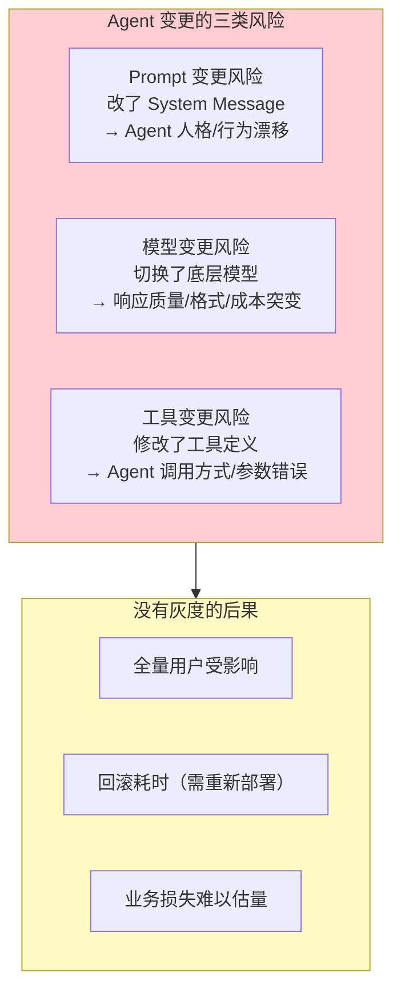
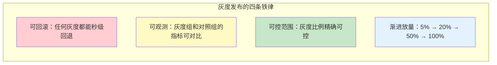
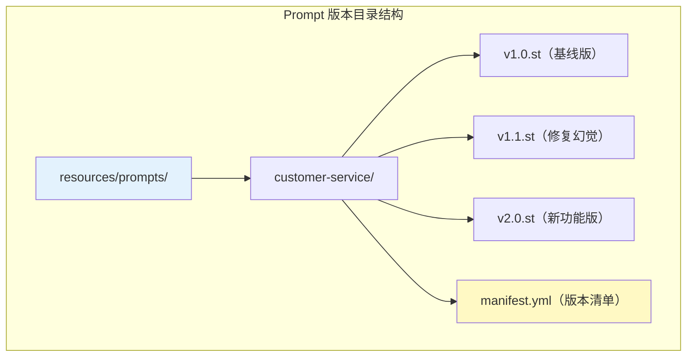
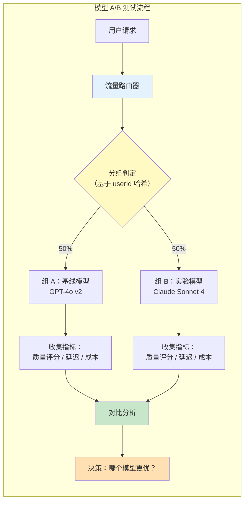
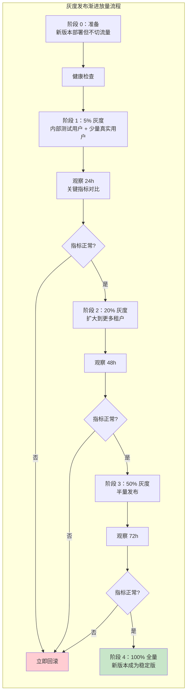
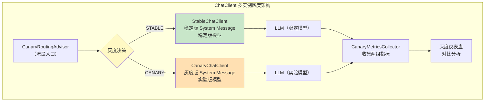
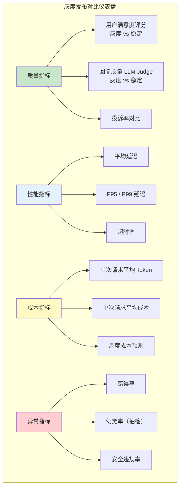

# 23-灰度发布与版本管理

> **定位**：讲透 Agent 系统中的版本控制与灰度发布——Prompt 版本化管理、模型 A/B 测试、流量切分策略（按百分比/按用户特征），以及 Spring AI 中通过 ChatClient 多实例 + 条件路由实现灰度发布的完整代码方案。读完这篇，你能安全地发布 Agent 变更，不再"改一行 Prompt、全站提心吊胆"。
>
> **读者画像**：正在生产环境运行 Agent，需要在不影响全部用户的前提下逐步验证 Prompt 和模型变更的效果。
>
> **前置阅读**：[02-ChatClient与对话模型](02-ChatClient与对话模型.md)、[20-多租户隔离与资源治理](20-多租户隔离与资源治理.md)。

---

## 1. 为什么 Agent 的变更发布比传统软件更危险

传统软件的变更通过编译器检查、单元测试、集成测试来保障质量。但 Agent 的核心——Prompt 和模型选择——是**自然语言和概率模型**的组合，没有编译器能帮你检查"改了 System Message 的一行话会不会让 Agent 行为崩溃"。



### 1.1 典型事故

> 团队把 System Message 中"你是客服助手"改成了"你是友好热情的客服助手"，看似无伤大雅。但"热情"一词导致 LLM 在回复中大量使用感叹号和 emoji，在金融合规场景中被视为不专业，客户投诉率上升 40%。

Prompt 中的**一个词**就能改变 Agent 的整体行为——这种敏感性要求任何变更都必须经过**灰度验证**。

### 1.2 灰度发布的核心原则



---

## 2. Prompt 版本控制

### 2.1 版本化 System Message

将 Prompt 从代码中外部化到独立文件，每个版本独立管理：



**版本清单 manifest.yml**：

```yaml
# resources/prompts/customer-service/manifest.yml
current_version: "v1.1"
versions:
  v1.0:
    file: v1.0.st
    status: DEPRECATED
    description: "初始版本，基线 System Message"
    created_at: "2026-06-01"
    sunset_at: "2026-09-01"

  v1.1:
    file: v1.1.st
    status: STABLE           # 当前稳定版
    description: "增加幻觉防护规则，限制不确定回答"
    created_at: "2026-07-15"

  v2.0:
    file: v2.0.st
    status: CANARY           # 灰度版
    description: "新增产品推荐功能，语气更专业"
    created_at: "2026-08-10"
    canary_percentage: 10    # 灰度比例 10%

# 灰度切分规则
canary_rules:
  - rule: "tenant_tier"
    value: "ENTERPRISE"
    percentage: 30           # 企业版租户 30% 走灰度版
  - rule: "tenant_tier"
    value: "FREE"
    percentage: 5            # 免费版租户 5% 走灰度版
```

### 2.2 Prompt 版本加载

```java
import org.springframework.core.io.ClassPathResource;
import org.springframework.stereotype.Service;
import java.io.IOException;
import java.nio.file.Files;
import java.util.Map;
import java.util.concurrent.ConcurrentHashMap;

@Service
public class PromptVersionManager {

    private final Map<String, String> promptCache = new ConcurrentHashMap<>();
    private final PromptManifestLoader manifestLoader;

    /**
     * 加载指定版本的 Prompt 内容。
     */
    public String loadPrompt(String promptName, String version) {
        String cacheKey = promptName + ":" + version;
        return promptCache.computeIfAbsent(cacheKey, k -> {
            try {
                String path = "prompts/" + promptName + "/" + version + ".st";
                return Files.readString(
                        new ClassPathResource(path).getFile().toPath());
            } catch (IOException e) {
                throw new PromptNotFoundException(
                        "Prompt not found: " + path, e);
            }
        });
    }

    /**
     * 获取当前稳定版本。
     */
    public String getStableVersion(String promptName) {
        return manifestLoader.getManifest(promptName).currentVersion();
    }

    /**
     * 获取灰度版本（如果有）。
     */
    public String getCanaryVersion(String promptName) {
        return manifestLoader.getManifest(promptName)
                .versions().values().stream()
                .filter(v -> v.status() == PromptStatus.CANARY)
                .map(PromptVersion::version)
                .findFirst()
                .orElse(null);
    }

    /**
     * 根据灰度规则判断请求应该使用哪个版本。
     */
    public String resolveVersion(String promptName, RequestContext context) {
        PromptManifest manifest = manifestLoader.getManifest(promptName);
        String canaryVersion = getCanaryVersion(promptName);

        if (canaryVersion == null) {
            return manifest.currentVersion();  // 没有灰度版，用稳定版
        }

        // 检查灰度规则
        for (CanaryRule rule : manifest.canaryRules()) {
            String contextValue = context.getAttribute(rule.rule());
            if (contextValue != null && contextValue.equals(rule.value())) {
                if (shouldRouteToCanary(rule.percentage(),
                        context.getUserId())) {
                    return canaryVersion;
                }
            }
        }

        return manifest.currentVersion();
    }

    /**
     * 基于用户 ID 的确定性灰度——同一用户始终被分到同一组。
     */
    private boolean shouldRouteToCanary(int percentage, String userId) {
        int hash = Math.abs(userId.hashCode()) % 100;
        return hash < percentage;
    }
}
```

### 2.3 Prompt 内容示例

`resources/prompts/customer-service/v1.1.st`（稳定版）：

```
你是 {company} 的客服助手。
职责：回答用户关于 {product} 的问题。

规则：
- 语气友好专业
- 不确定的信息明确告知"我需要确认一下"
- 涉及订单查询时引导用户提供订单号
- 绝不编造不存在的政策或数据
```

`resources/prompts/customer-service/v2.0.st`（灰度版）：

```
你是 {company} 的专业客服顾问。
职责：回答用户关于 {product} 的问题，并提供个性化推荐。

规则：
- 语气专业，避免过多感叹号和表情符号
- 不确定的信息明确告知"我需要确认一下"
- 涉及订单查询时引导用户提供订单号
- 绝不编造不存在的政策或数据
- 可在回答末尾附加一个相关产品推荐（如用户在咨询手机，可推荐配件）
- 推荐时注明"您可能还需要"而非硬推销
```

---

## 3. 模型 A/B 测试

### 3.1 A/B 测试设计



### 3.2 A/B 测试路由实现

```java
import org.springframework.ai.chat.model.ChatModel;
import org.springframework.stereotype.Service;
import java.util.Map;

@Service
public class ModelABTestRouter {

    private final Map<String, ChatModel> modelRegistry;
    private final ABTestConfigRepository configRepo;
    private final ABTestMetricsService metricsService;

    /**
     * A/B 测试路由：根据配置和用户 ID 分配模型。
     */
    public ChatModel route(String testName, String userId) {
        ABTestConfig config = configRepo.findActiveTest(testName);
        if (config == null) {
            // 没有活跃的 A/B 测试，使用基线模型
            return modelRegistry.get(baselineModel);   // baselineModel 为配置注入的默认基线
        }

        // 确定性分组：同一用户始终在同一组
        int hash = Math.abs(userId.hashCode()) % 100;
        String group = hash < config.variantPercentage() ? "VARIANT" : "BASELINE";

        String modelId = group.equals("VARIANT")
                ? config.variantModel()
                : config.baselineModel();

        // 记录分组信息，后续用于指标对比
        metricsService.recordGroupAssignment(testName, userId, group);

        return modelRegistry.get(modelId);
    }
}
```

### 3.3 A/B 测试配置

```java
public record ABTestConfig(
    String testName,
    String baselineModel,     // 基线模型 ID
    String variantModel,      // 实验模型 ID
    int variantPercentage,    // 实验组流量百分比
    String status,            // RUNNING / PAUSED / COMPLETED
    LocalDateTime startTime,
    LocalDateTime endTime,
    Map<String, Object> successCriteria   // 成功标准
) {}
```

```yaml
# A/B 测试配置示例
test_name: "gpt4o-vs-claude-v2"
baseline_model: "gpt-4o"
variant_model: "claude-sonnet-4"
variant_percentage: 30
status: "RUNNING"
start_time: "2026-08-12T00:00:00"
end_time: "2026-08-26T00:00:00"
success_criteria:
  min_quality_score: 4.0     # 用户评分不低于 4.0
  max_latency_ms: 3000       # 延迟不超过 3 秒
  max_cost_per_request: 0.05 # 单次请求成本不超过 5 美分
```

---

## 4. 流量切分策略

### 4.1 灰度发布流程



### 4.2 切分策略对比

| 策略 | 原理 | 优势 | 劣势 | 适用场景 |
|------|------|------|------|---------|
| **百分比切分** | 全局流量随机分配 N% | 简单直接 | 可能切到高敏感用户 | 快速验证 |
| **用户特征切分** | 按租户级别/用户标签选择 | 精准控制范围 | 需要用户画像 | 企业版优先验证 |
| **租户白名单** | 只切到指定租户 | 最安全 | 样本量小 | 内测阶段 |
| **时间窗口** | 非工作时间先切 | 降低业务影响 | 验证周期长 | 高风险变更 |
| **金丝雀发布** | 单实例先切 | 极小范围验证 | 不够随机 | 基础设施变更 |

### 4.3 综合切分路由器

```java
@Service
public class CanaryTrafficRouter {

    private final CanaryConfigRepository configRepo;
    private final PromptVersionManager promptManager;

    /**
     * 综合流量切分：按优先级依次检查白名单、特征规则、百分比规则。
     */
    public CanaryDecision evaluate(String releaseName, RequestContext ctx) {
        CanaryConfig config = configRepo.findByName(releaseName);

        if (!config.isActive()) {
            return CanaryDecision.stable();  // 灰度未激活
        }

        // 1. 白名单优先——白名单内的用户强制走灰度版
        if (config.whitelistUserIds().contains(ctx.getUserId())) {
            return CanaryDecision.canary("WHITELIST");
        }

        // 2. 黑名单——黑名单内的用户强制走稳定版
        if (config.blacklistUserIds().contains(ctx.getUserId())) {
            return CanaryDecision.stable();
        }

        // 3. 特征规则——按用户特征决定灰度比例
        for (CanaryRule rule : config.rules()) {
            String attrValue = ctx.getAttribute(rule.attribute());
            if (attrValue != null && attrValue.equals(rule.value())) {
                if (shouldRouteToCanary(rule.percentage(), ctx.getUserId())) {
                    return CanaryDecision.canary("RULE:" + rule.attribute());
                }
            }
        }

        // 4. 全局百分比——兜底灰度
        if (shouldRouteToCanary(config.globalPercentage(), ctx.getUserId())) {
            return CanaryDecision.canary("GLOBAL");
        }

        return CanaryDecision.stable();
    }

    /**
     * 确定性哈希：同一用户每次请求被分到同一组。
     * 避免用户在稳定版和灰度版之间来回跳。
     */
    private boolean shouldRouteToCanary(int percentage, String userId) {
        int hash = Math.abs(userId.hashCode()) % 100;
        return hash < percentage;
    }

    public record CanaryDecision(boolean isCanary, String reason) {
        static CanaryDecision stable() {
            return new CanaryDecision(false, "STABLE");
        }
        static CanaryDecision canary(String reason) {
            return new CanaryDecision(true, reason);
        }
    }
}
```

---

## 5. Spring AI 中的灰度路由实现

### 5.1 多 ChatClient 实例架构



### 5.2 多 ChatClient Bean 配置

```java
import org.springframework.ai.chat.client.ChatClient;
import org.springframework.ai.chat.model.ChatModel;
import org.springframework.context.annotation.Bean;
import org.springframework.context.annotation.Configuration;

@Configuration
public class CanaryChatClientConfig {

    @Bean
    ChatModel stableModel(/* 稳定模型配置 */) {
        // 基线模型，如 GPT-4o
    }

    @Bean
    ChatModel canaryModel(/* 灰度模型配置 */) {
        // 实验模型，如 Claude Sonnet 4
    }

    /**
     * 稳定版 ChatClient：使用 v1.1 Prompt + GPT-4o。
     */
    @Bean("stableChatClient")
    ChatClient stableChatClient(ChatModel stableModel,
                                 PromptVersionManager promptManager) {
        String systemPrompt = promptManager.loadPrompt(
                "customer-service", "v1.1");
        return ChatClient.builder(stableModel)
                .defaultSystem(systemPrompt)
                .build();
    }

    /**
     * 灰度版 ChatClient：使用 v2.0 Prompt + Claude Sonnet 4。
     */
    @Bean("canaryChatClient")
    ChatClient canaryChatClient(ChatModel canaryModel,
                                 PromptVersionManager promptManager) {
        String systemPrompt = promptManager.loadPrompt(
                "customer-service", "v2.0");
        return ChatClient.builder(canaryModel)
                .defaultSystem(systemPrompt)
                .build();
    }
}
```

### 5.3 灰度路由 Advisor

```java
import org.springframework.ai.chat.client.advisor.api.*;
import org.springframework.ai.chat.client.ChatClient;
import org.springframework.beans.factory.annotation.Qualifier;
import org.springframework.core.Ordered;
import reactor.core.publisher.Flux;

/**
 * 灰度路由 Advisor：根据灰度决策选择稳定版或灰度版 ChatClient。
 *
 * 工作机制：
 * - 在 Advisor 链最前面拦截请求
 * - 评估灰度策略，决定使用哪个 ChatClient
 * - 将请求委托给选中的 ChatClient 实例
 * - 收集两组的执行指标用于对比分析
 */
public class CanaryRoutingAdvisor implements CallAdvisor, StreamAdvisor {

    private final ChatClient stableClient;
    private final ChatClient canaryClient;
    private final CanaryTrafficRouter trafficRouter;
    private final CanaryMetricsCollector metricsCollector;

    public CanaryRoutingAdvisor(
            @Qualifier("stableChatClient") ChatClient stableClient,
            @Qualifier("canaryChatClient") ChatClient canaryClient,
            CanaryTrafficRouter trafficRouter,
            CanaryMetricsCollector metricsCollector) {
        this.stableClient = stableClient;
        this.canaryClient = canaryClient;
        this.trafficRouter = trafficRouter;
        this.metricsCollector = metricsCollector;
    }

    @Override
    public String getName() {
        return "CanaryRoutingAdvisor";
    }

    @Override
    public int getOrder() {
        // 最高优先级——在任何其他 Advisor 之前决定路由
        return Ordered.HIGHEST_PRECEDENCE;
    }

    @Override
    public ChatClientResponse adviseCall(ChatClientRequest request,
                                       CallAdvisorChain chain) {
        RequestContext ctx = buildContext(request);
        CanaryDecision decision = trafficRouter.evaluate("customer-service", ctx);

        ChatClient selectedClient = decision.isCanary()
                ? canaryClient
                : stableClient;

        long startTime = System.nanoTime();
        ChatClientResponse response;
        try {
            // 将请求转发给选中的 ChatClient
            // 说明: A/B 路由 Advisor 不调 chain.nextCall——它的职责就是"替换执行目标"
            // (短路转发是合法的 Advisor 用法, 见附录 12-00 §短路)
            response = forwardRequest(selectedClient, request);
        } catch (Exception e) {
            metricsCollector.recordError(decision, e);
            if (decision.isCanary()) {
                // 灰度版失败——降级到稳定版
                response = forwardRequest(stableClient, request);
                metricsCollector.recordFallback(ctx);
            } else {
                throw e;
            }
        }

        long duration = System.nanoTime() - startTime;
        metricsCollector.recordSuccess(decision, response, duration);
        return response;
    }

    @Override
    public Flux<ChatClientResponse> adviseStream(ChatClientRequest request,
                                               StreamAdvisorChain chain) {
        RequestContext ctx = buildContext(request);
        CanaryDecision decision = trafficRouter.evaluate("customer-service", ctx);

        ChatClient selectedClient = decision.isCanary()
                ? canaryClient
                : stableClient;

        long startTime = System.nanoTime();
        return forwardStream(selectedClient, request)
                .doOnComplete(() -> {
                    long duration = System.nanoTime() - startTime;
                    metricsCollector.recordSuccess(decision, null, duration);
                })
                .onErrorResume(e -> {
                    metricsCollector.recordError(decision, e);
                    if (decision.isCanary()) {
                        return forwardStream(stableClient, request);
                    }
                    return Flux.error(e);
                });
    }

    private ChatClientResponse forwardRequest(ChatClient client,
                                            ChatClientRequest original) {
        // 将原请求的参数转发给选中的 ChatClient
        return client.prompt()
                .system(original.systemText())
                .user(extractUserMessage(original))
                .advisors(a -> {
                    original.context().forEach(a::param);
                })
                .call();   // ⚠ 修正: .call() 已返回 ChatClientResponse，.advisedResponse() 不存在
    }

    private Flux<ChatClientResponse> forwardStream(ChatClient client,
                                                 ChatClientRequest original) {
        return client.prompt()
                .system(original.systemText())
                .user(extractUserMessage(original))
                .advisors(a -> {
                    original.context().forEach(a::param);
                })
                .stream();   // .stream() 已返回 Flux<ChatClientResponse>
    }

    private RequestContext buildContext(ChatClientRequest request) {
        return new RequestContext(
                request.context().get("userId", String.class),
                request.context().get("tenantId", String.class),
                request.context().get(ChatMemory.CONVERSATION_ID, String.class)
        );
    }

    private String extractUserMessage(ChatClientRequest request) {
        return request.messages().stream()
                .filter(m -> m instanceof org.springframework.ai.chat.messages.UserMessage)
                .map(m -> m.getText())
                .reduce("", (a, b) -> a + b);
    }
}
```

### 5.4 灰度指标收集

```java
@Service
public class CanaryMetricsCollector {

    private final MeterRegistry meterRegistry;

    /**
     * 记录灰度和稳定版的执行指标。
     */
    public void recordSuccess(CanaryDecision decision, ChatClientResponse response,
                               long durationNanos) {
        String group = decision.isCanary() ? "canary" : "stable";

        // 请求计数
        meterRegistry.counter("agent.canary.requests",
                "group", group,
                "reason", decision.reason()
        ).increment();

        // 延迟
        meterRegistry.timer("agent.canary.latency",
                "group", group
        ).record(Duration.ofNanos(durationNanos));

        // Token 消耗（如果有响应）
        if (response != null) {
            var usage = response.response().getMetadata().getUsage();
            meterRegistry.counter("agent.canary.tokens",
                    "group", group,
                    "type", "total"
            ).increment(usage.getTotalTokens());
        }
    }

    /**
     * 记录错误和降级。
     */
    public void recordError(CanaryDecision decision, Exception e) {
        meterRegistry.counter("agent.canary.errors",
                "group", decision.isCanary() ? "canary" : "stable",
                "exception", e.getClass().getSimpleName()
        ).increment();
    }

    public void recordFallback(RequestContext ctx) {
        meterRegistry.counter("agent.canary.fallback").increment();
    }
}
```

---

## 6. 回滚机制

### 6.1 秒级回滚

灰度发布最关键的能力是**快速回滚**。通过修改配置而非重新部署实现秒级回退：

```java
@RestController
@RequestMapping("/api/releases")
public class ReleaseController {

    private final CanaryConfigRepository configRepo;

    /**
     * 紧急回滚：将灰度比例设为 0%，所有流量立即切回稳定版。
     */
    @PostMapping("/{releaseName}/rollback")
    public ResponseEntity<Void> rollback(@PathVariable String releaseName) {
        CanaryConfig config = configRepo.findByName(releaseName);
        config.setGlobalPercentage(0);
        config.setActive(false);
        configRepo.save(config);

        // 记录回滚事件
        auditLogService.logRollback(releaseName, "Manual rollback");

        return ResponseEntity.ok().build();
    }

    /**
     * 调整灰度比例。
     */
    @PostMapping("/{releaseName}/adjust")
    public ResponseEntity<Void> adjustPercentage(
            @PathVariable String releaseName,
            @RequestParam int percentage) {
        if (percentage < 0 || percentage > 100) {
            return ResponseEntity.badRequest().build();
        }
        CanaryConfig config = configRepo.findByName(releaseName);
        config.setGlobalPercentage(percentage);
        configRepo.save(config);
        return ResponseEntity.ok().build();
    }
}
```

### 6.2 自动回滚

```java
@Service
public class CanaryAutoRollbackService {

    private final CanaryConfigRepository configRepo;
    private final CanaryMetricsCollector metrics;

    /**
     * 每分钟检查灰度组指标，异常时自动回滚。
     */
    @org.springframework.scheduling.annotation.Scheduled(fixedRate = 60_000)
    public void checkCanaryHealth() {
        CanaryConfig config = configRepo.findActiveCanary();
        if (config == null) return;

        // 比较灰度组和稳定组的错误率
        double canaryErrorRate = metrics.getErrorRate("canary", config.name());
        double stableErrorRate = metrics.getErrorRate("stable", config.name());

        // 灰度组错误率是稳定组的 2 倍以上 → 自动回滚
        if (canaryErrorRate > stableErrorRate * 2 && canaryErrorRate > 0.05) {
            config.setGlobalPercentage(0);
            config.setActive(false);
            configRepo.save(config);

            alertService.sendCritical(
                    "灰度自动回滚：" + config.name() +
                    "，灰度组错误率 " + canaryErrorRate +
                    "，稳定组错误率 " + stableErrorRate);
        }
    }
}
```

---

## 7. 灰度发布效果对比仪表盘

### 7.1 关键对比指标



### 7.2 决策矩阵

| 指标 | 灰度组表现 | 决策 |
|------|-----------|------|
| 所有指标优于或持平稳定组 | 质量 +，成本 - | 全量发布 |
| 质量提升但成本增加 | 质量 +，成本 + | 按业务决策（ROI 评估） |
| 质量持平且成本降低 | 质量 =，成本 - | 全量发布 |
| 质量下降 | 质量 - | 回滚 |
| 错误率上升 > 2 倍 | 异常 | 立即自动回滚 |
| 安全违规率 > 0 | 安全风险 | 立即回滚 + 安全审查 |

---

## 8. 适用场景

### 适用场景

- **Prompt 修改发布**：改了 System Message 或 Few-shot 示例，需要灰度验证
- **模型切换评估**：从 GPT-4o 切到 Claude，需要 A/B 测试对比效果
- **新工具上线**：Agent 新增了工具，需要验证 Agent 调用新工具的行为是否正常
- **多租户平台差异化**：企业版先灰度新功能，免费版延后发布
- **大促 / 高峰期前的验证**：在大流量前先小范围验证变更的稳定性

### 不适用场景

- **紧急修复**：生产事故修复不需要灰度，直接热修
- **低流量产品**：日请求量 < 1000 时，灰度的统计显著性不足
- **开发 / 测试环境**：非生产环境不需要灰度，直接部署验证
- **后向兼容的纯 Bug 修复**：不改变 Agent 行为的修复

---

## 9. 本章总结

| 概念 | 一句话 |
|------|--------|
| **Prompt 版本控制** | System Message 外部化到版本文件，manifest.yml 管理版本清单 |
| **版本状态** | DEPRECATED（废弃）→ STABLE（稳定）→ CANARY（灰度）|
| **模型 A/B 测试** | 同一请求按用户哈希路由到不同模型，对比质量/成本/延迟 |
| **流量切分** | 白名单优先 → 特征规则 → 全局百分比的优先级链 |
| **确定性分组** | 基于 `userId.hashCode()` 的哈希，同一用户始终在同一组 |
| **CanaryRoutingAdvisor** | 在 Advisor 链最前面拦截，根据灰度决策选择 ChatClient 实例 |
| **多 ChatClient 实例** | StableChatClient + CanaryChatClient 双实例并行运行 |
| **自动回滚** | 灰度组错误率超过稳定组 2 倍时自动切回稳定版 |
| **渐进放量** | 5% → 20% → 50% → 100%，每阶段观察 24-72 小时 |

---

## 10. 交叉引用

**上一篇**：[22-Human-in-the-Loop与审批流](22-Human-in-the-Loop与审批流.md) — 灰度发布的高风险变更也可以结合 HITL 审批机制，让灰度变更经过人工确认。

**系列回顾**：
- [19-历史记录持久化与合规](19-历史记录持久化与合规.md) — 灰度发布的效果对比依赖审计日志中的 Token 和质量数据。
- [20-多租户隔离与资源治理](20-多租户隔离与资源治理.md) — 按租户灰度是流量切分的重要策略。
- [21-成本治理与Token计量](21-成本治理与Token计量.md) — 灰度对比的核心维度之一是成本效率。

**相关阅读**：
- [02-ChatClient与对话模型](02-ChatClient与对话模型.md) — 理解 ChatClient 的基本配置是灰度路由实现的基础。
- [04-记忆与会话管理](04-记忆与会话管理.md) — 灰度切换时同一用户的对话历史需要在两组间保持一致。
